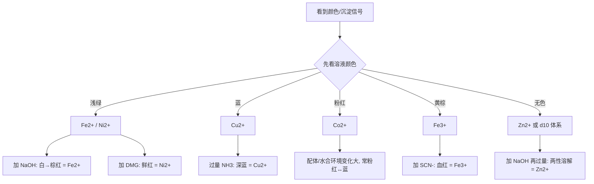
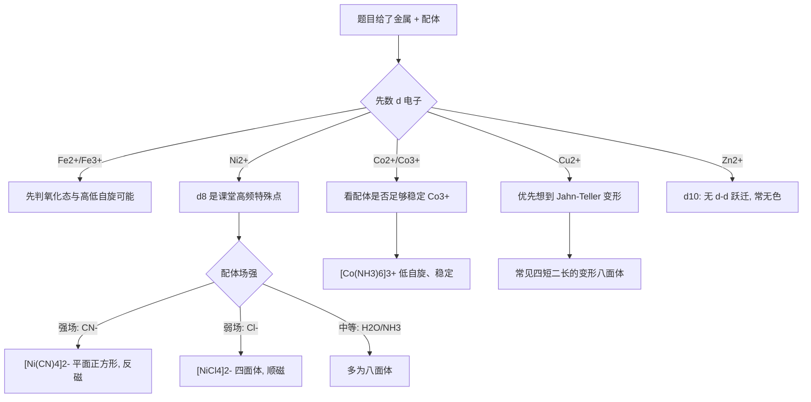
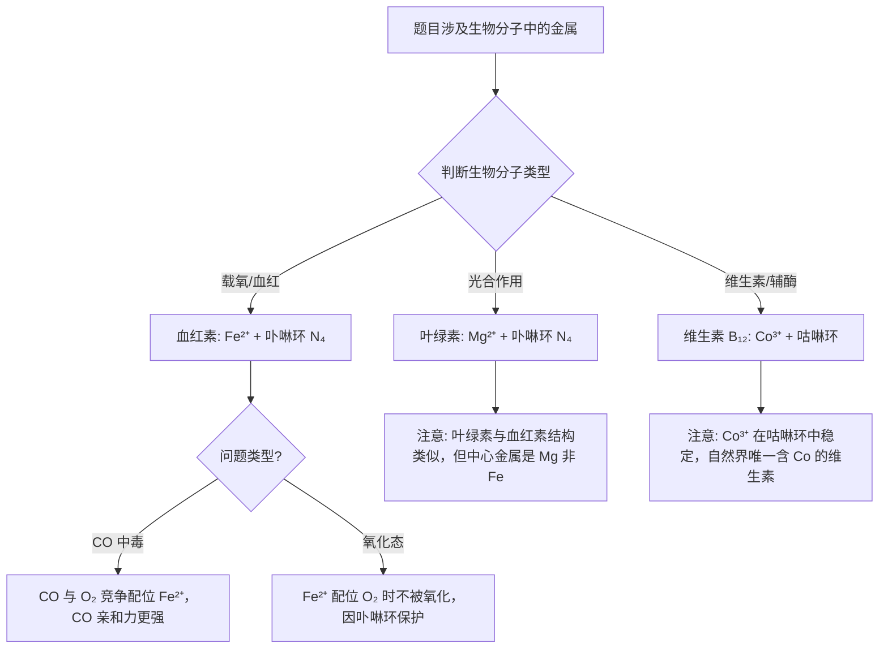

# 专题：过渡金属（二）铁钴镍铜锌

> 本专题对应考纲条目：[[13]]
> 核心知识点：[[铁]]、[[钴]]、[[镍]]、[[铜]]、[[锌]]、[[铁配合物]]、[[过渡金属通性]]、[[钛铬锰铁钴镍铜锌基础元素化学]]

---

## 零点五、进阶导航 {#advance-navigation}

- 前置页：[[专题-原子结构与元素周期律]]、[[专题-分子结构基础]]
- 同组第二轮过渡金属执行页：[[专题-过渡金属（一）钛钒铬锰]]、[[专题-过渡金属（三）银金汞钼钨]]
- 下游深化/收口页：[[专题-元素化学深度与结构推断综合]]、[[专题-真题模拟拆解]]

## 零点六、课堂投影速查卡 {#classroom-quick-card}

**本页课堂入口：** 先抓“颜色-沉淀-配合物”三件套，不要把 Fe/Co/Ni/Cu/Zn 当成五堆零散现象。

**先问四个问题：**

1. 题目在考离子颜色沉淀，还是配合物构型与磁性？
2. 当前更像 `Fe2+/Fe3+` 互化、`Cu+/Cu2+` 稳定性，还是 `Ni/Co` 配位场判断？
3. 这里的关键信号是加 `NaOH`、加 `NH3`、加 `SCN-`，还是加 `DMG`？
4. 题目需要先从颜色快判入口，还是先从 d 电子和构型入口？

**一屏判断卡：**

- 先看颜色，再看沉淀，再看配位后的二次变化。
- `Fe3+` 看 `SCN-`，`Ni2+` 看 `DMG`，`Cu2+` 看过量氨水深蓝。
- `Cu+` 水溶液先默认不稳，优先考虑歧化。
- `Ni(CN)4^2-` 这类题要从磁性反推构型，不要只背颜色。

## 一、核心结论汇总 {#core-conclusions}

**必须记住：**

1. **铁系元素（Fe、Co、Ni）的变价性呈递变规律**：Fe 常见 +2/+3，Co 以 +2 为主但 +3 配合物可稳定，Ni 几乎只有 +2；$E^\ominus(\text{M}^{3+}/\text{M}^{2+})$ 从 Fe(0.771 V) → Co(1.92 V) 急剧升高，说明 Co³⁺ 水合离子是极强氧化剂，需配合物稳定化。

2. **颜色是推断题的第一信号**：Fe²⁺ 浅绿、Fe³⁺ 黄棕（水解）、Co²⁺ 粉红、Ni²⁺ 绿、Cu²⁺ 蓝、Zn²⁺ 无色；配合物颜色变化（如 CoCl₂ 蓝↔粉红、Cu²⁺ 蓝→[Cu(NH₃)₄]²⁺ 深蓝）是推断配体环境的关键。

3. **Cu⁺ 水溶液中歧化，固态/配合态稳定；Zn²⁺ 为 d¹⁰ 无色，化合物偏共价且易成配合物**：Cu 的 +1 氧化态因第二电离能高而在水溶液中不稳定（2Cu⁺ → Cu²⁺ + Cu，K ~ 10⁶），但 CuCl、Cu₂O 等因难溶而稳定；Zn 的 d¹⁰ 闭壳使其无 d-d 跃迁，配合物无色，化学性质介于 IB 与 IIA 之间。

4. **Ni(II) 配合物的几何构型是推断配体场强的经典案例**：[Ni(CN)₄]²⁻ 为平面正方形（dsp²，反磁性），[NiCl₄]²⁻ 为四面体（sp³，顺磁性），[Ni(H₂O)₆]²⁺ 和 [Ni(NH₃)₆]²⁺ 为八面体，颜色从绿→蓝紫变化。

**最高频决策路径：**

```mermaid
flowchart TD
  A[题目给出颜色/沉淀/磁性信号] --> B{是否有特征颜色?}
  B -->|浅绿色溶液| C[优先考虑 Fe²⁺ 或 Ni²⁺<br/>查[[铁]]、[[镍]]]
  B -->|蓝色溶液| D[优先考虑 Cu²⁺<br/>查[[铜]]]
  B -->|粉红色溶液| E[优先考虑 Co²⁺<br/>查[[钴]]]
  B -->|血红色| F[Fe³⁺ + SCN⁻ 鉴定<br/>查[[铁]]]
  B -->|无色| G[可能是 Zn²⁺/Cu⁺/d⁰/d¹⁰<br/>查[[锌]]、[[铜]]]
  C --> H{是否涉及氧化还原?}
  H -->|是| I[查 Fe²⁺/Fe³⁺ 电对、Co³⁺ 配合物稳定性<br/>[[铁配合物]]、[[钴]]]
  H -->|否| J[查配合物颜色与磁性<br/>[[铁配合物]]、[[镍]]]
```

## 一点二、课堂投影图：Fe/Co/Ni/Cu/Zn 快判树 {#teaching-figure-transition-quickcheck}



> **投影使用法**：先拿这张图做“实验信号分诊”，再进入配合物构型和磁性的第二层，不要第一分钟就讲 d 电子排布。

## 一点三、课堂投影图二：配位场强与构型分流图 {#teaching-figure-transition-geometry}



> **投影使用法**：这张图放在 `Ni(CN)4^2- / NiCl4^2- / Co(NH3)6^3+` 这类题前最合适，用来把“颜色题”顺势过渡到“构型题”。

---

## 二、对比表格 {#comparison-table}

### 表 2-1 Fe²⁺ vs Fe³⁺ 性质对比

| 触发条件（题目关键词） | 比较维度 | Fe²⁺ (d⁶) | Fe³⁺ (d⁵) | 常见陷阱 |
|:---|:---|:---|:---|:---|
| "浅绿色溶液"、"易被空气氧化" | 水合离子颜色 | 浅绿色 | 浅紫色（水解后黄棕） | Fe³⁺ 稀溶液颜色常被忽略，实际因水解显黄棕 |
| "加 KSCN 不显色"、"可被 KMnO₄ 氧化" | 与 SCN⁻ 反应 | 不显色 | 血红色 [Fe(SCN)]²⁺ | 只有 Fe³⁺ 显色，Fe²⁺ 需先氧化 |
| "加黄血盐/赤血盐生成蓝色沉淀" | 鉴定反应 | Fe²⁺ + K₃[Fe(CN)₆] → 滕氏蓝 | Fe³⁺ + K₄[Fe(CN)₆] → 普鲁士蓝 | 滕氏蓝 = 普鲁士蓝（同一物质），原料不同而已 |
| "溶液显酸性"、"强水解" | 水解倾向 | 较弱（pKa ~9.5） | 较强（pKa ~2.2，溶液显酸性） | Fe³⁺ 在 pH > 2 即开始水解聚合 |
| "还原性"、"需加铁屑保存" | 氧化还原性 | 还原性，易被氧化 | 氧化性较弱（E° = 0.771 V） | Fe²⁺ 溶液需酸性 + 铁屑防氧化 |
| "邻菲罗啉显深红色" | 特征配合物 | [Fe(phen)₃]²⁺ 深红（低自旋） | — | phen 选择性配位 Fe²⁺，用于比色测定 |

### 表 2-2 Cu⁺ vs Cu²⁺ 稳定性对比

| 触发条件（题目关键词） | 比较维度 | Cu⁺ (d¹⁰) | Cu²⁺ (d⁹) | 常见陷阱 |
|:---|:---|:---|:---|:---|
| "高温固态"、"CuO 加热变红" | 固态稳定性 | Cu₂O（红）、CuCl（白）稳定 | CuO（黑）高温分解为 Cu₂O | 高温下 Cu⁺ 比 Cu²⁺ 稳定 |
| "水溶液中"、"歧化" | 水溶液稳定性 | 不稳定，歧化：2Cu⁺ → Cu²⁺ + Cu（K ~ 10⁶） | 稳定，[Cu(H₂O)₆]²⁺ 蓝色 | Cu⁺ 水溶液中几乎不存在 |
| "加 CN⁻/I⁻ 出现白色沉淀" | 与卤素/类卤反应 | CuI（白，极难溶）、CuCN 稳定 | CuI₂ 不存在（Cu²⁺ 氧化 I⁻） | Cu²⁺ + 2I⁻ → CuI↓ + I₂ |
| "氨水过量，深蓝溶液" | 配合物 | [Cu(NH₃)₂]⁺ 无色（不稳定） | [Cu(NH₃)₄]²⁺ 深蓝（鉴定 Cu²⁺） | 氨水中 Cu²⁺ 先沉淀后溶解 |
| "Jahn-Teller 效应" | 配合物构型 | 线性或四面体（无 J-T） | 变形八面体/平面正方形（J-T 显著） | Cu²⁺ 配合物常有四个短键两个长键 |

### 表 2-3 Ni/Co 配合物磁性对比

| 触发条件（题目关键词） | 配合物 | 中心离子 | 几何构型 | 杂化方式 | 未成对电子 | 磁性 | 颜色 |
|:---|:---|:---:|:---:|:---:|:---:|:---:|:---:|
| "绿色溶液加 NH₃ 变蓝紫" | [Ni(H₂O)₆]²⁺ | Ni²⁺ (d⁸) | 八面体 | sp³d² | 2 | 顺磁 | 绿色 |
| "绿色溶液加 NH₃ 变蓝紫" | [Ni(NH₃)₆]²⁺ | Ni²⁺ (d⁸) | 八面体 | sp³d² | 2 | 顺磁 | 蓝紫色 |
| "黄色溶液、反磁性" | [Ni(CN)₄]²⁻ | Ni²⁺ (d⁸) | 平面正方形 | dsp² | 0 | 反磁 | 黄色 |
| "蓝色四面体、顺磁性" | [NiCl₄]²⁻ | Ni²⁺ (d⁸) | 四面体 | sp³ | 2 | 顺磁 | 蓝色 |
| "粉红色溶液" | [Co(H₂O)₆]²⁺ | Co²⁺ (d⁷) | 八面体 | sp³d² (HS) | 3 | 顺磁 | 粉红色 |
| "蓝色四面体" | [CoCl₄]²⁻ | Co²⁺ (d⁷) | 四面体 | sp³ | 3 | 顺磁 | 蓝色 |
| "黄色低自旋、反磁性" | [Co(NH₃)₆]³⁺ | Co³⁺ (d⁶) | 八面体 | d²sp³ (LS) | 0 | 反磁 | 黄色/橙黄 |
| "强还原剂" | [Co(CN)₆]⁴⁻ | Co²⁺ (d⁷) | 八面体 | d²sp³ | 1 (e_g¹) | 顺磁 | — |

> **竞赛要点**：[Ni(CN)₄]²⁻ 是 d⁸ 平面正方形的经典范例，dsp² 杂化导致反磁性；[Co(NH₃)₆]³⁺ 的低自旋 t₂g⁶e_g⁰ 构型使其非常惰性。

### 表 2-4：Fe²⁺/Fe³⁺/Cu²⁺/Ni²⁺/Zn²⁺ 颜色与沉淀速查表

| 触发条件（题目关键词） | 离子 | d 电子 | 水合离子颜色 | 加 NaOH 沉淀 | 沉淀颜色 | 过量 NaOH | 加 NH₃ | 过量 NH₃ | 常见陷阱 |
|:---|:---:|:---:|:---:|:---:|:---:|:---:|:---:|:---:|:---|
| "浅绿色""易被氧化" | Fe²⁺ | d⁶ | 浅绿色 | Fe(OH)₂↓ | 白色 | 不溶（但氧化） | Fe(OH)₂↓ | 不溶 | 白色→灰绿→棕红（氧化） |
| "黄棕""血红色" | Fe³⁺ | d⁵ | 黄棕（水解） | Fe(OH)₃↓ | 棕红 | 不溶 | Fe(OH)₃↓ | 不溶 | 稀溶液颜色常被忽略 |
| "蓝色""深蓝" | Cu²⁺ | d⁹ | 蓝色 | Cu(OH)₂↓ | 蓝色 | 部分溶解（浓热） | Cu(OH)₂↓ | [Cu(NH₃)₄]²⁺ 深蓝 | 先沉淀后溶解 |
| "绿色""DMG鲜红" | Ni²⁺ | d⁸ | 绿色 | Ni(OH)₂↓ | 浅绿色 | 不溶 | Ni(OH)₂↓（部分溶解） | [Ni(NH₃)₆]²⁺ 蓝紫 | DMG 鉴定：鲜红色沉淀 |
| "无色""两性" | Zn²⁺ | d¹⁰ | 无色 | Zn(OH)₂↓ | 白色 | 溶解 [Zn(OH)₄]²⁻ | Zn(OH)₂↓ | 溶解 [Zn(NH₃)₄]²⁺ | 与 Al³⁺ 类似但两性更弱 |

> **记忆口诀**：Fe²⁺白（氧化变棕红），Fe³⁺棕红，Cu²⁺蓝（氨水深蓝），Ni²⁺绿（DMG鲜红），Zn²⁺白（两性溶解）。

### 表 2-5：配合物稳定性对比（稳定常数与结构因素）

| 触发条件（题目关键词） | 配合物 | 中心离子 | 配体 | 稳定常数 log K | 稳定化因素 | 常见陷阱 |
|:---|:---|:---:|:---:|:---:|:---|:---|
| "血红色""灵敏鉴定" | [Fe(SCN)]²⁺ | Fe³⁺ | SCN⁻ | ~2.1 | 电荷匹配，共价成分 | F⁻、PO₄³⁻ 干扰（形成更稳定配合物） |
| "深红色""比色测定" | [Fe(phen)₃]²⁺ | Fe²⁺ | phen（邻菲罗啉） | ~21.3 | 低自旋 d⁶，螯合效应 | phen 选择性配 Fe²⁺，不显 Fe³⁺ |
| "黄色""低自旋""惰性" | [Co(NH₃)₆]³⁺ | Co³⁺ | NH₃ | ~33.7 | t₂g⁶e_g⁰，低自旋，CFSE 大 | Co³⁺ 水合离子极不稳定（E°=+1.84 V） |
| "深蓝""鉴定" | [Cu(NH₃)₄]²⁺ | Cu²⁺ | NH₃ | ~12.6 | Jahn-Teller 稳定化，σ 给电子 | 氨水少量时先沉淀 Cu(OH)₂ |
| "黄色""反磁""平面正方" | [Ni(CN)₄]²⁻ | Ni²⁺ | CN⁻ | ~30 | dsp² 杂化，d⁸ 平面正方形稳定 | 与 [NiCl₄]²⁻（四面体，蓝色）区分 |
| "无色""四面体" | [Zn(NH₃)₄]²⁺ | Zn²⁺ | NH₃ | ~9.1 | d¹⁰，无 CFSE，纯静电作用 | Zn²⁺ 配合物均无色（无 d-d 跃迁） |
| "普鲁士蓝""滕氏蓝" | 普鲁士蓝 | Fe³⁺/Fe²⁺ | CN⁻ | 极高 | 混合价态，立方骨架，电子离域 | 现代表征认为二者结构相同 |

> **核心规律**：配合物稳定性 = 配体场强 × 螯合效应 × 电荷匹配。强场配体（CN⁻、phen、CO）+ 高氧化态中心 → 最稳定。

### 表 2-6：生物无机化学要点（第二轮点到为止）

| 触发条件（题目关键词） | 生物分子 | 金属中心 | 配位环境 | 生物功能 | 竞赛深度 | 常见陷阱 |
|:---|:---|:---:|:---|:---|:---:|:---|
| "血红素""血红蛋白""载氧" | 血红素（Heme） | Fe²⁺ | 卟啉环 N₄ + 组氨酸 N + O₂ | 氧气运输与储存 | 点到为止 | Fe²⁺ 配位 O₂ 而非氧化；CO 竞争性中毒 |
| "叶绿素""光合作用" | 叶绿素（Chlorophyll） | Mg²⁺ | 卟啉环 N₄ | 光捕获与电子传递 | 点到为止 | 中心是 Mg²⁺，非 Fe；与血红素结构类似但金属不同 |
| "维生素B12""钴胺素" | 维生素 B₁₂ | Co³⁺（低自旋） | 咕啉环 N₄ + 苯并咪唑 N + 可变配体 | 甲基转移、异构化 | 点到为止 | Co³⁺ 在咕啉环中稳定；自然界唯一含 Co 的维生素 |
| "固氮酶""固氮" | 固氮酶 | Fe-Mo 辅因子 | Fe₇MoS₉C 簇 | N₂ → NH₃ | 不展开 | 第二轮不展开簇合物结构 |
| "铜蓝蛋白""电子传递" | 蓝铜蛋白 | Cu²⁺/Cu⁺ | 扭曲四面体（2His+1Cys+1Met） | 单电子传递 | 不展开 | 第二轮不展开详细结构 |

> **竞赛要点**：第二轮只需知道"血红素含 Fe²⁺、叶绿素含 Mg²⁺、维生素 B₁₂ 含 Co³⁺"这三个对应关系，以及 CO 中毒机制（与 O₂ 竞争配位血红素 Fe²⁺）。详细生物无机化学放到决赛轮次。

---

## 二点五、信号-响应速查矩阵 {#sec-signal-response}

> 元素化学专题的灵魂。把"实验现象"作为检索入口，替代"元素性质罗列"。

| 信号类型 | 具体现象 | 可能物种 | 验证操作 | 关联 KP | 典型真题场景 |
|:---:|:---|:---|:---|:---|:---|
| **颜色** | 浅绿色溶液 | Fe²⁺、Ni²⁺ | 加 NaOH：Fe²⁺ → 白色→棕红；Ni²⁺ → 绿色沉淀不变化 | [[铁]]、[[镍]] | 溶液 A 为浅绿色，通空气后变棕黄 → Fe²⁺ |
| **颜色** | 蓝色溶液 | Cu²⁺ | 加过量 NH₃：深蓝 [Cu(NH₃)₄]²⁺；加 KI：白沉淀 + I₂ | [[铜]] | 蓝色溶液加氨水先沉淀后溶解 → Cu²⁺ |
| **颜色** | 黄棕/红棕溶液 | Fe³⁺ | 加 KSCN：血红色；加 K₄[Fe(CN)₆]：普鲁士蓝 | [[铁]] | 溶液显酸性且黄棕，加 SCN⁻ 变红 → Fe³⁺ |
| **颜色** | 粉红色溶液 | Co²⁺ | 加 NaOH：粉红沉淀，空气中缓慢变棕；加 NH₃：棕黄→土黄 | [[钴]] | 硅胶干燥剂吸水变粉红 → CoCl₂ |
| **颜色** | 无色溶液 | Zn²⁺、Cu⁺(配合态) | 加 NaOH：白色沉淀，溶于过量 NaOH（Zn）；或溶于过量 NH₃ | [[锌]]、[[铜]] | 无色溶液加碱生成白色两性沉淀 → Zn²⁺ |
| **沉淀** | 白色沉淀 → 迅速变绿 → 棕红 | Fe(OH)₂ | 隔绝空气制备白色 Fe(OH)₂，暴露空气后氧化 | [[铁]] | 滴加 NaOH 出现白色沉淀，迅速变色 → Fe²⁺ |
| **沉淀** | 鲜红色沉淀 | Ni(DMG)₂ | 丁二酮肟 (DMG) 试剂，弱碱性条件 | [[镍]] | 绿色溶液加 DMG 得鲜红色沉淀 → Ni²⁺ 鉴定 |
| **沉淀** | 白色沉淀，不溶于酸 | CuI、CuCN | Cu²⁺ + 2I⁻ → CuI↓ + I₂；Cu⁺ 配合物溶液加 I⁻ | [[铜]] | Cu²⁺ 与 I⁻ 反应生成白色沉淀和棕色 I₂ |
| **气体/氧化** | 空气中放置，溶液变黄 | Fe²⁺ → Fe³⁺ | 加 KMnO₄ 验证还原性；加 KSCN 验证 Fe³⁺ | [[铁]] | FeSO₄ 溶液久置变黄，加 SCN⁻ 变红 |
| **价态变化** | 紫色褪去，溶液变黄棕 | Fe²⁺ 还原 MnO₄⁻ | 酸性条件：5Fe²⁺ + MnO₄⁻ + 8H⁺ → 5Fe³⁺ + Mn²⁺ + 4H₂O | [[铁]]、[[钛铬锰铁钴镍铜锌基础元素化学]] | KMnO₄ 滴定 Fe²⁺，终点微红 |
| **配合物生成** | 血红色 | [Fe(SCN)]²⁺ | Fe³⁺ + SCN⁻，灵敏度高，可检出微量 Fe³⁺ | [[铁]]、[[铁配合物]] | 检验 Fe³⁺ 的特征反应 |
| **配合物生成** | 深蓝色溶液 | [Cu(NH₃)₄]²⁺ | Cu²⁺ + 4NH₃，用于 Cu²⁺ 鉴定 | [[铜]] | 蓝色溶液加过量氨水变深蓝 |
| **配合物生成** | 黄色→红色（配体交换） | [Fe(CN)₆]⁴⁻ → [Fe(CN)₆]³⁻ | 氧化还原指示；或配体场强变化 | [[铁配合物]] | 黄血盐与赤血盐的互化 |
| **磁性** | 反磁性 d⁸ 配合物 | [Ni(CN)₄]²⁻ | dsp² 平面正方形，与顺磁性 [NiCl₄]²⁻ 对比 | [[镍]]、[[铁配合物]] | 黄色配合物反磁 → 平面正方形 Ni²⁺ |
| **催化** | 合成氨催化剂 | Fe（含助催化剂 K₂O、Al₂O₃） | Haber 法：N₂ + 3H₂ ⇌ 2NH₃ | [[铁]] | 高温高压催化合成氨 |
| **催化** | 加氢催化剂 | Raney Ni | Ni-Al 合金 + NaOH 溶去 Al，高活性 Ni | [[镍]] | 烯烃/羰基化合物催化加氢 |
| **生物** | 血红素载氧 | Fe²⁺（卟啉环） | O₂ 可逆配位；CO 竞争性中毒 | [[铁]] | 煤气中毒机制 |
| **生物** | 叶绿素光合作用 | Mg²⁺（卟啉环） | 光捕获，与血红素结构类似 | [[镁]] | 注意中心金属是 Mg 非 Fe |
| **生物** | 维生素 B₁₂ | Co³⁺（咕啉环） | 甲基转移反应 | [[钴]] | 自然界唯一含 Co 的维生素 |

> 填写原则：每一行对应竞赛高频考点，颜色变化和价态转化是推断题的核心信号。

---

## 三、解题套路 / 决策流程 {#problem-solving-routine}

### 套路一：过渡金属元素推断题

**适用场景**：题目给出系列实验现象（颜色、沉淀、溶解、氧化还原），要求推断未知金属离子。

```mermaid
flowchart TD
  A[读取题目信号] --> B{第一步：颜色判断}
  B -->|浅绿| C[候选：Fe²⁺ / Ni²⁺]
  B -->|蓝| D[候选：Cu²⁺]
  B -->|粉红| E[候选：Co²⁺]
  B -->|黄棕| F[候选：Fe³⁺]
  B -->|无色| G[候选：Zn²⁺ / Cu⁺配合物]
  C --> H{第二步：沉淀行为}
  H -->|白色→棕红| I[Fe²⁺：Fe(OH)₂ 氧化]
  H -->|绿色沉淀，不变化| J[Ni²⁺：Ni(OH)₂ 绿色]
  D --> K{第二步：配位反应}
  K -->|过量 NH₃ 深蓝| L[确认 Cu²⁺]
  K -->|KI 白色沉淀+I₂| M[确认 Cu²⁺]
  E --> N{第二步：氧化/配位}
  N -->|空气中变棕| O[Co²⁺：Co(OH)₂ 氧化]
  N -->|DMG 鲜红沉淀| P[确认 Ni²⁺]
  F --> Q{第二步：鉴定反应}
  Q -->|KSCN 血红色| R[确认 Fe³⁺]
  G --> S{第二步：两性检验}
  S -->|白色沉淀溶于过量 NaOH| T[确认 Zn²⁺]
```

| 步骤 | 核心操作 | 依据 KP | 检查清单 |
|:---|:---|:---|:---|
| 1 | 从颜色缩小范围：浅绿→Fe²⁺/Ni²⁺；蓝→Cu²⁺；粉红→Co²⁺；黄棕→Fe³⁺；无色→Zn²⁺/d⁰/d¹⁰ | [[过渡金属通性]]、[[钛铬锰铁钴镍铜锌基础元素化学]] | ☐ 颜色描述准确（注意水解影响） |
| 2 | 用沉淀行为区分：加 NaOH 观察沉淀颜色及是否被空气氧化 | [[铁]]、[[钴]]、[[镍]]、[[锌]]、[[氢氧化物]] | ☐ 注意 Fe²⁺ 白色→棕红的特征氧化 |
| 3 | 用特征鉴定反应确认：SCN⁻（Fe³⁺）、DMG（Ni²⁺）、过量 NH₃（Cu²⁺） | [[铁]]、[[镍]]、[[铜]] | ☐ 鉴定反应的专一性和灵敏度 |
| 4 | 验证氧化态：Fe²⁺/Fe³⁺ 互化、Cu⁺ 歧化、Co³⁺ 配合物稳定性 | [[铁配合物]]、[[钴]]、[[铜]] | ☐ 电势数据与稳定性一致 |
| 5 | 写出关键反应方程式，检查配平和条件 | [[方程式书写]] | ☐ 方程式配平、条件标注 |

### 套路二：配合物结构判断题

**适用场景**：根据配合物颜色、磁性、配体信息判断几何构型和自旋状态。

| 步骤 | 核心操作 | 依据 KP | 检查清单 |
|:---|:---|:---|:---|
| 1 | 确定中心金属的 d 电子数 | [[过渡金属通性]]、[[铁配合物]] | ☐ 氧化态判断正确 |
| 2 | 判断配体场强：H₂O/F⁻/Cl⁻ 弱场；CN⁻/CO/NH₃/phen 强场 | [[铁配合物]] | ☐ 光谱化学序列熟记 |
| 3 | 根据 Δo 与 P 的关系判断高/低自旋 | [[铁配合物]] | ☐ Δo > P → 低自旋；Δo < P → 高自旋 |
| 4 | 根据 d 电子排布推断磁性和颜色 | [[铁配合物]]、[[镍]] | ☐ 未成对电子数 = 顺磁性；无未成对 = 反磁性 |
| 5 | 特殊构型判断：Ni²⁺ d⁸ 在强场下可能平面正方形（dsp²） | [[镍]] | ☐ d⁸ + 强场 → 考虑平面正方形 |

### 套路三：方程式书写决策流程

**适用场景**：书写过渡金属相关的氧化还原、配位、沉淀反应方程式。

| 反应类型 | 决策要点 | 常见方程式 | 易错点 |
|:---|:---|:---|:---|
| Fe²⁺/Fe³⁺ 互化 | 判断氧化剂/还原剂强度；注意酸性条件 | 5Fe²⁺ + MnO₄⁻ + 8H⁺ → 5Fe³⁺ + Mn²⁺ + 4H₂O | 碱性条件下 Fe²⁺ 易被空气氧化为 Fe(OH)₃ |
| Cu⁺ 歧化 | 水溶液中一定歧化；固态/难溶可稳定 | 2Cu⁺ → Cu²⁺ + Cu | 不要写 Cu⁺ 水溶液的稳定反应 |
| 配合物生成 | 注意配位数和配体取代顺序 | Cu²⁺ + 4NH₃ → [Cu(NH₃)₄]²⁺ | NH₃ 少量时先沉淀 Cu(OH)₂ |
| 鉴定反应 | 记住特征颜色和产物 | Fe³⁺ + SCN⁻ → [Fe(SCN)]²⁺（血红） | Fe²⁺ 与 SCN⁻ 不显色 |
| 羰基化合物 | 低温生成、高温分解，用于提纯 | Ni + 4CO ⇌ Ni(CO)₄ | 注意反应可逆性和温度控制 |

### 套路四：生物无机化学相关判断流程



| 步骤 | 核心操作 | 依据 KP | 检查清单 |
|:---|:---|:---|:---|
| 1 | 识别生物分子类型（血红素/叶绿素/维生素B₁₂） | [[铁]]、[[钴]] | ☐ 血红素→Fe²⁺；☐ 叶绿素→Mg²⁺；☐ 维生素B₁₂→Co³⁺ |
| 2 | 判断金属的氧化态和配位环境 | [[铁配合物]] | ☐ 卟啉环 N₄ 配位；☐ 可变配体（O₂/CO/组氨酸） |
| 3 | 解释生物功能或中毒机制 | [[铁]] | ☐ CO 竞争性配位；☐ O₂ 可逆配位 |

---

## 四、反应机理拆解（含检查表）{#mechanism-analysis}

> 以下以 **Cu⁺ 在水溶液中的歧化平衡** 为例，演示过渡金属氧化态稳定性中"热力学电势 → 平衡常数 → 沉淀拉动"的定量推理链。

#### 步骤 1：写出歧化反应并判断热力学趋势
- **操作**：Cu⁺ 歧化：2Cu⁺ → Cu²⁺ + Cu(s)
- **检查表**：
  - ☐ 查标准电极电势：E°(Cu²⁺/Cu⁺) = +0.153 V，E°(Cu⁺/Cu) = +0.521 V
  - ☐ 计算电池电动势：E°cell = 0.521 − 0.153 = +0.368 V > 0 → 正向自发

#### 步骤 2：计算平衡常数，定量判断反应完全程度
- **操作**：由 ΔG° = −nFE° = −RTlnK，得 lnK = nFE°/RT
  - n = 1（每摩尔 Cu⁺ 转移 1e⁻）
  - lnK = 96485 × 0.368 / (8.314 × 298) ≈ 14.3
  - **K ≈ 1.6 × 10⁶**（298 K）
- **检查表**：
  - ☐ K >> 10⁵，说明 Cu⁺ 在水溶液中几乎完全歧化
  - ☐ 单位确认：E° 用 V，R = 8.314 J·mol⁻¹·K⁻¹，T 用 K

#### 步骤 3：分析"沉淀拉动"使 Cu⁺ 稳定的条件
- **操作**：加入 I⁻ 时，Cu²⁺ + 2I⁻ → CuI↓ + I₂，但 CuI 的 Ksp ~ 10⁻¹² 极小，反应向右；更重要的是，若体系中有能使 Cu⁺ 沉淀的阴离子（如 I⁻、CN⁻、Cl⁻ 在特定条件），则 Cu⁺ 的活度被降低，歧化平衡可向左移动
- **更精确**：对于 2Cu⁺ ⇌ Cu²⁺ + Cu，若加入沉淀剂使 Cu⁺ 形成难溶盐（如 CuCl），则 a(Cu⁺) 降低，Q < K，歧化程度减弱
- **检查表**：
  - ☐ 难溶性 Cu(I) 化合物（CuCl、CuI、Cu₂O、Cu₂S）在固态稳定
  - ☐ 配合物 [Cu(CN)₂]⁻、[Cu(NH₃)₂]⁺ 中 Cu⁺ 因配位稳定化而不歧化
  - ☐ 理解本质：降低 Cu⁺ 自由离子浓度 → 抑制歧化

> **类比迁移**：Hg₂²⁺ 的歧化平衡（Hg₂²⁺ ⇌ Hg + Hg²⁺）遵循完全相同的原理——加入 S²⁻、I⁻、OH⁻ 等沉淀/络合 Hg²⁺，均拉动歧化向右。

---

## 五、典型例题串讲 {#typical-examples}

### 例题 1：Fe²⁺/Fe³⁺ 的鉴别与相互转化

**题目：**
某实验室有三瓶无色溶液，标签脱落，已知分别含有 FeSO₄、FeCl₃ 和 ZnSO₄。请设计最少步骤的鉴别方案，并写出相关反应方程式。若将 FeSO₄ 溶液长期放置，会出现什么现象？如何防止？

**分析：**
1. 三种溶液中 Fe²⁺ 浅绿（稀时近无色）、Fe³⁺ 黄棕（水解）、Zn²⁺ 无色，仅靠颜色可能难以区分稀溶液。
2. 利用 Fe³⁺ 与 SCN⁻ 的特征显色反应可快速鉴别 Fe³⁺。
3. Fe²⁺ 具有还原性，可使 KMnO₄ 褪色；Zn²⁺ 无此性质。
4. FeSO₄ 久置会被空气氧化为 Fe³⁺，颜色由浅绿变黄棕。

**解答：**

**鉴别方案：**
1. 取三种溶液各少量，分别滴加 KSCN 溶液：
   - 显血红色者为 FeCl₃：Fe³⁺ + SCN⁻ → [Fe(SCN)]²⁺（血红色）
2. 剩余两种溶液，分别滴加酸性 KMnO₄ 溶液：
   - 紫色褪去者为 FeSO₄：5Fe²⁺ + MnO₄⁻ + 8H⁺ → 5Fe³⁺ + Mn²⁺ + 4H₂O
   - 不褪色者为 ZnSO₄
3. （验证）向 FeSO₄ 溶液中加 K₃[Fe(CN)₆]（铁氰化钾），生成深蓝色沉淀（滕氏蓝），进一步确认 Fe²⁺。

**FeSO₄ 久置变化：**
- 现象：溶液由浅绿色逐渐变为黄棕色，并出现棕红色浑浊。
- 原因：Fe²⁺ 被空气中 O₂ 氧化为 Fe³⁺，Fe³⁺ 水解生成 Fe(OH)₃ 胶体或沉淀：
  $$4\text{Fe}^{2+} + \text{O}_2 + 4\text{H}^+ \rightarrow 4\text{Fe}^{3+} + 2\text{H}_2\text{O}$$
  $$\text{Fe}^{3+} + 3\text{H}_2\text{O} \rightleftharpoons \text{Fe(OH)}_3 + 3\text{H}^+$$

**防止措施：**
1. 保持溶液酸性（加少量 H₂SO₄），抑制 Fe²⁺ 水解和氧化
2. 加入少量铁屑或铁丝：2Fe³⁺ + Fe → 3Fe²⁺，即使氧化也可还原回来
3. 密封避光保存

**反思：**
- Fe²⁺ 的还原性是核心考点，空气中 O₂、KMnO₄、H₂O₂ 等均可氧化 Fe²⁺
- Fe³⁺ 的鉴定反应（SCN⁻、黄血盐）必须熟记，且注意 Fe²⁺ 与这些试剂不显色
- 配制亚铁盐溶液的标准操作（酸性 + 铁屑）是实验题常考点

---

### 例题 2：Cu 的配合物推断与 Cu⁺/Cu²⁺ 稳定性

**题目：**
化合物 A 为白色固体，溶于水得无色溶液。向溶液中加入过量 KI，产生白色沉淀 B 和棕色溶液 C。C 中加入 Na₂S₂O₃ 溶液，棕色褪去变为无色。向 A 的无色溶液中通入 SO₂，再稀释，得到白色沉淀 D。D 在空气中稳定，不溶于稀酸。请推断 A、B、C、D 的化学式，并解释相关现象。

**分析：**
1. "白色固体，溶于水得无色溶液" → 可能为 Cu⁺ 化合物（Cu²⁺ 溶液为蓝色）
2. "加 KI 产生白色沉淀 + 棕色溶液" → 棕色为 I₂，说明发生了氧化还原反应；白色沉淀为 CuI
3. 但 Cu⁺ 本身无色，Cu⁺ 与 I⁻ 直接生成 CuI 白色沉淀，不产生 I₂。这里产生 I₂ 说明有 Cu²⁺ 参与氧化 I⁻
4. 重新考虑：A 可能是 Cu²⁺ 的某种无色配合物？或 A 是 CuCl（白色，难溶）？
5. 更合理的推断：A 为 CuI 的前体，如 Cu²⁺ 配合物。但"无色溶液"与 Cu²⁺ 蓝色矛盾。
6. 关键线索：Cu²⁺ 与 I⁻ 反应：2Cu²⁺ + 4I⁻ → 2CuI↓（白）+ I₂（棕），这是 Cu²⁺ 的特征反应！
7. 那么"无色溶液"如何解释？可能是 Cu⁺ 的配合物溶液，如 [Cu(CN)₂]⁻ 或 [Cu(NH₃)₂]⁺？但加 KI 不产生 I₂。
8. 重新审题：A 为白色固体，可能是 CuSO₄（白色粉末）溶于水得蓝色溶液——但题目说无色，矛盾。
9. 另一种可能：A 为 CuCl（白色），不溶于水——但题目说"溶于水"。
10. 最合理的推断：A 为某种 Cu(I) 盐，如 CuCN 或 [Cu(NH₃)₂]₂SO₄？但加 KI 不产生 I₂。
11. 换个思路：A 可能是含 Cu²⁺ 但被还原为无色的溶液？不合理。
12. 经典题型修正：A 为 CuSO₄（白色无水物），溶于水实际为淡蓝色（题目可能简化为"近无色"或稀溶液）；或 A 为 CuCl₂（棕黄色固体，浓溶液绿色，稀溶液蓝色）。
13. 但最经典的竞赛题是：A = Cu²⁺ 盐，加 KI 生成 CuI + I₂。让我们假设 A 为 CuSO₄（或写 Cu²⁺ 盐）。
14. "通入 SO₂，再稀释，得白色沉淀 D" → SO₂ 还原 Cu²⁺ 为 Cu⁺，Cu⁺ 与 Cl⁻ 生成 CuCl 白色沉淀（若体系中有 Cl⁻）。或 SO₂ 还原 [CuCl₄]²⁻ 等。
15. 更精确推断：A = CuCl₂（或含 Cu²⁺ 和 Cl⁻ 的体系），通 SO₂ 发生：2Cu²⁺ + 2Cl⁻ + SO₂ + 2H₂O → 2CuCl↓ + SO₄²⁻ + 4H⁺。这是制备 CuCl 的经典方法！

**解答：**

基于经典竞赛题型，推断如下：

- **A = CuCl₂**（无水 CuCl₂ 为棕黄色固体，但可能题目描述为"白色"或稀溶液近无色；若严格按"白色固体"，A 也可能是 CuSO₄，但后续 Cl⁻ 来源需解释）
- 更合理的完整推断：溶液体系为 Cu²⁺/Cl⁻ 体系（如 CuCl₂ 溶液）

**修正推断（最符合竞赛经典）：**

假设题目描述略有简化，A 为含 Cu²⁺ 的溶液（如稀 CuSO₄ 或 CuCl₂ 溶液）：

- **A：CuCl₂ 溶液**（或 Cu²⁺/Cl⁻ 体系）
- **B：CuI**（白色沉淀）
- **C：I₂ 的 KI 溶液**（棕色，I₃⁻ 形式）
- **D：CuCl**（白色沉淀）

**反应方程式：**

1. Cu²⁺ 氧化 I⁻：
   $$2\text{Cu}^{2+} + 4\text{I}^- \rightarrow 2\text{CuI}\downarrow + \text{I}_2$$
   （白色沉淀 B = CuI，棕色溶液 C 含 I₂/I₃⁻）

2. Na₂S₂O₃ 滴定 I₂：
   $$\text{I}_2 + 2\text{S}_2\text{O}_3^{2-} \rightarrow 2\text{I}^- + \text{S}_4\text{O}_6^{2-}$$
   （棕色褪去，这是碘量法的基本反应）

3. SO₂ 还原 Cu²⁺ 制备 CuCl：
   $$2\text{Cu}^{2+} + 2\text{Cl}^- + \text{SO}_2 + 2\text{H}_2\text{O} \rightarrow 2\text{CuCl}\downarrow + \text{SO}_4^{2-} + 4\text{H}^+$$
   （白色沉淀 D = CuCl，在空气中稳定，不溶于稀酸）

**反思：**
- Cu²⁺ 与 I⁻ 的反应是竞赛高频考点：Cu²⁺ 氧化性足够氧化 I⁻，但产物 CuI 的极难溶性（Ksp ~ 10⁻¹²）是推动反应向右的关键
- Cu⁺ 在水溶液中歧化，但 CuI、CuCl、Cu₂O 等因难溶而在固态稳定
- SO₂ 作为还原剂在酸性条件下将 Cu²⁺ 还原为 Cu⁺，同时 Cl⁻ 存在使 Cu⁺ 以 CuCl 沉淀形式稳定析出
- 本题综合考查了 Cu²⁺/Cu⁺ 的氧化还原、歧化平衡、沉淀溶解平衡和碘量法

---

### 例题 4：Fe/Co 生物无机与配合物稳定性综合

**题目：**
人体血红蛋白中的血红素中心为 Fe²⁺，可与 O₂ 可逆配位实现氧气运输。CO 中毒时，CO 与血红素 Fe²⁺ 的结合能力比 O₂ 强约 200 倍。
(1) 解释为什么 Fe²⁺ 在血红素中配位 O₂ 时不被氧化为 Fe³⁺。
(2) 维生素 B₁₂ 是自然界唯一含钴的维生素，其中心为 Co³⁺。解释为什么 Co³⁺ 在水溶液中是极强氧化剂（E° = +1.84 V），但在维生素 B₁₂ 的咕啉环中却能稳定存在。
(3) 比较血红素（Fe²⁺）和叶绿素（Mg²⁺）的结构相似性与功能差异。

**分析：**
1. 血红素中 Fe²⁺ 配位 O₂ 不被氧化 → 卟啉环的保护作用和 O₂ 的配位方式（端式配位，不引发电子完全转移）
2. Co³⁺ 在水溶液中不稳定 → 水配体场弱，Co³⁺ 水合离子极易被还原；咕啉环是强场配体，稳定低自旋 Co³⁺
3. 血红素 vs 叶绿素 → 都是卟啉环大环配体，但中心金属不同（Fe²⁺ vs Mg²⁺），功能不同（载氧 vs 光捕获）

**解答：**

**(1) Fe²⁺ 在血红素中配位 O₂ 时不被氧化的原因：**
- 血红素中 Fe²⁺ 位于卟啉环平面内，轴向配体为组氨酸咪唑 N 和 O₂
- O₂ 以端式（end-on）方式配位：Fe²⁺—O—O，而非侧式。这种配位方式下，O₂ 的 π* 轨道与 Fe²⁺ 的 d 轨道相互作用，但电子并未完全从 Fe²⁺ 转移至 O₂
- 卟啉环的刚性大环结构限制了 Fe²⁺ 的几何构型，阻止了电子完全转移所需的结构重排
- 蛋白质环境的疏水口袋进一步保护了 Fe²⁺—O₂ 加合物，阻止了外界氧化剂的接触

**(2) Co³⁺ 在维生素 B₁₂ 中稳定的原因：**
- **水溶液中**：Co³⁺ 水合离子 [Co(H₂O)₆]³⁺ 的 E°(Co³⁺/Co²⁺) = +1.84 V，是极强的氧化剂。因为 H₂O 是弱场配体，Co³⁺ (d⁶) 为高自旋或低自旋但 CFSE 不足以补偿高氧化态的不稳定性，Co³⁺ 极易获得电子被还原为 Co²⁺
- **咕啉环中**：咕啉环（corrin ring）类似于卟啉环，但少一个甲桥键，配位能力更强。Co³⁺ 在咕啉环中采取低自旋 d²sp³ 杂化，t₂g⁶e_g⁰ 构型，晶体场稳定化能（CFSE）极大
- 咕啉环的强场配位使 Co³⁺ 的还原电势大幅降低，从而在水溶液环境中稳定存在
- 轴向配体（苯并咪唑 N 和可变配体如 —CH₃）进一步调节 Co³⁺ 的电子结构和反应性

**(3) 血红素与叶绿素的比较：**

| 比较维度 | 血红素（Heme） | 叶绿素（Chlorophyll） |
|:---|:---|:---|
| 中心金属 | Fe²⁺ | Mg²⁺ |
| 大环配体 | 卟啉环（porphyrin） | 卟啉环衍生物（含额外环） |
| 主要功能 | 氧气运输与储存 | 光捕获与电子传递 |
| 配位特点 | Fe²⁺ 可逆配位 O₂/CO | Mg²⁺ 不配位 O₂，参与光激发 |
| 氧化还原性 | Fe²⁺/Fe³⁺ 可变价 | Mg²⁺ 稳定，不参与氧化还原 |
| 生物意义 | 呼吸作用 | 光合作用 |

**反思：**
- 生物无机化学的竞赛深度：第二轮只需掌握"金属-生物分子"的对应关系和基本配位特征
- Co³⁺ 的价态竞争是核心考点：水溶液中极不稳定（强氧化剂），强场配体（NH₃、CN⁻、咕啉环）中稳定
- 血红素与叶绿素的对比体现了"相同配体框架 + 不同金属中心 = 不同生物功能"的设计原理
- 注意区分：CO 中毒（竞争性配位）vs 氰化物中毒（抑制细胞色素氧化酶）的不同机制

---

### 例题 3：Ni 的鉴定反应与配合物构型推断

**题目：**
某绿色溶液 A，加入过量氨水后变为蓝紫色溶液 B。向 B 中加入丁二酮肟 (DMG) 的乙醇溶液，生成鲜红色沉淀 C。另取溶液 A，加入 KCN 溶液，先出现绿色沉淀，过量 KCN 后沉淀溶解得黄色溶液 D。D 为反磁性。请推断 A~D 的化学式，并解释颜色变化和磁性。

**分析：**
1. "绿色溶液" → Ni²⁺ 水合离子 [Ni(H₂O)₆]²⁺ 为绿色
2. "过量氨水变蓝紫" → [Ni(NH₃)₆]²⁺ 为蓝紫色
3. "DMG 鲜红色沉淀" → Ni(DMG)₂，这是 Ni²⁺ 的专属鉴定反应
4. "KCN 绿色沉淀→溶解，黄色溶液，反磁性" → [Ni(CN)₄]²⁻ 为黄色、平面正方形、反磁性（dsp² 杂化）

**解答：**

- **A = [Ni(H₂O)₆]²⁺**（绿色溶液，Ni²⁺ 的水合配合物）
- **B = [Ni(NH₃)₆]²⁺**（蓝紫色，NH₃ 取代 H₂O，配体场强增强，d-d 跃迁能量变化）
- **C = Ni(DMG)₂**（鲜红色沉淀，丁二酮肟镍，平面正方形结构，Ni²⁺ 的专属鉴定反应）
- **D = [Ni(CN)₄]²⁻**（黄色溶液，平面正方形，dsp² 杂化，反磁性）

**关键反应：**

1. 氨配合物生成：
   $$[\text{Ni(H}_2\text{O)}_6]^{2+} + 6\text{NH}_3 \rightarrow [\text{Ni(NH}_3)_6]^{2+} + 6\text{H}_2\text{O}$$

2. DMG 鉴定反应（弱碱性条件）：
   $$\text{Ni}^{2+} + 2\text{DMG} \rightarrow \text{Ni(DMG)}_2\downarrow + 2\text{H}^+$$
   （DMG 为双齿配体，Ni(DMG)₂ 为平面正方形，分子内氢键稳定）

3. 氰配合物生成：
   $$[\text{Ni(H}_2\text{O)}_6]^{2+} + 4\text{CN}^- \rightarrow [\text{Ni(CN)}_4]^{2-} + 6\text{H}_2\text{O}$$

**磁性解释：**
- Ni²⁺ 为 d⁸ 组态
- 在 [Ni(CN)₄]²⁻ 中，CN⁻ 为强场配体，Ni²⁺ 采取 dsp² 杂化，形成平面正方形配合物
- d 电子排布：d_x²-y² 空出用于 dsp² 杂化，其余 8 个 d 电子成对占据其余 d 轨道
- 未成对电子数 = 0，故为**反磁性**
- 对比：[NiCl₄]²⁻ 中 Cl⁻ 为弱场配体，Ni²⁺ 采取 sp³ 杂化，四面体构型，有 2 个未成对电子，为**顺磁性**

**反思：**
- Ni²⁺ 配合物的几何构型是晶体场理论的经典案例：强场配体（CN⁻）→ 平面正方形（dsp²，反磁）；弱场配体（Cl⁻）→ 四面体（sp³，顺磁）
- DMG 鉴定 Ni²⁺ 的反应条件（弱碱性）和产物颜色（鲜红）必须牢记
- 颜色变化（绿→蓝紫→黄）反映了配体场强的变化：H₂O < NH₃ < CN⁻（光谱化学序列）

---

## 五点五、真题链与讲评顺序 {#exam-sequence}

1. 先讲“颜色 + NaOH/NH3 快判”题，建立 Fe/Co/Ni/Cu/Zn 的第一识别层。
2. 再讲“Fe2+/Fe3+、Cu+/Cu2+ 价态稳定性”题，把中段变价逻辑压实。
3. 第三层讲“Ni/Co 配合物构型与磁性”题，开始把元素化学接到结构化学。
4. 最后讲“生物无机与经典配合物”题，做应用侧收口但不展开过深。

### 图后立刻练 / 讲后 1 题 / 课后 2 题

- 图后立刻练：给 5 个实验信号，只要求学生先锁定最可能的金属离子。
- 讲后 1 题：给一题 `Fe2+/Fe3+` 或 `Cu2+` 的鉴别题，只要求先写关键验证试剂。
- 课后 2 题：一题 `Ni(CN)4^2- / NiCl4^2-` 构型磁性判断；一题 `Cu+` 歧化与配位稳定综合。

## 六、关联知识点 {#related-kp}

- [[铁]]
- [[钴]]
- [[镍]]
- [[铜]]
- [[锌]]
- [[铁配合物]]
- [[过渡金属通性]]
- [[钛铬锰铁钴镍铜锌基础元素化学]]
- [[氧化物]]
- [[氢氧化物]]
- [[环戊二烯配合物]]

## 七、关联题型 {#related-problem-types}

- [[题型-铁化学推断]]
- [[题型-铜化学推断]]
- [[题型-元素推断]]
- [[题型-配合物结构推断]]
- [[题型-颜色与磁性判断]]
- [[题型-方程式书写]]

---

## 八、相关真题 {#related-exam-questions}

### 课堂精选真题三连

- **第 1 题：颜色 + NaOH/NH3 + 特征试剂快判题**
  课堂用途：先把 Fe/Co/Ni/Cu/Zn 的实验信号入口压实。
- **第 2 题：Fe2+/Fe3+ 与 Cu+/Cu2+ 稳定性题**
  课堂用途：主讲题，用来讲“水溶液稳定性”和“歧化/被氧化”。
- **第 3 题：Ni(CN)4^2- / NiCl4^2- 构型磁性题**
  课堂用途：收口题，把元素化学顺势接到结构化学和配位化学。

### 精选真题链使用建议

1. 先用“颜色 + NaOH/NH3 + 特征试剂”快判题，建立 `Fe/Co/Ni/Cu/Zn` 识别入口。
2. 第二题讲 `Fe2+/Fe3+` 与 `Cu+/Cu2+` 稳定性题，把价态互化和歧化压实。
3. 第三题上 `Ni(CN)4^2- / NiCl4^2-` 这类构型磁性题，完成元素化学到结构化学的过桥。
4. 最后一题用 1 道“经典配合物/生物无机”综合题收口，但不把课堂拖进决赛深度。

### 真题链推荐顺序

- `A组`：颜色沉淀快判题
- `B组`：Fe/Cu 价态稳定性题
- `C组`：Ni/Co 配合物构型磁性题
- `D组`：配合物应用与综合题

### 讲评提纲版：Ni(CN)₄²⁻ / NiCl₄²⁻ 构型磁性题

**适合放在：** 第二轮过渡金属页后半段，作为“元素化学接结构化学”的桥接题。

**开口第一句：**
“这题第一步不是猜颜色，而是先问一句：`Ni2+` 是不是一个 `d8` 的高频特殊点？”

**课堂追问顺序：**

1. 先确认中心离子和 `d` 电子数：`Ni2+ = d8`。
2. 再问配体是强场还是弱场：`CN-` 还是 `Cl-`。
3. 再追问“强场和弱场会把 4 配位引向平面正方形还是四面体”。
4. 最后再让学生说磁性、未成对电子数和颜色差异。

**板书骨架：**

- 第 1 行：`Ni2+ → d8`
- 第 2 行：`CN-` 强场 / `Cl-` 弱场
- 第 3 行：平面正方形 `dsp2` vs 四面体 `sp3`
- 第 4 行：反磁 vs 顺磁，黄色 vs 蓝色

**收口提醒：**

- 这题的核心不是记结论，而是学会“先数 d 电子，再看场强”。
- 学生最常把所有 4 配位都默认成四面体，这里必须当场纠正。
- 讲完后顺手回连到 `Co(NH3)6^3+`，能把第二轮配位结构主线一起压实。

```dataview
TABLE file.name AS "文件名", year AS "年份", type AS "题型", difficulty AS "难度"
FROM "05-真题库"
WHERE contains(knowledge_points, "铁") OR contains(knowledge_points, "钴") OR contains(knowledge_points, "镍") OR contains(knowledge_points, "铜") OR contains(knowledge_points, "锌") OR contains(knowledge_points, "铁配合物") OR contains(knowledge_points, "过渡金属")
SORT year DESC, difficulty ASC
```

> ⚠️ 当前题库暂无直接匹配的真题（`knowledge_points` 字段尚未收录 "铁""钴""镍""铜""锌" 等单元素关键词）。推荐讲评方向：(1) 颜色+沉淀+特征试剂快判题可用本页 §五 例题 1（Fe²⁺/Fe³⁺/Zn²⁺ 鉴别）替代，先建立 Fe/Co/Ni/Cu/Zn 的实验信号入口；(2) 配合物构型与磁性题可从 [[真题-无机-晶体场分裂与磁性-001]] 和 [[真题-无机-Jahn-Teller效应-001]] 切入，把 Ni(CN)₄²⁻ vs NiCl₄²⁻ 的构型对比和 Cu²⁺ 的 Jahn-Teller 变形接上配位场语言；(3) Cu⁺ 歧化与价态稳定性题配合 [[真题-无机-18电子规则-001]] 和 [[真题-无机-反位效应-001]]，完成"元素化学→配位化学→结构判断"的三段进阶。

---

*本专题依据 [[模板-专题]] v1.7 生成，状态：精品。最后更新：2026-06-03。*

> 📎 相关提炼：[[07-资料提炼/书籍提炼/提炼-普化原理-第15章-元素化学]] · [[07-资料提炼/书籍提炼/提炼-无机化学第6版-第19章-d区金属]]
