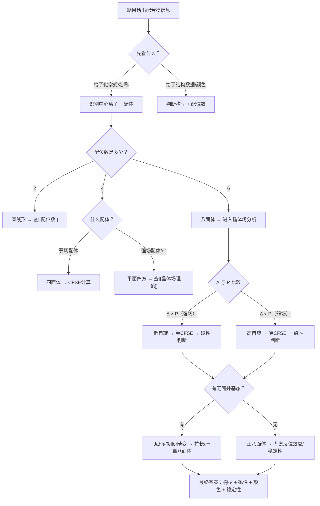
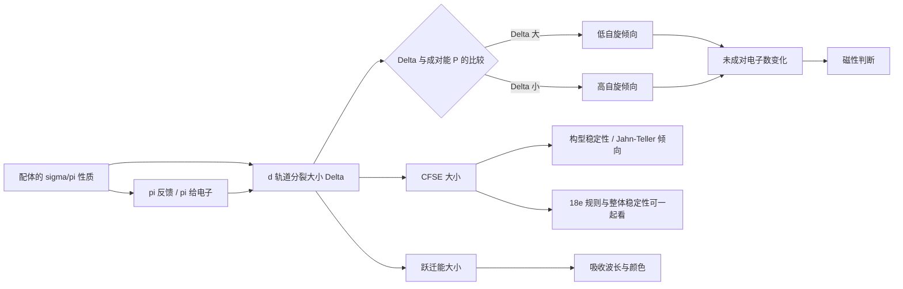

# 专题：配位化学

> 当前页已补 `related-lessons` 溯源信息；正文主体已补全 §一~§八。

## 一、核心结论汇总 {#core-conclusions}

**必须记住：**
1. **配合物** = 中心原子（通常是过渡金属离子）+ 配体（提供孤对电子或π电子）通过**配位键**结合
2. **配位数**决定基础构型：配位数 2=直线形，4=四面体/平面四方，6=八面体（最常见的竞赛构型）
3. **晶体场理论**：配体的负电荷/偶极子在中心离子处产生静电场 → d 轨道能级分裂 → 分裂能 Δ（八面体场记为 Δₒ 或 10Dq）
4. **光谱化学序列**决定 Δ 大小：$\mathrm{I^- < Br^- < Cl^- < F^- < OH^- < H_2O < NH_3 < en < NO_2^- < CN^- < CO}$（从左到右 Δ 增大）
5. **高自旋 vs 低自旋**：Δ > P（成对能）→ 低自旋；Δ < P → 高自旋。**3d 金属**：配体场强弱决定；**4d/5d 金属**：几乎总是低自旋（Δ 本身大）
6. **CFSE（晶体场稳定化能）**决定配合物的热力学稳定性和构型偏好
7. **Jahn-Teller 效应**：简并电子基态的八面体配合物发生几何畸变以消除简并
8. **反位效应**：某些配体使其对位的配体更易被取代（$\mathrm{CO, CN^-, C_2H_4 > NO_2^- > I^- > Cl^- > NH_3 > H_2O}$）
9. **18 电子规则**：中心金属的 d 电子 + 配体提供的电子 = 18（等于下一个稀有气体的电子数），适用于低氧化态的有机金属配合物

**最高频决策路径：**



## 二、对比表格 {#comparison-table}

### 2.1 配体强弱对比

| 触发条件 | 场强 | 代表配体 | Δ 相对大小 | 典型配合物 | 自旋态（3d） |
|:---|:---:|:---|:---:|:---|:---:|
| 卤素离子为配体 | **弱场** | $\mathrm{I^-, Br^-, Cl^-, F^-}$ | 小 | $[\mathrm{FeF_6}]^{3-}$ | 高自旋 |
| H₂O 或 OH⁻ 为配体 | **中场** | $\mathrm{H_2O, OH^-}$ | 中 | $[\mathrm{Fe(H_2O)_6}]^{2+}$ | 高自旋（3d） |
| NH₃ 或 en 为配体 | **中强场** | $\mathrm{NH_3, en}$ | 中偏大 | $[\mathrm{Co(NH_3)_6}]^{3+}$ | 低自旋（Co³⁺） |
| CN⁻ 或 CO 为配体 | **强场** | $\mathrm{CN^-, CO, NO_2^-}$ | 大 | $[\mathrm{Fe(CN)_6}]^{4-}$ | 低自旋 |

### 2.2 构型对比

| 构型 | 配位数 | 分裂模式 | 常见金属 | 典型例子 | 常见陷阱 |
|:---|:---:|:---|:---|:---|:---|
| **八面体** | 6 | $t_{2g}$（低能 3 重简并） / $e_g$（高能 2 重简并） | $\mathrm{Cr^{3+}, Fe^{2+/3+}, Co^{3+}, Ni^{2+}}$ | $[\mathrm{Co(NH_3)_6}]^{3+}$ | d⁴/d⁹ 注意 Jahn-Teller |
| **四面体** | 4 | $e$（低能 2 重） / $t_2$（高能 3 重），$\Delta_t \approx \frac{4}{9}\Delta_o$ | $\mathrm{Co^{2+}, Zn^{2+}, Fe^{3+}(Cl^-)}$ | $[\mathrm{CoCl_4}]^{2-}$ | CFSE 较小，倾向高自旋 |
| **平面四方** | 4 | $d_{x^2-y^2}$ 能量最高 | $d^8$（$\mathrm{Ni^{2+}, Pd^{2+}, Pt^{2+}, Au^{3+}}$） | $[\mathrm{PtCl_4}]^{2-}, [\mathrm{Ni(CN)_4}]^{2-}$ | 需要强场配体 + $d^8$ 电子组态 |
| **直线形** | 2 | 轴向配体 | $\mathrm{Ag^+, Au^+, Cu^+}$ | $[\mathrm{Ag(NH_3)_2}]^+$ | $d^{10}$，无色 |

### 2.3 异构类型对比

| 异构类型 | 识别要点 | 典型例子 | 计数方法 |
|:---|:---|:---|:---|
| **几何异构**（顺反） | $\mathrm{Ma_4b_2}$ 型：配体 a/b 的空间排列 | $[\mathrm{PtCl_2(NH_3)_2}]$：顺铂（抗癌）/ 反铂（无活性） | 枚举所有不等价排布 |
| **面式/经式**（fac/mer） | $\mathrm{Ma_3b_3}$ 型：三个相同配体占八面体一个面（fac）或经线（mer） | $[\mathrm{CoCl_3(NH_3)_3}]$：fac 和 mer 两种 | fac: 3 配体共面；mer: 3 配体共经线 |
| **光学异构** | 存在手性——无对称面/对称中心 | $[\mathrm{Co(en)_3}]^{3+}$ 有 Λ 和 Δ 两种对映体 | 查对称元素 |
| **电离异构** | 相同组成，不同离子在内外界 | $[\mathrm{CoBr(NH_3)_5}]SO_4$（SO₄²⁻ 在外界）vs $[\mathrm{CoSO_4(NH_3)_5}]Br$（Br⁻ 在外界） | 内外界离子交换 |
| **键合异构** | 两可配体以不同原子配位 | $\mathrm{NO_2^-}$：N 配位（硝基）vs O 配位（亚硝酸根）；$\mathrm{SCN^-}$：S 配位 vs N 配位 | 判断哪个原子更软/更硬 |

## 三、解题套路 / 决策流程 {#problem-solving-routine}

### 配合物题目四步法

| 步骤 | 核心操作 | 依据 KP | 检查清单 |
|:---|:---|:---|:---|
| **Step 1：识别** | 确定中心离子（氧化态 + $d^n$ 组态）+ 配体种类和数目 → 配位数 | [[配位化学]]、[[配位数]] | ☐ 氧化态正确（尤其注意配合物总电荷） ☐ 配体 denticity 正确（单齿/双齿/多齿） |
| **Step 2：构型** | 由配位数和 $d^n$ 组态判断构型（八面体/四面体/平面四方），考虑 Jahn-Teller 畸变可能 | [[晶体场理论]]、[[配位场理论]] | ☐ 排除不可能构型（如 $d^0$ 无 CFSE 偏好） ☐ $d^8$ + 强场 → 平面四方 ☐ $d^4/d^9$ → JT 畸变 |
| **Step 3：电子** | 确定高/低自旋 → 写 $t_{2g}^x e_g^y$ 排布 → 算 CFSE → 算未成对电子数 $n$ → 磁性 $\mu = \sqrt{n(n+2)}\ \mu_B$ | [[光谱化学序列]]、[[高自旋与低自旋]]、[[磁性判据]] | ☐ 4d/5d 几乎总是低自旋 ☐ CFSE = $(-0.4x + 0.6y)\Delta_o$（八面体） ☐ $\mu_{SO}$（旋轨耦合）对重原子重要 |
| **Step 4：性质** | 颜色（$d$-$d$ 跃迁 $\Delta E = \Delta$）→ 稳定性（CFSE + 螯合效应 + Irving-Williams 序）→ 反应性（反位效应 + 配体取代机理） | [[过渡元素颜色与配位行为]]、[[反位效应]]、[[18电子规则]] | ☐ $d^0/d^{10}$ 配合物通常无色（无 $d$-$d$ 跃迁） ☐ Irving-Williams 序：$\mathrm{Mn^{2+}<Fe^{2+}<Co^{2+}<Ni^{2+}<Cu^{2+}>Zn^{2+}}$ |

## 四、反应机理拆解 {#mechanism-analysis}

### 4.1 晶体场分裂机理

**目标**：解释为什么五个简并 d 轨道在八面体场中分裂为 $t_{2g}$（低能）和 $e_g$（高能）。

**分步推导**：

**步骤 1：八面体场方向**
- 6 个配体沿 $\pm x, \pm y, \pm z$ 轴接近中心金属
- 配体的负电荷/偶极子负端指向金属 → 对 d 电子产生排斥

**步骤 2：轨道方向与排斥大小**
- $d_{z^2}$ 和 $d_{x^2-y^2}$（$e_g$ 轨道）：瓣沿轴方向指向配体 → **排斥大 → 能量升高多**
- $d_{xy}, d_{xz}, d_{yz}$（$t_{2g}$ 轨道）：瓣在轴之间 → **排斥小 → 能量升高少**
- **学生任务（接力点）**：为什么四面体场的分裂模式相反？（配体从立方体交替顶点靠近 → 对 $t_2$ 轨道排斥更大）

**步骤 3：分裂能 Δₒ**
- 重心不变规则：$2E(e_g) + 3E(t_{2g}) = 0$（以分裂前为能量零点）
- $E(e_g) = +0.6\Delta_o$，$E(t_{2g}) = -0.4\Delta_o$
- **检查表**：
  - ☐ 八面体场 $e_g$ 在上、$t_{2g}$ 在下
  - ☐ 四面体场 $t_2$ 在上、$e$ 在下（相反！）
  - ☐ $\Delta_t = \frac{4}{9}\Delta_o$（其他条件相同时）

### 4.2 Jahn-Teller 畸变机理

**条件**：基态电子简并的八面体配合物（非线性分子）→ 几何畸变降低对称性以消除简并 → 能量进一步降低。

**典型触发组态**：
- **$d^4$ 高自旋**（$t_{2g}^3 e_g^1$）：$e_g$ 上 1 个电子 → $e_g$ 简并
- **$d^9$**（$t_{2g}^6 e_g^3$）：$e_g$ 上 3 个电子 → $e_g$ 上有"空穴"简并
- **$d^7$ 低自旋**（$t_{2g}^6 e_g^1$）：较弱但可观测

**畸变结果**：
- 通常**拉长**（z 轴配体远离）：$d_{z^2}$ 能量下降、$d_{x^2-y^2}$ 能量上升
- 对 $d^9$（如 $\mathrm{Cu^{2+}}$）：拉长后 $d_{z^2}$ 填满 → 额外稳定化能
- **Cu²⁺ 配合物几乎总是拉长八面体**（4 个短 equatorial 键 + 2 个长 axial 键）

**检查表**：
- ☐ $t_{2g}$ 上的简并是否也触发 JT？（理论上是，但效应弱很多——$t_{2g}$ 指向配体之间，与配体相互作用小）
- ☐ JT 畸变是大还是小？$e_g$ 简并 → 大畸变；$t_{2g}$ 简并 → 小畸变

### 4.3 反位效应（Trans Effect）机理

**定义**：在平面四方配合物中，某些配体使其对位（trans）的配体更容易被取代。

**反位效应顺序**（从强到弱）：
$$\mathrm{CO, CN^-, C_2H_4 > PR_3, H^- > NO_2^-, I^-, SCN^- > Cl^- > NH_3, py > H_2O > OH^-}$$

**经典应用——顺铂 vs 反铂的合成**：
- 从 $[\mathrm{PtCl_4}]^{2-}$ 出发：
  - 第一步加 NH₃：Cl⁻ 对位的 Cl⁻ 易被取代（反位效应），但四个 Cl⁻ 等价 → 得 $[\mathrm{PtCl_3(NH_3)}]^-$
  - 第二步加 NH₃：Cl⁻ 比 NH₃ 有更强的反位效应 → 新 NH₃ 进入 Cl⁻ 的对位 → **顺式**产物（cisplatin）
- 从 $[\mathrm{Pt(NH_3)_4}]^{2+}$ 出发加 Cl⁻，则得**反式**产物

**极化理论解释**：反位效应强的配体（如 $\mathrm{H^-}$）极化中心金属的 p 轨道 → 削弱对位金属-配体键 → 降低取代活化能。

## 五、典型例题串讲 {#typical-examples}

### 例题 1（基础）：配合物命名与异构

**题目**：写出配合物 $[\mathrm{CoCl_2(NH_3)_4}]^+$ 的名称，判断其可能的几何异构体数目，并说明是否具有光学活性。

**分析**：
1. Co 的氧化态：配体 Cl⁻ ×2 + NH₃ ×4（中性）= −2，配合物总电荷 +1 → Co 为 **+3**。注意这是 **Co(III)** 不是 Co(II)
2. 配体：4 个 NH₃ + 2 个 Cl⁻ → 配位数 6，八面体构型
3. $\mathrm{Ma_4b_2}$ 型：2 个 Cl⁻ 可处于邻位（顺式/cis）或对位（反式/trans）

**解答**：

**命名**：二氯·四氨合钴(III)离子（或氯化二氯·四氨合钴(III)）

**几何异构**：2 种
- **顺式（cis）**：两个 Cl⁻ 相邻（90°）
- **反式（trans）**：两个 Cl⁻ 相对（180°）

**光学活性**：
- 反式异构体：有对称面 → 无光学活性
- 顺式异构体：无对称面/对称中心 → 有光学活性（存在对映体对）

**反思**：
- 命名时注意"合"字的使用——配体数目用"二、三、四"，中心氧化态用括号罗马数字
- $\mathrm{Ma_4b_2}$ 型八面体有且仅有顺/反 2 种几何异构
- 判断手性的快法：找对称面和对称中心，而不是看"有没有不对称碳"


### 例题 2（提高）：CFSE + 磁性综合判断

**题目**：已知 $[\mathrm{FeF_6}]^{3-}$ 为高自旋，$[\mathrm{Fe(CN)_6}]^{3-}$ 为低自旋。(1) 写出两种配合物的 d 电子排布；(2) 计算每种配合物的 CFSE（以 $\Delta_o$ 为单位）；(3) 计算磁矩 $\mu$（仅自旋，单位 $\mu_B$）；(4) 哪个配合物更稳定？从 CFSE 角度解释。

**分析**：
1. Fe³⁺：$d^5$ 组态。F⁻ 是弱场配体（高自旋），CN⁻ 是强场配体（低自旋）
2. 八面体场：$t_{2g}$（−0.4Δₒ 每个电子），$e_g$（+0.6Δₒ 每个电子）
3. 磁矩公式：$\mu_{SO} = \sqrt{n(n+2)}\ \mu_B$（$n$ = 未成对电子数）

**解答**：

**(1) d 电子排布：**
- $[\mathrm{FeF_6}]^{3-}$（高自旋）：$t_{2g}^3 e_g^2$
- $[\mathrm{Fe(CN)_6}]^{3-}$（低自旋）：$t_{2g}^5 e_g^0$

**(2) CFSE：**
- $[\mathrm{FeF_6}]^{3-}$：$3 \times (-0.4\Delta_o) + 2 \times (0.6\Delta_o) = -1.2\Delta_o + 1.2\Delta_o = 0$
- $[\mathrm{Fe(CN)_6}]^{3-}$：$5 \times (-0.4\Delta_o) + 0 = -2.0\Delta_o$

**(3) 磁矩：**
- $[\mathrm{FeF_6}]^{3-}$：5 个未成对电子（$t_{2g}^3 e_g^2$，全部自旋平行），$\mu = \sqrt{5 \times 7} = \sqrt{35} = 5.92\ \mu_B$
- $[\mathrm{Fe(CN)_6}]^{3-}$：1 个未成对电子（$t_{2g}^5$ 中 4 个配对 + 1 个未配对），$\mu = \sqrt{1 \times 3} = \sqrt{3} = 1.73\ \mu_B$

**(4) 稳定性：**
$[\mathrm{Fe(CN)_6}]^{3-}$ 更稳定！CFSE = −2.0Δₒ 比 $[\mathrm{FeF_6}]^{3-}$ 的 CFSE = 0 低得多（更负 = 更稳定）。

**反思**：
- $d^5$ 高自旋的 CFSE = 0——这是唯一一个无论在强场还是弱场，高自旋态 CFSE 都为零的组态（因为 $t_{2g}^3 e_g^2$ 的 −1.2Δₒ 和 +1.2Δₒ 恰好抵消）
- 磁矩测量是判断高/低自旋的实验手段——5.92 vs 1.73 μB 差距巨大，容易区分
- $d^5$ 低自旋的 CFSE 特别大（−2.0Δₒ），所以 CN⁻ 等强场配体使 Fe(III) 显著稳定


### 例题 3（提高）：18 电子规则 + 反应性

**题目**：配合物 $\mathrm{Cr(CO)_6}$ 与 $\mathrm{PPh_3}$ 反应只能得到 $\mathrm{Cr(CO)_5(PPh_3)}$，即使加过量 $\mathrm{PPh_3}$ 也无法得到 $\mathrm{Cr(CO)_4(PPh_3)_2}$。(1) 用 18 电子规则解释；(2) 预测 $\mathrm{Fe(CO)_5}$ 与 $\mathrm{PPh_3}$ 反应的可能产物。

**分析**：
1. CO 是 2 电子给体，PPh₃ 也是 2 电子给体
2. 金属的价电子数 = 族数
3. 18 电子规则：金属价电子 + 配体给电子 = 18

**解答**：

**(1) $\mathrm{Cr(CO)_6}$：**
- Cr（第 6 族）→ 6 个价电子
- 6 个 CO × 2 e⁻ = 12 e⁻
- 总计：6 + 12 = **18 e⁻** ✓（已达 18 电子）

一个 CO 被 PPh₃ 取代：$\mathrm{Cr(CO)_5(PPh_3)}$ = 6 + 5 × 2 + 2 = **18 e⁻** ✓ 仍然 18 电子。

再取代一个 CO：$\mathrm{Cr(CO)_4(PPh_3)_2}$ = 6 + 4 × 2 + 2 × 2 = **18 e⁻** 电子数仍然是 18！

**为什么实际上得不到二取代产物？**
电子计数只能判断"是否满足 18 电子"，不能判断反应是否发生。这里的原因是**空间位阻**——PPh₃ 体积远大于 CO，Cr 周围已经放了 5 个 CO + 1 个 PPh₃，再塞一个 PPh₃ 过于拥挤。

**(2) $\mathrm{Fe(CO)_5}$：**
- Fe（第 8 族）→ 8 个价电子
- 5 个 CO × 2 e⁻ = 10 e⁻
- 总计：8 + 10 = **18 e⁻** ✓

一个 CO 被 PPh₃ 取代：$\mathrm{Fe(CO)_4(PPh_3)}$ = 8 + 8 + 2 = **18 e⁻** ✓

可继续取代得到 $\mathrm{Fe(CO)_3(PPh_3)_2}$（18 e⁻ ✓），但因为位阻，$\mathrm{PPh_3}$ 通常取反式（减少拥挤）。

**反思**：
- 18 电子规则是**必要不充分**条件——满足 18 e⁻ 不意味着配合物一定稳定（还要看位阻、配体电子性质）
- 第一排过渡金属的 18 电子配合物不一定严格遵守；4d/5d 金属（如 Mo, W, Rh, Ir）更倾向于遵守
- 位阻效应在有机金属化学中与电子效应同等重要


## 六、关联知识点 {#related-kp}

### 基础层（第一轮）
- [[配位化学]]：配合物的全面概论
- [[配位数]]：配位数与构型的对应关系
- [[配位反应方程式]]：配合物形成的方程式书写

### 结构层（第二轮）
- [[晶体场理论]]（[[配位场理论]]）：d 轨道在配体场中的分裂
- [[光谱化学序列]]：配体场强弱顺序的完整解析
- [[高自旋与低自旋]]：Δ vs P 的判断逻辑
- [[磁性判据]]：$\mu = \sqrt{n(n+2)}$ 计算与应用
- [[过渡元素颜色与配位行为]]：$d$-$d$ 跃迁与 CT 跃迁

### 深化层（第三轮）
- [[Jahn-Teller效应]]：畸变的条件、方向和大小
- [[反位效应]]：取代反应的选择性控制
- [[18电子规则]]：有机金属配合物的电子计数
- [[Tanabe-Sugano图]]：$d$-$d$ 跃迁能量的定量分析
- [[配合物推断方法]]：从光谱/磁性/颜色反推结构的系统方法

## 七、关联题型 {#related-problem-types}

| 题型 | 核心考点 | 典型出现 |
|:---|:---|:---|
| **配合物命名与书写** | 内外界识别、氧化态判断、配体命名规则 | 基础班/初赛必考 |
| **异构体计数与判断** | 几何异构（顺反/fac-mer）、光学异构（Λ/Δ）、键合异构 | 基础班→提高班 |
| **d 电子排布与高/低自旋判断** | 光谱化学序列、成对能、CFSE 计算 | 提高班必考 |
| **磁性计算** | $\mu = \sqrt{n(n+2)}$，未成对电子数反推结构 | 提高班→冲刺班 |
| **配合物颜色解释** | $d$-$d$ 跃迁（Δ → 吸收波长 → 补色）、CT 跃迁 | 提高班→冲刺班 |
| **18 电子计数** | 中性法/氧化态法、特殊配体（$\eta^n$、NO 的弯曲/直线） | 冲刺班/决赛 |
| **反位效应合成应用** | 顺铂合成路线设计、取代反应产率预测 | 冲刺班/决赛 |
| **配合物推断综合题** | 结合颜色+磁性+异构+反应性反推结构 | 初赛/决赛压轴 |

## 八、相关真题 {#related-exam-questions}

> 真题库统一存放在 `05-真题库/` 目录下，通过 frontmatter 中的 `knowledge_points` 字段与专题页关联。

```dataview
TABLE file.name AS "文件名", year AS "年份", type_tag AS "题型", difficulty AS "难度"
FROM "05-真题库"
WHERE contains(knowledge_points, "配位化学") OR contains(knowledge_points, "配合物") OR contains(knowledge_points, "晶体场理论")
SORT year DESC, difficulty ASC
```

### 🥇 推荐真题（硬链接）

| 真题 | 核心考点 | 难度 |
|:---|:---|:---:|
| [[真题-配合物-001]] | 配合物命名 + 配位数/构型 | ⭐⭐ |
| [[真题-无机-配合物异构体计数-001]] | 配合物异构体 + 几何/光学 | ⭐⭐⭐ |
| [[真题-无机-晶体场分裂与磁性-001]] | 晶体场分裂 + 高/低自旋磁性 | ⭐⭐⭐ |
| [[真题-无机-Jahn-Teller效应-001]] | Jahn-Teller 畸变判断 | ⭐⭐⭐ |
| [[真题-无机-反位效应-001]] | 反位效应 + 取代反应 | ⭐⭐⭐⭐ |
| [[真题-无机-18电子规则-001]] | 18 电子规则 + 金属羰基 | ⭐⭐⭐ |

> 💡 **真题使用建议**：
> - **基础班复习**：先抓"命名 / 异构 / 简单磁性判断"，不要直接跳到第三轮轨道细节
> - **提高班深化**：按"配体场强弱判断 → 高/低自旋 → CFSE 计算 → 磁性验证 → 颜色解释"五段排题
> - **冲刺班综合**：优先做"磁性 + 颜色 + 异构 + 反应性"四维联合推断题

## 零点五、进阶导航 {#advance-navigation}

- 本页定位：第三轮前置/深化基础页
- 冲刺上游页：[[专题-晶体与配合物深化]]
- 并行综合页：[[专题-物化综合计算]]

## 零点六、课堂投影速查卡 {#classroom-quick-card}

**本页课堂入口：** 先分“结构/命名/异构基础题”和“场强/磁性/反应性深化题”。

**先问四个问题：**

1. 这题是在考配位数与构型、异构命名，还是已经在考场强/磁性/18e？
2. 最关键的判断入口是配体种类、金属氧化态，还是性质数据？
3. 现在需要先做结构识别，还是先做电子排布判断？
4. 最后答案是落到构型/名称，还是要进一步落到颜色、磁性、稳定性？

**一屏判断卡：**

- 基础题先看配位数和构型，深化题再看场强和电子排布。
- 配位化学最怕只背名字，不问“为什么这个构型稳定”。
- 颜色和磁性最好和场强一起讲，不孤立拆开。
- 配体既是结构信息，也是电子信息。

## 八点五、真题入口使用建议 {#exam-entry-guide}

- 基础班复习先抓“配位数 / 异构 / 命名 / 简单磁性判断”，不要直接跳到第三轮轨道细节。
- 提高班深化建议按“场强排序 → CFSE/Jahn-Teller → 18e 计数 → 电子光谱归属”四段排题。
- 颜色题不要单独孤立练，最好和场强、自旋态一起出现，避免学生把 d-d / CT 只记成标签。
- 如果后续补第三轮专题正文，真题区应优先围绕“场强原因解释 + 18e 特殊配体 + d-d/CT 区分”补全。

## 八点六、教学图二：场强到性质的联动图 {#teaching-figure-2}

> 课堂用途：把“配体强弱”如何一路影响分裂、自旋、磁性、颜色和稳定性压成一张图，适合讲第三轮深化时反复回指。



## 八点七、真题链与讲评顺序 {#exam-sequence}

- `第 1 题`：先讲构型/异构/命名题，稳住最基本的结构抓手。
- `第 2 题`：再讲场强 + 磁性/颜色题，把“结构 → 电子排布 → 性质”连起来。
- `第 3 题`：最后讲 18e 或反应性判断题，作为往冲刺页过渡的收口。
- 课堂顺序建议：`结构题 → 性质题 → 反应/稳定性题`，先建骨架再做深化。

### 图后立刻练 / 讲后 1 题 / 课后 2 题

- 图后立刻练：给一题短题，只要求先判“先看结构还是先看电子排布”。
- 讲后 1 题：选一题场强 + 磁性联合题，完整练“配体 → Delta → 自旋态 → 性质”。
- 课后 2 题：一题 18e 计数题，一题颜色/磁性反推题，训练前后向都能做。

## 九、相关课件与讲义 {#related-lessons}

| 类型 | 文件 | 班型 | 日期 | 说明 |
|:---|:---|:---:|:---|:---|
| 备课大纲 | [[04-课件/备课大纲/2026-06-02-配合物基础-基础班]] | 基础班 | 2026-06-02 | 配位键、命名、异构与基础稳定性判断的教学设计 |
| 新授课讲义 | [[04-课件/新授课/2026-06-02-配合物基础-基础班]] | 基础班 | 2026-06-02 | 学生课堂材料，聚焦配合物基本结构与直觉建立 |
| 学生讲义 | [[04-课件/学生讲义/2026-06-23-配位化合物基础]] | 基础班 | 2026-06-23 | SHHS Vol 2·六提炼：配位化学系统入门→命名/异构/晶体场/CFSE |

> 📎 相关提炼：[[07-资料提炼/书籍提炼/提炼-普化原理-第14章-配位化合物]] · [[07-资料提炼/书籍提炼/提炼-化学竞赛初赛讲义-第4讲-配合物]] · [[07-资料提炼/书籍提炼/提炼-无机化学第6版-第20章-配位化学理论]]
