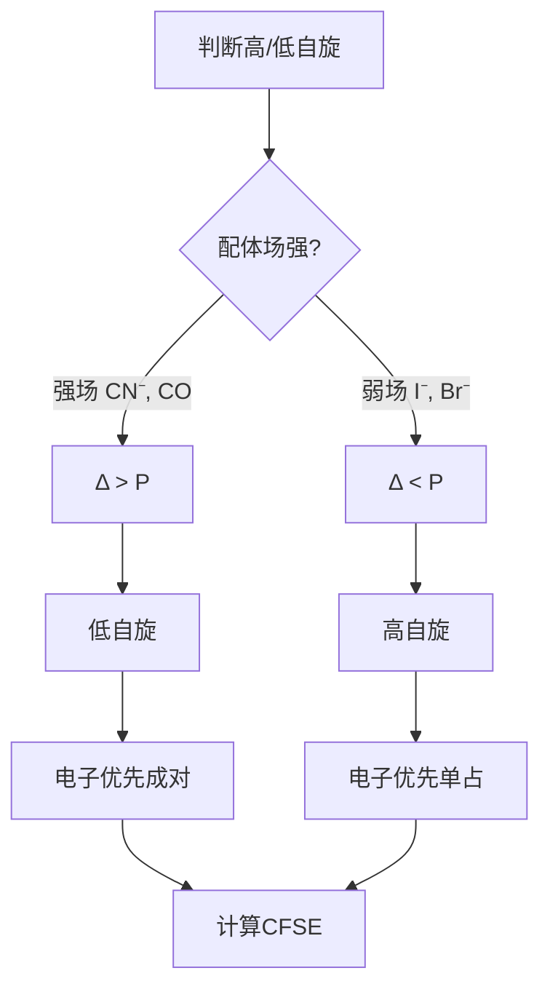
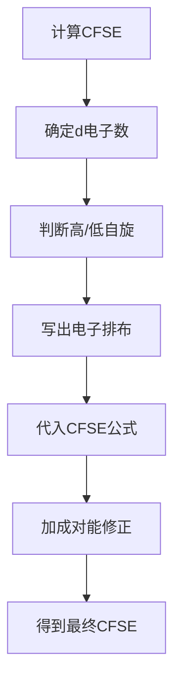

# 配位化学进阶

> **定位**：配位化学进阶涵盖晶体场理论、CFSE计算、稳定性规律。本专题为"讲义抽料台"，可直接复制各板块到学生讲义。

---

## 一、核心结论

### 1.1 晶体场分裂（来源：晶体场理论与配位场KP §二）

**八面体场d轨道分裂**：
- 低能级：t₂g（dxy, dxz, dyz）
- 高能级：eg（dx²-y², dz²）
- 分裂能：Δo = 10 Dq

**四面体场d轨道分裂**：
- 低能级：e（dz², dx²-y²）
- 高能级：t₂（dxy, dxz, dyz）
- 分裂能：Δt ≈ 4/9 Δo

### 1.2 CFSE计算（来源：CFSE计算与应用KP §二）

$$\text{CFSE} = (-0.4 \times n_{t_{2g}} + 0.6 \times n_{e_g}) \times \Delta_o + P \times m$$

- n_t₂g：t₂g轨道电子数
- n_eg：eg轨道电子数
- P：电子成对能
- m：新增成对电子对数

### 1.3 磁矩计算（来源：配合物稳定性KP §六）

**仅自旋磁矩**：
$$\mu = \sqrt{n(n+2)} \text{ BM}$$

- n：未成对电子数
- 第一过渡系可忽略轨道贡献

### 1.4 稳定性规律（来源：配合物稳定性KP §四）

**Irving-Williams序列**：
Mn²⁺ < Fe²⁺ < Co²⁺ < Ni²⁺ < Cu²⁺ > Zn²⁺

**原因**：有效核电荷递增 + 配体场稳定化效应

---

## 二、决策路径

### 高/低自旋判断



### CFSE计算流程



---

## 三、对比表格

### 表1：八面体场d轨道分裂（来源：晶体场理论与配位场KP §三）

| d电子数 | 弱场（高自旋） | 强场（低自旋） |
|:---:|:---|:---|
| d¹ | t₂g¹ | t₂g¹ |
| d² | t₂g² | t₂g² |
| d³ | t₂g³ | t₂g³ |
| d⁴ | t₂g³eg¹ | t₂g⁴ |
| d⁵ | t₂g³eg² | t₂g⁵ |
| d⁶ | t₂g⁴eg² | t₂g⁶ |
| d⁷ | t₂g⁵eg² | t₂g⁶eg¹ |
| d⁸ | t₂g⁶eg² | t₂g⁶eg² |
| d⁹ | t₂g⁶eg³ | t₂g⁶eg³ |
| d¹⁰ | t₂g⁶eg⁴ | t₂g⁶eg⁴ |

### 表2：CFSE计算结果

| d电子数 | 高自旋CFSE/Dq | 低自旋CFSE/Dq | ΔCFSE |
|:---:|:---:|:---:|:---:|
| d¹ | -4 | -4 | 0 |
| d² | -8 | -8 | 0 |
| d³ | -12 | -12 | 0 |
| d⁴ | -6 | -16 | -10 |
| d⁵ | 0 | -20 | -20 |
| d⁶ | -4 | -24 | -20 |
| d⁷ | -8 | -18 | -10 |
| d⁸ | -12 | -12 | 0 |
| d⁹ | -6 | -6 | 0 |
| d¹⁰ | 0 | 0 | 0 |

### 表3：常见配合物的磁矩

| 配合物 | d电子数 | 配体场 | 未成对电子 | μ/BM |
|:---|:---:|:---|:---:|:---:|
| [Fe(H₂O)₆]²⁺ | d⁶ | 弱场 | 4 | 4.90 |
| [Fe(CN)₆]⁴⁻ | d⁶ | 强场 | 0 | 0 |
| [Co(NH₃)₆]³⁺ | d⁶ | 强场 | 0 | 0 |
| [CoF₆]³⁻ | d⁶ | 弱场 | 4 | 4.90 |
| [Cu(NH₃)₄]²⁺ | d⁹ | - | 1 | 1.73 |

### 表4：Irving-Williams序列

| 离子 | d电子数 | 相对稳定性 | 原因 |
|:---|:---:|:---:|:---|
| Mn²⁺ | d⁵ | 最弱 | 高自旋d⁵，CFSE=0 |
| Fe²⁺ | d⁶ | 较弱 | CFSE较小 |
| Co²⁺ | d⁷ | 中等 | CFSE中等 |
| Ni²⁺ | d⁸ | 较强 | CFSE较大 |
| Cu²⁺ | d⁹ | 最强 | 姜-泰勒效应 |
| Zn²⁺ | d¹⁰ | 较强 | CFSE=0 |

---

## 四、典型例题

### 例1：CFSE计算（来源：CFSE计算与应用KP §五 典型例题1）

计算 [Co(NH₃)₆]³⁺ 的CFSE和磁矩。

**解答**：
- Co³⁺ 为 d⁶ 构型，NH₃为中等偏强场配体 → Δo > P → **低自旋**
- 电子排布：t₂g⁶eg⁰（全部成对）
- CFSE = (-0.4×6 + 0.6×0)×Δo = **-2.4Δo**（= -24 Dq）
- 磁矩：n=0，μ = √[0×(0+2)] = **0 BM**（抗磁性）

### 例2：高/低自旋比较（来源：题库 无对应题库）

比较 [Fe(H₂O)₆]²⁺ 和 [Fe(CN)₆]⁴⁻ 的CFSE和磁性。

**解答**：
- [Fe(H₂O)₆]²⁺：弱场，高自旋，t₂g⁴eg²，n=4，μ≈4.9 BM
  - CFSE = (-0.4×4 + 0.6×2)×Δo = -0.4Δo = **-4 Dq**
- [Fe(CN)₆]⁴⁻：强场，低自旋，t₂g⁶eg⁰，n=0，μ=0 BM
  - CFSE = (-0.4×6 + 0.6×0)×Δo = -2.4Δo = **-24 Dq**

### 例3：Irving-Williams序列（来源：题库 无对应题库）

解释为什么Cu²⁺配合物的稳定性在Irving-Williams序列中最高。

**解答**：
- Cu²⁺ 为 d⁹ 构型
- **姜-泰勒效应**：eg轨道不对称占据导致八面体畸变
- 畸变降低了体系能量，额外稳定化
- 因此Cu²⁺配合物稳定性异常高

### 例4：四面体配合物（来源：题库 无对应题库）

判断 [ZnCl₄]²⁻ 的磁性和CFSE。

**解答**：
- Zn²⁺ 为 d¹⁰ 构型
- 四面体场：e⁴t₂⁶（全部填满）
- 未成对电子数：n=0，**抗磁性**
- CFSE = (-0.6×4 + 0.4×6)×Δt = 0 Dq（d¹⁰无CFSE）

---

## 五、易错点预警

### 易错1：CFSE不等于总稳定能（来源：CFSE计算与应用KP §四）

- CFSE只是晶体场稳定化部分
- 还需考虑静电吸引、共价作用等
- **陷阱**：不能用CFSE比较不同类型配合物的总稳定性

### 易错2：四面体几乎都是高自旋（来源：晶体场理论与配位场KP §五）

- Δt太小（≈4/9 Δo），极少出现低自旋四面体配合物
- **陷阱**：不能对四面体配合物假设低自旋

### 易错3：Irving-Williams中Cu²⁺最高（来源：配合物稳定性KP §五）

- Cu²⁺ 的异常稳定性来自**姜-泰勒效应**
- 不是因为d⁹构型本身特别稳定
- **陷阱**：不能简单用CFSE解释Irving-Williams序列

### 易错4：磁矩计算的轨道贡献

- 第一过渡系可忽略轨道贡献
- 第二、三过渡系**不能忽略**
- **陷阱**：对重过渡金属配合物，仅自旋公式不准确

### 易错5：成对能P的变化

- P不是常数，与金属离子和配体有关
- 强场配体通常使P减小
- **陷阱**：不能用固定P值判断所有配合物的高/低自旋

### 易错6：姜-泰勒效应的条件

- 当eg轨道不对称占据时发生（d⁴低自旋、d⁷高自旋、d⁹）
- 导致八面体畸变（拉长或压缩）
- **陷阱**：d³、d⁶低自旋、d⁸不会发生姜-泰勒效应

### 易错7：光谱化学序列的温度依赖性

- 配体场强可能随温度变化
- 某些配合物在不同温度下高/低自旋态转变
- **陷阱**：不能假设温度变化不影响高/低自旋判断

---

## 六、竞赛深化

### 6.1 Tanabe-Sugano图（来源：晶体场理论与配位场KP §七）

- 将CFSE和电子排斥能统一处理
- 横轴：Δ/B（分裂能/电子排斥参数）
- 纵轴：E/B（能量/电子排斥参数）
- **应用**：预测光谱吸收峰位置

### 6.2 配位场理论

- 晶体场理论是**纯静电模型**
- 配位场理论引入**共价键成分**（分子轨道理论）
- 能解释光谱化学序列中CO等π酸配体的强场效应

### 6.3 Jahn-Teller效应的定量处理

- 畸变程度取决于姜-泰勒稳定化能
- 拉长八面体：dz²能量降低，dx²-y²能量升高
- **应用**：解释Cu²⁺配合物的异常性质

---

## 七、知识链接

**前置知识**
- [[原子结构]] → d轨道结构
- [[晶体场理论]] → CFT基础

**后续知识**
- [[分子轨道理论]] → 更精确的配位键描述
- [[有机金属试剂]] → 金属-碳键

**相关专题**
- [[专题-配位化学]]（配合物基础）
- [[专题-晶体与配合物深化]]（晶体场理论深化）
- [[专题-过渡金属元素化学]]（过渡金属配合物）

---

## 八、题库索引

```dataview
TABLE difficulty AS "难度", tags AS "标签"
FROM "04-题库/无机化学"
WHERE contains(file.name, "配合物") OR contains(file.name, "配位")
SORT file.name ASC
```
