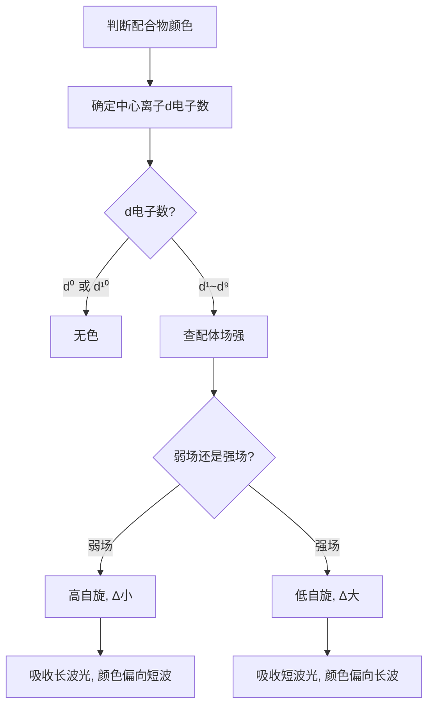
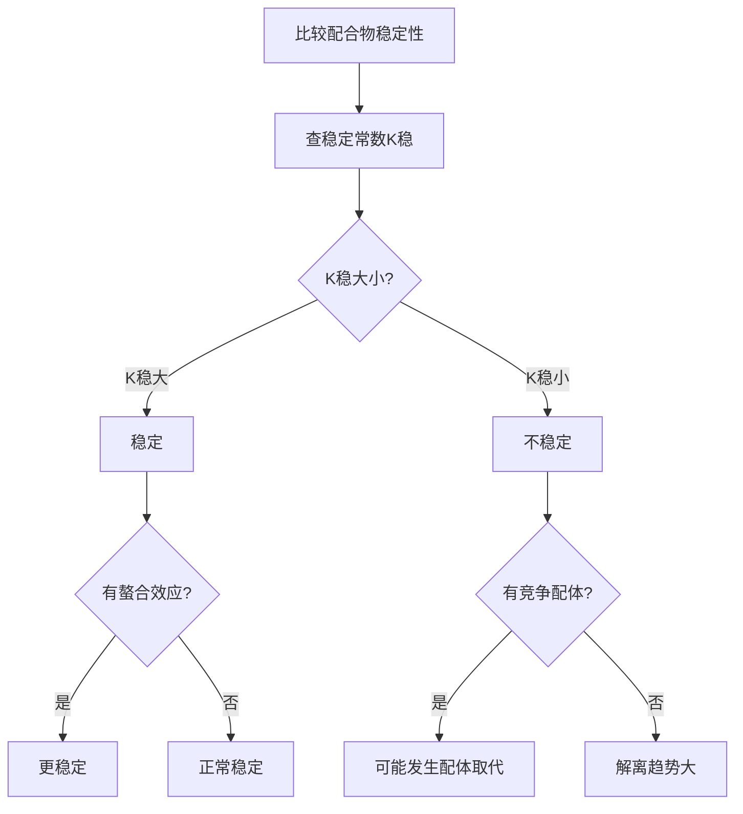

# 配合物化学

> **定位**：配合物化学是配位化学的核心，涵盖配合物结构、晶体场理论、稳定性。本专题为"讲义抽料台"，可直接复制各板块到学生讲义。

---

## 一、核心结论

### 1.1 配合物命名规则（来源：配合物命名与异构KP §二）

**命名顺序**：配体在前，中心原子在后

**配体类型顺序**：先无机后有机，先阴离子后中性分子

**示例**：
- [Co(NH₃)₆]Cl₃ → 三氯化六氨合钴(III)
- K₃[Fe(CN)₆] → 六氰合铁(III)酸钾
- [Cu(NH₃)₄]SO₄ → 硫酸四氨合铜(II)

### 1.2 晶体场理论（来源：晶体场理论与配位场KP §二）

**八面体场d轨道分裂**：
- 低能级：t₂g（dxy, dxz, dyz）
- 高能级：eg（dx²-y², dz²）
- 分裂能：Δo

**光谱化学序列**（配体场强递增）：
I⁻ < Br⁻ < Cl⁻ < F⁻ < OH⁻ < H₂O < NH₃ < en < CN⁻ < CO

### 1.3 配合物稳定性（来源：配合物稳定性KP §二）

**稳定常数**：
$$K_{稳} = \frac{[ML_n]}{[M][L]^n}$$

**影响因素**：
- 中心离子电荷↑，半径↓ → 稳定性↑
- 螯合效应：多齿配体形成的配合物更稳定
- 大环效应：大环配体形成的配合物特别稳定

### 1.4 配位数与几何构型

| 配位数 | 几何构型 | 示例 |
|:---:|:---|:---|
| 2 | 直线形 | [Ag(NH₃)₂]⁺ |
| 4 | 四面体 | [ZnCl₄]²⁻ |
| 4 | 平面四方 | [Cu(NH₃)₄]²⁺ |
| 6 | 八面体 | [Fe(CN)₆]³⁻ |

---

## 二、决策路径

### 配合物颜色判断



### 配合物稳定性比较



---

## 三、对比表格

### 表1：晶体场分裂与颜色（来源：晶体场理论与配位场KP §三）

| 离子 | d电子数 | 配体 | 颜色 | 吸收光 |
|:---|:---:|:---|:---:|:---|
| Ti³⁺ | d¹ | H₂O | 紫色 | 黄绿 |
| Cu²⁺ | d⁹ | H₂O | 蓝色 | 红 |
| Fe²⁺ | d⁶ | H₂O | 浅绿 | 红 |
| Fe³⁺ | d⁵ | H₂O | 黄色 | 蓝紫 |
| Co²⁺ | d⁷ | H₂O | 粉红 | 绿 |
| Ni²⁺ | d⁸ | H₂O | 绿色 | 红 |

### 表2：强场 vs 弱场配合物

| 特征 | 弱场（高自旋） | 强场（低自旋） |
|:---|:---|:---|
| 配体 | I⁻, Br⁻, Cl⁻, F⁻ | CN⁻, CO, NH₃ |
| Δ值 | 小 | 大 |
| 电子排布 | 优先单占 | 优先成对 |
| 磁性 | 顺磁性强 | 可能反磁性 |
| 稳定性 | 较低 | 较高 |

### 表3：螯合效应

| 配合物 | 配体 | 齿数 | logK稳 | 稳定性 |
|:---|:---|:---:|:---:|:---|
| [Ni(NH₃)₆]²⁺ | NH₃ | 1 | 8.61 | 一般 |
| [Ni(en)₃]²⁺ | en | 2 | 18.28 | 很稳定 |
| [Ni(dien)₂]²⁺ | dien | 3 | ~20 | 极稳定 |

### 表4：常见配合物的配位数与几何

| 配合物 | 中心离子 | 配体 | 配位数 | 几何 |
|:---|:---|:---|:---:|:---|
| [Ag(NH₃)₂]⁺ | Ag⁺ | NH₃ | 2 | 直线形 |
| [CuCl₄]²⁻ | Cu²⁺ | Cl⁻ | 4 | 平面四方 |
| [Zn(NH₃)₄]²⁺ | Zn²⁺ | NH₃ | 4 | 四面体 |
| [Fe(CN)₆]³⁻ | Fe³⁺ | CN⁻ | 6 | 八面体 |
| [Co(en)₃]³⁺ | Co³⁺ | en | 6 | 八面体 |

---

## 四、典型例题

### 例1：配合物命名（来源：配合物命名与异构KP §五 典型例题1）

命名以下配合物：[Co(NH₃)₄Cl₂]Cl

**解答**：
- 外界：Cl⁻（氯化物）
- 内界：[Co(NH₃)₄Cl₂]⁺
- 配体：4个NH₃（四氨）+ 2个Cl⁻（二氯），按先阴离子后中性分子命名
- 命名：**氯化二氯四氨合钴(III)**
- 氧化态：设Co为x，x + 4(0) + 2(-1) + (-1) = 0 → x = +3

### 例2：晶体场颜色（来源：晶体场理论与配位场KP §五 典型例题）

[Ti(H₂O)₆]³⁺ 呈紫色，解释其颜色来源。

**解答**：
- Ti³⁺ 的电子构型为 [Ar]3d¹，只有一个d电子
- 八面体场中该电子占据t₂g轨道
- 可见光照射下，电子发生t₂g → eg跃迁，吸收黄绿色光（~500nm）
- 互补色为**紫色**

### 例3：稳定常数计算（来源：题库 无对应题库）

计算0.1 mol/L [Cu(NH₃)₄]²⁺溶液中游离Cu²⁺的浓度。已知β₄ = 10¹³·³。

**解答**：
- [Cu(NH₃)₄]²⁺ ⇌ Cu²⁺ + 4NH₃
- K不稳 = 1/β₄ = 10⁻¹³·³
- 设游离[Cu²⁺] = x，则[NH₃] ≈ 4x（近似）
- K不稳 = x × (4x)⁴ / 0.1 = 256x⁵ / 0.1
- x⁵ = 0.1 × 10⁻¹³·³ / 256 ≈ 10⁻¹⁵·⁷
- x ≈ **10⁻³·¹ mol/L**

### 例4：螯合效应（来源：题库 无对应题库）

比较 [Ni(NH₃)₆]²⁺ 和 [Ni(en)₃]²⁺ 的稳定性。

**解答**：
- [Ni(NH₃)₆]²⁺：logK稳 = 8.61
- [Ni(en)₃]²⁺：logK稳 = 18.28
- **[Ni(en)₃]²⁺ 稳定得多**
- 原因：螯合效应（熵增驱动）+ 大环效应

---

## 五、易错点预警

### 易错1：配位数与配体数混淆（来源：配合物命名与异构KP §四）

- 配位数是**配位原子数**，不是配体分子数
- 乙二胺（en）是双齿配体，一个en提供2个配位原子
- **陷阱**：[Co(en)₃]Cl₃中配位数 = 3×2 = 6，而非3

### 易错2：光谱化学序列方向（来源：晶体场理论与配位场KP §五）

- 序列中**右侧配体场强更大**（如CN⁻、CO）
- 左侧配体场强更小（如I⁻、Br⁻）
- **陷阱**：不是从左到右场强递减，而是递增

### 易错3：高/低自旋态对磁性的影响（来源：配合物稳定性KP §六）

- 同样d⁶构型的Fe²⁺：
  - 弱场配体（H₂O）：高自旋，4个未成对电子
  - 强场配体（CN⁻）：低自旋，0个未成对电子
- **陷阱**：判断磁性时必须先确定配体场强弱

### 易错4：稳定常数的对数值

- 题目常给logK稳而非K稳
- 计算时注意单位换算
- **陷阱**：logK稳 = 13.3 意味着K稳 = 10¹³·³，不是13.3

### 易错5：螯合效应的本质

- 螯合效应主要是**熵增驱动**（释放更多溶剂分子）
- 不是因为配位键更强
- **陷阱**：不能简单说"螯合键比单齿键强"

### 易错6：配合物的几何构型与d电子数无关

- [Cu(NH₃)₄]²⁺ 是平面四方（d⁹）
- [Zn(NH₃)₄]²⁺ 是四面体（d¹⁰）
- **陷阱**：不能仅凭配位数判断几何

### 易错7：晶体场稳定化能（CFSE）

- CFSE = (-0.4n_t₂g + 0.6n_eg) × Δo
- 高自旋和低自旋的CFSE不同
- **陷阱**：CFSE是额外稳定化能，不影响配合物的形成热

---

## 六、竞赛深化

### 6.1 配位场理论（来源：晶体场理论与配位场KP §七）

- 晶体场理论是**纯静电模型**
- 配位场理论引入**共价键成分**（分子轨道理论）
- 能解释光谱化学序列中CO等π酸配体的强场效应

### 6.2 配合物的反应机理

- **取代反应**：SN1（解离）或SN2（缔合）机理
- **氧化还原反应**：内层（桥联）或外层（电子隧穿）机理
- **影响因素**：中心离子构型、配体性质、溶剂

### 6.3 生物无机化学中的配合物

- 血红蛋白：Fe²⁺-卟啉配合物（O₂运输）
- 铜蓝蛋白：Cu²⁺配合物（电子传递）
- 固氮酶：Mo-Fe-S簇（N₂固定）

---

## 七、知识链接

**前置知识**
- [[原子结构]] → d轨道结构
- [[化学键]] → 配位键

**后续知识**
- [[晶体结构]] → 配合物晶体
- [[有机金属化学]] → 金属-碳键

**相关专题**
- [[专题-配位化学进阶]]（配位化学深化）
- [[专题-晶体与配合物深化]]（晶体场理论深化）
- [[专题-过渡金属元素化学]]（过渡金属配合物）

---

## 八、题库索引

```dataview
TABLE difficulty AS "难度", tags AS "标签"
FROM "04-题库/无机化学"
WHERE contains(file.name, "配合物") OR contains(file.name, "配位")
SORT file.name ASC
```
