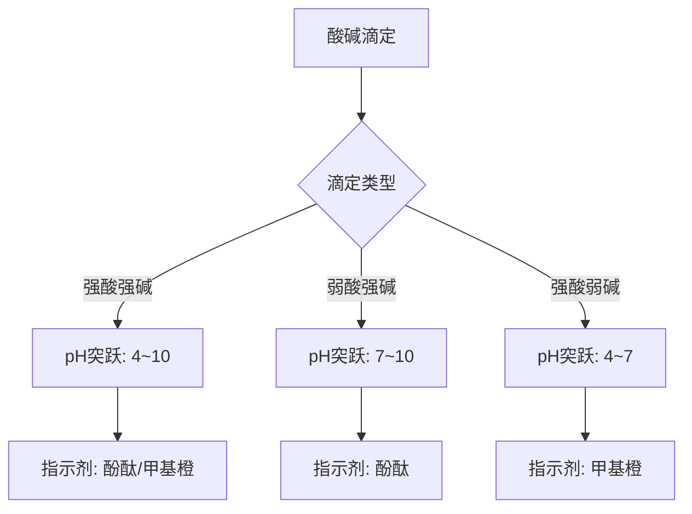

# 酸碱平衡与pH计算

> **定位**：酸碱平衡是化学原理的核心内容，涵盖pH计算、缓冲溶液、滴定分析。本专题为"讲义抽料台"，可直接复制各板块到学生讲义。

---

## 一、核心结论

### 1.1 酸碱质子理论（来源：酸碱平衡(核心结论)§一）

- **酸**：质子供体（能给出 H⁺ 的物质）
- **碱**：质子受体（能接受 H⁺ 的物质）
- **共轭酸碱对**：酸失去 H⁺ 变为其共轭碱，碱得到 H⁺ 变为其共轭酸
- **关系**：Ka × Kb = Kw = 1.0 × 10⁻¹⁴（25°C）

### 1.2 pH计算公式体系（来源：酸碱平衡(解题策略)§一）

**强酸强碱**：直接由浓度计算
- 一元强酸：[H⁺] = c
- 一元强碱：[OH⁻] = c → pOH = -lg c → pH = 14 - pOH

**一元弱酸弱碱**：
- 精确公式：[H⁺] = (-Ka + √(Ka² + 4Ka·c)) / 2
- 近似条件：c/Ka > 100 且 Ka·c < 10⁻⁸ 时，[H⁺] ≈ √(Ka·c)

**多元酸**：逐级电离，Ka₁ >> Ka₂ >> Ka₃，通常只需考虑第一级

### 1.3 缓冲溶液原理（来源：缓冲溶液原理KP §二）

**Henderson-Hasselbalch方程**：
$$\text{pH} = \text{p}K_a + \lg\frac{[\text{A}^-]}{[\text{HA}]}$$

**有效缓冲范围**：pH = pKa ± 1（缓冲比 [A⁻]/[HA] 在 0.1~10 之间）

**缓冲容量**：总浓度越大，缓冲能力越强

---

## 二、决策路径

### pH计算三步法

```mermaid
graph TD
    A[计算pH] --> B{判断酸碱类型}
    B -->|强酸| C{是一元还是多元?}
    B -->|弱酸| D{是否两性物质?}
    B -->|弱碱| E[先算pOH再换pH]
    C -->|一元| F[[H⁺] = c]
    C -->|多元| G[[H⁺] ≈ nc, n=酸元数]
    D -->|是| H[用两性物质公式]
    D -->|否| I{c/Ka > 100?}
    I -->|是| J[[H⁺] ≈ √Ka·c]
    I -->|否| K[解一元二次方程]
    E --> L[[OH⁻] = √Kb·c]
    L --> M[pH = 14 - pOH]
    H --> N[[H⁺] = √Ka₁·Ka₂]
```

### 滴定终点判断



---

## 三、对比表格

### 表1：酸碱强度与pH关系（来源：酸碱平衡(核心结论)§二）

| 酸强度 | Ka范围 | pKa范围 | 0.1M溶液pH | 示例 |
|:---:|:---:|:---:|:---:|:---|
| 强酸 | >>1 | <<0 | ~1 | HCl, HNO₃ |
| 中强酸 | 10⁻²~10⁻⁷ | 2~7 | 1.5~3.5 | H₃PO₄, HF |
| 弱酸 | 10⁻⁷~10⁻¹² | 7~12 | 3.5~7 | HAc, HCN |
| 极弱酸 | <<10⁻¹² | >>12 | ~7 | H₂O, ROH |

### 表2：缓冲溶液选择指南（来源：缓冲溶液原理KP §四）

| 目标pH | 推荐缓冲体系 | pKa | 缓冲比(A⁻/HA) |
|:---:|:---|:---:|:---:|
| 2~4 | 柠檬酸/柠檬酸钠 | 3.13, 4.76, 6.40 | 根据需要调节 |
| 4~6 | HAc/NaAc | 4.74 | 1:10 ~ 10:1 |
| 6~8 | NaH₂PO₄/Na₂HPO₄ | 7.20 | 1:10 ~ 10:1 |
| 8~10 | NH₃·H₂O/NH₄Cl | 9.25 | 1:10 ~ 10:1 |
| 10~12 | NaHCO₃/Na₂CO₃ | 10.33 | 1:10 ~ 10:1 |

### 表3：滴定曲线特征对比（来源：酸碱平衡(解题策略)§五）

| 滴定类型 | 半当量点pH | 当量点pH | 突跃范围 | 指示剂 |
|:---|:---:|:---:|:---:|:---|
| 强酸+强碱 | 7.00 | 7.00 | 4~10 | 酚酞/甲基橙 |
| 弱酸+强碱 | pKa | >7（碱性） | 7~10 | 酚酞 |
| 强酸+弱碱 | - | <7（酸性） | 4~7 | 甲基橙 |
| 多元酸+强碱 | pKa₁, pKa₂ | 多个突跃 | 取决于Ka差 | 分步选择 |

### 表4：pH计算公式速查

| 体系 | 公式 | 适用条件 |
|:---|:---|:---|
| 一元弱酸 | [H⁺] = √(Ka·c) | c/Ka > 100 |
| 一元弱碱 | [OH⁻] = √(Kb·c) | c/Kb > 100 |
| 两性物质 | [H⁺] = √(Ka₁·Ka₂) | Ka₂ << Ka₁ |
| 弱酸弱碱盐 | [H⁺] = √(Ka₁·Kw/Kb₂) | Ka、Kb均小 |
| 缓冲溶液 | pH = pKa + lg([A⁻]/[HA]) | 缓冲比0.1~10 |

---

## 四、典型例题

### 例1：弱酸pH计算（来源：酸碱平衡KP §六 典型例题1）

计算 0.10 mol/L HAc（醋酸）溶液的 pH。已知 Ka = 1.8 × 10⁻⁵。

**解答**：
- 检验近似条件：c/Ka = 0.10 / (1.8 × 10⁻⁵) ≈ 5556 > 100 ✓
- [H⁺] = √(Ka·c) = √(1.8 × 10⁻⁵ × 0.10) = √(1.8 × 10⁻⁶) ≈ 1.34 × 10⁻³ mol/L
- pH = -lg(1.34 × 10⁻³) ≈ **2.87**

### 例2：缓冲溶液pH计算（来源：题库 08-06）

将 0.10 mol/L HAc 与 0.10 mol/L NaAc 等体积混合，计算缓冲溶液的 pH。

**解答**：
- 混合后 [HAc] = [Ac⁻] = 0.050 mol/L
- pH = pKa + lg([Ac⁻]/[HAc]) = 4.74 + lg(1) = **4.74**

### 例3：滴定曲线计算（来源：酸碱平衡KP §八 典型例题2）

用 0.10 mol/L NaOH 滴定 20.00 mL 0.10 mol/L HAc，计算当量点的 pH。

**解答**：
- 当量点时 HAc 全部转化为 NaAc，[Ac⁻] = 0.050 mol/L
- Ac⁻ 水解：pOH = ½(pKb - lg c) = ½(9.26 + 1.30) = 5.28
- pH = 14 - 5.28 = **8.72**

### 例4：两性物质pH计算（来源：题库 08-11）

计算 0.10 mol/L NaHCO₃ 溶液的 pH。已知 Ka₁ = 4.3 × 10⁻⁷，Ka₂ = 5.6 × 10⁻¹¹。

**解答**：
- HCO₃⁻ 是两性物质，[H⁺] = √(Ka₁·Ka₂)
- [H⁺] = √(4.3 × 10⁻⁷ × 5.6 × 10⁻¹¹) = √(2.41 × 10⁻¹⁷) ≈ 4.9 × 10⁻⁹
- pH = -lg(4.9 × 10⁻⁹) ≈ **8.31**

---

## 五、易错点预警

### 易错1：近似条件不满足时仍用简化公式（来源：酸碱平衡(解题策略)§一）

- 当 Ka 较大或 c 较小时，简化公式误差显著
- **必须先检验** c/Ka > 100 和 Ka·c < 10⁻⁸ 两个条件
- 不满足时需用精确的一元二次方程求解

### 易错2：缓冲溶液中共轭对搞反（来源：缓冲溶液原理KP §三）

- Henderson-Hasselbalch 方程中，[A⁻] 是碱组分在分子，[HA] 是酸组分在分母
- **陷阱**：两者颠倒会导致 pH 计算结果与实际相反
- **检验**：碱多则 pH > pKa，酸多则 pH < pKa

### 易错3：忽视多元酸的逐级电离（来源：酸碱平衡KP §五）

- 对于 H₃PO₄ 等多元酸，H⁺ 主要来自第一级电离
- 但若计算 [PO₄³⁻] 等低浓度离子，需依次使用 Ka₂、Ka₃
- **陷阱**：不能直接用 Ka₁ 计算 [PO₄³⁻]

### 易错4：Ka与Kb的对应关系

- 共轭酸碱对：Ka × Kb = Kw
- HAc 的 Ka = 1.8 × 10⁻⁵，则 Ac⁻ 的 Kb = Kw/Ka = 5.6 × 10⁻¹⁰
- **陷阱**：题目可能给的是共轭碱的 Kb，需要转换为酸的 Ka

### 易错5：温度对Kw的影响

- 25°C 时 Kw = 1.0 × 10⁻¹⁴，pH + pOH = 14
- 100°C 时 Kw = 5.5 × 10⁻¹³，pH + pOH = 12.26
- **陷阱**：高温下中性溶液 pH ≠ 7（而是约6.13）

### 易错6：稀释对弱酸pH的影响

- 弱酸稀释10倍，pH 增加不到1（因为电离度增大）
- 强酸稀释10倍，pH 增加恰好1
- **陷阱**：不能简单用稀释倍数计算pH变化

### 易错7：滴定突跃与指示剂选择

- 滴定突跃范围决定了可选指示剂的范围
- 指示剂变色范围必须**全部落在**突跃范围内
- **陷阱**：甲基橙变色范围3.1~4.4，不适合弱酸强碱滴定（突跃在碱性区）

---

## 六、竞赛深化

### 6.1 分布分数（来源：酸碱平衡KP §九）

多元酸各型体的分布分数 δ 随 pH 变化：
- δ₀ = [H₃A]/c（酸型）
- δ₁ = [H₂A⁻]/c
- δ₂ = [HA²⁻]/c
- δ₃ = [A³⁻]/c（碱型）

**应用**：判断在某 pH 下主要存在形式，指导沉淀分离、萃取等

### 6.2 质量平衡与电荷平衡（来源：酸碱平衡KP §十）

**质量平衡（MB）**：某组分的分析浓度等于各存在形式浓度之和

**电荷平衡（CB）**：溶液中正电荷总量 = 负电荷总量

**质子平衡（PB）**：以零水准物质为基准，得质子产物 = 失质子产物

### 6.3 酸碱滴定的可行性判据

- **一元酸碱**：c·Ka ≥ 10⁻⁸ 可准确滴定
- **多元酸碱**：相邻 Ka 比值 ≥ 10⁴ 可分步滴定
- **混合酸碱**：ΔpKa ≥ 4 可分别滴定

---

## 七、知识链接

**前置知识**
- [[物质的量与气体计算]] → 浓度计算基础
- [[化学平衡]] → 平衡常数概念

**后续知识**
- [[沉淀溶解平衡]] → 溶度积与pH的关系
- [[络合滴定]] → EDTA滴定中的酸效应

**相关专题**
- [[专题-化学平衡]]（平衡常数在酸碱平衡中的应用）
- [[专题-氧化还原与电化学]]（电极电势与pH的关系）
- [[专题-容量分析基础与酸碱滴定]]（滴定分析详解）

---

## 八、题库索引

```dataview
TABLE difficulty AS "难度", tags AS "标签"
FROM "04-题库/化学原理/Ch08-酸碱平衡"
SORT file.name ASC
```
