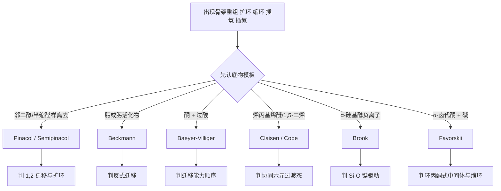

# 专题：重排反应

> 2026-06-19 复核说明：本专题对应的专题页、备课大纲、课堂执行页、教学洞察均已成套落地，原状态属于系统回写滞后，现统一升为 `已审校`。

> 本专题对应考纲条目：[[39-重排反应]]
> 核心知识点：[[Pinacol重排]]、[[Beckmann重排]]、[[Baeyer-Villiger重排]]、[[Claisen重排]]、[[Cope重排]]、[[Brook重排]]、[[Favorskii重排]]

---

## 一、核心结论汇总 {#core-conclusions}

**必须记住：**
- 第三轮重排反应不能按人名孤立记忆，而要先问“**什么底物模板、迁移到哪里、迁移后稳定了什么**”。
- 第三轮高频重排至少分四家：**碳正离子型、迁移到缺电子杂原子、协同 `[3,3]-σ` 迁移、阴离子/硅驱动型**。
- 真正高效的判题顺序是：**先认模板，再判迁移规则，最后核对产物官能团与环尺寸变化**。
- 本专题与 [[专题-活性中间体与反应机理基础]]、[[专题-羰基化学与缩合反应]]、[[周环反应]] 强关联：
  - 专题3提供“碳正离子/阴离子/协同过渡态”语言；
  - 专题6提供 Beckmann / B-V 的羰基入口；
  - 专题9再把 Claisen / Cope 放到完整周环框架中深化。

**第三轮看到重排题先走这条分叉：**



## 一点五、课堂投影速查卡 {#classroom-quick-card}

**本页课堂入口：** 先让学生接受一个事实: 看到“骨架变了”不要慌，先问是谁在迁移、为什么能迁。

**先问四个问题：**

1. 当前赛道是碳正离子、缺电子中心、周环协同，还是别的中间体？
2. 迁移的是氢、烷基、酰基，还是整段 `σ` 键重排？
3. 迁移后能否得到更稳定中间体、更低张力骨架，或更强共轭？
4. 题目是在考重排本身，还是在考“为什么这里比取代/加成更愿意重排”？

**一屏判断卡：**

- 先认中间体，再谈迁移能力；没有赛道判断，重排名词就没有意义。
- `1,2-迁移` 常和碳正离子/缺电子中心绑定，`[3,3]-迁移` 常回到周环语言。
- 重排题一定要同时看“迁移前后稳定性”与“几何是否允许”。
- 最后别忘了检查：重排是不是只是中间步，后面还会继续加成/消除/关环。

**讲后立刻练：**

- 先做一道碳正离子重排与“不重排直接进攻”竞争题。
- 再做一道 Claisen/Cope 和离子型重排对照题，统一迁移语言。

---

## 二、对比表格 {#comparison-table}

| 家族 | 题目触发关键词 | 迁移对象/方向 | 规则核心 | 常见产物 | 第三轮常见坑 |
|:---|:---|:---|:---|:---|:---|
| Pinacol / Semipinacol | 邻二醇、酸、离去基激活后 1,2-迁移 | C 或 H 向碳正离子迁移 | 先让更稳定碳正离子出现，再看谁迁移 | 醛/酮，常伴扩环 | 只背“邻二醇变酮”，不判哪一侧先离去 |
| Beckmann | 肟、强酸、PPA、SOCl2 | 碳基团从 C 迁到 N | **与 OH 反式的基团迁移** | 酰胺/内酰胺 | 忽略 E/Z 构型，直接凭位阻猜 |
| Baeyer-Villiger | 酮 + 过酸、mCPBA | 碳基团从酰基碳迁到 O | 按迁移能力顺序，不是反式规则 | 酯/内酯 | 和 Beckmann 混淆；把过酸当普通氧化 |
| Claisen / Cope | 烯丙基烯醚、1,5-二烯、加热 | `[3,3]-σ` 协同迁移 | 六元过渡态，一步协同 | 邻烯丙基酚、γ,δ-不饱和羰基、重排二烯 | 错写成碳正离子机理 |
| Brook | α-硅基醇、强碱 | Si 从 C 迁到 O | **强 Si-O 键形成驱动** | 硅醚 + 碳负离子等效体 | 只看到硅保护基，没意识到极性翻转 |
| Favorskii | α-卤代酮、碱 | 环缩 / 开环重组 | 环丙酮式中间体或等效机理 | 羧酸/酯，常缩环 | 把它当普通卤代酮取代或消除 |

## 三、第三轮高频判断清单 {#decision-checklist}

### 3.1 一眼识别模板

- `肟` 或 `肟活化物`：优先想 [[Beckmann重排]]
- `酮 + 过酸`：优先想 [[Baeyer-Villiger重排]]
- `邻二醇 + 酸`：优先想 [[Pinacol重排]]
- `烯丙基芳基醚 / 烯丙基乙烯基醚`：优先想 [[Claisen重排]]
- `1,5-二烯 + 加热`：优先想 [[Cope重排]]
- `α-硅基醇 + 强碱`：优先想 [[Brook重排]]
- `α-卤代酮 + 碱`：优先想 [[Favorskii重排]]

### 3.2 四句口令

1. **先认模板，不先背人名。**
2. **先判谁能迁，不先猜产物。**
3. **先看驱动力，不先看步数。**
4. **先核官能团和环尺寸，再收尾。**

## 四、解题套路 / 决策流程 {#problem-solving-routine}

### Step 1：先判“这是不是重排题”
- **操作**：题目若出现扩环、缩环、插入 O/N、骨架换位，先把“重排”列入候选。
- **检查点**：☐ 没把题目误判成普通加成/取代/氧化还原

### Step 2：认底物模板
- **操作**：从肟、邻二醇、酮+过酸、1,5-二烯、烯丙基烯醚、α-卤代酮、α-硅基醇等模板切入。
- **依据 KP**：[[Pinacol重排]]、[[Beckmann重排]]、[[Baeyer-Villiger重排]]、[[Claisen重排]]、[[Brook重排]]
- **检查点**：☐ 已归类到具体重排家族

### Step 3：判迁移规则
- **操作**：
  - Beckmann 看“谁与 OH 反式”；
  - B-V 看迁移能力；
  - Pinacol 看先形成哪种更稳碳正离子、再看 1,2-迁移；
  - Claisen / Cope 看 `[3,3]` 协同六元过渡态；
  - Brook 看 Si-O 键驱动；
  - Favorskii 看缩环/重排后羧酸衍生物。
- **检查点**：☐ 迁移对象明确 ☐ 迁移方向明确

### Step 4：判产物类型
- **操作**：核对得到的是酰胺、酯、内酯、酮、烯丙基酚还是缩环羧酸衍生物。
- **检查点**：☐ 官能团类型正确 ☐ 环尺寸变化正确

### Step 5：把机理层语言补上
- **操作**：最后再用“碳正离子 / 缺电子 N、O / 协同过渡态 / Si-O 键驱动 / 环丙酮式中间体”解释。
- **检查点**：☐ 没把协同机理写成离子机理 ☐ 没把迁移规则混写

## 五、机理分析抓手 {#mechanism-analysis}

### 5.1 碳正离子型：Pinacol / Semipinacol / Wagner-Meerwein

- 核心语言：**先有离去，再有更稳碳正离子，再发生 1,2-迁移**。
- 典型驱动力：
  - 三级或苄基碳正离子更稳定；
  - 羰基生成带来额外稳定；
  - 扩环可释放张力。
- 课堂提醒：迁移基团是“带着成键电子一起走”，不是自由基式乱动。

### 5.2 向缺电子杂原子迁移：Beckmann / B-V

- 二者都要问“**谁迁移**”，但规则完全不同：
  - Beckmann：构型控制，**反式迁移**；
  - B-V：迁移能力控制，**更能稳定迁移过渡态的基团优先**。
- 都常与 [[专题-羰基化学与缩合反应]] 联动出现，是第三轮跨专题高频桥梁。

### 5.3 协同 `[3,3]-σ` 迁移：Claisen / Cope

- 核心语言：**一步协同、六元过渡态、无离子中间体**。
- 第三轮可先讲“模板识别 + 产物方向”，完整轨道对称性解释放到 [[周环反应]]。
- 但本轮已经可以讲：
  - 为何常有立体专一性；
  - 为什么常偏椅式过渡态；
  - 为什么产物往往更有利于恢复芳香性或形成更稳双键。

### 5.4 阴离子/硅驱动与缩环型：Brook / Favorskii

- Brook：看到硅别只想保护基，要想到**硅基迁移带来的极性翻转**。
- Favorskii：看到 α-卤代酮别只想消除，要想到**缩环和羧酸衍生物生成**。
- 这两类虽然不是竞赛里最早教的，但在第三轮很适合训练“驱动力辨识”。

## 六、典型例题串讲 {#typical-examples}

### 例题 1：环己酮肟在强酸下生成什么
**分析**：底物是肟，走 Beckmann；环酮肟常扩一位成内酰胺。  
**解答**：生成己内酰胺。  
**反思**：看到“环酮肟”时，应把“反式迁移 + 扩环 + 内酰胺”一次性联想出来。

### 例题 2：不对称酮与 mCPBA 反应，哪一侧迁移
**分析**：先判这是 B-V，不看反式，只看迁移能力。  
**解答**：更能稳定迁移过渡态的那一侧优先迁移，生成对应酯。  
**反思**：B-V 的本质是“酮插氧成酯”，不是普通氧化。

### 例题 3：邻二醇在酸下重排为何常扩环
**分析**：先形成更稳碳正离子，再发生 1,2-迁移；若环迁移能释张力或形成更稳羰基，扩环就常见。  
**解答**：产物通常是扩环酮。  
**反思**：Pinacol 题的关键不是“有没有二醇”，而是“哪种离去-迁移路径更稳”。

### 例题 4：烯丙基芳基醚加热后为何不写离子机理
**分析**：底物模板直指 Claisen；它属于 `[3,3]-σ` 协同迁移。  
**解答**：应写六元过渡态或至少说明协同重排到邻位烯丙基酚。  
**反思**：第三轮阶段就要把“离子型重排”和“协同重排”强行分家。

## 七、课堂组织建议 {#teaching-organization}

- **第一层**：用“模板识别”把人名反应压成 4 个家族。
- **第二层**：用“迁移规则对比”做横向辨析，重点打掉 Beckmann / B-V / Pinacol 混淆。
- **第三层**：用 2 道扩环题、1 道构型题、1 道协同题完成收束。
- **第三轮可直接展开的内容**：
  - Pinacol / Beckmann / B-V 的完整判断；
  - Claisen / Cope 的模板识别与产物预测；
  - Brook / Favorskii 的驱动力理解与基础题型。

## 八、关联知识点 {#related-kp}

- [[Pinacol重排]]
- [[Beckmann重排]]
- [[Baeyer-Villiger重排]]
- [[Claisen重排]]
- [[Cope重排]]
- [[Brook重排]]
- [[Favorskii重排]]
- [[1,2-迁移与重排]]

## 九、关联题型 {#related-problem-types}

- [[题型-重排产物预测]]
- [[题型-迁移基判断]]
- [[题型-机理推断]]
- [[题型-环扩大与环缩小]]

## 十、相关真题 {#related-exam-questions}

```dataview
TABLE file.name AS "文件名", year AS "年份", type AS "题型", difficulty AS "难度"
FROM "05-真题库"
WHERE contains(knowledge_points, "Beckmann重排")
   OR contains(knowledge_points, "Baeyer-Villiger重排")
   OR contains(knowledge_points, "Claisen重排")
   OR contains(knowledge_points, "Brook重排")
SORT year DESC, difficulty ASC
```

### 真题使用建议

- 重排反应真题的致命失分点不是”不会写产物”，而是”把 Beckmann 的反式迁移写成 B-V 的迁移能力规则”——课堂讲评必须用两道不同家族的题做横向辨析。
- 先用 [[真题-有机-Beckmann重排-001]] 讲”肟的构型控制 → 反式迁移 → 酰胺/内酰胺”，这是第三轮重排反应最高频的单一模板。
- 再用 [[真题-有机-碳正重排-001]] 讲碳正离子重排与 Wagner-Meerwein 迁移，强化”先认中间体类型，再判迁移能力”的框架——碳正离子型重排和缺电子杂原子型重排的迁移逻辑完全不同。
- Claisen/Cope 类题暂缺独立真题，当前可配合本页 §六 例题 4 和 [[专题-周环反应]] 的 Diels-Alder 题做协同迁移对照训练。

### 推荐真题

| 真题 | 核心考点 | 难度 |
|:---|:---|:---:|
| [[真题-有机-Beckmann重排-001]] | Beckmann 重排——肟的反式迁移与己内酰胺生成 | ⭐⭐⭐⭐ |
| [[真题-有机-碳正重排-001]] | 碳正离子重排——Wagner-Meerwein 1,2-迁移与亲电加成中的骨架重组 | ⭐⭐⭐ |

### 真题链与讲评顺序

- `第 1 题`：[[真题-有机-Beckmann重排-001]]——Beckmann 重排的构型控制与反式迁移。课堂用途：热启动，用最经典的”肟→酰胺”模板建立重排反应的第一语言——“先认模板，再判迁移规则”。
- `第 2 题`：[[真题-有机-碳正重排-001]]——碳正离子型重排（Wagner-Meerwein / Pinacol 类）。课堂用途：主讲题，对比 Beckmann 的”缺电子杂原子迁移”与碳正离子型的”1,2-迁移”，把两条迁移赛道彻底分开。
- `第 3 题`：Baeyer-Villiger / Claisen 综合辨析题（迁移能力 vs 协同迁移）。课堂用途：收束题，训练”先分赛道（离子型/协同型），再套对应规则”的顶层判断——避免学生把所有重排混为一谈。
- 课堂顺序建议：`Beckmann（构型控制）→ 碳正离子重排（1,2-迁移对比）→ BV/Claisen 赛道分流`，先建立两个核心模板，再用第三题做赛道判断的综合收束。

> 💡 **与备课大纲/速查卡的衔接**：这些真题已映射到对应备课大纲 §2.6 的认知台阶和速查卡 §十 的配套练习——重排反应的讲评重点是”先分赛道”，教师可在三处交叉参考排题。

---

> 📎 相关提炼：[[07-资料提炼/书籍提炼/提炼-Clayden-第36章-碎片化与重排]] · [[07-资料提炼/书籍提炼/提炼-Clayden-第35章-σ重排和电环化反应]]
