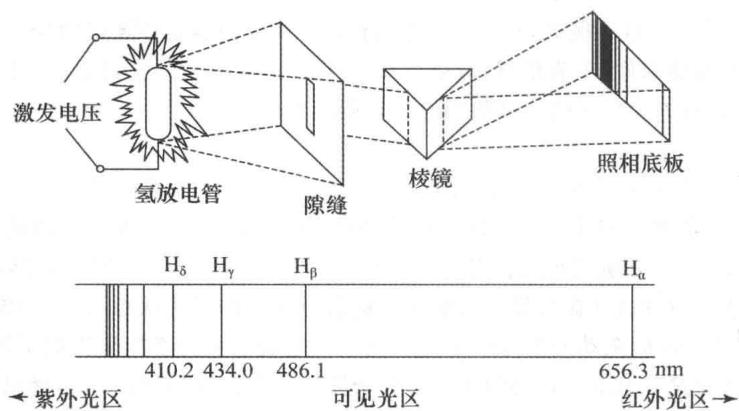

<!-- _class: lead invert -->
# 第二讲：原子结构
## §1 原子结构模型的发展史

**从Dalton实心球到Schrödinger波函数——一场跨越两千年的认知跃迁**

第9课 · 06-26

---

<!-- _class: default -->
# 学习目标

本节课结束后，你将能：

- ✅ 说出原子结构模型从Dalton到量子力学的**关键发展节点**及其实验依据
- ✅ **复述Bohr模型三假设**，推导氢原子光谱公式，计算Balmer系谱线波长
- ✅ 用**德布罗意关系式** $\lambda = h/p$ 计算实物粒子的波长
- ✅ 用**测不准原理**解释"轨道"概念的失效
- ✅ 理解**波函数** $\psi$ 的概率诠释

---

# 一、原子模型演变简史

每一代模型都是对上一代**局限性**的突破——不是旧模型错了，而是它只在特定精度下成立。

| 模型 | 提出者（年份） | 核心假设 | 实验依据 | 致命缺陷 |
|:---|:---:|:---|:---|:---|
| **实心球** | Dalton（1803） | 原子不可再分 | 倍比定律 | 未揭示内部结构 |
| **葡萄干布丁** | Thomson（1903） | 正电荷均匀分布 | 阴极射线→电子 | 无法解释α散射 |
| **核式模型** | Rutherford（1911） | 核（正+质量）+核外电子 | α散射实验 | 经典电磁→电子坠核 |
| **玻尔模型** | Bohr（1913） | 定态轨道+跃迁辐射 | 氢原子线状光谱 | 多电子+精细结构 |
| **量子力学** | Schrödinger（1926） | $\psi$ 描述，$\|\psi\|^2$ 概率密度 | 电子衍射 | — |

---

# 二、Bohr模型：旧量子论的巅峰

## 问题的起点：氢原子光谱为什么是线状的？

经典电磁学预测：
- 电子绕核加速运动 → 辐射电磁波 → 能量损失 → **连续光谱**

实际观测：
- 氢原子光谱是**线状的**——只有特定波长

---

# 氢原子光谱五线系



氢放电管发出的光经棱镜分光后，记录到一系列**分立谱线**——每一条对应电子在两个定态能级间的跃迁。

---

# Balmer系公式

| 线系名 | 低能级 $n_1$ | 光谱区 | 波数公式 |
|:---:|:---:|:---:|:---|
| Lyman系 | 1 | 紫外 | $\tilde{\nu}=R_H(1-1/n^2)$ |
| **Balmer系** | **2** | **可见光** | $\tilde{\nu}=R_H(1/4-1/n^2)$ |
| Paschen系 | 3 | 红外 | $\tilde{\nu}=R_H(1/9-1/n^2)$ |

Rydberg常数：$R_H = 1.097 \times 10^5\ \mathrm{cm^{-1}}$

---

# Bohr的三项革命性假设

> **假设一——定态假设**
> 电子只能在特定半径的轨道上运动，且**不辐射能量**。

> **假设二——角动量量子化**
> $L = n \cdot \dfrac{h}{2\pi}$，$n = 1,2,3,\dots$

> **假设三——跃迁假设**
> $\Delta E = E_2 - E_1 = h\nu = hc\tilde{\nu}$

---

# 定量推导：轨道半径

库仑力 = 向心力 + 角动量量子化：

$$
\frac{e^2}{4\pi\varepsilon_0 r^2} = \frac{mv^2}{r},\quad mvr = n\frac{h}{2\pi}
$$

联立消去 $v$：

$$
\boxed{r_n = a_0 \cdot n^2},\quad a_0 = 52.9\ \mathrm{pm}
$$

$a_0$ 称为 **Bohr半径**——基态氢原子中电子轨道半径。

---

# 定量推导：能级公式

电子能量 = 动能 + 势能：

$$
E_n = \frac{1}{2}mv^2 - \frac{e^2}{4\pi\varepsilon_0 r}
= -\frac{me^4}{8\varepsilon_0^2 h^2} \cdot \frac{1}{n^2}
$$

代入常数得**核心公式**：

$$
\boxed{E_n = -\frac{13.6}{n^2}\ \mathrm{eV}}
$$

---

# 嵌入式计算：Hα线波长

Hα线：$n=3 \rightarrow n=2$

$$
\tilde{\nu} = 1.097\times 10^5 \times \left(\frac{1}{4} - \frac{1}{9}\right)
= 15236\ \mathrm{cm^{-1}}
$$

$$
\lambda = \frac{1}{\tilde{\nu}} = 656.3\ \mathrm{nm}
$$

**656.3 nm → 可见光红色**，与实验完全吻合 ✅

---

# Bohr模型的成功与局限

**成功** ✅：
- 完美预测氢原子光谱五线系
- 计算Bohr半径 $a_0 = 52.9\ \mathrm{pm}$ 和基态能量 $-13.6\ \mathrm{eV}$
- 预测电离能 $I = 13.6\ \mathrm{eV}$

**局限** ❌：
- 不能解释**精细结构**（每一条谱线实际分裂为两条）
- 不能解释**多电子原子**（He即出现显著偏差）
- 定态假设本身与经典电磁理论相悖
- 无法解释**Zeeman效应**（磁场中谱线分裂）

> 🧠 **教学洞察**：玻尔模型是错的，但它是通往正确答案的桥。

---

# 三、波粒二象性：德布罗意的天才猜想

**1924年**，Louis de Broglie —— 不仅光具有波粒二象性，**所有实物粒子**也都具有波动性。

$$
\boxed{\lambda = \frac{h}{p} = \frac{h}{mv}}
$$

**直观理解**：
- 质量越大、速度越快 → 波长越短 → 波动性越不明显
- 10g子弹：$\lambda \approx 2\times 10^{-34}\ \mathrm{m}$（比原子核小数亿倍）
- 电子：质量极小，在原子尺度下波长与原子大小相当 → **波动性不可忽略**

**实验验证**：1927年 Davisson & Germer 电子衍射实验 ✅

---

# 四、测不准原理：轨道概念的终结

既然电子具有波动性，就不可能同时精确测定它的**位置**和**动量**。

$$
\boxed{\Delta x \cdot \Delta p \geq \frac{h}{4\pi}}
$$

## 嵌入式计算

电子在原子中运动范围 $r \approx 10^{-10}\ \mathrm{m}$，设 $\Delta x = 10^{-10}\ \mathrm{m}$：

$$
\Delta p \geq \frac{h}{4\pi \cdot \Delta x}
\approx 5.27\times 10^{-25}\ \mathrm{kg\cdot m/s}
$$

$$
\Delta v \geq \frac{\Delta p}{m_e}
\approx 5.8\times 10^5\ \mathrm{m/s}
$$

$\Delta v$ 与电子运动速度（$\sim 10^6\ \mathrm{m/s}$）**同一量级** → "轨道"概念失去意义 ❌

---

# 从"轨道"到"概率"

没有确定的轨道，电子该怎么描述？

**1926年**，Erwin Schrödinger提出波动方程：

$$
\boxed{\frac{\partial^2 \psi}{\partial x^2} + \frac{\partial^2 \psi}{\partial y^2} + \frac{\partial^2 \psi}{\partial z^2} + \frac{8\pi^2 m}{h^2}(E - V)\psi = 0}
$$

- $\psi$（波函数）= **概率振幅**
- $\|\psi\|^2$ = **概率密度**——电子在某点出现的概率

> **电子云** = $\|\psi\|^2$ 的可视化——黑点密集处概率大，稀疏处概率小。
> 这不是云，是概率的散布图。

---

# §1 发展史·思维框架

```
实验异常 → 旧模型失效 → 新假设提出 → 数学形式化 → 新预言被验证
```

| 步骤 | 对应事件 | 关键点 |
|:---|:---|---:|
| ① 实验异常 | 氢原子线状光谱 | 经典电磁学预测连续谱 |
| ② 旧模型失效 | Rutherford核式模型 | 加速电子应辐射能量→坠核 |
| ③ 新假设 | Bohr三假设 | 定态+角动量量子化+跃迁 |
| ④ 数学形式化 | $E_n = -13.6/n^2$ eV | 完美预测五线系 |
| ⑤ 新局限 | 精细结构/多电子 | → 量子力学的诞生 |

---

# 本课总结

**三大认知跃迁**：

| 跃迁 | 从 | 到 | 关键人物 |
|:---|:---|:---|:---:|
| ① 原子有结构 | 实心球 | 核式模型 | Thomson → Rutherford |
| ② 能量量子化 | 连续光谱 | 线状光谱 + 定态轨道 | Bohr |
| ③ 概率描述 | 轨道 | 波函数 + 概率密度 | de Broglie → Schrödinger |

> 🗣️ **课堂原话**："从玻尔到量子力学——是放弃'轨道'、接受'概率云'的思维升级。"

---

<!-- _class: lead invert -->
# 课后任务

1. **复习**：Bohr模型三假设 + Balmer系公式推导
2. **计算**：用 $\lambda = h/p$ 计算电子（$v=10^6$ m/s）的德布罗意波长
3. **预习**：§2 量子力学描述——薛定谔方程 + 四个量子数

> 下一节预告：$(x,y,z) \rightarrow (r,\theta,\varphi)$ —— 薛定谔方程的坐标变换
