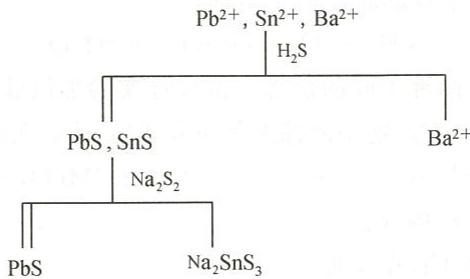

---
title: "元素与分析 第1章 化学基础与计量"
type: 习题集章节
updated: 2026-08-25
question_count: 68
subject_module: 元素与分析
---

# 第 1 章 化学基础与计量

> **题量**：68 ｜ **难度**：d2=11 d3=8 d4=45 d5=2

---

## 1.1 〔🟢 d1〕

> **来源**：第25届中国化学奥林匹克（初赛）第1题(15分) 第(1-1)小问

2011 年是国际化学年, 是居里夫人获得诺贝尔化学奖 100 周年。居里夫人发现的两种化学元素的元素符号和中文名称分别是 \_\_\_\_ 和 \_\_\_\_。

<details>
<summary>📖 查看答案</summary>

钋（Po）和镭（Ra）。

1898年居里夫妇先后发现了钋(Po)和镭(Ra)两种放射性元素。


## 题目图示与结构参考

!4e293826f39fd1fbde0c8bae1b5d6b43439298f7ae5da210010e5ebdc2c4871a.jpg

!ed2c9eaee823880bf399218d07b9596fecba1fc5a60c47719372d5208e7eaacc.jpg

!df8d66d087567b7be1c8cece58c9b5e1b662a94a51643513b283a8d0515ab38a.jpg

## 知识点映射

- 化学史
- 钋(Po)、镭(Ra)的发现

## 解题思路

本题考查化学基本常识。需要了解重要化学史事件：居里夫人于1898年发现钋和镭两种放射性元素。

## 易错分析

| 易错点 | 说明 |
|:---|:---|
| 元素符号拼写 | Po（钋）不要写成 Pa（镤） |
| 发现顺序 | 先发现钋(Po)，后发现镭(Ra) |

</details>

---

## 1.2 〔🟢 d1〕

> **来源**：第33届初赛第7题（原始文件：mineru/02-真题解析/33届初赛试题解析）
> **小问关联**：本文件为第(7-1-1)小问；其余小问见 题-033-7-1-2-Pt2F11结构、题-033-7-2-XeOF2构型、题-033-7-3-XeFN化合物、题-033-7-4-钙钛矿配位数

7-1 后续研究发现，Bartlett 当时得到的并非 $[\mathrm{Xe}]^{+}[\mathrm{PtF}_{6}]^{-}$，而可能是 $[\mathrm{XeF}]^{+}[\mathrm{Pt}_{2}\mathrm{F}_{11}]^{-}$。

7-1-1 写出 $[\mathrm{XeF}]^{+}[\mathrm{Pt}_{2}\mathrm{F}_{11}]^{-}$ 中 Xe 的氧化数。

<details>
<summary>📖 查看答案</summary>

**得分点**：
1. **正确判断 Xe 的氧化数**（2分）：+2

根据电中性规则，$[\mathrm{XeF}]^{+}$ 整体带 +1 电荷，F 的氧化数为 -1，因此：

$$
\text{Xe 的氧化数} + (-1) = +1
$$

$$
\text{Xe 的氧化数} = +2
$$

**答案**：Xe 的氧化数为 **+2**。

## 知识点映射

| 关联 KP | 考查角度 | 直接/间接 |
|---|---|:---:|
| 氧化数 | 利用电中性规则计算氧化数 | 直接 |
| 电中性规则 | 离子整体电荷与各元素氧化数的关系 | 直接 |
| 稀有气体化合物 | Xe 在化合物中的氧化态 | 直接 |

## 解题思路

1. **读题定位**：题目要求确定 $[\mathrm{XeF}]^{+}$ 中 Xe 的氧化数。
2. **🔑 关键转换**：利用电中性规则——离子整体电荷等于各元素氧化数之和。F 的氧化数为 -1，离子整体为 +1，因此 Xe 的氧化数为 +2。
3. **注意要点**：氧化数与形式电荷不同；Xe 作为稀有气体可以形成正氧化态化合物。

## 易错分析

| 错误 | 原因 | 纠正 | 课堂提问 |
|---|---|---|---|
| 认为 Xe 氧化数为 0 | 误以为稀有气体不参与成键 | 稀有气体可以形成化合物，具有正氧化态 | 稀有气体为什么可以形成化合物？ |
| 认为 Xe 氧化数为 +1 | 未考虑 F 的氧化数 | F 在化合物中通常为 -1 | 氟在化合物中的氧化数通常是多少？ |
| 混淆氧化数与化合价 | 概念不清 | 氧化数是形式电荷，化合价是实际成键数 | 氧化数与化合价有什么区别？ |
| 忽略离子电荷 | 未利用 $[\mathrm{XeF}]^{+}$ 的整体电荷 | 整体电荷为 +1 是计算的关键条件 | 如何利用离子电荷计算其中元素的氧化数？ |

## 🔗 同大题小问

```dataviewjs
const name = dv.current().file.name;
const m = name.match(/^(题-\d+b?-\d+-)\d+-/);
if (m) {
  const prefix = m[1];
  const pages = dv.pages('"04-题库/真题"')
    .where(p => p.file.name.startsWith(prefix) && p.file.name !== name)
    .sort(p => parseInt(p.file.name.match(/-(\d+)-/)[1]));
  if (pages.length) {
    dv.header(4, "🔗 同大题小问（按序）");
    dv.list(pages.map(p => p.file.link));
  }
}
```

</details>

---

## 1.3 〔🟢 d2〕

> **来源**：第27届中国化学奥林匹克（初赛）第5题(10分) 第(5-1)小问

$\mathrm{M}_{3}\mathrm{XY}$ 呈反钙钛矿结构。反应消耗 0.93 g M 可获得 0.50 L A₂ 气体（25℃，100 kPa）。计算 M 的摩尔质量。

<details>
<summary>📖 查看答案</summary>

$$n(\mathrm{A}_{2}) = \frac{pV}{RT} = \frac{100 \times 0.50}{8.314 \times 298.15} = 0.02017 \text{ mol}$$

由方程式 M + MXA + MY → M₃XY + ½A₂：

消耗2 mol M产生1 mol A₂，故 n(M) = 2n(A₂) = 0.04034 mol

$$M(\mathrm{M}) = \frac{0.93}{0.04034} = 23.05 \text{ g/mol}$$

**M ≈ 23 g/mol（Na）**


## 题目图示与结构参考

!5a3fcb756b7fef96a16dc7c20ec64b0b5d9eb5c483faa20680c855b3e7e50b68.jpg

## 知识点映射

| 知识点 | 对应内容 |
|:---|:---|
| 理想气体方程 | pV = nRT |
| 化学计量 | 方程式中M与A₂的比例 |
| 反钙钛矿 | M₃XY型结构 |

## 解题思路

1. 由pV=nRT计算A₂物质的量
2. 由方程式确定M与A₂的计量比（2:1）
3. 由质量和物质的量得摩尔质量

## 易错分析

| 易错点 | 说明 |
|:---|:---|
| 温度单位 | 25℃ = 298.15 K |
| 计量比 | 2M → ½A₂，即M:A₂ = 2:1 |
| 单位 | R = 8.314 kPa·L/(mol·K) |

</details>

---

## 1.4 〔🟢 d2〕

> **来源**：第28届初赛第1题（原始文件：mineru/02-真题解析/28届初赛试题解析）
> **小问关联**：本文件为第(1-1)小问；其余小问见 题-028-1-2-反应热计算

合成氨原料气由天然气在高温下与水和空气反应而得。涉及的主要反应如下：

$$
\begin{array}{l}
\mathrm{CH}_4(\mathrm{g}) + \mathrm{H}_2\mathrm{O}(\mathrm{g}) \longrightarrow \mathrm{CO}(\mathrm{g}) + 3\mathrm{H}_2(\mathrm{g}) \quad (1) \\
2\mathrm{CH}_4(\mathrm{g}) + \mathrm{O}_2(\mathrm{g}) \longrightarrow 2\mathrm{CO}(\mathrm{g}) + 4\mathrm{H}_2(\mathrm{g}) \quad (2) \\
\mathrm{CO}(\mathrm{g}) + \mathrm{H}_2\mathrm{O}(\mathrm{g}) \longrightarrow \mathrm{H}_2(\mathrm{g}) + \mathrm{CO}_2(\mathrm{g}) \quad (3)
\end{array}
$$

假设反应产生的 CO 全部转化为 $\mathrm{CO}_2$，$\mathrm{CO}_2$ 被碱液完全吸收，剩余的 $\mathrm{H}_2\mathrm{O}$ 通过冷凝干燥除去。进入合成氨反应塔的原料气为纯净的 $\mathrm{N}_2$ 和 $\mathrm{H}_2$。

1-1 为使原料气中 $\mathrm{N}_2$ 和 $\mathrm{H}_2$ 的体积比为 $1:3$，推出起始气体中 $\mathrm{CH}_4$ 和空气的比例。设空气中 $\mathrm{O}_2$ 和 $\mathrm{N}_2$ 的比例为 $1:4$，所有气体均按理想气体处理。

<details>
<summary>📖 查看答案</summary>

**得分点**：
1. **正确设定未知数或选取基准量**（1分）：如设 $\mathrm{N}_2$ 为 $4\,\mathrm{mol}$
2. **正确计算由反应(2)和(3)产生的 $\mathrm{H}_2$ 量**（1分）：$\mathrm{O}_2$ 完全消耗生成 $6\,\mathrm{mol}\,\mathrm{H}_2$
3. **正确计算由反应(1)和(3)额外产生的 $\mathrm{H}_2$ 量**（1分）：需 $1.5\,\mathrm{mol}\,\mathrm{CH}_4$ 生成 $6\,\mathrm{mol}\,\mathrm{H}_2$

**法一：分析法**

简化计算，从不参与反应的 $\mathrm{N}_2$ 入手：设起始气体中 $\mathrm{N}_2$ 有 $4\,\mathrm{mol}$，则共有空气 $5\,\mathrm{mol}$（$4\,\mathrm{mol}\,\mathrm{N}_2 + 1\,\mathrm{mol}\,\mathrm{O}_2$）。为使原料气中 $\mathrm{N}_2$ 和 $\mathrm{H}_2$ 的体积比为 $1:3$，需要产生 $12\,\mathrm{mol}\,\mathrm{H}_2$。

$\mathrm{O}_2$ 被消耗的唯一途径是与 $\mathrm{CH}_4$ 反应。由反应 (2) 知，用于消耗 $\mathrm{O}_2$ 的 $\mathrm{CH}_4$ 共需 $2\,\mathrm{mol}$，产物为 $4\,\mathrm{mol}\,\mathrm{H}_2$ 和 $2\,\mathrm{mol}\,\mathrm{CO}$；而产生的 $\mathrm{CO}$ 经反应 (3) 转化为 $2\,\mathrm{mol}\,\mathrm{CO}_2$ 和 $2\,\mathrm{mol}\,\mathrm{H}_2$。因此，$\mathrm{O}_2$ 完全消耗，共生成 $6\,\mathrm{mol}\,\mathrm{H}_2$。

根据分体积定律，$V_{\mathrm{A}} = x_{\mathrm{A}}V$，$V_{\mathrm{A}}:V_{\mathrm{B}} = x_{\mathrm{A}}:x_{\mathrm{B}} = n_{\mathrm{A}}:n_{\mathrm{B}}$。

另外的 $6\,\mathrm{mol}\,\mathrm{H}_2$ 由反应 (1) 和 (3) 提供。可看出 $\mathrm{CH}_4 \sim (3+1)\mathrm{H}_2 = 4\mathrm{H}_2$，故需 $\mathrm{CH}_4\,1.5\,\mathrm{mol}$。

因此，起始体系中 $\mathrm{CH}_4$ 与 $\mathrm{O}_2$ 的体积比为 $3.5:1$，$\mathrm{CH}_4$ 与空气的体积比为 $3.5:5$（即 $7:10$）。

**法二：综合法**

列出总的转化方程式（将惰性的 $\mathrm{N}_2$ 也写入方程）：

$$
x\mathrm{CH}_4 + y\mathrm{O}_2 + 4y\mathrm{N}_2 + z\mathrm{H}_2\mathrm{O} \longrightarrow x\mathrm{CO}_2 + 12y\mathrm{H}_2 + 4y\mathrm{N}_2
$$

得到物质的量方程：

$$
\begin{array}{l}
4x + 2z = 24y \quad (\mathrm{H}\text{守恒}) \\
2y + z = 2x \quad (\mathrm{O}\text{守恒})
\end{array}
$$

联立解得：

$$
\begin{array}{l}
x:y = 7:2 \\
x:5y = 7:10
\end{array}
$$

## 知识点映射

| 关联 KP | 考查角度 | 直接/间接 |
|---|---|:---:|
| 理想气体状态方程 | 分体积定律、体积比等于物质的量比 | 直接 |
| 化学计量 | 多步反应的物料衡算 | 直接 |
| 物料守恒 | 元素守恒列方程 | 直接 |

## 解题思路

1. **读题定位**：题目要求推出起始气体中 $\mathrm{CH}_4$ 和空气的比例，已知最终 $\mathrm{N}_2:\mathrm{H}_2 = 1:3$。
2. **🔑 关键转换**：从不参与反应的 $\mathrm{N}_2$ 入手设基准量（$4\,\mathrm{mol}\,\mathrm{N}_2$ 对应 $5\,\mathrm{mol}$ 空气），反推所需 $\mathrm{H}_2$ 总量，再分步计算各反应贡献的 $\mathrm{H}_2$。
3. **计算要点**：注意反应 (2) 产生的 CO 需经反应 (3) 进一步转化为 $\mathrm{CO}_2$ 和 $\mathrm{H}_2$；反应 (1) 与反应 (3) 耦合时 $\mathrm{CH}_4 \sim 4\mathrm{H}_2$。

## 易错分析

| 错误 | 原因 | 纠正 | 课堂提问 |
|---|---|---|---|
| 忽略反应(3)对H2的贡献 | 只算反应(2)产生的H2 | CO经水气变换反应额外产生H2 | 反应(2)产生的CO最终去向是什么？ |
| 未用N2作为基准量 | 试图同时设多个未知数 | N2是惰性气体，量始终不变 | 为什么选择N2作为解题突破口？ |
| 体积比与物质的量比混淆 | 未理解理想气体分体积定律 | 同温同压下体积比等于物质的量比 | 分体积定律的适用条件是什么？ |

</details>

---

## 1.5 〔🟢 d2〕

> **来源**：第29届初赛第1题（原始文件：mineru/02-真题解析/29届初赛试题解析）
> **小问关联**：本文件为第(1-1)小问；其余小问见 题-029-1-2-黄血盐制备方程式、题-029-1-3-黄血盐氧化方程式、题-029-1-4-硫酸银与硫歧化方程式

将热的硝酸铅溶液滴入热的铬酸钾溶液，产生碱式铬酸铅沉淀 $\left[\mathrm{Pb}_{2}(\mathrm{OH})_{2}\mathrm{CrO}_{4}\right]$ 。

<details>
<summary>📖 查看答案</summary>

化学方程式：

$$
2 \mathrm{Pb} (\mathrm{NO} _ {3}) _ {2} + 3 \mathrm{K} _ {2} \mathrm{CrO} _ {4} + \mathrm{H} _ {2} \mathrm{O} \longrightarrow \mathrm{Pb} _ {2} (\mathrm{OH}) _ {2} \mathrm{CrO} _ {4} + 4 \mathrm{KNO} _ {3} + \mathrm{K} _ {2} \mathrm{Cr} _ {2} \mathrm{O} _ {7}
$$

离子方程式：

$$
2 \mathrm{Pb} ^ {2 +} + 3 \mathrm{CrO} _ {4} ^ {2 -} + \mathrm{H} _ {2} \mathrm{O} \longrightarrow \mathrm{Pb} _ {2} (\mathrm{OH}) _ {2} \mathrm{CrO} _ {4} + \mathrm{Cr} _ {2} \mathrm{O} _ {7} ^ {2 -}
$$

## 解析

这是一个非氧化还原的离子反应。首先明确酸碱性，本题中硝酸铅溶液为酸性，而铬酸钾为碱性，将硝酸铅溶液滴入碱性铬酸钾溶液，这说明产物体系为碱性，生成的 $\mathrm{H}^{+}$ 需要被中和。总反应可以看作下列两个反应的耦合：

沉淀反应 $2\mathrm{Pb}^{2+} + 2\mathrm{CrO}_4^{2-} + 2\mathrm{H}_2\mathrm{O}\longrightarrow \mathrm{Pb}_2(\mathrm{OH})_2\mathrm{CrO}_4 + 2\mathrm{H}^+$

同多酸缩聚反应 $2\mathrm{CrO}_4^{2-} + 2\mathrm{H}^+ \longrightarrow \mathrm{Cr}_2\mathrm{O}_7^{2-} + \mathrm{H}_2\mathrm{O}$

题目未要求写出化学方程式或离子方程式，故两种答案均可。

实际上，若交换滴加顺序，将铬酸钾滴入酸性的硝酸铅，会生成"铬黄"铬酸铅 $\mathrm{PbCrO}_{4}$ 。

## 知识点映射

| 知识点 | 说明 |
|:---|:---|
| 离子反应 | 非氧化还原的离子沉淀反应，需考虑酸碱环境 |
| 铬酸盐化学 | 铬酸根与重铬酸根在不同pH下的平衡转化 |
| 碱式盐 | 碱式铬酸铅 $\mathrm{Pb}_2(\mathrm{OH})_2\mathrm{CrO}_4$ 的生成条件 |
| 同多酸缩聚 | 酸性条件下铬酸根缩聚为重铬酸根 |

## 易错分析

| 常见错误 | 正确思路 |
|:---|:---|
| 只写生成 $\mathrm{PbCrO}_4$ 的方程式 | 注意题目要求生成的是碱式铬酸铅，且滴加顺序决定产物 |
| 忽略重铬酸根的生成 | 酸性条件下部分铬酸根会缩聚为重铬酸根，需配平完整 |
| 未考虑体系酸碱性 | 硝酸铅溶液为酸性，铬酸钾为碱性，产物体系为碱性 |

</details>

---

## 1.6 〔🟢 d2〕

> **来源**：第30届初赛第6题（原始文件：mineru/02-真题解析/30届初赛试题解析）
> **小问关联**：本文件为第6-1小问；其余小问见 题-030-6-2-315K下N2O4NO2分压计算、题-030-6-3-体积比及物质的量之比、题-030-6-4-NO2分压最大理论趋近值、题-030-6-5-平衡移动方向选择题、题-030-6-6-恒压vs恒容平衡移动程度

$N_{2}O_{4}$ 和 $NO_{2}$ 的相互转化 $\mathrm{N}_{2}\mathrm{O}_{4}(\mathrm{~g})\rightleftharpoons2\mathrm{NO}_{2}(\mathrm{~g})$ 是讨论化学平衡问题的常用体系。已知该反应在 295 K 和 315 K 温度下的平衡常数 $K_{p}$ 分别为 0.100 和 0.400。将一定量的气体充入一个带活塞的特制容器，通过活塞移动使体系总压恒为 1 bar (1 bar = 100 kPa)。

计算 $295 \mathrm{~K}$ 下体系达到平衡时 $\mathrm{N}_{2} \mathrm{O}_{4}$ 和 $\mathrm{NO}_{2}$ 的分压。

<details>
<summary>📖 查看答案</summary>

- $\mathrm{NO}_2$ 分压：$27.0 \mathrm{~kPa}$
- $\mathrm{N}_2\mathrm{O}_4$ 分压：$73.0 \mathrm{~kPa}$

## 解析

题目给了 295 K 下的平衡常数 $K_{p}$，题干中的平衡常数没有单位，而该反应后分子数变多了，因此该 $K_{p}$ 指的是用压强表示的标准平衡常数 $K^{\ominus}$。设 $\mathrm{NO}_{2}$ 的分压为 x kPa，则 $\mathrm{N}_{2}\mathrm{O}_{4}$ 分压为 $(100 - x)$ kPa。根据平衡常数表达式列出方程：

$$
K^{\ominus} = \frac{(x / p^{\ominus})^{2}}{(100 - x) / p^{\ominus}} = 0.100 \quad (p^{\ominus} = 100 \mathrm{~kPa})
$$

$$
x = 27.0 \mathrm{~kPa}
$$

所以 $\mathrm{NO}_2$ 分压为 $27.0 \mathrm{~kPa}$，$\mathrm{N}_2\mathrm{O}_4$ 分压为 $73.0 \mathrm{~kPa}$。

## 知识点映射

| 知识点 | 说明 |
|:---|:---|
| 标准平衡常数 | $K^{\ominus}$ 用相对分压表示，无量纲 |
| 分压计算 | 恒压条件下，各组分分压之和等于总压 |
| 平衡常数表达式 | $K^{\ominus} = (p_{NO_2}/p^{\ominus})^2 / (p_{N_2O_4}/p^{\ominus})$ |
| 一元二次方程 | 列方程后求解得到平衡分压 |

## 易错分析

| 常见错误 | 正确思路 |
|:---|:---|
| 直接用分压而不除以p° | 标准平衡常数需用相对分压 |
| 设N₂O₄分压为x | 设NO₂分压为x更便于列方程 |
| 忽略恒压条件 | 总压恒为1 bar = 100 kPa |
| 计算错误 | 解方程得x=27.0（另一根不合理舍去） |

</details>

---

## 1.7 〔🟢 d2〕

> **来源**：第31届初赛第1题（原始文件：mineru/02-真题解析/31届初赛试题解析）
> **小问关联**：本文件为第(1-1)小问；其余小问见 题-031-1-2-钚氧化方程式、题-031-1-3-硼氢化钠与氯化镍反应、题-031-1-4-氟化锰制备方程式、题-031-1-5-磷化氢与甲醛反应

工业上从碳酸氢铵和镁硼石 $\left[\mathrm{Mg}_{2}\mathrm{B}_{2}\mathrm{O}_{4}(\mathrm{OH})_{2}\right]$ 在水溶液中反应制备硼酸。

<details>
<summary>📖 查看答案</summary>

这是一个非氧化还原反应，我们通过逐步推理分析：

简单对比反应物和产物可知，若镁硼石中的硼酸根离子转化为 $\mathrm{H}_{3} \mathrm{BO}_{3}$ ，需要从反应体系中获得质子。而体系中可以提供质子的物种有 $\mathrm{NH}_{4}^{+}$ 和 $\mathrm{HCO}_{3}^{-}$ ，其 $\mathrm{pK}_{\mathrm{a}}$ 分别为9.25和10.25，相差不大，因此在反应过程中应该同时作为质子供体，反应生成 $\mathrm{NH}_{3}$ 和 $\mathrm{CO}_{3}^{2-}$ 。随后考虑到镁硼石中还含有 $\mathrm{Mg}^{2+}$ ，在 $\mathrm{NH}_{3}$ 和 $\mathrm{CO}_{3}^{2-}$ 存在的碱性环境下会以碳酸镁或者碱式碳酸镁的形式沉淀。最后检查：所得的这些物质在题目的条件下确实可以共存。事实上这可以看作沉淀转化反应，镁硼石逐渐转化为镁的氢氧化物或者碱式碳酸盐沉淀。所以最终的方程式写为

$$
\mathrm{Mg} _ {2} \mathrm{B} _ {2} \mathrm{O} _ {4} (\mathrm{OH}) _ {2} + 2 \mathrm{NH} _ {4} \mathrm{HCO} _ {3} \longrightarrow 2 \mathrm{H} _ {3} \mathrm{BO} _ {3} + 2 \mathrm{NH} _ {3} + 2 \mathrm{MgCO} _ {3}
$$

或

$$
\mathrm{Mg} _ {2} \mathrm{B} _ {2} \mathrm{O} _ {4} (\mathrm{OH}) _ {2} + \mathrm{NH} _ {4} \mathrm{HCO} _ {3} + 2 \mathrm{H} _ {2} \mathrm{O} \longrightarrow 2 \mathrm{H} _ {3} \mathrm{BO} _ {3} + \mathrm{NH} _ {3} + \mathrm{Mg} _ {2} (\mathrm{OH}) _ {2} \mathrm{CO} _ {3}
$$

## 解析

本题考查非氧化还原反应方程式的书写。关键思路：
1. 镁硼石中的硼酸根需要质子转化为硼酸
2. 体系中 $\mathrm{NH}_{4}^{+}$ 和 $\mathrm{HCO}_{3}^{-}$ 均可提供质子
3. $\mathrm{Mg}^{2+}$ 在碱性条件下生成碳酸镁或碱式碳酸镁沉淀
4. 本质是沉淀转化反应

## 知识点映射

| 知识点 | 说明 |
|:---|:---|
| 非氧化还原反应 | 通过质子转移实现反应，无电子得失 |
| 沉淀转化 | 镁硼石转化为镁的碳酸盐/碱式碳酸盐沉淀 |
| 硼酸制备 | 工业上从镁硼石制备硼酸的方法 |

## 易错分析

| 常见错误 | 正确思路 |
|:---|:---|
| 只考虑 $\mathrm{NH}_{4}^{+}$ 或只考虑 $\mathrm{HCO}_{3}^{-}$ 作为质子供体 | 两者 $\mathrm{pK}_{\mathrm{a}}$ 相近，应同时参与 |
| 忽略 $\mathrm{Mg}^{2+}$ 的沉淀 | 碱性条件下 $\mathrm{Mg}^{2+}$ 必然以碳酸盐形式沉淀 |
| 写不出碱式碳酸镁产物 | 允许写碳酸镁或碱式碳酸镁两种形式 |

</details>

---

## 1.8 〔🟢 d2〕

> **来源**：第32届初赛第5题（原始文件：mineru/02-真题解析/32届初赛试题解析）
> **小问关联**：本文件为第(5-1-1)小问；其余小问见 题-032-5-1-2-质量数及比例、题-032-5-2-1-Lu衰变核反应方程式、题-032-5-2-2-衰变速率常数k、题-032-5-2-3-岩石年龄计算、题-032-5-2-4-初始Hf比值

5-1 已知 Cl 有两种同位素 ${}^{35}\mathrm{Cl}$ 和 ${}^{37}\mathrm{Cl}$，二者丰度比为 0.75:0.25；Rb 有两种同位素 ${}^{85}\mathrm{Rb}$ 和 ${}^{87}\mathrm{Rb}$，二者丰度比为 0.72:0.28。

5-1-1 写出气态中同位素组成不同的 RbCl 分子。

<details>
<summary>📖 查看答案</summary>

**得分点**：
1. **正确列出所有同位素组合**（2分）：共 4 种

气态中同位素组成不同的 RbCl 分子：

- ${}^{85}\mathrm{Rb}^{35}\mathrm{Cl}$
- ${}^{87}\mathrm{Rb}^{35}\mathrm{Cl}$
- ${}^{85}\mathrm{Rb}^{37}\mathrm{Cl}$
- ${}^{87}\mathrm{Rb}^{37}\mathrm{Cl}$

## 知识点映射

| 关联 KP | 考查角度 | 直接/间接 |
|---|---|:---:|
| 同位素组合 | 两种同位素的 Rb 与两种同位素的 Cl 组合 | 直接 |
| 质谱 | 不同同位素分子在质谱中呈现不同峰 | 间接 |
| 同位素丰度 | 同位素丰度决定各分子的相对含量 | 间接 |

## 解题思路

1. **读题定位**：题目要求写出气态中同位素组成不同的 RbCl 分子。
2. **🔑 关键转换**：Rb 有 2 种同位素，Cl 有 2 种同位素，根据乘法原理，共有 $2 \times 2 = 4$ 种同位素组成不同的 RbCl 分子。
3. **书写要点**：逐一列出所有组合，确保不遗漏。

## 易错分析

| 错误 | 原因 | 纠正 | 课堂提问 |
|---|---|---|---|
| 遗漏某种组合 | 未系统性地列举 | 按 Rb 同位素分类，每种 Rb 对应 2 种 Cl 同位素 | 如何确保不遗漏同位素组合？ |
| 写离子而非分子 | 题目要求气态分子 | 气态 RbCl 以分子形式存在 | 气态 RbCl 以什么形式存在？ |
| 写 ${}^{86}\mathrm{Rb}$ 等不存在同位素 | 未注意 Rb 只有 85 和 87 两种稳定同位素 | Rb 的稳定同位素为 ${}^{85}\mathrm{Rb}$ 和 ${}^{87}\mathrm{Rb}$ | Rb 有哪些稳定同位素？ |

## 🔗 同大题小问

```dataviewjs
const name = dv.current().file.name;
const m = name.match(/^(题-\d+b?-\d+-)\d+-/);
if (m) {
  const prefix = m[1];
  const pages = dv.pages('"04-题库/真题"')
    .where(p => p.file.name.startsWith(prefix) && p.file.name !== name)
    .sort(p => parseInt(p.file.name.match(/-(\d+)-/)[1]));
  if (pages.length) {
    dv.header(4, "🔗 同大题小问（按序）");
    dv.list(pages.map(p => p.file.link));
  }
}
```

</details>

---

## 1.9 〔🟢 d2〕

> **来源**：第32届初赛第5题（原始文件：mineru/02-真题解析/32届初赛试题解析）
> **小问关联**：本文件为第(5-1-2)小问；其余小问见 题-032-5-1-1-RbCl同位素分子、题-032-5-2-1-Lu衰变核反应方程式、题-032-5-2-2-衰变速率常数k、题-032-5-2-3-岩石年龄计算、题-032-5-2-4-初始Hf比值

5-1-2 这些分子有几种质量数？写出质量数，并给出其比例。

<details>
<summary>📖 查看答案</summary>

**得分点**：
1. **正确判断共有 3 种质量数**（1分）：${}^{87}\mathrm{Rb}^{35}\mathrm{Cl}$ 和 ${}^{85}\mathrm{Rb}^{37}\mathrm{Cl}$ 质量数相同
2. **正确写出 3 种质量数**（2分）：120、122、124
3. **正确计算比例**（2分）：

共有 **3** 种质量数，分别为：**120、122、124**

$$
\omega_{120} = 0.75 \times 0.72 = 0.54
$$

$$
\omega_{122} = 0.25 \times 0.72 + 0.75 \times 0.28 = 0.39
$$

$$
\omega_{124} = 0.25 \times 0.28 = 0.07
$$

故

$$
\omega_{120} : \omega_{122} : \omega_{124} = 54 : 39 : 7
$$

## 知识点映射

| 关联 KP | 考查角度 | 直接/间接 |
|---|---|:---:|
| 同位素丰度 | 利用丰度计算各质量数的相对含量 | 直接 |
| 加权平均 | 多种同位素组合的质量数加权 | 直接 |
| 分子离子峰 | 质谱中分子离子峰的相对强度 | 间接 |

## 解题思路

1. **读题定位**：题目要求计算 RbCl 同位素分子的质量数种类及比例。
2. **🔑 关键转换**：${}^{87}\mathrm{Rb}^{35}\mathrm{Cl}$ 质量数为 $87 + 35 = 122$，${}^{85}\mathrm{Rb}^{37}\mathrm{Cl}$ 质量数为 $85 + 37 = 122$，两者质量数相同。因此 4 种分子只有 3 种质量数。利用同位素丰度计算各质量数的比例。
3. **计算要点**：注意 ${}^{87}\mathrm{Rb}^{35}\mathrm{Cl}$ 和 ${}^{85}\mathrm{Rb}^{37}\mathrm{Cl}$ 的质量数相同，需合并计算。

## 易错分析

| 错误 | 原因 | 纠正 | 课堂提问 |
|---|---|---|---|
| 认为有 4 种质量数 | 未注意两种分子质量数相同 | ${}^{87}\mathrm{Rb}^{35}\mathrm{Cl}$ 和 ${}^{85}\mathrm{Rb}^{37}\mathrm{Cl}$ 质量数均为 122 | 如何快速判断不同同位素组合是否有相同质量数？ |
| 比例计算错误 | 未合并相同质量数的分子 | 质量数 122 对应两种分子，丰度需相加 | 当不同组合具有相同质量数时如何处理？ |
| 丰度比与原子比混淆 | 未注意题目给出的是丰度比 | 丰度比直接作为概率相乘 | 丰度比与物质的量分数有何关系？ |

## 🔗 同大题小问

```dataviewjs
const name = dv.current().file.name;
const m = name.match(/^(题-\d+b?-\d+-)\d+-/);
if (m) {
  const prefix = m[1];
  const pages = dv.pages('"04-题库/真题"')
    .where(p => p.file.name.startsWith(prefix) && p.file.name !== name)
    .sort(p => parseInt(p.file.name.match(/-(\d+)-/)[1]));
  if (pages.length) {
    dv.header(4, "🔗 同大题小问（按序）");
    dv.list(pages.map(p => p.file.link));
  }
}
```

</details>

---

## 1.10 〔🟢 d2〕

> **来源**：第32届初赛第5题（原始文件：mineru/02-真题解析/32届初赛试题解析）
> **小问关联**：本文件为第(5-2-1)小问；其余小问见 题-032-5-1-1-RbCl同位素分子、题-032-5-1-2-质量数及比例、题-032-5-2-2-衰变速率常数k、题-032-5-2-3-岩石年龄计算、题-032-5-2-4-初始Hf比值

5-2 年代测定是地质学的一项重要工作，Lu-Hf 法是 20 世纪 80 年代随着等离子体发射光谱、质谱等技术发展而建立的一种新断代法。Lu 有两种天然同位素：$^{176}\mathrm{Lu}$ 和 $^{177}\mathrm{Lu}$；Hf 有六种天然同位素：$^{176}\mathrm{Hf}$、$^{177}\mathrm{Hf}$、$^{178}\mathrm{Hf}$、$^{179}\mathrm{Hf}$、$^{180}\mathrm{Hf}$ 和 $^{181}\mathrm{Hf}$。$^{176}\mathrm{Lu}$ 发生 $\beta$ 衰变生成 $^{176}\mathrm{Hf}$，半衰期为 $3.716 \times 10^{10}$ 年。$^{177}\mathrm{Hf}$ 为稳定同位素且无放射性来源。

5-2-1 写出 ${}^{176}\mathrm{Lu}$ 发生 $\beta$ 衰变的核反应方程式（标出核电荷数和质量数）。

<details>
<summary>📖 查看答案</summary>

**得分点**：
1. **正确标出核电荷数和质量数**（2分）
2. **正确写出 β 粒子**（1分）：${}_{-1}^{0}\mathrm{e}$
3. **保证电荷数和质量数守恒**（1分）

核反应方程式：

$$
{}_{71}^{176}\mathrm{Lu} \longrightarrow {}_{72}^{176}\mathrm{Hf} + {}_{-1}^{0}\mathrm{e}
$$

## 知识点映射

| 关联 KP | 考查角度 | 直接/间接 |
|---|---|:---:|
| β衰变 | β 衰变的本质：中子转变为质子，放出电子 | 直接 |
| 核反应方程式 | 核电荷数和质量数守恒 | 直接 |
| 半衰期 | Lu-Hf 法定年的基础 | 间接 |

## 解题思路

1. **读题定位**：题目要求书写 ${}^{176}\mathrm{Lu}$ 发生 $\beta$ 衰变的核反应方程式，需标出核电荷数和质量数。
2. **🔑 关键转换**：$\beta$ 衰变的本质是原子核内一个中子转变为质子，同时放出一个电子（$\beta$ 粒子）和一个反中微子。因此质量数不变，核电荷数增加 1。${}^{176}\mathrm{Lu}$（Z=71）衰变为 ${}^{176}\mathrm{Hf}$（Z=72），放出 ${}_{-1}^{0}\mathrm{e}$。
3. **书写要点**：必须标出核电荷数（左下角）和质量数（左上角），并验证守恒。

## 易错分析

| 错误 | 原因 | 纠正 | 课堂提问 |
|---|---|---|---|
| 核电荷数标错 | 未记住 Lu 和 Hf 的原子序数 | Lu 为 71，Hf 为 72 | β 衰变后核电荷数如何变化？ |
| β 粒子写为 ${}_{+1}^{0}\mathrm{e}$ | 混淆 β+ 和 β- 衰变 | β- 衰变放出电子 ${}_{-1}^{0}\mathrm{e}$ | β+ 衰变和 β- 衰变有何区别？ |
| 质量数变化 | 误认为 β 衰变质量数改变 | β 衰变质量数不变，核电荷数变化 | β 衰变中质量数和核电荷数如何变化？ |
| 未标核电荷数 | 忽略题目要求 | 必须标出核电荷数和质量数 | 核反应方程式中为什么需要标出核电荷数？ |

## 🔗 同大题小问

```dataviewjs
const name = dv.current().file.name;
const m = name.match(/^(题-\d+b?-\d+-)\d+-/);
if (m) {
  const prefix = m[1];
  const pages = dv.pages('"04-题库/真题"')
    .where(p => p.file.name.startsWith(prefix) && p.file.name !== name)
    .sort(p => parseInt(p.file.name.match(/-(\d+)-/)[1]));
  if (pages.length) {
    dv.header(4, "🔗 同大题小问（按序）");
    dv.list(pages.map(p => p.file.link));
  }
}
```

</details>

---

## 1.11 〔🟢 d2〕

> **来源**：第33届初赛第2题（原始文件：mineru/02-真题解析/33届初赛试题解析）
> **小问关联**：本文件为第(2-3)小问；其余小问见 题-033-2-1-核反应方程式、题-033-2-2-二元氧化物含氧量

2-3 9.413 g 未知二元气体化合物含有 0.003227 g 电子，推出该未知物，写出化学式。

<details>
<summary>📖 查看答案</summary>

**得分点**：
1. **正确计算电子的物质的量**（1分）
2. **正确计算质量与电子数的比值**（1分）
3. **正确推断出未知物为 CH₄**（2分）

首先将电子质量转化为电子的物质的量，电子质量 $m_{\mathrm{e}} = 9.109 \times 10^{-31} \mathrm{~kg}$，代入数据：

$$
n (\mathrm{e}^{-}) = \frac{m (\mathrm{e}^{-})}{m_{\mathrm{e}} \cdot N_{\mathrm{A}}} = \frac{0.003227 \mathrm{g} \times 10^{-3} \mathrm{kg/g}}{9.109 \times 10^{-31} \mathrm{kg} \times 6.022 \times 10^{23} \mathrm{mol}^{-1}} = 5.883 \mathrm{mol}
$$

取质量数与电子数的比值（化合物总电子数与总核电荷数相等，质量数与电子数的比值也是质量数与核电荷数的比值）：

$$
\frac{9.413 \mathrm{g}}{n (\mathrm{e}^{-})} = \frac{9.413 \mathrm{g}}{5.883 \mathrm{mol}} = 1.600 \mathrm{g \, mol}^{-1} = \frac{8}{5} \mathrm{g \, mol}^{-1}
$$

对数字敏感的同学应意识到 $8/5 = 16/10 = 24/15 = 32/20 = \cdots$。系统解法：首先排除金属元素，对非金属元素而言，H 的质量/核电荷比为 $1.008/1 \approx 1.008$，而其他元素均大于 2，说明气体中必须含有 H 元素。设化合物为 $\mathrm{H}_m\mathrm{Y}_y$，则：

$$
\frac{m + y \cdot M(\mathbf{Y})}{m + y \cdot Z(\mathbf{Y})} = 1.600
$$

解不定方程，简单枚举即可得到唯一答案 $\mathbf{CH}_4$。

## 知识点映射

| 关联 KP | 考查角度 | 直接/间接 |
|---|---|:---:|
| 化学计量 | 通过电子质量推算化合物组成 | 直接 |
| 电子质量 | 利用基本物理常数进行计算 | 直接 |
| 不定方程 | 解二元不定方程确定化学式 | 直接 |
| 气体推断 | 结合"气体"条件限定答案范围 | 间接 |

## 解题思路

1. **读题定位**：题目给出二元气体化合物的质量和其中电子的质量，要求推断化学式。
2. **🔑 关键转换**：先计算电子的物质的量，再求化合物质量与电子物质的量的比值（即平均每个电子对应的质量），该比值等于质量数与核电荷数之比。利用 H 的质量/电荷比远小于其他元素的特点，确定必含 H，再解不定方程。
3. **计算要点**：注意单位换算（g → kg），电子质量用科学单位 kg；利用数感快速锁定 $8/5 \rightarrow 16/10 \rightarrow \mathrm{CH}_4$。

## 易错分析

| 错误 | 原因 | 纠正 | 课堂提问 |
|---|---|---|---|
| 电子质量单位错误 | 未注意科学单位制中质量单位为 kg | $m_e = 9.109 \times 10^{-31}$ kg，需将 g 换算为 kg | 科学计算中电子质量的标准单位是什么？ |
| 忽略"气体"条件 | 未利用气体条件限定答案 | 气体条件帮助排除非气态物质 | 常见的二元气体化合物有哪些？ |
| 未意识到 H 必须存在 | 未分析质量/电荷比的特征 | H 的质量/电荷比约1，其他元素均大于2 | 为什么可以通过质量/电荷比判断必含氢？ |
| 计算过程中有效数字丢失 | 中间步骤过早修约 | 多保留一位有效数字，最后修约 | 有效数字修约的原则是什么？ |

</details>

---

## 1.12 〔🟢 d2〕

> **来源**：第34届初赛第1题（原始文件：mineru/02-真题解析/34届初赛试题解析）
> **小问关联**：本文件为第(2)小问；其余小问见 题-034-1-1-C3F4的Lewis结构与杂化、题-034-1-3-1-可循环聚合物结构式、题-034-1-3-2-氢键与热加工性能

现有铝镁合金样品一份，称取 2.56 g 样品溶于 HCl 溶液，产生 $2.80 \, L \, H_{2}$ (101.325 kPa, 0 °C)，通过计算，确定此合金组成。

<details>
<summary>📖 查看答案</summary>

**得分点**：
1. **正确写出反应方程式**（2分）：Mg、Al分别与HCl反应
2. **正确计算氢气物质的量**（2分）：利用理想气体状态方程或标准状况摩尔体积
3. **建立方程求解质量分数或物质的量**（4分）：得出合金组成

本小题利用铝镁合金中镁和铝与盐酸反应结果的差异性，进行合金成分的分析。首先写出两组分与盐酸的反应方程式：

$$
\mathrm{Mg} + 2 \mathrm{H} ^ {+} \longrightarrow \mathrm{Mg} ^ {2 +} + \mathrm{H} _ {2}
$$

$$
\mathrm{Al} + 3 \mathrm{H} ^ {+} \longrightarrow \mathrm{Al} ^ {3 +} + \frac {3}{2} \mathrm{H} _ {2}
$$

利用理想气体状态方程 $pV = nRT$ ，可以计算出反应放出的氢气的物质的量。题目中给定了 101.325 kPa, 0 °C 的条件，因此可以直接用标准状况下的气体摩尔体积 (22.4 L mol $^{-1}$ ) 简化计算：

$$
n _ {\mathrm{H} _ {2}} = \frac {2 . 8 0 \mathrm{L}}{2 2 . 4 \mathrm{Lmol} ^ {- 1}} = 0. 1 2 5 \mathrm{mol}
$$

考虑到

1 g 镁置换出氢气的物质的量: $1 \mathrm{~g} / 24.3 \mathrm{~g} \mathrm{~mol}^{- 1} = 0.0412 \mathrm{~mol}$

1 g 铝置换出氢气的物质的量： $1.5 \times 1 \, g/27.0 \, g \, mol^{-1} = 0.0556 \, mol$ 假设合金中铝的质量分数为 x，可联立方程

$$
2. 5 6 [ 0. 0 5 5 6 x + 0. 0 4 1 2 (1 - x) ] = 0. 1 2 5
$$

解得： $x = 52.7\%$ ，则合金质量组成为含铝 $52.7\%$ ，含镁 $47.3\%$ 。

我们还可以通过计算生成单位物质的量氢气所对应的金属质量，列出方程得到镁和铝的物质的量均为 0.019 mol，表明两种金属的物质的量组成均为 50.0%。

## 知识点映射

| 关联 KP | 考查角度 | 直接/间接 |
|---|---|:---:|
| 理想气体状态方程 | 由体积计算H₂物质的量 | 直接 |
| 化学计量 | 金属与酸反应的计量关系 | 直接 |
| 合金组成 | 二元混合物列方程求解 | 直接 |

## 解题思路

1. **读题定位**：已知合金总质量、与HCl反应产生H₂的体积，求合金组成（质量分数或物质的量比）。
2. **🔑 关键转换**：写出Mg、Al与HCl的反应方程式，注意Al产生1.5 mol H₂ per mol Al。利用理想气体状态方程求n(H₂)，设未知数列方程求解。
3. **双验证**：质量分数法与物质的量法交叉验证，确保结果一致。

## 易错分析

| 错误 | 原因 | 纠正 | 课堂提问 |
|---|---|---|---|
| Al的计量关系写错 | 误认为Al产生1 mol H₂ | Al为+3价，1 mol Al产生1.5 mol H₂ | Al与酸反应的氧化还原电子转移数是多少？ |
| 单位换算错误 | 温度未转换为开尔文 | 0 °C = 273.15 K，但标准状况下可直接用22.4 L/mol | 标准状况的定义是什么？ |
| 只求质量分数未求物质的量比 | 题目要求"确定组成"，应全面回答 | 同时给出质量分数和物质的量比 | 合金组成的表示方法有哪些？ |

</details>

---

## 1.13 〔🟢 d2〕

（题干见源文件）

<details>
<summary>📖 查看答案</summary>

酸性条件：

$$
\mathrm{XeF}_{2} + \mathrm{BrO}_{3}^{-} + \mathrm{H}_{2} \mathrm{O} \longrightarrow \mathrm{Xe} + \mathrm{BrO}_{4}^{-} + 2 \mathrm{HF}
$$

碱性条件（也合理）：

$$
\mathrm{XeF}_{2} + \mathrm{BrO}_{3}^{-} + 2 \mathrm{OH}^{-} \longrightarrow \mathrm{Xe} + \mathrm{BrO}_{4}^{-} + 2 \mathrm{F}^{-} + \mathrm{H}_{2} \mathrm{O}
$$

## 知识点映射

- **直接 KP**：氧化还原反应配平、稀有气体化合物、高溴酸根制备
- **间接 KP**：XeF2 的氧化性、溴酸根的还原性

## 解题思路

1. +2 氧化数的 Xe 将 Br 从 +5 氧化到 +7，自身被还原为 Xe 单质，计量比 1:1。
2. 形成产物 $\mathrm{BrO}_{4}^{-}$ 所需的 $\mathrm{O}^{2-}$ 由 1 当量溶剂 $\mathrm{H}_{2} \mathrm{O}$ 提供。
3. 溴酸根在碱性水溶液中的还原性更强，因此碱性条件下的答案也是合理的。

## 易错分析

- 注意 XeF2 中 Xe 的氧化态为 +2，被还原为 0 价的 Xe 单质。
- 需正确判断 Br 的氧化态变化（+5 → +7）。

</details>

---

## 1.14 〔🟢 d3〕

> **来源**：第29届初赛第4题（原始文件：mineru/02-真题解析/29届初赛试题解析）
> **小问关联**：本文件为第(4-3)小问；其余小问见 题-029-4-1-重铬酸钾氧化碳方程式、题-029-4-2-硫酸亚铁铵滴定方程式

计算土壤中腐殖质的质量分数。

<details>
<summary>📖 查看答案</summary>

土壤中腐殖质的质量分数为 $5.8\%$。

## 解析

要求计算腐殖质的含量。同学们答此题时需注意答题规范和步骤，按照正确的逻辑和顺序计算，同时也要注意运算过程中有效数字的保留。

首先计算样品测定中剩余的 K$_2$Cr$_2$O$_7$（注意 K$_2$Cr$_2$O$_7$ 和 Fe$^{2+}$ 的比例为 1:6）：

$$
\frac{0.1221 \mathrm{mol} \mathrm{L} ^ {-1} \times 10.02 \mathrm{mL}}{6} = 0.2039 \mathrm{mmol}
$$

然后计算空白实验中剩余的 K$_2$Cr$_2$O$_7$：

$$
\frac{0.1221 \mathrm{mol} \mathrm{L} ^ {-1} \times 22.35 \mathrm{mL}}{6} = 0.4548 \mathrm{mmol}
$$

那么腐殖质所消耗的 K$_2$Cr$_2$O$_7$ 的量为

$$
0.4548 \mathrm{mmol} - 0.2039 \mathrm{mmol} = 0.2509 \mathrm{mmol}
$$

结合 K$_2$Cr$_2$O$_7$ 与碳的比例（2:3），以及题目中所述的两个比例（90% 和 58%），可以算出腐殖质的质量分数：

$$
\frac{0.2509 \mathrm{mmol} \times (3 / 2) \times 12.02 \mathrm{g} \mathrm{mol} ^ {-1}}{90 \% \times 58 \% \times 0.1500 \mathrm{g} \times 1000} = 5.8 \%
$$

注意：① 单位换算；② 题目中所给的两个比例 90% 和 58% 均只有两位，所以最后结果只能有两位有效数字。

## 知识点映射

| 知识点 | 说明 |
|:---|:---|
| 返滴定计算 | 通过空白实验和样品实验的差值计算消耗量 |
| 有效数字 | 根据原始数据的有效数字位数确定结果位数 |
| 质量分数 | 腐殖质质量与样品质量的比值 |
| 单位换算 | mL与L、mmol与mol的换算 |

## 易错分析

| 常见错误 | 正确思路 |
|:---|:---|
| 忽略空白实验 | 必须通过空白对照消除其他还原性物质的干扰 |
| 计量关系错误 | K₂Cr₂O₇与Fe²⁺的摩尔比为1:6 |
| 有效数字错误 | 90%和58%均只有两位有效数字，最终结果只能有两位 |
| 单位换算错误 | 注意mL与L、mmol与mol的换算 |
| 忽略碳含量和氧化率 | 需考虑腐殖质含碳58%和90%的碳可被氧化 |

</details>

---

## 1.15 〔🟢 d3〕

> **来源**：第29届初赛第1题（原始文件：mineru/02-真题解析/29届初赛试题解析）
> **小问关联**：本文件为第(1-3)小问；其余小问见 题-029-1-1-铬酸铅沉淀方程式、题-029-1-2-黄血盐制备方程式、题-029-1-4-硫酸银与硫歧化方程式

酸性溶液中，黄血盐用 $\mathrm{KMnO}_4$ 处理，被彻底氧化，产生 $\mathrm{NO}_3^{-}$ 和 $\mathrm{CO}_2$ 。

<details>
<summary>📖 查看答案</summary>

$$
5 \mathrm{Fe} (\mathrm{CN}) _ {6} ^ {4 -} + 6 1 \mathrm{MnO} _ {4} ^ {-} + 1 8 8 \mathrm{H} ^ {+} \longrightarrow 5 \mathrm{Fe} ^ {3 +} + 6 1 \mathrm{Mn} ^ {2 +} + 3 0 \mathrm{NO} _ {3} ^ {-} + 3 0 \mathrm{CO} _ {2} + 9 4 \mathrm{H} _ {2} \mathrm{O}
$$

## 解析

本小题难点在于反应的配平。酸性高锰酸钾是一种常见无机强氧化剂。由 Mn(VII) 还原为 Mn(II) 需要得到 5 个电子，而黄血盐被氧化则需要 Fe(II) 失去 1 个电子氧化成为 Fe(III)，以及每个氰根氧化需要失去 10 个电子（C从+2到+4失去2个，N从-3到+5失去8个），一共 61 个电子。为了保证高锰酸钾的氧化能力，体系中的酸一定是过量的。虽然最终配平系数很大，但只要同学们足够细心，还是能准确得到答案。

电子转移分析：
- 每个 [Fe(CN)₆]⁴⁻ 中：Fe(II)→Fe(III) 失去1e⁻；6个CN⁻中C(+2)→C(+4)，N(-3)→N(+5)，每个CN⁻失去10e⁻，共60e⁻。总计每个[Fe(CN)₆]⁴⁻失去61e⁻。
- 每个 MnO₄⁻ 得到5e⁻（Mn从+7到+2）。
- 因此需要 5×61 = 305 个电子转移，即 5个[Fe(CN)₆]⁴⁻ 和 61个MnO₄⁻。

## 知识点映射

| 知识点 | 说明 |
|:---|:---|
| 氧化还原配平 | 复杂氧化还原反应的电子守恒配平 |
| 高锰酸钾氧化 | 酸性条件下MnO₄⁻被还原为Mn²⁺ |
| 氰根氧化 | CN⁻被彻底氧化为NO₃⁻和CO₂ |
| 电子转移计算 | Fe(II)→Fe(III)和CN⁻中C、N的氧化数变化 |

## 易错分析

| 常见错误 | 正确思路 |
|:---|:---|
| 配平系数错误 | 本题系数很大，需耐心计算电子转移总数 |
| 忽略Fe(II)也被氧化 | 不仅CN⁻被氧化，Fe(II)也被氧化为Fe(III) |
| 氧化产物写错 | 题目明确产物为NO₃⁻和CO₂，不是其他含氮产物 |
| 未写酸性条件 | 高锰酸钾氧化需要酸性条件，H⁺参与反应 |

</details>

---

## 1.16 〔🟢 d3〕

> **来源**：第29届初赛第1题（原始文件：mineru/02-真题解析/29届初赛试题解析）
> **小问关联**：本文件为第(1-4)小问；其余小问见 题-029-1-1-铬酸铅沉淀方程式、题-029-1-2-黄血盐制备方程式、题-029-1-3-黄血盐氧化方程式

在水中 $\mathrm{Ag}_2\mathrm{SO}_4$ 与单质 S 作用，沉淀变为 $\mathrm{Ag}_2\mathrm{S}$ ，分离，所得溶液中加碘水不褪色。

<details>
<summary>📖 查看答案</summary>

$$
3 \mathrm{Ag} _ {2} \mathrm{SO} _ {4} + 4 \mathrm{S} + 4 \mathrm{H} _ {2} \mathrm{O} \longrightarrow 3 \mathrm{Ag} _ {2} \mathrm{S} + 4 \mathrm{H} _ {2} \mathrm{SO} _ {4}
$$

## 解析

这是一个典型的歧化反应。硫酸银微溶而硫化银难溶是我们的常识，所以在硫离子存在下，硫酸银必定会转化为硫化银。而硫离子必然是硫歧化而得到。问题的关键在于另一种歧化产物是什么？

题目告诉我们"所得溶液中加碘水不褪色"，表明另一个产物不显还原性，只有硫酸具有这个特点。体系中没有其他物质，反应生成硫酸也不会破坏硫化银的形成，故反应体系应为酸性。

$\mathrm{Ag}^{+}$ 与 $\mathrm{S}^{2-}$ 是常见的软酸软碱，亲和力较强。而碘水则是实验室检验还原性物质的常用试剂。

相关溶度积数据：
- $K_{\mathrm{sp}}(\mathrm{Ag}_2\mathrm{SO}_4) = 1.20 \times 10^{-5}$
- $K_{\mathrm{sp}}(\mathrm{Ag}_2\mathrm{S}) = 6.69 \times 10^{-50}$

## 知识点映射

| 知识点 | 说明 |
|:---|:---|
| 歧化反应 | 单质硫在反应中既被氧化又被还原 |
| 软酸软碱理论 | Ag⁺（软酸）与S²⁻（软碱）的强亲和力 |
| 沉淀转化 | 溶解度大的Ag₂SO₄转化为溶解度极小的Ag₂S |
| 碘水检验 | 利用碘水不褪色判断产物无还原性，推断产物为硫酸 |

## 易错分析

| 常见错误 | 正确思路 |
|:---|:---|
| 将另一产物写成亚硫酸 | 亚硫酸具有还原性，会使碘水褪色，与题意不符 |
| 忽略Ag₂S的生成 | 题目明确沉淀变为Ag₂S，这是反应的驱动力 |
| 未考虑硫的歧化 | 单质硫既被氧化为SO₄²⁻，又被还原为S²⁻ |
| 配平时遗漏H₂O | 反应需要水参与，生成H₂SO₄ |

</details>

---

## 1.17 〔🟢 d3〕

> **来源**：第32届初赛第5题（原始文件：mineru/02-真题解析/32届初赛试题解析）
> **小问关联**：本文件为第(5-2-2)小问；其余小问见 题-032-5-1-1-RbCl同位素分子、题-032-5-1-2-质量数及比例、题-032-5-2-1-Lu衰变核反应方程式、题-032-5-2-3-岩石年龄计算、题-032-5-2-4-初始Hf比值

5-2-2 计算 ${}^{176}\mathrm{Lu}$ 衰变反应速率常数 k。

<details>
<summary>📖 查看答案</summary>

**得分点**：
1. **正确写出半衰期与速率常数的关系**（1分）：$k = \frac{\ln 2}{t_{1/2}}$
2. **正确代入数据**（1分）
3. **正确计算结果并注意单位**（1分）

已知 ${}^{176}\mathrm{Lu}$ 衰变反应的半衰期为 $3.716 \times 10^{10}\ \mathrm{a}$，即 $t = 3.716 \times 10^{10}\ \mathrm{a}$ 时，$c/c_{0} = 0.5$，因此

$$
k = \frac{\ln 2}{t_{1/2}} = \frac{\ln 2}{3.716 \times 10^{10}\ \mathrm{a}} = 1.865 \times 10^{-11}\ \mathrm{a}^{-1}
$$

## 知识点映射

| 关联 KP | 考查角度 | 直接/间接 |
|---|---|:---:|
| 一级反应动力学 | 放射性衰变为一级反应 | 直接 |
| 半衰期公式 | $t_{1/2} = \frac{\ln 2}{k}$ 的应用 | 直接 |
| 放射性定年 | 速率常数是定年计算的基础 | 间接 |

## 解题思路

1. **读题定位**：题目要求计算 ${}^{176}\mathrm{Lu}$ 衰变反应的速率常数 k，已知半衰期。
2. **🔑 关键转换**：放射性衰变为一级反应，半衰期与速率常数的关系为 $k = \frac{\ln 2}{t_{1/2}}$。直接代入半衰期数据计算。
3. **计算要点**：注意单位，半衰期单位为年（a），速率常数单位为 $\mathrm{a}^{-1}$。

## 易错分析

| 错误 | 原因 | 纠正 | 课堂提问 |
|---|---|---|---|
| 公式记错 | 混淆一级和二级反应公式 | 一级反应：$k = \frac{\ln 2}{t_{1/2}}$ | 不同级数反应的半衰期公式有何不同？ |
| 单位错误 | 未注意速率常数的单位 | 单位为 $\mathrm{a}^{-1}$（每年） | 速率常数的单位如何确定？ |
| 用 $\log_{10}$ 代替 $\ln$ | 混淆常用对数和自然对数 | 一级反应积分式用自然对数 $\ln$ | 一级反应动力学中为什么用自然对数？ |
| 有效数字错误 | 未注意数据的有效数字 | 结果保留适当有效数字 | 如何根据输入数据确定输出有效数字？ |

## 🔗 同大题小问

```dataviewjs
const name = dv.current().file.name;
const m = name.match(/^(题-\d+b?-\d+-)\d+-/);
if (m) {
  const prefix = m[1];
  const pages = dv.pages('"04-题库/真题"')
    .where(p => p.file.name.startsWith(prefix) && p.file.name !== name)
    .sort(p => parseInt(p.file.name.match(/-(\d+)-/)[1]));
  if (pages.length) {
    dv.header(4, "🔗 同大题小问（按序）");
    dv.list(pages.map(p => p.file.link));
  }
}
```

</details>

---

## 1.18 〔🟢 d3〕

> **来源**：第32届初赛第5题（原始文件：mineru/02-真题解析/32届初赛试题解析）
> **小问关联**：本文件为第(5-2-3)小问；其余小问见 题-032-5-1-1-RbCl同位素分子、题-032-5-1-2-质量数及比例、题-032-5-2-1-Lu衰变核反应方程式、题-032-5-2-2-衰变速率常数k、题-032-5-2-4-初始Hf比值

5-2-3 计算该岩石的年龄。

已知：样本 1: $^{176}\mathrm{Hf}/^{177}\mathrm{Hf} = 0.28630$，$^{176}\mathrm{Lu}/^{177}\mathrm{Hf} = 0.42850$；样本 2: $^{176}\mathrm{Hf}/^{177}\mathrm{Hf} = 0.28239$，$^{176}\mathrm{Lu}/^{177}\mathrm{Hf} = 0.01470$。提示: 一级反应, 物种含量 c 随时间 t 变化的关系式: $c = c_{0} e^{-kt}$ 或 $\ln(c/c_{0}) = -kt$，其中 $c_{0}$ 为起始含量。

<details>
<summary>📖 查看答案</summary>

**得分点**：
1. **正确建立衰变关系式**（2分）：${}^{176}\mathrm{Lu}_{0} - {}^{176}\mathrm{Lu} = {}^{176}\mathrm{Hf} - {}^{176}\mathrm{Hf}_{0}$
2. **正确代入两组样本数据建立联立方程**（2分）
3. **正确求解岩石年龄**（1分）

已知 ${}^{177}\mathrm{Hf}$ 为稳定同位素且无放射性来源，可认为其含量保持不变，不妨假设为 1。${}^{176}\mathrm{Lu}$ 发生 $\beta$ 衰变生成 ${}^{176}\mathrm{Hf}$，减少的 ${}^{176}\mathrm{Lu}$ 等于增加的 ${}^{176}\mathrm{Hf}$：

$$
{}^{176}\mathrm{Lu}_{0} - {}^{176}\mathrm{Lu} = {}^{176}\mathrm{Hf} - {}^{176}\mathrm{Hf}_{0}
$$

将 ${}^{176}\mathrm{Lu}_{0} = {}^{176}\mathrm{Lu} \cdot e^{kt}$ 代入上式，有

$$
{}^{176}\mathrm{Lu}(e^{kt} - 1) = {}^{176}\mathrm{Hf} - {}^{176}\mathrm{Hf}_{0}
$$

代入样本 1 和样本 2 的数据：

$$
0.42850(e^{kt} - 1) = 0.28630 - {}^{176}\mathrm{Hf}_{0}
$$

$$
0.01470(e^{kt} - 1) = 0.28239 - {}^{176}\mathrm{Hf}_{0}
$$

可解得 $t = 5.043 \times 10^{8}\ \mathrm{a}$，${}^{176}\mathrm{Hf}_{0} = 0.28225$。

岩石的年龄为 **$5.043 \times 10^{8}\ \mathrm{a}$**（约 5.04 亿年）。

## 知识点映射

| 关联 KP | 考查角度 | 直接/间接 |
|---|---|:---:|
| 一级反应积分式 | $c = c_{0}e^{-kt}$ 的应用 | 直接 |
| 联立方程 | 利用两组样本数据建立联立方程求解 | 直接 |
| Lu-Hf法 | 放射性同位素定年方法 | 直接 |

## 解题思路

1. **读题定位**：题目要求计算岩石年龄，已知两组样本的 ${}^{176}\mathrm{Hf}/^{177}\mathrm{Hf}$ 和 ${}^{176}\mathrm{Lu}/^{177}\mathrm{Hf}$ 数据。
2. **🔑 关键转换**：${}^{177}\mathrm{Hf}$ 为稳定同位素，含量不变。${}^{176}\mathrm{Lu}$ 衰变减少的量等于 ${}^{176}\mathrm{Hf}$ 增加的量。设 ${}^{176}\mathrm{Hf}_{0}$ 为初始比值，利用一级反应积分式建立方程，两组数据建立联立方程，消去 ${}^{176}\mathrm{Hf}_{0}$ 求解 t。
3. **计算要点**：注意 ${}^{176}\mathrm{Lu}_{0} = {}^{176}\mathrm{Lu} \cdot e^{kt}$（因为 $c = c_{0}e^{-kt}$，所以 $c_{0} = ce^{kt}$）。

## 易错分析

| 错误 | 原因 | 纠正 | 课堂提问 |
|---|---|---|---|
| 衰变关系式建立错误 | 未理解减少的 Lu 等于增加的 Hf | ${}^{176}\mathrm{Lu}_{0} - {}^{176}\mathrm{Lu} = {}^{176}\mathrm{Hf} - {}^{176}\mathrm{Hf}_{0}$ | 衰变过程中母核和子核的含量如何变化？ |
| 一级反应公式用错 | 混淆 $c$ 和 $c_{0}$ | $c = c_{0}e^{-kt}$，所以 $c_{0} = ce^{kt}$ | 一级反应积分式中 $c$ 和 $c_{0}$ 分别代表什么？ |
| 未利用两组数据联立 | 试图用单组数据求解 | 有两个未知数（t 和 ${}^{176}\mathrm{Hf}_{0}$），需两组数据联立 | 为什么需要两组样本数据才能求解？ |
| 单位错误 | 未注意 k 的单位为 $\mathrm{a}^{-1}$ | t 的单位为年（a） | 如何确保计算中单位一致？ |

## 🔗 同大题小问

```dataviewjs
const name = dv.current().file.name;
const m = name.match(/^(题-\d+b?-\d+-)\d+-/);
if (m) {
  const prefix = m[1];
  const pages = dv.pages('"04-题库/真题"')
    .where(p => p.file.name.startsWith(prefix) && p.file.name !== name)
    .sort(p => parseInt(p.file.name.match(/-(\d+)-/)[1]));
  if (pages.length) {
    dv.header(4, "🔗 同大题小问（按序）");
    dv.list(pages.map(p => p.file.link));
  }
}
```

</details>

---

## 1.19 〔🟢 d3〕

> **来源**：第32届初赛第5题（原始文件：mineru/02-真题解析/32届初赛试题解析）
> **小问关联**：本文件为第(5-2-4)小问；其余小问见 题-032-5-1-1-RbCl同位素分子、题-032-5-1-2-质量数及比例、题-032-5-2-1-Lu衰变核反应方程式、题-032-5-2-2-衰变速率常数k、题-032-5-2-3-岩石年龄计算

5-2-4 计算该岩石生成时 ${}^{176}\mathrm{Hf}/^{177}\mathrm{Hf}$ 的比值。

<details>
<summary>📖 查看答案</summary>

**得分点**：
1. **正确利用 5-2-3 的联立方程结果**（2分）
2. **正确给出初始比值**（1分）

由 5-2-3 的联立方程求解可得：

$$
{}^{176}\mathrm{Hf}_{0} = 0.28225
$$

该岩石生成时 ${}^{176}\mathrm{Hf}/^{177}\mathrm{Hf}$ 的比值为 **0.28225**。

## 知识点映射

| 关联 KP | 考查角度 | 直接/间接 |
|---|---|:---:|
| 联立方程求解 | 利用前两问的结果求解初始比值 | 直接 |
| 同位素地球化学 | 岩石形成时的初始同位素比值 | 直接 |
| 初始比值 | 理解 ${}^{176}\mathrm{Hf}_{0}$ 的物理意义 | 直接 |

## 解题思路

1. **读题定位**：题目要求计算岩石生成时的 ${}^{176}\mathrm{Hf}/^{177}\mathrm{Hf}$ 初始比值。
2. **🔑 关键转换**：该值已在 5-2-3 的联立方程求解过程中得到。利用两组样本数据建立联立方程，同时求解 t 和 ${}^{176}\mathrm{Hf}_{0}$，其中 ${}^{176}\mathrm{Hf}_{0}$ 即为岩石生成时的初始比值。
3. **计算要点**：直接引用 5-2-3 的计算结果 ${}^{176}\mathrm{Hf}_{0} = 0.28225$。

## 易错分析

| 错误 | 原因 | 纠正 | 课堂提问 |
|---|---|---|---|
| 用样本 2 的现值代替初始值 | 未理解初始比值的含义 | 初始比值是岩石形成时的值，需通过计算得到 | 样本 2 的 ${}^{176}\mathrm{Lu}/^{177}\mathrm{Hf}$ 很低，这意味着什么？ |
| 重新建立方程计算 | 未利用前两问结果 | 5-2-3 已联立求解，直接引用结果 | 如何高效利用前面小问的结果？ |
| 有效数字错误 | 未注意数据精度 | 结果保留 5 位小数 | 同位素比值通常保留几位有效数字？ |

## 🔗 同大题小问

```dataviewjs
const name = dv.current().file.name;
const m = name.match(/^(题-\d+b?-\d+-)\d+-/);
if (m) {
  const prefix = m[1];
  const pages = dv.pages('"04-题库/真题"')
    .where(p => p.file.name.startsWith(prefix) && p.file.name !== name)
    .sort(p => parseInt(p.file.name.match(/-(\d+)-/)[1]));
  if (pages.length) {
    dv.header(4, "🔗 同大题小问（按序）");
    dv.list(pages.map(p => p.file.link));
  }
}
```

</details>

---

## 1.20 〔🟢 d3〕

> **来源**：第33届初赛第7题（原始文件：mineru/02-真题解析/33届初赛试题解析）
> **小问关联**：本文件为第(7-3)小问；其余小问见 题-033-7-1-1-Xe氧化数、题-033-7-1-2-Pt2F11结构、题-033-7-2-XeOF2构型、题-033-7-4-钙钛矿配位数

7-3 1974 年合成了第一例含 Xe-N 键的化合物：$\mathrm{XeF}_2$ 和 $\mathrm{HN}(\mathrm{SO}_2\mathrm{F})_2$ 在 $0^{\circ}\mathrm{C}$ 的二氟二氯甲烷溶剂中按 1:1 的计量关系反应，放出 HF 得到白色固体产物 A。A 受热至 $70^{\circ}\mathrm{C}$ 分解，A 中的 Xe 一半以 Xe 气放出，其他两种产物与 Xe 具有相同的计量系数且其中一种是常见的氙的氟化物。写出 A 的化学式及其分解的反应方程式。

<details>
<summary>📖 查看答案</summary>

**得分点**：
1. **正确写出 A 的化学式**（2分）：$\mathrm{XeFN}(\mathrm{SO}_2\mathrm{F})_2$
2. **正确写出合成反应方程式**（2分）
3. **正确写出分解反应方程式**（2分）

$\mathrm{XeF}_2$ 和 $\mathrm{HN}(\mathrm{SO}_2\mathrm{F})_2$ 按 1:1 的计量关系反应放出 HF，显然在 Xe 上发生了取代反应（更准确地说是亲核取代反应），F 原子被 N 原子取代得到白色固体产物 A：

$$
\mathrm{XeF}_2 + \mathrm{HN}(\mathrm{SO}_2\mathrm{F})_2 \longrightarrow \mathrm{XeFN}(\mathrm{SO}_2\mathrm{F})_2 + \mathrm{HF}
$$

A 受热时 Xe 一半以 Xe 气放出，说明一半 Xe(II) 得电子被还原为 Xe(0)。A 中可失电子的物种只有 Xe(II)、N(-III) 和 F(-I)。F(-I) 失电子会得到强氧化剂 $\mathrm{F}_2$，可能性极低。Xe(II) 失电子得到 Xe(IV) 即 $\mathrm{XeF}_4$（只能是氙的氟化物），但 $\mathrm{N}_2(\mathrm{SO}_2\mathrm{F})_2(\mathrm{SO}_2)_2$ 无法拼凑成单个分子，因此失电子的只能为 N(-III)。此时 Xe(II) 氧化态不变，对应氟化物为 $\mathrm{XeF}_2$。配平方程式：

$$
2\mathrm{XeFN}(\mathrm{SO}_2\mathrm{F})_2 \longrightarrow \mathrm{Xe} + \mathrm{XeF}_2 + \mathrm{N}_2(\mathrm{SO}_2\mathrm{F})_4
$$

后者其实就是肼的衍生物 $(\mathrm{FSO}_2)_2\mathrm{N}-\mathrm{N}(\mathrm{SO}_2\mathrm{F})_2$。

## 知识点映射

| 关联 KP | 考查角度 | 直接/间接 |
|---|---|:---:|
| 方程式书写 | 根据反应现象推断并配平方程式 | 直接 |
| 氧化还原 | Xe 的氧化态变化和电子转移分析 | 直接 |
| 氙化合物 | XeF₂ 的取代反应和分解反应 | 直接 |
| 分解反应 | 根据分解产物推断反应机理 | 间接 |

## 解题思路

1. **读题定位**：题目要求写出含 Xe-N 键化合物 A 的化学式及其分解反应方程式。
2. **🔑 关键转换**：由"1:1 反应放出 HF"推断 A 为 Xe 上的 F 被 N 取代的产物；由"Xe 一半以气体放出"和"一种是常见的氙的氟化物"分析氧化还原过程，排除 XeF₄ 后确定产物为 Xe + XeF₂ + N₂(SO₂F)₄。
3. **验证要点**：检查各元素原子守恒和电荷守恒；确认 N₂(SO₂F)₄ 可以写成肼的衍生物形式。

## 易错分析

| 错误 | 原因 | 纠正 | 课堂提问 |
|---|---|---|---|
| A 的化学式写成 XeF₃N 等 | 未正确理解取代反应 | F 被 N(SO₂F)₂ 取代，A 为 XeFN(SO₂F)₂ | 如何分析取代反应的产物？ |
| 分解产物写成 XeF₄ | 未验证 N 的氧化产物是否合理 | N₂(SO₂F)₂(SO₂)₂ 无法成为稳定分子 | 如何判断一个化学式是否合理？ |
| 未配平方程式 | 未检查原子守恒 | 2A → Xe + XeF₂ + N₂(SO₂F)₄ | 如何系统配平复杂的分解反应？ |
| 忽略 N 的氧化 | 只考虑 Xe 的氧化还原 | N(-III) 被氧化为 N₂(0) | 分解反应中如何判断哪个物种被氧化？ |

</details>

---

## 1.21 〔🟢 d3〕

（题干见源文件）

<details>
<summary>📖 查看答案</summary>

**4.1.1** 反应方程式：步骤 A（$\mathrm{KIO_3}$ 过量，归中反应）：$$\mathrm{IO_3^- + 5I^- + 6H^+ \longrightarrow 3I_2 + 3H_2O}$$步骤 C（剩余 $\mathrm{KIO_3}$ 与过量 KI 反应）：$$\mathrm{IO_3^- + 8I^- + 6H^+ \longrightarrow 3I_3^- + 3H_2O}$$步骤 D（滴定）：$$2\mathrm{S_2O_3^{2-} + I_3^- \longrightarrow S_4O_6^{2-} + 3I^-}$$

**4.1.2** 计算过程：$n(\mathrm{Na_2S_2O_3}) = 0.1008 \times 21.44 = 2.1612\ \mathrm{mmol}$$n(\mathrm{I_3^-}) = \frac{1}{2} \times 2.1612 = 1.0806\ \mathrm{mmol}$$n_{\text{过}}(\mathrm{KIO_3}) = \frac{1}{3} \times 1.0806 = 0.3602\ \mathrm{mmol}$$n(\mathrm{KIO_3})_{\text{消耗}} = 0.05000 \times 10.00 - 0.3602 = 0.1398\ \mathrm{mmol}$$n(\mathrm{KI}) = 5 \times 0.1398 = 0.6990\ \mathrm{mmol}$$$c(\mathrm{KI}) = \frac{0.6990}{25.00} = 0.02796\ \mathrm{mol\ L^{-1}}$$

**4.1.3** 步骤 A 后溶液中仍有过量 $\mathrm{IO_3^-}$（氧化剂），在酸性条件下也会与 $\mathrm{Na_2S_2O_3}$ 反应，引入误差。

**4.1.4** 煮沸除去步骤 A 生成的 $\mathrm{I_2}$（利用碘的挥发性）。

**4.1.5** 碘量瓶的好处：- 磨口塞密封 + 瓶口水封 → **防止 $\mathrm{I_2}$ 挥发**损失- 减少 $\mathrm{I_2}$ 被空气中 $\mathrm{O_2}$ 氧化- 可配合棕色玻璃 / 暗处放置，避光延缓氧化

## 知识点映射
- Nernst方程 — 氧化还原滴定计量关系
- 氧化还原反应 — 碘量法的归中反应与返滴定
- 卤素 — $\mathrm{I_2}$ 的挥发性、$\mathrm{I_3^-}$ 的形成

## 解题思路1. 理解"返滴定"策略：先加过量 $\mathrm{KIO_3}$ 氧化 $\mathrm{KI}$2. 煮沸除 $\mathrm{I_2}$ → 仅留剩余 $\mathrm{KIO_3}$3. 再加过量 $\mathrm{KI}$ → 生成 $\mathrm{I_3^-}$ → $\mathrm{Na_2S_2O_3}$ 滴定4. 逆向推导：$\mathrm{S_2O_3^{2-}} \to \mathrm{I_3^-} \to \mathrm{IO_3^-}_{\text{剩余}} \to \mathrm{IO_3^-}_{\text{消耗}} \to \mathrm{KI}$

## 易错分析- 步骤 A 中 $\mathrm{IO_3^-}$ 过量 → 产物为 $\mathrm{I_2}$ 而非 $\mathrm{I_3^-}$- 步骤 C 中 $\mathrm{I^-}$ 过量 → 产物为 $\mathrm{I_3^-}$- 计量关系：$\mathrm{I_3^-} : \mathrm{S_2O_3^{2-}} = 1:2$，$\mathrm{IO_3^-} : \mathrm{I_3^-} = 1:3$，$\mathrm{IO_3^-} : \mathrm{I^-} = 1:5$- 有效数字：$0.02796$（4 位）

</details>

---

## 1.22 〔🟢 d4〕

(1) 已知 $E^\theta(\mathrm{Co^{3+}/Co^{2+}}) = +1.82$ V，自由 Co³⁺ 在水溶液中能氧化水。解释为何 $[\mathrm{Co(NH_3)_6}]^{3+}$ 却很稳定。(2) 分别写出 Ni²⁺ 与 H₂O、CN⁻、Cl⁻ 形成配合物的几何构型与颜色。

<details>
<summary>📖 查看答案</summary>

**(1) Co³⁺ 配位稳定化**：NH₃ 是强场配体，$[\mathrm{Co(NH_3)_6}]^{3+}$ 为**低自旋 t₂g⁶**（d⁶ 全对入低能级），晶体场稳定化能（CFSE）极大；同时 Co(III) 电荷高、对 N 配体亲和力强 → 配合物十分稳定（动力学也惰性）。配位使 Co³⁺ 的强氧化性被"锁住"。

**(2) Ni²⁺（d⁸）配位几何**：

| 配合物 | 几何 | 杂化 | 颜色 |
|:---|:---|:---:|:---|
| $[\mathrm{Ni(H_2O)_6}]^{2+}$ | 八面体 | sp³d² | 绿 |
| $[\mathrm{Ni(CN)_4}]^{2-}$ | 平面正方形 | dsp² | 黄 |
| $[\mathrm{NiCl_4}]^{2-}$ | 四面体 | sp³ | 蓝 |

**答案**：NH₃ 强场使 Co³⁺ 低自旋 t₂g⁶、CFSE 大而稳定；Ni²⁺ 随配体场强由八面体→平面正方→四面体变化。

> **核心辨析**：d⁸ 体系在强场下取平面正方形（CFSE 最大）——Ni²⁺ 是典型；配体场强（光谱化学序列）决定自旋与几何。

## 知识点映射

- 钴 · 镍 · 晶体场理论
- 易错点：Co³⁺ 配合物稳定靠 CFSE（非简单配位）；Ni(CN)₄²⁻ 平面正方 ≠ 四面体

</details>

---

## 1.23 〔🟢 d4〕

含 Ti(IV) 与 V(V) 的混合溶液与 H₂O₂ 反应生成有色配合物。已知在 1 cm 吸收池中，两组分在两波长处的摩尔吸收系数（L·mol⁻¹·cm⁻¹）为：

| 波长/nm | ε(Ti) | ε(V) |
|:---:|:---:|:---:|
| 415 | $6.0\times10^{3}$ | $1.0\times10^{3}$ |
| 455 | $1.0\times10^{3}$ | $5.0\times10^{3}$ |

测得混合液 $A_{415} = 0.310$，$A_{455} = 0.260$。求混合液中 $c_{\mathrm{Ti}}$ 与 $c_{\mathrm{V}}$。

<details>
<summary>📖 查看答案</summary>

由吸光度加和性列出联立方程组（$b = 1$ cm）：

$$A_{415} = 6000\,c_{\mathrm{Ti}} + 1000\,c_{\mathrm{V}} = 0.310 \quad\cdots(1)$$

$$A_{455} = 1000\,c_{\mathrm{Ti}} + 5000\,c_{\mathrm{V}} = 0.260 \quad\cdots(2)$$

由(1)得 $c_{\mathrm{V}} = 0.310\times10^{-3} - 6\,c_{\mathrm{Ti}}$，代入(2)：

$$0.260 = 1000\,c_{\mathrm{Ti}} + 5000(0.310\times10^{-3} - 6\,c_{\mathrm{Ti}}) = 1.55 - 29000\,c_{\mathrm{Ti}}$$

$$c_{\mathrm{Ti}} = \frac{1.55 - 0.260}{29000} = 4.45\times10^{-5}\ \mathrm{mol/L}$$

$$c_{\mathrm{V}} = 0.310\times10^{-3} - 6 \times 4.45\times10^{-5} = 4.3\times10^{-5}\ \mathrm{mol/L}$$

**答案**：$c_{\mathrm{Ti}} = 4.45\times10^{-5}$ mol/L，$c_{\mathrm{V}} = 4.3\times10^{-5}$ mol/L。

## 知识点映射

- 核心考点：吸光度加和性、双波长联立方程组
- 前提条件：两组分**无相互作用**、分别在两波长处 $\varepsilon$ 差异足够大
- 易错点：解方程组前统一单位（mol/L）；注意有效数字；解出后回代检验

> **题源关联**：赵鑫光-光度例3（Ti+V 与 H₂O₂ 双波长联立，赵鑫光-光度例3）

</details>

---

## 1.24 〔🟢 d4〕

用 $\mathrm{K_2Cr_2O_7}$ 标准溶液滴定 $\mathrm{Fe^{2+}}$ 时，常加入 $\mathrm{H_3PO_4}$。问 $\mathrm{H_3PO_4}$ 在该滴定体系中的**双重作用**是什么？分别说明原理。

---

<details>
<summary>📖 查看答案</summary>

**作用一：掩蔽 Fe³⁺，消除颜色干扰**

滴定反应为：
$$\mathrm{Cr_2O_7^{2-} + 6Fe^{2+} + 14H^+ \longrightarrow 2Cr^{3+} + 6Fe^{3+} + 7H_2O}$$
生成的 $\mathrm{Fe^{3+}}$ 在溶液中呈黄色（形成氯合铁配合物 $\mathrm{[FeCl_4]^-}$ 等），会干扰指示剂（常用二苯胺磺酸钠）终点的颜色观察——$\mathrm{Fe^{3+}}$ 的黄色与指示剂变色（无色 → 紫红色）叠加，使终点判别困难。加入 $\mathrm{H_3PO_4}$ 后，$\mathrm{PO_4^{3-}}$ 与 $\mathrm{Fe^{3+}}$ 形成无色的 $[\mathrm{Fe(HPO_4)}]^+$ 络合物：
$$\mathrm{Fe^{3+} + HPO_4^{2-} \longrightarrow [Fe(HPO_4)]^+}$$
从而消除 $\mathrm{Fe^{3+}}$ 的黄色背景，使终点变色更易观察。

**作用二：降低 $\varphi(\mathrm{Fe^{3+}/Fe^{2+}})$，扩大滴定突跃**

根据 Nernst 方程：
$$\varphi(\mathrm{Fe^{3+}/Fe^{2+}}) = \varphi^{\ominus}(\mathrm{Fe^{3+}/Fe^{2+}}) + 0.0592\lg\frac{[\mathrm{Fe^{3+}}]}{[\mathrm{Fe^{2+}}]}\quad(25^{\circ}\mathrm{C})$$
加入 $\mathrm{H_3PO_4}$ 后，$\mathrm{Fe^{3+}}$ 被络合，游离 $[\mathrm{Fe^{3+}}]$ 大幅降低，使得条件电极电位 $\varphi^{\ominus'}(\mathrm{Fe^{3+}/Fe^{2+}})$ 降至约 $0.51\,\mathrm{V}$（原 $\varphi^{\ominus} = 0.771\,\mathrm{V}$），与 $\varphi^{\ominus'}(\mathrm{Cr_2O_7^{2-}/Cr^{3+}}) \approx 1.00\,\mathrm{V}$（在 $1\,\mathrm{mol\cdot L^{-1}}\,\mathrm{H_2SO_4}$ 中）的差距增大，使滴定突跃范围更宽、电位突跃更明显，指示剂变色更敏锐。

> **方法要点**：氧化还原滴定中加入络合剂（如 $\mathrm{H_3PO_4}$、$\mathrm{HF}$、$\mathrm{EDTA}$ 等）调节条件电极电位是常用的技术手段，可同时实现消除干扰和改善突跃两个目的。

---

## 知识点映射

- 氧化还原滴定
- 掩蔽
- Nernst方程

</details>

---

## 1.25 〔🟢 d4〕

间接碘量法测定铜合金中 $\mathrm{Cu}$ 含量时，在近终点时才加入 $\mathrm{KSCN}$。问：(1) 若不加 $\mathrm{KSCN}$ 会产生什么误差？原因是什么？(2) 加入 $\mathrm{KSCN}$ 的作用原理是什么？写出相关反应方程式。

---

<details>
<summary>📖 查看答案</summary>

**(1) 不加 KSCN 的误差及原因**

不加 $\mathrm{KSCN}$ 会使测定结果**偏低**。原因：间接碘量法测铜时，$\mathrm{Cu^{2+}}$ 首先与过量 $\mathrm{KI}$ 反应：
$$2\mathrm{Cu^{2+} + 4I^- \longrightarrow 2CuI\downarrow + I_2}$$
生成的 $\mathrm{I_2}$ 用 $\mathrm{Na_2S_2O_3}$ 标准溶液滴定。但 $\mathrm{CuI}$ 沉淀（$K_{\mathrm{sp}} = 1.1 \times 10^{-12}$）的表面对 $\mathrm{I_2}$ 有较强的**吸附作用**，使部分 $\mathrm{I_2}$ 被共沉淀包裹而无法与 $\mathrm{Na_2S_2O_3}$ 反应，导致 $\mathrm{Na_2S_2O_3}$ 消耗量偏少，测定结果偏低。此外，被吸附的 $\mathrm{I_2}$ 在接近终点时缓慢释放，造成终点反复、颜色不稳定。

**(2) KSCN 的作用原理**

在近终点时（即大部分 $\mathrm{I_2}$ 已被滴定，溶液由深棕色变为浅黄色）加入 $\mathrm{KSCN}$，$\mathrm{SCN^-}$ 与 $\mathrm{CuI}$ 发生沉淀转化：
$$\mathrm{CuI(s) + SCN^- \longrightarrow CuSCN\downarrow + I^-}$$
$\mathrm{CuSCN}$ 的 $K_{\mathrm{sp}} = 4.8 \times 10^{-15}$，远小于 $\mathrm{CuI}$ 的 $K_{\mathrm{sp}} = 1.1 \times 10^{-12}$。转化后：
- $\mathrm{CuSCN}$ 表面对 $\mathrm{I_2}$ 的吸附能力远弱于 $\mathrm{CuI}$，释放被吸附的 $\mathrm{I_2}$；
- 释放出的 $\mathrm{I^-}$ 可继续参与反应，无损失；
- 终点清晰，不再反复变色。

> **方法要点**：$\mathrm{KSCN}$ 必须在近终点时加入，不能在滴定开始时加入。因为在大量 $\mathrm{I_2}$ 存在下，$\mathrm{SCN^-}$ 会被 $\mathrm{I_2}$ 氧化为 $\mathrm{ICN}$ 等副产物，造成正误差。

---

## 知识点映射

- 碘量法
- 沉淀转化

</details>

---

## 1.26 〔🟢 d4〕

称取铜合金试样0.5000g，溶于HNO₃后定容至250mL。取25.00mL，加入过量KI，用0.1000 mol/L Na₂S₂O₃滴定至终点消耗22.50 mL。计算铜的质量分数。（M(Cu)=63.55）

---

<details>
<summary>📖 查看答案</summary>

**反应方程式：**
2Cu²⁺ + 4I⁻ → 2CuI↓ + I₂（白色沉淀）
I₂ + 2S₂O₃²⁻ → 2I⁻ + S₄O₆²⁻

**化学计量关系：**
n(Cu) : n(S₂O₃²⁻) = 1 : 1

**计算：**
n(S₂O₃²⁻) = c × V = 0.1000 × 22.50 = 2.250 mmol
n(Cu) = n(S₂O₃²⁻) = 2.250 mmol

**注意：**
25.00 mL是250 mL中的1/10，故原试样中：
n(Cu)总 = 2.250 × (250/25) = 22.50 mmol
w(Cu) = n(Cu)总 × M(Cu) / m(样品) × 100%
= 22.50 × 63.55 / 500.0 × 100%
= 1430 / 500.0 × 100%
= 28.60%

**结果：**
铜合金中铜的质量分数为28.60%。

---

## 知识点映射

- 碘量法
- 铜的测定
- 间接碘量法

</details>

---

## 1.27 〔🟢 d4〕

在 $\mathrm{pH}=10.0$ 的缓冲溶液中，用 $0.01000\ \mathrm{mol\cdot L^{-1}}$ 的 EDTA 标准溶液滴定等浓度的 $\mathrm{Ca^{2+}}$。已知 $\lg K_{\mathrm{CaY}} = 10.69$，$\mathrm{pH}=10.0$ 时 $\lg \alpha_{\mathrm{Y(H)}} = 0.45$。(1) 求条件稳定常数 $\lg K'_{\mathrm{CaY}}$；(2) 若化学计量点时 $\mathrm{pCa} = 6.30$，判断滴定是否准确（要求 $\Delta \mathrm{pM} \ge 0.2$，终点误差 $\leqslant \pm 0.1\%$）。

---

<details>
<summary>📖 查看答案</summary>

## (1) 条件稳定常数的计算

EDTA 滴定中，条件稳定常数与绝对稳定常数和酸效应系数的关系为：
$$\lg K'_{\mathrm{CaY}} = \lg K_{\mathrm{CaY}} - \lg \alpha_{\mathrm{Y(H)}}$$
本题中 $\mathrm{Ca^{2+}}$ 在 $\mathrm{pH}=10.0$ 时无水解效应（$\alpha_{\mathrm{Ca(OH)}} \approx 1$），也无其他配体干扰，故只考虑酸效应：
$$\lg K'_{\mathrm{CaY}} = 10.69 - 0.45 = 10.24$$

## (2) 滴定准确性判断

化学计量点时，$\mathrm{Ca^{2+}}$ 的分析浓度减半：
$$c_{\mathrm{Ca}}^{\mathrm{sp}} = \frac{0.01000}{2} = 0.00500\ \mathrm{mol\cdot L^{-1}}$$
化学计量点时游离 $\mathrm{Ca^{2+}}$ 的浓度为：
$$[\mathrm{Ca^{2+}}]_{\mathrm{sp}} = \sqrt{\frac{c_{\mathrm{Ca}}^{\mathrm{sp}}}{K'_{\mathrm{CaY}}}} = \sqrt{\frac{0.005}{10^{10.24}}} = \sqrt{5.0 \times 10^{-3} \times 10^{-10.24}}$$
$$= \sqrt{5.0 \times 10^{-13.24}} = \sqrt{5.75 \times 10^{-14}} = 2.40 \times 10^{-7}$$
$$\mathrm{pCa_{sp}} = -\lg(2.40 \times 10^{-7}) = 6.62$$
理论计算值与题给 $\mathrm{pCa}=6.30$ 接近（差异在指示剂变色点的合理范围内）。准确滴定判据为 $\lg(c_{\mathrm{Ca}}^{\mathrm{sp}} \cdot K'_{\mathrm{CaY}}) \geqslant 6$：
$$\lg(0.005 \times 10^{10.24}) = \lg(5.0 \times 10^{-3}) + 10.24 = -2.30 + 10.24 = 7.94 \geqslant 6$$
满足准确滴定条件。滴定突跃约 $4.6$ 个 $\mathrm{pCa}$ 单位，终点变色敏锐，可准确滴定。

---

## 知识点映射

- 络合滴定
- 条件稳定常数
- 副反应系数

</details>

---

## 1.28 〔🟢 d4〕

称取铝试样0.2000g，溶于HCl后加入0.05000 mol/L EDTA 25.00mL，加热反应完全。冷却后在pH≈5以XO为指示剂，用0.02500 mol/L Zn²⁺标准溶液返滴剩余EDTA，消耗10.00mL。计算Al₂O₃的质量分数。（M(Al₂O₃)=101.96）

---

<details>
<summary>📖 查看答案</summary>

**反应原理：**
加入过量EDTA与Al³⁺络合：Al³⁺ + Y⁴⁻ → AlY⁻（lgK = 16.30）
用Zn²⁺返滴剩余EDTA：Zn²⁺ + Y⁴⁻ → ZnY²⁻（lgK = 16.50）

**计算：**
n(EDTA总) = c × V = 0.05000 × 25.00 = 1.250 mmol
n(EDTA余) = n(Zn²⁺) = 0.02500 × 10.00 = 0.2500 mmol
n(Al) = n(EDTA总) - n(EDTA余) = 1.250 - 0.2500 = 1.000 mmol

**计算Al₂O₃：**
n(Al₂O₃) = n(Al) / 2 = 1.000 / 2 = 0.5000 mmol
w(Al₂O₃) = n(Al₂O₃) × M(Al₂O₃) / m(样品) × 100%
= 0.5000 × 101.96 / 200.0 × 100%
= 50.98 / 200.0 × 100%
= 25.49%

**结果：**
铝试样中Al₂O₃的质量分数为25.49%。

---

## 知识点映射

- 返滴定法
- 铝的测定
- EDTA返滴定

</details>

---

## 1.29 〔🟢 d4〕

溶液中含Pb²⁺和Ca²⁺各0.010 mol/L。（1）在pH=5.0用EDTA滴定，能否选择性滴定Pb²⁺？（2）若在pH=12滴定，情况如何？已知lgK(PbY)=18.04，lgK(CaY)=10.69，pH5.0时lgαY(H)=6.45，pH12时lgαY(H)≈0。

---

<details>
<summary>📖 查看答案</summary>

**选择性滴定判据：**
Δlg(K'·c) = lg(K'₁·c₁) - lg(K'₂·c₂) ≥ 5 时可选择性滴定
其中K' = K / αY(H) 为条件稳定常数。

**（1）pH=5.0时：**
lgK'(PbY) = lgK(PbY) - lgαY(H) = 18.04 - 6.45 = 11.59
lgK'(CaY) = lgK(CaY) - lgαY(H) = 10.69 - 6.45 = 4.24
Δlg(K'·c) = (11.59 + lg0.01) - (4.24 + lg0.01)
= (11.59 - 2) - (4.24 - 2)
= 9.59 - 2.24
= 7.35 > 5

**结论：**
pH=5.0时，可以选择性滴定Pb²⁺，Ca²⁺不干扰。

**（2）pH=12时：**
lgK'(PbY) = 18.04 - 0 = 18.04
lgK'(CaY) = 10.69 - 0 = 10.69
Δlg(K'·c) = (18.04 - 2) - (10.69 - 2) = 7.35 > 5
理论上也可选择性滴定Pb²⁺。

**但需注意：**
pH=12时，Ca²⁺可能生成Ca(OH)₂沉淀（Ksp = 5.5×10⁻⁶），对滴定产生干扰。同时Pb²⁺也可能部分水解。因此pH=12时的实际滴定效果需综合考虑。

**结论：**
pH=5.0是滴定Pb²⁺的更佳选择，此时Ca²⁺完全不干扰。

---

## 知识点映射

- EDTA选择性滴定
- 酸度控制
- 络合滴定条件

</details>

---

## 1.30 〔🔵 d4〕

氧气在 $T_1=27°C=300K$，$P_1=101.0kPa$ 条件下体积为 $V_1$（待求）。一氧化氮(NO)在 $T_2=127°C=400K$，$P_2=50.5kPa$ 时体积 $V_2=4.0L$。根据反应 $2NO + O_2 \rightarrow 2NO_2$，求氧气初始体积 $V_1$。

<details>
<summary>📖 查看答案</summary>

$V_1=0.75L$（选项C）。

物质的量关系：氧气物质的量是一氧化氮的 $\frac{1}{2}$，即 $n_{O_2} = \frac{1}{2} n_{NO}$。

公式转换：$V_1 = \frac{n_{O_2} RT_1}{P_1} = \frac{1}{2} \cdot \frac{n_{NO} RT_1}{P_1}$

NO物质的量：$n_{NO} = \frac{P_2 V_2}{RT_2}$

代入化简：$V_1 = \frac{1}{2} \cdot \frac{T_1}{T_2} \cdot \frac{P_2}{P_1} \cdot V_2$

数值代入：$\frac{T_1}{T_2} = \frac{300}{400} = \frac{3}{4}$，$\frac{P_2}{P_1} = \frac{50.5}{101.0} = \frac{1}{2}$，$V_2 = 4.0L$

最终计算：$V_1 = \frac{1}{2} \times \frac{3}{4} \times \frac{1}{2} \times 4.0L = 0.75L$

</details>

---

## 1.31 〔🔵 d4〕

0.010 mol/L NaHC$_2$O$_4$溶液，$K_{a1} = 5.9 \times 10^{-2}$，$K_{a2} = 6.4 \times 10^{-5}$，求pH。
常见错误解法：错误使用两性物质公式 $pH = \frac{1}{2}(pK_{a1} + pK_{a2}) = 2.71$
请问正确计算方法是什么？

<details>
<summary>📖 查看答案</summary>

错误原因：$cK_{a1} = 0.010 \times 0.059 < 10$，不满足近似条件。

正确计算方法——精确公式：
$$[H^+] = \sqrt{\frac{K_{a1}K_{a2}c}{K_{a1}+c}}$$
代入得 $[H^+] = 7.4 \times 10^{-4}$ mol/L
$$\mathsf{pH} = 4 - \log 7.4 \approx 3.13$$

计算机验证：通过质子守恒方程精确计算得 $[H^+] = 7.1 \times 10^{-4}$ mol/L，pH = 3.15

误差分析：
错误方法：2.71（偏差显著）
简化公式：3.13（误差0.02）
精确计算：3.15（基准值）

</details>

---

## 1.32 〔🔵 d4〕

混合溶液中 $C_{Pb^{2+}} = 2.5 \times 10^{-2}$ M，$C_{Fe^{3+}} = 1.0 \times 10^{-2}$ M
向溶液中逐滴加入NaOH溶液（假设体积不变）
已知：$K_{sp}(Pb(OH)_2) = 1.43 \times 10^{-15}$，$K_{sp}(Fe(OH)_3) = 2.79 \times 10^{-39}$

① 当Pb$^{2+}$开始沉淀时，pH = ?
② 当Fe$^{3+}$开始沉淀时，pH = ?
③ 哪种离子先开始沉淀？
④ 当Fe$^{3+}$沉淀完全时的pH = ?（沉淀完全定义：离子浓度≤10$^{-5}$ M）
⑤ 可实现分离Fe$^{3+}$+Pb$^{2+}$的pH范围？

<details>
<summary>📖 查看答案</summary>

① Pb$^{2+}$开始沉淀：
$$[OH^-] = \sqrt{\frac{K_{sp}(Pb(OH)_2)}{[Pb^{2+}]}} = \sqrt{\frac{1.43 \times 10^{-15}}{2.5 \times 10^{-2}}} = 2.4 \times 10^{-7} \text{ M}$$
$$\mathsf{pOH} = -\log(2.4 \times 10^{-7}) = 6.62$$
$$\mathsf{pH} = 14 - 6.62 = 7.38$$

② Fe$^{3+}$开始沉淀：
$$[OH^-] = \sqrt[3]{\frac{K_{sp}(Fe(OH)_3)}{[Fe^{3+}]}} = \sqrt[3]{\frac{2.79 \times 10^{-39}}{1.0 \times 10^{-2}}} = 6.5 \times 10^{-13} \text{ M}$$
$$\mathsf{pOH} = -\log(6.5 \times 10^{-13}) = 12.19$$
$$\mathsf{pH} = 14 - 12.19 = 1.81$$

③ Fe$^{3+}$在pH=1.81开始沉淀，Pb$^{2+}$在pH=7.38开始沉淀
结论：Fe$^{3+}$先于Pb$^{2+}$沉淀

④ Fe$^{3+}$沉淀完全时（[Fe$^{3+}$] = 10$^{-5}$ M）：
$$[OH^-] = \sqrt[3]{\frac{2.79 \times 10^{-39}}{10^{-5}}}$$
计算得 $\mathsf{pH} \approx 2.81$

⑤ 分离条件：Fe$^{3+}$完全沉淀而Pb$^{2+}$尚未开始沉淀
pH范围：2.81～7.38

</details>

---

## 1.33 〔🔵 d4〕

某溶液中ZnCl$_2$浓度为$1.85 \times 10^{-3}$ M，向其中通入H$_2$S气体达到饱和（[H$_2$S] = 0.10 M），当pH = 1.0时刚好有ZnS沉淀生成，求ZnS的K$_{sp}$。
已知：H$_2$S $K_{a1} = 1.07 \times 10^{-7}$，$K_{a2} = 1.26 \times 10^{-13}$

<details>
<summary>📖 查看答案</summary>

核心公式：$K_{sp} = [Zn^{2+}][S^{2-}]$

硫离子浓度计算：
$$[S^{2-}] = \frac{[H_2S]K_{a1}K_{a2}}{[H^+]^2}$$
代入数值：
$$[S^{2-}] = \frac{0.10 \times 1.07 \times 10^{-7} \times 1.26 \times 10^{-13}}{(10^{-1})^2} = 1.3 \times 10^{-19} \text{ M}$$

最终计算：
$$K_{sp} = (1.85 \times 10^{-3}) \times (1.3 \times 10^{-19}) = 2.4 \times 10^{-22}$$

易错提醒：必须乘以H$_2$S初始浓度0.10，否则会差10倍。

</details>

---

## 1.34 〔🟢 d4〕

（题干见源文件）

<details>
<summary>📖 查看答案</summary>

20°C时饱和石灰水溶解度为0.165 g，相当于0.00223 mol；CaCO₃溶解度为0.109 g，相当于0.00109 mol。由于0.00109 mol < 0.00223 mol，所以沉淀不能全部消失。(1) 盐酸产生的HCl气体溶于水生成盐酸，可溶解CaCO₃ (2) 硬壳为CaCO₃，其下部溶液中Ca(OH)₂被消耗减少，通入水洗CO₂后CaCO₃量小于剩余Ca(OH)₂量，可得清液。将硬壳磨细放回则不行 (3) 稀释约1.05倍

---

## 相关题目

- 题-053-2-上海中学-溶液和胶体-习题2

</details>

---

## 1.35 〔🟢 d4〕

（题干见源文件）

<details>
<summary>📖 查看答案</summary>

(1) 溶胶化作用；加多会溶解，加少会沉淀不完全 (2) 胶粒表面形成保护层阻止聚集 (3) 核心+吸附层+扩散层结构 (4) 相似相溶原理；除去水和杂质 (5) 水体富营养化；最终产物为CO₂和H₂O

---

## 相关题目

- 题-053-9-上海中学-溶液和胶体-习题9

</details>

---

## 1.36 〔🟢 d4〕

（题干见源文件）

<details>
<summary>📖 查看答案</summary>

m_高温 = 15.58 g；m_低温 = 36.9 g

---

## 相关题目

- 题-053-1-上海中学-溶液和胶体-习题1
- 题-053-3-上海中学-溶液和胶体-习题3

</details>

---

## 1.37 〔🟢 d4〕

（题干见源文件）

<details>
<summary>📖 查看答案</summary>

一次萃取剩余0.058 g；三次萃取剩余0.0045 g。三次萃取效果更好。

---

## 相关题目

- 题-053-2-上海中学-溶液和胶体-习题2
- 题-053-4-上海中学-溶液和胶体-习题4

</details>

---

## 1.38 〔🟢 d4〕

（题干见源文件）

<details>
<summary>📖 查看答案</summary>

(1) 生成水的质量 = (M + N - P) g (2) C物质沉淀的条件是 P > S₃/100 × (M+N-P)

---

## 相关题目

- 题-053-3-上海中学-溶液和胶体-习题3
- 题-053-5-上海中学-溶液和胶体-习题5

</details>

---

## 1.39 〔🟢 d4〕

（题干见源文件）

<details>
<summary>📖 查看答案</summary>

3.144 kPa

---

## 相关题目

- 题-053-4-上海中学-溶液和胶体-习题4
- 题-053-6-上海中学-溶液和胶体-习题6

</details>

---

## 1.40 〔🟢 d4〕

（题干见源文件）

<details>
<summary>📖 查看答案</summary>

C₁₀H₁₄N₂

---

## 相关题目

- 题-053-5-上海中学-溶液和胶体-习题5
- 题-053-7-上海中学-溶液和胶体-习题7

</details>

---

## 1.41 〔🟢 d4〕

（题干见源文件）

<details>
<summary>📖 查看答案</summary>

256 g/mol（S₈）

---

## 相关题目

- 题-053-6-上海中学-溶液和胶体-习题6
- 题-053-8-上海中学-溶液和胶体-习题8

</details>

---

## 1.42 〔🟢 d4〕

（题干见源文件）

<details>
<summary>📖 查看答案</summary>

209 cm

---

## 相关题目

- 题-053-7-上海中学-溶液和胶体-习题7
- 题-053-9-上海中学-溶液和胶体-习题9

</details>

---

## 1.43 〔🟢 d4〕

（题干见源文件）

<details>
<summary>📖 查看答案</summary>

胶粒带正电，向阴极运动。聚沉能力：K₃[Fe(CN)₆] > Na₂SO₄ > AlCl₃

---

## 相关题目

- 题-053-8-上海中学-溶液和胶体-习题8
- 题-053-10-上海中学-溶液和胶体-习题10

</details>

---

## 1.44 〔🟢 d4〕

**1.** 已知 20°C 时 Ca(OH)₂ 的溶解度为 0.165 g/100 g 水，在不同的 CO₂ 压力下碳酸钙的溶解度为：
| CO₂ 压力/Pa | 0 | 14084 | 99501 |
|---|---|---|---|
| 溶解度(g CaCO₃/100 g H₂O) | 0.0013 | 0.0223 | 0.109 |
请用计算说明,当持续把 CO₂ (压强为 99501 Pa)通入饱和石灰水,开始生成的白色沉淀是否完全"消失"?
(1) 由碳酸钙和盐酸作用生成的 CO₂ 直接通入饱和石灰水溶液，所观察到的现象是: 开始通 CO₂ 时生成的沉淀到最后完全消失。若使 CO₂ 经水洗后再通入饱和石灰水溶液则开始生成的白色沉淀到最后不能完全"消失",为什么?
(2) 把饱和石灰水置于一敞口容器中, 过了一段时间后, 溶液表面有一层硬壳。把硬壳下部的溶液倒入另一容器中, 再通入经水洗过的 CO₂ , 最后能得清液, 请解释。若把硬壳取出磨细后, 全部放回到原石灰水溶液中, 再持续通入经水洗过的 CO₂ , 最后能得清液吗?
(3) 用适量水稀释饱和石灰水溶液后, 再持续通入经水洗过的 CO₂ , 请估算用水将饱和石灰水稀释多少倍时, 一定能得到清液。

**2.** 下面是四种盐在不同温度下的溶解度(g/100 g 水):
| | NaNO₃ | KNO₃ | NaCl | KCl |
|---|---|---|---|---|
| 10°C | 80.5 | 20.9 | 35.7 | 31.0 |
| 100°C | 175 | 246 | 39.1 | 56.6 |
取23.4 g NaCl和40.4 g KNO₃，加70.0 g H₂O，加热溶解，在100℃时蒸发掉50.0 g H₂O，维持该温度，过滤析出晶体。计算所得晶体的质量(m_高温)；将滤液冷却到10℃，待充分结晶后过滤，计算所得晶体的质量(m_低温)。

**3.** 有每毫升含碘 1 mg 的水溶液 10 mL, 若用 6 mL CCl₄ 一次萃取此水溶液中的碘, 问水溶液中剩余多少碘? 若将 6 mL CCl₄ 分成三次萃取, 每次用 2 mL CCl₄ , 最后水溶液中剩余多少碘? 哪个方法好? (已知 K 为 85)

**4.** 已知 A+B→C+水。t°C 下，A、B、C 三种物质的溶解度分别为 S₁ g、S₂ g、S₃ g。现取 t°C 时 A 的饱和溶液 Mg，B 的饱和溶液 Ng，混合后恰好完全反应生成 C 物质 P g。
(1) 求反应中生成水的质量。
(2) 通过计算推断: 在此反应中 C 物质沉淀的条件是什么?

**5.** 25℃时, 水的饱和蒸气压为 3.166 kPa, 求在相同温度下 5.0% 的尿素 [CO(NH₂)₂] 水溶液的饱和蒸气压。

**6.** 烟草的有害成分尼古丁的实验式是 C₅H₇N ，今将 496 mg 尼古丁溶于 10.0 g 水中，所得溶液的沸点是 100.17℃。求尼古丁的分子式。（水的 Kb = 0.512 K·kg·mol⁻¹）

**7.** 把 1.00 g 硫溶于 20.0 g 萘中, 溶液的凝固点为 351.72 K, 求硫的分子量。(已知萘的凝固点: 353.00 K, Kf = 6.90 K·kg·mol⁻¹)

**8.** 树木内部树汁的上升是由渗透压造成的, 设树汁浓度为 0.20 mol/L, 树汁小管外部的水中含非电解质浓度为 0.01 mol/L (1 kPa = 10.2 cm 水柱高), 则在 25℃时树汁能上升的最大高度是多少?

**9.** 将 15.0 mL 0.01 mol/L 的 KCl 溶液和 100 mL 0.05 mol/L 的 AgNO₃ 溶液混合以制备 AgCl 溶胶。写出胶团结构, 试问该溶胶的胶粒在电场中向哪极运动? 并比较 AlCl₃、Na₂SO₄、K₃[Fe(CN)₆] 三种电解质对该溶胶的聚沉能力。

**10.**（1999 年全国决赛）纳米粒子是指粒径为 1~100 nm 的超细微粒。分散质微粒的直径大小在 1～100 nm 之间的分散系叫作胶体。胶体化学法是制备纳米粒子的重要方法之一，其关键是"促进成核、控制生长"。用该法制备纳米 Cr₂O₃ 的过程如下：
CrCl₃ 溶液 →[氨水, 去杂质] Cr₂O₃·xH₂O 沉淀 →[适量稀盐酸] Cr₂O₃·xH₂O 水溶胶 →[DBS] →[有机溶剂萃取] Cr₂O₃ 有机溶胶 →[分离] →[热处理] 纳米 Cr₂O₃
(1) 加稀盐酸起什么作用? 盐酸加多了或加少了将会怎样影响 Cr₂O₃ 的产率?
(2) 为什么形成 Cr₂O₃ 水溶胶可以阻止粒子长大?
(3) 用示意图描绘 Cr₂O₃ 胶粒加 DBS 所得产物的结构特征。
(4) 为什么有机溶剂可以把"氧化铬"萃取出来？萃取的目的是什么？
(5) DBS 直接排入水体会给环境造成何种影响?

---

<details>
<summary>📖 查看答案</summary>

**1.** 20°C时饱和石灰水溶解度为0.165 g，相当于0.00223 mol；CaCO₃溶解度为0.109 g，相当于0.00109 mol。由于0.00109 mol < 0.00223 mol，所以沉淀不能全部消失。(1) 盐酸产生的HCl气体溶于水生成盐酸，可溶解CaCO₃ (2) 硬壳为CaCO₃，其下部溶液中Ca(OH)₂被消耗减少，通入水洗CO₂后CaCO₃量小于剩余Ca(OH)₂量，可得清液。将硬壳磨细放回则不行 (3) 稀释约1.05倍

**2.** m_高温 = 15.58 g；m_低温 = 36.9 g

**3.** 一次萃取剩余0.058 g；三次萃取剩余0.0045 g。三次萃取效果更好。

**4.** (1) 生成水的质量 = (M + N - P) g (2) C物质沉淀的条件是 P > S₃/100 × (M+N-P)

**5.** 3.144 kPa

**6.** C₁₀H₁₄N₂

**7.** 256 g/mol（S₈）

**8.** 209 cm

**9.** 胶粒带正电，向阴极运动。聚沉能力：K₃[Fe(CN)₆] > Na₂SO₄ > AlCl₃

**10.** (1) 溶胶化作用；加多会溶解，加少会沉淀不完全 (2) 胶粒表面形成保护层阻止聚集 (3) 核心+吸附层+扩散层结构 (4) 相似相溶原理；除去水和杂质 (5) 水体富营养化；最终产物为CO₂和H₂O

---

## 知识点

- 溶解度
- 萃取分配定律
- 依数性
- 胶体
- 聚沉

---

## 相关题目

- 题-053-上海中学-溶液和胶体-习题1

</details>

---

## 1.45 〔🟢 d4〕

磺基水杨酸即 2-羟基-5-磺基苯甲酸，其第一级解离完全， $pK_{2}=2.6$ 、 $pK_{3}=11.6$ 。磺基水杨酸全部电离后所生成的负离子 L 可与铜离子发生两级配合反应。随着 pH 的调节，配位情况将因酸效应的不同而产生变化。一级配位反应常数为 $K_{CuL}$ ，二级配位反应常数（非累积）为 $K_{CuL_{2}}$ ，且已知 $K_{CuL}/K_{CuL_{2}}>100$ 。

取甲、乙溶液各 50.00mL。甲含 5.00mL 0.1000mol/L 磺基水杨酸、20mL 0.2mol/L 高氯酸钠和水；乙在甲的基础上增加 0.01000mol/L CuSO₄ 10.00mL，并相应减少水的量以保持体积相同。

用 0.1000mol/L NaOH 溶液分别滴定甲、乙至 pH=4.30 时，甲溶液消耗 9.77mL，乙溶液消耗 27mL；当滴定到 pH=6.60 时，甲溶液消耗 10.05mL，乙溶液消耗 11.55mL。

1. 证明：在误差不高于 $0.1\%$ 的意义下，当平均配位数 $\overline{n} = 0.50$ 时， $\lg K_{\mathrm{CuL}} = \mathrm{p}[\mathrm{L}]$ ；当平均配位数 $\overline{n} = 1.50$ 时， $\lg K_{\mathrm{CuL}_2} = \mathrm{p}[\mathrm{L}]$ 。（p表示负对数）

2. 计算两个 pH 下的平均配位数。

3. 求铜-磺基水杨酸配合物的 $\beta_{1}$ 、 $\beta_{2}$ 。

---

<details>
<summary>📖 查看答案</summary>

$\beta_{1}, \beta_{2}$ 分别为 $10^{9.44}, 10^{16.69}$。提示：写出平均配位数的表达式处理前两问，然后用平均配位数的结论进行计算。

## 解题思路

详见同目录下答案文件

---

## 知识点

- 配位化学, 酸碱滴定, 稳定常数

---

## 相关题目

- 题-001-初赛讲义-反应方程式-习题1.2

> 答案见 04-题库/教材习题/化学竞赛初赛讲义/答案/第9讲-溶液与化学分析-答案

</details>

---

## 1.46 〔🟢 d4〕

设苯甲酸在苯中二聚的平衡常数为 $K_{D}$ ，在水相的解离常数为 $K_{a}$ ，在水和苯之间的分配系数为 $K_{ex}$ 。有人进行了三个实验确定上述常数。实验中，每次都取 0.100mol/L 苯甲酸溶液 100.0mL，用不同体积的苯处理，达到萃取平衡后测定水相 pH。数据如下表所示。

| 序号 | 苯的体积/mL | 平衡时水相pH |
|------|------------|-------------|
| 1    | 0.00       | 2.61        |
| 2    | 50.00      | 2.73        |
| 3    | 100.00     | 2.80        |

1. 计算三个平衡常数的值。

2. 若苯甲酸溶液中还含有 0.100mol/L HCl。求萃取率。(苯不能萃取氯化氢)

3. 接上一问,此时若要令萃取率达到 90%,至少需要多少苯?

---

<details>
<summary>📖 查看答案</summary>

1. $K_{\mathrm{D}} = 1.67$, $K_{\mathrm{a}} = 6.18 \times 10^{-5}$, $K_{\mathrm{ex}} = 1.22$。
2. 58.8%。
3. 0.709 L。

## 解题思路

详见同目录下答案文件

---

## 知识点

- 萃取平衡, 分配系数, 二聚平衡

---

## 相关题目

- 题-001-初赛讲义-反应方程式-习题1.2

> 答案见 04-题库/教材习题/化学竞赛初赛讲义/答案/第9讲-溶液与化学分析-答案

</details>

---

## 1.47 〔🟢 d4〕

二(2-乙基己基)膦酸(DEHPA)将 $UO_{2}^{2+}$ 从水相萃取到有机相中；在水/煤油双相体系中使用它络合 $UO_{2}^{2+}$ 以富集之，称为磷酸二烷基萃取法。

在水相中，DEHPA 是一个一元弱酸（记为 HA），解离常数 $K_{a}=3.16\times10^{-4}$ 。HA 在水相和煤油相的分配比为 $K_{D}=189$ 。此外，在非极性溶剂中，二聚反应 $2\mathrm{HA}\rightleftharpoons(\mathrm{HA})_{2}$ 平衡常数为 $K_{p}=2.14\times10^{4}$ 。

DEHPA 的阴离子可在水中和 $UO_{2}^{2+}$ 形成一中性配合物，反应 $2A^{-} + UO_{2}^{2+} \rightleftharpoons UO_{2}A_{2}$ ，平衡常数 $\beta_{2} = 4.31 \times 10^{11}$ 。这个中性配合物可以被萃取到煤油中，其分配系数 $K'_{D} = 169$ 。

在水相中，该中性配合物存在副反应，反应式为 $\mathrm{UO}_{2}^{2+} + i\mathrm{OH}^{-} \rightleftharpoons [\mathrm{UO}_{2}(\mathrm{OH})_{i}]^{2-}$ ，副反应的稳定常数分别为 $\lg\beta_{1} = 10.5, \lg\beta_{2} = 21.2, \lg\beta_{3} = 28.1, \lg\beta_{4} = 31.5$ 。

设萃取前瞬间,煤油中 HA 分析浓度为 0.500mol/L,水中不含 HA。有机相和水相体积相等,且 $c(\mathrm{UO}_{2}^{2+})\ll c(\mathrm{HA})$ 。请计算,分别从 $c(\mathrm{HNO}_{3})=20.00\mathrm{mmol/L}$ 和 $c(\mathrm{NaOH})=20.00\mathrm{mmol/L}$ 的水相中萃取 $UO_{2}^{2+}$ 的萃取率。

---

<details>
<summary>📖 查看答案</summary>

分别为 0.849 和 0.000122。提示: 充分利用 $c(\mathrm{UO}_{2}^{2+}) \ll c(\mathrm{HA})$ 的条件。

## 解题思路

详见同目录下答案文件

---

## 知识点

- 萃取平衡, 配位化学, 铀化学

---

## 相关题目

- 题-001-初赛讲义-反应方程式-习题1.2

> 答案见 04-题库/教材习题/化学竞赛初赛讲义/答案/第9讲-溶液与化学分析-答案

</details>

---

## 1.48 〔🟢 d4〕

渗透方法可以用来研究小分子物质(如小分子药物、荧光探针)和大分子(如蛋白质、DNA)的结合情况。这在药物化学等领域十分重要。试考虑以下理论模型:某渗析袋中含有分析浓度为 $c_{M}$ 的大分子物质M和分析浓度为 $c_{A}$ 的小分子物质A。其中渗析袋中存在自由(free)的A和结合(bound)的A,因此我们可以写 $c_{A}=[A_{free}]+[A_{bound}]$ 。当达到渗透平衡时,设法测量袋子外的A的浓度 $[A_{out}]$ 。引入结合率 $v=[A_{bound}]/c_{M}$ ,且认为结合平衡为

$$
\mathbf {X} + \mathbf {A} \longrightarrow \mathbf {X A}, K = \frac {[ \mathbf {X A} ]}{[ \mathbf {X} _ {\text { free }} ] [ \mathbf {A} _ {\text { free }} ]}.
$$

1. 证明： $K=\frac{v}{(1-v)[A_{\mathrm{out}}]}$ 。
2. 更实际地，若每分子 M 可结合 N 个 A。证明： $\frac{v}{[A_{out}]} = KN - Kv$ 。
3. 溴化乙锭(EB)可以通过芳环插入DNA的碱基对之间从而与DNA结合。现在利用EB对1.00μmol/L的DNA做上述实验,测得渗析袋内EB的总浓度(单位:μmol/L)变化如下表所示。请求出结合常数和平均结合位点数。

| 外侧EB总浓度 | 0.042 | 0.092 | 0.204 | 0.526 | 1.150 |
|-------------|-------|-------|-------|-------|-------|
| 内侧EB总浓度 | 0.292 | 0.590 | 1.204 | 2.531 | 4.150 |

---

<details>
<summary>📖 查看答案</summary>

平均结合位点数为 5.23, 结合常数 $1.17 \times 10^{6}$。

## 解题思路

详见同目录下答案文件

---

## 知识点

- 渗透平衡, 结合常数, 生物化学

---

## 相关题目

- 题-001-初赛讲义-反应方程式-习题1.2

> 答案见 04-题库/教材习题/化学竞赛初赛讲义/答案/第9讲-溶液与化学分析-答案

</details>

---

## 1.49 〔🟢 d4〕

某小组测量某样品中 $\mathrm{PCl}_5$ 的含量。取样品 $0.9555\mathrm{g}$ ，投入 $100\mathrm{mL}$ 水中，再加入 $5\mathrm{mL}$ $6\mathrm{mol/L}$ 硝酸，加热使反应进行完全。定容至 $250\mathrm{mL}$ ，准确移取 $25.00\mathrm{mL}$ ，加入过量硝酸酸化的钼酸铵溶液，生成黄色的磷钼酸铵沉淀 $(\mathrm{NH}_4)_2\mathrm{HPMo}_{12}\mathrm{O}_{40} \cdot \mathrm{H}_2\mathrm{O}$ 。沉淀定量溶于 $150.00\mathrm{mL} 0.09792\mathrm{mol/L}$ NaOH溶液，过量的氢氧化钠用 $0.1013\mathrm{mol/L}$ 硝酸溶液返滴定，消耗硝酸溶液 $35.28\mathrm{mL}$ （终点时 $\mathrm{pH}=8$ ）。已知： $\mathrm{H}_3\mathrm{PO}_4, K_1 = 7.6 \times 10^{-3}, K_2 = 6.3 \times 10^{-8}, K_3 = 4.4 \times 10^{-11}; \mathrm{NH}_4^+, K_a = 5.5 \times 10^{-10}$ 。

1. 写出生成磷钼酸铵沉淀的方程式。

2. 写出沉淀溶解和用硝酸返滴定时发生反应的方程式。

3. 根据该小组同学的思路, 计算样品中 $PCl_{5}$ 的含量, 并分析计算结果与实际不符的原因。

4. 实际上用硝酸返滴定时,各有一个因素分别引起正负误差,但由于这两种误差基本抵消,使得实际上滴定的误差并不大,通过计算分别指出正负误差的来源。

---

<details>
<summary>📖 查看答案</summary>

1. $\mathrm{H}_{3}\mathrm{PO}_{4} + 12(\mathrm{NH}_{4})_{2}\mathrm{MoO}_{4} + 22\mathrm{HNO}_{3} \longrightarrow (\mathrm{NH}_{4})_{2}\mathrm{HPMo}_{12}\mathrm{O}_{40} \cdot \mathrm{H}_{2}\mathrm{O} + 22\mathrm{NH}_{4}\mathrm{NO}_{3} + 11\mathrm{H}_{2}\mathrm{O}$

2. $(\mathrm{NH}_{4})_{2}\mathrm{HPMo}_{12}\mathrm{O}_{40} \cdot \mathrm{H}_{2}\mathrm{O} + 27\mathrm{OH}^{-} \longrightarrow 2\mathrm{NH}_{3} + \mathrm{PO}_{4}^{3-} + 12\mathrm{MoO}_{4}^{2-} + 16\mathrm{H}_{2}\mathrm{O}$

   $\mathrm{OH}^{-} + \mathrm{H}^{+} \longrightarrow \mathrm{H}_{2}\mathrm{O}$

   $\mathrm{PO}_{4}^{3-} + \mathrm{H}^{+} \longrightarrow \mathrm{HPO}_{4}^{2-}$

   $\mathrm{NH}_{3} + \mathrm{H}^{+} \longrightarrow \mathrm{NH}_{4}^{+}$

3. 100.9%。可能样品中混有 $\mathrm{PCl}_{3}$，或者洗涤沉淀时酸未洗净。

4. 计算知 pH=8 时 $\mathrm{NH}_{3}$ 未被完全中和，导致负误差；但 $\mathrm{PO}_{4}^{2-}$ 被中和过度，导致正误差。二者差不多抵消，因为可算出化学计量点约为 8.1。

## 解题思路

详见同目录下答案文件

---

## 知识点

- 重量分析, 酸碱滴定, 磷的测定

---

## 相关题目

- 题-001-初赛讲义-反应方程式-习题1.2

> 答案见 04-题库/教材习题/化学竞赛初赛讲义/答案/第9讲-溶液与化学分析-答案

</details>

---

## 1.50 〔🟢 d4〕

（题干见源文件）

<details>
<summary>📖 查看答案</summary>

**(1)** 溶液中的 $\mathrm{Al}^{3+}$ 和 $\mathrm{S}^{2-}$ 发生双水解，$\mathrm{Al}^{3+}$ 和水中的 $\mathrm{OH}^{-}$ 结合生成 $\mathrm{Al(OH)}_{3}$ 白色沉淀，$\mathrm{S}^{2-}$ 和水中的 $\mathrm{H}^{+}$ 结合生成 $\mathrm{H}_{2}\mathrm{S}$，$\mathrm{H}_{2}\mathrm{S}$ 的溶解度较小，可放出气体：

$$2 \mathrm{Al}^{3+} + 3 \mathrm{S}^{2-} + 6 \mathrm{H}_{2}\mathrm{O} = 2 \mathrm{Al(OH)}_{3} \downarrow + 3 \mathrm{H}_{2}\mathrm{S} \uparrow$$

**(2)** 硼砂水解生成等物质的量的弱酸 $\mathrm{B(OH)}_3$ 和它的盐 $[\mathrm{B(OH)}_4]^{-}$，形成了 $\mathrm{pH}=9.24$ 的缓冲体系。因此，硼砂溶液可做缓冲溶液，水的稀释使溶液的 $\mathrm{pH}$ 变化不大。硼砂水解的反应方程式如下：

$$[\mathrm{B}_{4}\mathrm{O}_{5}(\mathrm{OH})_{4}]^{2-} + 5 \mathrm{H}_{2}\mathrm{O} = 2 \mathrm{B}(\mathrm{OH})_{3} + 2 [\mathrm{B}(\mathrm{OH})_{4}]^{-}$$

**(3)** B单质仅在有氧化剂存在时可以与强碱共熔并发生反应：

$$2 \mathrm{B} + 3 \mathrm{KNO}_{3} + 2 \mathrm{NaOH} \stackrel{\text{共熔}}{=} 2 \mathrm{NaBO}_{2} + 3 \mathrm{KNO}_{2} + \mathrm{H}_{2}\mathrm{O}$$

**(4)** 硼与氢的电负性基本相等，故而难以发生 O—H 键异裂。硼酸是典型的路易斯酸，其弱酸性来源于 $\mathrm{B(OH)_3}$ 与水中路易斯碱 $\mathrm{OH}^{-}$ 形成加合物 $[\mathrm{B(OH)}_4]^{-}$，水中的额外 $\mathrm{H}^{+}$ 成为其酸性来源：

$$\mathrm{B}(\mathrm{OH})_{3} + \mathrm{H}_{2}\mathrm{O} = [\mathrm{B}(\mathrm{OH})_{4}]^{-} + \mathrm{H}^{+} \quad K_{\mathrm{a}}^{\ominus} = 5.81 \times 10^{-10}$$

在硼酸中加入多元醇（如甘油），可使硼酸的酸性增强。这主要是因为 $[\mathrm{B(OH)}_{4}]^{-}$ 与甘油结合成很稳定的硼酸酯，反应具有更大的平衡常数，反应过程中有更多的 $\mathrm{H}^{+}$ 生成，因而增加了硼酸的酸性。

</details>

---

## 1.51 〔🟢 d4〕

（题干见源文件）

<details>
<summary>📖 查看答案</summary>

**分离方案：**



1. 向混合溶液中通入 $\mathrm{H_2S}$ 气体（在 0.3 mol/L HCl 酸性条件下），$\mathrm{Sn}^{2+}$ 生成 $\mathrm{SnS}$ 沉淀（棕色），过滤分离。

2. 滤液中加入稀 $\mathrm{H_2SO_4}$，$\mathrm{Pb}^{2+}$ 生成 $\mathrm{PbSO_4}$ 沉淀（白色），过滤分离。

3. 滤液中含 $\mathrm{Ba}^{2+}$，加入 $\mathrm{Na_2CO_3}$ 生成 $\mathrm{BaCO_3}$ 沉淀。

具体反应：

$$\mathrm{Sn}^{2+} + \mathrm{H_2S} = \mathrm{SnS}\downarrow + 2\mathrm{H}^{+}$$

$$\mathrm{Pb}^{2+} + \mathrm{SO_4}^{2-} = \mathrm{PbSO_4}\downarrow$$

$$\mathrm{Ba}^{2+} + \mathrm{CO_3}^{2-} = \mathrm{BaCO_3}\downarrow$$

</details>

---

## 1.52 〔🟢 d4〕

化合物(A)溶于稀盐酸得无色溶液,再加入 NaOH 溶液得到白色沉淀(B)。(B)溶于过量 NaOH 溶液得到无色溶液(C)。将(B)溶于盐酸后蒸发、浓缩后又析出(A)。向(A)的稀盐酸溶液加入 $H_{2}S$ 溶液生成橙色沉淀(D)。(D)与 $Na_{2}S_{2}$ 可以发生氧化还原反应,反应产物之间作用得到无色溶液(E)。将(A)投于水中生成白色沉淀(F)。

试给出(A)、(B)、(C)、(D)、(E)和(F)所代表的物质的化学式,并用化学反应方程式表示各过程。
解：(A)—SbCl₃；(B)—Sb(OH)₃；(C)—Na₃SbO₃；
(D)—Sb₂S₃；(E)—Na₃SbS₄；(F)—SbOCl。

各过程的化学反应方程式如下：

$$
\mathrm{SbCl} _ {3} + 3 \mathrm{NaOH} = \mathrm{Sb(OH)} _ {3} \downarrow + 3 \mathrm{NaCl}
$$

$$
\mathrm {Sb(OH) _ {3} + 3NaOH = Na_ {3} SbO_ {3} + 3H_ {2} O}
$$

$$
\mathrm {Sb(OH) _ {3} + 3HCl = SbCl_ {3} + 3H_ {2} O}
$$

$$
2 \mathrm{SbCl} _ {3} + 3 \mathrm{H} _ {2} \mathrm{S} = \mathrm{Sb} _ {2} \mathrm{S} _ {3} \downarrow + 6 \mathrm{HCl}
$$

$$
\mathrm{Sb} _ {2} \mathrm{S} _ {3} + 2 \mathrm{Na} _ {2} \mathrm{S} _ {2} = \mathrm{Sb} _ {2} \mathrm{S} _ {5} + 2 \mathrm{Na} _ {2} \mathrm{S}
$$

$$
\mathrm{Sb} _ {2} \mathrm{S} _ {5} + 3 \mathrm{Na} _ {2} \mathrm{S} = 2 \mathrm{Na} _ {3} \mathrm{SbS} _ {4}
$$

$$
\mathrm{SbCl} _ {3} + \mathrm{H} _ {2} \mathrm{O} = \mathrm{SbOCl} \downarrow + 2 \mathrm{HCl}
$$

## 第二部分 习题

## 一、选择题

15.1 干燥 $\mathrm{NH}_3$ 气体可选择的干燥剂是（A）浓硫酸； （B） $\mathrm{CaCl}_2$ ； （C） $\mathrm{P}_2\mathrm{O}_5$ ； （D） $\mathrm{CaO}$ 。

15.2 对下列化合物的性质判断正确的是
(A) 碱性: $NH_{3} > N_{2}H_{4} > NH_{2}OH$ ; (B) 熔点: $NH_{3} > N_{2}H_{4} > NH_{2}OH$ ;
(C) 还原性: $NH_{3} > N_{2}H_{4} > NH_{2}OH$ ; (D) 热稳定性: $NH_{2}OH > N_{2}H_{4} > NH_{3}$ 。

15.3 下列分子中,不存在 $\Pi_{3}^{4}$ 离域键的是
(A) $HNO_{3}$ ; (B) $HNO_{2}$ ; (C) $N_{2}O$ ; (D) $N_{3}^{-}$ 。

15.4 下列物质中, 受热可得到 $NO_{2}$ 的是
(A) $NaNO_{3}$ ; (B) $LiNO_{3}$ ; (C) $KNO_{3}$ ; (D) $NH_{4}NO_{3}$ 。

15.5 下列物质中,加热分解可以得到金属单质的是
(A) $\mathrm{Hg(NO_{3})_{2}}$ ; (B) $\mathrm{Cu(NO_{3})_{2}}$ ; (C) $KNO_{3}$ ; (D) $\mathrm{Mg(NO_{3})_{2}}$ 。

15.6 下列物质中,遇水后能放出气体并有沉淀生成的是
(A) $\mathrm{Bi(NO_{3})_{2}}$ ; (B) $Mg_{3}N_{2}$ ; (C) $(\mathrm{NH}_{4})_{2}\mathrm{SO}_{4}$ ; (D) $NCl_{3}$ 。

15.7 下列化合物中,沸点最低的是
(A) $PCl_{3}$ ; (B) $PF_{5}$ ; (C) $PCl_{5}$ ; (D) $PBr_{5}$ 。

15.8 下列化合物中,最易发生爆炸反应的是

(A) $\mathrm{Pb(NO_3)_2}$ ; (B) $\mathrm{Pb(N_3)_2}$ ; (C) $\mathrm{PbCO_3}$ ; (D) $\mathrm{K}_2\mathrm{CrO}_4$ 。

15.9 下列铵盐中, 受热分解时有 $NH_{3}$ 放出的是
(A) $(\mathrm{NH}_{4})_{2}\mathrm{SO}_{4}$ ; (B) $NH_{4}NO_{3}$ ; (C) $NH_{4}NO_{2}$ ; (D) $(\mathrm{NH}_{4})_{2}\mathrm{Cr}_{2}\mathrm{O}_{7}$

15.10 下列化合物中,不能将 $I_{2}$ 还原的是
(A) $H_{3}PO_{3}$ ; (B) $H_{3}PO_{2}$ ; (C) $HPO_{3}$ ; (D) $PH_{3}$ 。

15.11 下列溶液中,加入 $AgNO_{3}$ 溶液生成的沉淀颜色最浅的是
(A) $NaPO_{3}$ ; (B) $NaH_{2}PO_{3}$ ; (C) $Na_{3}PO_{4}$ ; (D) $Na_{2}HPO_{4}$ 。

15.12 下列酸中为一元酸的是
(A) $H_{4}P_{2}O_{7}$ ; (B) $H_{3}PO_{2}$ ; (C) $H_{3}PO_{3}$ ; (D) $H_{3}PO_{4}$ 。

15.13 下列物质的水解产物中既有酸又有碱的是
(A) $NCl_{3}$ ; (B) $PCl_{3}$ ; (C) $POCl_{3}$ ; (D) $Mg_{3}N_{2}$ 。

15.14 下列物质中,不溶于氢氧化钠溶液的是
(A) $\mathrm{Sb(OH)}_{3}$ ; (B) $\mathrm{Sb(OH)}_{5}$ ; (C) $H_{3}AsO_{4}$ ; (D) $\mathrm{Bi(OH)}_{3}$ 。

15.15 下列物质中，与盐酸反应能产生氯气的是
(A) $H_{3}AsO_{4}$ ; (B) $H_{3}SbO_{4}$ ; (C) $Bi_{2}O_{3}$ ; (D) $NaBiO_{3}$ 。

15.16 下列物质均有较强的氧化性,其中强氧化性与惰性电子对有关的是
(A) $K_{2}Cr_{2}O_{7}$ ; (B) $NaBiO_{3}$ ; (C) $(\mathrm{NH}_{4})_{2}\mathrm{S}_{2}\mathrm{O}_{8}$ ; (D) $H_{5}IO_{6}$ 。

## 二、填空题

15.17 给出下列物质的化学式。

(1) 雄黄\_\_\_\_；(2) 雌黄\_\_\_\_；(3) 辉锑矿\_\_\_\_；(4) 锑硫镍矿\_\_\_\_；

(5) 辉铋矿；(6) 砷华；(7) 锑华；(8) 铋华。

15.18 从 $\mathrm{NH}_3$ 的结构和N的价态考虑，应有 反应、 反应和 反应。

15.19 氮的氢化物中,碱性最强的是\_\_\_\_,酸性最强的是\_\_\_\_,配位能力最强的是\_\_\_\_,最不稳定的是\_\_\_\_,还原能力最差的是\_\_\_\_,与 AgCl 反应有水生成的是\_\_\_\_。

15.20 $\mathrm{PH}_{3}$ 的空间构型为\_\_\_\_形，其毒性比 $\mathrm{NH}_{3}$ ，溶解性比 $\mathrm{NH}_{3}$ ，碱性比 $\mathrm{NH}_{3}$ ，与过渡金属的配位能力比 $\mathrm{NH}_{3}$ ，热稳定性比 $\mathrm{NH}_{3}$ 。

15.21 稀酸的氧化性 $HNO_{3}$ \_\_\_\_ $HNO_{2}$ ; 盐的热稳定性 $AgNO_{3}$ \_\_\_\_ $AgNO_{2}$ ; 离子的配位能力 $NO_{3}^{-}$ $NO_{2}^{-}$ 。

15.22 依次给出次磷酸、亚磷酸、正磷酸、偏磷酸、焦磷酸的化学式：\_\_\_\_，\_\_\_\_，\_\_\_\_，\_\_\_\_，\_\_\_\_。

15.23 磷的硫化物的颜色均为\_\_\_\_色,其中组成与结构和对应的氧化物最相似的是\_\_\_\_,分子结构有二重旋转轴的是\_\_\_\_。

15.24 $\mathrm{Ca(H_2PO_4)_2}$ ， $\mathrm{CaHPO_4}$ ， $\mathrm{Ca_3(PO_4)_2}$ 在水中的溶解度大小次序为

15.25 $\mathrm{SbCl}_3$ 的水解产物为\_\_\_\_； $\mathrm{Cu(NO_3)_2\cdot 2H_2O}$ 在不太高温度时的分解产物为\_\_\_\_；温度较高时的分解产物为\_\_\_\_； $\mathrm{Mn(NO_3)_2}$ 受热分解的产物为\_\_\_\_。

15.26 在 $\mathrm{NaH_2PO_4}$ 溶液中加入 $\mathrm{AgNO_3}$ 溶液时，生成的沉淀为 \_\_\_\_ ，沉淀为 \_\_\_\_ 色。

15.27 马氏试砷法中,把砷的化合物与锌和盐酸作用,产生分子式为\_\_\_\_的气体,气体受热,

在玻璃管中出现\_\_\_\_。

15.28 $\mathrm{As}_{2} \mathrm{O}_{3}$ 与 $\mathrm{NaOH}$ 溶液作用生成，再加碘水生成和。

15.29 给出下列化合物或离子的颜色。

$As_{2}S_{3}$ 色； $As_{2}S_{5}$ 色； $Sb_{2}S_{3}$ 色； $Sb_{2}S_{5}$ 色； $AgNO_{2}$ 色；

$K_{3}[Co(NO_{2})_{6}]$ \_\_\_\_ 色； $Fe(NO)^{2+}$ \_\_\_\_ 色； $NO_{2}$ \_\_\_\_ 色； $N_{2}O_{3}$ \_\_\_\_ 色； $N_{2}O_{4}$ \_\_\_\_ 色。

## 三、完成并配平化学反应方程式

15.30 氯化铵与亚硝酸钠溶液混合后加热。

15.31 亚硝酸钠晶体与浓硝酸混合。

15.32 二氧化氮通入氢氧化钠溶液。

15.33 亚硝酸钠晶体受热分解。

15.34 氨气通过热的氧化铜。

15.35 用羟胺处理 AgBr。

15.36 叠氨酸铅受热分解。

15.37 金溶于王水。

15.38 铂溶于王水。

15.39 向红磷与水的混合物中滴加溴。

15.40 白磷溶于硝酸溶液。

15.41 向次磷酸溶液中滴加硝酸银溶液。

15.42 三氯化磷与氧气反应。

15.43 次磷酸溶液中加入过量氢氧化钠溶液。

15.44 亚磷酸溶液中加入过量氢氧化钠溶液。

15.45 用次氯酸钠溶液洗掉玻璃管壁上的“砷镜”。

15.46 砷化氢通入硝酸银溶液。

15.47 三硫化二砷溶于氢氧化钠溶液。

15.48 三硫化二砷溶于硫化钠溶液。

15.49 向硫代砷酸钠溶液中加盐酸。

15.50 五硫化二锑溶于氢氧化钠溶液。

15.51 三氧化二锑溶于浓硝酸。

15.52 三氯化铋水解。

15.53 氢氧化铋与氯气在氢氧化钠溶液中反应。

15.54 将铋酸钠与少许酸化的硫酸锰溶液混合。

## 四、分离、鉴别与制备

15.55 由辉锑矿生产单质 Sb。

15.56 由 $Bi_{2}S_{3}$ 制备 $NaBiO_{3}$ 。

15.57 完成下列物质转化的化学反应方程式并给出反应条件：

!bc2189aac8596e0b7f360c7fdb142643af13b7c65944a583f218e792a0eb7842.jpg

15.58 分离下列各组离子。

(1) $Sb^{3+}$ 和 $Bi^{3+}$ ; (2) $PO_{4}^{3-}$ 和 $NO_{3}^{-}$ ; (3) $PO_{4}^{3-}$ 和 $SO_{4}^{2-}$ ; (4) $PO_{4}^{3-}$ 和 $Cl^{-}$ 。

15.59 提纯下列物质。

(1) 除去 $\mathrm{N}_{2}$ 中的少量 $\mathrm{O}_{2}$ 和 $\mathrm{H}_{2} \mathrm{O}$ ;

(2) 除去 NO 中的少量 $NO_{2}$ ;

(3) 除去 $\mathrm{NaNO}_{3}$ 溶液中的少量 $\mathrm{NaNO}_{2}$ 。

15.60 分别用三种方法鉴别下列各组物质。

(1) $Na_{3}PO_{4}$ 和 $Na_{2}SO_{4}$ ; (2) $KNO_{3}$ 和 $KIO_{3}$ 。

15.61 试用 6 种方法鉴别 $\mathrm{KNO}_3$ 和 $\mathrm{KNO}_2$ 。

## 五、简答题

15.62 除去下列物质中的杂质,给出相关化学反应方程式。

(1) $KNO_{2}$ 晶体中的少量 $KNO_{3}$ 晶体；

(2) $\mathrm{N}_{2} \mathrm{O}$ 气体中混有的少量 $\mathrm{NO}$ ;

(3) $Na_{2}SO_{4}$ 溶液中的少量 $(NH_{4})_{2}SO_{4}$ 。

15.63 $\mathrm{H}_4\mathrm{P}_2\mathrm{O}_7$ 的解离平衡常数 $K_{\mathrm{a_1}}^{\ominus} = 1.2\times 10^{-1}, K_{\mathrm{a_2}}^{\ominus} = 7.9\times 10^{-3}, K_{\mathrm{a_3}}^{\ominus} = 2.0\times 10^{-7}, K_{\mathrm{a_4}}^{\ominus} = 4.5\times 10^{-10}$ ，为什么 $K_{\mathrm{a_1}}^{\ominus}$ 与 $K_{\mathrm{a_2}}^{\ominus}$ 相近， $K_{\mathrm{a_3}}^{\ominus}$ 与 $K_{\mathrm{a_4}}^{\ominus}$ 相近，但 $K_{\mathrm{a_2}}^{\ominus}$ 与 $K_{\mathrm{a_3}}^{\ominus}$ 相差较大？

15.64 在酸性溶液中，按氧化能力由大到小排列这些离子，并简要说明： $NO_{3}^{-}$ ， $PO_{4}^{3-}$ ， $AsO_{4}^{3-}$ ， $SbO_{4}^{3-}$ ， $BiO_{3}^{-}$ 。

15.65 解释实验现象。

(1) 向含有 $\mathrm{Bi}^{3+}$ 和 $\mathrm{Sn}^{2+}$ 的澄清溶液中加入 $\mathrm{NaOH}$ 溶液会有黑色沉淀生成。

(2) 向 $FeCl_{3}$ 溶液中滴加 $Na_{3}PO_{4}$ 溶液, 先有黄色沉淀生成; 继续滴加时沉淀减少, 最后消失得无色溶液。

(3) $\mathrm{AsH}_{3}$ 通入一玻璃管并在入口处加热, 管壁出现有金属光泽的黑色物质。

(4) 向 $\mathrm{NaNO}_{2}$ 溶液中加 $\mathrm{AgNO}_{3}$ 溶液有黄色沉淀生成。

(5) 将 NaOH 溶液与 $BiCl_{3}$ 溶液充分混合有白色沉淀生成, 再向其中通入 $Cl_{2}$ 时有黄棕色沉淀生成。

15.66 给出下列硝酸盐受热分解的反应方程式,总结硝酸盐热分解反应规律。

$$
\mathrm{KNO} _ {3}, \mathrm{LiNO} _ {3}, \mathrm{Pb} (\mathrm{NO} _ {3}) _ {2}, \mathrm{Bi} (\mathrm{NO} _ {3}) _ {3}, \mathrm{AgNO} _ {3}, \mathrm{Fe} (\mathrm{NO} _ {3}) _ {2} 。
$$

15.67 为什么 $\mathrm{NH}_3$ 溶液显碱性而 $\mathrm{HN}_3$ 溶液显酸性？

15.68 如何配制 $\mathrm{SbCl}_3$ 溶液和 $\mathrm{Bi(NO_3)_3}$ 溶液？

15.69 有人提出由 $\mathrm{NO}_2$ 的磁性测定数据可分析 $\mathrm{NO}_2$ 分子中的离域 $\pi$ 键是 $\Pi_3^4$ 还是 $\Pi_3^3$ 。你认为

是否可行？为什么？

15.70 比较磷的含氧酸的酸性强弱: $H_{3}PO_{2}$ , $H_{3}PO_{3}$ , $H_{3}PO_{4}$ , $H_{4}P_{2}O_{7}$ 。

15.71 为什么与过渡金属的配位能力 $\mathrm{NH}_3 < \mathrm{PH}_3, \mathrm{NF}_3 < \mathrm{PF}_3$ ；而与 $\mathrm{H}^+$ 的配位能力 $\mathrm{NH}_3 > \mathrm{PH}_3$ 。

15.72 无色晶体(A)受热得到无色气体(B)，将(B)在更高的温度下加热后再恢复到原来的温度，发现气体体积增加了 $50\%$ 。晶体(A)与等物质的量的 $\mathrm{NaOH}$ 固体共热得无色气体(C)和白色固体(D)。将(C)通入 $\mathrm{AgNO}_3$ 溶液先有棕黑色沉淀(E)生成，(C)过量时则(E)消失得到无色溶液。将(A)溶于浓盐酸后加入KI则溶液变黄。试给出(A)、(B)、(C)、(D)和(E)所代表的物质的化学式。

15.73 用水处理短周期元素形成的黄色化合物(A),得到白色沉淀(B)和无色气体(C)。(B)不溶于 NaOH 溶液,溶于硝酸后经浓缩析出(D)的水合晶体。(D)受热分解得到白色物质(E)和棕色气体(F),将(F)通过 NaOH 溶液后气体体积变为原来的 20%。将(C)通入 $CuSO_{4}$ 溶液先有浅蓝色沉淀生成,(C)过量后沉淀溶解得深蓝色溶液(G)。试给出(A)、(B)、(C)、(D)、(E)、(F)和(G)所代表的物质的化学式。

15.74 钾盐(A)为白色粉末,(A)溶于水后溶液显弱酸性。向(A)的水溶液中加入 $AgNO_{3}$ 溶液有黄色沉淀(B)生成。(B)溶于硝酸得无色溶液(C)。向(A)的水溶液中加入 $CaCl_{2}$ 无沉淀生成,再加入氨水则有白色沉淀(D)生成。试给出(A)、(B)、(C)、(D)所代表的物质的化学式。

15.75 化合物(A)为白色固体，(A)在水中溶解度较小，但易溶于氢氧化钠溶液和浓盐酸。(A)溶于浓盐酸得溶液(B)，向(B)中通入 $\mathrm{H}_2\mathrm{S}$ 气体得黄色沉淀(C)，(C)不溶于盐酸，易溶于氢氧化钠溶液。(C)溶于硫化钠溶液得无色溶液(D)，若将(C)溶于 $\mathrm{Na}_2\mathrm{S}_2$ 溶液则得无色溶液(E)。向(B)中滴加溴水，则溴被还原，而(B)转为无色溶液(F)，向所得(F)的酸性溶液中加入淀粉一碘化钾溶液，则溶液变蓝。试给出(A)、(B)、(C)、(D)、(E)和(F)所代表的物质的化学式。

15.76 化合物(A)为白色固体,不溶于水。(A)受热剧烈分解,生成固体(B)和气体(C)。固体(B)不溶于水或盐酸,但溶于热的稀硝酸得无色溶液(D)和无色气体(E)。(E)在空气中变棕色。向溶液(D)中加入盐酸得白色沉淀(F)。气体(C)与普通试剂不起反应,但与热的金属镁作用生成黄色固体(G)。(G)与水作用得白色沉淀(H)及气体(I)。(I)能使湿润的红色石蕊试纸变蓝。(H)可溶于稀硫酸得溶液(J)。化合物(A)以 $H_{2}S$ 溶液处理时得黑色沉淀(K)、无色溶液(L)和气体(C)。过滤后,固体(K)溶于浓硝酸得气体(E)、黄色沉淀(M)和溶液(D)。用NaOH溶液处理滤液(L)又得气体(I)。试给出(A)、(B)、(C)、(D)、(E)、(F)、(G)、(H)、(I)、(J)、(K)、(L)和(M)所代表的物质的化学式。

15.77 化合物(A)加入水中得白色沉淀(B)和无色溶液(C)。取溶液(C)与饱和 $\mathrm{H}_2\mathrm{S}$ 溶液作用生成棕黑色沉淀(D)，(D)不溶于NaOH溶液，能溶于盐酸。向溶液(C)中加入NaOH溶液有白色沉淀(E)生成，(E)不溶于NaOH溶液。向 $\mathrm{SnCl}_2$ 溶液中加入过量NaOH溶液后滴加溶液(C)，有黑色沉淀(F)生成。向溶液(C)中加入 $\mathrm{AgNO_3}$ 溶液有白色沉淀(G)生成，(G)不溶于硝酸但易溶于氨水。试给出(A)、(B)、(C)、(D)、(E)、(F)和(G)所代表的物质的化学式。

## 氧族元素

## 第一部分 例题

<details>
<summary>📖 查看答案</summary>

（原书未提供解答）

</details>

---

## 1.53 〔🟢 d4〕

现有下列六种磷的含氧酸盐固体,试加以鉴别。

$$
\mathrm{Na} _ {4} \mathrm{P} _ {2} \mathrm{O} _ {7}, \mathrm{NaPO} _ {3}, \mathrm{Na} _ {2} \mathrm{HPO} _ {4}, \mathrm{NaH} _ {2} \mathrm{PO} _ {4}, \mathrm{NaH} _ {2} \mathrm{PO} _ {2}, \mathrm{NaH} _ {2} \mathrm{PO} _ {3} 。
$$

解：向六种盐的水溶液中分别加入 $\mathrm{AgNO_3}$ 溶液，生成白色沉淀的是 $\mathrm{Na_4P_2O_7}$ 和 $\mathrm{NaPO_3}$

$$
\begin{array}{r l} & {\mathrm{P} _ {2} \mathrm{O} _ {7} ^ {4 -} + 4 \mathrm{Ag} ^ {+} = \mathrm{Ag} _ {4} \mathrm{P} _ {2} \mathrm{O} _ {7} \downarrow (\text {白色})} \\ & {\mathrm{PO} _ {3} ^ {-} + \mathrm{Ag} ^ {+} = \mathrm{AgPO} _ {3} \downarrow (\text {白色})} \end{array}
$$

生成黄色沉淀的是 $Na_{2}HPO_{4}$ 和 $NaH_{2}PO_{4}$ :

$$
\begin{array}{r l} & {\mathrm {HP O _ {4} ^ {2 - } +3Ag^ {+} \xlongequal   Ag_ {3} PO_ {4} \downarrow(黄色) + H^ {+}}} \\ & {\mathrm {H_ {2} PO_ {4} ^ {-} +3Ag^ {+} \xlongequal   Ag_ {3} PO_ {4} \downarrow(黄色) + 2H^ {+}}} \end{array}
$$

生成黑色沉淀的是 $NaH_{2}PO_{2}$ 和 $NaH_{2}PO_{3}$ :

$$
\begin{array}{r l} & {\mathrm {H_ {2} PO_ {2} ^ {-} +4Ag^ {+} +2H_ {2} O\xlongequal   4Ag\downarrow(黑色)+ H_ {3} PO_ {4} +3H^ {+}}} \\ & {\mathrm {H_ {2} PO_ {3} ^ {-} +2Ag^ {+} + H_ {2} O\xlongequal   2Ag\downarrow(黑色)+ H_ {3} PO_ {4} + H^ {+}}} \end{array}
$$

$NaPO_{3}$ 能使蛋白质溶液凝聚而 $Na_{4}P_{2}O_{7}$ 不能，可将 $NaPO_{3}$ 和 $Na_{4}P_{2}O_{7}$ 区分开。

$Na_{2}HPO_{4}$ 溶液为弱碱性而 $NaH_{2}PO_{4}$ 溶液为弱酸性，可将 $Na_{2}HPO_{4}$ 和 $NaH_{2}PO_{4}$ 区分开。 $NaH_{2}PO_{3}$ 为酸式盐，其溶液有缓冲作用，加入少量强酸或强碱但溶液的 pH 基本不变； $NaH_{2}PO_{2}$ 不是酸式盐，其溶液没有缓冲作用。由此可将 $NaH_{2}PO_{3}$ 和 $NaH_{2}PO_{2}$ 区分开。

## 例15.5 解释实验现象。

(1) 在煤气灯上加热 $\mathrm{KNO}_{3}$ 晶体时没有棕色气体生成, 但若 $\mathrm{KNO}_{3}$ 晶体混有 $\mathrm{CuSO}_{4}$ 时则有棕色气体生成。

(2) 向 $\mathrm{Na}_{3} \mathrm{PO}_{4}$ 溶液中滴加 $\mathrm{AgNO}_{3}$ 溶液时生成黄色沉淀, 但向 $\mathrm{NaPO}_{3}$ 溶液中滴加 $\mathrm{AgNO}_{3}$ 溶液时却生成白色沉淀。

（3）向 $Na_{2}HPO_{4}$ 溶液中滴加 $CaCl_{2}$ 溶液有白色沉淀生成，但向 $NaH_{2}PO_{4}$ 溶液中滴加 $CaCl_{2}$ 溶液没有沉淀生成。

（4）分别向 $NaH_{2}PO_{4}$ ， $Na_{2}HPO_{4}$ 和 $Na_{3}PO_{4}$ 溶液中滴加 $AgNO_{3}$ 溶液时，均得到黄色的 $Ag_{3}PO_{4}$ 沉淀。

(5) 向 $\mathrm{KNO}_2$ 的酸性溶液中加入 $\mathrm{Co(II)}$ 盐, 生成的 $\mathrm{K}_3[\mathrm{Co}(\mathrm{NO}_2)_6]$ 中 $\mathrm{Co}$ 为 $+3$ 价。

解：(1) $\mathrm{K}^{+}$ 极化能力弱, 在煤气灯上加热 $\mathrm{KNO}_{3}$ 晶体时生成 $\mathrm{KNO}_{2}$ 和 $\mathrm{O}_{2}$ , 不生成棕色 $\mathrm{NO}_{2}$ 气体:

$$
2 \mathrm{KNO} _ {3} \stackrel {\triangle} {=} 2 \mathrm{KNO} _ {2} + \mathrm{O} _ {2} \uparrow
$$

在 $KNO_{3}$ 晶体混有 $CuSO_{4}$ 时，混合物受热熔化， $NO_{3}^{-}$ 接触极化能力较强的 $Cu^{2+}$ ，使 $NO_{3}^{-}$ 分解生成棕色 $NO_{2}$ 气体：

$$
4 \mathrm{KNO} _ {3} + 2 \mathrm{CuSO} _ {4} \stackrel {\triangle} {=} 4 \mathrm{NO} _ {2} \uparrow + \mathrm{O} _ {2} \uparrow + 2 \mathrm{CuO} + 2 \mathrm{K} _ {2} \mathrm{SO} _ {4}
$$

（2）向 $Na_{3}PO_{4}$ 溶液中滴加 $AgNO_{3}$ 溶液时生成 $Ag_{3}PO_{4}$ 沉淀，为黄色；向 $NaPO_{3}$ 溶液中滴加 $AgNO_{3}$ 溶液时生成 $AgPO_{3}$ 沉淀，为白色。

$\mathrm{Ag^{+}}$ 的极化能力较强, 半径也较大, 因而 $\mathrm{Ag_{3}PO_{4}}$ 中 $\mathrm{Ag^{+}}$ 与负电荷数多的 $\mathrm{PO_{4}^{3-}}$ 之间的附加极化作用较强, 很容易发生电荷迁移, 吸收可见光显颜色。而 $\mathrm{AgPO_{3}}$ 中 $\mathrm{Ag^{+}}$ 与负电荷数少的 $\mathrm{PO_{3}^{-}}$ 之间的附加极化作用较弱, 很难发生电荷迁移, 即可见光照射后不发生电荷迁移, 因而为白色。

(3) $\mathrm{CaHPO_4}$ 溶解度比 $\mathrm{Ca(H_2PO_4)_2}$ 小得多, 所以向 $\mathrm{Na_2HPO_4}$ 溶液中加入 $\mathrm{CaCl_2}$ 溶液有白色沉淀生成, 向 $\mathrm{NaH_2PO_4}$ 溶液中加入 $\mathrm{CaCl_2}$ 溶液没有沉淀生成。

(4) $\mathrm{AgH_2PO_4}$ 和 $\mathrm{Ag_2HPO_4}$ 比 $\mathrm{Ag_3PO_4}$ 溶解度大得多, 因此向 $\mathrm{NaH_2PO_4}$ , $\mathrm{Na_2HPO_4}$ 和 $\mathrm{Na_3PO_4}$ 溶液中加入 $\mathrm{AgNO_3}$ 溶液时, 都生成黄色的 $\mathrm{Ag_3PO_4}$ 沉淀。

(5) $NO_{2}^{-}$ 对于 Co(Ⅲ) 为强配体, 使电对 Co(Ⅲ)/Co(Ⅱ) 的 E 降低很多。在酸性条件下 Co(Ⅱ) 被亚硝酸氧化成 Co(Ⅲ), 生成稳定的配位化合物 $K_{3}[Co(NO_{2})_{6}]$ :

$$
\mathrm{Co} ^ {2 +} + 7 \mathrm{NO} _ {2} ^ {-} + 3 \mathrm{K} ^ {+} + 2 \mathrm{H} ^ {+} = \mathrm{K} _ {3} \left[ \mathrm{Co} (\mathrm{NO} _ {2}) _ {6} \right] \downarrow + \mathrm{NO} \uparrow + \mathrm{H} _ {2} \mathrm{O}
$$

<details>
<summary>📖 查看答案</summary>

（原书未提供解答）

</details>

---

## 1.54 〔🟢 d4〕

有一种能溶于水的白色固体, 其水溶液进行下列实验而产生如下的实验现象:

(1) 用铂丝蘸少量液体在火焰上灼烧, 产生黄色火焰。

（2）它使酸化的 $KMnO_{4}$ 溶液褪色而产生无色溶液，该溶液与 $BaCl_{2}$ 溶液作用生成不溶于稀 $HNO_{3}$ 的白色沉淀。

（3）加入硫粉，并加热，硫溶解生成无色溶液，此溶液用盐酸酸化时产生乳白色或浅黄色沉淀；此溶液也能使 $KI_{3}$ 溶液褪色，也能溶解 AgCl 或 AgBr 沉淀。

写出这一白色固体的化学式,并完成各步化学反应方程式。

解：该白色固体的化学式为 $Na_{2}SO_{3}$ 。

各步化学反应方程式如下：

$$
5 \mathrm{SO} _ {3} ^ {2 -} + 2 \mathrm{MnO} _ {4} ^ {-} + 6 \mathrm{H} ^ {+} = 5 \mathrm{SO} _ {4} ^ {2 -} + 2 \mathrm{Mn} ^ {2 +} + 3 \mathrm{H} _ {2} \mathrm{O}
$$

$$
\mathrm{SO} _ {4} ^ {2 -} + \mathrm{Ba} ^ {2 +} = \mathrm{BaSO} _ {4} \downarrow
$$

$$
\mathrm{Na} _ {2} \mathrm{SO} _ {3} + \mathrm{S} = \mathrm{Na} _ {2} \mathrm{S} _ {2} \mathrm{O} _ {3}
$$

$$
\mathrm{Na} _ {2} \mathrm{S} _ {2} \mathrm{O} _ {3} + 2 \mathrm{HCl} = 2 \mathrm{NaCl} + \mathrm{S} \downarrow + \mathrm{SO} _ {2} \uparrow + \mathrm{H} _ {2} \mathrm{O}
$$

$$
2 \mathrm{Na} _ {2} \mathrm{S} _ {2} \mathrm{O} _ {3} + \mathrm{I} _ {2} = \mathrm{Na} _ {2} \mathrm{S} _ {4} \mathrm{O} _ {6} + 2 \mathrm{NaI}
$$

$$
\mathrm{AgBr} + 2 \mathrm{Na} _ {2} \mathrm{S} _ {2} \mathrm{O} _ {3} = \mathrm{Na} _ {3} \left[ \mathrm{Ag} (\mathrm{S} _ {2} \mathrm{O} _ {3}) _ {2} \right] + \mathrm{NaBr}
$$

<details>
<summary>📖 查看答案</summary>

（原书未提供解答）

</details>

---

## 1.55 〔🟢 d4〕

## 题目与答案

**17.47** 用化学反应方程式表示下列反应过程，并给出实验现象。

**(1)** 用过量 $\mathrm{HClO_3}$ 溶液处理 $\mathrm{I_2}$。

> $2\mathrm{HClO_3+I_2=2HIO_3+Cl_2\uparrow}$
>
> 紫黑色的碘消失，并有气体放出。

**(2)** 氯水滴入KBr和KI混合溶液中。

> $\mathrm{Cl_2+3I^-=I_3^-+2Cl^-}$，溶液先变成黄色或橙色。
>
> $5\mathrm{Cl_2+I_2+6H_2O=10Cl^-+2IO_3^-+12H^+}$，然后变成无色。
>
> $\mathrm{Cl_2+2Br^-=2Cl^-+Br_2}$，最后溶液又变成黄色或橙色。

**(3)** 向 $\mathrm{Na_2SO_3}$ 溶液中加入 $\mathrm{HIO_3}$ 溶液。

> $\mathrm{IO_3^-+3SO_3^{2-}=I^-+3SO_4^{2-}}$
>
> $2\mathrm{IO_3^-+5SO_3^{2-}+I^-+2H^+=I_3^-+5SO_4^{2-}+H_2O}$
>
> 开始时 $\mathrm{SO_3^{2-}}$ 过量，生成 $\mathrm{I^-}$，溶液无色；$\mathrm{SO_3^{2-}}$ 耗尽后生成 $\mathrm{I_3^-}$，溶液变黄。
>
> $\mathrm{IO_3^-+5I_3^-+6H^+=8I_2\downarrow+3H_2O}$
>
> $\mathrm{I^-}$ 耗尽后，析出灰黑色 $\mathrm{I_2}$ 沉淀。

**(4)** 向酸性的 $\mathrm{KIO_3}$ 和淀粉混合溶液中滴加少量 $\mathrm{Na_2SO_3}$ 溶液。

> $2\mathrm{IO_3^-+5SO_3^{2-}+2H^+=I_2+5SO_4^{2-}+H_2O}$
>
> 溶液变蓝。

**(5)** 将次氯酸钠溶液滴入硝酸铅溶液中。

> $\mathrm{Pb^{2+}+ClO^-+2OH^-=PbO_2\downarrow+Cl^-+H_2O}$
>
> 有黑色沉淀析出。

---

**17.48** 解释实验现象。

**(1)** 向KI溶液中滴加少量KClO溶液，溶液变黄。但向KClO溶液中滴加入少量KI溶液，溶液不变黄。

> 前者KI过量，生成的 $\mathrm{I_3^-}$ 不再反应，溶液显黄色；后者KClO过量，生成的 $\mathrm{I_2}$ 进一步被氧化为 $\mathrm{IO_3^-}$，溶液为无色。

**(2)** 向 $\mathrm{KClO_3}$ 溶液中加入少量浓盐酸，溶液不变黄；向浓盐酸中加入 $\mathrm{KClO_3}$ 晶体，则溶液变黄。

> 前者 $\mathrm{H^+}$ 浓度低，$\mathrm{KClO_3}$ 与HCl不反应；后者 $\mathrm{H^+}$ 浓度高，$\mathrm{KClO_3}$ 与HCl反应生成 $\mathrm{ClO_2}$（黄绿色，部分溶于水后溶液呈黄色）：
>
> $8\mathrm{KClO_3+24HCl=9Cl_2\uparrow+8KCl+6ClO_2\uparrow+12H_2O}$

**(3)** 向 $\mathrm{FeSO_4}$ 溶液中加入碘水，碘水不褪色；再加入 $\mathrm{NH_4F}$ 溶液，则碘水褪色。

> $E^{\ominus}(\mathrm{Fe^{3+}/Fe^{2+}})=0.771\mathrm{V}$，$E^{\ominus}(\mathrm{I_2/I^-})=0.535\mathrm{V}$。由于 $E^{\ominus}(\mathrm{I_2/I^-})<E^{\ominus}(\mathrm{Fe^{3+}/Fe^{2+}})$，碘水不能氧化 $\mathrm{Fe^{2+}}$。加入 $\mathrm{NH_4F}$ 溶液后，$\mathrm{F^-}$ 与 $\mathrm{Fe^{3+}}$ 生成稳定的配位化合物使 $\mathrm{Fe^{2+}}$ 的还原性增强，碘水褪色：
>
> $\mathrm{I_2+2Fe^{2+}+12F^-=2I^-+2[FeF_6]^{3-}}$

**(4)** NaClO溶液能够氧化 $\mathrm{I^-}$，而 $\mathrm{NaClO_3}$ 溶液却不能。

> NaClO的氧化性强于 $\mathrm{NaClO_3}$。$\mathrm{NaClO_3}$ 的氧化性依赖于介质，有酸存在时才具有氧化性。没有 $\mathrm{H^+}$，$\mathrm{ClO_3^-}$ 不能氧化 $\mathrm{I^-}$。
>
> $\mathrm{ClO^-}$ 氧化 $\mathrm{I^-}$ 的反应为：$\mathrm{ClO^-+2I^-+H_2O=Cl^-+I_2+2OH^-}$

**(5)** 浓 $\mathrm{HClO_4}$ 溶液能够氧化 $\mathrm{I_2}$，而稀 $\mathrm{HClO_4}$ 溶液却不能氧化 $\mathrm{I_2}$。

> 在浓溶液中，$\mathrm{HClO_4}$ 以分子形式存在，只有一个氧原子与质子结合，形成对称性较低的分子，同时 $\mathrm{H^+}$ 的反极化作用使高氯酸分子不稳定。所以浓 $\mathrm{HClO_4}$ 溶液有较强的氧化性：
>
> $2\mathrm{HClO_4(\text{浓})+I_2+4H_2O=2H_5IO_6+Cl_2\uparrow}$
>
> 稀溶液中，$\mathrm{HClO_4}$ 完全解离，$\mathrm{ClO_4^-}$ 为正四面体结构，对称性高，且不受 $\mathrm{H^+}$ 的反极化作用影响，比较稳定，所以氧化能力弱。

**(6)** 加热 $\mathrm{KClO_3}$ 固体无气体生成，但有 $\mathrm{MnO_2}$ 存在时却产生了气体。

> 没有催化剂时，$\mathrm{KClO_3}$ 歧化分解生成两种固体产物：
>
> $4\mathrm{KClO_3}\stackrel{\triangle}{=}3\mathrm{KClO_4+KCl}$
>
> 有 $\mathrm{MnO_2}$ 时，产生 $\mathrm{O_2}$：
>
> $2\mathrm{KClO_3}\xrightarrow[\triangle]{\mathrm{MnO_2}}2\mathrm{KCl+3O_2\uparrow}$

**(7)** $\mathrm{I_2}$ 溶于KI溶液后可能呈现不同的颜色。

> 由于 $\mathrm{I_2}$ 在KI溶液中的浓度不同，溶液的颜色不同。按照浓度由低到高，溶液可以是黄色、橙色、红色、棕色。

---

**17.49** 比较 $\mathrm{KI_3}$、$\mathrm{KIBr_2}$ 和 $\mathrm{KI_2Br}$ 的稳定性并说明原因。

> 稳定性：$\mathrm{KI_3}>\mathrm{KIBr_2}>\mathrm{KI_2Br}$。
>
> 阳离子相同，多卤阴离子的对称性越高，中心原子越大，则多卤阴离子越稳定。$\mathrm{I_3^-}$、$\mathrm{IBr_2^-}$ 和 $\mathrm{I_2Br^-}$ 都是直线形结构，显然 $[\mathrm{I-I-Br}]^-$ 对称性最低，稳定性最差；而 $[\mathrm{I-I-I}]^-$ 对称性比 $[\mathrm{Br-I-Br}]^-$ 高，因此 $\mathrm{I_3^-}$ 最稳定。

---

**17.50** 比较下列各组酸强度的强弱，并简要说明理由。

**(1)** HF、HCl、HBr和HI。

> 酸性由强到弱顺序为HI、HBr、HCl、HF。除HF是弱酸外，其余均为强酸。
>
> $\mathrm{X^-}$ 对 $\mathrm{H^+}$ 的吸引力弱，则解离度大，溶液的酸性强。按 $\mathrm{I^-}$、$\mathrm{Br^-}$、$\mathrm{Cl^-}$、$\mathrm{F^-}$ 顺序，离子半径逐渐减小，电荷密度逐渐升高，对 $\mathrm{H^+}$ 的吸引力逐渐增大，导致解离度依次减小，酸性逐渐减弱。

**(2)** HClO、$\mathrm{HClO_2}$ 和 $\mathrm{HClO_3}$。

> 酸性依顺序HClO、$\mathrm{HClO_2}$、$\mathrm{HClO_3}$ 逐渐增强。随着中心原子Cl的氧化数增大，抵抗 $\mathrm{H^+}$ 的反极化作用的能力变大，$\mathrm{H-O-X}$ 中的 $\mathrm{HO-X}$ 键逐渐增强，$\mathrm{H-O}$ 键逐渐减弱，$\mathrm{H^+}$ 更易解离出，故酸性增强。

**(3)** $\mathrm{HClO_3}$、$\mathrm{HBrO_3}$ 和 $\mathrm{HIO_3}$。

> 从Cl到I，随原子序数增加，半径增大，电负性减小，拉动O原子电子云能力变小，$\mathrm{H-O-X}$ 中的 $\mathrm{HO-X}$ 键逐渐减弱，$\mathrm{H-O}$ 键逐渐增强，不易解离出 $\mathrm{H^+}$，所以酸性依次减弱。

**(4)** $\mathrm{HClO_4}$ 和 $\mathrm{H_3PO_4}$。

> Cl(VII)对氧原子的吸引力大于氢与氧的结合力，且Cl(VII)抵抗 $\mathrm{H^+}$ 的反极化作用的能力强，保持Cl—OH之间的强结合力，从而使O—H键的结合力被削弱，另外 $\mathrm{ClO_4^-}$ 的对称性高，稳定性好，所以高氯酸在水溶液中几乎完全解离，是无机酸中酸性最强的酸。
>
> $\mathrm{H_3PO_4}$ 分子内中心原子P(V)的吸电子能力弱于Cl(VII)，O—H键的结合力较强，不易解离出 $\mathrm{H^+}$，故酸性弱于 $\mathrm{HClO_4}$，为中强酸。

---

**17.51** 将下列各组物质的有关性质由大到小排序，并简要说明理由。

**(1)** 键解离能 $\mathrm{Cl_2}$、$\mathrm{Br_2}$ 和 $\mathrm{I_2}$。

> 从 $\mathrm{Cl_2}$ 到 $\mathrm{Br_2}$ 到 $\mathrm{I_2}$ 键的解离能逐渐下降。因为原子半径增大，在卤素双原子分子中，核对成键电子对的引力随原子半径增大而减小，所以解离能呈现逐渐下降的趋势。

**(2)** 溶解度 $\mathrm{HgF_2}$、$\mathrm{HgCl_2}$、$\mathrm{HgBr_2}$ 和 $\mathrm{HgI_2}$。

> 溶解度逐渐降低。由于 $\mathrm{F^-}$ 的半径小，变形性小，$\mathrm{HgF_2}$ 为离子化合物，溶解度最大。从 $\mathrm{Cl^-}$ 到 $\mathrm{Br^-}$ 到 $\mathrm{I^-}$ 半径逐渐增大，变形性逐渐变大，$\mathrm{HgX_2}$ 中键的共价成分越来越多，所以溶解度依次降低，$\mathrm{HgI_2}$ 难溶。

**(3)** 氧化性 $\mathrm{HClO}$、$\mathrm{HClO_3}$ 和 $\mathrm{HClO_4}$。

> 氧化性由大到小排序为 $\mathrm{HClO}>\mathrm{HClO_3}>\mathrm{HClO_4}$。高价态含氧酸的中心原子抵抗 $\mathrm{H^+}$ 极化作用的能力较强，而且酸根的对称性高，稳定性好，所以酸中的氧不易与中心脱离，酸不易被还原。

**(4)** 稳定性 $\mathrm{ClO_2}$ 和 $\mathrm{I_2O_5}$。

> $\mathrm{I_2O_5}$ 的稳定性远大于 $\mathrm{ClO_2}$。$\mathrm{I_2O_5}$ 是碘酸的酸酐，$\mathrm{I(V)}$ 是常见的稳定价态，而 $\mathrm{ClO_2}$ 分子中 $\mathrm{Cl(IV)}$ 是不稳定价态。因此常温常压下 $\mathrm{I_2O_5}$ 是较稳定的固体，$\mathrm{ClO_2}$ 是不稳定的气体。

---

**17.52** 解释原因。

**(1)** 漂白粉长期暴露于空气中会失效。

> 漂白粉的有效成分是 $\mathrm{Ca(ClO)_2}$，在空气中吸收 $\mathrm{CO_2}$ 生成HClO：
>
> $\mathrm{Ca(ClO)_2+CO_2+H_2O=CaCO_3+2HClO}$
>
> HClO不稳定，易分解而失效：$2\mathrm{HClO=2HCl+O_2\uparrow}$
>
> HClO氧化性强，与HCl或漂白粉中的杂质 $\mathrm{CaCl_2}$ 反应也会损失有效成分：
>
> $\mathrm{HCl+HClO=Cl_2\uparrow+H_2O}$

**(2)** $\mathrm{AlF_3}$ 在温度高达1000 ℃时不熔化，而 $\mathrm{AlCl_3}$ 的熔点却只有192.6 ℃。

> 一般认为，两元素的电负性差大于1.7生成离子化合物，小于1.7生成共价化合物。Al与F的电负性差为2.37，$\mathrm{AlF_3}$ 为典型的离子化合物；Al与Cl的电负性差为1.55，$\mathrm{AlCl_3}$ 应为共价化合物。所以 $\mathrm{AlF_3}$ 的熔点比 $\mathrm{AlCl_3}$ 高得多。

**(3)** 氟的电子亲和能比氯小，但 $\mathrm{F_2}$ 却比 $\mathrm{Cl_2}$ 活泼。

> 氟为第二周期元素，半径特别小，富电子的F电子密度较大，生成 $\mathrm{F^-}$ 时放出的能量较少，因此氟的电子亲和能比氯小。
>
> $\mathrm{F_2}$ 比 $\mathrm{Cl_2}$ 活泼的原因：F的半径小，$\mathrm{F_2}$ 中孤电子对之间的斥力较大，使 $\mathrm{F_2}$ 的解离能远小于 $\mathrm{Cl_2}$；同时，氟化物的晶格能比氯化物大，氟化物的能量更低；此外，$\mathrm{F^-}$ 水合时放出的热量远多于 $\mathrm{Cl^-}$。

---

**17.53** 给出实验现象和化学反应方程式，并加以说明。

**(1)** 向KI溶液中滴加 $\mathrm{H_2O_2}$ 溶液。

> 溶液由无色变黄色：$\mathrm{H_2O_2+3I^-+2H^+=I_3^-+2H_2O}$
>
> 随着 $\mathrm{H_2O_2}$ 的加入，溶液颜色加深。当 $\mathrm{H_2O_2}$ 过量时，有灰黑色沉淀生成，溶液变近无色：
>
> $\mathrm{H_2O_2+2I_3^-+2H^+=3I_2\downarrow+2H_2O}$
>
> 因 $\mathrm{I^-}$ 全部被 $\mathrm{H_2O_2}$ 氧化，$\mathrm{I_2}$ 在水中溶解度很小，生成 $\mathrm{I_2}$ 沉淀。

**(2)** 向 $\mathrm{HIO_3}$ 溶液中滴加 $\mathrm{Na_2SO_3}$ 淀粉溶液。

> 开始时 $\mathrm{HIO_3}$ 过量，生成的 $\mathrm{I_2}$ 不再反应，$\mathrm{I_2}$ 与淀粉作用显蓝色：
>
> $2\mathrm{IO_3^-+5SO_3^{2-}+2H^+=I_2+5SO_4^{2-}+H_2O}$
>
> 直至加入 $\mathrm{Na_2SO_3}$ 溶液过量时，溶液蓝色消失变无色：
>
> $\mathrm{I_2+SO_3^{2-}+H_2O=2I^-+SO_4^{2-}+2H^+}$

**(3)** 向 $\mathrm{Na_2SO_3}$ 淀粉溶液中滴加 $\mathrm{HIO_3}$ 溶液。

> 开始时 $\mathrm{Na_2SO_3}$ 过量，$\mathrm{HIO_3}$ 还原产物为 $\mathrm{I^-}$，溶液为无色：
>
> $\mathrm{IO_3^-+3SO_3^{2-}=I^-+3SO_4^{2-}}$
>
> 直至加入 $\mathrm{HIO_3}$ 溶液过量时，溶液变蓝色：
>
> $\mathrm{IO_3^-+5I^-+6H^+=3I_2+3H_2O}$

---

**17.54** 白色钾盐固体(A)与油状无色液体(B)反应生成(C)。纯净的(C)为紫黑色固体，微溶于水，易溶于(A)的溶液中，得到红棕色溶液(D)。将(D)分成两份，一份中加入无色溶液(E)，另一份中通入黄绿色气体单质(F)，两份均褪色成无色透明溶液。无色溶液(E)遇酸生成乳白色或浅黄色沉淀(G)，同时放出无色气体(H)。将气体(F)通入溶液(E)，在所得溶液中加入 $\mathrm{BaCl_2}$，有白色沉淀(I)生成，(I)不溶于 $\mathrm{HNO_3}$。试给出(A)、(B)、(C)、(D)、(E)、(F)、(G)、(H)和(I)所代表的物质的化学式。

> **(A)** — KI；**(B)** — 浓硫酸；**(C)** — $\mathrm{I_2}$；**(D)** — $\mathrm{KI_3+I_2}$；**(E)** — $\mathrm{Na_2S_2O_3}$；**(F)** — $\mathrm{Cl_2}$；**(G)** — S；**(H)** — $\mathrm{SO_2}$；**(I)** — $\mathrm{BaSO_4}$

---

**17.55** 白色的钠盐晶体(A)和(B)都溶于水，(A)的水溶液呈中性，(B)的水溶液呈碱性。(A)溶液与 $\mathrm{FeCl_3}$ 溶液作用，溶液呈黄至棕色。(A)溶液与 $\mathrm{AgNO_3}$ 溶液作用，有黄色沉淀析出。晶体(B)与浓盐酸反应，有黄绿色气体产生，此气体同冷NaOH溶液作用，可得到含(B)的溶液。向(A)溶液中开始滴加(B)溶液时，溶液呈黄色；若继续滴加过量的(B)溶液，则溶液的颜色消失。试判断白色晶体(A)和(B)各为何物质。

> **(A)** — NaI；**(B)** — NaClO

---

**17.56** 少量白色粉末(A)溶于水，溶液显酸性；向该溶液中加入少量淀粉溶液后滴加 $\mathrm{Na_2SO_3}$ 溶液，则溶液变蓝；$\mathrm{Na_2SO_3}$ 过量溶液变无色。一定量的(A)在干燥的氮气流中于200℃加热一段时间后，失重约5%，冷却得到白色粉末(B)。(B)溶于水后蒸发、浓缩又析出(A)。试给出(A)和(B)的化学式。

> **(A)** 为 $\mathrm{HIO_3}$，**(B)** 为 $\mathrm{I_2O_5}$

---

**17.57** 无色钾盐晶体(A)易溶于水。向盛(A)的水溶液试管中加入少量 $\mathrm{CCl_4}$ 和氯水，充分反应并摇动试管，试管下部变黄；然后加入少量 $\mathrm{FeSO_4}$ 溶液，试管下部变无色；若再加入少量KI溶液并摇动试管，则管下部变红。向(A)的水溶液中加入 $\mathrm{AgNO_3}$ 溶液，有淡黄色沉淀生成，该沉淀易溶于 $\mathrm{Na_3S_2O_3}$ 溶液。试给出(A)的化学式。

> **(A)** — KBr

<details>
<summary>📖 查看答案</summary>

（原书未提供解答）

</details>

---

## 1.56 〔🟢 d4〕

在淀粉-碘化钾溶液中加入少量 NaClO 时, 得到蓝色溶液, 说明有 (A) 生成; 加入过量 NaClO 时, 蓝色褪去, 溶液变为无色, 说明有 (B) 生成; 然后酸化之并加入少量固体 $Na_{2}SO_{3}$ , 则溶液的蓝色复原; 当 $Na_{2}SO_{3}$ 过量时蓝色又褪去成为无色溶液, 说明有 (C) 生成; 再加入 $NaIO_{3}$ 溶液, 溶液的蓝色又出现。判断 (A)、(B) 和 (C) 各为何种物质, 并写出各步反应的方程式。

解：(A) $-I_{2}$ ; (B) $-KIO_{3}$ ; (C) $-KI$ 。

各步反应的方程式如下：

$$
\begin{array}{r l} & 2 \mathrm{I} ^ {-} + \mathrm{ClO} ^ {-} + \mathrm{H} _ {2} \mathrm{O} = \mathrm{I} _ {2} + \mathrm{Cl} ^ {-} + 2 \mathrm{OH} ^ {-} \\ & \mathrm{I} _ {2} + 5 \mathrm{ClO} ^ {-} + 2 \mathrm{OH} ^ {-} = 2 \mathrm{IO} _ {3} ^ {-} + 5 \mathrm{Cl} ^ {-} + \mathrm{H} _ {2} \mathrm{O} \\ & 2 \mathrm{IO} _ {3} ^ {-} + 5 \mathrm{SO} _ {3} ^ {2 -} + 2 \mathrm{H} ^ {+} = \mathrm{I} _ {2} + 5 \mathrm{SO} _ {4} ^ {2 -} + \mathrm{H} _ {2} \mathrm{O} \\ & \mathrm{I} _ {2} + \mathrm{SO} _ {3} ^ {2 -} + \mathrm{H} _ {2} \mathrm{O} = 2 \mathrm{I} ^ {-} + \mathrm{SO} _ {4} ^ {2 -} + 2 \mathrm{H} ^ {+} \\ & 5 \mathrm{I} ^ {-} + \mathrm{IO} _ {3} ^ {-} + 6 \mathrm{H} ^ {+} = 3 \mathrm{I} _ {2} + 3 \mathrm{H} _ {2} \mathrm{O} \end{array}
$$

<details>
<summary>📖 查看答案</summary>

（原书未提供解答）

</details>

---

## 1.57 〔🟢 d4〕

有一易溶于水的钠盐(A)，加入浓 $H_{2}SO_{4}$ 并微热有气体(B)生成；将气体(B)通入酸化的 $KMnO_{4}$ 溶液有气体(C)生成；将气体(C)通入 $H_{2}O_{2}$ 溶液有气体(D)生成；将气体(D)与 PbS 在高温下作用有气体(E)生成；将气体(E)通入 $KClO_{3}$ 的酸性溶液中，可得到极不稳定的黄绿色气体(F)；气体(F)浓度高时发生爆炸分解成气体(C)和(D)。

试给出(A)、(B)、(C)、(D)、(E)和(F)所代表的物质的化学式,并用化学反应方程式表示各过程。

解：(A)—NaCl； (B)—HCl； (C)—Cl₂； (D)—O₂；

(E) $-SO_{2}$ ; (F) $-ClO_{2}$

各过程的化学反应方程式如下：

$$
\mathrm{NaCl} + \mathrm{H} _ {2} \mathrm{SO} _ {4} \xlongequal {\triangle} \mathrm{NaHSO} _ {4} + \mathrm{HCl} \uparrow
$$

$$
2 \mathrm{KMnO} _ {4} + 1 6 \mathrm{HCl} = 2 \mathrm{KCl} + 2 \mathrm{MnCl} _ {2} + 5 \mathrm{Cl} _ {2} \uparrow + 8 \mathrm{H} _ {2} \mathrm{O}
$$

$$
\mathrm{H} _ {2} \mathrm{O} _ {2} + \mathrm{Cl} _ {2} = 2 \mathrm{Cl} ^ {-} + \mathrm{O} _ {2} \uparrow + 2 \mathrm{H} ^ {+}
$$

$$
2 \mathrm{PbS} + 3 \mathrm{O} _ {2} \stackrel {\triangle} {=} 2 \mathrm{PbO} + 2 \mathrm{SO} _ {2}
$$

$$
2 \mathrm{KClO} _ {3} + \mathrm{SO} _ {2} = 2 \mathrm{ClO} _ {2} + \mathrm{K} _ {2} \mathrm{SO} _ {4}
$$

$$
2 \mathrm{ClO} _ {2} = \mathrm{Cl} _ {2} + 2 \mathrm{O} _ {2}
$$

## 第二部分 习题

## 一、选择题

17.1 制备 $\mathrm{F}_2$ 实际所采用的方法是（A）电解HF； （B）电解 $\mathrm{CaF_2}$ ； （C）电解 $\mathrm{KHF_2}$ ； （D）电解 $\mathrm{NH_4F}$ 。

17.2 下列各对试剂混合后能产生氯气的是
(A) NaCl 与浓硫酸; (B) NaCl 与 $MnO_{2}$ ;
(C) NaCl 与浓硝酸; (D) $KMnO_{4}$ 与浓盐酸。

17.3 卤素单质中，在 NaOH 溶液中不发生歧化反应的是
(A) $F_{2}$ ; (B) $Cl_{2}$ ; (C) $Br_{2}$ ; (D) $I_{2}$ 。

17.4 下列反应中, 不可能按反应方程式进行的是
(A) $2\mathrm{NaNO}_{3} + \mathrm{H}_{2}\mathrm{SO}_{4}$ (浓) $=\mathrm{Na}_{2}\mathrm{SO}_{4} + 2\mathrm{HNO}_{3}$ (B) $2\mathrm{NaI} + \mathrm{H}_{2}\mathrm{SO}_{4}$ (浓) $=\mathrm{Na}_{2}\mathrm{SO}_{4} + 2\mathrm{HI}$ (C) $CaF_{2} + H_{2}SO_{4}$ (浓) $=CaSO_{4} + 2HF$ (D) $2NH_{3} + H_{2}SO_{4} = (NH_{4})_{2}SO_{4}$

17.5 下列含氧酸中,酸性最弱的是
(A) HClO; (B) HIO; (C) $HIO_{3}$ ; (D) HBrO。

17.6 下列含氧酸中,酸性最强的是
(A) $HClO_{3}$ ; (B) HClO; (C) $HIO_{3}$ ; (D) HIO。

17.7 下列酸中,酸性由强至弱排列顺序正确的是
(A) HF>HCl>HBr>HI;
(C) HClO>HClO₂>HClO₃>HClO₄;

(B) $\mathrm{HI} > \mathrm{HBr} > \mathrm{HCl} > \mathrm{HF}$ ;

(D) $\mathrm{HIO}_4 > \mathrm{HClO}_4 > \mathrm{HBrO}_4$ 。

17.8 下列有关卤素的论述不正确的是
(A) 溴可由氯作氧化剂制得；
(C) $I_{2}$ 是最强的还原剂；

(B) 卤素单质都可由电解熔融卤化物得到；

17.9 下列含氧酸的氧化性递变顺序不正确的是

(D) $\mathrm{F}_{2}$ 是最强的氧化剂。

(A) $\mathrm{HClO_4 > H_2SO_4 > H_3PO_4}$

(B) $\mathrm{HBrO_4 > HClO_4 > H_5IO_6}$ ;

(C) $\mathrm{HClO} > \mathrm{HClO}_3 > \mathrm{HClO}_4$

(D) $\mathrm{HBrO_3 > HClO_3 > HIO_3}$

17.10 下列物质中,关于热稳定性判断正确的是

(A) HF<HCl<HBr<HI;

(B) HF>HCl>HBr>HI;

(C) $\mathrm{HClO} > \mathrm{HClO}_2 > \mathrm{HClO}_3 > \mathrm{HClO}_4$

(D) $\mathrm{HCl} > \mathrm{HClO}_4 > \mathrm{HBrO}_4 > \mathrm{HIO}_4$ 。

## 二、填空题

17.11 给出下列物质的化学式。

(1) 萤石 \_\_\_\_； (2) 冰晶石 \_\_\_\_； (3) 氟磷灰石 \_\_\_\_；

(4) 光卤石 \_\_\_\_；(5) 光气 \_\_\_\_。

17.12 下列物质或溶液的颜色为: $I_{2}$ \_\_\_\_ 色, $I_{2}$ 溶于 $CCl_{4}$ 中 \_\_\_\_ 色, $I_{2}$ 溶于乙醇中 \_\_\_\_ 色, 少量 $I_{2}$ 溶于 KI 溶液中 \_\_\_\_ 色。

17.13 将 $Cl_{2}$ 通入热的 $\mathrm{Ca(OH)}_{2}$ 溶液中，反应产物是 \_\_\_\_ ，低温下 $Br_{2}$ 与 $Na_{2}CO_{3}$ 溶液反应的产物是 \_\_\_\_ ，常温下 $I_{2}$ 与 NaOH 溶液反应的产物是 \_\_\_\_ 。

17.14 F, Cl, Br 三元素中电子亲和能最大的是\_\_\_\_，单质的解离能最小的是\_\_\_\_。

17.15 反应 $\mathrm{KX(s) + H_2SO_4}$ （浓） $= \mathrm{KHSO_4 + HX}$ 中，卤化物KX是指和。

17.16 导致氢氟酸的酸性与其他氢卤酸的酸性明显不同的因素主要是\_\_\_\_小，而\_\_\_\_特别大。

17.17 比较下列各组物质的热稳定性：
(1) $ClO_{2}$ \_\_\_\_ $I_{2}O_{5}$ ;
(2) $HClO_{2}$ \_\_\_\_ $HClO_{4}$ ;
(3) $IF_{7}$ \_\_\_\_ $BrF_{7}$ ;
(4) $NaICl_{4}$ \_\_\_\_ $CsICl_{4}$

17.18 氢卤酸中,酸性最强的是\_\_\_\_;能使 $\left[Fe(SCN)_{6}\right]^{3-}$ 溶液褪色的是\_\_\_\_;不能使酸性 $KMnO_{4}$ 溶液褪色的是\_\_\_\_。

17.19 氧化性 $HClO_{3}$ \_\_\_\_ HClO, 酸性 $HClO_{3}$ \_\_\_\_ HClO。

17.20 高碘酸是\_\_\_\_元\_\_\_\_酸,其酸根离子的空间构型为\_\_\_\_形,其中碘原子的杂化方式为\_\_\_\_,高碘酸具有强\_\_\_\_性。

17.21 $\mathrm{Cl}_2\mathrm{O}$ 和 $\mathrm{ClO}_2$ 分子结构均为\_\_\_\_，但 $\mathrm{ClO}_2$ 分子中的 $\mathrm{Cl}-\mathrm{O}$ 键长比 $\mathrm{Cl}_2\mathrm{O}$ 分子中的 $\mathrm{Cl}-\mathrm{O}$ 键长\_\_\_\_，原因是\_\_\_\_。

## 三、完成并配平化学反应方程式

17.22 次氯酸钠溶液与硫酸锰反应。

17.23 在酸性条件下由 $\mathrm{SCN}^{-}$ 还原 $\mathrm{MnO}_{2}$ 。

17.24 将 $I_{2}O_{5}$ 和 KI 混合后加入稀硫酸。

17.25 向碘化亚铁溶液中滴加过量氯水。

17.26 向碘化铬溶液中加入次氯酸钠溶液。

17.27 用氢碘酸溶液处理氧化铜。

17.28 将氯气通入碘酸钾的碱性溶液中。

17.29 向 KI 溶液中滴加 KClO 溶液。

17.30 将 KClO 溶液与浓盐酸混合。

17.31 向 KClO 溶液中加入 $\mathrm{Pb(NO_{3})_{2}}$ 溶液。

17.32 加热氯气和氨气混合气体。

17.33 氯气通入氢氧化钠溶液中。

17.34 次氯酸受热分解。

17.35 将二氧化氯气体通入氢氧化钠溶液中。

17.36 热的 $\mathrm{I}_2\mathrm{O}_5$ 与一氧化碳作用。

17.37 次氯酸溶液与单质硫反应。

17.38 向碱性溴化钾溶液中加入氯水。

## 四、分离、鉴别与制备

17.39 用化学反应方程式表示下列提纯和鉴别过程。

(1) 工业碘中常常含有 ICl 或 IBr 杂质, 试设计方案提纯碘, 并说明方案的理论根据;

(2) 某 NaCl 样品中混有少量 NaBr, 试设法提纯该样品;

(3) 一白色粉末, 可能是 KCl, KBr 或 KI, 试设计方案加以鉴别;

(4) 一固体样品, 可能是 $\mathrm{KClO}_{4}$ 或 $\mathrm{K}_{5} \mathrm{IO}_{6}$ , 试设计方案加以鉴别;

(5) 3个试剂瓶中分别装有 $\mathrm{KI}, \mathrm{KIO}_{3}$ 和 $\mathrm{K}_{5} \mathrm{IO}_{6}$ , 试设计方案加以鉴别;

(6) 4个试剂瓶中分别装有 $\mathrm{KCl}, \mathrm{KClO}, \mathrm{KClO}_{3}$ 和 $\mathrm{KClO}_{4}$ , 试设计方案加以鉴别。

17.40 用化学反应方程式表示下列制备过程，并注明反应条件。

(1) 以萤石 $\left(\mathrm{CaF}_{2}\right)$ 为原料制备单质氟； (2) 从氯酸钾制备高氯酸；

(3) 由海水制备溴； (4) 从液溴制备溴酸钾水溶液。

17.41 以盐酸为基本原料制备下列物质：
(1) 氯气； (2) 次氯酸；
(3) 氯酸钾； (4) 二氧化氯。

17.42 实验室常用浓盐酸与 $\mathrm{MnO_2}$ 或 $\mathrm{KMnO_4}$ 反应制备 $\mathrm{Cl}_2$ ，试分析两种方法的优缺点。

17.43 实验室中制备少量 HBr 所采用的方法是将红磷与 $H_{2}O$ 混合后滴加 $Br_{2}$ 。为什么不能将红磷与 $Br_{2}$ 混合后滴加 $H_{2}O$ 制备 HBr?

17.44 四支试管中分别装有 $\mathrm{HCl}$ , $\mathrm{HBr}$ , $\mathrm{HI}$ , $\mathrm{H}_{2} \mathrm{SO}_{4}$ 溶液。如何鉴别？

17.45 有三瓶白色固体失去了标签,它们分别是 KClO, $KClO_{3}$ 和 $KClO_{4}$ ,可用什么方法加以鉴别?

17.46 某一试液能使 $\mathrm{KMnO_4}$ 的酸性溶液褪色，但不能使碘-淀粉溶液褪色。试指出下列阴离子哪些可能存在于试液中。已知 $E^{\ominus}(\mathrm{MnO}_4^- /\mathrm{Mn}^{2 + }) = 1.51\mathrm{V},E^{\ominus}(\mathrm{I}_2 / \mathrm{I}^{-}) = 0.535\mathrm{V}$ (1） $\mathrm{S}_2\mathrm{O}_3^{2 - }$ ；(2） $\mathrm{S}^{2 - }$ ；(3） $\mathrm{Br}^{-}$ ；(4） $\mathrm{I}^{-}$ ；(5） $\mathrm{NO}_2^-$ ；(6） $\mathrm{SO}_3^{2 - }$ 。

## 五、简答题

17.47 用化学反应方程式表示下列反应过程，并给出实验现象。

(1) 用过量 $\mathrm{HClO}_{3}$ 溶液处理 $\mathrm{I}_{2}$ ;

(2) 氯水滴入 KBr 和 KI 混合溶液中;

(3) 向 $Na_{2}SO_{3}$ 溶液中加入 $HIO_{3}$ 溶液；

(4) 向酸性的 $KIO_{3}$ 和淀粉混合溶液中滴加少量 $Na_{2}SO_{3}$ 溶液；

(5) 将次氯酸钠溶液滴入硝酸铅溶液中。

## 17.48 解释实验现象。

(1) 向 KI 溶液中滴加少量 KClO 溶液, 溶液变黄。但向 KClO 溶液中滴加入少量 KI 溶液, 溶液不变黄。

(2) 向 $\mathrm{KClO}_{3}$ 溶液中加入少量浓盐酸, 溶液不变黄; 向浓盐酸中加入 $\mathrm{KClO}_{3}$ 晶体, 则溶液变黄。

(3) 向 $FeSO_{4}$ 溶液中加入碘水, 碘水不褪色; 再加入 $NH_{4}F$ 溶液, 则碘水褪色。

(4) NaClO 溶液能够氧化 I $^{-}$ ，而 NaClO $_{3}$ 溶液却不能。

(5) 浓 $HClO_{4}$ 溶液能够氧化 $I_{2}$ ，而稀 $HClO_{4}$ 溶液却不能氧化 $I_{2}$ 。

(6) 加热 $KClO_{3}$ 固体无气体生成, 但有 $MnO_{2}$ 存在时却产生了气体。

(7) $\mathrm{I}_{2}$ 溶于KI溶液后可能呈现不同的颜色。

17.49 比较 $KI_{3}$ , $KIBr_{2}$ 和 $KI_{2}Br$ 的稳定性并说明原因。

17.50 比较下列各组酸强度的强弱，并简要说明理由。

(1) HF, HCl, HBr 和 HI;

(2) HClO, $HClO_{2}$ 和 $HClO_{3}$ ;

(3) $HClO_{3}$ , $HBrO_{3}$ 和 $HIO_{3}$ ;

(4) $\mathrm{HClO}_{4}$ 和 $\mathrm{H}_{3} \mathrm{PO}_{4}$ 。

17.51 将下列各组物质的有关性质由大到小排序，并简要说明理由。

(1) 键解离能 $Cl_{2}$ , $Br_{2}$ 和 $I_{2}$ ;

(2) 溶解度 $\mathrm{HgF}_{2}, \mathrm{HgCl}_{2}, \mathrm{HgBr}_{2}$ 和 $\mathrm{HgI}_{2}$ ;

(3) 氧化性 $\mathrm{HClO}, \mathrm{HClO}_{3}$ 和 $\mathrm{HClO}_{4}$ ;

(4) 稳定性 $ClO_{2}$ 和 $I_{2}O_{5}$ 。

## 17.52 解释原因。

(1) 漂白粉长期暴露于空气中会失效;

(2) ${\mathrm{{AlF}}}_{3}$ 在温度高达 ${1000}^{ \circ  }\mathrm{C}$ 时不熔化,而 ${\mathrm{{AlCl}}}_{3}$ 的熔点却只有 ${192.6}^{ \circ  }\mathrm{C}$ ；

(3) 氟的电子亲和能比氯小, 但 $\mathrm{F}_{2}$ 却比 $\mathrm{Cl}_{2}$ 活泼。

17.53 给出实验现象和化学反应方程式，并加以说明。

(1) 向 KI 溶液中滴加 $H_{2}O_{2}$ 溶液；

(2) 向 $HIO_{3}$ 溶液中滴加 $Na_{2}SO_{3}$ 淀粉溶液；

(3) 向 $\mathrm{Na}_{2} \mathrm{SO}_{3}$ 淀粉溶液中滴加 $\mathrm{HIO}_{3}$ 溶液。

17.54 白色钾盐固体(A)与油状无色液体(B)反应生成(C)。纯净的(C)为紫黑色固体,微溶于水,易溶于(A)的溶液中,得到红棕色溶液(D)。将(D)分成两份,一份中加入无色溶液(E),另一份中通入黄绿色气体单质(F),两份均褪色成无色透明溶液。无色溶液(E)遇酸生成乳白色或浅黄色沉淀(G),同时放出无色气体(H)。将气体(F)通入溶液(E),在所得溶液中加入 $BaCl_{2}$ ,有白色沉淀(I)生成,(I)不溶于 $HNO_{3}$ 。试给出(A)、(B)、(C)、(D)、(E)、(F)、(G)、(H)和(I)所代表的物质的化学式。

## 无机化学例题与习题

17.55 白色的钠盐晶体(A)和(B)都溶于水,(A)的水溶液呈中性,(B)的水溶液呈碱性。(A)溶液与 $\mathrm{FeCl}_{3}$ 溶液作用,溶液呈黄至棕色。(A)溶液与 $\mathrm{AgNO}_{3}$ 溶液作用,有黄色沉淀析出。晶体(B)与浓盐酸反应,有黄绿色气体产生,此气体同冷 $\mathrm{NaOH}$ 溶液作用,可得到含(B)的溶液。向(A)溶液中开始滴加(B)溶液时,溶液呈黄色;若继续滴加过量的(B)溶液,则溶液的颜色消失。试判断白色晶体(A)和(B)各为何物质。

17.56 少量白色粉末(A)溶于水,溶液显酸性;向该溶液中加入少量淀粉溶液后滴加 $\mathrm{Na}_{2}\mathrm{SO}_{3}$ 溶液,则溶液变蓝; $\mathrm{Na}_{2}\mathrm{SO}_{3}$ 过量溶液变无色。一定量的(A)在干燥的氮气流中于200℃加热一段时间后,失重约5%,冷却得到白色粉末(B)。(B)溶于水后蒸发、浓缩又析出(A)。试给出(A)和(B)的化学式。

17.57 无色钾盐晶体(A)易溶于水。向盛(A)的水溶液试管中加入少量 $\mathrm{CCl_4}$ 和氯水，充分反应并摇动试管，试管下部变黄；然后加入少量 $\mathrm{FeSO_4}$ 溶液，试管下部变无色；若再加入少量KI溶液并摇动试管，则管下部变红。向(A)的水溶液中加入 $\mathrm{AgNO_3}$ 溶液，有淡黄色沉淀生成，该沉淀易溶于 $\mathrm{Na}_3\mathrm{S}_2\mathrm{O}_3$ 溶液。试给出(A)的化学式。

# 氢和稀有气体

## 第一部分 例题

<details>
<summary>📖 查看答案</summary>

（原书未提供解答）

</details>

---

## 1.58 〔🟢 d4〕

一种固体混合物可能含有 $AgNO_{3}$ ，CuS， $AlCl_{3}$ ， $KMnO_{4}$ ， $K_{2}SO_{4}$ 和 $ZnCl_{2}$ 中的一种或几种。将此混合物置于水中，并用少量盐酸酸化，得白色沉淀物（A）和无色溶液（B）。(A) 溶于氨水。将滤液（B）分成两份，一份中加入少量 NaOH 溶液有白色沉淀产生，再加入过量 NaOH 溶液则白色沉淀溶解；另一份中加入少量氨水也产生白色沉淀，当加入过量氨水时白色沉淀溶解。

试根据上述现象判断:在混合物中哪些化合物肯定存在,哪些肯定不存在,哪些可能存在。说明理由,并用化学反应方程式表示。

解：肯定存在的有 $AgNO_{3}$ ， $ZnCl_{2}$ ；肯定不存在的有 CuS， $AlCl_{3}$ ， $KMnO_{4}$ ；可能存在的有 $K_{2}SO_{4}$ 。

混合物加水、酸化、过滤后得到白色沉淀和无色溶液，证明混合物中没有 CuS 和 KMnO $_{4}$ 。

白色沉淀(A)溶于氨水,为 AgCl, 混合物中肯定有 $AgNO_{3}$ 存在。

滤液(B)加 NaOH 溶液生成白色沉淀, 加过量 NaOH 溶液沉淀又溶解, 说明溶液中有两性离子 $\left(\mathrm{Zn}^{2+}, \mathrm{Al}^{3+}\right)$ 。滤液(B)加氨水生成白色沉淀, 加过量氨水沉淀消失, 证明有 $ZnCl_{2}$ , 没有 $AlCl_{3}$ 。

无法确证 $K_{2}SO_{4}$ 存在与否, 只能说可能存在。

相关化学反应方程式如下：

$$
\mathrm{Ag} ^ {+} + \mathrm{Cl} ^ {-} = \mathrm{AgCl} \downarrow
$$

$$
\mathrm{AgCl} + 2 \mathrm{NH} _ {3} \cdot \mathrm{H} _ {2} \mathrm{O} = [ \mathrm{Ag(NH} _ {3}) _ {2} ] \mathrm{Cl} + 2 \mathrm{H} _ {2} \mathrm{O}
$$

$$
\mathrm{ZnCl} _ {2} + 2 \mathrm{NH} _ {3} \cdot \mathrm{H} _ {2} \mathrm{O} = \mathrm{Zn(OH)} _ {2} \downarrow + 2 \mathrm{NH} _ {4} \mathrm{Cl}
$$

$$
\mathrm {Zn(OH) _ {2} +4NH_ {3} \cdot H_ {2} O = [Zn(NH_ {3}) _ {4} ](OH) _ {2} +4H_ {2} O}
$$

$$
\mathrm{Zn} ^ {2 +} + 2 \mathrm{OH} ^ {-} = \mathrm{Zn(OH)} _ {2} \downarrow
$$

$$
\mathrm {Zn(OH) _ {2} + 2OH^ {-} = [Zn(OH) _ {4} ] ^ {2 - }}
$$

## 第二部分 习题

## 一、选择题

21.1 下列金属中,硬度最高的是
(A) Cr; (B) Mo; (C) W; (D) Mn。

21.2 下列金属中,熔点最高的是
(A) Cr; (B) Mo; (C) W; (D) Mn。

21.3 下列各对元素的性质最相似的是
(A) Cr 和 Mo; (B) Mo 和 W; (C) Mn 和 Re; (D) Cr 和 Mn。

21.4 与其他化合物颜色明显不同的是
(A) $\mathrm{Cu(OH)_2\cdot CuCO_3}$ ; (B) $NaCrO_2$ ; (C) $K_2MnO_4$ ; (D) $K_2CrO_4$ 。

21.5 下列微溶化合物中,既溶于 $HNO_{3}$ 溶液又溶于 NaOH 溶液的是
(A) $PbCrO_{4}$ ; (B) $BaCrO_{4}$ ; (C) $Ag_{2}CrO_{4}$ ; (D) $BaSO_{4}$ 。

21.6 下列物质中,强氧化性与惰性电子对效应无关的是
(A) $PbO_{2}$ ; (B) $NaBiO_{3}$ ; (C) $K_{2}Cr_{2}O_{7}$ ; (D) $TlCl_{3}$ 。

21.7 下列化合物中,不是黄颜色的是
(A) $BaCrO_{4}$ ; (B) $Ag_{2}CrO_{4}$ ; (C) $PbCrO_{4}$ ; (D) $PbI_{2}$ 。

21.8 欲分离溶液中 $Cr^{3+}$ 和 $Zn^{2+}$ ，应加入的试剂为
(A) NaOH; (B) $NH_{3}\cdot H_{2}O$ ; (C) $H_{2}S$ ; (D) $Na_{2}CO_{3}$

21.9 在酸性介质中, 不能将 $\mathrm{Mn}^{2+}$ 氧化为 $\mathrm{MnO}_{4}^{-}$ 的是 (A) $(\mathrm{NH}_{4})_{2} \mathrm{~S}_{2} \mathrm{O}_{8}$ ; (B) $\mathrm{NaBiO}_{3}$ ; (C) $\mathrm{K}_{2} \mathrm{Cr}_{2} \mathrm{O}_{7}$ ; (D) $\mathrm{PbO}_{2}$ 。

21.10 下列金属氧化物中,熔点最低的是
(A) $Na_{2}O$ ; (B) HgO; (C) $V_{2}O_{5}$ ; (D) $Mn_{2}O_{7}$ 。

21.11 在酸性介质中, 可使 $Cr^{3+}$ 转化为 $Cr_{2}O_{7}^{2-}$ 的试剂是
(A) $H_{2}O_{2}$ ; (B) $MnO_{2}$ ; (C) $KMnO_{4}$ ; (D) $HNO_{3}$ 。

21.12 在酸性介质中, 发生歧化反应的离子是
(A) $Mn^{2+}$ ; (B) $Mn^{3+}$ ; (C) $Cr^{3+}$ ; (D) $Ti^{3+}$ 。

## 二、填空题

21.13 给出下列物质的化学式。

(1) 铬铁矿 \_\_\_\_；(2) 铬铅矿 \_\_\_\_；(3) 铬赭石矿 \_\_\_\_；(4) 辉钼矿 \_\_\_\_；

(5) 钼铅矿 \_\_\_\_；(6) 白钨矿 \_\_\_\_；(7) 软锰矿 \_\_\_\_；(8) 黑锰矿 \_\_\_\_；

(9) 方锰矿 \_\_\_\_ ; (10) 菱锰矿 \_\_\_\_ 。

21.14 铬缓慢溶于盐酸生成的蓝色产物是\_\_\_\_；该产物不稳定，很容易被氧化为绿色的\_\_\_\_。

21.15 $\mathrm{KMnO_4}$ 溶液被 $\mathrm{Na_2SO_3}$ 还原的产物与溶液的酸碱性有关，在酸性溶液中的还原产物为\_\_\_\_；在碱性溶液中的还原产物为\_\_\_\_；在中性溶液中的还原产物为\_\_\_\_。

21.16 给出下列离子的颜色。

$\left[\mathrm{Cr}\left(\mathrm{H}_{2} \mathrm{O}\right)_{6}\right]^{3+}$ 色； $\left[\mathrm{Cr}\left(\mathrm{H}_{2} \mathrm{O}\right)_{5} \mathrm{Cl}\right]^{2+}$ 色； $\left[\mathrm{Cr}\left(\mathrm{NH}_{3}\right)_{6}\right]^{3+}$ 色； $\left[\mathrm{Cr}(\mathrm{OH})_{4}\right]^{-}$ 色； $\left[\mathrm{Cr}\left(\mathrm{NH}_{3}\right)_{3} \left(\mathrm{H}_{2} \mathrm{O}\right)_{3}\right]^{3+}$ 色； $\mathrm{CrO}_{4}^{2-}$ 色； $\mathrm{Cr}_{2} \mathrm{O}_{7}^{2-}$ 色； $\left[\mathrm{Mn}\left(\mathrm{H}_{2} \mathrm{O}\right)_{6}\right]^{2+}$ 色； $\mathrm{MnO}_{4}^{2-}$ 色； $\mathrm{MnO}_{4}^{-}$ 色。

21.17 给出下列化合物的颜色。

$\mathrm{Cr_2(SO_4)_3\cdot 18H_2O}$ 色； $\mathrm{Cr_2(SO_4)_3\cdot 6H_2O}$ 色； $\mathrm{Cr_2(SO_4)_3}$ 色；

$\mathrm{CrCl_3\cdot 6H_2O}$ 色； $\mathrm{Cr_2O_3}$ 色； $\mathrm{CrO_3}$ 色； $\mathrm{CrO_5}$ 色；

$\mathrm{Cr(OH)_3}$ 色； $\mathrm{CrO_2Cl_2}$ 色； $\mathrm{BaCrO_4}$ 色； $\mathrm{PbCrO_4}$ 色；

$\mathrm{Ag_2CrO_4}$ \_\_\_\_ 色； $\mathrm{MnSO_4\cdot 7H_2O}$ \_\_\_\_ 色； $\mathrm{K_2MnO_4}$ \_\_\_\_ 色； $\mathrm{KMnO_4}$ \_\_\_\_ 色；

$\mathrm{Mn(OH)_2}$ \_\_\_\_ 色; $\mathrm{MnO_2}$ \_\_\_\_ 色。

<details>
<summary>📖 查看答案</summary>

（原书未提供解答）

</details>

---

## 1.59 〔🟢 d4〕

不用硫化氢和硫化物,设计方案分离含有 $Ba^{2+}, Al^{3+}, Cr^{3+}, Fe^{3+}, Co^{2+}, Ni^{2+}$ 的混合溶液。

解：

!ae5aa40a85732e16e0ebe0ed55147675a538cdfb349a75d719e8b0c6c5c29986.jpg

<details>
<summary>📖 查看答案</summary>

（原书未提供解答）

</details>

---

## 1.60 〔🟢 d4〕

某金属(A)缓慢地溶于稀盐酸生成绿色溶液,从中可以结晶出绿色物质(B)。向绿色溶液中加入 NaOH 得绿色沉淀(C),(C)不溶于过量 NaOH 溶液,但在大量 $NH_{4}^{+}$ 存在时可溶于氨水生成蓝色溶液(D)。用气体(E)处理刚生成的沉淀(C),沉淀颜色逐渐加深,最后转化为黑棕色的(F)。(F)与盐酸作用得绿色溶液并放出气体(E)。气体(E)与金属(A)共热生成黄色固体物质(G)。

试给出(A)、(B)、(C)、(D)、(E)、(F)和(G)所代表的物质的化学式,并用化学反应方程式表示各过程。

解：(A)—Ni；(B)—NiCl₂·6H₂O；(C)—Ni(OH)₂；(D)—[Ni(NH₃)₆]²⁺；
(E)—Cl₂；(F)—Ni(OH)₃；(G)—NiCl₂。

各过程的化学反应方程式如下：

$$
\mathrm{Ni} ^ {2 +} + 2 \mathrm{OH} ^ {-} = \mathrm{Ni(OH)} _ {2} \downarrow
$$

$$
\begin{array}{r l} \mathrm {Ni(OH) _ {2}} + 1 2 \mathrm {NH_ {3}} \cdot \mathrm {H_ {2} O} & = 2 [ \mathrm {Ni(NH_ {3}) _ {6}} ] ^ {2 +} + 2 \mathrm {OH^ {-}} + 1 2 \mathrm {H_ {2} O} \\ 2 \mathrm {Ni(OH) _ {2}} + \mathrm {Cl_ {2}} + 2 \mathrm {OH^ {-}} & = 2 \mathrm {Ni(OH) _ {3}} + 2 \mathrm {Cl^ {-}} \\ 2 \mathrm {Ni(OH) _ {3}} + 6 \mathrm{HCl} & = 2 \mathrm {NiCl_ {2}} + \mathrm {Cl_ {2}} \uparrow + 6 \mathrm {H_ {2} O} \\ \mathrm {Ni+ C l _ {2}} & = \mathrm {NiCl_ {2}} \end{array}
$$

## 第二部分 习题

## 一、选择题

22.1 下列过渡金属中, 密度最大的是
(A) W; (B) Os; (C) Ir; (D) Au。

22.2 下列金属中,最活泼的是
(A) Fe; (B) Co; (C) Ni; (D) Pd。

22.3 下列配离子中,能将 KI 氧化的是
(A) $\left[Fe(CN)_{6}\right]^{3-}$ ; (B) $\left[Fe(SCN)_{6}\right]^{3-}$ ;
(C) $\left[Co(NH_{3})_{6}\right]^{3+}$ ; (D) $\left[Ni(CN)_{6}\right]^{3-}$ 。

22.4 能用 NaOH 溶液分离的离子对是
(A) $Cr^{3+}$ 和 $Al^{3+}$ ; (B) $Cu^{2+}$ 和 $Zn^{2+}$ ;
(C) $Cr^{3+}$ 和 $Fe^{3+}$ ; (D) $Cu^{2+}$ 和 $Fe^{3+}$ 。

22.5 下列化合物中,与浓盐酸作用没有氯气放出的是
(A) $Pb_{2}O_{3}$ ; (B) $Fe_{2}O_{3}$ ; (C) $Co_{2}O_{3}$ ; (D) $Ni_{2}O_{3}$ 。

22.6 下列化合物中,受热脱水不生成 HCl 气体的是
(A) $MgCl_{2} \cdot 6H_{2}O$ ; (B) $NiCl_{2} \cdot 6H_{2}O$ ; (C) $CoCl_{2} \cdot 6H_{2}O$ ; (D) $CuCl_{2} \cdot 2H_{2}O$ .

$$
\mathrm{Mn(OH)} _ {2}
$$

$$
\mathrm{Fe(OH)} _ {2}
$$

$$
\mathrm{Co} (\mathrm{OH}) _ {2};
$$

$$
\mathrm{Ni(OH)} _ {2}
$$

22.8 与 $\mathrm{Na_2S}$ 溶液作用均生成黑色沉淀的一对离子是（A） $\mathrm{Fe}^{2+}, \mathrm{Co}^{2+}$ ；（B） $\mathrm{Fe}^{2+}, \mathrm{Mn}^{2+}$ ；（C） $\mathrm{Ni}^{2+}, \mathrm{Zn}^{2+}$ ；（D） $\mathrm{Cu}^{2+}, \mathrm{Zn}^{2+}$ 。

22.9 可以形成记忆合金的一对金属单质是
(A) Ni 与 Fe; (B) Ni 与 Ti; (C) Cu 与 Ni; (D) Ti 与 Co。

22.10 下列金属单质中,耐碱能力最强的是
(A) Cu; (B) Cr; (C) Ni; (D) Pt。

22.11 下列气体中,可由 $PdCl_{2}$ 溶液检出的是
(A) $CO_{2}$ ; (B) CO; (C) $O_{3}$ ; (D) $NO_{2}$ 。

22.12 下列配位化合物中,可以由简单盐溶液与 KCN 溶液直接得到的是
(A) $K_{3}[Fe(CN)_{6}]$ ; (B) $K_{4}[Co(CN)_{6}]$ ;
(C) $K_{2}[Ni(CN)_{4}]$ ; (D) $K_{2}[Cu(CN)_{4}]$ 。

## 二、填空题

22.13 给出下列物质的化学式。

(1) 赤铁矿 \_\_\_\_；(2) 磁铁矿 \_\_\_\_；(3) 褐铁矿 \_\_\_\_；

(4) 菱铁矿\_\_\_\_；(5) 砷钴矿\_\_\_\_；(6) 辉钴矿\_\_\_\_；

(7) 硫钴矿 \_\_\_\_；(8) 赤血盐 \_\_\_\_；(9) 黄血盐 \_\_\_\_；

(10) 绿矾\_\_\_\_；(11) 莫尔盐\_\_\_\_；(12) 铁铵矾\_\_\_\_；

(13) 二茂铁 \_\_\_\_；(14) 蔡斯盐 \_\_\_\_；(15) 顺铂 \_\_\_\_。

22.14 向 $\mathrm{FeCl}_3$ 溶液中加入KSCN溶液后，溶液变为\_\_\_\_色，再加入过量 $\mathrm{NH_4F}$ 溶液后，溶液又变为\_\_\_\_色。最后滴加NaOH溶液时，又有\_\_\_\_色沉淀\_\_\_\_生成。

22.15 比较下列各对配位化合物的稳定性(填 > 或 <)。
(1) $\left[NiCl_{4}\right]^{2-}$ \_\_\_\_ $\left[PtCl_{4}\right]^{2-}$ ; (2) $\left[Ni(en)_{3}\right]^{2+}$ \_\_\_\_ $\left[Ni(NH_{3})_{6}\right]^{2+}$ ;
(3) $\left[Fe(CN)_{6}\right]^{3-}$ \_\_\_\_ $\left[Fe(CN)_{6}\right]^{4-}$ ; (4) $\left[Co(NH_{3})_{6}\right]^{2+}$ \_\_\_\_ $\left[Co(NH_{3})_{6}\right]^{3+}$ 。

22.16 向热的氢氧化铁浓碱性悬浮液中通入氯气,溶液变为\_\_\_\_色;再加入 $BaCl_{2}$ 溶液,则有 \_\_\_\_ 色的 \_\_\_\_ 沉淀生成。

22.17 在配制 $FeSO_{4}$ 溶液时, 常向溶液中加入一些 \_\_\_\_ 和 \_\_\_\_ , 其目的是 \_\_\_\_ 。

22.18 蔡斯(Zeise)盐为铂的配位化合物,其化学式为\_\_\_\_,内界的空间构型为\_\_\_\_;顺铂的化学式为\_\_\_\_,空间构型为\_\_\_\_。

22.19 现有四瓶绿色溶液,分别含有 Ni(Ⅱ), Cu(Ⅱ), Cr(Ⅲ), $MnO_{4}^{2-}$

(1) 加水稀释后, 溶液变蓝的是 \_\_\_\_ ;

(2) 加入过量酸性 $Na_{2}SO_{3}$ 溶液后, 变为无色的是 \_\_\_\_ ;

(3) 加入适量 NaOH 溶液有沉淀生成, NaOH 过量时沉淀溶解, 又得到绿色溶液的是 \_\_\_\_ ;

(4) 加入适量氨水有绿色沉淀生成, 氨水过量时得到蓝色溶液的是 \_\_\_\_。

22.20 在 $Cr^{3+}, Mn^{2+}, Fe^{2+}, Fe^{3+}, Co^{2+}, Ni^{2+}$ 中，易溶于过量氨水的是 \_\_\_\_。

22.21 向 $CoSO_{4}$ 溶液中加入过量 KCN 溶液, 则有 \_\_\_\_ 生成, 放置后逐渐转化为 \_\_\_\_。
22.22 给出下列离子的颜色。

$\left[\mathrm{Fe}\left(\mathrm{H}_{2} \mathrm{O}\right)_{6}\right]^{2+}$ 色； $\left[\mathrm{Co}\left(\mathrm{H}_{2} \mathrm{O}\right)_{6}\right]^{2+}$ 色； $\left[\mathrm{Ni}\left(\mathrm{H}_{2} \mathrm{O}\right)_{6}\right]^{2+}$ 色； $\left[\mathrm{Fe}\left(\mathrm{H}_{2} \mathrm{O}\right)_{6}\right]^{3+}$ 色； $\left[\mathrm{FeCl}_{4}\right]^{-}$ 色； $\left[\mathrm{Fe}(\mathrm{SCN})_{6}\right]^{3-}$ 色； $\left[\mathrm{FeF}_{5}\right]^{2-}$ 色； $\left[\mathrm{Fe}\left(\mathrm{C}_{2} \mathrm{O}_{4}\right)_{3}\right]^{3-}$ 色； $\left[\mathrm{Fe}\left(\mathrm{H}_{2} \mathrm{O}\right)_{5} \mathrm{OH}\right]^{2+}$ 色； $\left[\mathrm{Co}\left(\mathrm{NH}_{3}\right)_{6}\right]^{2+}$ 色； $\left[\mathrm{CoCl}_{4}\right]^{2-}$ 色； $\left[\mathrm{Co}(\mathrm{SCN})_{4}\right]^{2-}$ 色； $\left[\mathrm{Ni}\left(\mathrm{NH}_{3}\right)_{6}\right]^{3+}$ 色； $\left[\mathrm{Ni}(\mathrm{CN})_{4}\right]^{2-}$ 色； $\left[\mathrm{PtCl}_{4}\right]^{2-}$ 色。

22.23 给出下列化合物的颜色。

$FeSO_{4}\cdot7H_{2}O$ \_\_\_\_色； $FeSO_{4}$ \_\_\_\_色； $FeSO_{4}\cdot(NH_{4})_{2}SO_{4}\cdot6H_{2}O$ \_\_\_\_色； $Fe(OH)_{2}$ \_\_\_\_色； $K_{4}[Fe(CN)_{6}]\cdot3H_{2}O$ \_\_\_\_色； $Fe(C_{5}H_{5})_{2}$ \_\_\_\_色； $FeCl_{3}$ \_\_\_\_色； $FeCl_{3}\cdot6H_{2}O$ \_\_\_\_色； $K_{3}[Fe(CN)_{6}]$ \_\_\_\_色； $K_{3}[Fe(C_{2}O_{4})_{3}]\cdot3H_{2}O$ \_\_\_\_色； $Fe_{2}O_{3}$ \_\_\_\_色； $Fe(OH)_{3}$ \_\_\_\_色； $CoSO_{4}\cdot7H_{2}O$ \_\_\_\_色； $CoCl_{2}\cdot6H_{2}O$ \_\_\_\_色； $CoCl_{2}$ \_\_\_\_色； $Co(OH)_{2}$ \_\_\_\_色； $K_{3}[Co(NO_{2})_{6}]$ \_\_\_\_色； $Co[Hg(SCN)_{4}]$ \_\_\_\_色； $NiSO_{4}\cdot7H_{2}O$ \_\_\_\_色； $NiCl_{2}\cdot6H_{2}O$ \_\_\_\_色； $Ni(OH)_{2}$ \_\_\_\_色； $Pt(NH_{3})_{2}Cl_{2}$ \_\_\_\_色； $K[Pt(C_{2}H_{4})Cl_{3}]$ \_\_\_\_色。

## 三、完成并配平化学反应方程式

22.24 将四氧化三铁溶于氢碘酸。

22.25 硫酸亚铁受热分解。

22.26 氢氧化亚铁沉淀置于空气中。

22.27 铁与水蒸气在赤热的条件下反应。

22.28 向三氯化铁溶液中加入过量的碳酸钠。

22.29 草酸亚铁受热分解。

22.30 向三氯化铁溶液中滴加碘化钾溶液。

22.31 氯气通入混有氢氧化铁的氢氧化钾浓溶液。

22.32 向黄血盐溶液中通入氯气。

22.33 三草酸根合铁(Ⅲ)酸钾光照分解。

22.34 将四氧化三钴溶于盐酸。

22.35 氢氧化亚钴分别与盐酸和浓氢氧化钠溶液作用。

22.36 向 $CoCl_{2}$ 和溴水的混合溶液中滴加 NaOH 溶液。

22.37 弱酸性条件下向 $\mathrm{CoSO_4}$ 溶液中滴加饱和 $\mathrm{KNO}_2$ 溶液。

22.38 二氧化镍溶于硫酸。

22.39 向二氯化镍溶液中加入氢氧化钠溶液和溴水。

22.40 向二氯化钯溶液中通入一氧化碳。

## 四、分离、鉴别与制备

22.41 以粗镍为原料制备高纯镍。

22.42 如何鉴别分别含有 $Fe^{3+}$ , $C

<details>
<summary>📖 查看答案</summary>

（原书未提供解答）

</details>

---

## 1.61 〔🟢 d4〕

【例 9】海水在 298K 时的渗透压为 1479kPa，采用反渗透法制取纯水，试确定用 1000mL 的海水通过只能使水透过的半透膜，提取 100mL 的纯水，所需要的最小外加压力是多少？

<details>
<summary>📖 查看答案</summary>

（原书未提供解答）

</details>

---

## 1.62 〔🟢 d4〕

> **来源**：第31届初赛第1题（原始文件：mineru/02-真题解析/31届初赛试题解析）
> **小问关联**：本文件为第(1-3)小问；其余小问见 题-031-1-1-硼酸制备方程式、题-031-1-2-钚氧化方程式、题-031-1-4-氟化锰制备方程式、题-031-1-5-磷化氢与甲醛反应

$NaBH_{4}$ 与氯化镍（摩尔比 2:1）在水溶液中反应，可得到两种硼化物：硼化镍和硼酸（摩尔比 1:3）。

写出相似条件下生成 $Ni_{3}B$ 、 $Ni_{2}B$ 和 $NiB_{2}$ 的配平的反应方程式。

<details>
<summary>📖 查看答案</summary>

这是一个氧化还原反应，除了两种含硼化合物外应该还有氯化钠生成，而硼氢化钠中的负氢有可能转化为氢气。对于书写方程式，题目给出了重要的提示：反应物的摩尔比与产物的摩尔比。故假设硼化镍的化学式为 $Ni_{x}B_{y}$ ，写出反应式并待定系数求解：

$$
2 x \mathrm{NaBH} _ {4} + x \mathrm{NiCl} _ {2} + 9 \mathrm{H} _ {2} \mathrm{O} - \longrightarrow \mathrm{Ni} _ {x} \mathrm{B} _ {y} + 3 \mathrm{H} _ {3} \mathrm{BO} _ {3} + a \mathrm{H} _ {2} + 2 x \mathrm{NaCl}
$$

$$
2 x = y + 3 \tag {B}
$$

$$
8 x + 1 8 = 9 + 2 a \tag {H}
$$

故有

$$
4 x \mathrm{NaBH} _ {4} + 2 x \mathrm{NiCl} _ {2} + 1 8 \mathrm{H} _ {2} \mathrm{O} \longrightarrow 2 \mathrm{Ni} _ {x} \mathrm{B} _ {2 x - 3} + 6 \mathrm{H} _ {3} \mathrm{BO} _ {3} + (8 x + 9) \mathrm{H} _ {2} + 4 x \mathrm{NaCl}
$$

由此可见，理论上这并不是一个可以配平出唯一解的方程式，故需要考虑何种组成可以实际存在。常见的硼化镍有 $Ni_{3}B_{2}$ 、 $Ni_{3}B$ 、 $Ni_{2}B$ 和 $NiB_{2}$ 几种；x=2 时，化学式为 $Ni_{2}B$ ，其他情况（ $Ni_{3}B_{3}$ 、 $Ni_{4}B_{5}$ 、 $Ni_{5}B_{7}$ 等）均不合理。因此可以写出

$$
8 \mathrm{NaBH} _ {4} + 4 \mathrm{NiCl} _ {2} + 1 8 \mathrm{H} _ {2} \mathrm{O} \longrightarrow 2 \mathrm{Ni} _ {2} \mathrm{B} + 6 \mathrm{H} _ {3} \mathrm{BO} _ {3} + 2 5 \mathrm{H} _ {2} + 8 \mathrm{NaCl}
$$

!mineru/02-真题解析/31届初赛试题解析_images/f0e1793429f3b74d6c6738ae9d99ca6070e2b88cc11e1c23c681a60139ebb9ea.jpg

$Ni_{2}B$ 的晶体结构，浅色球为 Ni 原子，深色球为 B 原子。

类似反应在 2013 年第 27 届初赛第 1 题中考查过。

## 解析

本题是第1题中难度最高的小问，考查待定系数法配平方程式和化学合理性判断。关键思路：
1. 根据题目给出的摩尔比关系设未知数
2. 利用原子守恒列方程
3. 发现方程有多个数学解，需结合化学实际判断
4. 常见硼化镍中 $Ni_{2}B$ 是唯一合理答案

## 知识点映射

| 知识点 | 说明 |
|:---|:---|
| 待定系数法配平 | 设未知数，利用原子守恒列方程求解 |
| 硼氢化钠的水解 | 负氢被氧化为氢气 |
| 硼化镍的化学式 | 常见稳定硼化物为 $Ni_{2}B$ |
| 化学合理性判断 | 数学解不一定化学合理，需结合实际 |

## 易错分析

| 常见错误 | 正确思路 |
|:---|:---|
| 直接假设硼化镍化学式 | 应设 $Ni_{x}B_{y}$ 利用守恒求解 |
| 忽略氢气产物 | 硼氢化钠中的负氢会转化为 $\mathrm{H}_{2}$ |
| 未考虑化学合理性 | 数学上有多个解，但只有 $Ni_{2}B$ 化学合理 |
| 忘记写 NaCl 产物 | 反应中还有氯化钠生成 |

</details>

---

## 1.63 〔🟢 d4〕

> **来源**：第31届初赛第3题（原始文件：mineru/02-真题解析/31届初赛试题解析）
> **小问关联**：本文件为第(3-1)小问；其余小问见 题-031-3-2-A热解方程式、题-031-3-3-B失重产物、题-031-3-4-B分解方程式

在金属离子 $M^{3+}$ 的溶液中，加入酸 $H_{m}X$ ，控制条件，可以得到不同沉淀。pH < 1，得到沉淀 A ( $M_{2}X_{n} \cdot yH_{2}O, y < 10$ ); pH > 7，得到沉淀 B [MX(OH)]。A 在空气气氛中的热重分析显示，从 $30^{\circ}C$ 升温至 $100^{\circ}C$ 失重 11.1%，对应于失去 5 个结晶水（部分）；继续加热至 $300^{\circ}C$ ，再失重 31.2%，放出无色无味气体，残留物为氧化物 $M_{2}O_{3}$ 。B 在氮气气氛中加热至 $300^{\circ}C$ ，总失重 29.6%。

通过计算，指出 M 是哪种金属，确定 A 的化学式。

<details>
<summary>📖 查看答案</summary>

本小题可通过空气气氛中的热重分析给出的数据计算得到结果。若要确定 M 是哪种金属，只需算出它的摩尔质量；通过热重分析的数据，可以比较直观地得到氧化物 $M_{2}O_{3}$ 的式量。遵循这种思路，

我们先算出 A 的式量:

$$
\begin{array}{l} M (\mathbf {A}) = 5 M \left(\mathrm{H} _ {2} \mathrm{O}\right) / 11.1 \% \\ = 5 \times (2 \times 1.008 + 16.00) \text { g mol} ^ {- 1} / 11.1\% \\ = 8 1 1 \mathrm{g} \mathrm{mol} ^ {- 1} \\ \end{array}
$$

通过失重推出剩余物的重量占总重的比例，并推出剩余物的式量：

$$
\begin{array}{l} M \left(\mathbf {M} _ {2} \mathrm{O} _ {3}\right) = M (\mathbf {A}) \times (1 - 11.1 \% - 31.2 \%) \\ = 811 \mathrm{g} \mathrm{mol} ^ {- 1} \times (1 - 11.1 \% - 31.2 \%) \\ = 4 6 8 \mathrm{g} \mathrm{mol} ^ {- 1} \\ \end{array}
$$

由此可以得到 M 的摩尔质量，通过查阅元素周期表便可以确定 M 为 Bi:

$$
\begin{array}{l} M (\mathbf {M}) = \frac {1}{2} \times \left[ M \left(\mathbf {M} _ {2} \mathrm{O} _ {3}\right) - 3 M (\mathrm{O}) \right] \\ = \frac {1}{2} \times (4 6 8 \mathrm{g} \mathrm{mol} ^ {- 1} - 3 \times 1 6 \mathrm{g} \mathrm{mol} ^ {- 1}) \\ = 2 1 0 \mathrm{g} \mathrm{mol} ^ {- 1} \\ \end{array}
$$

接下来我们需要确定 A 中 X 是什么。通过沉淀 B 的化学式可以看出，X 为一种二价阴离子，因此在 A 的化学式中的未知量 n 可以确定为 3。到目前为止，我们推出了 A 的化学式为 $Bi_{2}X_{3} \cdot yH_{2}O$ (5 < y < 10)。另一方面，这个二价阴离子热分解会放出无色无味的气体，在常见的二价阴离子中只有碳酸根和草酸根具有这种性质。常见碳酸盐中在 $300^{\circ}C$ 以下分解为氧化物和 $CO_{2}$ 的只有碳酸铵，其他化合物的热分解温度都高于 $300^{\circ}C$ 。而草酸盐的热分解温度通常较低。易求得

$$
M \left(\mathrm{CO} _ {3} ^ {2 -}\right) = 6 0. 0 1 \mathrm{g} \mathrm{mol} ^ {- 1}
$$

$$
M \left(\mathrm{C} _ {2} \mathrm{O} _ {4} ^ {2 -}\right) = 8 8. 0 2 \mathrm{g} \mathrm{mol} ^ {- 1}
$$

并且通过前面的条件可推得

$$
\begin{array}{l} 3 M (\mathbf {X}) + y M \left(\mathrm{H} _ {2} \mathrm{O}\right) = 8 1 1 \mathrm{g} \mathrm{mol} ^ {- 1} - 2 \times 2 1 0 \mathrm{g} \mathrm{mol} ^ {- 1} \\ = 3 9 1 \mathrm{g} \mathrm{mol} ^ {- 1} \\ \end{array}
$$

在 $y$ 取相应的值时， $M(\mathbf{X})$ 计算结果如下表：

| y | 6 | 7 | 8 | 9 |
|:---|:---|:---|:---|:---|
| $M(\mathbf{X}) / (\text{g mol}^{-1})$ | 94 | 88 | 82 | 76 |

显然 $y = 7$ ， $\mathbf{X}$ 为草酸根 $(\mathrm{C}_2\mathrm{O}_4^{2-})$ 为唯一答案，即 $\mathbf{A}$ 为 $\mathrm{Bi}_2(\mathrm{C}_2\mathrm{O}_4)_3\cdot 7\mathrm{H}_2\mathrm{O}$ 。

## 解析

本题是第3题的核心推断步骤。关键思路：
1. 利用失重11.1%对应失去5个结晶水，计算A的式量
2. 利用总失重计算 $M_2O_3$ 的式量，进而求M的摩尔质量
3. 查周期表确定M为Bi（摩尔质量约209 g/mol）
4. 由B的化学式推断X为二价阴离子
5. 热分解放出无色无味气体，结合分解温度推断为草酸根
6. 通过尝试y值确定唯一解

## 知识点映射

| 知识点 | 说明 |
|:---|:---|
| 热重分析 | 利用失重百分比计算化学式 |
| 元素推断 | 通过氧化物式量推断金属元素 |
| 草酸盐热分解 | 草酸盐低温分解为氧化物和$CO_2$ |
| 结晶水计算 | 失重百分比与结晶水数目的关系 |

## 易错分析

| 常见错误 | 正确思路 |
|:---|:---|
| 忽略B的化学式信息 | B[MX(OH)]说明X为二价阴离子 |
| 阴离子判断错误 | 碳酸盐分解温度高，草酸盐分解温度低 |
| y值尝试不全 | 需尝试y=6,7,8,9，只有y=7时M(X)=88合理 |

</details>

---

## 1.64 〔🟢 d4〕

（题干见源文件）

<details>
<summary>📖 查看答案</summary>

**Stokes-Einstein 方程变形**：

$$
D = \frac{k_{\mathrm{B}} T}{3 \pi d} \cdot \frac{1}{\eta}
$$

D 与 $1/\eta$ 呈线性关系，采用最小二乘法线性回归：

$$
D = 2.6998 \frac{1}{\eta} + 0.0086 \quad (r = 99.59\%)
$$

**计算直径**：

$$
d = \frac{k_{\mathrm{B}} T}{3 \pi \times 2.70} = \frac{1.380649 \times 10^{-23} \times 293.15}{3 \pi \times 2.70 \times 10^{-15}} = 159 \, \mathrm{nm}
$$

**答案**：脂质体直径为 **159 nm**。

**说明**：
- 温度 $T = 20.0^{\circ}\mathrm{C} = 293.15$ K
- $k_{\mathrm{B}} = 1.380649 \times 10^{-23} \, \mathrm{J \, K}^{-1}$
- 斜率 $2.70$ 的单位为 $\mu\mathrm{m}^{2}\mathrm{s}^{-1} \cdot \mathrm{cp}$

## 知识点映射

| 知识点 | 关联程度 | 说明 |
|:---|:---:|:---|
| Stokes-Einstein方程 | 直接 | 扩散系数与粒径的关系 |
| 线性回归 | 直接 | 最小二乘法拟合D-1/η关系 |
| 数据处理 | 直接 | 多组数据的处理方法 |
| 单位换算 | 直接 | cp、μm等单位的统一 |

## 解题思路

1. **方程变形**：将Stokes-Einstein方程变形为D与1/η的线性关系。
2. **线性回归**：对5组数据进行最小二乘法拟合。
3. **提取斜率**：斜率 = $k_{\mathrm{B}}T/(3\pi d)$。
4. **计算直径**：代入常数计算d。

## 易错分析

- **温度错误**：使用20.0°C而非25.0°C或298.15 K。
- **单位换算复杂**：D单位为$\mu\mathrm{m}^{2}\mathrm{s}^{-1}$，η单位为cp，需统一为SI单位。
- **直接用单组数据**：虽然任选一组数据计算也给分，但线性拟合最准确。
- **忽略截距**：样本量不大时，应使用y = kx + b模型而非y = kx。

## 🔗 同大题小问

```dataviewjs
const name = dv.current().file.name;
const m = name.match(/^(题-\d+b?-\d+-)\d+-/);
if (m) {
  const prefix = m[1];
  const pages = dv.pages('"04-题库/真题"')
    .where(p => p.file.name.startsWith(prefix) && p.file.name !== name)
    .sort(p => parseInt(p.file.name.match(/-(\d+)-/)[1]));
  if (pages.length) {
    dv.header(4, "🔗 同大题小问（按序）");
    dv.list(pages.map(p => p.file.link));
  }
}
```

</details>

---

## 1.65 〔🟢 d4〕

（题干见源文件）

<details>
<summary>📖 查看答案</summary>

**6.1.1** $V_{\mathrm{m}} = M/\rho = 2.016 \times 10^{-3} / 20.0 = 1.008 \times 10^{-4}\ \mathrm{m^3\ mol^{-1}}$$$p = \frac{RT}{V_{\mathrm{m}} - b} - \frac{a}{V_{\mathrm{m}}^2} = \frac{8.314 \times 293}{1.008 \times 10^{-4} - 2.661 \times 10^{-5}} - \frac{0.02476}{(1.008 \times 10^{-4})^2}$$$$p = 3.04 \times 10^7\ \mathrm{Pa} = 304\ \mathrm{bar}$$

**6.1.2** **(c) 高于原来的 2 倍**。$V_{\mathrm{m}}$ 减半 → $p \approx 927\ \mathrm{bar}$，$927/304 \approx 3.05 > 2$。原因：$V_{\mathrm{m}}$ 接近 $b$ 时，$(RT)/(V_{\mathrm{m}}-b)$ 项急剧增大 → 非线性 → "效益递减"。

**6.1.3** ① 压力与密度不成正比，效益递减；② 高压增加氢脆、疲劳和破裂风险；③ 压缩耗能大、设备昂贵。综合安全、经济、效率 → 700 bar 是工程常用上限。

**6.2.1** **(a) 16 K** 和 **(b) 25 K**。液态氢仅存在于三相点（14.01 K）和临界点（32.94 K）之间。

**6.2.2** 利用 Clausius-Clapeyron 方程（近似：$\Delta H_{\mathrm{vap}}$ 为常数）：$$\ln\frac{p_2}{p_1} = -\frac{\Delta H_{\mathrm{vap}}}{R}\left(\frac{1}{T_2} - \frac{1}{T_1}\right)$$从三相点和临界点估算 $\Delta H_{\mathrm{vap}}$，再外推至 27.15 K。*近似：$\Delta H_{\mathrm{vap}}$ 不随温度变化；气相作理想气体处理。*

**6.2.3** 液氢密度上限对应 van der Waals 方程中 $V_{\mathrm{m}} \to b$ 的极限：$$\rho_{\max} = \frac{M}{b} = \frac{2.016 \times 10^{-3}}{2.661 \times 10^{-5}} = 75.8\ \mathrm{kg\ m^{-3}}$$（实际液氢密度 ~70.8 kg/m³，略低于此极限。）

## 知识点映射
- van der Waals方程 — 非理想气体高压行为、排斥体积参数 $b$ 的物理意义
- 相图与相平衡 — 三相点/临界点、Clausius-Clapeyron 方程

## 解题思路1. $\rho \to V_{\mathrm{m}} \to$ 代入 vdW 方程求 $p$2. 密度翻倍 → $V_{\mathrm{m}}$ 减半 → 非线性 → $p$ 增幅 > 2 倍!06-外部资料导入/真题/images/141b82695cfd497ee613b1e94ec8a879fa8e9bedfd36e6d38ff392026654acfb.jpg3. $b$ 的物理意义：分子排斥体积 → 密度上限4. Clausius-Clapeyron：$\ln p$ vs $1/T$ 近似线性

## 易错分析- 单位换算：$\mathrm{kg/m^3} \to \mathrm{mol/m^3}$（$M = 2.016\ \mathrm{g/mol} = 2.016 \times 10^{-3}\ \mathrm{kg/mol}$）- 认为 $b$ 等于分子本身体积（实际是 4 倍分子体积）- 液相温度范围：$T_{\mathrm{triple}} \sim T_{\mathrm{critical}}$（14.01 K ~ 32.94 K）

</details>

---

## 1.66 〔🟢 d4〕

（题干见源文件）

<details>
<summary>📖 查看答案</summary>

**1.4.1** 制备 $\mathrm{SnS_2}$ 的反应：$$2\mathrm{HgS} + \mathrm{Sn} \longrightarrow \mathrm{SnS_2} + 2\mathrm{Hg}$$$$\begin{aligned}\Delta_{\mathrm{r}}H_{\mathrm{m}}^{\ominus} &= (-116.14) + 2\times 71.72 - 2\times(-23.12) - 21.48 = 52.06\ \mathrm{kJ\ mol^{-1}} \\\Delta_{\mathrm{r}}S_{\mathrm{m}}^{\ominus} &= 160.32 + 2\times 195.31 - 2\times 139.86 - 93.48 = 177.74\ \mathrm{J\ mol^{-1}\ K^{-1}}\end{aligned}$$在 $1055\ \mathrm{K}$ 下：$$\Delta_{\mathrm{r}}G_{\mathrm{m}}^{\ominus} = 52.06 - 1055 \times 0.17774 = -135.5\ \mathrm{kJ\ mol^{-1}} < 0$$故反应自发进行。✓

**1.4.2** $\mathrm{NH_4Cl}$ 分解为强吸热过程：$$\mathrm{NH_4Cl \longrightarrow NH_3 + HCl},\quad \Delta_{\mathrm{r}}H_{\mathrm{m}}^{\ominus} = 178.46\ \mathrm{kJ\ mol^{-1}}$$硒砂（$\mathrm{NH_4Cl}$）通过分解吸热，**防止体系过热导致 $\mathrm{SnS_2}$ 分解**，起到温度缓冲作用。

## 知识点映射
- 平衡常数 — $\Delta G = \Delta H - T\Delta S$ 判断反应自发性
- 热力学计算 — 多组分反应的 $\Delta_r H$ 和 $\Delta_r S$ 计算
- 锡 — SnS₂ 的合成方法

## 解题思路1. 写出制备反应方程式2. 计算 $\Delta_r H$ 和 $\Delta_r S$（注意化学计量系数）3. 代入 $T$ 计算 $\Delta_r G$，负值则自发4. 1.4.2：从 $\mathrm{SnS_2}$ 易高温分解 + $\mathrm{NH_4Cl}$ 分解吸热角度分析

## 易错分析- Hg 的 $\Delta_f H$ 不为 0（因为是液态 Hg，不是标准状态 Hg(l) 的 0）——本题数据表中 $\Delta_f H(\mathrm{Hg}) = 71.72$ 而非 0- 忘记化学计量系数（2HgS, 2Hg）- 把硒砂作用仅解释为"搅拌/混合"而忽略核心的吸热控温功能

</details>

---

## 1.67 〔🟢 d5〕

（题干见源文件）

<details>
<summary>📖 查看答案</summary>

**(A)**—$\mathrm{Pb}_{3}\mathrm{O}_{4}$；**(B)**—$\mathrm{PbO}$；**(C)**—$\mathrm{Pb(NO_{3})_{2}}$；**(D)**—$\mathrm{Pb(OH)}_{2}$；**(E)**—$\mathrm{Na}_{2}[\mathrm{Pb(OH)}_{4}]$；**(F)**—$\mathrm{PbO}_{2}$；**(G)**—$\mathrm{PbCl}_{2}$；**(H)**—$\mathrm{Cl}_{2}$；**(I)**—$\mathrm{PbI}_{2}$。

反应方程式：

$$2 \mathrm{Pb}_{3}\mathrm{O}_{4} \stackrel{\triangle}{=} 6 \mathrm{PbO} + \mathrm{O}_{2} \uparrow$$

$$\mathrm{PbO} + 2 \mathrm{HNO}_{3} = \mathrm{Pb(NO}_{3})_{2} + \mathrm{H}_{2}\mathrm{O}$$

$$\mathrm{Pb}^{2+} + 2 \mathrm{OH}^{-} = \mathrm{Pb(OH)}_{2} \downarrow$$

$$\mathrm{Pb(OH)}_{2} + 2 \mathrm{OH}^{-} = [\mathrm{Pb(OH)}_{4}]^{2-}$$

$$[\mathrm{Pb(OH)}_{4}]^{2-} + \mathrm{ClO}^{-} = \mathrm{PbO}_{2} \downarrow + \mathrm{Cl}^{-} + 2 \mathrm{OH}^{-} + \mathrm{H}_{2}\mathrm{O}$$

$$3 \mathrm{PbO}_{2} \stackrel{\triangle}{=} \mathrm{Pb}_{3}\mathrm{O}_{4} + \mathrm{O}_{2} \uparrow$$

$$\mathrm{Pb}_{3}\mathrm{O}_{4} + 4 \mathrm{HNO}_{3} = 2 \mathrm{Pb}(\mathrm{NO}_{3})_{2} + \mathrm{PbO}_{2} \downarrow + 2 \mathrm{H}_{2}\mathrm{O}$$

$$\mathrm{PbO}_{2} + 4 \mathrm{HCl} = \mathrm{PbCl}_{2} + \mathrm{Cl}_{2} \uparrow + 2 \mathrm{H}_{2}\mathrm{O}$$

$$\mathrm{Cl}_{2} + 2 \mathrm{I}^{-} = \mathrm{I}_{2} + 2 \mathrm{Cl}^{-}$$

$$\mathrm{PbCl}_{2} + 2 \mathrm{KI} = \mathrm{PbI}_{2} + 2 \mathrm{KCl}$$

</details>

---

## 1.68 〔🟢 d5〕

（题干见源文件）

<details>
<summary>📖 查看答案</summary>

由(1)可知，$\mathrm{CuSO}_{4}$ 和 KI 不可能同时存在（否则会生成CuI沉淀）。

由(2)可知，存在 $\mathrm{FeCl}_{3}$、$\mathrm{SnCl}_{2}$ 可能存在。蓝色溶液可能是 $\left[\mathrm{Cu}\left(\mathrm{NH}_{3}\right)_{4}\right]^{2+}$ 或 $\left[\mathrm{Ni}\left(\mathrm{NH}_{3}\right)_{6}\right]^{2+}$，即 $\mathrm{CuSO}_{4}$ 和 $\mathrm{NiSO}_{4}$ 存在一种或两种。

由(3)可知，加 KSCN 无颜色变化，说明 $\mathrm{FeCl}_{3}$ 与 $\mathrm{SnCl}_{2}$ 共存（Fe3+被还原为Fe2+）。加入戊醇也无颜色变化，说明 $\mathrm{CoCl}_{2}$ 肯定不存在。

由(4)可知，加入过量 NaOH 时溶液几乎无色，则肯定不存在 $\mathrm{CuSO}_{4}$（否则有蓝色 $\left[\mathrm{Cu}(\mathrm{OH})_{4}\right]^{2-}$）。考虑到(2)的结果，$\mathrm{NiSO}_{4}$ 肯定存在。加盐酸酸化时，有白色沉淀生成，说明存在 $\mathrm{ZnSO}_{4}$ 或 $\mathrm{SnCl}_{2}$ 中的一种或两种：

$$\left[\mathrm{Zn}(\mathrm{OH})_{4}\right]^{2-} + 2\mathrm{H}^{+} = \mathrm{Zn}(\mathrm{OH})_{2}\downarrow + 2\mathrm{H}_{2}\mathrm{O}$$

$$\left[\mathrm{Sn}(\mathrm{OH})_{4}\right]^{2-} + 2\mathrm{H}^{+} = \mathrm{Sn}(\mathrm{OH})_{2}\downarrow + 2\mathrm{H}_{2}\mathrm{O}$$

由(5)可知，混合物中肯定不存在 KI，因 AgI 为黄色沉淀。沉淀溶于氨水，说明沉淀为 AgCl。

**综合结论**：混合物中肯定存在 $\mathrm{FeCl}_{3}$、$\mathrm{SnCl}_{2}$ 和 $\mathrm{NiSO}_{4}$；肯定不存在 $\mathrm{CuSO}_{4}$、$\mathrm{CoCl}_{2}$ 和 KI；而 $\mathrm{ZnSO}_{4}$ 是否存在还需进一步实验确认。

---

## 22.57 K3[Fe(C2O4)3]·3H2O中FeC2O4杂质含量测定

某同学在确定所合成的 $\mathrm{K}_{3}\left[\mathrm{Fe}\left(\mathrm{C}_{2}\mathrm{O}_{4}\right)_{3}\right]\cdot3\mathrm{H}_{2}\mathrm{O}$ 晶体中 $\mathrm{FeC}_{2}\mathrm{O}_{4}$ 杂质的含量时，进行了以下实验：将一定量样品加入稀硫酸中，微热溶解后用 $0.0500\ \mathrm{mol}\cdot\mathrm{dm}^{-3}$ 高锰酸钾溶液滴定，用去 $108.00\ \mathrm{cm}^{3}$；再加入适量还原剂将三价铁还原为二价铁后，用 $\mathrm{KMnO}_{4}$ 溶液滴定，恰好用去 $20.00\ \mathrm{cm}^{3}$。

(1) 给出滴定反应的离子反应方程式；
(2) 计算所合成产品的组成（不考虑结晶水）。

**答案**：

**(1) 滴定反应的离子方程式：**

$$2\mathrm{MnO}_{4}^{-} + 5\mathrm{C}_{2}\mathrm{O}_{4}^{2-} + 16\mathrm{H}^{+} = 2\mathrm{Mn}^{2+} + 10\mathrm{CO}_{2}\uparrow + 8\mathrm{H}_{2}\mathrm{O}$$

$$\mathrm{MnO}_{4}^{-} + 5\mathrm{Fe}^{2+} + 8\mathrm{H}^{+} = \mathrm{Mn}^{2+} + 5\mathrm{Fe}^{3+} + 4\mathrm{H}_{2}\mathrm{O}$$

**(2) 计算产品组成：**

设混合物中有 $x\ \mathrm{mol}\ \mathrm{K}_{3}[\mathrm{Fe}(\mathrm{C}_{2}\mathrm{O}_{4})_{3}]\cdot3\mathrm{H}_{2}\mathrm{O}$，$y\ \mathrm{mol}\ \mathrm{FeC}_{2}\mathrm{O}_{4}$，则有：

$$\begin{cases}(3x+y)\times\dfrac{2}{5}+y\times\dfrac{1}{5}=0.05\times\dfrac{108}{1000}\\[6pt](x+y)\times\dfrac{1}{5}=0.05\times\dfrac{20}{1000}\end{cases}$$

解得 $x=0.004$，$y=0.001$。

**产物组成为** $4\mathrm{K}_{3}\left[\mathrm{Fe}\left(\mathrm{C}_{2}\mathrm{O}_{4}\right)_{3}\right]\cdot1\mathrm{FeC}_{2}\mathrm{O}_{4}$。

---

## 22.58 混合物定性分析

有一固体混合物可能含有 $\mathrm{FeCl}_{3}$、$\mathrm{NaNO}_{2}$、$\mathrm{Ca(OH)}_{2}$、$\mathrm{AgNO}_{3}$、$\mathrm{CuCl}_{2}$、$\mathrm{NaF}$、$\mathrm{NH}_{4}\mathrm{Cl}$ 七种物质中的若干种。若将此混合物加水后，可得白色沉淀和无色溶液，在此无色溶液中加入 KSCN 没有变化；无色溶液可使酸化的 $\mathrm{KMnO}_{4}$ 溶液紫色褪去；将无色溶液加热有气体放出。另外，白色沉淀可溶于 $\mathrm{NH}_{3}\cdot\mathrm{H}_{2}\mathrm{O}$ 中。试根据上述现象，判断在混合物中，哪些物质肯定存在，哪些肯定不存在，哪些可能存在，说明理由，并用化学反应方程式表示。

**答案**：

**肯定存在**：$\mathrm{NaNO}_{2}$、$\mathrm{AgNO}_{3}$、$\mathrm{NH}_{4}\mathrm{Cl}$

**肯定不存在**：$\mathrm{CuCl}_{2}$、$\mathrm{Ca(OH)}_{2}$

**可能存在**：$\mathrm{NaF}$、$\mathrm{FeCl}_{3}$

理由如下：

(1) 混合物加水后可得白色沉淀和无色溶液，说明混合物中不含带颜色的离子 $\mathrm{Cu}^{2+}$，即不存在 $\mathrm{CuCl}_{2}$。

(2) 无色溶液可使 $\mathrm{MnO}_{4}^{-}$ 褪色，说明混合物中有还原剂存在，即 $\mathrm{NaNO}_{2}$ 存在：

$$5\mathrm{NaNO}_{2} + 2\mathrm{MnO}_{4}^{-} + 6\mathrm{H}^{+} = 2\mathrm{Mn}^{2+} + 5\mathrm{NaNO}_{3} + 3\mathrm{H}_{2}\mathrm{O}$$

(3) 加热溶液有气体放出，则混合物中存在 $\mathrm{NH}_{4}\mathrm{Cl}$，$\mathrm{NaNO}_{2}$ 与 $\mathrm{NH}_{4}\mathrm{Cl}$ 在一起加热有 $\mathrm{N}_{2}$ 生成：

$$\mathrm{NH}_{4}\mathrm{Cl} + \mathrm{NaNO}_{2} = \mathrm{NaCl} + 2\mathrm{H}_{2}\mathrm{O} + \mathrm{N}_{2}\uparrow$$

(4) 加水后有白色沉淀，它又溶于 $\mathrm{NH}_{3}\cdot\mathrm{H}_{2}\mathrm{O}$，说明混合物中有 $\mathrm{AgNO}_{3}$，与体系中的 $\mathrm{NH}_{4}\mathrm{Cl}$ 作用生成 AgCl 沉淀，后溶于 $\mathrm{NH}_{3}\cdot\mathrm{H}_{2}\mathrm{O}$：

$$\mathrm{Ag}^{+} + \mathrm{Cl}^{-} = \mathrm{AgCl}\downarrow$$

$$\mathrm{AgCl} + 2\mathrm{NH}_{3}\cdot\mathrm{H}_{2}\mathrm{O} = [\mathrm{Ag}(\mathrm{NH}_{3})_{2}]^{+} + \mathrm{Cl}^{-} + 2\mathrm{H}_{2}\mathrm{O}$$

(5) 从以上反应中可以看出，溶液中不存在 $\mathrm{Ca(OH)}_{2}$。因为溶液中含有 $\mathrm{NH}_{4}^{+}$，若 $\mathrm{Ca(OH)}_{2}$ 存在，则应有 $\mathrm{NH}_{3}$ 生成，实验中无 $\mathrm{NH}_{3}$ 气体生成。

(6) 混合物中可能含有 $\mathrm{FeCl}_{3}$、$\mathrm{NaF}$，但二者必须同时存在。因为若无 $\mathrm{NaF}$ 存在，则 $\mathrm{FeCl}_{3}$ 会显颜色，并与 KSCN 作用生成血红色物质。但有 NaF 时 $\mathrm{FeCl}_{3}$ 可能同时存在，它可形成 $\left[\mathrm{FeF}_{6}\right]^{3-}$，无色且不易与 $\mathrm{SCN}^{-}$ 作用。

---

## 22.59 铁系列推断题

金属(A)溶于稀盐酸，生成溶液(B)。在无氧操作条件下，将 NaOH 加到(B)溶液中，生成白色沉淀(C)。(C)接触空气颜色逐渐变深，最后成为棕红色沉淀(D)。灼烧(D)可生成棕红色粉末(E)，(E)经不彻底还原而生成铁磁性黑色物质(F)。(D)溶于稀盐酸生成溶液(G)，该溶液能将 KI 氧化成 I₂，但在加入 KI 之前，先加入 NaF，则不能氧化 KI。若向(D)的浓 NaOH 悬浮液中通入氯气，可得到(H)的紫红色溶液，向该溶液中加入 BaCl₂ 后有红棕色固体(I)析出，(I)是一种强氧化剂。

**答案**：

(A) — Fe
(B) — $\mathrm{FeCl}_{2}$
(C) — $\mathrm{Fe(OH)}_{2}$
(D) — $\mathrm{Fe(OH)}_{3}$
(E) — $\mathrm{Fe}_{2}\mathrm{O}_{3}$
(F) — $\mathrm{Fe}_{3}\mathrm{O}_{4}$
(G) — $\mathrm{FeCl}_{3}\text{(aq)}$
(H) — $\mathrm{FeO}_{4}^{2-}$
(I) — $\mathrm{BaFeO}_{4}$

---

## 22.60 绿色晶体推断题

绿色晶体(A)隔绝空气加热失重近45.3%后达到恒重，得到白色固体(B)。(B)溶于水后加入 $\mathrm{H}_{2}\mathrm{O}_{2}$ 和 $\mathrm{Na}_{2}\mathrm{CO}_{3}$ 溶液有棕色沉淀(C)生成。(C)溶于稀 $\mathrm{H}_{2}\mathrm{SO}_{4}$ 后将溶液浓缩、结晶得到浅紫色晶体(D)。将(D)加热脱水失重约28.8%。(D)的饱和溶液与 $\mathrm{K}_{2}\mathrm{C}_{2}\mathrm{O}_{4}$ 饱和溶液混合后冷却，析出绿色水合晶体(E)。(E)溶于水后加入盐酸酸化，加入KSCN溶液得红色溶液(F)。向溶液(F)中通入 $\mathrm{SO}_{2}$ 气体则红色消失。

**答案**：

(A) — $\mathrm{FeSO}_{4}\cdot7\mathrm{H}_{2}\mathrm{O}$
(B) — $\mathrm{FeSO}_{4}$
(C) — $\mathrm{Fe(OH)}_{3}$
(D) — $\mathrm{Fe}_{2}(\mathrm{SO}_{4})_{3}\cdot9\mathrm{H}_{2}\mathrm{O}$
(E) — $\mathrm{K}_{3}[\mathrm{Fe}(\mathrm{C}_{2}\mathrm{O}_{4})_{3}]\cdot3\mathrm{H}_{2}\mathrm{O}$
(F) — $[\mathrm{Fe}(\mathrm{SCN})]^{2+}$

---

## 22.61 钴化合物推断题

蓝色化合物(A)溶于水得粉红色溶液(B)。向(B)中加入过量氢氧化钠溶液得粉红色沉淀(C)。用次氯酸钠溶液处理则(C)转化为黑色沉淀(D)。洗涤、过滤后将(D)与浓盐酸作用得蓝色溶液(E)。将(E)用水稀释后又得粉红色溶液(B)。

**答案**：

(A) — $\mathrm{CoCl}_{2}$
(B) — $[\mathrm{Co}(\mathrm{H}_{2}\mathrm{O})_{6}]^{2+}$
(C) — $\mathrm{Co(OH)}_{2}$
(D) — $\mathrm{Co(OH)}_{3}$
(E) — $[\mathrm{CoCl}_{4}]^{2-}$

---

## 22.62 钴化合物系列推断题

化合物(A)为不溶于水的棕褐色固体，将(A)溶解在浓盐酸中，得到溶液(B)和黄绿色气体(C)，(C)通过热氢氧化钾溶液，被吸收后生成溶液(D)，(D)用酸中和并以 $\mathrm{AgNO}_{3}$ 溶液处理，生成白色沉淀(E)，(E)不溶于硝酸，但可溶于氨水。若在(B)溶液中加入氢氧化钠溶液，得到粉红色沉淀(F)，将(F)用 $\mathrm{H}_{2}\mathrm{O}_{2}$ 处理，则又得到(A)。若将(B)用 $\mathrm{KNO}_{2}$ 的醋酸溶液处理，则生成黄色沉淀(G)和气体(H)，将(H)通过 $\mathrm{FeSO}_{4}$ 溶液，则溶液变为暗棕色，但没有沉淀生成。

**答案**：

(A) — $\mathrm{Co(OH)}_{3}$
(B) — $\mathrm{CoCl}_{2}$
(C) — $\mathrm{Cl}_{2}$
(D) — $\mathrm{KCl}+\mathrm{KClO}_{3}$
(E) — $\mathrm{AgCl}$
(F) — $\mathrm{Co(OH)}_{2}$
(G) — $\mathrm{K}_{3}[\mathrm{Co}(\mathrm{NO}_{2})_{6}]$
(H) — $\mathrm{NO}$

</details>

---
