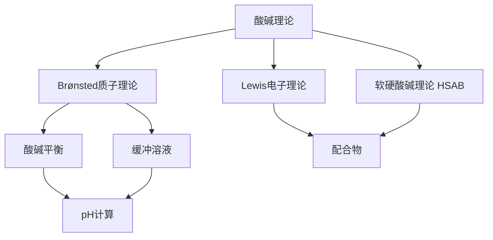

# 酸碱理论复习

> 📌 **定位**：化学原理模块核心复习课，串联三种酸碱理论及其应用。
> 
> 🎯 **总目标**：学生能区分 Brønsted、Lewis、HSAB 三种理论的适用范围，能进行酸碱平衡计算，能运用软硬酸碱规则预测配合物稳定性。

---

## 一、学习目标

1. 能写出 Brønsted 酸碱的定义，并判断共轭酸碱对
2. 能判断 Lewis 酸碱，列举典型 Lewis 酸/碱
3. 能运用"硬亲硬、软亲软"规则预测反应倾向
4. 能计算一元弱酸/弱碱、缓冲溶液、两性物质的 pH
5. 能比较三种酸碱理论的适用范围和局限性

---

## 二、知识网络图

---

## 三、核心结论速览

| 对比维度 | Brønsted 理论 | Lewis 理论 | HSAB 理论 |
|:---|:---|:---|:---|
| **核心定义** | 质子给体/受体 | 电子对受体/给体 | 硬/软酸 + 硬/软碱 |
| **酸碱反应** | 质子转移 | 配位键形成 | 硬亲硬、软亲软 |
| **典型酸** | HCl, HAc, NH₄⁺ | BF₃, AlCl₃, Fe³⁺ | 硬酸：H⁺, Al³⁺；软酸：Ag⁺, Hg²⁺ |
| **典型碱** | OH⁻, Ac⁻, NH₃ | NH₃, H₂O, 烯烃 | 硬碱：F⁻, OH⁻；软碱：I⁻, CN⁻ |
| **适用范围** | 含质子转移的反应 | 所有配位/加成反应 | 配合物稳定性、矿物溶解性 |
| **局限性** | 不含质子的酸碱 | 无定量标度 | 经验规则，有例外 |

---

## 四、重点内容串讲

### 4.1 Brønsted 酸碱与共轭对

- **核心关系**：$K_a \cdot K_b = K_w$（25°C）
- **pKa 越小 → 酸性越强 → 共轭碱越弱**
- **两性物质**：$[\ce{H+}] = \sqrt{K_{a1} \cdot K_{a2}}$

### 4.2 Lewis 酸碱

- **判断标准**：有空轨道 → Lewis 酸；有孤对/π电子 → Lewis 碱
- **竞赛热点**：BF₃ 催化、金属离子配位、烯烃与金属配位

### 4.3 HSAB 规则应用

- **硬酸 + 硬碱**：静电作用 → 离子性强（如 AlF₆³⁻）
- **软酸 + 软碱**：共价作用 → 轨道重叠多（如 Ag(CN)₂⁻）
- **应用**：配合物稳定性判断、矿物形成规律、萃取剂选择

### 4.4 酸碱平衡计算要点

| 体系 | 核心公式/方法 |
|:---|:---|
| 一元弱酸 | $[\ce{H+}] = \sqrt{K_a c}$（当 $c/K_a \geq 500$）|
| 缓冲溶液 | $\mathrm{pH} = \mathrm{p}K_a + \lg\frac{[\ce{A-}]}{[\ce{HA}]}$ |
| 两性物质 | $[\ce{H+}] = \sqrt{K_{a1} \cdot K_{a2}}$ |
| 多元酸 | 第一级主导，验证 $K_{a1} \gg K_{a2}$ |

---

## 五、课堂练习（分层递进）

### ⭐ 巩固题

**题 1**：判断以下反应中的 Lewis 酸碱
$$\ce{BF3 + NH3 -> F3B-NH3}$$
- Lewis 酸：______，Lewis 碱：______

**题 2**：已知 HAc 的 $K_a = 1.8 \times 10^{-5}$，计算 0.10 mol/L HAc 溶液的 pH。

### ⭐⭐ 提高题

**题 3**：解释为什么 Ag⁺ 与 CN⁻ 形成的配合物比与 NH₃ 形成的更稳定。

**题 4**：计算 0.10 mol/L NaHCO₃ 溶液的 pH（已知 H₂CO₃ 的 $K_{a1} = 4.2 \times 10^{-7}$，$K_{a2} = 5.6 \times 10^{-11}$）。

### ⭐⭐⭐ 拔高题

**题 5**：某溶液含有 0.10 mol/L HAc 和 0.10 mol/L NaAc，加入少量强酸后 pH 变化很小。请从 Brønsted 理论和平衡移动原理解释缓冲作用原理。

---

## 六、易错点集中突破

1. **混淆三种理论**：Brønsted 酸一定是 Lewis 酸，但 Lewis 酸不一定是 Brønsted 酸（如 BF₃）
2. **pKa 与酸性强弱**：pKa 越小酸性越强，不要记反
3. **Ka·Kb = Kw 的温度依赖性**：只在 25°C 时等于 10⁻¹⁴
4. **缓冲溶液近似条件**：$[\ce{HA}] \approx [\ce{A-}]$ 时才可用 Henderson-Hasselbalch 方程
5. **软硬酸碱不是绝对分类**：Fe²⁺、Cu²⁺ 等属于边界酸

---

## 七、自我检测清单

- [ ] 能写出 Brønsted 酸/碱、共轭酸碱对的定义
- [ ] 能判断给定物质是 Lewis 酸还是 Lewis 碱
- [ ] 能记忆常见硬酸/软酸/硬碱/软碱的分类
- [ ] 能用 HSAB 规则解释配合物稳定性差异
- [ ] 能独立完成一元弱酸/缓冲溶液/两性物质的 pH 计算
- [ ] 能比较三种酸碱理论的适用范围

---

## 八、下节预告

**专题 5：化学平衡**
- 平衡常数与反应商
- 溶度积与稳定常数
- Le Chatelier 原理
- 多重平衡规则

---

## 九、复盘记录

| 日期 | 授课反馈 | 学生难点 | 改进措施 |
|:---|:---|:---|:---|
| | | | |

---

*本课件由 kb-lesson-planner 自动生成，基于以下 KP：[[Brønsted酸碱理论]]、[[Lewis酸碱理论]]、[[软硬酸碱理论]]、[[酸碱平衡]]*
