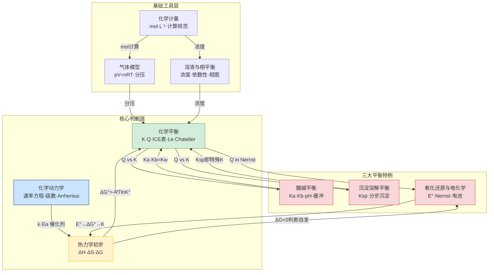

# 第一轮化学原理 · 章后复习课

> **定位**：第一轮化学原理大章节的收束课。不重讲新内容，只做三件事——**建网络、清陷阱、接后续**。
>
> **前置要求**：第一轮化学原理 9 节新课全部完成。
>
> **本课核心口号**：第一轮化学原理不是 9 个孤立模块，而是一条统一的判断链——**热力学说"能不能"，平衡说"到哪里停"，动力学说"多快到"；酸碱、沉淀、电化学是这条链的三个特殊应用场景。**

---

## 一、学习目标

完成本节复习后，学生应能：

1. 画出第一轮化学原理 9 个模块的关系总图，说出每两个模块之间的接口
2. 用"热力学 → 平衡 → 动力学"统一框架判断任意化学过程的方向、限度和速率
3. 将酸碱平衡、沉淀平衡、电化学统一识别为 Q/K 判断的三种特例
4. 在跨模块综合题中正确选择模型，避免工具拿错
5. 识别并避开本章最高频的 8 个跨模块陷阱

---

## 二、全章知识网络总图

> 这张图不是"把 9 个标题连起来"，而是展示**每对模块之间真正的接口在哪里**。



**读图要点**：
- **黄色（热力学）** 是"能不能"的语言——ΔG 判自发，ΔG°=-RTlnK° 连接平衡
- **绿色（平衡）** 是"到哪里停"的语言——K 是核心，Q/K 是方向判断的统一工具
- **蓝色（动力学）** 是"多快到"的语言——k 和 Ea 独立于热力学和平衡
- **红色（三大平衡特例）** 是 K 的三种特殊写法：Ka、Ksp、Q(Nernst)

---

## 三、统一框架：从 ΔG 到 Q/K 到方向判断

> 这是本章最重要的一个框架。如果学生只记住一样东西，应该记住这个。

### 3.1 三层判断链

| 层次 | 问什么 | 用什么工具 | 典型问题 |
|:---:|:---|:---|:---|
| **第一层：能不能** | 反应在给定条件下能否自发？ | ΔG = ΔH - TΔS | "298K 下这个反应能不能自发？" |
| **第二层：到哪里停** | 反应进行到什么程度达到平衡？ | K = exp(-ΔG°/RT)；Q vs K 判断方向 | "转化率是多少？""升温后平衡怎么移？" |
| **第三层：多快到** | 反应达到平衡需要多长时间？ | 速率方程、k、Ea | "升温后速率怎么变？""催化剂改了什么？" |

> **核心提醒**：热力学和动力学是**独立的两套语言**。ΔG<0 只说"能自发"，不说"多快"。催化剂改变 Ea 和 k，不改变 ΔG° 和 K。

### 3.2 Q/K 判断——统一工具

Q/K 判断不仅用于"化学平衡"，它是**所有平衡类型的统一入口**：

| 平衡类型 | K 的写法 | Q 的写法 | Q vs K 判断 |
|:---|:---|:---|:---|
| 一般化学平衡 | $K_c$ 或 $K_p$ | $Q_c$ 或 $Q_p$ | Q<K 正向；Q>K 逆向；Q=K 平衡 |
| 酸碱平衡 | $K_a$（酸）/ $K_b$（碱） | $Q = \frac{[\ce{H+}][\ce{A-}]}{[\ce{HA}]}$ | Q<Ka → HA 未充分电离；Q=Ka → 平衡 |
| 沉淀平衡 | $K_{sp}$ | $Q = [\ce{Ag+}][\ce{Cl-}]$ | Q>Ksp → 沉淀；Q<Ksp → 溶解 |
| 电化学 | Nernst 中的 $Q$ | 反应商 $Q$ | $E = E° - \frac{RT}{nF}\ln Q$ |

> **一句话**：无论题目在考酸碱、沉淀还是电化学，底层逻辑都是同一个——**Q 和 K 比大小**。

### 3.3 ΔG° 与 K 的定量桥梁

$$\Delta G° = -RT\ln K°$$

| ΔG° 符号 | K° 大小 | 含义 |
|:---:|:---:|:---|
| ΔG° < 0 | K° > 1 | 标准态下产物占优 |
| ΔG° = 0 | K° = 1 | 标准态下恰好平衡 |
| ΔG° > 0 | K° < 1 | 标准态下反应物占优 |

> **注意**：ΔG° 是标准态判据，ΔG 才是任意条件判据。$\Delta G = \Delta G° + RT\ln Q$——当 Q=K 时 ΔG=0，这就是平衡条件。

---

## 四、三大平衡特例的统一视角

> 酸碱、沉淀、电化学不是三章独立内容，而是 Q/K 框架的三种特例。

### 4.1 统一速查表

| 对比维度 | 酸碱平衡 | 沉淀溶解平衡 | 氧化还原与电化学 |
|:---|:---|:---|:---|
| **核心常数** | $K_a$、$K_b$、$K_w$ | $K_{sp}$ | $E°$、$K$（通过 $\Delta G°$ 联系） |
| **方向判断** | $Q$ vs $K_a$ | $Q$ vs $K_{sp}$ | $E$ vs 0（$E>0$ 自发） |
| **非标准态** | Henderson-Hasselbalch：pH = pKa + lg([A⁻]/[HA]) | 同离子效应：$s ≈ K_{sp}/c_0$ | Nernst：$E = E° - \frac{0.0592}{n}\lg Q$ |
| **定量工具** | ICE 表 + 电荷守恒 + 质子守恒 | ICE 表 + 溶解度表达式 | 半反应配平 + Nernst 方程 |
| **与热力学连接** | $\Delta G° = -RT\ln K_a$ | $\Delta G° = -RT\ln K_{sp}$ | $\Delta G° = -nFE°$ |
| **分步/分级** | 多元酸分步电离：$K_{a1} \gg K_{a2}$ | 分步沉淀：Ksp 小者先沉 | 多电子转移：分步还原 |
| **典型应用** | 缓冲溶液、pH 计算 | 分步沉淀、沉淀转化 | 原电池、电解、腐蚀 |

### 4.2 质子守恒 / 电荷守恒 / 物料守恒——通用工具

这三种守恒不仅用于酸碱，也用于沉淀和电化学：

| 守恒类型 | 酸碱平衡中的写法 | 沉淀平衡中的应用 |
|:---|:---|:---|
| **物料守恒** | $c = [\ce{HA}] + [\ce{A-}]$ | $c = [\ce{Ag+}]_{\text{总}}$（含配合物） |
| **电荷守恒** | $\sum c_+z_+ = \sum c_-z_-$ | 同上，用于含多种离子的混合体系 |
| **质子守恒** | 得质子物种 = 失质子物种 | 水解体系中同样适用 |

---

## 五、热力学 vs 动力学：最常混淆的两套语言

> 这是第一轮化学原理中**学生最容易把两套语言混在一起**的地方。

### 5.1 核心区分

| 对比维度 | 热力学 | 动力学 |
|:---|:---|:---|
| **回答什么** | 能不能发生？自发方向？ | 多快发生？速率多大？ |
| **核心量** | ΔG、ΔH、ΔS、K | k、Ea、级数、半衰期 |
| **温度效应** | 改变 K（van't Hoff） | 改变 k（Arrhenius） |
| **催化剂效应** | **不改变** ΔG° 和 K | **降低 Ea，增大 k** |
| **平衡位置** | 由 K 决定（热力学） | 不影响平衡位置 |
| **路径依赖** | 状态函数，与路径无关 | 途径函数，与路径有关 |

### 5.2 最高频混淆场景

| 混淆 | 正确理解 |
|:---|:---|
| "催化剂加快反应，所以产率提高" | ❌ 催化剂只改速率不改平衡。产率由 K 决定，催化剂无影响 |
| "ΔG<0 的反应一定很快" | ❌ ΔG<0 只说明自发，不说明速率。金刚石→石墨 ΔG<0 但极慢 |
| "升温一定让反应更快更完全" | ❌ 升温一定加快速率（k↑），但对放热反应会降低 K（平衡左移） |
| "E° 越正的反应越快" | ❌ E° 是热力学量，只回答"能不能"。速率要看 Ea 和 k |

> **课堂口诀**：热力学管"能不能"，动力学管"快不快"。催化剂是动力学工具，不碰热力学。

---

## 六、全章核心公式速查卡

> 按"从通用到特殊"排列。先掌握第 1-4 行的通用工具，再用到第 5-9 行的特殊场景。

| # | 公式 | 适用模块 | 使用条件 / 易错点 |
|:---:|:---|:---|:---|
| 1 | $\Delta G = \Delta H - T\Delta S$ | 热力学 | T 用 K（绝对温度），不是 °C |
| 2 | $\Delta G° = -RT\ln K°$ | 热力学 ↔ 平衡 | R = 8.314 J/(mol·K)，注意单位换算 |
| 3 | $Q$ vs $K$ 判断方向 | 平衡 / 酸碱 / 沉淀 / 电化学 | 所有平衡的统一工具 |
| 4 | ICE 表 | 平衡 / 酸碱 / 沉淀 | I=Initial, C=Change, E=Equilibrium |
| 5 | $pH = pK_a + \lg\frac{[\ce{A-}]}{[\ce{HA}]}$ | 酸碱（缓冲） | 只适用于缓冲溶液（弱酸+共轭碱） |
| 6 | $[\ce{H+}] = \sqrt{K_a \cdot c}$ | 酸碱（弱酸） | 条件：$c/K_a \geq 400$，否则解二次方程 |
| 7 | $s = \sqrt{K_{sp}}$（AB 型） | 沉淀 | 仅适用于 1:1 型！AB₂ 型用 $s = \sqrt[3]{K_{sp}/4}$ |
| 8 | $E = E° - \frac{0.0592}{n}\lg Q$ | 电化学（Nernst） | 0.0592 是 25°C 近似值；n 是电子转移数 |
| 9 | $\ln\frac{k_2}{k_1} = \frac{E_a}{R}\left(\frac{1}{T_1} - \frac{1}{T_2}\right)$ | 动力学（Arrhenius） | 只关联 k 和 T，与 ΔH/K 无关 |
| 10 | $pV = nRT$ | 气体 | R = 8.314 J/(mol·K) = 0.0821 L·atm/(mol·K)，单位要匹配 |

---

## 七、高频跨模块陷阱 Top 8

> 以下 8 个陷阱不是从单个模块里挑的，而是**跨模块连线时最容易掉进去的坑**。每个陷阱标注了"为什么会错"和"怎么防"。

### 陷阱 1：恒容充惰气——平衡移不移动？

**发生率**：~50%（教学洞察-化学平衡数据）

**学生典型错误**：用 Le Chatelier 口诀——"压强变大→向减分子方向移动"

**正确分析**：恒容充惰气，总压变大但各气体**分压不变**，Q 不变，Q=K，**平衡不移动**

**防御口诀**：「恒容充惰气，分压都不变，Q 就还是 K，平衡不会动」

**关联**：化学平衡 ↔ 气体模型（分压概念）

---

### 陷阱 2：异类型沉淀不能直接比 Ksp

**发生率**：~40%

**学生典型错误**：AgCl ($K_{sp}=1.8\times10^{-10}$) vs Ag₂CrO₄ ($K_{sp}=1.1\times10^{-12}$)——"Ag₂CrO₄ 的 Ksp 更小，所以先沉淀"

**正确分析**：不同类型沉淀的 s-Ksp 关系不同。必须算出各自开始沉淀所需的最低沉淀剂浓度，或算出各自溶解度 s，才能比较

**防御口诀**：「同类型比 Ksp，异类型比 s 或比所需沉淀剂浓度」

**关联**：沉淀溶解平衡 ↔ 化学平衡（Ksp 是特殊 K）

---

### 陷阱 3：级数来自实验，不来自反应式系数

**发生率**：~45%

**学生典型错误**：2NO + O₂ → 2NO₂，直接写 rate = k[NO]²[O₂]

**正确分析**：只有**基元反应**才能直接从计量系数写速率方程。非基元反应的级数必须由实验确定

**防御口诀**：「基元反应看系数，非基元反应看实验。不判机理不写速率式」

**关联**：化学动力学 ↔ 化学计量（计量系数 ≠ 级数）

---

### 陷阱 4：升温——K 变了还是 k 变了？

**发生率**：~35%

**学生典型错误**：看到"升温"就开始混用 Le Chatelier 和 Arrhenius

**正确分析**：升温**同时**影响 K（通过 van't Hoff）和 k（通过 Arrhenius），但影响方向可能矛盾——对放热反应，升温让 K 减小（平衡左移）但 k 增大（反应更快）

**防御口诀**：「升温一定快（k↑），不一定好（放热反应 K↓）。分开看！」

**关联**：热力学 ↔ 动力学 ↔ 化学平衡

---

### 陷阱 5：ΔG° < 0 不等于 ΔG < 0

**发生率**：~30%

**学生典型错误**：查表得到 ΔG° < 0，就断言"反应一定自发"

**正确分析**：ΔG° 是标准态判据。实际条件下的 ΔG = ΔG° + RT ln Q。当 Q 很大（产物浓度很高）时，即使 ΔG°<0，ΔG 也可能 >0

**防御口诀**：「ΔG° 是标准态，ΔG 才是任意态。先看 ΔG，别直接用 ΔG°」

**关联**：热力学 ↔ 化学平衡

---

### 陷阱 6：缓冲溶液公式乱用

**发生率**：~40%

**学生典型错误**：对纯 HAc 溶液用 pH = pKa + lg([A⁻]/[HA])——算出来 pH=pKa

**正确分析**：Henderson-Hasselbalch 方程**只适用于缓冲溶液**（弱酸 + 其共轭碱的混合物）。纯弱酸溶液用 [H⁺] = √(Ka·c)

**防御口诀**：「先判是不是缓冲——有弱酸又有共轭碱？不是就别用 pKa 公式」

**关联**：酸碱理论 ↔ 化学平衡

---

### 陷阱 7：E° 只管"能不能"，不管"快不快"

**发生率**：~25%

**学生典型错误**：查表看到 E°(Fe³⁺/Fe²⁺) = +0.77V，就说"Fe³⁺ 氧化 I⁻ 很快"

**正确分析**：E° > 0 只说明反应自发（热力学允许），不说明速率。某些反应虽然 ΔG° 很负但 Ea 很高，实际极慢

**防御口诀**：「E° 大只说能发生，不说多快。快不快看 Ea」

**关联**：电化学 ↔ 热力学 ↔ 动力学

---

### 陷阱 8：混合后体积变了——Q 算错

**发生率**：~35%

**学生典型错误**：等体积混合 0.10 M AgNO₃ 和 0.10 M NaCl，直接用 0.10 算 Q

**正确分析**：等体积混合后浓度**减半**为 0.050 M。Q = [Ag⁺][Cl⁻] = 0.050 × 0.050 = 2.5×10⁻³ ≫ Ksp → 生成沉淀

**防御口诀**：「混合先算体积，浓度要重算。用混合后的浓度算 Q」

**关联**：沉淀溶解平衡 ↔ 化学计量（体积与浓度）

---

## 八、综合判断练习（课堂用）

> 以下 3 道练习题故意跨模块设计，训练"先认题型，再选工具"的能力。

### 练习 1：热力学 + 平衡 + 电化学

> 已知：25°C 时，$\ce{Cu^2+ + 2e- -> Cu}$，$E° = +0.34\;\text{V}$

**(a)** 计算 $\ce{Cu^2+ + Cu <=> 2Cu+}$ 的 $K°$（提示：先找到相关半反应）

**(b)** 若初始 $[\ce{Cu^2+}] = 0.10\;\text{mol/L}$、$[\ce{Cu+}] = 0$，用 ICE 表估算平衡时 $[\ce{Cu+}]$

**(c)** 如果在上述平衡体系中加入 Na₂S 使 $[\ce{S^2-}] = 0.01\;\text{mol/L}$（已知 $K_{sp}(\ce{Cu2S}) = 2.5\times10^{-48}$），会不会生成 Cu₂S 沉淀？

**考查要点**：E° → ΔG° → K 的桥梁链；ICE 表计算；Q vs Ksp 判断

---

### 练习 2：动力学 + 平衡 + 热力学

> 某气相反应 $\ce{A <=> B + C}$ 在 300K 时 $K_p = 0.50$，在 400K 时 $K_p = 5.0$

**(a)** 判断该反应是吸热还是放热，并计算 ΔH°（近似）

**(b)** 在 300K 下，将 1.00 mol A 放入 10.0 L 容器中，求平衡时各物质的分压

**(c)** 已知正反应在 300K 时 $k_f = 2.0\times10^{-3}\;\text{s}^{-1}$（一级反应），求逆反应的 $k_r$

**考查要点**：van't Hoff 判断 ΔH° 符号和定量计算；ICE 表 + Kp + 分压；正逆反应速率常数与 K 的关系 $K = k_f/k_r$

---

### 练习 3：酸碱 + 沉淀 + 化学平衡（多模块联动）

> 向 1.0 L 0.10 mol/L NH₃·H₂O 溶液中缓慢加入 MgCl₂ 固体（忽略体积变化）

已知：$K_b(\ce{NH3}) = 1.8\times10^{-5}$，$K_{sp}(\ce{Mg(OH)2}) = 5.6\times10^{-12}$

**(a)** 计算未加 MgCl₂ 时溶液的 pH

**(b)** 计算开始生成 Mg(OH)₂ 沉淀时所需的 $[\ce{Mg^2+}]$

**(c)** 若加入 MgCl₂ 使 $[\ce{Mg^2+}] = 0.10\;\text{mol/L}$，是否有沉淀？计算此时的 $[\ce{OH-}]$ 和 pH（假设 NH₃ 的电离不受 Mg²⁺ 影响）

**考查要点**：弱碱 pH 计算；Ksp 与 [OH⁻] 的耦合；Q vs Ksp 判断沉淀

---

## 九、本章与后续章节的接口

> 这部分不讲新内容，只告诉学生"你现在学的东西，后面会怎么用到"。

| 后续章节 | 从本章继承什么 | 会升级什么 |
|:---|:---|:---|
| **第二轮元素化学** | 酸碱、沉淀、电化学、方程式书写 | 从"通用原理"升级到"具体元素体系"——颜色、沉淀、价态变化变成推断工具 |
| **第二轮分析化学** | 平衡计算、酸碱滴定、误差概念 | 从"单个平衡"升级到"测量流程"——滴定曲线、终点误差、分光光度法 |
| **第三轮结构化学深化** | 热力学（ΔG、K）和动力学（k、Ea） | 从"会算"升级到"会解释"——晶体场、配位光谱、动力学模型 |
| **第三轮有机化学** | 酸碱理论（Lewis 酸碱）、动力学（反应机理） | 从"水溶液中的酸碱"升级到"有机反应中的亲核/亲电" |

> **一句话**：第一轮化学原理是全库的"计算语言基础"。后面每一轮新课都会回到这里找工具。

---

## 十、教师使用建议

### 课时安排

| 方案 | 时长 | 内容 |
|:---|:---|:---|
| **方案 A：完整 2 课时** | 90 min | §二~§七（60min）+ §八综合练习讲评（30min） |
| **方案 B：拆成 2×45min** | 45+45 | 第 1 节：§二~§四（统一框架 + 三大平衡）；第 2 节：§五~§八（热力学 vs 动力学 + 陷阱 + 练习） |

### 板书建议

**核心板书**（建议保留整节课）：

```
热力学：能不能？  ←→  ΔG = ΔH - TΔS  ←→  ΔG° = -RTlnK°
平衡：到哪里停？  ←→  K  ←→  Q vs K
动力学：多快到？  ←→  k  ←→  Ea（Arrhenius）

三大平衡特例：Ka / Ksp / Q(Nernst) — 底层都是 Q vs K
```

### 与专题页配合

- 本复习课侧重"跨模块网络"，各模块的深度细节在对应专题页
- 建议课后让学生按需回看 9 张专题页的"课堂投影速查卡"§零点六
- 高频错题可直接引用各专题页的"典型例题"和"高频判断清单"

---

*本文件是六大新课大章节体系的第一份章后复习课，后续 5 份章后复习课应参照本文件的品质标准产出。*

*品质标准：跨模块网络图（Mermaid）+ 统一框架速查表 + 高频跨模块陷阱（≥5 个）+ 综合练习（≥3 道）+ 后续接口预告。*
