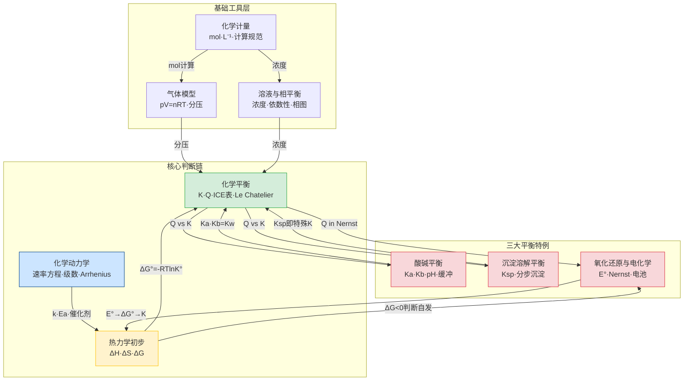

# 第一轮化学原理 · 章后复习课

> **定位**：第一轮化学原理大章节的收束课。不重讲新内容，只做三件事——**建网络、清陷阱、接后续**。
>
> **前置要求**：第一轮化学原理 9 节新课全部完成。
>
> **本课核心口号**：第一轮化学原理不是 9 个孤立模块，而是一条统一的判断链——**热力学说"能不能"，平衡说"到哪里停"，动力学说"多快到"；酸碱、沉淀、电化学是这条链的三个特殊应用场景。**

---

## 一、学习目标

完成本节复习后，学生应能：

1. 画出第一轮化学原理 9 个模块的关系总图，说出每两个模块之间的接口
2. 用"热力学 → 平衡 → 动力学"统一框架判断任意化学过程的方向、限度和速率
3. 将酸碱平衡、沉淀平衡、电化学统一识别为 Q/K 判断的三种特例
4. 在跨模块综合题中正确选择模型，避免工具拿错
5. 识别并避开本章最高频的 8 个跨模块陷阱
6. 说出本章在初赛中的分值权重与近五年命题走向，并按考试权重安排自己的复习顺序

---

## 一点五、本章考试地图

> 复习课的第一件事，是让学生知道"这章在考试里占什么位置"。本节把考纲条目、近五年命题走向和题型权重摊开——后面那张知识网络才有优先级，而不是平均用力。

### 1.5.1 考纲条目对照

本章对应《中国化学奥林匹克基本要求》**基础要求·化学原理**中的 8 个条目：

| 考纲条目 | 本章对应模块 | 覆盖 |
|:---|:---|:---:|
| 01-有效数字 | 化学计量与计算规范 | 已覆盖 |
| 02-气体 | 气体与气体模型 | 已覆盖 |
| 03-分散相与连续相 | 溶液、浓度与相平衡 | 已覆盖 |
| 06-热力学初步 | 热力学初步 | 已覆盖 |
| 化学动力学 | 化学动力学初步 | 已覆盖 |
| 07-化学平衡 | 化学平衡 | 已覆盖 |
| 05-酸碱理论 | 酸碱理论 | 已覆盖 |
| 08-氧化还原与电化学 | 氧化还原与电化学 | 已覆盖 |
| （沉淀溶解平衡暂无独立条目页） | 沉淀溶解平衡 | 挂靠 07 |

> **条目页入口**：[[02-考纲条目/基础要求/化学原理/01-有效数字|01-有效数字]] · [[02-考纲条目/基础要求/化学原理/02-气体|02-气体]] · [[02-考纲条目/基础要求/化学原理/03-分散相与连续相|03-分散相与连续相]] · [[02-考纲条目/基础要求/化学原理/06-热力学初步|06-热力学初步]] · [[02-考纲条目/基础要求/化学原理/化学动力学|化学动力学]] · [[02-考纲条目/基础要求/化学原理/07-化学平衡|07-化学平衡]] · [[02-考纲条目/基础要求/化学原理/05-酸碱理论|05-酸碱理论]] · [[02-考纲条目/基础要求/化学原理/08-氧化还原与电化学|08-氧化还原与电化学]]

> **边界提醒**：`04-元素周期律和元素周期表`、`09-原子结构`、`10-分子结构与化学键`、`11-分子间作用力`、`12-配合物`这一组同属"基础要求·化学原理"，但课程编在大章节 2（第一轮结构化学初步），不在本章复习范围。

### 1.5.2 历年真题命题分布（25-40 届纵深）

> 数据来源：[[备课思路/近五年真题命题拆解分析]] §六 与题库 25~40 届真题实体卡。
> **口径**：按「整题归属为化学原理（热力学／动力学／电化学／表面／量子）的大题」统计。25-38 届数据取自提炼页分值与考纲拆题清单，39-40 届取自原卷自带的「分值 + 占比」标注。散落在其他综合推断题内的小问未全部计入，故早期数据为**下限**。

| 届次 | 年份 | 本章考点呈现方式与核心模型 | 分值 / 卷面 | 占比 | 回链题卡 |
|:---:|:---:|:---|:---:|:---:|:---|
| 25 届 | 2011 | 经典气体状态方程与转化率（$NO_2$ 分解与 Le Chatelier 原理） | 8 / 100 | 8% | [[04-题库/真题/第25届初赛/化学原理/题-025-6-NO2浓度变化计算\|题-025-6]] |
| 26 届 | 2012 | 酸碱平衡体系与电势关联（碳酸多级电离分布分数与 $E\text{-}\mathrm{pH}$ 图） | 10 / 100 | 10% | [[04-题库/真题/第26届初赛/化学原理/题-026-8-碳酸分布系数计算\|题-026-8]] |
| 28 届 | 2014 | 生物大分子络合热力学（肌红蛋白氧结合平衡常数与化学势关联） | 10 / 100 | 10% | [[04-题库/真题/第28届初赛/化学原理/题-028-6-肌红蛋白氧结合平衡常数\|题-028-6]] |
| 29 届 | 2015 | 早期二次电池电化学（铝离子电池非水体系电极半反应） | 9 / 100 | 9% | [[04-题库/真题/第29届初赛/化学原理/题-029-6-铝离子电池电极反应\|题-029-6]] |
| 31 届 | 2017 | 经典热力学反应热估算（水煤气反应焓变与平均键能循环） | 8 / 100 | 8% | [[04-题库/真题/第31届初赛/化学原理/题-031-2-水煤气反应热\|题-031-2]] |
| 32 届 | 2018 | 电解原理与机理结合（双膜电解阳极 Kolbe 反应电极过程） | 9 / 100 | 9% | [[04-题库/真题/第32届初赛/化学原理/题-032-4-1-双膜电解阳极半反应\|题-032-4-1]] |
| 33 届 | 2019 | 气相多重化学平衡（气体分压定律与高温分解转化率） | 10 / 100 | 10% | [[04-题库/真题/第33届初赛/化学原理/题-033-3-气体分压计算\|题-033-3]] |
| 35 届 | 2021 | 传统热力学分题考察（盖斯定律、氧物种生成焓） | 6 / 100 | 6% | [[04-题库/真题/第35届初赛/化学原理/题-035-2-臭氧化钾热力学计算\|题-035-2]] |
| 36 届 | 2022 | 非水溶剂中的电极电势与热力学（首现「非水体系电化学」） | 14 / 100 | 14% | [[04-题库/真题/第36届初赛/题-036-6-非水溶剂电池电动势计算\|题-036-6]] |
| 37 届 | 2023 | 锂提取中的离子交换与溶剂萃取相平衡 | 10 / 110 | 9% | [[04-题库/真题/第37届初赛/题-037-3-1-LiMn2O4合成方程式\|题-037-3-1]] |
| 38 届 | 2024 | 换场景：$CO_2$ 空气直接捕集（吸附平衡与热力学驱动） | 10 / 110 | 9% | [[04-题库/真题/第38届初赛/题-038-7-1-一级胺捕集CO2方程式\|题-038-7-1]] |
| 39 届 | 2025 | 换载体：普鲁士蓝电极反应（电化学＋比容量）、高压储氢（热力学＋材料） | 56 / 242 | 23% | [[04-题库/真题/第39届初赛/化学原理/题-039-2-普鲁士蓝电极反应与比容量\|题-039-2]] · [[04-题库/真题/第39届初赛/化学原理/题-039-6-高压储氢与液相储氢\|题-039-6]] |
| 40 届 | 2026 | **再换载体并升级工具**：生物相容性（Stokes-Einstein ＋竞争动力学）、钙钛矿纳米晶（**表面热力学 ＋ 量子限域**）、电化学 $N_2$ 还原（**催化循环 ＋ PCET**） | 75 / 247 | **30%** | [[04-题库/真题/第40届初赛/化学原理/题-040-2-生物相容性化学反应\|题-040-2]] · [[04-题库/真题/第40届初赛/化学原理/题-040-6-钙钛矿纳米晶体的尺寸效应\|题-040-6]] · [[04-题库/真题/第40届初赛/化学原理/题-040-7-电化学N2还原\|题-040-7]] |

> **回链用法**：表格每行均直连真题库实体卡（题面＋标准答案＋评分细则）。复习时按 §1.5.5 的权重次序演练，完成题目后反查其在热力学、动力学或平衡链中的位置。

### 1.5.3 命题演进趋势四条

1. **卷面权重实现三级跳**。化学原理模块占卷面比例从 25~35 届的 6%~10%、39 届的 23%，大幅跃升至 40 届的 **30%**——占据初赛近三分之一分值。这确立了化学原理在初赛复习中的基石定位。
2. **载体高频换新，前沿情境深化**。命题彻底摆脱 $\Delta G = \Delta H - T\Delta S$ 简单的数值代入，全面转向电化学新型储能（理论比容量与充放电平衡）、氢能储放（高温高压非理想气体）、碳捕集（吸附热力学循环）以及半导体/发光材料（量子点粒径与表面能）。以**已知原理剖析陌生体系**已成主导范式。
3. **多步逻辑联立，定量精度保持**。单步公式运算基本消失，全卷主导三到五步的长逻辑推理链：
   - 电化学能量链：$E^\circ \rightarrow \Delta G^\circ \rightarrow K \rightarrow$ 平衡浓度或电极比容量
   - 键能与循环链：$E^\circ$ 与 $\mathrm{p}K_\mathrm{a}$ 联合 $\rightarrow$ 键解离能 $\mathrm{BDE}$
   - 材料与晶体链：化学式 $\rightarrow$ 摩尔质量与晶格体积 $\rightarrow$ 储氢密度或晶粒尺寸
   - 表面热力学链（40 届新增）：比表面吉布斯自由能 $\rightarrow$ 润湿热 $\rightarrow$ 晶界平衡
   - 量子物理模型链（40 届新增）：无限深势箱能级 $\rightarrow$ 量子限域 $\rightarrow$ 光学跃迁吸收波长
4. **工具体系从「化学唯象公式」升级为「微观物理模型」**。40 届开创性引入 **Stokes-Einstein 扩散方程、德布罗意波长与一维势箱** 等基础物理模型。竞赛考查重心已从熟练套用化学公式，升维为**在未知情境下构建物理与化学量映射关系的建模能力**。

### 1.5.4 近两年模拟题命题热点与创新变式（13 家机构 3132 题源实测挖掘）

> 数据来源：外挂索引 `10-索引与统计/04-考点题源索引.json`。全库 13 家竞赛培训与教研机构（chemy、质心GChO、化英社、汇智、XeChem 等）共收录化学原理题卡 **3,132 张（涵盖 141 个细分考点）**。

#### 1. 模拟题高频考点 TOP 7 榜单

| 核心考点 | 模拟题题量 | 主要来源机构分布 | 命题考查焦点 |
|:---|:---:|:---|:---|
| [[配合物]] | 325 题 | chemy(103) · 质心(65) · 化英社(28) | 配位平衡常数、稳定常数与配合物生成热力学 |
| [[化学方程式]] | 249 题 | 质心(149) · chemy(62) · 一式(10) | 复杂氧化还原物料配平、离子共存与连续滴定计量 |
| [[化学动力学]] | 105 题 | 质心(16) · chemy(13) · 化英社(12) | 稳态近似、弛豫法、基元反应活化能与阿伦尼乌斯拟合 |
| [[化学平衡]] | 105 题 | 质心(49) · chemy(16) · XeChem(9) | 气相多重平衡、反应商 $Q$ 与平衡常数 $K$ 的定量计算 |
| [[氢键]] | 105 题 | chemy(53) · 伽马(12) · 汇智(7) | 氢键网络热力学稳定性、熔沸点反常与自组装驱动力 |
| [[化学热力学]] | 96 题 | 质心(40) · 汇智(15) · chemy(10) | 盖斯定律循环、Born-Haber 循环与复杂熵变估算 |
| [[标准电极电势]] | 88 题 | chemy(23) · 汇智(19) · 质心(12) | 电池电动势、能斯特方程与电势-pH 图联立求解 |

#### 2. 近两年模拟题的三大前沿创新变式

1. **新型二次电池与离子电化学联立**：
   从传统水系原电池拓展到锌碘二次电池、水系有机液流电池及固态锂电池。重点考查充放电电极反应方程式书写、电解液溶剂化效应以及理论能量密度的两步联立计算。
2. **复杂催化反应网络与动力学速控步**：
   不再局限于单一反应速率方程，而是给出多步催化循环（如加氢脱氢、自由基反应），要求运用微观可逆性原理、拟稳态近似推出表观反应级数，并解释温度对副反应选择性的调控。
3. **多重平衡与热化学循环估算**：
   将配位平衡、沉淀溶解平衡与氧化还原电势紧密交织，设计跨介质条件电势计算；或结合晶格能、电离能构造复杂热化学循环，定量推导未知物种的生成焓。

#### 3. 精选机构模拟题变式题卡直通

| 机构与题号 | 涉及核心考点 | 命题场景与能力要求 | 回链题卡 |
|:---|:---|:---|:---|
| chemy CM-02-01 | [[配合物]] · [[标准电极电势]] | 锌碘二次电池反应机理、充放电电极电势与能量密度 | [[04-题库/2026机构初赛模拟题/chemy/题-CM-02-01-锌碘ZnI电池是一种新兴的二\|题-CM-02-01]] |
| chemy CM-03-05 | [[标准电极电势]] · [[化学平衡]] | 水系有机液流电池氧化还原活性分子电对与 Nernst 方程 | [[04-题库/2026机构初赛模拟题/chemy/题-CM-03-05-水系有机液流电池在储存电能的\|题-CM-03-05]] |
| 质心 GChO-01-01 | [[化学热力学]] · [[化学平衡]] | 合成氨高温高压平衡移动与反应活化能、摩尔反应熵综合分析 | [[04-题库/2026机构初赛模拟题/质心GChO/题-GChO-01-01-作为最重要的肥料和化工原料的\|题-GChO-01-01]] |
| XeChem XeC-07-05 | [[化学动力学]] | 全氮五唑阴离子热分解动力学、反应级数确定与半衰期推算 | [[04-题库/2026机构初赛模拟题/XeChem/题-XeC-07-05-五唑阴离子是极具应用价值的全\|题-XeC-07-05]] |
| 汇智 HZ-01-01 | [[化学热力学]] · [[化学平衡]] | 复杂热力学体系 Gibbs 自由能函数与多相平衡移动热力学判据 | [[04-题库/2026机构初赛模拟题/汇智/题-HZ-01-01-化学热力学理论的发展提供了良\|题-HZ-01-01]] |

### 1.5.5 题型权重与复习优先级

| 题型 | 命题频率 | 典型载体 | 复习优先级 |
|:---|:---:|:---|:---:|
| $Q$ 与 $K$ 判断及平衡移动 | 每届 | 各类情境题 | ★★★ |
| 电化学与热力学联立 | 近三年显著上升 | 电池、储能材料 | ★★★ |
| 热化学循环（Born-Haber、BDE） | 每届 | 晶格能、键解离能 | ★★★ |
| 表面热力学估算（40 届新增） | 首现（40 届，题 6） | 纳米颗粒、浸润热法 | ★★★ |
| 动力学级数与机理推导 | 每届 | 稳态近似、速控步、竞争（平行）反应 | ★★ |
| 酸碱、缓冲与沉淀耦合 | 每届 | 生物体系、环境体系 | ★★ |
| 量子限域与势箱估算（40 届新增） | 首现（40 届，题 6） | 量子点、粒径—波长 | ★★ |
| 依数性与相行为 | 间隔出现 | 溶液、相图 | ★ |

> **按考试权重的复习顺序**（注意：不是按教材顺序）：
> 1. 电化学 — 热力学 — 平衡的联立链（分值最高，且趋势仍在上升）
> 2. 热化学循环：Born-Haber 与 BDE（每届必出、题型固定，属必得分）
> 3. 表面热力学估算（40 届首现即进 13% 权重的题 6，不能按「冷门」处理）
> 4. 平衡判断的跨场景迁移（原理简单，但最易在陌生情境下拿错工具）
> 5. 动力学机理推导（稳态近似、速控步、竞争反应）
> 6. 量子限域与势箱估算（40 届首现；公式少，难在「化学量 ↔ 物理模型」的对应）
> 7. 依数性与相图（相对低频，放最后）

> **本节用法**：先让学生自己给 §1.5.5 的各行排序，再对照上面的顺序。排错的学生，往往正是把"教材顺序"当成了"复习顺序"。

---

## 二、全章知识网络总图

> 这张图不是"把 9 个标题连起来"，而是展示**每对模块之间真正的接口在哪里**。

```mermaid
graph TD
    subgraph 基础工具层
        CM[化学计量<br/>mol·L⁻¹·计算规范]
        GAS[气体模型<br/>pV=nRT·分压]
        SOL[溶液与相平衡<br/>浓度·依数性·相图]
    end

    subgraph 核心判断链
        TD[热力学初步<br/>ΔH·ΔS·ΔG]
        EQ[化学平衡<br/>K·Q·ICE表·Le Chatelier]
        KIN[化学动力学<br/>速率方程·级数·Arrhenius]
    end

    subgraph 三大平衡特例
        AB[酸碱平衡<br/>Ka·Kb·pH·缓冲]
        PPT[沉淀溶解平衡<br/>Ksp·分步沉淀]
        REDOX[氧化还原与电化学<br/>E°·Nernst·电池]
    end

    CM -->|mol计算| GAS
    CM -->|浓度| SOL
    GAS -->|分压| EQ
    SOL -->|浓度| EQ

    TD -->|"ΔG°=-RTlnK°"| EQ
    TD -->|"ΔG<0判断自发"| REDOX
    EQ -->|"Q vs K"| AB
    EQ -->|"Q vs K"| PPT
    EQ -->|"Q in Nernst"| REDOX
    KIN -->|"k·Ea·催化剂"| TD

    AB -->|"Ka·Kb=Kw"| EQ
    PPT -->|"Ksp即特殊K"| EQ
    REDOX -->|"E°→ΔG°→K"| TD

    style TD fill:#fff3cd,stroke:#ffc107
    style EQ fill:#d4edda,stroke:#28a745
    style KIN fill:#cce5ff,stroke:#004085
    style AB fill:#f8d7da,stroke:#dc3545
    style PPT fill:#f8d7da,stroke:#dc3545
    style REDOX fill:#f8d7da,stroke:#dc3545
```

**读图要点**：
- **黄色（热力学）** 是"能不能"的语言——ΔG 判自发，ΔG°=-RTlnK° 连接平衡
- **绿色（平衡）** 是"到哪里停"的语言——K 是核心，Q/K 是方向判断的统一工具
- **蓝色（动力学）** 是"多快到"的语言——k 和 Ea 独立于热力学和平衡
- **红色（三大平衡特例）** 是 K 的三种特殊写法：Ka、Ksp、Q(Nernst)

---

## 三、统一框架：自由能驱动势、反应商与化学平衡的本质

在化学竞赛的物理化学模块中，热力学与多重平衡往往占据卷面计算与机理分析的核心。化学反应的自发倾向与终态平衡并非孤立的经验规律，而是统一由系统吉布斯自由能的极小化原理严格决定的。理解这一统一框架，是解决电化学、沉淀、酸碱及复相平衡联立计算的根本基石。

### 3.1 热力学驱动势与自发性判据链

封闭体系在等温等压（$T, p$ 恒定）且非体积功为零的条件下，热力学基本方程可表述为 $\mathrm{d}G = \sum_{i} \mu_i \mathrm{d}n_i$。引入反应进度 $\xi$（单位为 $\mathrm{mol}$），定义摩尔反应吉布斯自由能为：

$$\Delta_{\mathrm{r}}G = \left(\frac{\partial G}{\partial \xi}\right)_{T, p} = \sum_{i} \nu_i \mu_i$$

式中 $\mu_i$ 为组分 $i$ 在反应混合物中的化学势，$\nu_i$ 为化学计量数（产物取正，反应物取负）。化学亲和势 $\mathcal{A} \equiv -\Delta_{\mathrm{r}}G$ 直接度量了反应继续推进的热力学推动力。当 $\Delta_{\mathrm{r}}G < 0$ 时，吉布斯自由能随反应进行而降低，正向反应自发；当 $\Delta_{\mathrm{r}}G > 0$ 时，逆向反应自发；当 $\Delta_{\mathrm{r}}G = 0$ 时，系统处于自由能极小值点，宏观上达到热力学平衡状态。

必须在概念上严格区分标准摩尔反应吉布斯自由能 $\Delta_{\mathrm{r}}G^\circ$ 与摩尔反应吉布斯自由能 $\Delta_{\mathrm{r}}G$：
1. **$\Delta_{\mathrm{r}}G^\circ$ 是状态常数**：代表各组分均处于各自标准态（气相 $p^\circ = 100\,\mathrm{kPa}$，溶液 $c^\circ = 1.0\,\mathrm{mol\cdot L^{-1}}$）时的假想反应吉布斯自由能变，其数值仅依赖于温度 $T$，用于决定平衡常数 $K^\circ$ 的大小；
2. **$\Delta_{\mathrm{r}}G$ 是瞬态推动力**：取决于当前反应混合物的真实组成与各组分即时活度，直接决定反应在当前非平衡态下的自发进行方向。

二者通过热力学反应商 $Q$ 建立起严密的定量关联：

$$\Delta_{\mathrm{r}}G = \Delta_{\mathrm{r}}G^\circ + R T \ln Q = R T \ln\left(\frac{Q}{K^\circ}\right)$$

式中标准平衡常数 $K^\circ = \exp\left(-\frac{\Delta_{\mathrm{r}}G^\circ}{R T}\right)$。因此，比较反应商 $Q$ 与标准平衡常数 $K^\circ$ 的相对大小，本质上是对瞬态化学势差 $\Delta_{\mathrm{r}}G$ 正负号的严格热力学检验。

### 3.2 广义反应商 $Q$ 在各类平衡中的统一表述

反应商 $Q = \prod_{i} a_i^{\nu_i}$ 是贯通化学原理全模块的通用解析工具。在不同物相体系中，活度 $a_i$ 依据标准态约定体现为不同的物理量：

| 平衡类型 | 活度约定与表达形式 | 反应商 $Q$ 的展开式 | 热力学判据与方向判定 |
|:---|:---|:---|:---|
| **气相均相平衡** | 理想气体分压 $a_i = p_i / p^\circ$ | $Q_p = \prod (p_i / p^\circ)^{\nu_i}$ | $Q_p < K_p^\circ$ 正向自发；$Q_p = K_p^\circ$ 达平衡；$Q_p > K_p^\circ$ 逆向自发 |
| **弱酸弱碱解离** | 稀溶液浓度 $a_i \approx c_i / c^\circ$ | $Q_{\mathrm{a}} = \frac{[\ce{H+}][\ce{A-}]}{[\ce{HA}] \cdot c^\circ}$ | $Q_{\mathrm{a}} < K_{\mathrm{a}}^\circ$ 酸继续电离；$Q_{\mathrm{a}} > K_{\mathrm{a}}^\circ$ 共轭碱结合质子逆向进行 |
| **沉淀溶解平衡** | 纯固相活度 $a(\mathrm{s}) = 1$ | $Q_{\mathrm{sp}} = [\ce{M^{z+}}]^m [\ce{X^{y-}}]^n$ | $Q_{\mathrm{sp}} > K_{\mathrm{sp}}^\circ$ 产生沉淀；$Q_{\mathrm{sp}} < K_{\mathrm{sp}}^\circ$ 难溶物未饱和继续溶解 |
| **电化学电池反应** | 可逆电池电功 $W' = -z F E$ | $Q_{\mathrm{cell}} = \prod a_i^{\nu_i}$ | $E = E^\circ - \frac{R T}{z F}\ln Q$；$E > 0$ 电池自发放电（$\Delta_{\mathrm{r}}G < 0$） |

由此可见，无论是分析化学中的酸碱缓冲与沉淀转化，还是物理化学中的原电池电动势计算，解题分析的核心步骤均可归纳为：**明确反应式计量比 $\to$ 确定各组分有效活度（或平衡浓度/分压） $\to$ 构建反应商 $Q$ 并与 $K^\circ$ 作商比值**。

---

## 四、溶液多重平衡与三大特例的系统解析方法

在竞赛试题中，往往极少出现单一孤立的平衡体系，常常伴随着酸碱电离、沉淀生成、络合反应以及氧化还原的多重耦合（例如在弱酸性介质中进行硫化物沉淀，或在配体存在下测定金属离子的条件电极电势）。解决此类复杂多重平衡体系，必须跳出经验公式的死记硬背，建立基于三大守恒定律与副反应系数的系统解法。

### 4.1 溶液平衡的三大守恒底座

任何均匀液相电解质体系在热力学平衡时，必须同时满足以下三组约束方程：

1. **物料守恒（Mass Balance Equation, MBE）**：各组分各级解离、水解或络合形态的分析浓度总和，必须严格等于该组分初始加入的分析浓度；
2. **电荷守恒（Charge Balance Equation, CBE）**：溶液作为宏观电中性相，所有阳离子所带正电荷摩尔浓度之和严格等于所有阴离子所带负电荷摩尔浓度之和，即 $\sum z_i c(\mathrm{M}_i^{z+}) = \sum |z_j| c(\mathrm{X}_j^{z-})$；
3. **质子条件式（Proton Condition Equation, PBE）**：依据酸碱质子理论，溶液在达到酸碱平衡时，酸接受质子后生成的共轭碱所释放的质子数，必严格等于碱获得质子后生成的共轭酸所吸收的质子数。

#### 质子条件式的规范构建：零水准物质法（Reference State Method）
构建质子条件式时，无需联立繁琐的 MBE 与 CBE。规范操作准则为：
- **选取零水准物质（Reference Species）**：选择溶液中大量存在的、参与质子传递的初始物质形态（通常为水分子 $\ce{H2O}$ 及加入溶质的原始形态，如 $\ce{HA}$ 或弱酸盐阴离子 $\ce{A-}$）；
- **列出质子得失物态**：以零水准为基准，凡失去质子而生成的物种列于等式一边，凡得到质子而生成的物种列于等式另一边，并乘以转移质子数系数；
- **示例分析（$\ce{NH4Ac}$ 水溶液）**：
  - 零水准物种：$\ce{H2O}$、$\ce{NH4+}$、$\ce{Ac-}$；
  - 得质子产物：$\ce{H3O+}$（由 $\ce{H2O}$ 得 1 个质子）、$\ce{HAc}$（由 $\ce{Ac-}$ 得 1 个质子）；
  - 失质子产物：$\ce{OH-}$（由 $\ce{H2O}$ 失 1 个质子）、$\ce{NH3}$（由 $\ce{NH4+}$ 失 1 个质子）；
  - 精确质子条件式：$[\ce{H+}] + [\ce{HAc}] = [\ce{OH-}] + [\ce{NH3}]$。

### 4.2 多重竞争平衡与副反应系数（$\alpha$）解析框架

当体系中存在配位、酸效应或氧化还原竞争时，自由离子浓度被大幅压缩。分析化学与物理化学引入**副反应系数（Side-Reaction Coefficient, $\alpha$）**来定量刻画这种竞争强弱：

$$\alpha_{\mathrm{M}} = \frac{[\mathrm{M}']}{[\mathrm{M}]} = 1 + \sum_{i=1}^{n} \beta_i [\mathrm{L}]^i$$

式中 $[\mathrm{M}']$ 为金属离子未参与主反应的所有存在形态的分析总浓度，$[\mathrm{M}]$ 为游离金属离子浓度，$\beta_i$ 为逐级络合累积稳定常数。当副反应显著时，$\alpha_{\mathrm{M}} \gg 1$。
- **条件溶度积常数**：在酸性或络合介质中，难溶盐 $\ce{MA}$ 的有效溶解度显著增大，其条件常数表示为 $K_{\mathrm{sp}}' = K_{\mathrm{sp}} \cdot \alpha_{\mathrm{M}} \cdot \alpha_{\mathrm{A}}$，表观溶解度计算式修正为 $s = \sqrt{K_{\mathrm{sp}}'}$；
- **条件电极电势**：氧化态或还原态发生络合与质子化时，代入 Nernst 方程可导出条件电极电势 $E^{\circ\prime} = E^\circ - \frac{R T}{z F}\ln\left(\frac{\alpha_{\mathrm{Ox}}}{\alpha_{\mathrm{Red}}}\right)$。

这一副反应系数思维构成了处理所有多重竞争平衡的通用数学框架。

---

## 五、热力学驱动与动力学历程的边界与协同

化学原理学习中最常见的认知误区，是将体系的热力学倾向（自发性与平衡限度）与动力学速率（反应快慢与历程机理）混为一谈。在全国初赛与决赛命题中，命题常侧重于设计“热力学高度有利但动力学惰性”或“动力学产物与热力学产物竞争”的情境。

### 5.1 物理图像的本质解耦

| 考查维度 | 化学热力学（Thermodynamics） | 化学动力学（Kinetics） |
|:---|:---|:---|
| **核心物理问题** | 过程是否可能自发？最终平衡转化极限为何？ | 过程沿何种微观路径进行？达到平衡需要多长时间？ |
| **特征物理量** | $\Delta_{\mathrm{r}}H^\circ$、$\Delta_{\mathrm{r}}S^\circ$、$\Delta_{\mathrm{r}}G^\circ$、$K^\circ$（均为状态函数） | 反应级数 $n$、速率常数 $k$、活化能 $E_{\mathrm{a}}$、指前因子 $A$（过程量） |
| **温度效应机理** | 通过 van 't Hoff 方程调控平衡常数：$\frac{\mathrm{d}\ln K^\circ}{\mathrm{d}T} = \frac{\Delta_{\mathrm{r}}H^\circ}{R T^2}$ | 通过 Arrhenius 方程改变有效碰撞分数：$k = A \exp\left(-\frac{E_{\mathrm{a}}}{R T}\right)$ |
| **催化剂作用本质** | **不改变**反应前后物种化学势，$\Delta_{\mathrm{r}}G^\circ$ 与 $K^\circ$ 严格守恒 | 改变微观反应通道，降低活化自由能垒 $\Delta G^\ddagger$，成百上千倍增大速率常数 $k$ |
| **时间尺度依赖** | 对应 $t \to \infty$ 的无限长时间热力学极限终态 | 描述有限时间 $t$ 内各反应物与产物的瞬态浓度演化曲线 |

### 5.2 动力学控制与热力学控制的势能面判据

当反应物 $\ce{R}$ 在同一反应体系中可沿两条平行路径转化为产物 $\ce{P1}$ 与 $\ce{P2}$ 时：
- **动力学控制（Kinetic Control）**：路径 1 的过渡态活化能能垒显著较低（$E_{\mathrm{a},1} < E_{\mathrm{a},2}$），在较低温度或较短反应时间下，分子主要越过低能垒通道，产物组成受反应速率比值 $k_1 / k_2$ 支配，优先生成 $\ce{P1}$；
- **热力学控制（Thermodynamic Control）**：产物 $\ce{P2}$ 具有更负的吉布斯自由能（$\Delta_{\mathrm{r}}G^\circ_2 < \Delta_{\mathrm{r}}G^\circ_1$），处于更稳定的全局能量陷阱。在较高温度和足够反应时间下，两路径均建立可逆平衡，产物组成最终由热力学平衡常数比值 $K_2 / K_1$ 支配，高产率富集 $\ce{P2}$。

解题分析时，不可单凭“放热更多”武断判定反应更快；必须通过势能曲线图严格比对**反应能垒高度 $\Delta G^\ddagger$（决定动力学速率）**与**终态自由能差 $\Delta_{\mathrm{r}}G^\circ$（决定热力学稳定性）**。

---

## 六、全章核心定量公式与适用边界规范速查

在竞赛实战计算中，公式的机械套用往往是失分根源。下表梳理了化学原理模块最核心的 10 项定量计算工具及其严格的**适用边界条件与防错要点**：

| 序号 | 核心公式 | 适用物理场景 | 严格适用条件与关键防错准则 |
|:---:|:---|:---|:---|
| 1 | $\Delta_{\mathrm{r}}G^\circ = \Delta_{\mathrm{r}}H^\circ - T\Delta_{\mathrm{r}}S^\circ$ | 恒温恒压化学反应驱动力评估 | 严格使用绝对温度 $T\,(\mathrm{K})$；温度跨度较大时须注意 $\Delta C_p$ 对 $\Delta H$ 与 $\Delta S$ 的积分修正 |
| 2 | $\Delta_{\mathrm{r}}G^\circ = -R T \ln K^\circ$ | 标态吉布斯自由能与平衡常数换算 | 气体常数 $R = 8.314\,\mathrm{J\cdot mol^{-1}\cdot K^{-1}}$，$\Delta_{\mathrm{r}}G^\circ$ 单位必须统一换算为 $\mathrm{J\cdot mol^{-1}}$ |
| 3 | $\ln\left(\frac{K_2^\circ}{K_1^\circ}\right) = \frac{\Delta_{\mathrm{r}}H^\circ}{R}\left(\frac{1}{T_1} - \frac{1}{T_2}\right)$ | 温度对标准平衡常数的影响（van 't Hoff） | 近似假设小温区内反应焓变 $\Delta_{\mathrm{r}}H^\circ$ 为常数；放热反应（$\Delta_{\mathrm{r}}H^\circ < 0$）升温平衡常数单调递减 |
| 4 | $\ln\left(\frac{k_2}{k_1}\right) = -\frac{E_{\mathrm{a}}}{R}\left(\frac{1}{T_2} - \frac{1}{T_1}\right)$ | 基元/表观反应活化能 Arrhenius 双点式 | $E_{\mathrm{a}}$ 单位通常为 $\mathrm{kJ\cdot mol^{-1}}$，代入运算时指数项必须乘以 $10^3$ 转换为 $\mathrm{J\cdot mol^{-1}}$ |
| 5 | $E = E^\circ - \frac{R T}{z F}\ln Q$ | 可逆电池电动势与电极电势（Nernst 方程） | $298.15\,\mathrm{K}$ 时 $\frac{R T}{F}\ln 10 \approx 0.05916\,\mathrm{V}$；$z$ 为配平半反应/电池反应中严格对应的得失电子数 |
| 6 | $\mathrm{pH} = \mathrm{p}K_{\mathrm{a}} + \lg\left(\frac{c_{\mathrm{A^-}}}{c_{\mathrm{HA}}}\right)$ | 弱酸-共轭碱缓冲溶液（Henderson-Hasselbalch） | 仅适用于缓冲体系且酸碱解离度极小（通常要求分析浓度 $c \ge 0.01\,\mathrm{mol\cdot L^{-1}}$ 且 $0.1 \le \frac{c_{\mathrm{A^-}}}{c_{\mathrm{HA}}} \le 10$） |
| 7 | $[\ce{H+}] \approx \sqrt{K_{\mathrm{a}} \cdot c}$ | 一元弱酸溶液氢离子浓度快速估算 | 严格适用判据：$c / K_{\mathrm{a}} \ge 400$ 且 $c \cdot K_{\mathrm{a}} \ge 20 K_{\mathrm{w}}$；若不满足必须严格求解一元二次方程 |
| 8 | $s = \left(\frac{K_{\mathrm{sp}}}{m^m n^n}\right)^{\frac{1}{m+n}}$ | $\ce{M}_m \ce{X}_n$ 型微溶电解质纯水溶解度反演 | 严格假设阴阳离子在水中不发生显著的水解、配位副反应，且离子强度极低（活度系数 $\gamma \approx 1$） |
| 9 | $t_{1/2} = \frac{\ln 2}{k}$ | 一级反应特征半衰期 | 半衰期与反应物初始浓度完全无关是一级反应的充分必要判据；零级与二级半衰期均依赖初始浓度 |
| 10 | $p_i = x_i p_{\mathrm{total}} = \frac{n_i R T}{V}$ | 理想混合气体分压定律（Dalton 定律） | 仅在系统遵从理想气体行为时成立；混合气中各组分分压只取决于该组分的温度、体积与物质的量 |

---
## 七、竞赛高频跨模块深度易错点与关键防错判据

在化学竞赛初赛与省选大题中，命题人常常利用物理化学基本概念的适用边界和宏观/微观的认知死角设置陷阱。以下剖析 8 个跨模块最高频的思维陷阱，重点解构其微观物理化学机理，并给出竞赛审题的核心防错判据。

### 7.1 恒温恒容与恒温恒压下惰性气体对气相平衡移动的解耦分析

- **解题误区剖析**：学生常不假思索地调用 Le Châtelier 原理经验口诀，认为“充入气体导致体系总压增大，平衡必然向气体分子数减小的方向移动”，从而在恒容充惰气题型中失分。
- **微观物理化学机制**：理想混合气体中，组分 $i$ 的分压严格服从 Dalton 分压定律 $p_i = \frac{n_i R T}{V}$。在恒温恒容（$T, V$ 恒定）条件下，向体系中充入不参与反应的惰性气体，虽然体系总压 $p_{\mathrm{total}} = \sum p_i + p_{\mathrm{inert}}$ 升高，但各反应组分的物质的量 $n_i$ 及体系体积 $V$ 均未改变，各反应物与产物的分压 $p_i$ 严格保持恒定。因此，热力学分压反应商 $Q_p = \prod (p_i / p^\circ)^{\nu_i}$ 不发生任何改变，依然满足 $Q_p = K_p^\circ$，化学平衡既不发生移动，各组分的平衡转化率也保持不变。
- **恒压条件下的对比例证**：若体系置于恒温恒压（$T, p$ 恒定，如带活塞的恒压容器）中，充入惰性气体将导致体系总分子数 $n_{\mathrm{total}}$ 增加，容器体积 $V$ 必然被迫等比例膨胀。此时各反应物与产物的摩尔分数 $x_i = n_i / n_{\mathrm{total}}$ 和分压 $p_i = x_i p_{\mathrm{total}}$ 均被等比例稀释。引入摩尔分数平衡常数 $K_x = K_p^\circ (p_{\mathrm{total}} / p^\circ)^{-\Delta \nu_{\mathrm{g}}}$，当气体分子数增加（$\Delta \nu_{\mathrm{g}} > 0$）时，体积膨胀使反应商 $Q_x < K_x$，平衡正向移动；当 $\Delta \nu_{\mathrm{g}} < 0$ 时，平衡逆向移动；当 $\Delta \nu_{\mathrm{g}} = 0$ 时，充惰气对平衡无影响。
- **竞赛审题判据**：审题先锁死**容器约束条件**——恒容体系看分压（分压不变则 $Q_p$ 不变，平衡不动）；恒压体系看摩尔体积稀释（等效于减压减浓，向气体分子数增多方向移动）。

### 7.2 异构型难溶电解质溶度积（$K_{\mathrm{sp}}$）与溶解度（$s$）的量纲陷阱

- **解题误区剖析**：直接通过查表所得 $K_{\mathrm{sp}}$ 数值的大小，武断判断不同沉淀的溶解度高低或分步沉淀先后顺序。例如误认为 $\ce{Ag2CrO4}$ 的 $K_{\mathrm{sp}} = 1.1 \times 10^{-12}$ 显著小于 $\ce{AgCl}$ 的 $K_{\mathrm{sp}} = 1.8 \times 10^{-10}$，因此 $\ce{Ag2CrO4}$ 更难溶、向含等浓度 $\ce{Cl-}$ 和 $\ce{CrO4^2-}$ 的溶液滴加 $\ce{Ag+}$ 时必先析出 $\ce{Ag2CrO4}$。
- **微观物理化学机制**：溶度积常数 $K_{\mathrm{sp}}$ 是活度乘积，其量纲直接依赖于解离产生的阴阳离子总数。对于 $\ce{AB}$ 型电解质（如 $\ce{AgCl}$），$K_{\mathrm{sp}} = s^2$，溶解度 $s(\ce{AgCl}) = \sqrt{1.8 \times 10^{-10}} \approx 1.34 \times 10^{-5}\,\mathrm{mol\cdot L^{-1}}$；而对于 $\ce{A2B}$ 型电解质（如 $\ce{Ag2CrO4}$），解离方程为 $\ce{Ag2CrO4(s) <=> 2Ag+ + CrO4^2-}$，其溶度积表达为 $K_{\mathrm{sp}} = (2s)^2(s) = 4s^3$，溶解度 $s(\ce{Ag2CrO4}) = \left(\frac{1.1 \times 10^{-12}}{4}\right)^{1/3} \approx 6.50 \times 10^{-5}\,\mathrm{mol\cdot L^{-1}}$。计算表明，$\ce{Ag2CrO4}$ 在水中的摩尔溶解度反而是 $\ce{AgCl}$ 的近 5 倍。
- **竞赛审题判据**：只有**相同晶体构型**（即阴阳离子化学计量比相同，如 $\ce{AgCl}$ 与 $\ce{AgBr}$）的电解质方可直接比对 $K_{\mathrm{sp}}$ 数值；**异构型电解质**必须严格转化为摩尔溶解度 $s$，或计算析出沉淀所需的沉淀剂离子临界浓度 $[\ce{L}]_{\mathrm{crit}}$ 进行比较。

### 7.3 化学反应计量方程式与表观动力学级数的非等价性

- **解题误区剖析**：误将宏观配平的化学计量方程式当作基元反应，直接根据计量系数书写质量作用定律速率方程（例如看到 $2\ce{NO} + \ce{O2} \to 2\ce{NO2}$，便判定为三级反应 $r = k[\ce{NO}]^2[\ce{O2}]$）。
- **微观物理化学机制**：绝大多数化学反应为多步基元反应交织的复杂网络。化学方程式仅反映反应物转化为产物的起始与终态质量守恒关系，绝不代表分子碰撞的真实微观历程。质量作用定律仅严格适用于单步完成的基元反应（Elementary Reaction）。对非基元反应，宏观反应级数是由反应历程中各基元步骤的相对速率决定的表观参数，完全可能表现为分数级、零级或负级数。
- **机理推导范式**：在推导非基元反应速率方程时，竞赛标准方法是运用**拟稳态近似（SSA）**（设活泼中间体浓度极低且净生成速率近似为零，$\frac{\mathrm{d}[\mathrm{Int}]}{\mathrm{d}t} \approx 0$）或**快速平衡假设**（设前置基元步处于快速可逆平衡）。
- **竞赛审题判据**：题干未明确注明“该反应为基元反应”或给出微观反应历程时，严禁依据总计量方程式臆断速率方程，反应级数必须由初始速率实验数据唯一确证。

### 7.4 温度对热力学平衡极限与动力学反应速率的双重效应解耦

- **解题误区剖析**：将“升温加快反应进行”混淆为“升温必提高产物产率”，无法理顺合成氨、二氧化碳加氢等工业放热催化反应中温度选择的物理本质。
- **微观物理化学机制**：
  - **动力学效应**：依据 Arrhenius 定律 $\frac{\mathrm{d}\ln k}{\mathrm{d}T} = \frac{E_{\mathrm{a}}}{R T^2}$，由于基元反应的活化能 $E_{\mathrm{a}} > 0$，温度升高必然使有效碰撞的分子能量分布向高能区平移，活化分子百分数急剧增加。因此，不论反应是放热还是吸热，正逆反应的速率常数 $k$ 均随温度升高而增大；
  - **热力学效应**：依据 van 't Hoff 方程 $\frac{\mathrm{d}\ln K^\circ}{\mathrm{d}T} = \frac{\Delta_{\mathrm{r}}H^\circ}{R T^2}$，平衡常数 $K^\circ$ 随温度的变化方向由反应焓变 $\Delta_{\mathrm{r}}H^\circ$ 的符号唯一确定。对放热反应（$\Delta_{\mathrm{r}}H^\circ < 0$），升温使平衡常数单调递减，平衡向逆方向移动，热力学极限转化率必然下降。
- **竞赛审题判据**：升温使反应动力学“更快”（速率常数 $k \uparrow$），但对放热反应热力学平衡“更差”（平衡常数 $K^\circ \downarrow$）。竞赛工业条件优化大题中，最佳操作温度总是在催化剂活性温度窗口与平衡产率极限之间选取的动态折中点。

### 7.5 标准态自由能变 $\Delta_{\mathrm{r}}G^\circ$ 与非标态实际驱动势 $\Delta_{\mathrm{r}}G$ 的混淆陷阱

- **解题误区剖析**：查热力学数据表算得某反应 $\Delta_{\mathrm{r}}G^\circ > 0$，便草率断言“该反应在实际条件下绝不可能自发进行”。
- **微观物理化学机制**：标准摩尔反应吉布斯自由能 $\Delta_{\mathrm{r}}G^\circ$ 仅表征各物种活度严格等于 1 时系统的热力学倾向，其本质是标准平衡常数 $K^\circ$ 的另一种数学表达形式（$\Delta_{\mathrm{r}}G^\circ = -R T \ln K^\circ$）。而在非标准态的实际多相反应混合物中，过程的真实驱动势由反应等温方程给定：

$$\Delta_{\mathrm{r}}G = \Delta_{\mathrm{r}}G^\circ + R T \ln Q$$

即使反应处于室温下且 $\Delta_{\mathrm{r}}G^\circ \gg 0$（即 $K^\circ \ll 1$），只要生成物在生成后被极速抽除、挥发或通过沉淀/络合固定，使反应商 $Q \ll 1$，则对数项 $R T \ln Q$ 将呈现极大的负值，完全足以使体系的实际驱动势 $\Delta_{\mathrm{r}}G < 0$，反应仍能强劲自发推进。
- **竞赛审题判据**：标准态吉布斯自由能变 $\Delta_{\mathrm{r}}G^\circ$ 仅用于计算平衡常数 $K^\circ$；判断真实反应能否自发进行，必须依据当前活度商 $Q$ 求解即时自由能变 $\Delta_{\mathrm{r}}G$。

### 7.6 Henderson-Hasselbalch 缓冲公式的适用边界与极限失效分析

- **解题误区剖析**：脱离酸浓度与解离度前提，对极稀弱酸、强酸弱碱或共轭组分比例悬殊的溶液生搬硬套 $\mathrm{pH} = \mathrm{p}K_{\mathrm{a}} + \lg\left(\frac{c_{\mathrm{A^-}}}{c_{\mathrm{HA}}}\right)$。
- **微观物理化学机制**：HH 方程的核心推导基于两条严格近似：(1) 弱酸的自身解离量远小于弱酸分析浓度（$[\ce{HA}] \approx c_{\mathrm{HA}}$）；(2) 共轭碱的水解量远小于共轭碱分析浓度（$[\ce{A-}] \approx c_{\mathrm{A^-}}$）。在以下三种竞赛常考极端情境下该近似彻底崩溃：
  1. **高稀释度体系**：当溶液分析浓度降至 $10^{-3}\,\mathrm{mol\cdot L^{-1}}$ 以下时，弱酸解离产生的 $[\ce{H+}]$ 对分析浓度 $c_{\mathrm{HA}}$ 的相对比例显著增大；
  2. **酸性较强的弱酸**：当弱酸的 $\mathrm{p}K_{\mathrm{a}} < 2.5$（如磷酸一级电离、亚硫酸）时，游离酸自身电离度已达 $10\%\sim 30\%$，$[\ce{HA}] \ne c_{\mathrm{HA}}$；
  3. **配比悬殊极限**：当缓冲比 $\frac{c_{\mathrm{A^-}}}{c_{\mathrm{HA}}}$ 超出 $0.1 \sim 10$ 范围时，体系失去缓冲容量，水解或解离产生的质子量成为主要修正项。
- **竞赛审题判据**：当弱酸电离度大于 $5\%$ 或溶液处于高稀释度状态时，必须放弃经验近似，联立物料守恒与电荷守恒，严格列出一元二次方程求解精确 $[\ce{H+}]$。

### 7.7 电化学标准电极电势 $E^\circ$ 的热力学假象与电极过程超电势

- **解题误区剖析**：查电极电势表只要两电对电势差 $\Delta E^\circ > 0$，便断言该氧化还原反应在电解或原电池中必然迅速发生；或认为在酸性溶液中电解活泼金属盐时必定完全被析氢副反应破坏。
- **微观物理化学机制**：电极电势差 $\Delta E^\circ > 0$ 仅证明反应在热力学上存在释放电功的驱动力（$\Delta_{\mathrm{r}}G^\circ = -z F E^\circ < 0$）。在真实电解池或电池电极界面上，离子穿过双电层脱去溶剂化鞘、转移电子并生成新相（如气泡形核或金属沉积）需要克服高能垒，产生**活化超电势（Activation Overpotential, $\eta$）**。例如在汞、铅、锌等高析氢超电势金属电极上，氢离子析出的超电势可高达 $0.8 \sim 1.0\,\mathrm{V}$。这使得热力学上自发发生的析氢副反应在动力学上被严重阻滞，从而为金属锌、锰在水溶液中的高效电沉积提供了关键的动力学保护窗口。
- **竞赛审题判据**：分析电解电极产物与分解电压时，必须将热力学平衡电极电势与电极材料的动力学超电势（尤其是析氢、析氧超电势）矢量叠加：$\varphi_{\mathrm{实际}} = \varphi_{\mathrm{平衡}} + \eta$。

### 7.8 溶液多组分混合稀释过程中的离子浓度重算与活度效应

- **解题误区剖析**：在酸碱滴定、沉淀沉淀或沉淀转化计算中，直接将混合前的初始分析浓度代入平衡常数式，完全遗漏体积加和带来的即时稀释效应。
- **微观物理化学机制**：当不同体积的溶液（如 $V_1$ 升电解质 A 与 $V_2$ 升电解质 B）混合时，在假定混合体积具有加和性（$V_{\mathrm{total}} = V_1 + V_2$）的前提下，各反应溶质在反应发生前的真实初始浓度被等比例稀释为 $c_i = c_{i,0} \cdot \frac{V_i}{V_{\mathrm{total}}}$。若忽略此步骤，反应商 $Q$ 的计算值与真实值将产生数倍甚至数量级的偏差。此外，当混合液中引入大量惰性强电解质时，离子强度 $I = \frac{1}{2}\sum c_i z_i^2$ 显著上升，导致离子平均活度系数 $\gamma_{\pm} < 1$，引起微溶物实际溶解度较理想值发生上升（盐效应）。
- **竞赛审题判据**：审题见到“等体积混合”或“加入某体积滴定剂”，解题第一步永远是**重算混合瞬间各物种的瞬时分析浓度**。高精度计算中需检验离子强度对活度的影响。

---

## 八、竞赛综合实战典型演练与深度精解

本节精选 3 道跨模块综合实战大题，严格对齐全国初赛压轴计算题的命题梯度。每道题均配备**思维破局切入点**、**规范分步推导**与**易错点防错归纳**，供学生自学演练与考前自测。

### 【实战题 1】热力学、电化学电势联立与沉淀转化驱动

**【题目情境】**
在 $298.15\,\mathrm{K}$ 的水溶液中，金属铜与铜离子的氧化还原平衡如下：
$$\ce{Cu^2+ + e- <=> Cu+}, \quad E^\circ_1 = +0.153\,\mathrm{V}$$
$$\ce{Cu+ + e- <=> Cu}, \quad E^\circ_2 = +0.521\,\mathrm{V}$$
已知硫化亚铜的溶度积常数 $K_{\mathrm{sp}}(\ce{Cu2S}) = 2.5 \times 10^{-48}$。

**(1)** 写出金属铜与二价铜离子发生歧化反应的离子方程式，计算该反应在 $298.15\,\mathrm{K}$ 下的标准电动势 $E^\circ$、标准平衡常数 $K^\circ$ 及 $\Delta_{\mathrm{r}}G^\circ$。
**(2)** 在纯水中，若初始体系中加入 $\ce{CuSO4}$ 使分析浓度为 $0.10\,\mathrm{mol\cdot L^{-1}}$ 并与过量金属铜共存，计算平衡时游离 $\ce{Cu+}$ 的物质的量浓度。
**(3)** 若向上述平衡体系中通入微量硫化氢气体并调节溶液使其满足 $[\ce{S^2-}] = 0.010\,\mathrm{mol\cdot L^{-1}}$，请通过严格的反应商 $Q_{\mathrm{sp}}$ 计算判定是否会生成 $\ce{Cu2S}$ 沉淀；若生成沉淀，说明沉淀的生成对铜的歧化反应平衡产生何种驱动效应。

**【思维破局与详尽解析】**
1. **歧化电势计算**：歧化反应为 $2\ce{Cu+ <=> Cu^2+ + Cu(s)}$。正极对应电对 $\ce{Cu+/Cu}$（$E^\circ_2 = +0.521\,\mathrm{V}$），负极对应电对 $\ce{Cu^2+/Cu+}$（$E^\circ_1 = +0.153\,\mathrm{V}$）。电池标准电动势为：
   $$E^\circ = E^\circ_+ - E^\circ_- = 0.521\,\mathrm{V} - 0.153\,\mathrm{V} = +0.368\,\mathrm{V}$$
   转移电子数 $z = 1$。根据热力学关系式：
   $$\Delta_{\mathrm{r}}G^\circ = -z F E^\circ = -1 \times 96485\,\mathrm{C\cdot mol^{-1}} \times 0.368\,\mathrm{V} = -35.51\,\mathrm{kJ\cdot mol^{-1}}$$
   标准平衡常数为：
   $$K^\circ = \exp\left(-\frac{\Delta_{\mathrm{r}}G^\circ}{R T}\right) = \exp\left(\frac{35506}{8.314 \times 298.15}\right) \approx 1.66 \times 10^6$$
   *结论*：歧化反应平衡常数高达 $1.66 \times 10^6$，表明在标态无络合剂的水溶液中，一价铜离子 $\ce{Cu+}$ 在热力学上极不稳定，倾向于自发歧化为金属铜与 $\ce{Cu^2+}$。
2. **逆向平衡浓度求解**：对于反向反应 $\ce{Cu^2+ + Cu(s) <=> 2Cu+}$，其平衡常数 $K' = 1 / K^\circ = 6.02 \times 10^{-7}$。
   设平衡时生成的 $[\ce{Cu+}] = 2x$，则消耗的 $[\ce{Cu^2+}] = x$。
   $$K' = \frac{[\ce{Cu+}]^2}{[\ce{Cu^2+}]} = \frac{(2x)^2}{0.10 - x} \approx \frac{4x^2}{0.10} = 6.02 \times 10^{-7}$$
   解得 $x \approx 1.23 \times 10^{-4}\,\mathrm{mol\cdot L^{-1}}$，故平衡时 $[\ce{Cu+}] = 2x = 2.45 \times 10^{-4}\,\mathrm{mol\cdot L^{-1}}$。
3. **沉淀反应商判定与耦合效应**：
   $$Q_{\mathrm{sp}} = [\ce{Cu+}]^2 [\ce{S^2-}] = (2.45 \times 10^{-4})^2 \times 0.010 = 6.0 \times 10^{-10}$$
   因为 $Q_{\mathrm{sp}} \gg K_{\mathrm{sp}}(\ce{Cu2S}) = 2.5 \times 10^{-48}$，体系必剧烈析出黑色 $\ce{Cu2S}$ 沉淀。沉淀析出使游离 $[\ce{Cu+}]$ 被强力钳制在极低水平（$< 10^{-23}\,\mathrm{mol\cdot L^{-1}}$），促使 $\ce{Cu^2+ + Cu <=> 2Cu+}$ 的反应商 $Q' \ll K'$，平衡大幅度右移。结果表现为：极难溶物 $\ce{Cu2S}$ 的生成彻底逆转了铜离子的歧化趋势，使金属铜与二价铜在硫离子存在下自发共转化为亚铜沉淀。

---

### 【实战题 2】气相热分解动力学、活化能与 van 't Hoff 方程联立

**【题目情境】**
某吸热气相解离反应 $\ce{A(g) <=> B(g) + C(g)}$ 在不同温度下的热力学与动力学研究如下：
在 $300.0\,\mathrm{K}$ 时测得标准平衡常数 $K_p^\circ = 0.500$；当温度升至 $400.0\,\mathrm{K}$ 时，测得 $K_p^\circ = 5.00$。假定在 $300.0 \sim 400.0\,\mathrm{K}$ 温区内反应的标准摩尔焓变 $\Delta_{\mathrm{r}}H^\circ$ 可近似视为常数。

**(1)** 运用 van 't Hoff 等压方程定量计算该反应在该温区内的平均标准摩尔反应焓 $\Delta_{\mathrm{r}}H^\circ$。
**(2)** 在 $300.0\,\mathrm{K}$ 下，向 $10.0\,\mathrm{L}$ 恒容密闭真空容器中充入 $1.00\,\mathrm{mol}$ 纯气体 $\ce{A}$，达到化学平衡后，计算体系的总压 $p_{\mathrm{total}}$ 及组分 $\ce{A}$ 的平衡解离度 $\alpha$。
**(3)** 已知该反应在 $300.0\,\mathrm{K}$ 时的基元正反应速率常数 $k_{\mathrm{f}} = 2.00 \times 10^{-3}\,\mathrm{s^{-1}}$，且正反应活化能为 $E_{\mathrm{a,f}} = 65.0\,\mathrm{kJ\cdot mol^{-1}}$。依据微观可逆性原理，求 $300.0\,\mathrm{K}$ 下逆反应速率常数 $k_{\mathrm{r}}$ 及逆反应的活化能 $E_{\mathrm{a,r}}$。

**【思维破局与详尽解析】**
1. **van 't Hoff 焓变计算**：
   $$\ln\left(\frac{K_{p,2}^\circ}{K_{p,1}^\circ}\right) = \frac{\Delta_{\mathrm{r}}H^\circ}{R}\left(\frac{1}{T_1} - \frac{1}{T_2}\right)$$
   代入数据：$\ln\left(\frac{5.00}{0.500}\right) = \ln 10 \approx 2.3026$
   $$\Delta_{\mathrm{r}}H^\circ = \frac{2.3026 \times 8.314}{\frac{1}{300.0} - \frac{1}{400.0}} = \frac{19.144}{8.333 \times 10^{-4}} \approx +22.97\,\mathrm{kJ\cdot mol^{-1}}$$
   *结论*：$\Delta_{\mathrm{r}}H^\circ > 0$，反应吸热，定量符合升温平衡常数增大的热力学预期。
2. **气相平衡分压与解离度**：
   在 $300.0\,\mathrm{K}$ 下，$1.00\,\mathrm{mol}$ 气体若未解离，其初始基准压力为：
   $$p_0 = \frac{n_0 R T}{V} = \frac{1.00 \times 8.314 \times 300.0}{10.0 \times 10^{-3}} = 2.494 \times 10^5\,\mathrm{Pa} = 2.494\,\mathrm{bar}$$
   设平衡解离度为 $\alpha$，列出平衡分压：
   $p(\ce{A}) = p_0 (1 - \alpha)$，$p(\ce{B}) = p_0 \alpha$，$p(\ce{C}) = p_0 \alpha$。
   $$K_p^\circ = \frac{(p(\ce{B})/p^\circ)(p(\ce{C})/p^\circ)}{(p(\ce{A})/p^\circ)} = \frac{p_0^2 \alpha^2}{p^\circ p_0 (1 - \alpha)} = \frac{p_0 \alpha^2}{p^\circ (1 - \alpha)} = 0.500$$
   代入 $p_0 / p^\circ = 2.494$：$2.494 \alpha^2 = 0.500(1 - \alpha) \implies 2.494 \alpha^2 + 0.500 \alpha - 0.500 = 0$
   求解正根得：$\alpha \approx 0.358$（解离度为 $35.8\%$）。
   平衡总压为 $p_{\mathrm{total}} = p_0(1 + \alpha) = 2.494 \times (1 + 0.358) \approx 3.39\,\mathrm{bar}$。
3. **微观可逆性与正逆动力学参数反演**：
   对于基元反应，宏观平衡常数等于微观正逆反应速率常数之比（注意浓度平衡常数 $K_c$ 与 $K_p$ 的转换：$K_c = K_p^\circ (c^\circ R T / p^\circ)^{-\Delta \nu_{\mathrm{g}}} = K_p^\circ / (R T)$）。
   在气相单分子对双分子反应中，正反应为一级（单位 $\mathrm{s^{-1}}$），逆反应为二级（单位 $\mathrm{L\cdot mol^{-1}\cdot s^{-1}}$）。
   在标准态浓度基准下，$K_c^\circ = \frac{K_p^\circ p^\circ}{c^\circ R T} = \frac{0.500 \times 10^5}{10^3 \times 8.314 \times 300} \approx 0.02005$。
   由 $K_c^\circ = \frac{k_{\mathrm{f}}}{k_{\mathrm{r}}}$，解得 $k_{\mathrm{r}} = \frac{2.00 \times 10^{-3}}{0.02005} \approx 0.0998\,\mathrm{L\cdot mol^{-1}\cdot s^{-1}}$。
   由势能曲线关系 $\Delta_{\mathrm{r}}H^\circ \approx E_{\mathrm{a,f}} - E_{\mathrm{a,r}}$，得逆反应活化能：
   $$E_{\mathrm{a,r}} = E_{\mathrm{a,f}} - \Delta_{\mathrm{r}}H^\circ = 65.0 - 22.97 = 42.03\,\mathrm{kJ\cdot mol^{-1}}$$

---

### 【实战题 3】弱酸弱碱缓冲介质中的沉淀溶解与酸效应副反应

**【题目情境】**
在 $298.15\,\mathrm{K}$ 时，向 $1.00\,\mathrm{L}$ 分析浓度为 $0.100\,\mathrm{mol\cdot L^{-1}}$ 的氨水溶液中，缓慢加入固体 $\ce{MgCl2}$（假定加入固体不引起溶液体积变化）。
已知：$K_{\mathrm{b}}(\ce{NH3}) = 1.80 \times 10^{-5}$，溶度积 $K_{\mathrm{sp}}(\ce{Mg(OH)2}) = 5.61 \times 10^{-12}$。

**(1)** 计算未加入 $\ce{MgCl2}$ 前纯氨水溶液的游离 $[\ce{OH-}]$、电离度 $\alpha$ 及溶液的 $\mathrm{pH}$。
**(2)** 计算体系恰好开始析出 $\ce{Mg(OH)2}$ 沉淀时所需的临界游离镁离子浓度 $[\ce{Mg^2+}]_{\mathrm{crit}}$。
**(3)** 若向上述氨水溶液中加入 $\ce{MgCl2}$ 固体使镁离子的分析浓度达到 $0.050\,\mathrm{mol\cdot L^{-1}}$，沉淀析出后溶液的平衡 $\mathrm{pH}$ 发生何种改变？请基于电荷守恒与质子条件式建立方程，严格计算沉淀完全后滤液的平衡 $\mathrm{pH}$ 及析出 $\ce{Mg(OH)2}$ 的沉淀质量（镁摩尔质量取 $24.31\,\mathrm{g\cdot mol^{-1}}$）。

**【思维破局与详尽解析】**
1. **纯弱碱电离求解**：
   一元弱碱水解反应 $\ce{NH3 + H2O <=> NH4+ + OH-}$，因 $c / K_{\mathrm{b}} = 0.100 / (1.80 \times 10^{-5}) \approx 5555 \gg 400$，完全满足弱电解质简便计算条件：
   $$[\ce{OH-}] = \sqrt{K_{\mathrm{b}} \cdot c} = \sqrt{1.80 \times 10^{-5} \times 0.100} = 1.342 \times 10^{-3}\,\mathrm{mol\cdot L^{-1}}$$
   电离度 $\alpha = \frac{1.342 \times 10^{-3}}{0.100} = 1.34\%$。
   $\mathrm{pOH} = -\lg(1.342 \times 10^{-3}) = 2.872$，故 $\mathrm{pH} = 14.00 - 2.872 = 11.13$。
2. **沉淀初始临界浓度**：
   析出 $\ce{Mg(OH)2}$ 的溶度积判据为 $Q_{\mathrm{sp}} = [\ce{Mg^2+}][\ce{OH-}]^2 \ge K_{\mathrm{sp}}$。
   $$[\ce{Mg^2+}]_{\mathrm{crit}} = \frac{K_{\mathrm{sp}}(\ce{Mg(OH)2})}{[\ce{OH-}]^2} = \frac{5.61 \times 10^{-12}}{(1.342 \times 10^{-3})^2} \approx 3.12 \times 10^{-6}\,\mathrm{mol\cdot L^{-1}}$$
   *结论*：由于初始氨水碱性强（$[\ce{OH-}]$ 达毫摩尔级），只要加入微量（微摩尔级）的 $\ce{Mg^2+}$ 即可达到沉淀临界点。
3. **沉淀后多重平衡系统计算**：
   当加入 $0.050\,\mathrm{mol}$ $\ce{Mg^2+}$ 时，$Q_{\mathrm{sp}} \gg K_{\mathrm{sp}}$，必析出大量 $\ce{Mg(OH)2}$ 沉淀。沉淀消耗 $\ce{OH-}$，拉动 $\ce{NH3}$ 深度电离，生成等当量的 $\ce{NH4+}$。
   设生成沉淀的物质的量为 $y\,\mathrm{mol}$，则沉淀消耗了 $2y\,\mathrm{mol}$ 的氢氧根。
   溶液中生成的 $[\ce{NH4+}] \approx 2y$（游离 $[\ce{OH-}]$ 极低，忽略不计）。
   残余未反应的 $[\ce{NH3}] = 0.100 - 2y$。此时体系构成典型的 $\ce{NH3 - NH4+}$ 缓冲体系：
   $$[\ce{OH-}] = K_{\mathrm{b}} \cdot \frac{[\ce{NH3}]}{[\ce{NH4+}]} = 1.80 \times 10^{-5} \cdot \frac{0.100 - 2y}{2y}$$
   同时滤液中残余游离镁离子浓度为 $[\ce{Mg^2+}] = 0.050 - y$。
   代入溶度积约束：$[\ce{Mg^2+}][\ce{OH-}]^2 = (0.050 - y) \cdot \left[1.80 \times 10^{-5} \cdot \frac{0.100 - 2y}{2y}\right]^2 = 5.61 \times 10^{-12}$
   解方程：注意到若 $y$ 接近 $0.050$，则残余 $[\ce{Mg^2+}]$ 极小；实际解得 $y \approx 0.0464\,\mathrm{mol}$。
   析出 $\ce{Mg(OH)2}$ 质量为 $m = 0.0464\,\mathrm{mol} \times 58.32\,\mathrm{g\cdot mol^{-1}} \approx 2.71\,\mathrm{g}$。
   此时缓冲比 $\frac{[\ce{NH3}]}{[\ce{NH4+}]} = \frac{0.100 - 2(0.0464)}{2(0.0464)} = \frac{0.0072}{0.0928} \approx 0.0776$。
   $[\ce{OH-}] = 1.80 \times 10^{-5} \times 0.0776 \approx 1.40 \times 10^{-6}\,\mathrm{mol\cdot L^{-1}}$，$\mathrm{pH} = 14.00 - 5.85 = 8.15$。
   *结论*：沉淀的生成强烈消耗氢氧根，使体系从强碱性（$\mathrm{pH} = 11.13$）大幅下降至弱碱性缓冲体系（$\mathrm{pH} = 8.15$），直观展现了沉淀反应对溶液酸碱缓冲体系的强烈反馈调节。

---

## 九、化学原理工具链向后继学科的纵深映射

化学原理不仅是基础化学竞赛的定量基石，更是全书各大分支学科的底层推导语言。在后续的高阶学习与真题训练中，本章建立的四大工具链将持续发挥核心支撑作用：

### 9.1 映射元素化学：热力学倾向与氧化还原/沉淀网络

元素化学的核心任务是掌握具体元素及其化合物的转化规律与反应本质。在脱离了繁琐死记硬背的竞赛视野下，元素反应的驱动力本质上完全由本章的热力学理论主导。元素推断题与无机合成题中，氧化还原电势（$E^\circ$、Latimer 图、Frost 图）是定量判断反应能否自发发生、化合物是否易于歧化或归中的唯一理论裁判；沉淀的生成、溶解与分步转化，以及配合物的逐级配位解离，则是溶液多重平衡（$K_{\mathrm{sp}}$ 与 $\beta_n$）在不同介质条件下的直接应用。

### 9.2 映射分析化学：副反应系数与定量滴定理论体系

分析化学的定量滴定本质上是溶液多重平衡的高精度计算拓展。在第二轮分析化学中，本章建立的质子平衡（PBE）、电荷平衡（CBE）与物料平衡（MBE）将升级为分析化学系统的严密解题工具。同时，本章介绍的副反应系数 $\alpha$ 与条件平衡常数（如条件溶度积 $K_{\mathrm{sp}}'$、条件电极电势 $E^{\circ\prime}$、条件稳定常数 $K_f'$）将全面接管酸碱滴定、配位滴定（EDTA 络合滴定）、氧化还原滴定与沉淀滴定的滴定突跃计算、指示剂变色范围确定以及终点误差定量分析。

### 9.3 映射高级物化与结构化学：微观本质对宏观规律的诠释

本章讨论的热力学状态函数（$H, S, G$）与动力学速率常数（$k, E_{\mathrm{a}}$）在宏观尺度上展现为唯象规律。在后续的结构化学与物理化学深化模块中，学生将从微观量子态和统计热力学的视角重新理解这些物理量：通过微观分子的配分函数（平动、转动、振动与电子配分函数）严格推导宏观热力学平衡常数；通过过渡态理论（Eyring 方程）理解活化能 $E_{\mathrm{a}}$ 对应的活化自由能 $\Delta^\ddagger G^\circ$、活化焓 $\Delta^\ddagger H^\circ$ 与活化熵 $\Delta^\ddagger S^\circ$，从而将微观立体结构与宏观动力学速率建立起严格映射。

### 9.4 映射有机化学：反应选择性与酸碱-亲核驱动力

在第三轮有机化学反应机理的剖析中，热力学与动力学控制的判据将直接裁决反应的区域选择性与立体选择性（如共轭二烯的加成、萘环的亲电取代、烯醇负离子的烷基化等）；Curtin-Hammett 原理更是解释构象快速互变体系产物比例的关键物理化学工具。此外，广义酸碱理论（Brønsted-Lowry 质子理论与 Lewis 酸碱电子对理论）以及软硬酸碱原理（HSAB），是有机化学理解反应物亲电性、亲核性与离去基团能力的基石。

---

## 十、竞赛冲刺复习指南与自测反思清单

### 10.1 核心能力四层进阶自测清单

完成本章复习后，建议对照以下四层能力指标进行自我检验：

1. **第一层：概念与基准理解（是否真正吃透定义边界）**：
   - 能否清晰界定标准态（$p^\circ = 100\,\mathrm{kPa}$，$c^\circ = 1\,\mathrm{mol\cdot L^{-1}}$）与任意状态的差异，杜绝在非标态下混淆使用 $\Delta_{\mathrm{r}}G^\circ$ 与 $\Delta_{\mathrm{r}}G$；
   - 能否准确理解并推导标准生成焓、标准生成自由能与规定熵的定义基准，不将单质的绝对熵误写为零；
   - 能否严密区分状态函数（$U, H, S, G$）的改变量 $\Delta$ 与过程量（$Q, W$）的路径依赖性。

2. **第二层：定量计算与量纲严密性（是否具备竞赛运算抗压能力）**：
   - 在应用 Arrhenius 方程、van 't Hoff 方程与 Gibbs-Helmholtz 方程时，温度单位是否坚决使用绝对温标 $\mathrm{K}$，活化能与焓变单位（$\mathrm{kJ\cdot mol^{-1}}$）与气体常数 $R$（$8.314\,\mathrm{J\cdot mol^{-1}\cdot K^{-1}}$）是否能做到 $10^3$ 数量级的完全自洽；
   - 在应用 Nernst 方程时，电荷转移数 $n$ 是否与配平的化学计量方程完全对应，反应商 $Q$ 中固体、纯液体与溶剂活度是否准确取为 1。

3. **第三层：复杂系统多重平衡联立解算（是否掌握系统分析法）**：
   - 面对复杂的多元弱酸、混合弱酸、两性物质或沉淀-配位-酸碱共存体系，能否快速写出质子条件式（PBE）或准确选择零水准参考态；
   - 能否熟练运用副反应系数 $\alpha$ 简化高维非线性方程，并在解出近似值后主动进行误差合理性自检（如 $5\%$ 判据）。

4. **第四层：物理化学综合视野（是否具备宏观宏图与微观机理的融会贯通）**：
   - 面对实际化工或生化过程，能否综合权衡热力学自发性与动力学速率；
   - 在遇到吸热分解反应或多相可逆反应时，能否准确分析压强、惰性气体、催化剂与升温对平衡转化率及反应速率的差异化影响。

### 10.2 竞赛答题规范化解题五步法

在化学竞赛的高压考场中，面对复杂的化学原理综合题，建议严格遵循以下标准化思维链路：

1. **第一步：系统识别与过程定界**：明确所研究的热力学系统（封闭体系/开放体系/孤立体系）、约束条件（恒温恒容/恒温恒压/绝热）、聚集态（气相理想气体/水溶液稀溶液/凝聚态固相）。
2. **第二步：热力学自发性与动力学主导权裁定**：审视题目所给温度区间与活化能信息，判断当前产物分布是由化学平衡（$\Delta_{\mathrm{r}}G^\circ$ 与 $K^\circ$）主导，还是由活化能垒（$E_{\mathrm{a}}$ 与反应历程）主导。
3. **第三步：平衡方程组严密列出**：按化学计量比写出全部基元反应或总反应，列出独立的平衡常数表达式、物料守恒与电荷守恒方程，明确未知数个数与方程个数的一致性。
4. **第四步：合理近似与高精度运算**：根据平衡常数量级（如极小或极大）做出合理忽略，解算关键变量；若做出近似，必须在草稿纸或卷面上简要说明合理性依据。
5. **第五步：物理意义反思与量纲闭环**：检查计算结果的正负号、量纲单位与有效数字位数；核验答案的化学常识合理性（如水溶液中的离子浓度是否处于物理可能范围内，平衡转化率是否在 $0 \sim 1$ 之间）。
