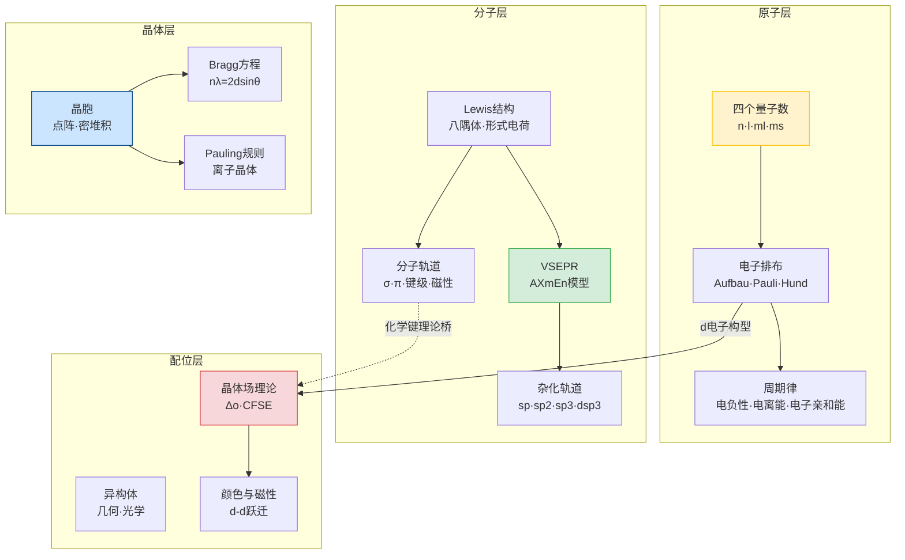

# 第一轮结构化学初步 · 章后复习

> 本复习课面向第一轮结构化学初步全部 6 节新课完成后的学生。目标不是重讲新内容，而是把原子、分子、晶体、配位四层结构语言串成一条线，帮助你建立做题时的判断框架。
>
> 对应讲义：原子结构、元素周期律、分子结构基础、晶体学基础、晶体结构基础、配位化合物基础（均为超级充实版）

---

## 学习目标

完成本节复习后，你应该能够：

1. 从一道结构题中快速判断"这题在考哪一层结构语言"——原子层、分子层、晶体层还是配位层
2. 用统一的"中心原子电子排布 → 杂化/轨道 → 构型 → 性质"链路解决跨模块综合题
3. 熟练运用本章最核心的速查表和公式
4. 识别并避开本章最高频的 8 个陷阱
5. 明确第一轮结构化学与后续深化内容的边界

---

## 一、全章结构总览

第一轮结构化学初步的 6 节课，本质上是在回答一个问题：**原子是怎么组成物质的？**

答案按尺度从小到大分四层：

| 尺度 | 核心问题 | 对应章节 | 核心工具 |
|:---|:---|:---|:---|
| 原子层 | 电子在原子中如何排布？ | 原子结构、元素周期律 | 四个量子数、Slater 规则、周期律四趋势 |
| 分子层 | 原子之间如何成键？分子是什么形状？ | 分子结构基础 | Lewis 结构、VSEPR、杂化轨道、MO |
| 晶体层 | 大量原子/离子如何排列成固体？ | 晶体学基础、晶体结构基础 | 晶胞、密堆积、Bragg 方程 |
| 配位层 | 金属离子如何与配体结合？ | 配位化合物基础 | 价键理论、晶体场理论、CFSE |

这四层不是孤立的。做题时，你需要先判断题目在考哪一层，再调用对应的工具。



**读图要点**：
- **黄色（原子层）**：量子数→电子排布→周期律，是全章的起点
- **绿色（分子层）**：从 Lewis 结构分出 VSEPR（几何预测）和 MO（磁性/键级）两条线
- **蓝色（晶体层）**：晶胞是核心，Bragg 方程和 Pauling 规则是两个应用方向
- **红色（配位层）**：d 电子构型从原子层直通配位层，CFSE→颜色/磁性是核心判断链

---

## 二、原子层：量子数与电子排布

### 2.1 四个量子数——电子的"身份证"

每一个电子的状态由四个量子数唯一确定。这组量子数就像是电子的"身份证号码"——不可能有两个电子拥有完全相同的身份证（Pauli 不相容原理）。

| 量子数 | 符号 | 取值范围 | 物理意义 |
|:---|:---|:---|:---|
| 主量子数 | $n$ | $1, 2, 3, \ldots$ | 电子层，决定轨道的主要能量和大小 |
| 角量子数 | $l$ | $0, 1, \ldots, n-1$ | 轨道形状：$l=0$（s，球形）、$l=1$（p，哑铃形）、$l=2$（d，花瓣形） |
| 磁量子数 | $m_l$ | $-l, \ldots, 0, \ldots, +l$ | 轨道在空间中的取向，决定简并轨道数目 |
| 自旋量子数 | $m_s$ | $+\frac{1}{2}$ 或 $-\frac{1}{2}$ | 电子自旋方向（"上旋"或"下旋"） |

> **易错提醒**：量子数组合法性判断是高频考点。记住三条铁律：① $n > 0$；② $0 \le l \le n-1$（注意是 $n-1$ 不是 $n$！）；③ $|m_l| \le l$。
>
> 典型错误：$n=2, l=2$ 不合法——因为 $l$ 最大只能取 $n-1 = 1$。

### 2.2 电子排布三原则

电子填入轨道时遵循三条原则，缺一不可：

| 原则 | 内容 | 一句话记忆 |
|:---|:---|:---|
| 构造原理（Aufbau） | 电子按能级由低到高依次填充。能级高低用 $(n+l)$ 规则判断：$(n+l)$ 小的先填；$(n+l)$ 相同时 $n$ 小的先填 | 先填低能，后填高能 |
| Pauli 不相容原理 | 同一个原子轨道中最多容纳 2 个电子，且自旋必须相反（$m_s$ 一正一负） | 同轨道最多两电子，自旋相反 |
| Hund 规则 | 等价轨道（如 3 个 $2p$ 轨道）先各填 1 个电子（自旋平行），再配对 | 先单占，再配对 |

**能级填充顺序**（必须熟记）：

$$1s \to 2s \to 2p \to 3s \to 3p \to 4s \to 3d \to 4p \to 5s \to 4d \to \cdots$$

> **易错提醒**：**填充顺序和书写顺序不同！** 填充时 $4s$ 先于 $3d$（因为 $E_{4s} < E_{3d}$），但书写电子排布时按主量子数 $n$ 排序，$3d$ 写在 $4s$ 前面。
>
> 正确写法：$\text{Fe}: [\text{Ar}]\, 3d^6\, 4s^2$（$n=3$ 排在 $n=4$ 前面）
>
> 常见错误：写成 $[\text{Ar}]\, 4s^2\, 3d^6$（按填充顺序写的，但书写时应按 $n$ 排序）

### 2.3 半满/全满稳定——Cr 和 Cu 的"异常"排布

按构造原理，$\text{Cr}$ 应该是 $[\text{Ar}]\, 3d^4\, 4s^2$，但实际是 $[\text{Ar}]\, 3d^5\, 4s^1$；$\text{Cu}$ 应该是 $[\text{Ar}]\, 3d^9\, 4s^2$，但实际是 $[\text{Ar}]\, 3d^{10}\, 4s^1$。

原因是 **交换能**：平行自旋的电子对数越多，交换能越负（体系越稳定）。$d^5$（半满，5 个电子全部平行自旋）和 $d^{10}$（全满）的交换能收益足以补偿从 $4s$ 移一个电子到 $3d$ 的能级差。

可以迁移的特例：$\text{Mo}: [\text{Kr}]\, 4d^5\, 5s^1$、$\text{Ag}: [\text{Kr}]\, 4d^{10}\, 5s^1$、$\text{Pd}: [\text{Kr}]\, 4d^{10}\, 5s^0$（注意 Pd 连 $5s$ 都空了！）。

### 2.4 离子失电子顺序

> **核心规则**：失电子先失 $n$ 最大的轨道，不是先失能级最高的轨道。

| 原子 | 电子排布 | 失电子过程 |
|:---|:---|:---|
| $\text{Fe}$ | $[\text{Ar}]\, 3d^6\, 4s^2$ | 先失 $4s^2$（$n=4$ 最大）→ $\text{Fe}^{2+}: [\text{Ar}]\, 3d^6$ |
| $\text{Fe}^{2+}$ | $[\text{Ar}]\, 3d^6$ | 再失 1 个 $3d$ → $\text{Fe}^{3+}: [\text{Ar}]\, 3d^5$（半满！） |
| $\text{Cu}^{2+}$ | — | $\text{Cu}: [\text{Ar}]\, 3d^{10}\, 4s^1$ → 先失 $4s^1$ → 再失 1 个 $3d$ → $\text{Cu}^{2+}: [\text{Ar}]\, 3d^9$ |

> **易错提醒**：学生最常犯的错误是把 $\text{Fe}^{2+}$ 写成 $[\text{Ar}]\, 3d^4\, 4s^2$（错误：先失 $3d$）。正确做法是先失 $4s$，因为 $4s$ 的主量子数 $n=4$ 大于 $3d$ 的 $n=3$。

### 2.5 Slater 规则——定量求有效核电荷 $Z^*$

有效核电荷 $Z^* = Z - \sigma$，其中 $\sigma$ 是屏蔽常数。Slater 规则将电子分组后，按以下简化规则计算 $\sigma$：

**对于 $s$/$p$ 轨道电子**：
- 同组（$n$ 相同）电子：每个贡献 $0.35$（$1s$ 组内贡献 $0.30$）
- $(n-1)$ 层电子：每个贡献 $0.85$
- $(n-2)$ 及更内层：每个贡献 $1.00$

**对于 $d$/$f$ 轨道电子**：
- 同组电子：每个贡献 $0.35$
- 所有内层电子：每个贡献 $1.00$

**例**：计算 $\text{Na}$（$Z=11$）的 $3s$ 电子的 $Z^*$

$$\sigma = 2 \times 1.00 + 8 \times 0.85 = 2.00 + 6.80 = 8.80$$

$$Z^* = 11 - 8.80 = 2.20$$

> **教学洞察**：Slater 规则的核心价值不是让学生背数字，而是理解"为什么同周期从左到右原子半径减小"——因为 $Z^*$ 增大，核对外层电子的引力增强。同时也能解释"为什么 $3d$ 轨道能量比 $4s$ 高但填充顺序在后"——在填充阶段 $E_{4s} < E_{3d}$，但一旦 $3d$ 有电子后，$3d$ 的穿透效应使其能量降低。

---

## 三、原子层：周期律与原子参数

### 3.1 周期律四趋势速查

| 性质 | 同周期（左 → 右） | 同族（上 → 下） | 核心原因 | 反常点 |
|:---|:---|:---|:---|:---|
| 原子半径 $r$ | 减小 | 增大 | 同周期：$Z^*$ 增大 → 核引力增强；同族：$n$ 增大 → 轨道膨胀 | $\text{III}_\text{A} < \text{II}_\text{A}$（$s^2 \to p^1$，新增 $p$ 轨道更扩散） |
| 第一电离能 $I_1$ | 增大 | 减小 | 同周期：$Z^*$ 增大 → 更难失电子；同族：$r$ 增大 → 更易失电子 | $\text{II}_\text{A} > \text{III}_\text{A}$（$s^2$ 全满稳定）；$\text{V}_\text{A} > \text{VI}_\text{A}$（$p^3$ 半满稳定） |
| 电负性 $\chi$ | 增大 | 减小 | 同周期：$Z^*$ 增大 → 吸引电子能力增强 | — |
| 电子亲和能 | 增大（总体） | 减小 | 同周期：$Z^*$ 增大 → 更易得电子 | $\text{VI}_\text{A} > \text{VII}_\text{A}$（F 原子太小，电子间排斥大） |

> **易错提醒**：$I_1$ 的反常点是竞赛高频考点。记住两组反常：① $\text{Be} > \text{B}$（$2s^2$ 全满 vs $2s^2 2p^1$，$p$ 电子更容易失）；② $\text{N} > \text{O}$（$2p^3$ 半满 vs $2p^4$，半满的交换能收益使 $2p^3$ 更稳定）。

### 3.2 重元素反常——相对论效应

第六周期 $6s$ 区元素的性质出现一系列"反常"，根源是 **相对论效应**：$6s$ 电子速度接近光速，相对论性质量增加导致轨道收缩（$6s$ 轨道半径比非相对论预测更小、能量更低）。

| 现象 | 解释 |
|:---|:---|
| $\text{Au}$ 呈金黄色（而非银白色） | $6s \to 5d$ 跃迁能量落入可见光区 |
| $\text{Hg}$ 熔点极低（$-39\,^\circ\text{C}$） | $6s^2$ 全满且收缩，不易参与金属键 |
| $\text{Tl}^+ > \text{Tl}^{3+}$、$\text{Pb}^{2+} > \text{Pb}^{4+}$ | $6s^2$ 惰性电子对效应——$6s$ 太稳定，不愿失去 |

---

## 四、分子层：Lewis → VSEPR → 杂化工具链

分子结构判断的工具链顺序**不可颠倒**：

$$\text{Lewis 结构} \xrightarrow{\text{确定电子对数}} \text{VSEPR 构型} \xrightarrow{\text{反推}} \text{杂化类型}$$

### 4.1 Lewis 结构——第一步，画对电子分布

**五步法**：
1. 算总价电子数 $S$（阴离子加电荷数，阳离子减电荷数）
2. 电负性小的原子居中，H 和卤素在端基
3. 单键连接骨架，每键用 $2e^-$；剩余电子优先满足端基八隅体
4. 中心原子未满八隅体 → 将端基孤对改为多重键
5. 算形式电荷 $\text{FC}$，选 FC 绝对值之和最小的结构

$$\text{FC} = \text{价电子数} - \text{孤对电子数} - \frac{1}{2} \times \text{成键电子数}$$

> **易错提醒**：形式电荷 $\neq$ 实际电荷。$\text{CO}$ 分子中 C 的 $\text{FC} = -1$、O 的 $\text{FC} = +1$，但实际偶极矩方向是 $\text{C}^+ \to \text{O}^-$。FC 只是用于比较不同共振结构的"会计工具"。

### 4.2 VSEPR——第二步，判断分子形状

核心思想：价层电子对（成键对 + 孤对）互相排斥，趋向尽可能远离。**排斥力大小**：孤对-孤对 > 孤对-成键对 > 成键对-成键对。

| 电子对总数 | 电子对几何 | 分子类型 | 分子构型 | 键角 | 典型例子 |
|:---:|:---|:---|:---|:---:|:---|
| 2 | 直线形 | $\text{AX}_2$ | 直线形 | $180^\circ$ | $\text{BeCl}_2$、$\text{CO}_2$ |
| 3 | 平面三角形 | $\text{AX}_3$ | 平面三角形 | $120^\circ$ | $\text{BF}_3$、$\text{NO}_3^-$ |
| | | $\text{AX}_2\text{E}$ | V 形 | $<120^\circ$ | $\text{SO}_2$（$\sim119^\circ$） |
| 4 | 四面体 | $\text{AX}_4$ | 四面体 | $109.5^\circ$ | $\text{CH}_4$、$\text{SO}_4^{2-}$ |
| | | $\text{AX}_3\text{E}$ | 三角锥 | $\sim107^\circ$ | $\text{NH}_3$ |
| | | $\text{AX}_2\text{E}_2$ | V 形 | $\sim104.5^\circ$ | $\text{H}_2\text{O}$ |
| 5 | 三角双锥 | $\text{AX}_5$ | 三角双锥 | $90^\circ/120^\circ$ | $\text{PCl}_5$ |
| | | $\text{AX}_4\text{E}$ | 跷跷板形 | — | $\text{SF}_4$ |
| | | $\text{AX}_3\text{E}_2$ | T 形 | — | $\text{ClF}_3$ |
| | | $\text{AX}_2\text{E}_3$ | 直线形 | — | $\text{XeF}_2$ |
| 6 | 八面体 | $\text{AX}_6$ | 八面体 | $90^\circ$ | $\text{SF}_6$ |
| | | $\text{AX}_5\text{E}$ | 四方锥 | — | $\text{BrF}_5$ |
| | | $\text{AX}_4\text{E}_2$ | 平面正方形 | $90^\circ$ | $\text{XeF}_4$ |

> **三角双锥的关键**：孤对电子**优先占赤道向**。原因：赤道位置与相邻 3 个位置（2 轴向 + 2 赤道中的另 1 个）的排斥总和最小；轴向位置与 4 个赤道位置呈 $90^\circ$，排斥更大。

### 4.3 杂化轨道——由构型反推

| 电子对几何 | 杂化类型 | 杂化轨道数 | 典型例子 |
|:---|:---|:---:|:---|
| 直线形 | $sp$ | 2 | $\text{BeCl}_2$、$\text{CO}_2$、$\text{C}_2\text{H}_2$ |
| 平面三角形 | $sp^2$ | 3 | $\text{BF}_3$、$\text{C}_2\text{H}_4$、$\text{NO}_3^-$ |
| 四面体 | $sp^3$ | 4 | $\text{CH}_4$、$\text{NH}_3$、$\text{H}_2\text{O}$ |
| 三角双锥 | $sp^3d$ | 5 | $\text{PCl}_5$、$\text{SF}_4$、$\text{ClF}_3$ |
| 八面体 | $sp^3d^2$ | 6 | $\text{SF}_6$、$\text{XeF}_4$ |

> **易错提醒**：含 $d$ 轨道的杂化（$sp^3d$、$sp^3d^2$）只适用于第三周期及以后的元素——第二周期的 C、N、O 等**没有可用的 $d$ 轨道**，不能做 $sp^3d$ 杂化！所以 $\text{PCl}_5$ 存在但 $\text{NCl}_5$ 不存在。

### 4.4 离域 $\pi$ 键与等电子体

**离域 $\pi$ 键形成三条件**：
1. 参与原子**共平面**
2. 各原子有**垂直于分子平面的平行 $p$ 轨道**
3. 电子数 $m < 2n$（$n$ 为参与原子数）

表示：$\Pi_n^m$。

| 分子/离子 | $\Pi_n^m$ | 说明 |
|:---|:---|:---|
| $\text{NO}_3^-$ | $\Pi_4^6$ | N + 3个O 共 4 原子，6 个 $\pi$ 电子 |
| $\text{CO}_3^{2-}$ | $\Pi_4^6$ | 与 $\text{NO}_3^-$ 等电子 |
| $\text{BF}_3$ | $\Pi_4^6$ | B 的空 $2p$ 轨道参与 |
| $\text{CO}_2$ | $\Pi_3^4$（两组） | 相互垂直的两组离域 $\pi$ 键 |
| $\text{O}_3$ | $\Pi_3^4$ | V 形分子中的离域 |

**等电子体原理**：相同价电子总数 + 相同原子数 → 相同结构。这是结构预测的最快路径。

| 等电子体组 | 价电子数 | 结构 |
|:---|:---:|:---|
| $\text{CO}_2$、$\text{N}_2\text{O}$、$\text{N}_3^-$、$\text{OCN}^-$ | 16 | 直线形 |
| $\text{SO}_4^{2-}$、$\text{PO}_4^{3-}$、$\text{ClO}_4^-$ | 32 | 正四面体 |
| $\text{CO}_3^{2-}$、$\text{NO}_3^-$、$\text{BF}_3$ | 24 | 平面三角形 |
| $\text{NH}_3$、$\text{H}_3\text{O}^+$ | 8 | 三角锥 |

### 4.5 分子轨道理论——双原子分子的键级与磁性

对于第二周期双原子分子，MO 能级图分两类：

| $s$-$p$ 混杂程度 | 能级顺序 | 代表分子 | 记忆口诀 |
|:---|:---|:---|:---|
| 显著（$\text{B}$、$\text{C}$、$\text{N}$） | $\pi_{2p} < \sigma_{2p}$ | $\text{B}_2$、$\text{C}_2$、$\text{N}_2$ | "硼碳氮，$\pi$ 在前" |
| 弱（$\text{O}$、$\text{F}$） | $\sigma_{2p} < \pi_{2p}$ | $\text{O}_2$、$\text{F}_2$ | "氧氟，$\sigma$ 在前" |

**键级公式**：

$$\text{键级} = \frac{\text{成键电子数} - \text{反键电子数}}{2}$$

| 分子 | 键级 | 未成对电子 | 磁性 |
|:---|:---:|:---:|:---|
| $\text{N}_2$ | 3 | 0 | 抗磁性 |
| $\text{O}_2$ | 2 | 2 | **顺磁性** |
| $\text{B}_2$ | 1 | 2 | 顺磁性 |
| $\text{C}_2$ | 2 | 0 | 抗磁性 |

> **教学洞察**：$\text{O}_2$ 的顺磁性是 MO 理论最经典的胜利——Lewis 结构和 VB 理论都无法解释"为什么氧气会被磁铁吸引"，但 MO 理论通过 $\pi^*_{2p}$ 上的 2 个未成对电子完美解释。这是竞赛中经常考的"为什么需要 MO 理论"的证据。

---

## 五、晶体层：晶胞与堆积

### 5.1 七大晶系速查

| 晶系 | 轴长关系 | 轴角关系 | 实例 |
|:---|:---|:---|:---|
| 立方 | $a = b = c$ | $\alpha = \beta = \gamma = 90^\circ$ | $\text{NaCl}$、$\text{Cu}$、金刚石 |
| 四方 | $a = b \neq c$ | $\alpha = \beta = \gamma = 90^\circ$ | $\text{TiO}_2$（金红石） |
| 正交 | $a \neq b \neq c$ | $\alpha = \beta = \gamma = 90^\circ$ | $\text{I}_2$ |
| 六方 | $a = b \neq c$ | $\alpha = \beta = 90^\circ,\ \gamma = 120^\circ$ | 石墨、$\text{Mg}$ |
| 三方 | $a = b = c$ | $\alpha = \beta = \gamma \neq 90^\circ$ | 方解石 |
| 单斜 | $a \neq b \neq c$ | $\alpha = \gamma = 90^\circ,\ \beta \neq 90^\circ$ | $\text{KClO}_3$ |
| 三斜 | $a \neq b \neq c$ | $\alpha \neq \beta \neq \gamma$ | $\text{CuSO}_4 \cdot 5\text{H}_2\text{O}$ |

### 5.2 金属堆积方式

| 堆积方式 | 配位数 | 空间利用率 | 晶胞中原子数 | 堆积层序 | 典型金属 |
|:---|:---:|:---:|:---:|:---|:---|
| 简单立方（sc） | 6 | 52% | 1 | — | $\text{Po}$ |
| 体心立方（bcc） | 8 | 68% | 2 | — | $\text{Na}$、$\text{K}$、$\text{Fe}$、$\text{W}$ |
| 面心立方（fcc/ccp） | 12 | 74% | 4 | $\text{ABCABC}$ | $\text{Cu}$、$\text{Ag}$、$\text{Au}$、$\text{Al}$ |
| 六方最密堆积（hcp） | 12 | 74% | 2 | $\text{ABAB}$ | $\text{Mg}$、$\text{Zn}$、$\text{Ti}$ |

> **易错提醒**：$\text{fcc}$ 和 $\text{hcp}$ 都是最密堆积（空间利用率 74%、配位数 12），但晶胞中原子数不同——$\text{fcc}$ 含 4 个原子，$\text{hcp}$ 含 2 个原子。原因是两者的晶胞大小不同。

**空间利用率推导要点**（以 $\text{fcc}$ 为例）：

面心立方中，原子沿面对角线方向接触：

$$\sqrt{2}\, a = 4r \quad \Rightarrow \quad r = \frac{\sqrt{2}}{4}\, a$$

晶胞含 4 个原子，体积 $V_{\text{原子}} = 4 \times \frac{4}{3}\pi r^3$：

$$\text{空间利用率} = \frac{4 \times \frac{4}{3}\pi \left(\frac{\sqrt{2}}{4}a\right)^3}{a^3} = \frac{\sqrt{2}\pi}{6} \approx 74\%$$

### 5.3 典型离子晶体结构

| 结构类型 | 晶胞特征 | 阴离子堆积 | 阳离子填充 | 配位数比 | 典型例子 |
|:---|:---|:---|:---|:---:|:---|
| $\text{NaCl}$ 型 | 面心立方 | $\text{ccp}$ | 全部八面体空隙 | 6:6 | $\text{NaCl}$、$\text{MgO}$、$\text{FeO}$ |
| $\text{CsCl}$ 型 | 简单立方 | 简单立方 | 立方体空隙 | 8:8 | $\text{CsCl}$、$\text{CsBr}$ |
| 立方 $\text{ZnS}$ 型 | 面心立方 | $\text{ccp}$ | 一半四面体空隙 | 4:4 | $\text{ZnS}$、$\text{ZnO}$、$\text{GaAs}$ |
| $\text{CaF}_2$ 型 | 面心立方 | 简单立方（阳离子） | 全部四面体空隙（阴离子） | 8:4 | $\text{CaF}_2$、$\text{UO}_2$ |
| $\text{TiO}_2$（金红石） | 体心四方 | — | 一半八面体空隙 | 6:3 | $\text{TiO}_2$、$\text{SnO}_2$ |

### 5.4 晶胞计数法则

原子在晶胞中的贡献：
- **顶点**：$\frac{1}{8}$
- **棱**：$\frac{1}{4}$
- **面心**：$\frac{1}{2}$
- **体心**：$1$

**例**：$\text{NaCl}$ 晶胞中
- $\text{Cl}^-$：$8 \times \frac{1}{8} + 6 \times \frac{1}{2} = 1 + 3 = 4$ 个
- $\text{Na}^+$：$12 \times \frac{1}{4} + 1 = 3 + 1 = 4$ 个
- 晶胞含 4 个 $\text{NaCl}$ "分子"

### 5.5 Bragg 方程

$$n\lambda = 2d\sin\theta$$

现代写法常将 $n$ 归并到 $d$ 中：$\lambda = 2d\sin\theta$

- $d$：晶面间距
- $\theta$：掠射角（入射线与晶面的夹角）
- $2\theta$：衍射角（入射束与衍射束的夹角）
- $\lambda$：X 射线波长（Cu Kα = 0.1541 nm 最常用）

> 来源：[[03-知识点/决赛要求/结构与配位深化/晶体结构深化]]

**衍射角与晶面间距的对应**：通过测量 $2\theta$ 可计算 $d$，进而确定晶胞参数。粉末衍射中，每个衍射峰对应一组 $(hkl)$ 晶面。

### 5.6 Miller 指数与晶面间距（竞赛入口）

> 来源：[[03-知识点/决赛要求/结构与配位深化/晶体结构深化]] §二

**Miller 指数 $(hkl)$ 确定步骤**：
1. 找出不过原点的最近晶面
2. 读取在 $a, b, c$ 轴上的截距（以晶胞边长为单位）
3. 取截距倒数 → 化为最小整数比

**晶面间距公式**：

| 晶系 | $d_{hkl}$ 公式 |
|:---|:---|
| 立方 | $d_{hkl} = \dfrac{a}{\sqrt{h^2 + k^2 + l^2}}$ |
| 正交 | $\dfrac{1}{d_{hkl}^2} = \dfrac{h^2}{a^2} + \dfrac{k^2}{b^2} + \dfrac{l^2}{c^2}$ |
| 四方 | $\dfrac{1}{d_{hkl}^2} = \dfrac{h^2 + k^2}{a^2} + \dfrac{l^2}{c^2}$ |

**缩放关系**：$d_{nh,nk,nl} = d_{hkl}/n$（Miller 指数乘以 $n$，间距变为 $1/n$）

**结构因子与系统消光**（竞赛决赛入口）：

$$F_{hkl} = \sum_j f_j \, e^{2\pi i(hx_j + ky_j + lz_j)}$$

当 $|F_{hkl}|^2 = 0$ 时发生**系统消光**——这是判断晶胞类型（P/I/F）的关键工具：

| 晶胞类型 | 消光条件 |
|:---|:---|
| 简单立方（P） | 无系统消光 |
| 体心立方（I） | $h + k + l$ = 奇数时消光 |
| 面心立方（F） | $h, k, l$ 奇偶混合时消光 |

### 5.7 密度公式

由晶胞参数计算晶体密度：

$$\rho = \frac{nM}{N_A \cdot a^3}$$

- $n$：晶胞中"分子"数
- $M$：摩尔质量（$\text{g/mol}$）
- $N_A$：阿伏加德罗常数
- $a$：晶胞边长（$\text{cm}$）

---

## 六、配位层：晶体场理论与 CFSE

### 6.1 配合物的组成

配合物 = 内界（中心离子 + 配体）+ 外界。

关键概念：配位数、配位原子、单齿/多齿配体、螯合物。

### 6.2 晶体场分裂

八面体场中，6 个配体沿 $\pm x, \pm y, \pm z$ 方向接近中心离子。5 个 $d$ 轨道根据瓣的方向不同，受到的排斥不同：

- $t_{2g}$ 组（低能，三重简并）：$d_{xy}$、$d_{xz}$、$d_{yz}$——瓣在轴之间，排斥小
- $e_g$ 组（高能，二重简并）：$d_{z^2}$、$d_{x^2-y^2}$——瓣沿轴指向配体，排斥大

能量关系（重心不变规则）：

$$E(e_g) = +0.6\,\Delta_o, \quad E(t_{2g}) = -0.4\,\Delta_o$$

其中 $\Delta_o$ 为八面体场的分裂能。

**四面体场**：分裂模式与八面体相反（$t_2$ 高能、$e$ 低能），且 $\Delta_t \approx \frac{4}{9}\Delta_o$（通常较小）。

**平面四方场**：$d_{x^2-y^2}$ 能量最高。适用于 $d^8$ 电子组态 + 强场配体（如 $\text{Ni}^{2+}$、$\text{Pd}^{2+}$、$\text{Pt}^{2+}$、$\text{Au}^{3+}$）。

### 6.3 高自旋 vs 低自旋

| 条件 | 自旋态 | $d$ 电子排布策略 | 磁性 |
|:---|:---|:---|:---|
| $\Delta < P$（弱场配体） | 高自旋 | 先单占所有轨道（Hund 规则），再配对 | 未成对电子多，顺磁性强 |
| $\Delta > P$（强场配体） | 低自旋 | 先填满 $t_{2g}$，再填 $e_g$ | 未成对电子少或无，顺磁性弱 |

其中 $P$ 为电子成对能。

> **重要**：$4d$/$5d$ 金属的 $\Delta_o$ 本身很大，几乎**总是低自旋**。只有 $3d$ 金属才需要根据配体场强弱判断。

### 6.4 光谱化学序列

配体场强从弱到强：

$$\text{I}^- < \text{Br}^- < \text{Cl}^- < \text{F}^- < \text{OH}^- < \text{H}_2\text{O} < \text{NH}_3 < \text{en} < \text{NO}_2^- < \text{CN}^- < \text{CO}$$

$$\xleftarrow{\qquad \text{弱场} \qquad} \qquad \xrightarrow{\qquad \text{强场} \qquad}$$

### 6.5 定性推出任意配位构型的 d 轨道分裂——三步法（竞赛高频）

> 来源：[[03-知识点/化学原理/晶体场理论]] §三 — 不靠死记，从配体位置直接推理。

**第一步：设坐标系，定位配体**

| 构型 | 配体位置 |
|:---|:---|
| 八面体 | ±x, ±y, ±z |
| 四面体 | 交替位于 8 个卦限中的 4 个 |
| 平面正方形 | ±x, ±y（去掉 z 轴配体） |
| 三角双锥 | 2 轴向在 ±z，3 赤道在 xOy 面 120° 分布 |

**第二步：判断每个 d 轨道受配体影响程度**

| d 轨道 | 瓣的指向 | 受影响程度 |
|:---|:---|:---|
| $d_{x^2-y^2}$ | 沿 x, y 轴正负方向 | 配体在 x, y 轴时受影响**最大** |
| $d_{z^2}$ | 沿 z 轴 + xOy 面"甜甜圈" | z 轴有配体时大，仅 xOy 面时较小 |
| $d_{xy}$ | x, y 轴之间 45° 方向 | 受影响**次之** |
| $d_{xz}$, $d_{yz}$ | xz/yz 面内 | 通常受影响**最小**且**等价** |

**第三步：按受影响程度排序，得分裂型式**

| 构型 | 分裂顺序（高→低） | 记忆口诀 |
|:---|:---|:---|
| 八面体 | $d_{x^2-y^2}$ = $d_{z^2}$ ≫ $d_{xy}$ = $d_{xz}$ = $d_{yz}$ | "2+3"（$e_g$ 高，$t_{2g}$ 低） |
| 四面体 | $d_{xy}$ = $d_{xz}$ = $d_{yz}$ ≫ $d_{x^2-y^2}$ = $d_{z^2}$ | "3+2"（与八面体相反） |
| 平面正方形 | $d_{x^2-y^2}$ ≫ $d_{xy}$ > $d_{z^2}$ > $d_{xz}$ = $d_{yz}$ | "2111"（$d_{x^2-y^2}$ 一枝独秀） |
| 三角双锥 | $d_{z^2}$ ≫ $d_{x^2-y^2}$ = $d_{xy}$ > $d_{xz}$ = $d_{yz}$ | "221" |

> **竞赛价值**：这个方法训练的是"空间想象力 + 静电推理"。遇到任何陌生配位构型（如三棱柱、加冠多面体）都能自己推。

### 6.6 光谱化学序列的本质——σ/π 配位场解释

> 来源：[[03-知识点/化学原理/晶体场理论]] §四 — 把"死记表"变成"可理解可预测的分类"。

| 配体类型 | σ 效应 | π 效应 | 对 Δ₀ 的影响 | 代表配体 |
|:---|:---|:---|:---|:---|
| **纯 σ 给体** | σ 给电子→$e_g$ 升高 | 无 π 相互作用 | Δ₀ 中等 | NH₃, en |
| **σ 给体 + π 给体** | σ 给电子→$e_g$ 升高 | π 给电子→$t_{2g}$ 升高（部分抵消 Δ₀） | Δ₀ 减小（弱场） | I⁻, Br⁻, Cl⁻, F⁻, OH⁻ |
| **σ 给体 + π 受体** | σ 给电子→$e_g$ 升高 | π 接受电子→$t_{2g}$ 降低（增大 Δ₀） | Δ₀ 增大（强场） | CN⁻, CO, NO₂⁻, phen |

> **一句话**：π 给体让 Δ₀ 变小（弱场），π 受体让 Δ₀ 变大（强场）。纯 σ 给体居中。

### 6.7 CFSE 计算（八面体场）

$$\text{CFSE} = (-0.4\,x + 0.6\,y)\,\Delta_o + (m_1 - m_2)\,P$$

其中 $x = t_{2g}$ 电子数，$y = e_g$ 电子数，$m_1$ = 低自旋时成对电子数，$m_2$ = 高自旋时成对电子数，$P$ = 成对能。

**高频 CFSE 数据速查**（高自旋，单位 $\Delta_o$）：

| $d^n$ | $t_{2g}$ | $e_g$ | CFSE/$\Delta_o$ | 未成对电子 |
|:---:|:---:|:---:|:---:|:---:|
| d⁰ | 0 | 0 | 0 | 0 |
| d¹ | 1 | 0 | -0.4 | 1 |
| d² | 2 | 0 | -0.8 | 2 |
| d³ | 3 | 0 | -1.2 | 3 |
| d⁴ | 3 | 1 | -0.6 | 4 |
| d⁵ | 3 | 2 | 0 | 5 |
| d⁶ | 4 | 2 | -0.4 | 4 |
| d⁷ | 5 | 2 | -0.8 | 3 |
| d⁸ | 6 | 2 | -1.2 | 2 |
| d⁹ | 6 | 3 | -0.6 | 1 |
| d¹⁰ | 6 | 4 | 0 | 0 |

> **注意**：d⁵ 高自旋和 d⁰、d¹⁰ 的 CFSE = 0，这意味着它们的配合物没有 CFSE 贡献的额外稳定性。

**具体数值实例**（来源：[[03-知识点/化学原理/晶体场理论]]）：

| 配合物 | Δ₀ (cm⁻¹) | P (cm⁻¹) | 自旋态 |
|:---|:---:|:---:|:---|
| $[\text{FeF}_6]^{3-}$ | 13,700 | 30,000 | 高自旋（Δ < P） |
| $[\text{Fe(CN)}_6]^{3-}$ | 34,250 | 30,000 | 低自旋（Δ > P） |
| $[\text{Ti(H}_2\text{O)}_6]^{3+}$ | 20,400 | — | d¹，无 HS/LS 之分 |
| $[\text{Cr(NH}_3\text{)}_6]^{3+}$ | 21,700 | — | d³，无 HS/LS 之分 |

### 6.8 配合物的颜色与 Tanabe-Sugano 图入门

> 来源：[[03-知识点/无机和结构化学/Tanabe-Sugano图]] 和 [[03-知识点/无机和结构化学/配位场理论]]

**颜色产生的完整链条**：

```
d电子数与构型 → 分裂能大小 → 跃迁类型 → 允许/禁阻 → 吸收位置与强度 → 显色
```

| 判断问题 | 最低判断动作 | 课堂高频结论 |
|:---|:---|:---|
| 有没有 d-d 跃迁？ | 先看 d 电子数与构型 | d⁰ / d¹⁰ 通常无 d-d 跃迁，无色 |
| 为什么有的颜色很浅？ | 看选律 | 八面体中心对称体系的 d-d 跃迁受 Laporte 禁阻，颜色偏浅 |
| 为什么四面体常更鲜艳？ | 看对称性 | Td 无反演中心，d-d 跃迁禁阻较弱，吸收强度更大 |
| 为什么有的带特别强？ | 区分 d-d 与 CT | 电荷转移带（LMCT/MLCT）通常比 d-d 带强得多 |

**d⁵ 高自旋特殊性**：基谱项 ${}^6A_{1g}$（六重态），所有激发态多重度 ≤ 4，全部自旋禁阻 → Mn²⁺ 配合物颜色极淡（几乎无色或极浅粉色）。

**Tanabe-Sugano 图使用方法**（竞赛决赛入口）：

1. 确定 $d^n$ 组态 → 选对应 TS 图
2. 从光谱读取自旋允许吸收峰位 → 计算跃迁能比值 $\nu_2/\nu_1$
3. 在 TS 图上定位使比值匹配的横轴位置 → 读出 $\Delta_o/B$
4. 反推 $\Delta_o$ 和 $B$：$B = \nu_1/(E_1/B)$，$\Delta_o = (\Delta_o/B) \times B$

> **例题**（Weller 例题 20.8）：$[\text{Cr(NH}_3\text{)}_6]^{3+}$，$\nu_1 = 21550\ \text{cm}^{-1}$，$\nu_2 = 28500\ \text{cm}^{-1}$ → $\nu_2/\nu_1 = 1.32$ → 在 d³ TS 图上定位 $\Delta_o/B = 33.0$ → $B = 657\ \text{cm}^{-1}$，$\Delta_o = 21700\ \text{cm}^{-1}$。电子云重排参数 $\beta = 657/1030 = 0.64$（NH₃ 为中等偏强场配体，合理）。

### 6.9 配合物异构体

| 异构类型 | 识别要点 | 典型例子 |
|:---|:---|:---|
| 几何异构（顺/反） | $\text{Ma}_4\text{b}_2$ 型：配体空间排布不同 | $[\text{PtCl}_2(\text{NH}_3)_2]$：顺铂（抗癌）/ 反铂（无活性） |
| 面式/经式（$\text{fac}$/$\text{mer}$） | $\text{Ma}_3\text{b}_3$ 型：三同配体占一个面（$\text{fac}$）或经线（$\text{mer}$） | $[\text{CoCl}_3(\text{NH}_3)_3]$ |
| 光学异构 | 无对称面/对称中心 → 手性 → 旋光性 | $[\text{Co}(\text{en})_3]^{3+}$ 的 $\Lambda$/$\Delta$ 对映体 |
| 电离异构 | 内外界离子交换 | $[\text{CoBr}(\text{NH}_3)_5]\text{SO}_4$ vs $[\text{CoSO}_4(\text{NH}_3)_5]\text{Br}$ |
| 键合异构 | 两可配体以不同原子配位 | $\text{NO}_2^-$：N 配位（硝基）vs O 配位（亚硝酸根） |

---

## 七、跨层综合判断框架

做一道结构题时，按以下顺序判断：

**第一步：这题在考哪一层？**

- 涉及量子数/电子排布/Slater 规则/周期律 → 原子层
- 涉及分子形状/键角/杂化/Lewis 结构/MO → 分子层
- 涉及晶胞/堆积/密度/Bragg/晶体结构类型 → 晶体层
- 涉及配合物/配位数/$d$ 轨道分裂/磁性/异构 → 配位层

**第二步：调用对应层的核心工具**

- 原子层：三原则写排布 → Slater 求 $Z^*$ → 周期律比较
- 分子层：Lewis → VSEPR → 杂化 → MO（如需键级/磁性）
- 晶体层：找晶胞 → 计数 → 算密度/配位数 → Bragg（如需）
- 配位层：识别中心 + 配体 → CFT 分裂 → 高/低自旋 → CFSE → 磁性

**第三步：检查跨层连接**

- 原子层 → 分子层：电子排布决定杂化类型（如 $d^0$ 中心不考虑 CFT 偏好）
- 分子层 → 晶体层：分子间力决定晶体堆积方式和熔沸点
- 原子层 → 配位层：$d$ 电子数决定 CFT 行为（高/低自旋、Jahn-Teller）
- 分子层 → 配位层：Lewis 酸碱是配位键的本质

---

## 八、高频陷阱 Top 8

### 陷阱 1：书写顺序 vs 填充顺序

错误：$\text{Fe}$ 的电子排布写成 $[\text{Ar}]\,4s^2\,3d^6$

正确：按 $n$ 排序写 $[\text{Ar}]\,3d^6\,4s^2$。填充时 $4s$ 先于 $3d$，但书写时按主量子数 $n$ 排列。

### 陷阱 2：失电子先失 $4s$ 不是 $3d$

错误：$\text{Fe}^{2+}$ 失去 2 个 $3d$ 电子，写成 $[\text{Ar}]\,3d^4\,4s^2$

正确：$\text{Fe}$ 先失 $4s^2$（$n=4$ 最大）再失 $3d$。$\text{Fe}^{2+} = [\text{Ar}]\,3d^6$，$\text{Fe}^{3+} = [\text{Ar}]\,3d^5$。

### 陷阱 3：孤对电子必须算进 VSEPR

错误：$\text{H}_2\text{O}$ 是直线形（因为 O 只连了 2 个 H）

正确：O 有 2 对孤对电子，$\text{AX}_2\text{E}_2$ → 四面体电子对几何 → V 形（$\sim104.5^\circ$）。

### 陷阱 4：三角双锥中孤对优先占赤道向

错误：$\text{SF}_4$ 中孤对占轴向位置

正确：孤对优先占赤道向（3 个赤道位置中取 1 个），分子构型为跷跷板形。$\text{ClF}_3$ 的 2 对孤对也占赤道向，构型为 T 形。

### 陷阱 5：MO 能级图两类顺序搞混

错误：所有第二周期双原子分子都用同一套 MO 能级图

正确：$\text{B}_2$/$\text{C}_2$/$\text{N}_2$ 用 $\pi_{2p} < \sigma_{2p}$（$s$-$p$ 混杂显著）；$\text{O}_2$/$\text{F}_2$ 用 $\sigma_{2p} < \pi_{2p}$（$s$-$p$ 混杂弱）。

### 陷阱 6：含 $d$ 轨道杂化只适用于第三周期及以后

错误：$\text{N}$ 可以做 $sp^3d$ 杂化形成 $\text{NCl}_5$

正确：第二周期元素没有可用的 $d$ 轨道，不能做 $sp^3d$/$sp^3d^2$ 杂化。$\text{PCl}_5$ 存在但 $\text{NCl}_5$ 不存在。

### 陷阱 7：晶体场分裂能 $\Delta$ 和成对能 $P$ 必须比较

错误：$\Delta$ 大就一定是低自旋

正确：必须比较 $\Delta$ 和 $P$。$\Delta > P$ → 低自旋；$\Delta < P$ → 高自旋。$3d$ 金属需要判断，$4d$/$5d$ 金属 $\Delta$ 本身就大，几乎总是低自旋。

### 陷阱 8：$\text{fcc}$ 和 $\text{hcp}$ 晶胞中原子数不同

错误：$\text{fcc}$ 和 $\text{hcp}$ 都是最密堆积，晶胞中原子数相同

正确：$\text{fcc}$ 晶胞含 4 个原子，$\text{hcp}$ 晶胞含 2 个原子。虽然空间利用率都是 74%，配位数都是 12，但晶胞大小不同。

---

## 九、本章与后续章节的接口

| 后续内容 | 从本章继承什么 | 会升级什么 |
|:---|:---|:---|
| 第二轮元素化学 | 周期律、离子性质比较 | 从通用趋势到具体元素体系的颜色、沉淀、价态 |
| 第三轮有机化学 | 杂化、Lewis 酸碱、分子间力 | 从无机分子到有机分子的结构与反应性 |
| 第三轮晶体结构深化 | 晶胞、堆积、Bragg 方程 | 复杂结构推断、非整比化合物、相变 |
| 第三轮配合物结构深化 | CFT、CFSE、高/低自旋 | 配位场理论 MO、Tanabe-Sugano 图 |
| 第三轮波谱桥 | 原子/分子结构基础 | IR/NMR/UV-Vis/MS 作为结构证据链 |

第一轮结构化学是全库的"结构语言基础"。后续每一轮新课都会回到这里找工具。

---

*品质标准：四层结构总览表 + 各层核心速查（公式/规则/判断表，LaTeX 数学格式）+ 跨模块判断框架 + 高频陷阱（8 个）+ 后续接口预告。*
