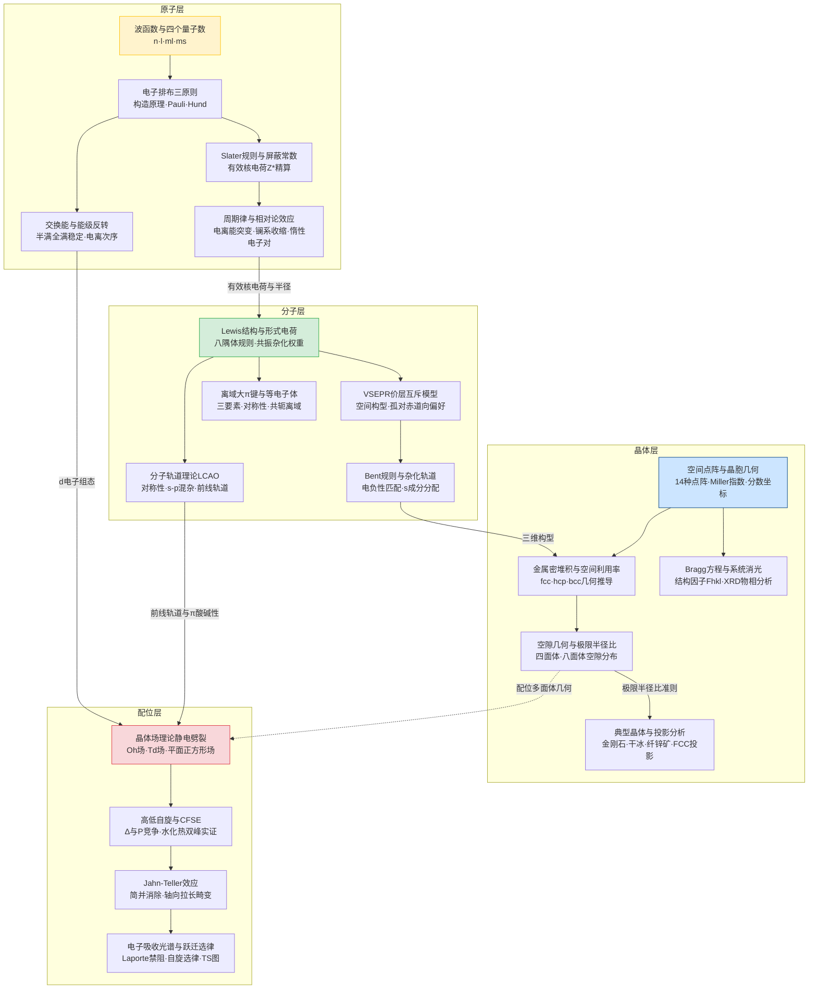

# 第一轮结构化学初步 · 章后复习

> 本复习课面向第一轮结构化学初步全部 6 节新课完成后的学生。目标不是重讲新内容，而是把原子、分子、晶体、配位四层结构语言串成一条线，帮助你建立做题时的判断框架。
>
> 对应讲义：原子结构、元素周期律、分子结构基础、晶体学基础、晶体结构基础、配位化合物基础（均为超级充实版）

---

## 学习目标

完成本节复习后，你应该能够：

1. 从一道结构题中快速判断"这题在考哪一层结构语言"——原子层、分子层、晶体层还是配位层
2. 用统一的"中心原子电子排布 → 杂化/轨道 → 构型 → 性质"链路解决跨模块综合题
3. 熟练运用本章最核心的速查表和公式
4. 识别并避开本章最高频的 8 个陷阱
5. 明确第一轮结构化学与后续深化内容的边界

---

## 一点五、本章考试地图

> 复习课的第一件事，是让学生知道"这章在考试里占什么位置"。本节把考纲条目、近五年命题走向和题型权重摊开——后面那张知识网络才有优先级，而不是平均用力。

### 1.5.1 考纲条目对照

本章对应《中国化学奥林匹克基本要求》**基础要求·化学原理**中的 5 个条目：

| 考纲条目 | 本章对应模块 | 覆盖 |
|:---|:---|:---:|
| 04-元素周期律和元素周期表 | 原子层：周期律与原子参数 | 已覆盖 |
| 09-原子结构 | 原子层：量子数与电子排布 | 已覆盖 |
| 10-分子结构与化学键 | 分子层：Lewis → VSEPR → 杂化 | 已覆盖 |
| 11-分子间作用力 | 分子层：极性、氢键与堆积 | 已覆盖 |
| 12-配合物 | 配位层：晶体场理论与 CFSE | 已覆盖 |

> **条目页入口**：[[02-考纲条目/基础要求/化学原理/04-元素周期律和元素周期表|04-元素周期律和元素周期表]] · [[02-考纲条目/基础要求/化学原理/09-原子结构|09-原子结构]] · [[02-考纲条目/基础要求/化学原理/10-分子结构与化学键|10-分子结构与化学键]] · [[02-考纲条目/基础要求/化学原理/11-分子间作用力|11-分子间作用力]] · [[02-考纲条目/基础要求/化学原理/12-配合物|12-配合物]]

> **边界提醒**：`02-气体`、`03-分散相与连续相`、`05-酸碱理论`、`06-热力学初步`、`07-化学平衡`、`08-氧化还原与电化学`、`化学动力学` 同属"基础要求·化学原理"，但课程编在大章节 1（第一轮化学原理），**不在本章复习范围**。

### 1.5.2 历年真题命题分布（25-40 届纵深）

> 数据来源：[[备课思路/近五年真题命题拆解分析]] 第三、四节 与题库 25~40 届真题实体卡。

| 届次 | 年份 | 晶体与分子结构考点 | 配合物与化学键考点 | 回链题卡 |
|:---:|:---:|:---|:---|:---|
| 25 届 | 2011 | 分子几何构型与对称性分析 | 八面体配合物旋光异构与配位平衡 | [[04-题库/真题/第25届初赛/无机和结构化学/题-025-2-乙酰丙酮锰配合物结构\|题-025-2]] |
| 28 届 | 2014 | 自由基单电子体系 VSEPR 模型推导；多氮 $N_8^-$ 体系 Lewis 结构与杂化 | 经典二茂铁夹心化合物合成与成键 | [[04-题库/真题/第28届初赛/无机和结构化学/题-028-2-亚磺酰自由基结构与VSEPR\|题-028-2]] · [[04-题库/真题/第28届初赛/无机和结构化学/题-028-3-N8-Lewis结构与杂化\|题-028-3]] |
| 29 届 | 2015 | 立方密堆积晶胞原子计数、多面体空隙与配位数 | 钒配合物氧化数、配位数与几何构型 | [[04-题库/真题/第29届初赛/无机和结构化学/题-029-5-晶胞原子数目\|题-029-5]] |
| 30 届 | 2014 | 离子晶体固体电解质晶胞参数推算与孔道空隙 | 主族离子化合物 VSEPR 构型推断 | [[04-题库/真题/第30届初赛/无机和结构化学/题-030-4-固体电解质化学式及nm值\|题-030-4]] |
| 31 届 | 2017 | 极端高压异常配位晶体（高压 NaCl 晶体组成推导） | 钌配合物化学式推导与杂化轨道理论 | [[04-题库/真题/第31届初赛/无机和结构化学/题-031-4-高压NaCl晶体化学式\|题-031-4]] |
| 32 届 | 2018 | 磷氧化物超结构分子骨架与立体对称性 | 双核金属配合物桥联配位构型 | [[04-题库/真题/第32届初赛/无机和结构化学/题-032-2-P4O18分子结构\|题-032-2]] |
| 33 届 | 2019 | 晶胞投影图识别、六方密堆积与化学式推断 | $CsAuCl_3$ 配合物混合氧化态判断 | [[04-题库/真题/第33届初赛/无机和结构化学/题-033-6-晶体化学式\|题-033-6]] |
| 35 届 | 2021 | 干冰晶胞分析、钙钛矿及 RP 相（传统计算 + 结构识别） | 过渡金属配合物推断 | [[04-题库/真题/第35届初赛/无机和结构化学/题-035-4-干冰晶胞分析\|题-035-4]] · [[04-题库/真题/第35届初赛/无机和结构化学/题-035-6-钙钛矿及RP相\|题-035-6]] · [[04-题库/真题/第35届初赛/无机和结构化学/题-035-7-过渡金属配合物推断\|题-035-7]] |
| 36 届 | 2022 | 高压碳酸盐钙钛矿、碳酸根聚合结构、$\mathrm{Mg_2Fe}$ 氢化物 | Cr 双核配合物结构、铬配合物反应 | [[04-题库/真题/第36届初赛/题-036-2-高压碳酸盐钙钛矿结构\|题-036-2]] · [[04-题库/真题/第36届初赛/题-036-4-铬双核配合物结构\|题-036-4]] |
| 37 届 | 2023 | MAX 相（$\mathrm{Ti_3AlC_2}$）通式推导、层间距计算、MXene 合成 | Pt 多核配合物组成/结构、Ru 配合物 + d 轨道分裂图 | [[04-题库/真题/第37届初赛/题-037-6-MAX相通式推导\|题-037-6]] · [[04-题库/真题/第37届初赛/题-037-4-Pt多核配合物组成推断\|题-037-4]] |
| 38 届 | 2024 | **第 5 题 18 分**：FeCr 合金晶胞、SrSb、KGe、$\mathrm{WSe_2}$ 层状、$\mathrm{CeO_2}$ 氧空位（[112] 投影 + 对称性分析） | 醋酸亚铬制备（Cr–Cr 四重键、$\pi$ 键轨道）、场效应 + 邻基参与 | [[04-题库/真题/第38届初赛/题-038-5-1-FeCr合金晶胞组成\|题-038-5-1]] · [[04-题库/真题/第38届初赛/题-038-6-1-醋酸亚铬试剂位置\|题-038-6-1]] |
| 39 届 | 2025 | XeFₓ 晶胞（三种结构 → 组成推导）、$\mathrm{FeO_2}$ 吸附 Xe、ReNₓ 高压相 | 初赛配合物减少，重心转入决赛 | [[04-题库/真题/第39届初赛/无机和结构化学/题-039-5-XeFₓ晶胞组成推导\|题-039-5]] |
| **40 届** | **2026** | **第 5 题（30 分）**：等径球密堆积、八面体空隙、**多型体 $h/c$ 层序与 3C／2H 记号**、分数坐标；**第 4 题（27 分）**：金刚烷 → 金刚石的 TEM 图像统计与键焓估算 | **第 1 题（19 分）**：$\sigma$ 配键与 $\pi$ 反馈键、氧化加成（主族—配位交叉） | [[04-题库/真题/第40届初赛/无机和结构化学/题-040-5-密堆积结构\|题-040-5]] · [[04-题库/真题/第40届初赛/无机和结构化学/题-040-4-从金刚烷到金刚石的电子显微学研究\|题-040-4]] · [[04-题库/真题/第40届初赛/无机和结构化学/题-040-1-磷化学\|题-040-1]] |

### 1.5.3 命题趋势四条

1. **从"计算型"转向"定性推理型"**。2021–2023 仍保留晶胞分子数、密度、键长等传统计算；2024–2025 **全面转向"给结构图 → 推组成 / 判晶系 / 析缺陷"**。空间想象能力要求急剧上升（[112] 投影、氧空位对称性分析）——这正是本章最需要补的训练量。
2. **前沿材料常态化**。每年 1–2 个陌生材料体系：钙钛矿／RP 相（35 届）→ 高压钙钛矿、储氢材料（36 届）→ MAX 相／MXene（37 届）→ 不锈钢／$\mathrm{WSe_2}$／$\mathrm{CeO_2}$（38 届）→ Xe 氟化物／高压相（39 届）。考的**不是材料本身的知识，而是"把已知的结构化学原理搬到陌生结构上"**。
3. **配合物重心上移**。初赛配合物题在 39 届明显减少、转入决赛；决赛新增三个方向——单分子磁体（SMM）与 d 轨道分裂的精细分析、**轨道级的 $\sigma/\pi$ 成键分析**、配合物催化循环推理。第一轮的 CFSE 是这条进阶线的起点。40 届第 1 题（磷化学）把 $\sigma$ 配键／$\pi$ 反馈键下放到初赛，说明这一方向在**上移之后又向初赛反向渗透**。
4. **结构表征与图像统计入题**（40 届新增）。第 4 题要求从 TEM 图像统计粒径分布、进而估键焓修正；第 5 题要求用 3C／2H 记号与 $h/c$ 层序描述多型体。**晶体学的"表示法"本身开始成为考点**，而不是只考"数晶胞"。

### 1.5.4 近两年模拟题命题热点与创新变式（13 家机构 3133 题源实测挖掘）

> 数据来源：外挂索引 `10-索引与统计/04-考点题源索引.json`。全库 13 家竞赛培训与教研机构（质心GChO、chemy、化英社、XeChem、清北营等）共收录无机和结构化学题卡 **3,133 张（涵盖 160 个细分考点）**。

#### 1. 模拟题高频考点 TOP 7 榜单

| 核心考点 | 模拟题题量 | 主要来源机构分布 | 命题考查焦点 |
|:---|:---:|:---|:---|
| [[晶体结构]] | 332 题 | 质心(94) · chemy(57) · 化英社(48) | 陌生无机材料晶体推断、空间点阵与多面体连接方式 |
| [[晶胞]] | 176 题 | 质心(59) · chemy(43) · XeChem(29) | 晶胞原子数、分数坐标、点阵参数与空间群消光规律 |
| [[晶体密度公式]] | 168 题 | chemy(83) · 清北营(16) · 伽马(14) | 晶胞参数换算理论密度、掺杂合金占位度与摩尔质量 |
| [[配位数]] | 146 题 | chemy(40) · XeChem(28) · 化英社(17) | 配位多面体判定、半径比规则与配位几何畸变 |
| [[点群初步]] | 97 题 | chemy(24) · 汇智(14) · 化英社(13) | 分子对称元素识别、手性判据与薛芬利斯记号 |
| [[配位化学]] | 94 题 | XeChem(29) · 化英社(27) · 汇智(14) | 异构体计数、螯合效应、晶体场分裂能与反位效应 |
| [[点阵类型]] | 89 题 | 化英社(27) · chemy(20) · 清北营(9) | 14 种 Bravais 点阵判断、素胞与复胞选取标准 |

#### 2. 近两年模拟题的三大前沿创新变式

1. **复杂晶体投影图与分数坐标反推**：
   从传统的三维透视图，大幅升级为沿特定晶带轴（如 $[001]$、$[110]$）的二维投影图，考查根据原子重叠度与分数高度反演真实晶胞，并计算原子间最短接触距离。
2. **多孔骨架材料（MOF/COF）与宿主-客体包结化学**：
   大量引入网格化学前沿体系，考查节点（SBU）的配位模式、拓扑网络类型（如 pcu、dia、tbo）以及孔道有效直径和晶胞理论孔隙率。
3. **极端条件材料（高压固态化学与超氢化物）**：
   以富氢超导材料、超高压富氮化合物为背景，考查共价网络向密堆积相转变时的结构畸变与非整数化学计量比。

#### 3. 精选机构模拟题变式题卡直通

| 机构与题号 | 涉及核心考点 | 命题场景与能力要求 | 回链题卡 |
|:---|:---|:---|:---|
| chemy CM-01-04 | [[晶体结构]] · [[点群初步]] | 二茂铁晶体多形性、晶胞对称性与旋转异构点群识别 | [[04-题库/2026机构初赛模拟题/chemy/题-CM-01-04-自20世纪50年代以来人们已\|题-CM-01-04]] |
| 化英社 HYS-01-03 | [[晶体结构]] · [[晶胞]] | 四方晶系未知材料投影图还原、分数坐标与原子间距 | [[04-题库/2026机构初赛模拟题/化英社/题-HYS-01-03-如下展示了一种四方晶系的晶体\|题-HYS-01-03]] |
| 质心 GChO-01-02 | [[化学键]] | 陌生分子 Lewis 结构式书写、成键轨道与几何构型推断 | [[04-题库/2026机构初赛模拟题/质心GChO/题-GChO-01-02-某未知化合物X只含有碳氧和氯\|题-GChO-01-02]] |
| XeChem XeC-03-04 | [[晶体结构]] · [[配位数]] | 锕系元素卤化物晶体配位多面体分析与晶胞参数计算 | [[04-题库/2026机构初赛模拟题/XeChem/题-XeC-03-04-锕系元素卤化物的晶体结构\|题-XeC-03-04]] |

### 1.5.5 题型权重与复习优先级

| 题型 | 命题频率 | 典型载体 | 复习优先级 |
|:---|:---:|:---|:---:|
| 晶胞组成 / 分数坐标 / 投影图推断 | 每届 | 合金、氧化物、氟化物 | ★★★ |
| 电子排布与周期律推断 | 每届 | 元素参数、电离能、半径 | ★★★ |
| 分子构型（VSEPR / 杂化 / 离域 $\pi$） | 每届 | 主族分子、缺电子分子 | ★★★ |
| 晶体场与磁性（CFSE、d 轨道分裂） | 每届 | 配合物颜色、磁矩 | ★★ |
| 分子间作用力与堆积方式 | 间隔出现 | 干冰、分子晶体 | ★★ |
| 配合物异构体计数 | 间隔出现 | 多核配合物 | ★ |
| 多型体与堆积变体（3C／2H、$h/c$ 层序） | 40 届起出现 | 密堆积、层状晶体 | ★★ |
| 结构图像统计（XRD／TEM） | 40 届起出现 | 粒径分布、投影图 | ★★ |

> **按考试权重的复习顺序**（注意：**不是**按教材顺序）：
> 1. **晶胞 → 组成 / 对称性 / 缺陷的推断链** —— 分值最重，且 2024 起成为主流形式，是本章第一优先。
> 2. **原子层与分子层的基础工具**（电子排布、VSEPR、杂化、离域 $\pi$）—— 它们是晶体层与配位层的共同前提，属"必得分"。
> 3. **晶体场与 CFSE** —— 配位层的入口，也是跨到决赛磁学与轨道分析的桥。
> 4. **晶体学表示法**（40 届新增）—— 多型体记号、$h/c$ 层序、分数坐标与投影图读数。它们不引入新理论，却是新题的"书写语言"：看不懂记号，就读不出结构。
> 5. **近两年模拟题变式演练** —— 针对四方/六方晶胞二维投影还原与多孔骨架拓扑做实战破题。

---

## 二、全章知识网络总图与四层穿透逻辑

结构化学在化学竞赛体系中承担着连接微观量子物理与宏观化学反应的桥梁角色。第一轮结构化学复习的核心脉络，在于厘清从单粒子薛定谔方程到宏观凝聚态晶体多重物理对称性的尺度演进规律。微观体系按物理尺度划分为四个层次：原子层、分子层、晶体层与配位层。解题分析的关键在于识别题目所处的基本尺度，并迅速打通跨尺度的理论映射接口。

```mermaid
graph TD
    subgraph 原子层
        QN[波函数与四个量子数<br/>n·l·ml·ms]
        EP[电子排布三原则<br/>构造原理·Pauli·Hund]
        EX[交换能与能级反转<br/>半满全满稳定·电离次序]
        SL[Slater规则与屏蔽常数<br/>有效核电荷Z*精算]
        PE[周期律与相对论效应<br/>电离能突变·镧系收缩·惰性电子对]
    end

    subgraph 分子层
        LEWIS[Lewis结构与形式电荷<br/>八隅体规则·共振杂化权重]
        VSEPR[VSEPR价层互斥模型<br/>空间构型·孤对赤道向偏好]
        BENT[Bent规则与杂化轨道<br/>电负性匹配·s成分分配]
        PI[离域大π键与等电子体<br/>三要素·对称性·共轭离域]
        MO_L[分子轨道理论LCAO<br/>对称性·s-p混杂·前线轨道]
    end

    subgraph 晶体层
        LATTICE[空间点阵与晶胞几何<br/>14种点阵·Miller指数·分数坐标]
        PACK[金属密堆积与空间利用率<br/>fcc·hcp·bcc几何推导]
        VOID[空隙几何与极限半径比<br/>四面体·八面体空隙分布]
        BRAGG[Bragg方程与系统消光<br/>结构因子Fhkl·XRD物相分析]
        TYPICAL[典型晶体与投影分析<br/>金刚石·干冰·纤锌矿·FCC投影]
    end

    subgraph 配位层
        CFT[晶体场理论静电劈裂<br/>Oh场·Td场·平面正方形场]
        SPIN[高低自旋与CFSE<br/>Δ与P竞争·水化热双峰实证]
        JT[Jahn-Teller效应<br/>简并消除·轴向拉长畸变]
        SPEC[电子吸收光谱与跃迁选律<br/>Laporte禁阻·自旋选律·TS图]
    end

    QN --> EP --> EX
    EP --> SL --> PE
    PE -->|有效核电荷与半径| LEWIS
    EX -->|d电子组态| CFT
    LEWIS --> VSEPR --> BENT
    LEWIS --> PI
    LEWIS --> MO_L
    BENT -->|三维构型| PACK
    MO_L -->|前线轨道与π酸碱性| CFT
    LATTICE --> PACK --> VOID
    LATTICE --> BRAGG
    VOID -->|极限半径比准则| TYPICAL
    CFT --> SPIN --> JT --> SPEC
    VOID -.->|配位多面体几何| CFT

    style QN fill:#fff3cd,stroke:#ffc107
    style LEWIS fill:#d4edda,stroke:#28a745
    style LATTICE fill:#cce5ff,stroke:#004085
    style CFT fill:#f8d7da,stroke:#dc3545
```

上述四层架构之间的穿透逻辑具体体现在四个核心接口中：

1. **原子层向分子层的轨道投影**：波函数的角向分布与主能级间距，决定了共价成键的杂化模式与能量相近程度；各中心原子的有效核电荷差异直接决定共价键极性与离域大 $\pi$ 键的形成倾向。
2. **分子层向晶体层的空间对称拓展**：孤立分子的三维空间点群、偶极矩取向以及分子间次级相互作用，直接映射为晶体点阵中的空间群与分子质心排列方式，例如 $\ce{CO2}$ 分子晶体中分子轴沿立方晶胞四条体对角线的对称取向。
3. **原子层向配位层的能级劈裂投影**：过渡金属价层 $d$ 轨道的电子排布与径向收缩程度，在外部配体静电场与配位共价场的作用下解除简并，发生 $t_{2\mathrm{g}}$ 与 $e_{\mathrm{g}}$ 能级劈裂，进而决定配位化合物的高低自旋态与几何构型稳定性。
4. **分子层向配位层的共价协同演进**：从纯静电晶体场模型进一步拓展至分子轨道理论，配体的 $\sigma$ 供电能力与 $\pi$ 供电或 $\pi$ 受电特征，决定了配位场劈裂能 $\Delta_{\mathrm{o}}$ 的相对大小，构成了光谱化学序列的微观物理实质。

---

## 三、原子层：多电子原子结构、量子数与有效核电荷精算

原子层理论是整个结构化学的公理化基础。竞赛中对于原子结构的考查，已从基础的概念识记全面转向基于微观量子力学模型的定量推导与周期律反常现象的物理归因。

### 3.1 单电子/多电子原子波函数与四个量子数物理内涵

在非相对论量子力学框架下，类氢单电子体系的定态薛定谔方程为 $\hat{H}\psi = E\psi$。在球坐标系 $(r, \theta, \phi)$ 中，该方程可通过分离变量法精确求解，其定态波函数可表述为径向部分与角向部分的乘积：

$$\psi_{n, l, m_l}(r, \theta, \phi) = R_{n, l}(r) Y_{l, m_l}(\theta, \phi)$$

电子在空间某一微元 $\mathrm{d}\tau = r^2 \sin\theta \mathrm{d}r \mathrm{d}\theta \mathrm{d}\phi$ 内出现的概率为 $|\psi|^2 \mathrm{d}\tau$。为了描述电子在距核半径为 $r$ 处的薄球壳内的全空间出现概率，引入径向分布函数：

$$\mathrm{D}(r) = 4\pi r^2 R_{n, l}^2(r)$$

波函数在空间中的节点分布直接反映了电子动能与势能的拓扑特征：径向节点数为 $n - l - 1$，角向节面数为 $l$，总节面数为 $n - 1$。波函数的物理状态由四个量子数严格界定：

| 量子数 | 符号 | 取值范围 | 物理意义与宏观可观测约束 |
|:---|:---:|:---|:---|
| **主量子数** | $n$ | $1, 2, 3, \dots$ | 决定电子层的主能级高低与轨道径向伸展范围，单电子体系能量仅依赖于 $n$ |
| **角量子数** | $l$ | $0, 1, \dots, n-1$ | 决定轨道角动量模值 $L = \sqrt{l(l+1)}\hbar$ 及空间角分布几何形状（$s, p, d, f$） |
| **磁量子数** | $m_l$ | $-l, \dots, 0, \dots, +l$ | 决定角动量在磁场选定 $z$ 轴上的投影 $L_z = m_l \hbar$ 及轨道在空间中的取向 |
| **自旋量子数** | $m_s$ | $+\frac{1}{2}, -\frac{1}{2}$ | 决定电子内禀自旋角动量在 $z$ 轴上的投影 $S_z = m_s \hbar$，反映电子相对自旋状态 |

### 3.2 构造原理、泡利原理、洪特规则与交换能机制

多电子原子的基态电子排布受三大物理原理严格制约：

1. **构造原理（Aufbau Principle）与 Klechkowski 规则**：电子优先填充能量最低的可用单电子轨道。根据 Klechkowski 规则，各亚层的能量高低大体由主量子数与角量子数之和 $(n+l)$ 决定：$(n+l)$ 较小的轨道能量较低；当 $(n+l)$ 相同时，$n$ 较小的轨道因穿透效应更强而具有更低的能量。因此，基态填充顺序为 $1s \to 2s \to 2p \to 3s \to 3p \to 4s \to 3d \to 4p \to 5s \to 4d \dots$。
2. **泡利不相容原理（Pauli Exclusion Principle）**：全同费米子体系的总波函数在粒子交换操作下必须是反对称的。在单粒子近似下，这意味着同一个原子中决不能有两个电子拥有完全相同的四个量子数组合 $(n, l, m_l, m_s)$。因此，每个空间轨道最多只能容纳 2 个自旋相反的电子。
3. **洪特规则（Hund's Rule）与交换能（Exchange Energy）**：在能级相同的简并轨道中，电子分布优先以自旋平行的单占方式排布，从而使总自旋多重度 $2S+1$ 达到最大。这一现象的微观本质源自量子力学交换相互作用：同自旋电子对之间由于费米空穴（Fermi Hole）的存在，空间重叠减小，电子间库仑斥力减弱；在哈特里-福克自洽场理论中，平行自旋电子之间存在负的交换能贡献：

$$E_{\text{ex}} = -\frac{1}{2} k(k-1) K$$

式中 $k$ 为平行自旋电子数目，$K$ 为正的交换积分。平行自旋电子对数越多，系统的总交换能越负，体系越稳定。

**半满/全满特殊稳定性与能级反转机理**：
在第一过渡系中，$\ce{Cr}$ 的基态电子排布为 $[\ce{Ar}]\,3d^5 4s^1$（而非 $[\ce{Ar}]\,3d^4 4s^2$），$\ce{Cu}$ 为 $[\ce{Ar}]\,3d^{10} 4s^1$（而非 $[\ce{Ar}]\,3d^9 4s^2$）。在 $\ce{Cr}$ 中，$3d^5 4s^1$ 构型中含有 6 个单电子，同自旋电子对数达到 $C_5^2 + C_1^2 = 10$，远多于 $3d^4 4s^2$ 构型的 $C_4^2 + C_2^2 = 7$ 对，所获得的巨大负交换能足以弥补电子从 $4s$ 提升到 $3d$ 所需的轨道能级跃迁差。同理，第二过渡系的 $\ce{Mo}([\ce{Kr}]\,4d^5 5s^1)$、$\ce{Ag}([\ce{Kr}]\,4d^{10} 5s^1)$ 以及 $\ce{Pd}([\ce{Kr}]\,4d^{10} 5s^0)$ 均遵循这一能量最优准则。

**过渡金属电离过程的能级反转**：
在自由中性原子状态下，$4s$ 轨道的径向分布包含 3 个径向节面，内侧存在靠近原子核的微小概率峰（钻穿效应），因而在无外层电子时 $E_{4s} < E_{3d}$。然而，一旦核电荷逐步增加且 $3d$ 轨道开始填充，新填入的 $3d$ 电子由于主量子数较小（$n=3$），平均分布半径逐渐收缩并深入内层。这使得核对 $3d$ 电子的直接有效引力迅速增大，$3d$ 单电子轨道能级发生急剧下降，反转为 $E_{3d} < E_{4s}$。因此，当过渡金属原子电离生成阳离子时，电子必然优先从主量子数最大、有效核电荷相对较小的最外层 $4s$ 轨道脱离（例如 $\ce{Fe}: [\ce{Ar}]\,3d^6 4s^2 \to \ce{Fe^{2+}}: [\ce{Ar}]\,3d^6 \to \ce{Fe^{3+}}: [\ce{Ar}]\,3d^5$），绝不能按逆向构造原理从 $3d$ 轨道电离。

### 3.3 Slater 规则与屏蔽常数定量计算

多电子体系中，每个电子不仅受到核电荷 $Z$ 的库仑引力，还受到其余全部电子的静电排斥与屏蔽作用。引入有效核电荷 $Z^* = Z - \sigma$，其中 $\sigma$ 为综合屏蔽常数。根据 Slater 经验法则，电子按主量子数与角量子数分层分组：

$$(1s), (2s, 2p), (3s, 3p), (3d), (4s, 4p), (4d), (4f), (5s, 5p), \dots$$

对任意特定电子计算其所受的屏蔽常数 $\sigma$，规则如下：

| 待考察电子所在组 | 屏蔽电子所在组 | 每个电子贡献的屏蔽系数 |
|:---|:---|:---:|
| **$(ns, np)$ 组** | 位于该组右侧的外层各组 | $0.00$ |
| | 同一组内的其他电子 | $0.35$（若为 $1s$ 组内则取 $0.30$） |
| | 主量子数为 $(n-1)$ 的各组电子 | $0.85$ |
| | 主量子数 $\le (n-2)$ 的各内层组电子 | $1.00$ |
| **$(nd, nf)$ 组** | 位于该组右侧的外层各组 | $0.00$ |
| | 同一组内的其他电子 | $0.35$ |
| | 位于该组左侧的所有内层电子（无论何层） | $1.00$ |

**经典定量精算案例**：
计算基态铁原子（$\ce{Fe}$，$Z = 26$，电子排布 $(1s)^2(2s,2p)^8(3s,3p)^8(3d)^6(4s)^2$）中 $4s$ 电子与 $3d$ 电子的有效核电荷：

1. **计算 $4s$ 电子的有效核电荷**：
   同组（$4s$）尚有 1 个电子，贡献 $1 \times 0.35 = 0.35$；
   $(n-1)$ 层（即 $3s, 3p, 3d$）共有 $2 + 6 + 6 = 14$ 个电子，贡献 $14 \times 0.85 = 11.90$；
   $(n-2)$ 及更内层（即 $1s, 2s, 2p$）共有 $2 + 8 = 10$ 个电子，贡献 $10 \times 1.00 = 10.00$；
   $$\sigma(4s) = 0.35 + 11.90 + 10.00 = 22.25 \implies Z^*(4s) = 26 - 22.25 = 3.75$$

2. **计算 $3d$ 电子的有效核电荷**：
   同组（$3d$）尚有 5 个电子，贡献 $5 \times 0.35 = 1.75$；
   所有内层电子（$1s, 2s, 2p, 3s, 3p$）共有 $2 + 8 + 8 = 18$ 个电子，贡献 $18 \times 1.00 = 18.00$；
   外层的 $4s$ 电子位于右侧，贡献为 $0$；
   $$\sigma(3d) = 1.75 + 18.00 = 19.75 \implies Z^*(3d) = 26 - 19.75 = 6.25$$

计算结果表明，$3d$ 电子受到的有效核电荷（$6.25$）显著高于 $4s$ 电子（$3.75$）。这从半经验量化角度严格证明了 $3d$ 轨道在充入电子后能量显著低于 $4s$，且 $4s$ 电子更容易在外界电离中被首先剥离。

### 3.4 周期律四趋势与反常效应（电离能突变、镧系收缩与相对论效应）

元素性质随原子序数的递增呈现周期性变化，但由于轨道亚层结构的微观量子特征，常规递变趋势中蕴含着若干关键的反常节点：

**第一电离能 $I_1$ 锯齿状起伏归因**：
在同周期主族元素中，第一电离能总趋势随有效核电荷增大而增加，但在两个位置出现明显的能量反常反转：
1. **第 IIA 族大于第 IIIA 族（如 $\ce{Be} > \ce{B}$，$\ce{Mg} > \ce{Al}$）**：$\ce{Be}$ 的价电子构型为全充满的 $2s^2$，穿透力强且具有球形对称性；而 $\ce{B}$ 的价电子构型为 $2s^2 2p^1$，新进入的 $2p$ 电子处于完全被内层 $2s^2$ 屏蔽的环境中，径向节面较多且分布弥散，剥离这一孤立的 $2p$ 电子所需的电离能反而小于剥离处于全满 $2s$ 轨道中的电子。
2. **第 VA 族大于第 VIA 族（如 $\ce{N} > \ce{O}$，$\ce{P} > \ce{S}$）**：$\ce{N}$ 具有半充满的 $2p^3$ 构型，3 个电子自旋平行单占，交换能最大且轨道间排斥对称平衡；$\ce{O}$ 为 $2p^4$ 构型，第 4 个电子必须与已有电子配对填入同一个 $2p$ 轨道。同一个空间轨道内两个自旋相反的电子在较小体积内运动，产生强烈的电子对库仑排斥能，这使得该电子极易被解离，从而表现出 $\ce{O}$ 的第一电离能反常低于 $\ce{N}$。

**镧系收缩（Lanthanide Contraction）的结构后果**：
随着原子序数从 $\ce{_{57}La}$ 递增至 $\ce{_{71}Lu}$，新增的 14 个电子连续填入处于内层的 $4f$ 亚层。$4f$ 轨道的空间角分布具有多瓣特征且高度发散，电子云的径向遮蔽能力低下，导致核电荷的增加未能得到充分屏蔽。外层电子受到的实际有效核电荷以高于寻常同周期的速率剧烈增加，导致自镧至镥的原子与离子半径发生显著收缩。
这一微观收缩完全抵消了由第 5 周期跨入第 6 周期时增加一个完整电子层带来的轨道体积膨胀效应。其直接宏观后果是：第 6 周期 $5d$ 过渡金属的共价半径与离子半径几乎与其同族上方的第 4 周期 $4d$ 元素完全重合（例如 $r(\ce{Zr^{4+}}) = 72\,\mathrm{pm}$ 与 $r(\ce{Hf^{4+}}) = 71\,\mathrm{pm}$；$r(\ce{Nb^{5+}}) = 64\,\mathrm{pm}$ 与 $r(\ce{Ta^{5+}}) = 64\,\mathrm{pm}$）。这导致 $\ce{Zr}$ 与 $\ce{Hf}$、$\ce{Nb}$ 与 $\ce{Ta}$ 的化学性质具有极高的相似度，在自然界中共生且极难分离。

**相对论效应对重元素物理化学性质的重塑**：
当核电荷数 $Z$ 极大（特别是第六周期末端）时，内层 $1s$ 电子的平均运动速度接近真空光速，导致电子的相对论性静止质量显著增大：

$$m_{\mathrm{rel}} = \frac{m_0}{\sqrt{1 - (v/c)^2}}$$

这一相对论质量增大致使轨道有效玻尔半径 $a_0 = \frac{\hbar^2}{m e^2}$ 发生直接收缩。相对论效应在周期表深部诱发了三大经典宏观现象：
1. **金的特征金黄色光学吸收**：相对论质量增加引起具有显著球对称穿透性的 $6s$ 轨道强烈收缩且能级深幅下降；$6s$ 轨道的深降加剧了对核电荷的屏蔽，反过来引起非球对称的 $5d$ 轨道发生相对论性膨胀与能级上升。这使得 $5d \to 6s$ 能级间距从紫外区显著缩小至可见光蓝光区（跃迁能量约为 $2.4\,\mathrm{eV}$），金原子选择性强烈吸收可见光谱中的蓝紫光波段，反射互补的黄红光波段，呈现出特有的金黄色泽。
2. **金属汞的常温液态特性**：汞原子基态价层构型为全充满闭壳层 $[\ce{Xe}]\,4f^{14} 5d^{10} 6s^2$。强烈的相对论收缩将 $6s^2$ 电子云紧束于原子核周围，导致其不仅不愿失电子，而且极难与其他汞原子发生轨道重叠形成有效的离域金属键。相干结合能微弱，致使汞的熔点反常低达 $-38.8\,^\circ\mathrm{C}$，成为室温下唯一的液态纯金属。
3. **重主族惰性电子对效应（Inert Pair Effect）**：在第 6 周期重主族元素（$\ce{Tl}, \ce{Pb}, \ce{Bi}$）中，相对论收缩使外层 $6s^2$ 电子轨道的有效能级异常稳定，激发并电离这对外层 $s$ 电子所需的总能量十分高昂。体系更倾向于仅失去外层的 $6p$ 电子而保留稳定的 $6s^2$ 构型。因此，其低氧化态物种（$\ce{Tl+}, \ce{Pb^{2+}}, \ce{Bi^{3+}}$）在热力学上显著稳定，而高氧化态物种（$\ce{Tl^{3+}}, \ce{Pb^{4+}}, \ce{Bi^{5+}}$）则展现出强烈的还原倾向与极高的标准氧化还原电位。

---

## 四、分子层：化学键理论工具链与离域大 $\pi$ 键精算

分子结构的推断与解析是化学竞赛中连接无机元素与有机立体化学的核心枢纽。解决分子构型与成键特征问题，必须建立阶梯式的工具链：首先通过规范的 Lewis 结构式确定分子的电荷分布与成键骨架，再利用价层电子对互斥理论（VSEPR）确定空间几何构型，进而通过杂化轨道理论与离域大 $\pi$ 键模型阐明电子离域机理。

### 4.1 Lewis 结构式、形式电荷与超价分子本质

绘制规范的 Lewis 结构式遵循五步准则：
1. **计算体系总价电子数 $V$**：对于中性分子为各原子价电子之和；对于多原子阴离子加上负电荷绝对值；对于多原子阳离子减去正电荷数。
2. **确定中心原子并构建 $\sigma$ 单键骨架**：除氢原子外，电负性较小的原子通常占据中心位置；将外围原子与中心原子以双中心单键（每键消耗 2 个电子）相连。
3. **补齐外围配体原子的八隅体闭壳层**：将剩余电子优先以孤对电子形式分配给电负性较大的外围原子，满足八隅体规则（氢原子满足二隅体）。
4. **电荷核算与多重键形成**：若分配完外围电子后仍有多余电子，则将多余电子全数置于中心原子上；若中心原子价层尚未满足八隅体，则调动外围配体的孤对电子向中心原子转化形成共价双键或三键。
5. **形式电荷核算与最优共振结构筛选**：形式电荷（Formal Charge, $\mathrm{FC}$）是假定成键电子由两原子均摊时原子的表观带电量：

$$\mathrm{FC} = V_{\text{自由}} - N_{\text{孤对}} - \frac{1}{2} B_{\text{成键}}$$

式中 $V_{\text{自由}}$ 为自由中性原子的价电子数，$N_{\text{孤对}}$ 为该原子拥有的非键单电子数，$B_{\text{成键}}$ 为该原子参与形成的共价键电子总数。

筛选最优共振杂化体的准则为：
1. 优先满足所有参与原子的八隅体规则；
2. 尽可能使所有原子的形式电荷绝对值之和 $\sum |\mathrm{FC}|$ 最小；
3. 负形式电荷优先定域于电负性较大的原子上，正形式电荷定域于电负性较小的原子上；
4. 带有同号形式电荷的相邻原子在热力学上是不稳定的。

**主族超价分子本质澄清**：
对于第三周期及以后的非金属高价卤化物及含氧化合物（如 $\ce{SF6}, \ce{PCl5}, \ce{XeF2}$），中心原子的名义成键电子数突破了 8 个（分别达到 12、10、10 个电子）。传统教科书常使用外层 $d$ 轨道杂化（如 $sp^3d, sp^3d^2$）来解释其超价状态。然而现代高精度从头算量化结果表明，第三周期主族非金属原子的空 $3d$ 轨道能量比 $3s, 3p$ 轨道高出 $10\,\mathrm{eV}$ 以上且径向分布高度发散，实际成键贡献可以忽略。这些超价分子的成键本质是由局域的定域 $\sigma$ 单键与基于配体配对轨道的离域三中心四电子键（3c-4e）构成的，中心原子通过离子共价共振实现电荷分散，无需借助高能 $d$ 轨道的真实杂化。

### 4.2 价层电子对互斥理论（VSEPR）与分子立体几何预测

VSEPR 理论基于泡利排斥与库仑静电排斥，认为中心原子周围的价层电子对（包括成键电子对与孤对电子）在三维空间中彼此远离，以最小化总排斥能量。

**价层电子对数（VSEPR 数）计算通式**：

$$N_{\text{VSEPR}} = m + n = \sigma\text{ 键数} + \frac{1}{2}\left(V_{\text{中心}} - \sum_{i} x_i b_i \pm q\right)$$

式中 $V_{\text{中心}}$ 为中心原子的价电子数；$x_i$ 为配体原子数目，$b_i$ 为配体原子达到稳定八隅体所需的未成对电子数（$\ce{-F, -Cl, -Br, -I, -H}$ 取 1；双键氧族配体 $\ce{=O, =S}$ 取 2；三键氮族配体 $\ce{\equiv N}$ 取 3）；$q$ 为离子的净电荷（阴离子取加号，阳离子取减号）。

中心原子价层电子对的排斥强度遵循经典次序：
$$\text{孤对-孤对（LP-LP）} > \text{孤对-成键对（LP-BP）} > \text{成键对-成键对（BP-BP）}$$

| 电子对数 | 电子对母体几何 | 分子构型通式 | 孤对数 $n$ | 分子真实立体构型 | 实际键角特征 | 典型实例 |
|:---:|:---|:---|:---:|:---|:---:|:---|
| 2 | 直线形 | $\mathrm{AX_2}$ | 0 | 直线形 | $180^\circ$ | $\ce{BeCl2}, \ce{CO2}, \ce{HCN}$ |
| 3 | 平面正三角形 | $\mathrm{AX_3}$ | 0 | 平面正三角形 | $120^\circ$ | $\ce{BF3}, \ce{SO3}, \ce{NO3-}$ |
| | | $\mathrm{AX_2E}$ | 1 | 角形 / V 形 | $< 120^\circ$（如 $119.5^\circ$） | $\ce{SO2}, \ce{NO2-}, \ce{O3}$ |
| 4 | 正四面体 | $\mathrm{AX_4}$ | 0 | 正四面体 | $109.5^\circ$ | $\ce{CH4}, \ce{SiCl4}, \ce{SO4^{2-}}$ |
| | | $\mathrm{AX_3E}$ | 1 | 三角锥形 | $< 109.5^\circ$（如 $107.3^\circ$） | $\ce{NH3}, \ce{H3O+}, \ce{PCl3}$ |
| | | $\mathrm{AX_2E_2}$ | 2 | 角形 / V 形 | $< 109.5^\circ$（如 $104.5^\circ$） | $\ce{H2O}, \ce{OF2}, \ce{SCl2}$ |
| 5 | 三角双锥 | $\mathrm{AX_5}$ | 0 | 三角双锥 | $90^\circ / 120^\circ$ | $\ce{PCl5}, \ce{AsF5}$ |
| | | $\mathrm{AX_4E}$ | 1 | 跷跷板形 | $< 90^\circ / < 120^\circ$ | $\ce{SF4}, \ce{SeF4}, \ce{TeCl4}$ |
| | | $\mathrm{AX_3E_2}$ | 2 | T 形 | $< 90^\circ$（如 $87.5^\circ$） | $\ce{ClF3}, \ce{BrF3}$ |
| | | $\mathrm{AX_2E_3}$ | 3 | 直线形 | $180^\circ$ | $\ce{XeF2}, \ce{I3-}, \ce{ICl2-}$ |
| 6 | 正八面体 | $\mathrm{AX_6}$ | 0 | 正八面体 | $90^\circ$ | $\ce{SF6}, \ce{PF6-}, \ce{SiF6^{2-}}$ |
| | | $\mathrm{AX_5E}$ | 1 | 四方锥形 | $< 90^\circ$ | $\ce{BrF5}, \ce{IF5}, \ce{XeOF4}$ |
| | | $\mathrm{AX_4E_2}$ | 2 | 平面正方形 | $90^\circ$ | $\ce{XeF4}, \ce{ICl4-}$ |

**三角双锥骨架中孤对电子赤道向偏好机制**：
三角双锥配位场包含两种不等价的空间位置：赤道位（Equatorial）与轴向位（Axial）。由静电库仑定律可知，电子对之间的排斥能随夹角增大而急剧衰减，其中夹角为 $90^\circ$ 的排斥起主导作用，而 $120^\circ$ 和 $180^\circ$ 的排斥相对微弱。若孤对电子置于赤道位，仅与 2 个轴向成键电子对呈 $90^\circ$ 夹角；若孤对电子置于轴向位，则必须与 3 个赤道成键电子对同时呈 $90^\circ$ 强排斥夹角。因此，体系总排斥能的极小化要求孤对电子严格占据赤道平面。

**Bent 规则的微观量化机制**：
Bent 规则指出：在分子骨架中，中心原子的杂化轨道并非均一分配 $s$ 与 $p$ 成分；电负性较大的取代基趋向于与 $s$ 成分较小的杂化轨道成键，而电负性较小的基团或未成键的孤对电子则趋向于占据 $s$ 成分较大的杂化轨道。
在三角双锥骨架中，赤道向轨道本质上由 $s, p_x, p_y$ 轨道混合构成，平均 $s$ 成分占比高达 $33.3\%$；而轴向轨道主要由 $p_z$ 与 $d_{z^2}$（或多中心共价键）构成，$s$ 成分接近于 0。因此，高电负性卤素（如氟原子）总是优先占据轴向位置（例如在 $\ce{PCl3F2}$ 中，2 个氟原子严格位于轴向，3 个氯原子占据赤道向）。

### 4.3 离域大 $\pi$ 键（$\Pi_n^m$）构建准则与等电子体原理

离域大 $\pi$ 键是描述共轭多原子体系电子离域特征的关键模型。形成符号为 $\Pi_n^m$（$n$ 为参与成键的原子数，$m$ 为填充的 $\pi$ 电子数）的离域键必须同时满足三大物理判据：
1. **全体系几何共平面性**：所有参与原子的核中心必须严格共平面（或近平面），以保证各原子轨道在空间上能够实现平行取向；
2. **平行且伸展良好的垂直轨道**：每个成键原子必须提供一个对称性匹配、垂直于分子骨架平面的平行 $p$ 轨道（或能量相近的 $d$ 轨道）；
3. **未充满的价电子态约束**：体系平行的 $p$ 轨道所容纳的 $\pi$ 电子总数必须满足 $m < 2n$。若 $m = 2n$，全部成键与反键 $\pi$ 轨道均被充满，净键级降为 0，不能形成有效化学结合。

**经典体系定量解析**：
1. **碳酸根与硝酸根（$\ce{CO3^{2-}}$ 与 $\ce{NO3-}$）**：中心碳原子或氮原子采用 $sp^2$ 杂化，与三个配体氧原子形成 3 个共平面的 $\sigma$ 单键，键角为 $120^\circ$。中心原子的垂直未杂化 $2p_z$ 轨道与 3 个氧原子的垂直 $2p_z$ 轨道发生四中心侧面重叠。价电子总数均为 24，扣除 3 个 $\sigma$ 单键（6 个电子）和 3 个氧原子的面内非键孤对（12 个电子），余下 6 个电子均匀填入分子平面的上下垂直轨道中，形成高度对称的四中心六电子离域键 $\Pi_4^6$。键级为 $1 + 6/6 = 1.33$，实测三条键长完全均一。
2. **臭氧与二氧化硫（$\ce{O3}$ 与 $\ce{SO2}$）**：中心原子采取 $sp^2$ 杂化，包含 2 个 $\sigma$ 单键与 1 对面内孤对电子，分子呈 V 形构型。3 个原子的垂直 $2p_z$ 轨道侧面重叠构成三中心骨架，容纳 4 个电子（中心原子提供 1 个，两个端基各提供 1 个或由形式电荷配位），形成三中心四电子大 $\pi$ 键 $\Pi_3^4$。
3. **二氧化碳与叠氮根（$\ce{CO2}$ 与 $\ce{N3-}$）**：中心原子采取 $sp$ 杂化，形成 2 个共轴的 $\sigma$ 键，分子为直线形。中心原子尚留有两个相互正交的未杂化 $p$ 轨道（$p_x$ 与 $p_y$），分别与端基原子的对应 $p$ 轨道侧面重叠，在空间中构建出两套相互垂直、互不干扰的直线形三中心四电子大 $\pi$ 键 $2\Pi_3^4$。

**等电子体原理的应用范式**：
凡原子总数相同、价电子总数相同的多原子体系，具有完全相同的立体几何构型、杂化状态与化学键型：

| 等电子体组别 | 原子数与价电子总数 | 空间构型与中心杂化 | 离域键模式 | 代表物种 |
|:---|:---:|:---|:---|:---|
| **16 电子三原子系** | $3$ 原子，$16\,e^-$ | 直线形 / $sp$ 杂化 | 两套正交 $\Pi_3^4$ | $\ce{CO2}, \ce{N2O}, \ce{N3-}, \ce{OCN-}, \ce{NO2+}$ |
| **24 电子四原子系** | $4$ 原子，$24\,e^-$ | 平面正三角形 / $sp^2$ 杂化 | 正三角形 $\Pi_4^6$ | $\ce{BF3}, \ce{CO3^{2-}}, \ce{NO3-}, \ce{SO3}$ |
| **32 电子五原子系** | $5$ 原子，$32\,e^-$ | 正四面体 / $sp^3$ 杂化 | 4 个等同 $\sigma$ 键 | $\ce{CF4}, \ce{BF4-}, \ce{SiO4^{4-}}, \ce{PO4^{3-}}, \ce{SO4^{2-}}, \ce{ClO4-}$ |
| **14 电子双原子系** | $2$ 原子，$14\,e^-$ | 直线形 / 叁键体系 | 键级为 3（$1\sigma + 2\pi$） | $\ce{N2}, \ce{CO}, \ce{NO+}, \ce{CN-}, \ce{C2^{2-}}$ |

---

## 五、分子轨道理论（MO）的严格构建与磁学/光谱判据

分子轨道理论基于单电子波函数的分子全域延展，能够处理价键理论无法解释的开壳层顺磁性、电子离域光谱以及多中心缺电子/富电子化学键问题。

### 5.1 LCAO-MO 三大原则与分子轨道对称性分类

分子轨道通过各构成原子轨道的线性组合构成（Linear Combination of Atomic Orbitals, LCAO）：

$$\psi_{\text{MO}} = \sum_{i} c_i \phi_i$$

有效组合必须严格遵从三大物理准则：
1. **对称性匹配原则**：只有属于分子点群同一不可约表示的原子轨道才能发生有效的量子干涉。若原子轨道的重叠积分在全空间积分中因正负符号对称对消而处处为零（$S_{ij} = \int \phi_i^* \phi_j \mathrm{d}\tau = 0$），则不能组合成分子轨道。
2. **能量相近原则**：两个原子轨道的能量差越小，相互作用越强烈，形成的成键轨道能级下降幅度与反键轨道能级上升幅度越大。当能级差大于 $12\sim 14\,\mathrm{eV}$ 时，轨道混杂可以忽略，表现为孤立的非键轨道。
3. **最大空间重叠原则**：原子轨道波函数在空间中的重叠积分模值 $|S_{ij}|$ 越大，分子轨道分裂程度越深，共价结合能越强。

**分子轨道的对称性标记**：
1. **$\sigma$ 轨道**：沿键轴方向呈圆柱旋转对称，波函数围绕成键轴线旋转任意角度其符号保持不变，成键截面上不包含键轴节面；
2. **$\pi$ 轨道**：包含一个通过成键轴线的节面，在通过键轴的特定平面进行镜面反映操作时，波函数符号发生反转；
3. **$\delta$ 轨道**：由两个面对面平行的 $d$ 轨道（如 $d_{x^2-y^2}$）侧面四瓣重叠形成，包含两个相互正交且均通过键轴的对称节面；
4. **反演宇称（Parity, $g/u$）**：对于具有反演对称中心的同核体系，波函数在反演操作 $\vec{r} \to -\vec{r}$ 下符号不变者标记为偶宇称（$g$, gerade），符号改变者标记为奇宇称（$u$, ungerade）。注意 $\sigma$ 成键轨道为 $g$、$\sigma^*$ 反键轨道为 $u$；而 $\pi$ 成键轨道为 $u$、$\pi^*$ 反键轨道为 $g$。

### 5.2 同核与异核双原子分子 MO 能级图与 $s-p$ 混杂

在第二周期同核双原子分子中，两组 $2s$ 与六组 $2p$ 原子轨道在线性组合时呈现两类迥异的能级序列：

| 混杂类别 | 适用分子体系 | 能级序列（由低至高） | 微观物理机理 |
|:---|:---|:---|:---|
| **显著 $s-p$ 混杂** | $\ce{Li2}, \ce{Be2}, \ce{B2}, \ce{C2}, \ce{N2}$ | $\sigma_g(2s) < \sigma_u^*(2s) < \pi_u(2p) < \sigma_g(2p) < \pi_g^*(2p) < \sigma_u^*(2p)$ | 原子有效核电荷较小，$2s$ 与 $2p$ 能量差 $< 12\,\mathrm{eV}$。同属 $\sigma_g$ 对称性的 $\sigma_g(2s)$ 与 $\sigma_g(2p)$ 发生二级量子干涉，推高 $\sigma_g(2p)$ 导致其能级反转至 $\pi_u(2p)$ 之上 |
| **无显著 $s-p$ 混杂** | $\ce{O2}, \ce{F2}$ | $\sigma_g(2s) < \sigma_u^*(2s) < \sigma_g(2p) < \pi_u(2p) < \pi_g^*(2p) < \sigma_u^*(2p)$ | 随核电荷增大，$2s$ 轨道因强烈钻穿效应深幅下降，$2s$ 与 $2p$ 能量差 $> 15\,\mathrm{eV}$，相互作用十分微弱，能级保持正常的基准顺序 |

如下三线表并排对比了第二周期两种最核心的分子轨道能级图：

| ![[4720d76ba64264e0dc91faa469d49f29fdce1d6d0c1e77edf0eeedca3a4a045a.jpg|250]] | ![[01b6c773b61635de5e83e0c1624fdd0a900f6b46074664afddfdc6f448f6987e.jpg|250]] |
|:---:|:---:|
| > 图 5-1(a)：$\ce{N2}$ 等第二周期前半段双原子分子轨道能级图（$s-p$ 混杂导致 $\pi_{2p} < \sigma_{2p_z}$） | > 图 5-1(b)：$\ce{O2}$ 及 $\ce{F2}$ 双原子分子轨道能级图（无显著混杂，$\sigma_{2p_z} < \pi_{2p}$，反键轨道含 2 个单电子） |

**键级公式与 $\ce{O2}$ 顺磁性的微观起源**：

$$\text{键级} = \frac{N_{\text{成键电子}} - N_{\text{反键电子}}}{2}$$

对于 $\ce{O2}$ 分子，其价电子总数为 12，按照构造原理依次填入分子轨道：

$$(\sigma_g 2s)^2 (\sigma_u^* 2s)^2 (\sigma_g 2p_z)^2 (\pi_u 2p_{x,y})^4 (\pi_g^* 2p_x)^1 (\pi_g^* 2p_y)^1$$

成键电子数为 8，反键电子数为 4，计算净键级为 $(8 - 4)/2 = 2$。尤为关键的是，最后 2 个电子填入二重简并的 $\pi_g^*$ 反键轨道中。根据洪特规则，它们必须以自旋平行的单占方式分别占据 $\pi_g^* 2p_x$ 与 $\pi_g^* 2p_y$，产生总自旋量子数 $S = 1$。其理论自旋磁矩为：

$$\mu_{\text{eff}} = \sqrt{n(n+2)}\,\mu_{\mathrm{B}} = \sqrt{2(2+2)}\,\mu_{\mathrm{B}} = \sqrt{8}\,\mu_{\mathrm{B}} \approx 2.83\,\mu_{\mathrm{B}}$$

这一结论与实验测得液氧具有强烈顺磁性且被外磁场磁极吸附的物理事实高度吻合，构成了分子轨道理论超越经典 Lewis 价键理论的里程碑实证。

**异核双原子分子（以 $\ce{CO}$ 为例）的前线轨道特征**：
在 $\ce{CO}$ 分子中，电负性差异使得氧的原子轨道能级全面低于碳。形成的最高占有分子轨道（HOMO）为微弱反键性质的 $3\sigma$ 轨道，该轨道在空间上主要伸向碳原子背离成键轴的外侧，展现出强烈的碳端 $\sigma$ 供电能力；而其最低未占分子轨道（LUMO）为能量较低的双重简并 $\pi^*$ 反键轨道，具有强烈的空轨道接受电子能力。这一独特的前线轨道分布，构成了过渡金属羰基配合物中著名的“$\sigma$ 供电-$\pi$ 反馈”协同键（Synergic Bonding）的微观物理实质。

---

## 六、晶体层：点阵、晶胞几何计算与典型结构类型

晶体学是近五年化学竞赛初赛与决赛中分值权重最高、推理性最强的核心模块。从三维空间点阵抽象出发，结合晶胞基元计数、空间对称性投射、密堆积几何推导以及 X 射线衍射（XRD）消光规律，能够定量解析固态凝聚态物质的微观原子拓扑。

### 6.1 空间点阵、14 种 Bravais 晶胞与分数坐标体系

晶体在微观上的本质特征是结构基元在三维空间中周期性平移排列。为了剥离具体原子或分子的物理化学细节，引入纯几何的抽象概念——**空间点阵（Space Lattice）**。晶体微观结构与空间点阵满足经典映射关系：

$$\text{晶体结构} = \text{空间点阵} + \text{结构基元}$$

点阵中的每一个几何点被称为点阵点（Lattice Point），所有点阵点在晶体中具有完全等价的物理与化学环境。由平移矢量 $\vec{R} = u\vec{a} + v\vec{b} + w\vec{c}$（$u, v, w$ 为整数）构成的最小周期性平行六面体单元即为晶胞。法国晶体学家 Bravais 证明，在三维欧几里得空间中，仅存在 14 种具有不同平移对称性的空间点阵，分别归属于七大晶系（立方、四方、正交、六方、三方、单斜、三斜）。

**晶胞内部等效点计数法则**：
由于晶胞在三维空间中周期性无缝延展，位于晶胞边界处的原子由相邻多个晶胞共同享有：
1. **顶点原子**：由 8 个相邻晶胞共用，归属于单个晶胞的份额为 $\frac{1}{8}$；
2. **棱心原子**：由 4 个相邻晶胞共用，归属于单个晶胞的份额为 $\frac{1}{4}$；
3. **面心原子**：由 2 个相邻晶胞共用，归属于单个晶胞的份额为 $\frac{1}{2}$；
4. **体心/内部原子**：完全位于晶胞内部，由单个晶胞完全独占，份额为 $1$。

**原子分数坐标与向量表述**：
在以基矢 $\vec{a}, \vec{b}, \vec{c}$ 建立的晶体坐标系中，任意原子的绝对空间位置矢量可表示为 $\vec{r} = x\vec{a} + y\vec{b} + z\vec{c}$。无量纲数组 $(x, y, z)$ 称为该原子的分数坐标（通常取 $0 \le x, y, z < 1$）。两原子 $(x_1, y_1, z_1)$ 与 $(x_2, y_2, z_2)$ 之间的空间距离在正交晶系下直接由欧氏距离公式给出：

$$d_{12} = \sqrt{a^2(x_1 - x_2)^2 + b^2(y_1 - y_2)^2 + c^2(z_1 - z_2)^2}$$

**Miller 指数 $(hkl)$ 与晶面间距公式**：
晶面指数（Miller 指数 $(hkl)$）是表征晶体中平行晶面簇方向与间距的标准数学语言。确定晶面指数遵循三步法则：
1. 选取一个不通过坐标原点的待测晶面；
2. 测定该晶面在三个晶轴 $a, b, c$ 上的截距（以点阵常数为单位），记为 $u, v, w$；
3. 取截距的倒数 $\frac{1}{u}, \frac{1}{v}, \frac{1}{w}$，化简为互质的最小整数比，即得到 $(hkl)$。

对于立方晶系（$a = b = c$），垂直于 $[hkl]$ 晶向的晶面族，其晶面间距公式为：

$$d_{hkl} = \frac{a}{\sqrt{h^2 + k^2 + l^2}}$$

**Bragg 衍射方程与系统消光本质**：
X 射线在晶体点阵中发生相干散射，当相邻晶面的反射光程差等于入射 X 射线波长 $\lambda$ 的整数倍时，散射线发生相长干涉，形成宏观可见的衍射峰（Bragg 方程）：

$$\lambda = 2 d_{hkl} \sin\theta$$

式中 $\theta$ 为 Bragg 掠射角。粉末衍射谱图中并非所有几何晶面均能出峰。晶胞内原子的周期性平移导致单胞散射波振幅发生干涉相消，引入单胞结构因子：

$$F_{hkl} = \sum_{j=1}^{N} f_j \exp\left[2\pi i (h x_j + k y_j + l z_j)\right]$$

当 $|F_{hkl}|^2 = 0$ 时，该晶面的衍射强度严格为零，发生**系统消光**。系统消光是判别晶胞 Bravais 点阵类型的决定性依据：
1. **简单点阵（P）**：各点阵点仅位于顶点，无附加平移对称性，$F_{hkl} \neq 0$，**无系统消光**，所有晶面指数均可出峰；
2. **体心点阵（I）**：含附加平移矢量 $(\frac{1}{2}, \frac{1}{2}, \frac{1}{2})$，计算得 $F_{hkl} = f [1 + (-1)^{h+k+l}]$。只有当 $h + k + l$ 为**偶数**时出峰，若 $h + k + l$ 为奇数则系统消光；
3. **面心点阵（F）**：含附加平移矢量 $(0, \frac{1}{2}, \frac{1}{2}), (\frac{1}{2}, 0, \frac{1}{2}), (\frac{1}{2}, \frac{1}{2}, 0)$。计算表明，只有当 $h, k, l$ **全为奇数或全为偶数**时出峰；若 $h, k, l$ 奇偶混杂，则衍射峰完全抵消消光。

### 6.2 金属单质密堆积与空间利用率推导

金属键的无方向性与无饱和性，决定了金属原子倾向于在三维空间中形成配位数尽可能高、空隙尽可能小的密堆积结构。

**1. 面心立方最密堆积（fcc / ccp，$A_1$ 型）**：
原子沿立方晶胞的面对角线相互紧密接触，构成 ABCABC... 三层周期的最密堆积层序。晶胞中面对角线长度与原子半径满足严格几何关系：

$$\sqrt{2} a = 4r \implies r = \frac{\sqrt{2}}{4} a$$

每个面心立方晶胞包含 4 个等效金属原子（$8 \times \frac{1}{8} + 6 \times \frac{1}{2} = 4$）。其空间利用率 $\eta_{\text{fcc}}$ 推导如下：

$$\eta_{\text{fcc}} = \frac{V_{\text{原子总体积}}}{V_{\text{晶胞体积}}} = \frac{4 \times \frac{4}{3}\pi r^3}{a^3} = \frac{\frac{16}{3}\pi \left(\frac{\sqrt{2}}{4}a\right)^3}{a^3} = \frac{\sqrt{2}\pi}{6} \approx 74.05\%$$

每个原子的配位数达到理论上限值 12（同层 6 个，上下相邻层各 3 个）。

**2. 密排六方堆积（hcp，$A_3$ 型）**：
金属原子沿密排面按 ABABAB... 双层周期交替堆积。六方晶胞的底面为夹角为 $120^\circ$ 的菱形，理想密堆积条件下的晶胞轴比满足：

$$\frac{c}{a} = \sqrt{\frac{8}{3}} \approx 1.633$$

每个六方单胞含 2 个等效原子（顶点 $8 \times \frac{1}{8} = 1$，晶胞内部 $1$ 个），配位数同为 12。其空间利用率与 fcc 完全相等，同为刚性球密堆积的理论最大极限 $74.05\%$。

**3. 体心立方堆积（bcc，$A_2$ 型）**：
金属原子位于立方晶胞的 8 个顶点和体心，原子沿体对角线方向紧密相切：

$$\sqrt{3} a = 4r \implies r = \frac{\sqrt{3}}{4} a$$

每个体心立方晶胞包含 2 个等效原子（$8 \times \frac{1}{8} + 1 = 2$），配位数为 8。其空间利用率 $\eta_{\text{bcc}}$ 推导如下：

$$\eta_{\text{bcc}} = \frac{2 \times \frac{4}{3}\pi r^3}{a^3} = \frac{\frac{8}{3}\pi \left(\frac{\sqrt{3}}{4}a\right)^3}{a^3} = \frac{\sqrt{3}\pi}{8} \approx 68.02\%$$

**晶体理论密度计算通式**：

$$\rho = \frac{n M}{N_{\mathrm{A}} V_{\text{cell}}} = \frac{n M}{N_{\mathrm{A}} a^3 \times 10^{-30}}$$

式中 $n$ 为晶胞内化学式单元数，$M$ 为摩尔质量（$\mathrm{g\cdot mol^{-1}}$），$N_{\mathrm{A}}$ 为阿伏加德罗常数（$6.022 \times 10^{23}\,\mathrm{mol^{-1}}$），$V_{\text{cell}}$ 为晶胞体积（以 $\mathrm{pm}^3$ 代入时需乘以 $10^{-30}$ 换算为 $\mathrm{cm}^3$），所得密度量纲为 $\mathrm{g\cdot cm^{-3}}$。

### 6.3 密堆积中的八面体与四面体空隙几何

等径刚性球在实现面心立方（ccp）或密排六方（hcp）最密堆积时，球与球之间不可避免地留存有未被占据的自由空隙。对于包含 $N$ 个刚性球的最密堆积骨架，内部精确对应存在两类空隙：
1. **八面体空隙（Octahedral Void）**：数目为 $N$ 个（每球对应 1 个），由 6 个球体配位包围，位于正八面体的几何中心；
2. **四面体空隙（Tetrahedral Void）**：数目为 $2N$ 个（每球对应 2 个），由 4 个球体配位包围，位于正四面体的几何中心。

在面心立方晶胞中：
4 个八面体空隙分别位于晶胞体心（坐标 $(\frac{1}{2}, \frac{1}{2}, \frac{1}{2})$，独占 1 个）以及 12 条棱的心部（如 $(\frac{1}{2}, 0, 0)$，贡献 $12 \times \frac{1}{4} = 3$ 个），合计为 4 个；
8 个四面体空隙精确分布于 8 个小立方体八卦限的体心处，坐标形如 $(\frac{1}{4}, \frac{1}{4}, \frac{1}{4})$，全部位于晶胞内部，合计为 8 个。

**极限半径比（Radius Ratio Rule）严格几何推导**：
当较小的阳离子（半径 $r$）填充入阴离子（半径 $R$）构筑的配位多面体空隙中时，维持晶格机械稳定性的临界几何条件是：配位阴离子相互切触的同时，中心阳离子恰好与所有配位阴离子紧密相接：
1. **正四面体空隙极限半径比**：
   正四面体中心到顶点的距离为立方体体对角线的 $\frac{1}{4}$，即中心到球心距为 $\frac{\sqrt{6}}{4} (2R)$。相切条件为：
   $$r + R = \frac{\sqrt{6}}{4}(2R) = \sqrt{\frac{3}{2}} R \implies \frac{r}{R} = \sqrt{\frac{3}{2}} - 1 \approx 0.225$$
2. **正八面体空隙极限半径比**：
   在过正八面体中心的外接正方形截面上，4 个阴离子球心构成边长为 $2R$ 的正方形，中心阳离子与 4 个阴离子相接：
   $$2(r + R) = 2\sqrt{2} R \implies \frac{r}{R} = \sqrt{2} - 1 \approx 0.414$$
3. **简立方体空隙极限半径比**：
   中心阳离子与立方体 8 个顶点的阴离子沿体对角线相接：
   $$2(r + R) = 2\sqrt{3} R \implies \frac{r}{R} = \sqrt{3} - 1 \approx 0.732$$

根据 Pauling 第一规则，当半径比处于 $0.225 \le r/R < 0.414$ 时稳定构型为四面体配位（如闪锌矿型）；处于 $0.414 \le r/R < 0.732$ 时为八面体配位（如 $\ce{NaCl}$ 型）；处于 $r/R \ge 0.732$ 时为立方体配位（如 $\ce{CsCl}$ 型）。

### 6.4 典型晶体结构类型与三维空间构型

针对近十年化学竞赛考查频率最高的四种经典晶体构型，结合高清视觉模型进行微观拓扑展开：

#### 1. 金刚石型晶体结构（Diamond Structure）

金刚石属于面心立方衍生结构，碳原子以强共价键结合。其空间拓扑可严格表述为：碳原子构成面心立方点阵，同时交替填入内部 8 个四面体空隙中的 4 个（即半数填充八卦限）。

| ![[0bbc97533b3987fef7265060ded52f8204a92b848c2e3eefb8ddad4aec904d81.jpg|320]] |
|:---:|
| > 图 6-1：金刚石立方晶胞结构模型（面心立方碳骨架与交替填充的 4 个四面体空隙） |

**关键物理几何参量**：
**单胞等效原子数**：面心点阵贡献 4 个，内部四面体空隙贡献 4 个，合计每个晶胞包含 8 个碳原子；
**配位数与杂化方式**：每个碳原子均与邻近 4 个碳原子形成完全对称的正四面体共价配位，配位数为 4，碳原子采用严格等性 $sp^3$ 杂化；
**键长与点阵常数关系**：最近邻碳碳键长对应于小立方八卦限体对角线的一半：
  $$d_{\ce{C-C}} = \frac{\sqrt{3}}{4} a$$
**空间利用率**：由于共价键强烈的方向性约束，金刚石骨架内部存在巨大空洞，其理论空间利用率仅为：
  $$\eta_{\text{diamond}} = \frac{8 \times \frac{4}{3}\pi r^3}{a^3} = \frac{8 \times \frac{4}{3}\pi \left(\frac{\sqrt{3}}{8} a\right)^3}{a^3} = \frac{\sqrt{3}\pi}{16} \approx 34.01\%$$

#### 2. 面心立方 [111] 晶向投影与四面体空隙空间分布

在第 38 届全国初赛第 5 题等近代竞赛试题中，试题往往要求考生沿着立方晶胞的体对角线方向（即 [111] 晶向）进行正投影观察与高度标定：

| ![[070b0574de180390f234ba1390546faedd9965b262f182d60ed0d850ab24486e.jpg|320]] |
|:---:|
| > 图 6-2：面心立方（FCC）晶胞四面体空隙（$U^4$ 与 $D^1$）沿 [111] 晶向投影分布 |

**空间拓扑解析**：
沿 [111] 晶向观察时，面心立方的密排面 $(111)$ 呈现正六边形对称投影。晶胞内部的 8 个四面体空隙在沿 [111] 方向的空间高度上分裂为两组不同取向的多面体：
**$U^4$ 型空隙（顶角向上）**：由底层密排面上的 3 个球与上方单个球组合而成，顶角朝向 [111] 正方向，在晶胞高度投影上位于较低层位；
**$D^1$ 型空隙（顶角向下）**：由上层密排面上的 3 个球与下方单个球组合而成，顶角指向相反方向，在空间高度上紧邻面心节点。理解这一高度投影，是快速还原层状密堆积堆垛次序（如 $h/c$ 记号法）的关键桥梁。

#### 3. 分子晶体：干冰（$\ce{CO2}$）晶体结构

干冰在常温常压下是分子晶体的典范。在第 35 届初赛第 4 题中，对干冰晶胞分子取向与配位数的定量考查成为区分度极高的一道考题：

| ![[37ee95c5f40e7cad3dafca4b5be3a6cc8213c3cd34a16453130dd0b5c6105b3b.jpg|320]] |
|:---:|
| > 图 6-3：干冰（$\ce{CO2}$）分子晶体晶胞及分子沿体对角线的对称取向模型 |

**三维微观特征**：
**质心点阵类型**：$\ce{CO2}$ 分子的碳原子（质心）精确排布在面心立方（fcc）点阵节点上，单个晶胞包含 4 个完整的 $\ce{CO2}$ 分子；
**分子轴的空间对称取向**：$\ce{CO2}$ 为直线形分子，其分子轴并不是平行排列的，而是分别严格平行于立方晶胞的 4 条互不平行的体对角线方向（$[111], [1\bar{1}\bar{1}], [\bar{1}1\bar{1}], [\bar{1}\bar{1}1]$）。这种取向使相邻分子的四极矩静电排斥达到极小化，赋予晶胞高对称性的立方晶系特征（空间群为 $Pa\bar{3}$）；
**配位数**：以顶点分子为参考，其质心周围配位有 12 个等距的面心分子质心，分子配位数为 12。

#### 4. 纤锌矿型 $\ce{ZnS}$（六方最密堆积配位骨架）

硫化锌存在两种著名的同质多晶体：闪锌矿（Sphalerite，立方晶系，ccp 阴离子骨架）与纤锌矿（Wurtzite，六方晶系，hcp 阴离子骨架）。

| ![[808e161d8fb206a0e535e0d992cd1087b40ae82dddf5deed9a18fb18904492de.jpg|320]] |
|:---:|
| > 图 6-4：纤锌矿型 $\ce{ZnS}$ 六方最密堆积配位骨架（同向填充一半四面体空隙） |

**结构特征与空间群对称性**：
**堆积骨架**：$\ce{S^{2-}}$ 离子采取六方最密堆积（hcp，ABAB... 堆垛）；
**空隙填充策略**：$\ce{Zn^{2+}}$ 阳离子仅占据内部四面体空隙总数的一半。与立方闪锌矿不同，纤锌矿中被填充的四面体空隙全部具有相同的顶角取向（即全部指向 $c$ 轴同一极性方向），这使得纤锌矿晶体丧失了反演对称中心，表现出显著的极性压电与热释电效应，其空间群为非中心对称的 $P6_3mc$；
**配位数比**：$\ce{Zn}$ 与 $\ce{S}$ 互相呈四面体配位，配位数比严格为 4:4。

---

## 七、配位层：晶体场理论、电子排布与能级分裂

配位化学是过渡金属化学的核心支柱。晶体场理论（Crystal Field Theory, CFT）通过将配体简化为带负电的点电荷（或偶极子），考察过渡金属中心离子在配体静电场中 5 个简并 $d$ 轨道的能量分裂规律。结合轨道微观对称性，CFT 能够对配合物的立体构型、高低自旋磁性、热力学稳定性（CFSE）以及特征电子吸收光谱给出理论阐述。

### 7.1 配位场静电模型与八面体/四面体场能级分裂

**1. 正八面体配位场（$O_h$ 对称性）**：
在正八面体配合物中，6 个配体分别沿笛卡尔坐标系的 $\pm x, \pm y, \pm z$ 轴逼近中心金属离子。自由离子的 5 个简并 $d$ 轨道受到的静电排斥发生分化：
**$e_{\mathrm{g}}$ 轨道组（二重简并）**：包含 $d_{z^2}$ 与 $d_{x^2-y^2}$。其波函数的主要波瓣直接沿着坐标轴伸展，正对逼近的配体负电荷，受到的静电库仑斥力最强，能级被大幅推高；
**$t_{2\mathrm{g}}$ 轨道组（三重简并）**：包含 $d_{xy}, d_{yz}, d_{xz}$。其波瓣分布在坐标轴之间的平分面方向，避开了配体的直接正面冲击，受到的库仑斥力较小，能级相对降低。

由静电场的能级重心守恒原理（Barycenter Rule），分裂后的能量关系严格满足：

$$E(e_{\mathrm{g}}) = +0.6\,\Delta_{\mathrm{o}} = +6\,Dq, \quad E(t_{2\mathrm{g}}) = -0.4\,\Delta_{\mathrm{o}} = -4\,Dq$$

式中 $\Delta_{\mathrm{o}}$（或 $10Dq$）为八面体场劈裂能（Octahedral Splitting Energy）。

| ![[5f17019ed47a446f6515092df204963ec690487335c040ce1b8bf22b9d631f8b.jpg|320]] |
|:---:|
| > 图 7-1：正八面体配位场中 $d$ 轨道向 $t_{\mathrm{2g}}$ 与 $e_{\mathrm{g}}$ 分裂及能级重心守恒示意图 |

**2. 正四面体配位场（$T_d$ 对称性）**：
将正四面体的 4 个配体置于立方体交错的 4 个顶角上，中心金属离子位于立方体中心：

| ![[45c0bbeb313ddf67d1c381b84e7475106296c4ef3057e3d30ae12b15805b8441.jpg|320]] |
|:---:|
| > 图 7-2：正四面体配位场中 5 个 $d$ 轨道与配体空间取向及静电排斥几何模型 |

在正四面体场中，$d$ 轨道的劈裂呈现与八面体场完全相反的几何效应：
伸向棱心轴夹角方向的 $d_{xy}, d_{yz}, d_{xz}$ 轨道离配体顶角距离更近，受到的排斥更强，构成高能的 $t_2$ 组（升幅为 $+0.4\,\Delta_t$）；
严格指向坐标轴的 $d_{z^2}, d_{x^2-y^2}$ 轨道波瓣指向立方体的面心，离配体顶角相对较远，构成低能的 $e$ 组（降幅为 $-0.6\,\Delta_t$）。
由于四面体配体数目仅为八面体的三分之二（4 对 6），且所有配体均未直接正对轨道主瓣，点电荷静电模型推导得出四面体场劈裂能与八面体场满足著名的定量折算关系：
  $$\Delta_t = \frac{4}{9}\,\Delta_{\mathrm{o}}$$
  由于 $\Delta_t$ 仅约为 $\Delta_{\mathrm{o}}$ 的一半，在绝大多数情况下 $\Delta_t$ 远小于电子成对能 $P$，因此**绝大多数四面体过渡金属配合物均为高自旋态（High-Spin）**。

### 7.2 平面正方形场能级分裂与低对称性配位场

当八面体配合物沿 $z$ 轴方向的两个反式配体逐渐拉远直至完全脱离时，$O_h$ 对称性降解为平面正方形的 $D_{4h}$ 对称性。

| ![[39f49f72ee2c5c07150b3f9e7700a3103839a99827c118524cb1ca5a3faa6a7a.jpg|320]] |
|:---:|
| > 图 7-3：平面正方形配位场 $d$ 轨道四级能级分裂图（$d_{x^2-y^2} \gg d_{xy} > d_{z^2} > d_{xz,yz}$） |

微观劈裂能级重构特征如下：
1. **$d_{x^2-y^2}$ 轨道处于最高能级**：4 个配体全部位于 $x, y$ 轴上，与 $d_{x^2-y^2}$ 轨道的 4 个波瓣正面冲突，静电排斥最强；
2. **$d_{xy}$ 轨道居次高能级**：波瓣位于 $xy$ 面内但避开了坐标轴，排斥仅次于 $d_{x^2-y^2}$；
3. **$d_{z^2}$ 轨道能级急剧下降**：由于 $z$ 轴上的配体被完全移除，$d_{z^2}$ 轨道沿 $z$ 轴的主瓣排斥彻底消除，仅余下 $xy$ 面内的微弱环形瓣受到排斥，能级下降至较低位置；
4. **$d_{xz}, d_{yz}$ 轨道处于最低简并态**：大部分电子云伸向 $z$ 轴上下空间，排斥作用最小。

**强场 $d^8$ 离子的几何选择性**：
在 $d^8$ 电子组态（如 $\ce{Ni^{2+}}, \ce{Pd^{2+}}, \ce{Pt^{2+}}, \ce{Au^{3+}}$）中，如果处于平面正方形场中，8 个电子恰好可以将处于低能级的 4 个轨道（$d_{xz}, d_{yz}, d_{z^2}, d_{xy}$）完全填满配对，留下能量孤立高耸的 $d_{x^2-y^2}$ 轨道完全排空。这不仅避免了将电子填入高能反键轨道，而且获得了巨大的轨道稳定化能量。因此，处于第二和第三过渡系的 $4d^8, 5d^8$ 离子（如 $\ce{Pd^{2+}}, \ce{Pt^{2+}}$），由于轨道伸展更广、场强巨大，几乎无一例外地采取反磁性的平面正方形构型（例如抗癌药顺铂 $\ce{[PtCl2(NH3)2]}$）。

### 7.3 高低自旋判据、晶体场稳定化能（CFSE）与热力学效应

当中心过渡金属离子的 $d$ 电子数处于 $d^4 \sim d^7$ 区间时，基态电子排布面临能量竞争：
**高自旋态（High-Spin, HS）**：当 $\Delta_{\mathrm{o}} < P$（弱场配体）时，将电子激发跨过 $\Delta_{\mathrm{o}}$ 填入 $e_{\mathrm{g}}$ 轨道所需的能量，小于强行使两电子配对挤入同一轨道所需的成对能 $P$。体系遵从洪特规则，优先以平行单占方式分布在全部 5 个轨道中，单电子数最多，展现出强顺磁性；
**低自旋态（Low-Spin, LS）**：当 $\Delta_{\mathrm{o}} > P$（强场配体）时，劈裂能显著大于成对能，电子宁愿克服成对能 $P$ 配对进入低能的 $t_{2\mathrm{g}}$ 轨道，也不愿跃迁至高能的 $e_{\mathrm{g}}$ 轨道。未成对电子数降至最少，磁矩显著减小甚至为零。

**光谱化学序列（Spectrochemical Series）的化学本质**：
实验测定配体场强由弱到强的经典序列为：

$$\ce{I- < Br- < S^{2-} < SCN- < Cl- < NO3- < F- < OH- < C2O4^{2-} < H2O < NCS- < CH3CN < NH3 < en < bipy < phen < NO2- < PPh3 < CN- < CO}$$

利用分子轨道理论可严格揭示该序列背后的三类相互作用机制：
1. **$\pi$ 供体配体（弱场配体，如卤素离子 $\ce{I-, Br-, Cl-, F-}, \ce{OH-}$）**：配体除提供 $\sigma$ 配位孤对电子外，自身充满的 $p$ 轨道可作为 $\pi$ 供体与金属原子的 $t_{2\mathrm{g}}$ 轨道发生侧面重叠。由于形成的成键 $\pi$ 轨道被配体电子填满，金属 $d$ 电子被迫进入具有反键性质的更高能级 $t_{2\mathrm{g}}^*$ 轨道。这导致 $t_{2\mathrm{g}}$ 能级被显著抬高，从而大幅压缩了 $t_{2\mathrm{g}}$ 与 $e_{\mathrm{g}}^*$ 之间的能级间距，表现为较小的 $\Delta_{\mathrm{o}}$；
2. **纯 $\sigma$ 供体配体（中等场强，如 $\ce{NH3}, \ce{en}$）**：配体仅拥有单个配位孤对电子，缺乏可用的 $\pi$ 对称性轨道，对金属 $t_{2\mathrm{g}}$ 轨道不产生附加微扰，$\Delta_{\mathrm{o}}$ 处于中等水平；
3. **$\pi$ 受体配体（强场配体，如 $\ce{CO}, \ce{CN-}, \ce{NO2-}$）**：配体拥有空的低能 $\pi^*$ 反键分子轨道（LUMO），能够与金属充满电子的 $t_{2\mathrm{g}}$ 轨道发生对称性匹配的反馈成键。这一相互作用将金属的 $t_{2\mathrm{g}}$ 轨道能级进一步深幅压低，使得 $t_{2\mathrm{g}}$ 与 $e_{\mathrm{g}}$ 之间的劈裂能 $\Delta_{\mathrm{o}}$ 剧烈扩张，成为极强场配体。

**晶体场稳定化能（CFSE）定量计算**：
CFSE 定义为电子填入劈裂后的 $d$ 轨道后相对于假想球形对称配位场获得的净能量稳定收益：

$$\mathrm{CFSE} = \left(-0.4 x + 0.6 y\right)\Delta_{\mathrm{o}} + \Delta m \cdot P$$

式中 $x$ 为 $t_{2\mathrm{g}}$ 轨道中的电子数，$y$ 为 $e_{\mathrm{g}}$ 轨道中的电子数，$\Delta m = m_{\text{配合物}} - m_{\text{自由离子}}$ 为由于低自旋强制配对而净增的电子对数。

**CFSE 的宏观热力学实证——水化热双峰曲线**：
晶体场理论最具说服力的实验证据来自第一过渡系二价水合离子 $[\ce{M(H2O)6}]^{2+}$ 的水化焓实验测定：

| ![[a405a13d76f5712876f0b5f36c91c04f5d61c5d0f937141f63ef722cdaae5d0a.jpg|320]] |
|:---:|
| > 图 7-4：第一过渡系二价离子水化热随 $d$ 电子数变化的特征双峰实验曲线（CFSE 热力学效应验证） |

若仅考虑经典静电模型，随核电荷增加离子半径单调收缩，水化热绝对值应当从 $\ce{Ca^{2+}}$ 到 $\ce{Zn^{2+}}$ 呈现平滑单调上升曲线。然而实验测量却展现出鲜明的“双峰特征”：
$d^0(\ce{Ca^{2+}})$、高自旋 $d^5(\ce{Mn^{2+}})$（排布为 $t_{2\mathrm{g}}^3 e_{\mathrm{g}}^2$）以及 $d^{10}(\ce{Zn^{2+}})$（排布为 $t_{2\mathrm{g}}^6 e_{\mathrm{g}}^4$）的净 CFSE 严格为零（$-0.4 \times 3 + 0.6 \times 2 = 0$；$-0.4 \times 6 + 0.6 \times 4 = 0$），这三个物种的数据点恰好连成一条平滑上升的基线；
其余物种（如 $d^3$ 的 $\ce{V^{2+}}$、$\mathrm{CFSE} = -1.2\,\Delta_{\mathrm{o}}$；$d^8$ 的 $\ce{Ni^{2+}}$、$\mathrm{CFSE} = -1.2\,\Delta_{\mathrm{o}}$）由于获得了可观的附加晶体场稳定化能，其实测水化热大幅凸出于平滑基线之上，形成了经典的双峰实验曲线。

### 7.4 Jahn-Teller 效应与配合物电子吸收光谱

**Jahn-Teller 定理的量子力学机制**：
Jahn-Teller 定理指出：在非线性分子体系中，任何处于非简并自旋态且在几何上属于轨道简并基态的电子构型都是不稳定的；体系必然自发发生几何畸变，以降低其空间点群对称性，从而消除轨道简并度，使基态总电子能量降低。

在八面体配合物中，强 Jahn-Teller 畸变专门发生在**高能 $e_{\mathrm{g}}$ 轨道不对称占据**的体系中：
1. **$d^9$ 组态（以 $\ce{[Cu(H2O)6]^{2+}}$ 为代表）**：电子构型为 $t_{2\mathrm{g}}^6 e_{\mathrm{g}}^3$。在未畸变的正八面体中，$e_{\mathrm{g}}$ 轨道容纳 3 个电子，排布形式为 $(d_{z^2})^2 (d_{x^2-y^2})^1$ 或 $(d_{z^2})^1 (d_{x^2-y^2})^2$，处于严格的轨道双重简并态。若配合物沿 $z$ 轴发生伸长（四短两长畸变），$z$ 轴配体远离金属，导致含 $z$ 分量的轨道（$d_{z^2}$ 与 $d_{xz}, d_{yz}$）能量下降，而 $xy$ 面内轨道相对上升。由于较稳定的 $d_{z^2}$ 容纳了 2 个电子，较高能的 $d_{x^2-y^2}$ 仅容纳 1 个电子，整个体系的总电子能量降低了 $\frac{1}{2} \delta_1$。因此，$\ce{Cu^{2+}}$ 的八面体配合物几乎无一例外地表现出显著的轴向拉长畸变（平面对角线配位键长约为 $195\,\mathrm{pm}$，轴向键长拉长至 $230\,\mathrm{pm}$ 以上）；
2. **高自旋 $d^4$（如 $\ce{Cr^{2+}}, \ce{Mn^{3+}}$）**：排布为 $t_{2\mathrm{g}}^3 e_{\mathrm{g}}^1$，单电子占据简并的 $e_{\mathrm{g}}$ 轨道，同样表现出强烈的轴向畸变；
3. 相反，若不对称占据发生在 $t_{2\mathrm{g}}$ 轨道上（如 $d^1, d^2$、低自旋 $d^4, d^5$），由于 $t_{2\mathrm{g}}$ 轨道波瓣不直接正对配体，畸变驱动力十分微弱，在常温下通常表现为动力学动态 JT 效应。

**电子吸收光谱选择定则与跃迁强度分类**：
配合物的特征颜色由价层电子在吸收特定可见光波段后的轨道跃迁所决定。光吸收跃迁受量子力学选择定则严格约束：
1. **Laporte 选律（宇称禁阻选律）**：在具有反演对称中心的体系中，电子跃迁只能在不同宇称的态之间发生（$\Delta l = \pm 1$，$g \leftrightarrow u$ 允许，$g \leftrightarrow g$ 禁阻）。由于金属的 5 个 $d$ 轨道均属于偶宇称（$g$），在理想八面体配合物中，$d-d$ 跃迁属于严格的 Laporte 禁阻跃迁。然而由于分子晶格振动破坏了反演对称中心（振动弛豫机理），$d-d$ 跃迁被部分解除禁阻，但其摩尔吸光系数依然偏低（$\varepsilon < 10\sim 50\,\mathrm{L\cdot mol^{-1}\cdot cm^{-1}}$），因而八面体配合物的颜色通常较为柔和浅淡；
2. **无反演中心体系的强吸收**：四面体配合物（$T_d$ 点群）天生不具备反演对称中心，且配体与金属 $p$ 轨道可发生混杂，Laporte 禁阻被大幅度打破，其吸光系数通常显著大于八面体配合物（$\varepsilon \approx 100\sim 1000\,\mathrm{L\cdot mol^{-1}\cdot cm^{-1}}$），这也是四面体配合物（如深蓝色 $[\ce{CoCl4}]^{2-}$）颜色远比八面体配合物（如粉红色 $[\ce{Co(H2O)6}]^{2-}$）鲜艳浓烈的原因；
3. **自旋选律**：电偶极跃迁过程中总自旋量子数守恒（$\Delta S = 0$）。高自旋 $d^5$ 配合物（如 $[\ce{Mn(H2O)6}]^{2+}$）基态为六重态 ${}^6A_{1\mathrm{g}}$，所有激发电离态的多重度均 $\le 4$，发生任何 $d-d$ 跃迁均伴随着自旋翻转（自旋禁阻），故其吸收十分微弱（$\varepsilon < 0.1\,\mathrm{L\cdot mol^{-1}\cdot cm^{-1}}$），水溶液几乎呈现无色（极浅粉色）；
4. **电荷转移跃迁（Charge Transfer, CT）**：电子从配体轨道直接跃迁至金属轨道（LMCT，如深紫色的高锰酸根 $\ce{MnO4-}$、血红色的硫氰化铁 $\ce{[Fe(NCS)]^{2+}}$），或者由金属轨道跃迁至配体反键轨道（MLCT）。电荷转移跃迁既不受 Laporte 禁阻，也不受自旋禁阻，属于全允许跃迁，其摩尔吸光系数巨大（$\varepsilon > 10^3\sim 10^4\,\mathrm{L\cdot mol^{-1}\cdot cm^{-1}}$），赋予体系十分强烈的特征吸收带。

---

## 八、竞赛高频跨层陷阱与规范防错判据

在化学竞赛考试中，结构化学题目极少考查单一概念的死记硬背，而是高度聚焦于跨尺度概念迁移时的边界条件与微观机制判据。梳理近十年初赛与决赛中高频出现的八类典型认知偏差，建立出版级的学术防错体系。

### 8.1 陷阱一：构造原理填充顺序与电子排布书写顺序的能级机制混淆

**认知偏差表征**：
部分考生在书写基态过渡金属原子的全电子排布式时，机械套用构造原理的填充路径，将铁原子书写为 $[\ce{Ar}]\,4s^2 3d^6$。

**微观物理机理与规范判据**：
必须严格区分原子的动态填充过程与处于定态的原子多电子能级排序。构造原理中的 $(n+l)$ 递增法则是基于单电子轨道能级的半经验规律，用于预测向原子核逐步加入电子时的基态充填轨迹。然而在原子完成充填后，由于 $3d$ 轨道的平均径向分布半径显著小于 $4s$ 轨道，且 $3d$ 轨道电子之间受到的屏蔽效应强于内层电子，根据量子力学自洽场（SCF）计算，定态多电子原子中各亚层的平均能级主要由主量子数 $n$ 决定。根据国际纯粹与应用化学联合会（IUPAC）的统一规范，基态原子与离子的电子排布式必须严格按照**主量子数 $n$ 递增的顺序**排列书写。因此，铁原子的规范表达必须为 $[\ce{Ar}]\,3d^6 4s^2$。

### 8.2 陷阱二：过渡金属电离过程的能级倒转与外层电子优先脱附机理

**认知偏差表征**：
在推导过渡金属阳离子的价层排布时，误认为电离过程是构造原理填充顺序的逆过程，将 $\ce{Fe^{2+}}$ 错误书写为失去 2 个 $3d$ 电子的 $[\ce{Ar}]\,3d^4 4s^2$。

**微观物理机理与规范判据**：
在多电子体系中，电子的结合能取决于有效核电荷 $Z^*$ 与轨道主量子数 $n$。虽然在自由原子充填前夕 $4s$ 轨道因具有深入核区的穿透峰而单电子能级稍低，但一旦 $3d$ 亚层充入电子，新增加的核电荷使得内侧的 $3d$ 轨道迅速收缩并发生能级深幅下降，此时 $E_{3d}$ 已显著低于 $E_{4s}$。根据 Slater 规则的定量测算，在基态铁原子中，$3d$ 电子受到的有效核电荷（$Z^* = 6.25$）远大于 $4s$ 电子（$Z^* = 3.75$）。因此，当受到外界电离辐射或发生氧化反应时，原子核对主量子数更大、平均距离更远、结合能更弱的最外层 $4s$ 电子的束缚力最小，电子必然优先从 $4s$ 亚层失去。所有第一过渡系金属阳离子形成时均严格保留 $3d^n$ 构型（例如 $\ce{Fe} \to \ce{Fe^{2+}}([\ce{Ar}]\,3d^6) \to \ce{Fe^{3+}}([\ce{Ar}]\,3d^5)$）。

### 8.3 陷阱三：价层电子对几何与分子宏观立体构型的概念混同

**认知偏差表征**：
在利用 VSEPR 理论预测分子形状时，将包含孤对电子的电子对母体几何直接等同于分子的实际空间构型，例如将 $\ce{H2O}$ 判定为“四面体分子”，或将 $\ce{XeF4}$ 判定为“八面体分子”。

**微观物理机理与规范判据**：
在现代波谱学与 X 射线单晶衍射测定中，分子的宏观立体几何构型**严格且仅由空间中原子核的几何骨架拓扑唯一决定**。电子对多面体几何仅是用于解释中心原子轨道空间朝向的中间理论模型：
1. 对于 $\ce{H2O}$，其中心氧原子周围包含 2 个成键对和 2 对非键孤对电子，价层电子对母体空间几何确实为四面体，但分子的真实立体几何仅由两个氢原子核与一个氧原子核界定，其表观构型为角形（V 形）；
2. 对于 $\ce{XeF4}$，中心氙原子周围具有 6 对价层电子，电子对母体几何为正八面体，但由于 2 对孤对电子分别占据反式轴向位置，4 个氟原子核与中心氙原子核严格位于同一平面内，其实际空间构型为平面正方形。

### 8.4 陷阱四：三角双锥骨架中配体与孤对电子的杂化轨道成分不对称分配

**认知偏差表征**：
在推导 $\ce{SF4}, \ce{ClF3}$ 或 $\ce{PCl3F2}$ 的立体几何时，随意将非键孤对电子或强电负性氟原子置于三角双锥的轴向或赤道向。

**微观物理机理与规范判据**：
在三角双锥（$D_{3h}$ 点群）几何中，轴向与赤道向处于完全不等价的静电与轨道环境。静电库仑斥力随夹角增大而急剧衰减，其中相隔 $90^\circ$ 的空间互斥能占总排斥能的 $90\%$ 以上：
1. **孤对电子的赤道向绝对偏好**：若孤对占据赤道位，仅受到 2 个来自轴向成键电子对的 $90^\circ$ 斥力；若占据轴向位，则必须同时承受 3 个来自赤道成键电子对的 $90^\circ$ 斥力。因此孤对电子必然严格占据赤道向（例如 $\ce{SF4}$ 为跷跷板形，$\ce{ClF3}$ 为 T 形）；
2. **Bent 规则的轨道成分匹配**：三角双锥的赤道向轨道主要由 $s, p_x, p_y$ 混合而成，具有高达 $33.3\%$ 的 $s$ 成分；轴向轨道主要由 $p_z$ 构成，$s$ 成分接近于 0。根据 Bent 规则，高电负性取代基趋向于与 $s$ 成分最小的杂化轨道成键，因此电负性更强的配体（如 F）优先占据轴向位置（例如在 $\ce{PCl3F2}$ 中，2 个氟原子严格处于反式轴向，3 个氯原子均布于赤道向）。

### 8.5 陷阱五：双原子分子 MO 能级图构建中忽略 $s-p$ 混杂的先验误区

**认知偏差表征**：
将第二周期所有同核与异核双原子分子的轨道能级序列一律处理为相同结构，误认为 $\ce{N2}$ 与 $\ce{O2}$ 遵循相同的能级次序。

**微观物理机理与规范判据**：
第二周期双原子分子能级序列的分野，完全取决于原子核电荷递增导致的 $2s-2p$ 能级差阈值：
1. **前周期分子（$\ce{B2}, \ce{C2}, \ce{N2}$）**：原子序数较小，$2s$ 与 $2p$ 轨道能量差小于 $12\,\mathrm{eV}$。由 $2s$ 组合形成的 $\sigma_g(2s)$ 与由 $2p_z$ 组合形成的 $\sigma_g(2p_z)$ 具有相同的不可约对称性 $\sigma_g$，发生强烈的同对称性二级轨道推斥。较高的 $\sigma_g(2p_z)$ 能级被显著顶高，发生反转，跃居至 $\pi_u(2p_{x,y})$ 之上，形成 $\pi_u(2p) < \sigma_g(2p)$ 的反转序列；
2. **后周期分子（$\ce{O2}, \ce{F2}$）**：由于有效核电荷大幅增长，$2s$ 轨道的钻穿效应使能级深陷，$2s$ 与 $2p$ 能级差扩张至 $> 15\,\mathrm{eV}$，此时轨道混杂微弱，能级恢复为正常的 $\sigma_g(2p) < \pi_u(2p)$ 序列。解题时必须严格依据所涉及元素的周期表位置选取正确的能级拓扑。

### 8.6 陷阱六：高价主族超价分子的轨道杂化认知偏差与多中心键物理真实

**认知偏差表征**：
机械搬用传统初等教材中的观念，认为 $\ce{SF6}, \ce{PCl5}, \ce{XeF2}$ 是由硫、磷、氙利用外层 $d$ 轨道参与 $sp^3d$ 或 $sp^3d^2$ 杂化构成的分子。

**微观物理机理与规范判据**：
现代量子化学计算表明，主族非金属原子的 $nd$ 轨道能量远高于基态成键能级，且径向分布高度弥散，实际并不提供成键轨道贡献。所谓“超价分子”在本质上并不违背微观物理规律：
在三原子共线单元（如 $\ce{F-Xe-F}$ 或 $\ce{Cl-P-Cl}$ 轴向链）中，三个原子通过共轴的 $p$ 轨道线性组合形成三中心四电子键（3c-4e）。由 3 个原子轨道组合出 1 个成键轨道、1 个非键轨道和 1 个反键轨道。4 个价电子分别填满成键与非键轨道，其中非键轨道的波函数在中心原子处存在节点，电子完全定域于两个高电负性的端基氟原子上。体系的静电稳定性完全由端基氟原子积累的负形式电荷与中心氙原子所带的显正电荷之间的离子键共振维持，完全无需借助高能 $d$ 轨道的参与。

### 8.7 陷阱七：配合物自旋态判据中孤立依赖配体场强而脱离中心离子氧化态与周期的错误倾向

**认知偏差表征**：
在判定配合物的高低自旋状态时，仅仅查阅光谱化学序列并认为：弱场配体（如 $\ce{Cl-, H2O}$）形成的配合物一律为高自旋，强场配体（如 $\ce{CN-}$）形成的配合物一律为低自旋。

**微观物理机理与规范判据**：
配合物的实际自旋态是由配位场劈裂能 $\Delta_{\mathrm{o}}$ 与电子成对能 $P$ 的综合比值决定的，而 $\Delta_{\mathrm{o}}$ 不仅取决于配体性质，更受中心金属离子的氧化态与主量子数剧烈调控：
1. **中心离子氧化态的影响**：金属离子的氧化数从 $+2$ 升高至 $+3$ 时，半径缩小且正电荷密度增加，使配体受到更强的引力而靠得更近，$\Delta_{\mathrm{o}}$ 通常显著增大 $40\%\sim 80\%$。例如，$[\ce{Co(H2O)6}]^{2+}$ 是高自旋态，但 $[\ce{Co(H2O)6}]^{3+}$ 的 $\Delta_{\mathrm{o}}$ 已经显著超越电子成对能，转化为完全的低自旋反磁性物种（$t_{2\mathrm{g}}^6$）；
2. **过渡系周期的决定性影响**：第二和第三过渡系金属（$4d$ 与 $5d$ 元素）的价层 $d$ 轨道在空间中显著延展，与配体轨道的空间重叠积分远大于第一过渡系（$3d$），其 $\Delta_{\mathrm{o}}$ 比同族 $3d$ 金属增大 $50\%\sim 100\%$。同时，较大的轨道体积使电子间的库仑斥力减弱，电子成对能 $P$ 反而减小。因此，**所有 $4d$ 和 $5d$ 过渡金属配合物，无论配体处于光谱化学序列的何处（即使与弱场卤素配位），几乎全为低自旋态**。

### 8.8 陷阱八：面心立方与密排六方晶胞基元数目与空间占有率的计算混淆

**认知偏差表征**：
在晶体密度与堆积参数的定量推导中，由于面心立方（fcc）与密排六方（hcp）的空间利用率同为理论极限值 $74.05\%$，部分考生误认为两者的晶胞所含原子数与晶胞体积公式完全相同。

**微观物理机理与规范判据**：
宏观空间密堆积率的一致性绝不代表单胞微观参量的等同：
1. **面心立方（fcc）单胞**：晶胞为正方立方体，边长为 $a$，体积为 $V = a^3$。单个晶胞内包含 4 个等效金属原子（$8 \times \frac{1}{8} + 6 \times \frac{1}{2} = 4$）；
2. **密排六方（hcp）单胞**：晶胞为正六方柱体的 $\frac{1}{3}$，底面为夹角为 $120^\circ$ 的菱形，基矢模长为 $a$，高为 $c$。晶胞体积公式为 $V = a^2 c \sin 60^\circ = \frac{\sqrt{3}}{2} a^2 c$。单个六方晶胞内仅包含 2 个等效原子（顶点 $8 \times \frac{1}{8} = 1$，晶胞内部独占 1 个）。
在代入密度公式 $\rho = \frac{n M}{N_{\mathrm{A}} V}$ 计算时，若选择面心立方晶胞，必须取 $n = 4, V = a^3$；若选择六方晶胞，必须取 $n = 2, V = \frac{\sqrt{3}}{2} a^2 c$。混淆两者参数是导致晶体密度定量计算整道失分的常见根源。

---

## 九、竞赛综合实战典型演练与深度精解

精选三道代表现代全国化学竞赛命题趋势的综合实战大题，展现如何将原子轨道、对称性拓扑、空隙几何、配位场理论以及分子轨道模型融会贯通，进行定量推导与规范求解。

### 9.1 实战演练 1：面心立方空隙填充、极限半径比推导与三元超导材料晶体参数精算

**【试题情境】**
某著名的三元超导氧化物材料（钇钡铜氧体系）属于四方晶系，其晶胞结构可视为沿 $c$ 轴方向三个钙钛矿型立方亚晶胞堆叠复合而成的超晶胞，其实测点阵常数为 $a = b = 385.0\,\mathrm{pm}, c = 1170.0\,\mathrm{pm}$。在单个晶胞中，各原子的分数坐标分布如下：
$\ce{Y}$ 原子位于 $(0.5, 0.5, 0.5)$；
2 个 $\ce{Ba}$ 原子分别位于 $(0.5, 0.5, 0.185)$ 与 $(0.5, 0.5, 0.815)$；
铜原子包含两类格位：$\ce{Cu(1)}$ 占据 8 个顶点 $(0, 0, 0)$；2 个 $\ce{Cu(2)}$ 分别位于 $(0, 0, 0.355)$ 与 $(0, 0, 0.645)$；
氧原子分布于特定的棱心与面心，其化学计量式已确定为 $\ce{YBa2Cu3O7}$。

**【设问】**
1. 从等径刚性球密堆积模型出发，严格几何推导正四面体空隙与正八面体空隙的理论极限半径比 $r/R$ 临界值；
2. 计算单个晶胞内包含的 $\ce{YBa2Cu3O7}$ 化学式单元数 $Z$，并根据点阵参数定量计算该超导材料的理论晶体密度（单位为 $\mathrm{g\cdot cm^{-3}}$，保留 3 位有效数字）；
3. 计算晶胞中位于顶点的 $\ce{Cu(1)}$ 与相邻氧原子的配位数，以及 $\ce{Cu(2)}$ 与位于 $(0, 0, 0.160)$ 的桥联氧原子沿 $c$ 轴方向的实际键长（单位为 $\mathrm{pm}$）。

**【规范解答】**

**第一问：极限半径比推导**
设紧密堆积的阴离子刚性球半径为 $R$，中心空隙刚好容纳的阳离子半径为 $r$。
1. **正四面体空隙**：4 个阴离子球心构成边长为 $2R$ 的正四面体。正四面体外接立方体的边长为 $a_0 = \frac{2R}{\sqrt{2}} = \sqrt{2} R$。四面体中心到顶点的距离为立方体体对角线的一半：
   $$r + R = \frac{\sqrt{3}}{2} a_0 = \frac{\sqrt{3}}{2} (\sqrt{2} R) = \sqrt{\frac{3}{2}} R$$
   由此解得理论极限半径比为：
   $$\frac{r}{R} = \sqrt{\frac{3}{2}} - 1 \approx 1.2247 - 1 = 0.225$$
2. **正八面体空隙**：6 个阴离子球心构成正八面体，在过中心的赤道平分截面上，4 个阴离子球心构成边长为 $2R$ 的正方形，截面对角线为 $2\sqrt{2}R$。阴离子与中心阳离子相切满足：
   $$2(r + R) = 2\sqrt{2} R \implies r + R = \sqrt{2} R$$
   由此解得理论极限半径比为：
   $$\frac{r}{R} = \sqrt{2} - 1 \approx 1.4142 - 1 = 0.414$$

**第二问：化学式单元数与理论密度计算**
1. **化学式单元数 $Z$ 判定**：
   晶胞中 $\ce{Y}$ 位于体心，数目为 $1$；$\ce{Ba}$ 完全位于晶胞内部，数目为 $2$；$\ce{Cu}$ 包含顶点（$8 \times \frac{1}{8} = 1$ 个）与内部（$2$ 个），总数为 $1 + 2 = 3$ 个。各原子数目与化学式 $\ce{YBa2Cu3O7}$ 完全匹配，因此单个晶胞内的化学式单元数为：
   $$Z = 1$$
2. **理论密度 $\rho$ 定量精算**：
   化学式式量 $M(\ce{YBa2Cu3O7}) = 88.91 + 2 \times 137.33 + 3 \times 63.55 + 7 \times 16.00 = 666.22\,\mathrm{g\cdot mol^{-1}}$。
   四方晶胞体积为：
   $$V_{\text{cell}} = a^2 c = (385.0 \times 10^{-10}\,\mathrm{cm})^2 \times (1170.0 \times 10^{-10}\,\mathrm{cm}) = 1.734 \times 10^{-22}\,\mathrm{cm}^3$$
   代入晶体密度计算通式：
   $$\rho = \frac{Z \cdot M}{N_{\mathrm{A}} \cdot V_{\text{cell}}} = \frac{1 \times 666.22\,\mathrm{g\cdot mol^{-1}}}{6.022 \times 10^{23}\,\mathrm{mol^{-1}} \times 1.734 \times 10^{-22}\,\mathrm{cm}^3} \approx 6.38\,\mathrm{g\cdot cm^{-3}}$$

**第三问：微观配位数与实际键长计算**
1. 顶点的 $\ce{Cu(1)}$ 在 $a-b$ 平面内与沿 $b$ 轴棱心分布的 2 个氧原子相连，同时与沿 $c$ 轴方向上下的 2 个桥联氧原子相连（形成不完整的平面配位），因此其实际配位数为 4（平面正方形配位）；
2. $\ce{Cu(2)}$ 的 $z$ 轴分数坐标为 $0.355$，桥联氧原子的 $z$ 轴分数坐标为 $0.160$。两者在 $x, y$ 轴上的投影坐标相同，均为 $(0, 0)$。因此两者沿 $c$ 轴方向的空间物理键长为：
   $$d(\ce{Cu(2)-O}) = (z_{\ce{Cu}} - z_{\ce{O}}) \times c = (0.355 - 0.160) \times 1170.0\,\mathrm{pm} = 0.195 \times 1170.0\,\mathrm{pm} = 228.2\,\mathrm{pm}$$

---

### 9.2 实战演练 2：配位场能级分裂、Jahn-Teller 畸变与配合物特征吸收光谱计算

**【试题情境】**
水合钛离子 $[\ce{Ti(H2O)6}]^{3+}$（$d^1$ 电子构型）在水溶液中呈现特征紫红色。紫外-可见吸收光谱测试表明，该配合物在可见光区展现出宽吸收带，最大吸收峰波长为 $\lambda_1 = 492\,\mathrm{nm}$（对应波数约 $20300\,\mathrm{cm^{-1}}$），但在较低能量的约 $17000\,\mathrm{cm^{-1}}$ 处伴随有明显的非对称肩峰。
另一方面，水合铜离子 $[\ce{Cu(H2O)6}]^{2+}$（$d^9$ 电子构型）在水溶液中呈现特征天蓝色，其吸收带峰位出现在约 $12500\,\mathrm{cm^{-1}}$ 处，且单晶 X 射线衍射测定表明，配位多面体中 4 个平面的 $\ce{Cu-O}$ 键长为 $196\,\mathrm{pm}$，而 2 个轴向的 $\ce{Cu-O}$ 键长被显著拉长至 $236\,\mathrm{pm}$。

**【设问】**
1. 根据晶体场理论，写出 $[\ce{Ti(H2O)6}]^{3+}$ 的基态电子排布，并由最大吸收峰波长 $\lambda_1 = 492\,\mathrm{nm}$ 计算其八面体场劈裂能 $\Delta_{\mathrm{o}}$（单位换算为 $\mathrm{kJ\cdot mol^{-1}}$）；
2. 解释为何理论上简并的 $d^1$ 单电子跃迁（$t_{2\mathrm{g}}^1 \to e_{\mathrm{g}}^1$）在实验光谱中并未表现为单一的对称高斯吸收峰，而是分裂为带有肩峰的双峰结构；
3. 画出 $[\ce{Cu(H2O)6}]^{2+}$ 发生轴向拉长（四短两长）Jahn-Teller 畸变后 5 个 $d$ 轨道的能级顺序，并依次填入其 9 个价电子；说明该畸变如何使体系在基态获得额外的能量稳定化。

**【规范解答】**

**第一问：基态排布与分裂能计算**
钛为 22 号元素，$\ce{Ti^{3+}}$ 的价层电子构型为 $3d^1$。在正八面体配位场中，$d$ 轨道劈裂为 $t_{2\mathrm{g}}$ 与 $e_{\mathrm{g}}$，单电子占据低能轨道，基态电子排布为：
$$t_{2\mathrm{g}}^1 e_{\mathrm{g}}^0$$
吸收可见光光子时，该单电子从 $t_{2\mathrm{g}}$ 跃迁至 $e_{\mathrm{g}}$ 轨道，跃迁吸收能量对应于八面体场劈裂能 $\Delta_{\mathrm{o}}$。
单个光子的能量为：
$$\Delta E = h \nu = \frac{h c}{\lambda_1} = \frac{6.626 \times 10^{-34}\,\mathrm{J\cdot s} \times 2.998 \times 10^8\,\mathrm{m\cdot s^{-1}}}{492 \times 10^{-9}\,\mathrm{m}} = 4.038 \times 10^{-19}\,\mathrm{J}$$
换算为摩尔吸收能：
$$\Delta_{\mathrm{o}} = \Delta E \times N_{\mathrm{A}} = 4.038 \times 10^{-19}\,\mathrm{J} \times 6.022 \times 10^{23}\,\mathrm{mol^{-1}} = 2.432 \times 10^5\,\mathrm{J\cdot mol^{-1}} = 243.2\,\mathrm{kJ\cdot mol^{-1}}$$

**第二问：光谱肩峰的微观物理起源**
当单电子吸收光子跃迁至激发态时，电子构型变为 $t_{2\mathrm{g}}^0 e_{\mathrm{g}}^1$。在激发态下，电子单占二重简并的高能 $e_{\mathrm{g}}$ 轨道（可填入 $d_{z^2}$ 或 $d_{x^2-y^2}$），构成了电子简并态。根据 Jahn-Teller 定理，非线性配合物处于轨道简并态时必发生自发几何畸变，导致激发态的 $e_{\mathrm{g}}$ 轨道解除简并，分裂为两个不同的能级 $e_{\mathrm{g}}(1)$ 与 $e_{\mathrm{g}}(2)$。由于弗兰克-康登原理（Franck-Condon Principle），电子跃迁瞬间核坐标保持不变，基态电子可以跃迁至畸变后激发态的不同势能面分支，因而实验光谱表现为由两个能量相近的跃迁通道重叠而成的主峰加肩峰复合结构。

**第三问：铜配合物 Jahn-Teller 畸变与电子排布**
$\ce{Cu^{2+}}$ 为 $d^9$ 组态，在未畸变八面体场中为 $t_{2\mathrm{g}}^6 e_{\mathrm{g}}^3$。$e_{\mathrm{g}}$ 轨道的奇数电子占据使得基态处于强烈的轨道简并。
当配合物发生轴向拉长（四短两长）畸变时，$z$ 轴上的配体远离中心金属：
1. 含 $z$ 轴方向的轨道受到的静电斥力减弱，能级下降；
2. 面内的 $xy$ 轨道相对受到更强斥力，能级上升。
最终 5 个 $d$ 轨道的能级顺序从低到高排列为：
$$d_{xz} = d_{yz} < d_{xy} < d_{z^2} < d_{x^2-y^2}$$
将 9 个电子按构造原理与洪特规则依次填入：
$$(d_{xz})^2 (d_{yz})^2 (d_{xy})^2 (d_{z^2})^2 (d_{x^2-y^2})^1$$
在劈裂后的基态中，能量下降的 $d_{z^2}$ 轨道容纳了 2 个电子，而能量升高的 $d_{x^2-y^2}$ 轨道仅容纳 1 个电子。重心守恒使得 2 个电子获得的能量下降大于 1 个电子所承担的能量上升，体系总基态电子能量净降低了 $\frac{1}{2} \delta_{e_{\mathrm{g}}}$，从而在热力学上锁定了稳定的四短两长构型。

---

### 9.3 实战演练 3：主族超价分子三中心四电子键（3c-4e）分子轨道定量构建

**【试题情境】**
二氟化氙（$\ce{XeF2}$）是首批被合成的稀有气体化合物。实验测定表明，$\ce{XeF2}$ 在气相中为严格的直线形分子（属于 $D_{\infty h}$ 点群），实测两个 $\ce{Xe-F}$ 键长完全相等，均为 $197.7\,\mathrm{pm}$，显著长于正常由共价半径加和推测的定域共价单键键长（约 $180\,\mathrm{pm}$）。

**【设问】**
1. 应用 VSEPR 理论确定 $\ce{XeF2}$ 的价层电子对总数、电子对母体空间几何以及分子的三维立体构型；
2. 以键轴为 $z$ 轴，选取中心氙原子的 $5p_z$ 轨道以及两个端基氟原子的 $2p_z$ 轨道为基组，通过分子轨道理论（LCAO-MO）构建轴向成键的三个分子轨道波函数表达式（$\psi_1, \psi_2, \psi_3$），画出定性轨道能级图，并标出各轨道的成键性质（成键、非键或反键）；
3. 填入参与该轴向三中心体系的 4 个价电子，定量分析各轨道上的电子电荷分布几率，推导中心氙原子与端基氟原子的净形式电荷分配，并结合键级阐明为何其实测键长显著拉长。

**【规范解答】**

**第一问：VSEPR 构型预测**
中心氙原子的价电子数 $V = 8$；配体为 2 个单齿氟原子，提供单电子数各为 1。
价层电子对总数（VSEPR 数）计算如下：
$$N_{\text{VSEPR}} = 2 + \frac{1}{2}(8 - 2 \times 1) = 2 + 3 = 5$$
中心原子拥有 5 对价层电子，其电子对母体几何为**三角双锥**。
为了使孤对电子之间的库仑排斥最小化，3 对非键孤对电子全部占据三角双锥的赤道向位置，2 个成键氟原子占据轴向位置。因此分子的核几何立体构型为**直线形**，键角为 $180^\circ$。

**第二问：三中心四电子分子轨道波函数构建**
以直线形分子对称中心（氙原子核）为原点，轴向为 $z$ 轴。设左侧氟原子为 $\ce{F_A}$，右侧氟原子为 $\ce{F_B}$。基组包含 $\phi_{\ce{F_A}}(2p_z), \phi_{\ce{Xe}}(5p_z), \phi_{\ce{F_B}}(2p_z)$。
根据 $D_{\infty h}$ 点群的对称性匹配准则，端基两个氟原子的原子轨道可组合出两组具有确定宇称的配体群轨道：
同位相组合（奇宇称 $\sigma_u$）：$\Phi_1 = \frac{1}{\sqrt{2}} [\phi_{\ce{F_A}}(2p_z) + \phi_{\ce{F_B}}(2p_z)]$；
反位相组合（偶宇称 $\sigma_g$）：$\Phi_2 = \frac{1}{\sqrt{2}} [\phi_{\ce{F_A}}(2p_z) - \phi_{\ce{F_B}}(2p_z)]$。

中心氙原子的 $5p_z$ 轨道属于奇宇称（$\sigma_u$）。根据对称性匹配原则，它只能与同位相的 $\Phi_1$ 发生有效重叠组合，而与反位相的 $\Phi_2$ 重叠积分为零。
因此组合形成的三个分子轨道分别为：
1. **成键分子轨道 $\psi_1(\sigma_u)$**（最低能级，无节面）：
   $$\psi_1 = c_1 \left[\phi_{\ce{F_A}}(2p_z) + \phi_{\ce{F_B}}(2p_z)\right] + c_2 \phi_{\ce{Xe}}(5p_z)$$
2. **非键分子轨道 $\psi_2(\sigma_g)$**（中间能级，在中心氙原子处存在节面，完全由配体轨道构成）：
   $$\psi_2 = \frac{1}{\sqrt{2}} [\phi_{\ce{F_A}}(2p_z) - \phi_{\ce{F_B}}(2p_z)]$$
3. **反键分子轨道 $\psi_3(\sigma_u^*)$**（最高能级，包含两个节面）：
   $$\psi_3 = c_2 \left[\phi_{\ce{F_A}}(2p_z) + \phi_{\ce{F_B}}(2p_z)\right] - c_1 \phi_{\ce{Xe}}(5p_z)$$

**第三问：电子填充、形式电荷与键级推导**
轴向成键体系共包含 4 个价电子（氙原子提供 2 个，两个氟原子各提供 1 个）。
根据构造原理，4 个电子依次填入能量最低的成键轨道 $\psi_1$ 与非键轨道 $\psi_2$：
$$(\psi_1)^2 (\psi_2)^2 (\psi_3)^0$$
1. **电荷分布与形式电荷分析**：
   填入成键轨道 $\psi_1$ 的 2 个电子由三个原子共同分享；而填入非键轨道 $\psi_2$ 的 2 个电子在中心氙原子处的波函数振幅严格为零，完全定域于外围两个高电负性的氟原子上（每个氟原子各分配 1 个非键电子）。因此，两个氟原子净积累了多余的负电荷，中心氙原子呈现显著的显正电性。理论电荷分配为两个氟原子各带约 $-0.5$ 的净电荷，中心氙原子带有 $+1.0$ 的净正电荷，展现出强烈的离子-共价共振结合特征；
2. **键级与键长解析**：
   成键电子数为 2，反键电子数为 0，整个三中心四电子体系的总共价键级为：
   $$\text{总键级} = \frac{2 - 0}{2} = 1$$
   这 1 个净成键电子对由两个 $\ce{Xe-F}$ 键均摊，因此每个独立的 $\ce{Xe-F}$ 键的名义共价键级仅为 $0.5$（相当于半键）。这种低键级特征理论自洽地解释了其实测键长（$197.7\,\mathrm{pm}$）为何显著长于标准单键。

---

## 十、结构化学工具链向后继学科的纵深映射

第一轮结构化学复习并非孤立的概念封存，其建立的核心物理图像将在后续四大学科领域中持续生根发芽：

| 后续学科分支 | 本章继承的核心理论底座 | 高阶拓展与深入应用方向 |
|:---|:---|:---|
| **第二轮元素化学** | Slater 规则、有效核电荷 $Z^*$、镧系收缩、相对论效应与惰性电子对 | 精准预测 $p$ 区高价氧化性反常、副族元素特征变价、多聚酸根缩聚规律以及复杂固相沉淀平衡 |
| **第三轮有机立体化学** | VSEPR 空间构型、Bent 规则杂化偏好、共轭离域大 $\pi$ 键、前线轨道对称性 | 定量阐释有机亲电亲核立体阻碍、负超共轭效应（$n \to \sigma^*$）、Woodward-Hoffmann 轨道对称守恒律 |
| **第三轮高阶配位化学** | 晶体场劈裂能 $\Delta$、CFSE 热力学效应、Jahn-Teller 消除简并机理 | 配位场理论分子轨道精算、过渡金属有机羰基催化循环、多核过渡金属磁交换偶合与超交换机制 |
| **第四轮现代固态材料** | 空间点阵、Miller 指数、Bragg 方程、系统消光规律与配位空隙填充 | 钙钛矿超导骨架设计、金属有机框架（MOF）多孔拓扑网络推导、晶体非整比缺陷与半导体能带理论 |

---

## 十一、竞赛冲刺复习自测清单与审题五步法

### 11.1 审题五步法：出版级竞赛思维闭环

面对综合结构试题，应当在思维中固化以下五步操作范式：
1. **第一步：定尺度与物理图景** —— 快速判定题目切入点属于原子层、分子层、晶体层还是配位层，杜绝在分子问题上胡乱套用配位场参数；
2. **第二步：审价层与几何拓扑** —— 精确数清价电子总数，通过 Lewis 与 VSEPR 确定基础骨架，识别是否存在孤对电子或多中心离域键；
3. **第三步：列方程与守恒约束** —— 在晶胞推导中严格清点等效点份额，列出密度与几何点阵约束方程；在配位场中列出重心守恒与自旋平衡式；
4. **第四步：校边界与量纲极限** —— 检验所得键角是否符合 Bent 规则偏移趋势，检查晶体密度计算中是否已将皮米（$\mathrm{pm}$）立方与厘米（$\mathrm{cm}$）立方进行正确的量纲折算（$10^{-30}$ 因子）；
5. **第五步：用规范与学术语言** —— 严格遵从 IUPAC 命名规范，排布式按主量子数 $n$ 递增书写，公式推导保留规范有效数字，杜绝口诀与非正式缩写。

### 11.2 六大维度核心自测反思清单

在冲刺复习中，考生可通过以下六项自我设问完成知识闭环：
1. **原子排布维度**：是否能够清晰推导过渡金属原子填充与离子失电子时的能级反转机制？是否能熟练运用 Slater 规则精算出任意电子的 $Z^*$？
2. **相对论效应维度**：能否从内层轨道质量收缩机制，自洽推导出金显黄色、汞呈液态以及铊/铅/铋的低价稳定倾向？
3. **分子几何维度**：在面对陌生超价体系时，是否已彻底抛弃 $d$ 轨道杂化误区，转而运用三中心四电子键与 Bent 规则进行精准推导？
4. **MO 理论维度**：在第二周期同核双原子分子中，是否能清晰依据 $2s-2p$ 能级差阈值画出 $\ce{N2}$ 与 $\ce{O2}$ 两种完全不同的能级序列并解释磁性？
5. **晶体几何维度**：面对任意给出的复杂晶胞三维投影，能否迅速读取分数坐标、推断空隙类型、列出理论密度计算式并由消光规律识别点阵类型？
6. **配位光谱维度**：能否准确运用 Jahn-Teller 效应解释配合物分子的轴向拉长畸变，并结合选择定则清晰辨析 $d-d$ 跃迁与电荷转移跃迁的摩尔吸光强度差异？
