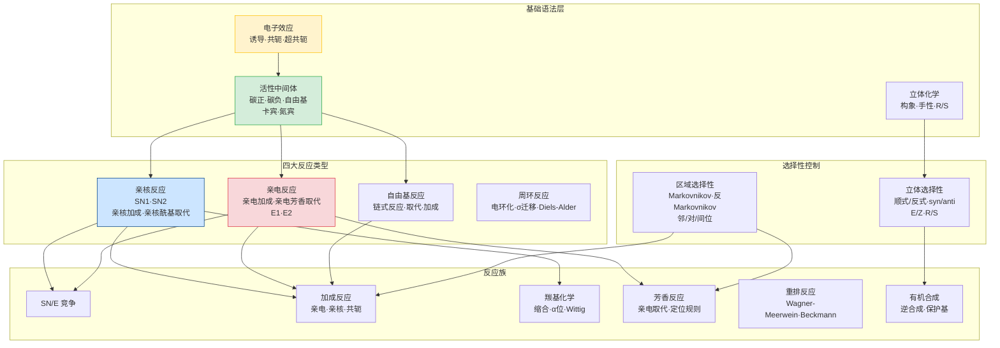

# 第三轮有机化学 · 章后复习课

> **定位**：第三轮有机化学大章节的收束课。12 个反应族全部完成后，目标是建立**"电子效应→中间体→选择性→反应族"的统一方法图谱**。
>
> **前置要求**：第三轮有机化学 12 节新课全部完成。
>
> **本课核心口号**：有机化学不是 12 个独立反应族的罗列，而是一套通用判断系统——**电子效应决定位点，中间体决定机理，条件决定选择性，选择性决定产物**。

---

## 一、学习目标

完成本节复习后，学生应能：

1. 用"电子效应→中间体→选择性→反应族"四步法分析任意有机反应
2. 在给出反应条件时快速判断可能的中间体和反应族
3. 区分 SN1/SN2/E1/E2 四种机理的条件和立体化学结果
4. 识别亲电/亲核/自由基/周环四大反应类型的判断入口
5. 识别并避开有机化学中最高频的 8 个陷阱

---

## 二、全章知识网络总图



**读图要点**：
- **黄色（电子效应）** 是全章的"语法层"——Inductive、Conjugation、Hyperconjugation 三条规则管所有反应位点
- **绿色（中间体）** 是"分叉口"——碳正→SN1/E1/亲电加成；碳负→SN2/亲核加成/缩合；自由基→链式反应
- **蓝色（亲核）和红色（亲电）** 是两大反应极性类型
- **选择性控制** 贯穿全图——区域选择性和立体选择性是产物预测的两大维度

---

## 三、电子效应速查卡

> 这是有机化学的"第一性原理"。所有后续判断都从这里出发。

### 3.1 三种电子效应

| 效应 | 定义 | 传方向 | 典型例子 |
|:---|:---|:---|:---|
| **诱导效应 (I)** | σ 键极化沿碳链传递 | 沿 σ 键逐碳递减 | -NO₂ 强吸电子；-CH₃ 供电子 |
| **共轭效应 (C)** | π 电子离域通过共轭体系传递 | 不随距离显著衰减 | -CHO, -COOH 吸电子共轭；-OH, -NH₂ 供电子共轭 |
| **超共轭效应 (H)** | C-H σ 与 π 轨道弱重叠 | 近邻效应 | 碳正离子稳定性：叔 > 仲 > 伯 |

### 3.2 电子效应对反应性的影响

| 情景 | 吸电子基 (-I, -C) 的效果 | 供电子基 (+I, +C) 的效果 |
|:---|:---|:---|
| **苯环亲电取代** | 钝化，指向间位 | 活化，指向邻/对位 |
| **烯烃亲电加成** | 降低反应活性 | 提高反应活性 |
| **羰基亲核加成** | 加速（羰基碳更缺电子） | 减速 |
| **碳正离子稳定性** | 不稳定化 | 稳定化 |
| **酸性** | 增强 | 减弱 |
| **碱性** | 减弱 | 增强 |

---

## 四、活性中间体——反应分叉口

> 看到一道有机题，第一步是判断"反应经过什么中间体"。

### 4.1 五大中间体速查

| 中间体 | 结构特征 | 稳定性排序 | 常见产生方式 | 典型反应 |
|:---|:---|:---|:---|:---|
| **碳正离子 (C⁺)** | sp² 平面，空 p 轨道 | 3° > 2° > 1° > CH₃⁺ | 质子化烯烃、SN1 离去 | SN1、E1、重排、亲电加成 |
| **碳负离子 (C⁻)** | sp³，孤对电子 | CH₃⁻ > 1° > 2° > 3° | 去质子化（强碱） | SN2、亲核加成、缩合 |
| **自由基 (C·)** | sp²，单电子 | 3° > 2° > 1° > CH₃· | 引发剂/光照 | 自由基取代、加成 |
| **卡宾 (:CR₂)** | sp² 或 sp，缺电子 | 单线态/三线态 | 重氮甲烷光解 | C-H 插入、环丙烷化 |
| **苯鎓离子** | 三元环桥接 | 稳定 | 亲电芳香取代中间体 | 取代定位 |

### 4.2 中间体稳定性→机理选择

```
底物能形成稳定碳正离子？
  ├─ 是 → SN1 / E1（看温度和碱强度）
  └─ 否 → SN2 / E2（看碱强度和位阻）

底物能形成稳定碳负离子？
  ├─ 是 → 亲核加成/缩合（看碳负离子亲核性）
  └─ 否 → 亲电反应主导
```

---

## 五、SN/E 竞争——有机化学最高频判断

> SN1/SN2/E1/E2 的条件判断是初赛和决赛的必考点。

### 5.1 四种机理条件速查表

| 条件 | SN2 | SN1 | E2 | E1 |
|:---|:---|:---|:---|:---|
| **底物** | 甲基 > 1° > 2°（3°不走SN2） | 3° > 2°（1°不走SN1） | 3° > 2° > 1° | 3° > 2° |
| **亲核碱** | 强亲核弱碱（I⁻, RS⁻, CN⁻） | 弱亲核弱碱（H₂O, ROH） | 强碱（EtO⁻, t-BuO⁻） | 弱碱（加热） |
| **溶剂** | 极性非质子（DMF, DMSO） | 极性质子（H₂O, ROH） | 极性质子或非质子 | 极性质子（加热） |
| **温度** | 室温 | 室温或加热 | 加热有利 | 加热有利 |
| **立体化学** | **构型翻转**（Walden翻转） | **外消旋化**（±混合物） | **反式共平面消除** | **无立体专一性** |
| **动力学** | 二级（rate = k[底物][亲核]） | 一级（rate = k[底物]） | 二级 | 一级 |

### 5.2 快速决策树

```
底物是 3°？
  ├─ 是 → 碱强？→ 强碱 → E2
  │              → 弱碱 → SN1 + E1（混合物，加热更偏E1）
  └─ 否（1°或2°）
       ├─ 亲核碱强？
       │    ├─ 强且体积小 → SN2
       │    └─ 强且体积大（t-BuO⁻）→ E2
       └─ 亲核碱弱？
            ├─ 极性质子溶剂 → SN1 + E1
            └─ 极性非质子溶剂 → SN2（慢）
```

---

## 六、加成反应——亲电/亲核/共轭总览

### 6.1 三种加成模式

| 类型 | 底物特征 | 试剂特征 | 区域选择性 | 立体选择性 |
|:---|:---|:---|:---|:---|
| **亲电加成** | 富电子烯烃 | 亲电试剂（HX, X₂, H₃O⁺） | Markovnikov | 反式加成（X₂） |
| **亲核加成** | 缺电子烯烃（α,β-不饱和羰基） | 亲核试剂（CN⁻, R⁻） | Michael加成 | 视底物 |
| **自由基加成** | 烯烃 | HBr + ROOR | 反 Markovnikov | — |

### 6.2 羰基亲核加成——活性排序

```
反应活性：HCHO > RCHO > R₂CO > ArCO > 酯 > 酰胺

电子效应解释：羰基碳上连的供电子基越多→碳越不缺电子→活性越低
位阻效应解释：羰基碳上连的基团越大→亲核试剂越难进攻
```

---

## 七、芳香反应——定位规则

### 7.1 定位规则速查

| 取代基类型 | 活化/钝化 | 定位 | 例子 |
|:---|:---|:---|:---|
| **强活化** (+C) | 强活化 | 邻/对位 | -NH₂, -NHR, -NR₂, -OH, -O⁻ |
| **弱活化** (+C > -I) | 弱活化 | 邻/对位 | -OR, -NHCOR, -R |
| **弱钝化** (-I > +C) | 弱钝化 | 邻/对位 | -X（卤素特殊：钝化但邻/对位） |
| **强钝化** (-I, -C) | 强钝化 | 间位 | -NO₂, -CN, -COOH, -CHO, -COR, -SO₃H |

### 7.2 双取代定位

当苯环上已有两个取代基时：
1. 活化基"赢"——更强的活化基决定新基团位置
2. 都是钝化基——更强的钝化基决定位置（间位）
3. 空间位阻考虑——1,2,4-三取代比 1,2,3-三取代更有利

---

## 八、高频陷阱 Top 8

### 陷阱 1：SN1 的外消旋化不是 50:50

**发生率**：~40%

**学生典型错误**：认为 SN1 一定得到 50% R + 50% S 的外消旋体

**正确理解**：SN1 产生的碳正离子虽然趋于平面，但离去基团可能在离去瞬间"挡住"一侧（离子对机理），导致亲核试剂从离去基团侧进攻的概率略低。结果通常是**部分翻转 + 部分保留**，不是严格外消旋。

---

### 陷阱 2：Markovnikov 规则的电子效应本质

**发生率**：~40%

**学生典型错误**：死记"H 加在含H多的碳上"

**正确理解**：Markovnikov 规则的本质是**中间体稳定性**。HX 加到不对称烯烃上，H⁺ 先加到能形成更稳定碳正离子的位置。对于 R-CH=CH₂，H⁺ 加到 CH₂ 上形成 2°碳正离子（更稳定），所以 X⁻ 加到中间碳上。

---

### 陷阱 3：Wittig 反应的立体化学

**发生率**：~35%

**学生典型错误**：认为 Wittig 反应总得到 E-烯烃

**正确理解**：非稳定化的磷叶立德（R = 烷基）→ 主要产物是 **Z-烯烃**（顺式）；稳定化的磷叶立德（R = 酯基、氰基等吸电子基）→ 主要产物是 **E-烯烃**（反式）。

---

### 陷阱 4：醛酮与格氏试剂反应后水解

**发生率**：~30%

**学生典型错误**：忘记水解步骤，直接写产物为醇盐

**正确理解**：格氏试剂 RMgX 加到 C=O 上先生成醇盐 R'-OMgX，必须酸性水解才能得到醇 R'-OH。

---

### 陷阱 5：Diels-Alder 反应的立体化学规则

**发生率**：~30%

**学生典型错误**：忽略 endo/exo 选择性

**正确理解**：内型（endo）产物通常为主产物（Alder 规则）——因为过渡态中次级轨道重叠降低活化能。但热力学控制时exo可能更稳定。

---

### 陷阱 6：自由基取代的选择性

**发生率**：~25%

**学生典型错误**：认为 Cl₂ 和 Br₂ 对烷烃的取代选择性相同

**正确理解**：Cl₂ 反应活性高→选择性差（主要取代 H 多的碳，但比例差异不大）；Br₂ 反应活性低→选择性高（强烈偏好取代 3°H）。HBr/ROOR 的反 Markovnikov 加成也是自由基机理。

---

### 陷阱 7：Beckmann 重排的迁移基团

**发生率**：~25%

**学生典型错误**：认为迁移基团是任意的

**正确理解**：Beckmann 重排中迁移的基团是**与离去基团（-OH 被活化后离去）处于反式的基团**。立体化学决定了哪个基团迁移。

---

### 陷阱 8：酯缩合（Claisen）的产物是 β-酮酯

**发生率**：~25%

**学生典型错误**：把 Claisen 缩合产物写成醇

**正确理解**：Claisen 缩合 = 酯的 α-碳负离子进攻另一分子酯的羰基碳，脱去醇，生成 β-酮酯。与 Aldol 缩合（产物是 β-羟基醛/酮）不同。

---

## 九、综合判断练习（课堂用）

### 练习 1：中间体判断→机理选择

> 对以下每个反应，判断经过什么中间体，选择什么机理（SN1/SN2/E1/E2），预测主要产物。

(a) (CH₃)₃CBr + NaOEt/EtOH → ?

(b) CH₃CH₂CH₂Br + NaCN/DMF → ?

(c) (R)-2-Bromobutane + t-BuOK/t-BuOH → ?

(d) Triphenylmethyl chloride + H₂O → ?

---

### 练习 2：合成路线设计

> 以苯和不超过 2 个碳的有机试剂为原料，合成以下化合物：

(a) 1-phenylethanol（1-苯基乙醇）

(b) p-nitroacetophenone（对硝基苯乙酮）

(c) Cyclohexanone from benzene（环己酮，从苯出发）

---

### 练习 3：机理书写

> 写出以下反应的完整机理（箭头推动），标注每一步的中间体类型。

(a) 2-Methylpropene + HBr → tert-butyl bromide

(b) Benzaldehyde + Acetone → Benzalacetone (NaOH catalyzed Aldol condensation)

---

## 十、本章与后续章节的接口

| 后续章节 | 从本章继承什么 | 会升级什么 |
|:---|:---|:---|
| **第三轮结构深化** | 化学键、轨道、杂化 | 从"用Lewis结构描述"升级到"用MO理论解释" |
| **第四轮冲刺** | 全部反应族和机理 | 压缩成"30分钟判断所有有机题型"的快速框架 |
| **第五轮决赛** | 有机合成策略 | 加入更多金属有机催化、不对称合成 |

---

## 十一、教师使用建议

### 课时安排

| 方案 | 时长 | 内容 |
|:---|:---|:---|
| **完整 3 课时** | 135 min | §二~§七（80min）+ §八陷阱+§九练习（55min） |
| **拆成 2×45min** | 90 min | 第 1 节：§二~§五（网络+电子效应+中间体+SN/E）；第 2 节：§六~§九（加成+芳香+陷阱+练习） |

---

*本文件是六大新课大章节体系的第五份章后复习课。品质标准：反应族网络总图（Mermaid）+ 电子效应速查 + 中间体分叉决策 + SN/E 条件对比 + 加成/芳香/羰基三线 + 高频陷阱（≥5 个）+ 综合练习 + 后续接口。*
