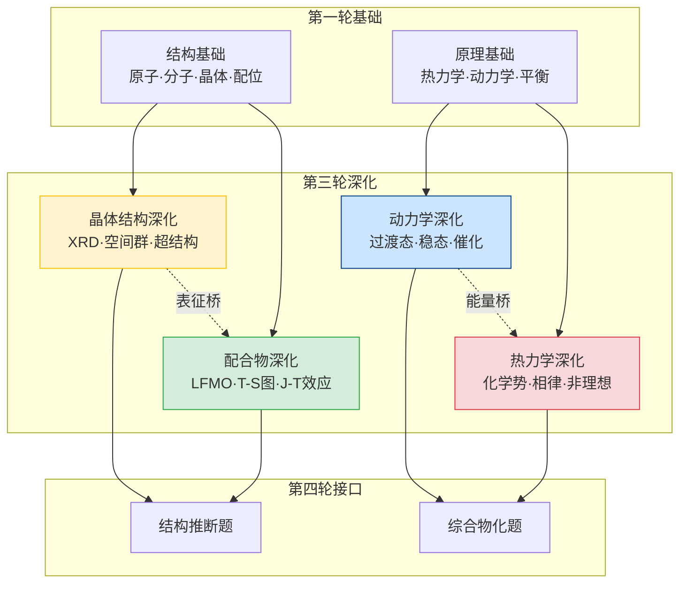

# 第三轮结构化学与物理化学深化 · 章后复习课

> **定位**：第三轮深化章节的收束课。目标是建立**"表征 + 模型"的统一高阶框架**。
>
> **前置要求**：第三轮结构化学与物理化学深化 4 节新课全部完成。
>
> **本课核心口号**：深化不是"第一轮的加难版"，而是**从"会算"升级到"会解释"**——用更深的模型解释晶体、配位、动力学和热力学中的复杂现象。

---

## 一、学习目标

1. 用 XRD 数据推断晶体结构（晶系、晶胞参数、密度）
2. 用配位场理论解释配合物的颜色、磁性和稳定性
3. 在复杂动力学体系中正确判断级数、机理和活化参数
4. 用热力学深化模型（化学势、相律、非理想体系）解释复杂平衡
5. 识别并避开深化内容中最高频的 6 个陷阱

---

## 二、全章知识网络总图



---

## 三、晶体结构深化——从基础到推断

### 3.1 XRD 核心公式

$$n\lambda = 2d\sin\theta \quad \text{(Bragg 方程)}$$

$$d_{hkl} = \frac{a}{\sqrt{h^2 + k^2 + l^2}} \quad \text{(立方晶系)}$$

### 3.2 晶体密度公式

$$\rho = \frac{Z \cdot M}{N_A \cdot V}$$

其中 Z = 每个晶胞中的"分子"数（formula units），M = 摩尔质量，V = 晶胞体积。

### 3.3 七大晶系判据

| 晶系 | 轴长关系 | 轴角关系 | 特征 |
|:---|:---|:---|:---|
| 立方 | a=b=c | α=β=γ=90° | 最高对称 |
| 四方 | a=b≠c | α=β=γ=90° | 一个轴特殊 |
| 正交 | a≠b≠c | α=β=γ=90° | 三轴不等 |
| 六方 | a=b≠c | α=β=90°, γ=120° | 六重轴 |
| 三方 | a=b=c | α=β=γ≠90° | 菱形 |
| 单斜 | a≠b≠c | α=γ=90°, β≠90° | 一个角不正 |
| 三斜 | a≠b≠c | α≠β≠γ≠90° | 最低对称 |

### 3.4 Pauling 规则（离子晶体）

| 规则 | 内容 | 应用 |
|:---|:---|:---|
| **规则一** | 配位多面体中正负离子间距 = 半径之和 | 判断晶体结构类型 |
| **规则二** | 电价规则：Σ(电价/配位数) ≈ 常数 | 验证结构合理性 |
| **规则三** | 共用棱/面不稳定 | 解释硅酸盐结构 |
| **规则四** | 不同阳离子多面体不共用棱 | 解释高氧化态倾向 |

---

## 四、配合物深化——从 CFT 到 LFMO

### 4.1 晶体场分裂能 Δ 与光谱化学序列

```
I⁻ < Br⁻ < Cl⁻ < F⁻ < OH⁻ < H₂O < NH₃ < en < NO₂⁻ < CN⁻ < CO
←———————— 弱场（高自旋）         强场（低自旋） ————————→
```

### 4.2 CFSE 计算

| 构型 | 高自旋 CFSE | 低自旋 CFSE |
|:---|:---|:---|
| d³ | -1.2Δ | -1.2Δ（与场强无关） |
| d⁴ | -0.6Δ | -1.6Δ + P |
| d⁵ | 0 | -2.0Δ + 2P |
| d⁶ | -0.4Δ | -2.4Δ + 2P |
| d⁸ | -1.2Δ | -1.2Δ（与场强无关） |

### 4.3 Tanabe-Sugano 图的使用方法

1. 找到对应 d 电子数的图
2. 横轴是 Δ/B（配体场强/电子排斥参数比）
3. 纵轴是 E/B（激发能/电子排斥参数比）
4. 从光谱吸收峰位置确定 Δ/B 值
5. 从 Δ/B 值判断高/低自旋

### 4.4 Jahn-Teller 效应

**核心**：非全满/半满的简并电子态→几何畸变→消除简并→降低能量

| 情况 | J-T 效应 | 表现 |
|:---|:---|:---|
| d⁹ (Cu²⁺) | 强烈 | [Cu(H₂O)₆]²⁺ 拉长为 4+2 |
| d⁴ 高自旋 (Cr²⁺) | 中等 | 四方畸变 |
| d³ (Cr³⁺) | 无 | t₂g³ 半满，无简并 |
| d⁸ (Ni²⁺) | 无/弱 | 八面体稳定 |

---

## 五、动力学深化——从速率方程到反应机理

### 5.1 过渡态理论

$$k = \frac{k_BT}{h} \cdot e^{-\Delta G^\ddagger / RT} = \frac{k_BT}{h} \cdot e^{\Delta S^\ddagger / R} \cdot e^{-\Delta H^\ddagger / RT}$$

| 参数 | 物理含义 | 温度依赖 |
|:---|:---|:---|
| ΔG‡ | 活化自由能 | 决定速率常数 k |
| ΔH‡ | 活化焓 | Eₐ = ΔH‡ + RT |
| ΔS‡ | 活化熵 | 负→有序过渡态（如SN2）；正→松散过渡态（如SN1） |

### 5.2 稳态近似 vs 平衡近似

| 方法 | 条件 | 适用场景 |
|:---|:---|:---|
| **平衡近似** | 快平衡 + 慢后续步骤 | 预平衡机理 |
| **稳态近似** | 中间体浓度始终很低 | 链式反应、自由基机理 |

### 5.3 催化机理

| 催化类型 | 机理 | 速率影响 |
|:---|:---|:---|
| **均相催化** | 催化剂与反应物同相，形成中间络合物 | 改变反应路径，降低 Ea |
| **多相催化** | 表面吸附→反应→脱附 | Langmuir-Hinshelwood 机理 |
| **酶催化** | Michaelis-Menten 机理 | v = Vmax·[S]/(Km + [S]) |

---

## 六、热力学深化——从基础判断到复杂体系

### 6.1 化学势与相平衡

$$\mu_i = \mu_i^\circ + RT\ln a_i$$

| 条件 | 含义 |
|:---|:---|
| Σ νᵢμᵢ < 0 | 反应正向自发 |
| Σ νᵢμᵢ = 0 | 平衡条件 |
| 纯物质：μ = μ° | 活度 a = 1 |

### 6.2 Gibbs 相律

$$F = C - P + 2$$

| 符号 | 含义 |
|:---|:---|
| F | 自由度（独立变量数） |
| C | 独立组分数 |
| P | 相数 |

**应用实例**：

| 体系 | C | P | F | 含义 |
|:---|:---:|:---:|:---:|:---|
| 纯水 | 1 | 1 | 2 | T 和 p 都可变 |
| 水-冰平衡 | 1 | 2 | 1 | T 确定则 p 确定（反之亦然） |
| 水-冰-汽三相点 | 1 | 3 | 0 | 不变量——T 和 p 都固定 |
| 盐水 | 2 | 1 | 3 | T、p、浓度都可变 |
| 盐水-冰平衡 | 2 | 2 | 2 | 两个独立变量 |

### 6.3 非理想体系——活度系数

$$a = \gamma \cdot (c/c^\circ)$$

| 情况 | γ 的值 | 原因 |
|:---|:---|:---|
| 理想稀溶液 | γ → 1 | 粒子间无相互作用 |
| 高离子强度 | γ < 1 | 离子氛屏蔽效应（Debye-Hückel） |
| 高浓度 | γ > 1 | 溶剂化效应占主导 |

---

## 七、高频陷阱 Top 6

### 陷阱 1：CFSE 不是配合物稳定性的唯一因素

**发生率**：~40%

**学生典型错误**：认为 CFSE 越大→配合物越稳定→所有低自旋配合物都比高自旋稳定

**正确理解**：稳定性还取决于电荷、半径、配体场强、空间效应等。例如 [Fe(H₂O)₆]²⁺ 高自旋但实际很稳定（因为 Fe²⁺ 电荷低、配体场弱）。

---

### 陷阱 2：Jahn-Teller 效应只影响几何不影响光谱

**发生率**：~35%

**学生典型错误**：只记得 J-T 效应导致几何畸变，忽略其对光谱的影响

**正确理解**：J-T 效应消除了简并→分裂了能级→改变了 d-d 跃迁能量→导致吸收峰分裂或加宽。Cu²⁺ 配合物的宽吸收峰就是 J-T 效应的结果。

---

### 陷阱 3：ΔS‡ 为负不一定慢

**发生率**：~30%

**学生典型错误**：看到 ΔS‡ < 0 就断言反应很慢

**正确理解**：速率由 ΔG‡ = ΔH‡ - TΔS‡ 共同决定。如果 ΔH‡ 很小（正熵变不利被焓变补偿），反应仍然可能很快。

---

### 陷阱 4：相律中组分数的计算

**发生率**：~30%

**学生典型错误**：NaCl 水溶液中 C = 3（NaCl + H₂O → 3种物质）

**正确理解**：独立组分数 C = 物种数 - 独立化学反应数 - 独立浓度限制条件数。NaCl 溶液中 C = 2（NaCl 和 H₂O）。但如果考虑 NaCl = Na⁺ + Cl⁻ 解离，C 仍然是 2（因为解离平衡不改变独立组分数——解离产物浓度受 NaCl 总量约束）。

---

### 陷阱 5：Bragg 方程中的 n 是整数但不是衍射级数的唯一含义

**发生率**：~25%

**学生典型错误**：认为 nλ = 2dsinθ 中 n 必须是整数

**正确理解**：n 可以被吸收到 d 中（即 dₙₖₗ = d₁ₙₖₗ/n），所以常写为 λ = 2dₙₖₗ sinθ。n 的物理含义是"第 n 级衍射"。

---

### 陷阱 6：Michaelis-Menten 方程的 Km 不等于 Kd

**发生率**：~25%

**学生典型错误**：认为 Km = 解离常数

**正确理解**：Km = (k₋₁ + k₂)/k₁。只有当 k₂ << k₋₁（催化步骤远慢于解离步骤）时，Km ≈ Kd = k₋₁/k₁。对于高效酶（k₂ 大），Km > Kd。

---

## 八、综合判断练习（课堂用）

### 练习 1：XRD 推断

> 某立方晶系化合物的 XRD 数据显示：2θ = 27.3° 处有一强峰（Cu Kα, λ = 0.154 nm）。
>
> (a) 计算该峰对应的 d 值和晶面间距。
>
> (b) 如果已知该化合物是 CsCl 型结构（Z = 1），计算晶胞参数 a。
>
> (c) 已知 CsCl 的摩尔质量为 168.4 g/mol，计算密度。
>
> (d) 如果实验测得密度为 3.97 g/cm³，是否与计算值一致？

---

### 练习 2：配合物光谱分析

> [Ti(H₂O)₆]³⁺ 在 493 nm 处有一个吸收峰（d¹ 构型）。
>
> (a) 计算 Δ（单位用 cm⁻¹ 和 kJ/mol）。
>
> (b) 画出 d¹ 构型在八面体场中的能级分裂图。
>
> (c) 如果将配体换成 CN⁻，预测吸收峰波长如何变化？为什么？

---

### 练习 3：动力学机理推导

> 某反应 A → P 的实验数据如下：

| [A]₀ (mol/L) | 0.100 | 0.200 | 0.300 |
|:---|:---:|:---:|:---:|
| t₁/₂ (s) | 500 | 250 | 167 |

> (a) 判断反应级数。
>
> (b) 计算速率常数 k。
>
> (c) 已知 300K 时 k = 0.00139 s⁻¹，350K 时 k = 0.00556 s⁻¹，计算活化能 Ea。

---

## 九、本章与后续章节的接口

| 后续章节 | 从本章继承什么 | 会升级什么 |
|:---|:---|:---|
| **第四轮冲刺** | XRD推断、配位光谱、动力学判级、热力学综合 | 压缩成"竞赛真题高频模型速查" |

---

*本文件是六大新课大章节体系的第六份章后复习课。*
