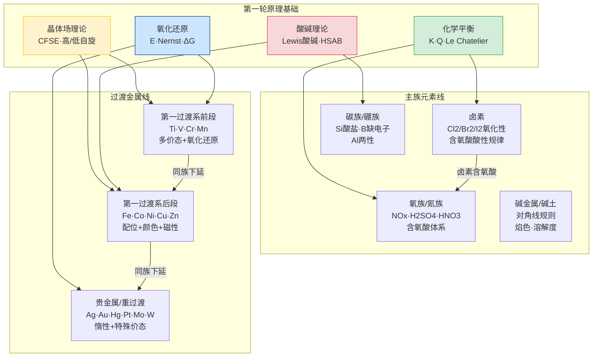

# 第二轮元素化学 · 章后复习课

> **定位**：第二轮元素化学大章节的收束课。不重讲新内容，只做三件事——**建网络、练推断、接后续**。
>
> **前置要求**：第二轮元素化学 8 节新课全部完成。
>
> **本课核心口号**：元素化学不是背性质清单，而是一套**「结构决定价态，价态产生信号，信号引导推断」**的判断系统。主族看族特征和周期趋势，过渡看价态、颜色和配位信号。

---

## 一、学习目标

完成本节复习后，学生应能：

1. 画出主族元素和过渡金属的"结构-价态-信号-反应"总图，说出每个元素族的核心判断入口
2. 用"第一轮原理 + 元素事实"的双层框架解决陌生情境推断题
3. 快速识别元素推断题中的关键信号（颜色、沉淀、气体、磁性、价态变化）
4. 在综合推断题中正确使用"先看信号→再推元素→再写反应"的做题顺序
5. 识别并避开元素化学中最高频的 8 个陷阱

---

## 二、全章知识网络总图

> 这张图展示的不是每个元素的性质罗列，而是**主族和过渡金属各自的判断入口和它们共享的原理基础**。



**读图要点**：
- **黄色（晶体场）** 是过渡金属颜色、磁性和稳定性的语言
- **绿色（平衡）** 控制含氧酸强度、溶解度和沉淀方向
- **蓝色（氧化还原）** 是变价元素（过渡金属、卤素、氮硫）的核心判断工具
- **红色（酸碱）** 连接硼族两性、配位化学和 HSAB 原理

---

## 三、主族元素：族特征速查总表

> 主族元素的复习核心是**"一族一条线"**——抓住每个族的标志性行为，而不是逐个元素背诵。

### 3.1 主族核心判断入口

| 族 | 核心特征 | 最高频考点 | 与第一轮原理的接口 |
|:---|:---|:---|:---|
| **IA/IIA** | 活泼金属，焰色反应，对角线规则 | Li~Mg 对角线相似性；溶解度递变 | 氧化还原（E°很负）、沉淀（碱金属盐溶解度大） |
| **IIIA (B/Al)** | B缺电子→Lewis酸；Al两性 | 硼酸聚合、Al(OH)₃两性、铝热反应 | Lewis酸碱理论、配合物（AlF₆³⁻冰晶石） |
| **IVA (C/Si)** | C=有机骨架；Si=硅酸盐骨架 | CO₂/CO/SiO₂对比、硅酸盐缩聚 | 化学平衡（碳酸平衡）、共价键与MO |
| **VA (N/P)** | N多变价（-3→+5）；P含氧酸体系 | HNO₃氧化性、H₃PO₄三步电离、NH₃配位 | 氧化还原、酸碱平衡（多步电离） |
| **VIA (O/S)** | S多变价（-2→+6）；H₂O₂特殊 | H₂SO₄浓/稀差异、S的含氧酸、H₂O₂分解 | 氧化还原、催化（MnO₂催化H₂O₂） |
| **VIIA (F/Cl/Br/I)** | 卤素氧化性递变，含氧酸酸性递变 | Cl₂的歧化、卤素含氧酸酸性/HIO₃、拟卤素 | 氧化还原（E°递变）、平衡（歧化条件） |

### 3.2 含氧酸强度规律——跨族通用工具

| 规律 | 表达 | 适用范围 |
|:---|:---|:---|
| **同族同价态**：中心原子电负性越大，含氧酸越强 | HClO₄ > HBrO₄ > HIO₄ | 含氧酸酸性比较 |
| **同元素不同价态**：氧化态越高，含氧酸越强 | HClO₄ > HClO₃ > HClO₂ > HClO | 同一元素的含氧酸系列 |
| **Pauling规则**：(HO)ₘXOₙ 中 n 越大酸性越强 | n=0 弱酸；n=1 中强；n=2 强酸；n=3 超强酸 | 定性判断含氧酸强度 |

> **一句话**：判断含氧酸强度，先写结构式，数非羟基氧原子数 n，n 越大越强。

---

## 四、过渡金属：价态-颜色-配位-磁性总图

> 过渡金属的复习核心是**"一张表看清第一过渡系"**。

### 4.1 第一过渡系氧化态总览

| 元素 | 常见氧化态 | 最稳定态 | 标志性颜色 | 核心判断入口 |
|:---|:---|:---|:---|:---|
| **Ti** | +3, +4 | +4 (TiO₂白色) | +3 紫色，+4 无色 | TiO₂光催化、TiCl₄水解 |
| **V** | +2→+5 | +5 (VO₄³⁻) | +2 紫，+3 绿，+4 蓝，+5 黄 | 多价态氧化还原 |
| **Cr** | +2→+6 | +3 (Cr³⁺绿色) +6 (Cr₂O₇²⁻橙) | +3 绿/紫，+6 橙/黄 | Cr₂O₇²⁻/CrO₄²⁻平衡（pH控制） |
| **Mn** | +2→+7 | +2 (Mn²⁺无色) +7 (MnO₄⁻紫) | +2 极淡粉，+4 棕黑(MnO₂)，+7 紫 | MnO₄⁻氧化性（酸碱介质不同产物） |
| **Fe** | +2, +3 | +3 (Fe³⁺黄色) | +2 浅绿，+3 黄/棕 | Fe²⁺/Fe³⁺转化、KSCN显色、铁氰化物 |
| **Co** | +2, +3 | +2 (Co²⁺粉色) | +2 粉红，+3 蓝(配位) | Co²⁺/Co³⁺与配体场强的关系 |
| **Ni** | +2, +3 | +2 (Ni²⁺绿色) | +2 绿色，+3 黑(NiOOH) | DMG显色反应（鲜红沉淀） |
| **Cu** | +1, +2 | +2 (Cu²⁺蓝色) | +1 无色，+2 蓝/绿 | Cu²⁺/Cu⁺歧化、Cu(OH)₂→CuO |
| **Zn** | +2 | +2 (Zn²⁺无色) | 无色（d¹⁰无d-d跃迁） | 两性（Zn(OH)₂溶于酸碱）、d¹⁰无色原因 |

### 4.2 颜色判据：d-d 跃迁速查

| 判断条件 | 结果 | 原因 |
|:---|:---|:---|
| d⁰ 或 d¹⁰ 构型 | **无色** | 无d电子或d轨道全满，无d-d跃迁 |
| d¹-d⁹ 构型，有配体场 | **有色** | d轨道分裂→d-d跃迁→吸收可见光 |
| 同一金属，强场配体 | 颜色偏移（短波长方向） | Δ增大→跃迁能量增大→吸收波长蓝移 |
| 电荷转移跃迁 | **深色**（如MnO₄⁻紫色） | 不是d-d跃迁，而是LMCT/MLCT，摩尔吸光系数大 |

### 4.3 磁性判断

| 类型 | 条件 | 计算 |
|:---|:---|:---|
| **顺磁性** | 有未成对电子 | μ = √(n(n+2)) BM，n=未成对电子数 |
| **抗磁性** | 无未成对电子 | 所有电子配对 |
| **高自旋** | 弱场配体，Δ < P | 电子尽量分占轨道 |
| **低自旋** | 强场配体，Δ > P | 电子优先配对 |

> **口诀**：第一过渡系高/低自旋——F⁻/H₂O 是弱场（高自旋），CN⁻/CO 是强场（低自旋），NH₃ 居中看金属。

---

## 五、元素推断题：信号→元素→反应 做题框架

> 元素推断是第二轮的核心题型。这节不是教新知识，而是把做题顺序标准化。

### 5.1 六大核心信号

| 信号类型 | 典型描述 | 可能指向 |
|:---|:---|:---|
| **颜色** | "溶液呈蓝色""红棕色气体""黑色固体" | Cu²⁺蓝、Fe³⁺黄棕、NO₂红棕、CuO/MnO₂黑色 |
| **沉淀** | "白色沉淀不溶于酸""溶于NaOH的白色沉淀" | BaSO₄/PbSO₄不溶酸；Al(OH)₃/Zn(OH)₂溶碱 |
| **气体** | "刺激性气体""使石灰水变浑浊""无色无味" | NH₃/HCl/SO₂刺激；CO₂浑浊；O₂/N₂无味 |
| **磁性** | "能被磁铁吸引""顺磁/抗磁" | Fe₃O₄磁性；Co²⁺/Fe²⁺/Cu²⁺顺磁 |
| **价态变化** | "加酸后颜色从黄色变绿色" | Fe³⁺→Fe²⁺（被还原） |
| **特征反应** | "与丁二酮肟生成鲜红沉淀""焰色为黄色" | Ni²⁺(DMG)、Na⁺(黄色焰色) |

### 5.2 标准做题顺序

```
第1步：读题 → 标记所有"信号词"（颜色/沉淀/气体/磁性/反应现象）
第2步：信号 → 候选元素（用上面的信号表缩小范围）
第3步：用"条件约束"排除（酸碱性、溶解性、氧化还原环境）
第4步：确定元素 → 写反应方程式
第5步：验证（把答案代回所有条件，确认全部满足）
```

### 5.3 综合信号速查矩阵

> 把最常考的"现象-元素"对应关系压成一张表：

| 现象 | 最可能元素 | 次可能 | 排除依据 |
|:---|:---|:---|:---|
| 蓝色溶液 | Cu²⁺ | — | 几乎唯一 |
| 黄/棕色溶液 | Fe³⁺ | CrO₄²⁻(黄) | Fe³⁺最常见 |
| 绿色溶液 | Cr³⁺、Fe²⁺、Ni²⁺、CuCl₄²⁻ | — | 需其他信息辅助 |
| 紫色溶液 | MnO₄⁻、I₂(aq) | Cr₂O₇²⁻(橙) | 看浓度和pH |
| 无色溶液+加碱白色沉淀 | Mg²⁺、Al³⁺、Zn²⁺ | Ca²⁺(微溶) | 看沉淀是否溶于过量碱 |
| 黑色固体 | CuO、MnO₂、FeS、Fe₃O₄、NiO | C(石墨) | 看与酸反应情况 |
| 红棕色气体 | NO₂ | Br₂蒸气 | 看溶于水后是否生成HNO₃ |
| 无色气体+使石灰水浑浊 | CO₂ | SO₂ | SO₂也有刺激性气味 |
| 加KSCN变血红色 | Fe³⁺ | — | 几乎唯一 |
| 加丁二酮肟鲜红沉淀 | Ni²⁺ | — | 几乎唯一 |
| 焰色黄色 | Na⁺ | — | 钾需透过蓝色钴玻璃 |

---

## 六、第一轮原理在元素化学中的回用

> 第二轮元素化学不是"第一轮的重复"，而是**把第一轮的工具拿到具体元素体系中使用**。

### 6.1 原理回用总表

| 第一轮原理 | 在元素化学中的典型应用 | 关键判断 |
|:---|:---|:---|
| **氧化还原 E°** | 判断卤素氧化性递变、MnO₄⁻在不同介质中的还原产物 | E° 大→氧化性强；酸性介质MnO₄⁻→Mn²⁺，碱性→MnO₄²⁻ |
| **化学平衡 K** | Cr₂O₇²⁻/CrO₄²⁻的pH依赖平衡、含氧酸强度比较 | 加酸→Cr₂O₇²⁻(橙)；加碱→CrO₄²⁻(黄) |
| **酸碱 Lewis** | Al(OH)₃两性、B的Lewis酸性、配位化学 | Al(OH)₃ + OH⁻ → Al(OH)₄⁻（酸性方向） |
| **晶体场 CFSE** | 过渡金属颜色、磁性、配合物稳定性 | CFSE越大→配合物越稳定→颜色由Δ决定 |
| **沉淀 Ksp** | 定性分析中的分步沉淀、离子分离 | Ksp小者先沉淀；利用pH控制沉淀选择性 |
| **Nernst 方程** | 浓差电池、pH对氧化还原电势的影响 | E = E° - (0.0592/n)lgQ，Q与浓度直接相关 |

### 6.2 最重要的跨模块桥梁

```
元素推断的完整链条：

结构（电子排布/价态）
    ↓
氧化还原性质（E°/Nernst）
    ↓
可见信号（颜色/沉淀/气体）
    ↓
化学方程式书写
    ↓
平衡常数判断（K/Q/Ksp）
```

> **一句话**：每一道元素推断题，底层都在走这条链。看到信号→回溯到价态和结构→写出方程式→用平衡验证。

---

## 七、高频陷阱 Top 8

### 陷阱 1：Cr₂O₇²⁻ 的颜色取决于 pH，不是浓度

**发生率**：~45%

**学生典型错误**：看到橙色就写 Cr₂O₇²⁻，看到黄色就写 CrO₄²⁻，不管 pH

**正确理解**：橙色 Cr₂O₇²⁻ 和黄色 CrO₄²⁻ 之间的转化由 pH 控制：
$$\ce{Cr2O7^2- + H2O <=> 2CrO4^2- + 2H+}$$
酸性→左移（橙）；碱性→右移（黄）

**防御口诀**：「酸橙碱黄——Cr的变色看pH不看浓度」

---

### 陷阱 2：MnO₄⁻ 的还原产物取决于介质

**发生率**：~40%

**学生典型错误**：一律写 MnO₄⁻ → Mn²⁺

**正确理解**：

| 介质 | 还原产物 | 电子转移数 |
|:---|:---|:---:|
| 强酸性 | Mn²⁺（无色/极淡粉） | 5e⁻ |
| 中性/弱碱性 | MnO₂（棕黑色沉淀） | 3e⁻ |
| 强碱性 | MnO₄²⁻（绿色） | 1e⁻ |

**防御口诀**：「酸到+2，碱到+6，中性沉淀MnO₂」

---

### 陷阱 3：Fe²⁺ 和 Fe³⁺ 的鉴别不是加 NaOH

**发生率**：~35%

**学生典型错误**：加 NaOH 看沉淀颜色来区分 Fe²⁺ 和 Fe³⁺

**正确分析**：Fe(OH)₂ 白色→迅速变灰绿→最终变棕红（Fe(OH)₃），Fe(OH)₃ 直接红棕色。实际操作中 Fe(OH)₂ 的颜色转变太快，不推荐作为鉴别方法。更可靠的方法是 KSCN（Fe³⁺变血红色）或 K₃[Fe(CN)₆]（Fe²⁺→蓝色沉淀滕氏蓝）。

**防御口诀**：「鉴别铁离子用KSCN，鉴别亚铁用铁氰化钾」

---

### 陷阱 4：浓 H₂SO₄ 和稀 H₂SO₄ 是两种试剂

**发生率**：~35%

**学生典型错误**：把浓 H₂SO₄ 当一般强酸使用

**正确理解**：浓 H₂SO₄ 本质是强氧化剂（S从+6被还原），稀 H₂SO₄ 是一般强酸（H⁺参与反应）。

| 性质 | 浓 H₂SO₄ | 稀 H₂SO₄ |
|:---|:---|:---|
| 氧化性 | ✅ 强（热浓可氧化Cu、C、Ag） | ❌ 几乎无 |
| 与Cu反应 | 加热可反应：Cu + 2H₂SO₄(浓) → CuSO₄ + SO₂↑ + 2H₂O | 不反应 |
| 与活泼金属 | 常温钝化（Fe、Al表面生成致密氧化膜） | 正常置换反应 |

**防御口诀**：「浓硫酸是氧化剂，稀硫酸是酸。两句话不能混用」

---

### 陷阱 5：Al(OH)₃ 的两性——只溶于强碱不溶于弱碱

**发生率**：~30%

**学生典型错误**：Al³⁺ + NH₃·H₂O → Al(OH)₃↓，然后说"加过量氨水沉淀溶解"

**正确理解**：Al(OH)₃ 溶于 NaOH（强碱）但**不溶于** NH₃·H₂O（弱碱）。这是因为 Al(OH)₃ 的酸性很弱，需要 OH⁻ 浓度足够大才能形成 Al(OH)₄⁻。

**防御口诀**：「铝的氢氧化物只吃强碱不吃弱碱」

---

### 陷阱 6：过渡金属配合物颜色与配体场强有关

**发生率**：~30%

**学生典型错误**：认为 [Cu(H₂O)₆]²⁺ 和 [Cu(NH₃)₄]²⁺ 颜色相同

**正确理解**：NH₃ 的场强大于 H₂O，导致 Δ 增大→吸收波长蓝移→透射光颜色变化。[Cu(H₂O)₆]²⁺ 浅蓝色 → [Cu(NH₃)₄]²⁺ 深蓝色（铜氨配合物）。

---

### 陷阱 7：Na₂O₂ 既是氧化剂又是还原剂

**发生率**：~25%

**学生典型错误**：Na₂O₂ + H₂O → NaOH + O₂↑，认为 O₂ 来自 H₂O 的分解

**正确理解**：Na₂O₂ 中 O 为 -1 价，反应中 O 发生歧化：-1 → 0（O₂）+ -2（NaOH）。Na₂O₂ 自身既是氧化剂又是还原剂。

---

### 陷阱 8：卤素含氧酸的酸性与氧化性不完全对应

**发生率**：~25%

**学生典型错误**：认为 HClO₄ 酸性最强所以氧化性最强

**正确理解**：含氧酸强度看结构（非羟基氧数），氧化性看中心原子实际被还原的难易。HClO₄ 虽然是最强酸，但氧化性不如 HClO（次氯酸）——因为 Cl 在 +7 态被还原需要更多能量，而 +1 态的 HClO 更容易被还原。

| 卤素含氧酸 | 酸性 | 氧化性 |
|:---|:---|:---|
| HClO₄ | 最强 | 弱（常温） |
| HClO₃ | 强 | 中 |
| HClO₂ | 中强 | 较强 |
| HClO | 弱 | 最强 |

**防御口诀**：「酸性和氧化性是两回事。最强酸≠最强氧化剂」

---

## 八、综合判断练习（课堂用）

### 练习 1：信号→元素→方程式

> 一种金属 M 的氧化物为黑色粉末。将该粉末溶于稀盐酸，得到浅绿色溶液。向浅绿色溶液中加入 KSCN 溶液，无明显变化。再向溶液中加入 H₂O₂ 后，溶液变为血红色。

**(a)** 推断金属 M 是什么？写出相关反应方程式。

**(b)** 写出该金属 +2 价和 +3 价离子的电子排布，解释为什么 +2 价在水溶液中呈浅绿色。

**(c)** 如果将黑色氧化物溶于稀硫酸（而非盐酸），现象会有何不同？为什么？

**考查要点**：信号识别（黑色氧化物→Fe₃O₄或CuO等→浅绿色→Fe²⁺）；KSCN鉴别；H₂O₂氧化Fe²⁺→Fe³⁺

---

### 练习 2：跨族对比

> 比较以下三组物质的酸碱性，并用 Pauling 规则或元素周期律解释：
>
> (a) HClO₄ vs H₂SO₄ vs H₃PO₄
>
> (b) Al(OH)₃ vs Ga(OH)₃ vs In(OH)₃
>
> (c) HF vs HCl vs HBr vs HI

**考查要点**：含氧酸 Pauling 规则；IIIA族氢氧化物酸碱性递变（金属性增强→碱性增强）；氢卤酸强度（键能递减→酸性递增，与含氧酸相反）

---

### 练习 3：过渡金属综合

> 向含 Cr₂O₇²⁻ 的酸性溶液中依次进行以下操作：
>
> ① 加入 NaOH 溶液至碱性
> ② 再加入 BaCl₂ 溶液
> ③ 过滤后向沉淀中加入稀盐酸

**(a)** 每一步写出发生的反应和可观察现象。

**(b)** 如果第①步改为加入过量氨水而不是 NaOH，会有什么不同？为什么？

**(c)** 用平衡移动原理解释 Cr₂O₇²⁻/CrO₄²⁻ 的 pH 依赖性。

**考查要点**：CrO₄²⁻/Cr₂O₇²⁻平衡；BaCrO₄黄色沉淀；酸碱对平衡的影响；氨水与NaOH的碱性差异

---

## 九、本章与后续章节的接口

| 后续章节 | 从本章继承什么 | 会升级什么 |
|:---|:---|:---|
| **第三轮有机化学** | Lewis酸碱、氧化还原、配位化学 | 从"无机元素体系"升级到"有机反应机理和合成" |
| **第三轮结构深化** | 晶体场、CFSE、颜色磁性 | 从"会判断"升级到"会解释"——Tanabe-Sugano图、分子轨道 |
| **第四轮冲刺** | 元素推断方法论、方程式书写 | 压缩成"2小时搞定所有元素"的冲刺框架 |

> **一句话**：第二轮元素化学是"用原理讲元素"，第三轮是"用结构和波谱解释元素"，第四轮是"用元素做推断题"。

---

## 十、教师使用建议

### 课时安排

| 方案 | 时长 | 内容 |
|:---|:---|:---|
| **方案 A：完整 2 课时** | 90 min | §二~§六（50min）+ §七陷阱+§八练习（40min） |
| **方案 B：拆成 2×45min** | 45+45 | 第 1 节：§二~§五（网络+主族+过渡+推断框架）；第 2 节：§六~§八（原理回用+陷阱+练习） |

### 板书建议

**核心板书**（建议保留整节课）：

```
推断四步法：信号 → 元素 → 方程式 → 平衡验证

主族看族特征：含氧酸 Pauling 规则 | 卤素氧化性递变
过渡看价态颜色：d-d跃迁 | CFSE | 高低自旋
```

### 与专题页配合

- 本复习课侧重"跨模块网络和推断方法论"，各族/元素的深度细节在对应专题页
- 建议课后让学生回看"综合信号速查矩阵"（§五）作为考前速查

---

*本文件是六大新课大章节体系的第三份章后复习课。品质标准：元素网络总图（Mermaid）+ 主族/过渡双线速查 + 信号→元素→反应做题框架 + 第一轮原理回用 + 高频陷阱（≥5 个）+ 综合练习（≥3 道）+ 后续接口预告。*
