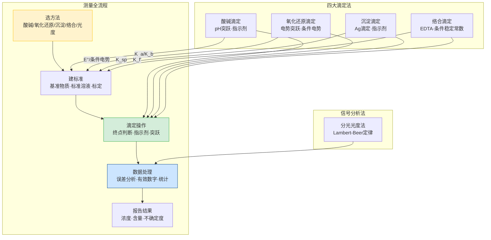

# 第二轮分析化学 · 章后复习课

> **定位**：第二轮分析化学大章节的收束课。目标是建立**"四大滴定统一框架"**和**"测量全流程视角"**。
>
> **前置要求**：第二轮分析化学 5 节新课全部完成。
>
> **本课核心口号**：分析化学不是四种滴定法的并列合集，而是一条统一的测量链——**"选方法 → 建标准 → 滴定（判断终点） → 处理数据 → 报告结果"**。四种滴定法只是这条链中"建标准"和"判断终点"两个环节的不同实现。

---

## 一、学习目标

完成本节复习后，学生应能：

1. 画出四大滴定法的统一框架对比表，说出它们在"选方法-建标准-终点判断-数据处理"各环节的异同
2. 正确使用误差公式进行数据处理和结果判断
3. 在滴定综合题中快速选择正确的滴定方法和指示剂
4. 将分光光度法与滴定法统一到"定量分析方法选择"的视角
5. 识别并避开分析化学中最高频的 8 个陷阱

---

## 二、全章知识网络总图



**读图要点**：
- **黄色（选方法）**：根据被测物性质选择合适的滴定方法
- **绿色（滴定操作）**：四种滴定法共享"终点判断"的逻辑——找到突跃范围，选指示剂
- **蓝色（数据处理）**：误差分析是所有分析方法的共同语言
- **右侧四种滴定法**：各自通过不同的平衡常数（Ka、E°、Ksp、Kf'）建立标准

---

## 三、四大滴定法统一对比表

> 这是本复习课最重要的一个表格。把四种滴定法的关键参数压成一张表。

| 对比维度 | 酸碱滴定 | 氧化还原滴定 | 沉淀滴定 | 络合滴定 |
|:---|:---|:---|:---|:---|
| **被测物** | 酸/碱 | 还原剂/氧化剂 | Cl⁻/Br⁻/I⁻/SCN⁻ | 金属离子 |
| **滴定剂** | 强酸/强碱 | KMnO₄/K₂Cr₂O₇/I₂ | AgNO₃ | EDTA |
| **核心平衡** | Ka, Kb, Kw | E°, 条件电势 | Ksp | Kf（条件稳定常数） |
| **突跃来源** | pH 突跃 | 电势突跃 | pAg 突跃 | pM 突跃 |
| **终点判断** | 指示剂变色 | 自身指示剂/电位法 | 吸附指示剂/电位法 | 金属指示剂 |
| **指示剂选择依据** | pKa ≈ pH(终点) | E(终点) 在突跃内 | pAg(终点) 在突跃内 | pM(终点) 在突跃内 |
| **适用条件** | c·Ka ≥ 10⁻⁸ | ΔE° ≥ 0.4V（两步） | c ≥ 10⁻⁴ mol/L | c·Kf' ≥ 10⁶ |
| **典型误差来源** | CO₂干扰（碱滴酸） | 副反应·诱导反应 | 吸附·共沉淀 | 酸效应·干扰离子 |

---

## 四、突跃范围与指示剂选择——统一逻辑

> 四种滴定法的指示剂选择本质上是同一个逻辑：**突跃范围覆盖指示剂变色点**。

### 4.1 酸碱滴定突跃

| 滴定体系 | 突跃范围（pH） | 适用指示剂 | 酚酞 | 甲基橙 |
|:---|:---|:---|:---:|:---:|
| NaOH 滴定 HCl | 4.3~9.7 | 两者均可 | ✅ | ✅ |
| NaOH 滴定 HAc | 6.3~9.7 | 酚酞 | ✅ | ❌ |
| HCl 滴定 NH₃·H₂O | 4.3~6.3 | 甲基红 | ❌ | ⚠️ |
| NaOH 滴定 H₃PO₄ 第二终点 | 8.7~10.0 | 酚酞 | ✅ | ❌ |

**判断口诀**：突跃范围的起点由弱酸侧 Ka 决定，终点由强碱侧决定。选择指示剂变色点落在突跃内。

### 4.2 氧化还原滴定突跃

| 滴定体系 | E°(滴定剂) | E°(被测物) | ΔE° | 突跃大小 |
|:---|:---|:---|:---:|:---:|
| KMnO₄ + Fe²⁺ | +1.51V | +0.77V | 0.74V | 大 |
| K₂Cr₂O₇ + Fe²⁺ | +1.33V | +0.77V | 0.56V | 中 |
| I₂ + Na₂S₂O₃ | +0.54V(I₂/I⁻) | +0.08V(S₄O₆²⁻/S₂O₃²⁻) | 0.46V | 中 |

**条件电势**：实际体系中离子强度、配位、pH 等因素改变 E°，用 E°'（条件电势）更准确。

### 4.3 络合滴定——EDTA 酸效应系数

$$\alpha_{Y(H)} = \frac{[Y']}{[Y]}$$

| pH | lg αY(H) | 可滴定金属离子（lg Kf' ≥ 6） |
|:---:|:---:|:---|
| 1 | 17.4 | 几乎所有金属（酸性太强，不实用） |
| 3 | 9.9 | Fe³⁺, Th⁴⁺, Bi³⁺ 等高价离子 |
| 5 | 6.5 | Cu²⁺, Pb²⁺, Zn²⁺, Cd²⁺ 等 |
| 8 | 2.3 | 几乎所有金属（最佳pH范围） |
| 10 | 0.5 | 全部金属（但可能水解沉淀） |
| 12 | 0.0 | 全部金属（但 Mg/Ca 可能沉淀） |

**一句话**：pH 越低，αY(H) 越大，EDTA 有效浓度越低，只能滴定 Kf 特别大的金属。

### 4.4 沉淀滴定——Mohr 法、Volhard 法、Fajans 法

| 方法 | 滴定剂 | 指示剂 | 适用条件 | pH 要求 |
|:---|:---|:---|:---|:---|
| **Mohr 法** | AgNO₃ | K₂CrO₄（砖红色） | 直接滴定 Cl⁻/Br⁻ | 中性或弱碱（6.5~10.5） |
| **Volhard 法** | NH₄SCN | Fe³⁺（血红色） | 返滴定 Cl⁻（先加过量AgNO₃） | 酸性（防止Fe³⁺水解） |
| **Fajans 法** | AgNO₃ | 吸附指示剂（荧光黄等） | 直接滴定卤素 | 中性或弱碱 |

---

## 五、误差分析——统一语言

### 5.1 误差分类速查

| 类型 | 来源 | 特征 | 消除/减小方法 |
|:---|:---|:---|:---|
| **系统误差** | 仪器、试剂、操作习惯 | 单向偏差 | 校准仪器、空白实验、对照实验 |
| **随机误差** | 环境波动、读数微小差异 | 正负对称分布 | 多次测量取平均 |
| **过失误差** | 读错数、算错 | 异常值 | 重新实验（用 Q 检验或 Grubbs 检验剔除） |

### 5.2 核心误差公式

| 公式 | 含义 | 使用场景 |
|:---|:---|:---|
| **相对误差 RE = (x - μ)/μ × 100%** | 测量值偏离真值的百分比 | 衡量准确度 |
| **标准偏差 s = √[Σ(xi - x̄)²/(n-1)]** | 数据离散程度 | 衡量精密度 |
| **相对标准偏差 RSD = s/x̄ × 100%** | 相对离散程度 | 不同量级数据的精密度比较 |
| **置信区间 x̄ ± t·s/√n** | 真值的可能范围 | 报告分析结果 |

### 5.3 有效数字规则

| 操作 | 有效数字规则 |
|:---|:---|
| 加减法 | 以小数位数最少的为准 |
| 乘除法 | 以有效数字位数最少的为准 |
| 常数（如 π、e） | 无限多位，不影响有效数字 |
| pH/pK/pM | 小数部分才是有效数字（整数是数量级） |

---

## 六、分光光度法——从滴定线到信号线

> 分光光度法不是滴定法，但共享分析化学的数据处理框架。

### 6.1 Lambert-Beer 定律

$$A = \lg\frac{I_0}{I} = \varepsilon \cdot b \cdot c$$

| 符号 | 含义 | 单位 |
|:---|:---|:---|
| A | 吸光度 | 无量纲 |
| ε | 摩尔吸光系数 | L/(mol·cm) |
| b | 光程（比色皿厚度） | cm |
| c | 浓度 | mol/L |

### 6.2 偏离 Beer 定律的原因

| 原因 | 表现 | 对策 |
|:---|:---|:---|
| 浓度过高 | A 与 c 不再线性 | 稀释到线性范围 |
| 化学平衡移动 | 被测物发生离解/缔合 | 控制条件使平衡偏向一侧 |
| 杂质吸收 | A 偏高 | 空白校正 |
| 散射 | A 异常偏高 | 过滤/离心去除悬浮物 |

### 6.3 标准曲线法

```
步骤：配制系列标准溶液 → 测 A → 绘制 A-c 标准曲线 → 测未知样 A → 从曲线查 c
```

**注意**：标准曲线应至少 5 个点，线性范围 A = 0.2~0.8 为最佳。

---

## 七、高频陷阱 Top 8

### 陷阱 1：滴定终点 ≠ 化学计量点

**发生率**：~50%

**学生典型错误**：认为指示剂变色点恰好等于化学计量点

**正确理解**：终点是指示剂变色的实验点，化学计量点是理论等当量点。两者之差就是**终点误差（滴定误差）**。好的指示剂应使终点尽量接近化学计量点。

---

### 陷阱 2：酸碱滴定中 CO₂ 对碱滴定酸的影响

**发生率**：~40%

**学生典型错误**：用 NaOH 标准液滴定 HCl 时忽略 CO₂ 的影响

**正确理解**：NaOH 溶液会吸收空气中的 CO₂ 生成 Na₂CO₃。用 Na₂CO₃ 标定的 NaOH 滴定 HCl 时，酚酞终点时 CO₃²⁻ → HCO₃⁻（只消耗1个 H⁺），导致 NaOH 浓度偏低。甲基橙终点时 CO₃²⁻ → H₂CO₃（消耗2个 H⁺），影响较小。

**防御口诀**：「碱滴酸，防 CO₂。酚酞看的是半中和」

---

### 陷阱 3：EDTA 滴定中忽视酸效应

**发生率**：~40%

**学生典型错误**：直接用 lg Kf 判断 EDTA 能否滴定某金属

**正确理解**：必须考虑酸效应。lg Kf' = lg Kf - lg αY(H)。pH=5 时，即使 lg Kf = 16 的金属，lg Kf' 也只有 9.5。

---

### 陷阱 4：KMnO₄ 滴定中不加催化剂

**发生率**：~30%

**学生典型错误**：KMnO₄ + Fe²⁺ 滴定开始时反应很慢，以为浓度算错

**正确理解**：KMnO₄ 与 Fe²⁺ 的反应在室温无催化剂时较慢。实际操作中利用反应生成的 Mn²⁺ 作自催化剂（自动催化），或预先加入少量 MnSO₄。

---

### 陷阱 5：重量分析中沉淀的溶解损失

**发生率**：~30%

**学生典型错误**：BaSO₄ 重量分析中用蒸馏水洗涤沉淀

**正确理解**：BaSO₄ 微溶于水（Ksp = 1.1×10⁻¹⁰），用纯水洗涤会导致溶解损失。应用稀 H₂SO₄ 洗涤（同离子效应降低溶解度）。

**防御口诀**：「重量分析洗沉淀，用含同离子的稀溶液」

---

### 陷阱 6：分光光度法中 A 值太大不准确

**发生率**：~25%

**学生典型错误**：A > 2.0 的数据直接使用

**正确理解**：当 A > 2 时，透射光强度不足检测器灵敏范围，Beer 定律偏离严重。应稀释样品使 A 落在 0.2~0.8 范围。

---

### 陷阱 7：返滴定法的使用条件

**发生率**：~25%

**学生典型错误**：任何情况下都用直接滴定法

**正确理解**：以下情况需要返滴定：①被测物与滴定剂反应很慢；②被测物是固体，溶解慢；③没有合适的指示剂。例如 Volhard 法测 Cl⁻ 就是先加过量 AgNO₃ 再返滴定。

---

### 陷阱 8：沉淀滴定中温度影响

**发生率**：~20%

**学生典型错误**：Mohr 法在 60°C 下操作

**正确理解**：Mohr 法要求在室温下进行。高温下 Ag₂CrO₄ 溶解度增大，AgCl 沉淀吸附增强，都影响终点判断。

---

## 八、综合判断练习（课堂用）

### 练习 1：滴定方法选择

> 需要测定以下样品中某组分的含量。请为每种情况选择最合适的滴定方法，并简要说明理由。
>
> (a) 食醋中 HAc 的含量
>
> (b) 漂白粉中有效氯的含量
>
> (c) 水中 Ca²⁺ + Mg²⁺ 的总硬度
>
> (d) 天然水中 Cl⁻ 的含量

**考查要点**：方法选择逻辑——酸碱滴定用于酸/碱；氧化还原滴定用于变价物；络合滴定用于金属离子；沉淀滴定用于卤素

---

### 练习 2：综合数据处理

> 用 Na₂CO₃ 基准物质标定 HCl 溶液浓度。称取 Na₂CO₃ 0.1520 g，溶解后用 HCl 滴定至甲基橙终点，消耗 HCl 25.38 mL。
>
> (a) 计算 HCl 的浓度（M(Na₂CO₃) = 105.99 g/mol）。
>
> (b) 如果滴定终点过迟（pH < 4），计算得到的 HCl 浓度偏高还是偏低？为什么？
>
> (c) 如果 Na₂CO₃ 样品中含有少量 NaHCO₃ 杂质，计算得到的 HCl 浓度偏高还是偏低？

**考查要点**：标定计算；终点误差分析；杂质对标定结果的影响

---

### 练习 3：EDTA 络合滴定

> 用 0.01000 mol/L EDTA 标准溶液滴定 25.00 mL 含 Zn²⁺ 的未知溶液。
>
> 已知：lg Kf(ZnY²⁻) = 16.5；pH = 5.0 时 lg αY(H) = 6.5。
>
> (a) 计算 pH 5.0 时 ZnY²⁻ 的条件稳定常数 lg Kf'。
>
> (b) 化学计量点时，[Zn²⁺] = ?（提示：利用条件稳定常数）
>
> (c) 如果需要在 pH 10.0 滴定（lg αY(H) = 0.5），化学计量点时 [Zn²⁺] 又是多少？解释 pH 升高为什么有利于滴定。

**考查要点**：酸效应系数计算；条件稳定常数与化学计量点 [Zn²⁺] 的关系

---

## 九、本章与后续章节的接口

| 后续章节 | 从本章继承什么 | 会升级什么 |
|:---|:---|:---|
| **第三轮有机化学** | 定量分析思维、误差概念 | 从"无机定量"升级到"有机结构鉴定和纯度分析" |
| **第三轮结构深化** | 分光光度法基础 | 从简单 Lambert-Beer 升级到分子轨道光谱、配位光谱 |
| **第四轮冲刺** | 全部分析方法 | 压缩成"实验设计题"的快速判断框架 |

> **一句话**：第二轮分析化学是"测量流程化"，第三轮是"表征系统化"，第四轮是"实验设计综合化"。

---

## 十、教师使用建议

### 课时安排

| 方案 | 时长 | 内容 |
|:---|:---|:---|
| **方案 A：完整 2 课时** | 90 min | §二~§六（60min）+ §七陷阱+§八练习（30min） |
| **方案 B：拆成 2×45min** | 45+45 | 第 1 节：§二~§四（网络+四大滴定对比+突跃）；第 2 节：§五~§八（误差+光度+陷阱+练习） |

### 核心板书

```
四大滴定统一逻辑：
选方法 → 建标准（Ka/E°/Ksp/Kf） → 滴定（突跃+指示剂） → 数据处理（误差）

指示剂选择：指示剂变色点落在突跃范围内
```

---

*本文件是六大新课大章节体系的第四份章后复习课。品质标准：测量全流程网络图（Mermaid）+ 四大滴定统一对比表 + 突跃/指示剂统一逻辑 + 误差分析统一语言 + 光度法桥接 + 高频陷阱（≥5 个）+ 综合练习 + 后续接口。*
