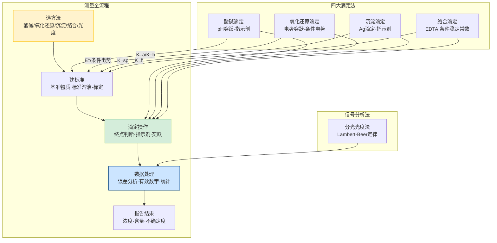

# 第二轮分析化学 · 章后复习课

> **定位**：第二轮分析化学大章节的收束课。目标是建立**"四大滴定统一框架"**和**"测量全流程视角"**。
>
> **前置要求**：第二轮分析化学 5 节新课全部完成。
>
> **本课核心口号**：分析化学不是四种滴定法的并列合集，而是一条统一的测量链——**"选方法 → 建标准 → 滴定（判断终点） → 处理数据 → 报告结果"**。四种滴定法只是这条链中"建标准"和"判断终点"两个环节的不同实现。

---

## 一、学习目标

完成本节复习后，学生应能：

1. 画出四大滴定法的统一框架对比表，说出它们在"选方法-建标准-终点判断-数据处理"各环节的异同
2. 正确使用误差公式进行数据处理和结果判断
3. 在滴定综合题中快速选择正确的滴定方法和指示剂
4. 将分光光度法与滴定法统一到"定量分析方法选择"的视角
5. 识别并避开分析化学中最高频的 8 个陷阱

---

## 一点五、本章考试地图

> 分析化学是一门"方法学科"——它不回答"会发生什么反应"，而回答"怎么把某个量测准"。近五年的真题里它是**稳定的必得分项**：每年 1 道大题，且位置靠前（第 2 或第 4 题）。本节先把考纲范围、命题分布和题型权重摊开，后面的知识网络才有优先级。

### 1.5.1 考纲条目对照

本章对应《中国化学奥林匹克基本要求》**基础要求·分析化学**的**全部 3 个条目**：

| 考纲条目 | 本章对应模块 | 关系 |
|:---|:---|:---:|
| 18-容量分析 | 四大滴定体系（酸碱／氧化还原／沉淀／络合） | 主体 |
| 19-误差分析 | 准确度与精密度、误差传递、有效数字 | 主体 |
| 20-分光光度法 | Lambert–Beer 定律、吸光度与浓度 | 主体 |

> **条目页入口**：[[02-考纲条目/基础要求/分析化学/18-容量分析|18-容量分析]] · [[02-考纲条目/基础要求/分析化学/19-误差分析|19-误差分析]] · [[02-考纲条目/基础要求/分析化学/20-分光光度法|20-分光光度法]]

> **边界提醒**：分析化学的三个条目**全部编在本章**，没有跨章边界。但它的**原理底座在化学原理线**——`05-酸碱理论`（酸碱滴定的平衡基础）、`07-化学平衡`（沉淀与络合的 $K_{sp}$、$K_f$）、`08-氧化还原与电化学`（氧化还原滴定的电势依据）、`12-配合物`（EDTA 与掩蔽）。这些属大章 1，本章只**调用**、不重讲。分析化学的题目失分，往往不是方法不会，而是**平衡不会**。

### 1.5.2 历年真题命题分布（25-40 届纵深）

> 数据来源：题库 25~40 届初赛真题实体卡与提炼解析。

| 届次 | 年份 | 滴定与分析方法考点 | 样品体系与分析特征 | 回链题卡 |
|:---:|:---:|:---|:---|:---|
| 25 届 | 2011 | 间接碘量法滴定分析（$I_2$ 析出与淀粉指示剂、氧化还原配平） | 复杂固溶体溶解与多组分定量 | [[04-题库/真题/第25届初赛/分析化学/题-025-4-固溶体溶解反应\|题-025-4]] |
| 26 届 | 2012 | 高锰酸钾自身指示剂滴定法（草酸钠基准物标定与滴定） | 化学式推断与双组分连续分析 | [[04-题库/真题/第26届初赛/分析化学/题-026-3-KMnO4滴定草酸\|题-026-3]] |
| 27 届 | 2013 | 汞量法与沉淀/配位滴定条件控制（硝酸酸化与水解抑制） | 卤素离子精确测量与介质酸度 | [[04-题库/真题/第27届初赛/分析化学/题-027-4-硝酸酸化理由\|题-027-4]] |
| 30 届 | 2016 | 氧化还原滴定与化学式推断联立（歧化产物连续容量分析） | 钼氧氯配合物价态与化学式推断 | [[04-题库/真题/第30届初赛/分析化学/题-030-5-1-MOxCly化学式推断及滴定方程式\|题-030-5-1]] |
| 34 届 | 2020 | 分光光度法吸光度线性拟合（Lambert-Beer 定律与化学平衡联立） | 微溶物乙酸银溶度积常数光谱测定 | [[04-题库/真题/第34届初赛/分析化学/题-034-5-乙酸银溶度积测定\|题-034-5]] |
| 36 届 | 2022 | 氧化还原滴定（第二场第 4 题：碘化物与次氯酸根多步滴定） | 离子方程式配平与滴定突跃判定 | [[04-题库/真题/第36届初赛第二场/题-036b-4-碘化物滴定离子方程式\|题-036b-4]] |
| 37 届 | 2023 | 滴定反应方程式书写与容量计量（多价态锰物种返滴定） | 锂电池正极材料前驱体定量分析 | [[04-题库/真题/第37届初赛/题-037-2-滴定反应方程式\|题-037-2]] |
| 38 届 | 2024 | $\mathrm{KMnO_4}$ 标定与连续滴定计算（酸度控制与反应条件） | 矿渣浸出液多离子连续滴定与有效数字 | [[04-题库/真题/第38届初赛/题-038-2-1-KMnO4浓度测定计算\|题-038-2-1]] |
| 39 届 | 2025 | 间接碘量法测定高浓度 $KI$ 溶液（歧化控制与终点误差） | 普鲁士蓝正极材料电极活性联立 | [[04-题库/真题/第39届初赛/化学原理/题-039-4-碘量法测定KI浓度\|题-039-4]] |
| **40 届** | **2026** | **第 3 题（15 分）：甲醛法测酱油中氨基酸态氮**——酸碱滴定 + **甲醛掩蔽氨基**、**空白校正**、系统误差 | 真实食品基体样品预处理、掩蔽解蔽与扣除空白 | [[04-题库/真题/第40届初赛/化学原理/题-040-3-酱油中氨基酸态氮含量的测定\|题-040-3]] |

### 1.5.3 命题趋势四条

1. **稳定 1 题、位置靠前，是"必得分"**。分析化学连续出现在初赛第 2 或第 4 题，题型以**氧化还原滴定**为主（$\mathrm{KMnO_4}$ 自身指示剂、碘量法），络合滴定次之。它不属于"压轴难题"，但**位置靠前意味着失分代价更大**。
2. **从"标定标准溶液"转向"测定真实样品"，并与其他模块耦合**。近年题目给的是真实对象（KI 浓度、$\mathrm{KMnO_4}$ 溶液，40 届更出现甲醛法测酱油氨基酸态氮），且常与氧化还原电势 $E^\theta$、配位平衡 $K_f$ 联动——**只会套滴定公式不够**。
3. **误差与有效数字贯穿全题**。它很少单独设问，而是嵌在计算结果里扣分：答案的**位数与单位本身就是得分点**。这类"隐性失分"在本章最普遍。
4. **"掩蔽—解蔽—空白校正"从技巧升为考点**（40 届新增）。40 届第 3 题先用甲醛掩蔽氨基、再滴定，并同步做空白校正——**这已不是"顺带提一句"的操作细节，而是独立设问的得分点**。滴定之外的"化学预处理"开始与反应原理同等重要。

### 1.5.4 近两年模拟题命题热点与创新变式（13 家机构 574 题源实测挖掘）

> 数据来源：外挂索引 `10-索引与统计/04-考点题源索引.json`。全库 13 家竞赛教研机构（chemy、质心GChO、化英社、汇智、壹尖培优等）共收录分析化学题卡 **574 张（涵盖 33 个细分考点）**。

#### 1. 模拟题高频考点 TOP 7 榜单

| 核心考点 | 模拟题题量 | 主要来源机构分布 | 命题考查焦点 |
|:---|:---:|:---|:---|
| [[分光光度法]] | 68 题 | chemy(21) · 化英社(10) · 汇智(9) | 吸光度线性区间、摩尔吸光系数换算与等吸收点判据 |
| [[容量分析计算]] | 68 题 | 质心(33) · chemy(12) · 汇智(7) | 多步连续返滴定计算、化学计量系数与物料守恒比 |
| [[氧化还原滴定]] | 62 题 | chemy(20) · 伽马(6) · 壹尖培优(6) | 溴酸钾法、重铬酸钾法与条件电势突跃范围计算 |
| [[碘量法]] | 51 题 | chemy(17) · 伽马(6) · 壹尖培优(6) | 碘量法副反应预防（挥发/氧化）、淀粉指示剂加入时机 |
| [[分布分数]] | 37 题 | chemy(15) · 质心UChO(5) · 伽马(4) | 多元弱酸/络合物分布系数 $\delta$ 曲线推导与主导物种判定 |
| [[误差]] | 34 题 | 质心(18) · XeChem(6) · chemy(4) | 滴定管读数随机误差、系统误差传递与有效数字保留准则 |
| [[元素分析]] | 34 题 | chemy(22) · 化英社(3) · 清北营(3) | 燃烧产物吸收称量法、热重曲线阶段失重推断经验式 |

#### 2. 近两年模拟题的三大前沿创新变式

1. **复杂食品/生物基体预处理与返滴定设计**：
   模拟题深度跟进 40 届甲醛法命题思路，引入凯氏定氮法、双指示剂法测混合碱、重铬酸钾回滴过量还原剂等经典实验情境，重点考查空白试验设计与掩蔽剂化学计量。
2. **分光光度法双波长消除背景干扰**：
   从单组分比色法拓展至等吸收波长法消除共存干扰物，或利用平衡体系吸光度变化测定配合物逐级稳定常数。
3. **热重分析（TGA）与容量滴定联合推断**：
   给出多阶热失重台阶百分比与滴定耗酸量，联立求解未知水合物/羟基盐配位组成与热分解机理。

#### 3. 精选机构模拟题变式题卡直通

| 机构与题号 | 涉及核心考点 | 命题场景与能力要求 | 回链题卡 |
|:---|:---|:---|:---|
| 质心 GChO-11-04 | [[容量分析计算]] · [[误差]] | 采用甲醛法测定有机物中含氮量、空白校正与终点误差分析 | [[04-题库/2026机构初赛模拟题/质心GChO/题-GChO-11-04-采用甲醛法测定某有机物中的N\|题-GChO-11-04]] |
| chemy CM-01-02 | [[分光光度法]] | 药物奎宁荧光与吸光度检测、标准曲线法与有效测量区间 | [[04-题库/2026机构初赛模拟题/chemy/题-CM-01-02-奎宁结构如右图所示是从金鸡纳\|题-CM-01-02]] |
| chemy CM-02-04 | [[容量分析计算]] · [[氧化还原滴定]] | 氯氨样品歧化与连续碘量法返滴定定量分析 | [[04-题库/2026机构初赛模拟题/chemy/题-CM-02-04-41某实验室现制备了一份氯氨\|题-CM-02-04]] |
| chemy CM-106-03 | [[氧化还原滴定]] · [[分布分数]] | 铁硫混合物多步还原重铬酸钾法连续滴定计算 | [[04-题库/2026机构初赛模拟题/chemy/题-CM-106-03-将还原铁粉和沉降硫混合后用镁\|题-CM-106-03]] |

### 1.5.5 题型权重与复习优先级

| 题型 | 命题频率 | 典型载体 | 复习优先级 |
|:---|:---:|:---|:---:|
| 氧化还原滴定计算 | 每届 | 碘量法、$\mathrm{KMnO_4}$ | ★★★ |
| 误差与有效数字 | 每届（嵌于计算） | 结果表述、误差传递 | ★★★ |
| 络合滴定（$K_f$、掩蔽） | 间隔出现 | EDTA 滴定 | ★★ |
| 酸碱滴定 + 掩蔽／空白校正 | **40 届独立设问** | 真实样品（40 届第 3 题：甲醛法测氨基酸态氮） | ★★★ |
| 分光光度法（Lambert–Beer） | 间隔出现 | 吸光度—浓度换算 | ★★ |
| 沉淀滴定 | 近三年少见 | 银量法 | ★ |

> **按考试权重的复习顺序**（注意：**不是**按教材顺序）：
> 1. **氧化还原滴定的计算链条**：化学计量关系 → 电子守恒 → 结果表述。分值最重。
> 2. **误差与有效数字**：它不单独考，却决定所有计算题的最终得分——**性价比最高的一项**。
> 3. **酸碱滴定与络合滴定的原理与计算**：两者都依赖化学原理线的平衡功底，是"方法 + 平衡"的复合考点。
> 4. **掩蔽、解蔽与空白校正**（40 届新增）：样品预处理本身即考点，甲醛法掩蔽氨基是典型载体。
> 5. **分光光度法与沉淀滴定**：频率较低，补齐原理与基本换算即可。

---

## 二、全章知识网络总图


```mermaid
graph TD
    subgraph 测量全流程
        S[选方法<br/>酸碱/氧化还原/沉淀/络合/光度]
        STD[建标准<br/>基准物质·标准溶液·标定]
        T[滴定操作<br/>终点判断·指示剂·突跃]
        D[数据处理<br/>误差分析·有效数字·统计]
        R[报告结果<br/>浓度·含量·不确定度]
    end

    subgraph 四大滴定法
        AB[酸碱滴定<br/>pH突跃·指示剂]
        RD[氧化还原滴定<br/>电势突跃·条件电势]
        PPT[沉淀滴定<br/>Ag滴定·指示剂]
        COM[络合滴定<br/>EDTA·条件稳定常数]
    end

    subgraph 信号分析法
        SPEC[分光光度法<br/>Lambert-Beer定律]
    end

    S --> STD --> T --> D --> R

    AB --> T
    RD --> T
    PPT --> T
    COM --> T
    SPEC --> D

    AB -->|K_a/K_b| STD
    RD -->|E°/条件电势| STD
    PPT -->|K_sp| STD
    COM -->|K_f'| STD

    style S fill:#fff3cd,stroke:#ffc107
    style T fill:#d4edda,stroke:#28a745
    style D fill:#cce5ff,stroke:#004085
```

**读图要点**：
- **黄色（选方法）**：根据被测物性质选择合适的滴定方法
- **绿色（滴定操作）**：四种滴定法共享"终点判断"的逻辑——找到突跃范围，选指示剂
- **蓝色（数据处理）**：误差分析是所有分析方法的共同语言
- **右侧四种滴定法**：各自通过不同的平衡常数（Ka、E°、Ksp、Kf'）建立标准

---

## 三、四大滴定法统一对比表

> 这是本复习课最重要的一个表格。把四种滴定法的关键参数压成一张表。

| 对比维度 | 酸碱滴定 | 氧化还原滴定 | 沉淀滴定 | 络合滴定 |
|:---|:---|:---|:---|:---|
| **被测物** | 酸/碱 | 还原剂/氧化剂 | Cl⁻/Br⁻/I⁻/SCN⁻ | 金属离子 |
| **滴定剂** | 强酸/强碱 | KMnO₄/K₂Cr₂O₇/I₂ | AgNO₃ | EDTA |
| **核心平衡** | Ka, Kb, Kw | E°, 条件电势 | Ksp | Kf（条件稳定常数） |
| **突跃来源** | pH 突跃 | 电势突跃 | pAg 突跃 | pM 突跃 |
| **终点判断** | 指示剂变色 | 自身指示剂/电位法 | 吸附指示剂/电位法 | 金属指示剂 |
| **指示剂选择依据** | pKa ≈ pH(终点) | E(终点) 在突跃内 | pAg(终点) 在突跃内 | pM(终点) 在突跃内 |
| **适用条件** | c·Ka ≥ 10⁻⁸ | ΔE° ≥ 0.4V（两步） | c ≥ 10⁻⁴ mol/L | c·Kf' ≥ 10⁶ |
| **典型误差来源** | CO₂干扰（碱滴酸） | 副反应·诱导反应 | 吸附·共沉淀 | 酸效应·干扰离子 |

---

## 四、突跃范围与指示剂选择——统一逻辑

> 四种滴定法的指示剂选择本质上是同一个逻辑：**突跃范围覆盖指示剂变色点**。

### 4.1 酸碱滴定突跃

| 滴定体系 | 突跃范围（pH） | 适用指示剂 | 酚酞 | 甲基橙 |
|:---|:---|:---|:---:|:---:|
| NaOH 滴定 HCl | 4.3~9.7 | 两者均可 | ✅ | ✅ |
| NaOH 滴定 HAc | 6.3~9.7 | 酚酞 | ✅ | ❌ |
| HCl 滴定 NH₃·H₂O | 4.3~6.3 | 甲基红 | ❌ | ⚠️ |
| NaOH 滴定 H₃PO₄ 第二终点 | 8.7~10.0 | 酚酞 | ✅ | ❌ |

**判断口诀**：突跃范围的起点由弱酸侧 Ka 决定，终点由强碱侧决定。选择指示剂变色点落在突跃内。

### 4.2 氧化还原滴定突跃

| 滴定体系 | E°(滴定剂) | E°(被测物) | ΔE° | 突跃大小 |
|:---|:---|:---|:---:|:---:|
| KMnO₄ + Fe²⁺ | +1.51V | +0.77V | 0.74V | 大 |
| K₂Cr₂O₇ + Fe²⁺ | +1.33V | +0.77V | 0.56V | 中 |
| I₂ + Na₂S₂O₃ | +0.54V(I₂/I⁻) | +0.08V(S₄O₆²⁻/S₂O₃²⁻) | 0.46V | 中 |

**条件电势**：实际体系中离子强度、配位、pH 等因素改变 E°，用 E°'（条件电势）更准确。

### 4.3 络合滴定——EDTA 酸效应系数

$$\alpha_{Y(H)} = \frac{[Y']}{[Y]}$$

| pH | lg αY(H) | 可滴定金属离子（lg Kf' ≥ 6） |
|:---:|:---:|:---|
| 1 | 17.4 | 几乎所有金属（酸性太强，不实用） |
| 3 | 9.9 | Fe³⁺, Th⁴⁺, Bi³⁺ 等高价离子 |
| 5 | 6.5 | Cu²⁺, Pb²⁺, Zn²⁺, Cd²⁺ 等 |
| 8 | 2.3 | 几乎所有金属（最佳pH范围） |
| 10 | 0.5 | 全部金属（但可能水解沉淀） |
| 12 | 0.0 | 全部金属（但 Mg/Ca 可能沉淀） |

**一句话**：pH 越低，αY(H) 越大，EDTA 有效浓度越低，只能滴定 Kf 特别大的金属。

### 4.4 沉淀滴定——Mohr 法、Volhard 法、Fajans 法

| 方法 | 滴定剂 | 指示剂 | 适用条件 | pH 要求 |
|:---|:---|:---|:---|:---|
| **Mohr 法** | AgNO₃ | K₂CrO₄（砖红色） | 直接滴定 Cl⁻/Br⁻ | 中性或弱碱（6.5~10.5） |
| **Volhard 法** | NH₄SCN | Fe³⁺（血红色） | 返滴定 Cl⁻（先加过量AgNO₃） | 酸性（防止Fe³⁺水解） |
| **Fajans 法** | AgNO₃ | 吸附指示剂（荧光黄等） | 直接滴定卤素 | 中性或弱碱 |

---

## 五、误差分析——统一语言

### 5.1 误差分类速查

| 类型 | 来源 | 特征 | 消除/减小方法 |
|:---|:---|:---|:---|
| **系统误差** | 仪器、试剂、操作习惯 | 单向偏差 | 校准仪器、空白实验、对照实验 |
| **随机误差** | 环境波动、读数微小差异 | 正负对称分布 | 多次测量取平均 |
| **过失误差** | 读错数、算错 | 异常值 | 重新实验（用 Q 检验或 Grubbs 检验剔除） |

### 5.2 核心误差公式

| 公式 | 含义 | 使用场景 |
|:---|:---|:---|
| **相对误差 RE = (x - μ)/μ × 100%** | 测量值偏离真值的百分比 | 衡量准确度 |
| **标准偏差 s = √[Σ(xi - x̄)²/(n-1)]** | 数据离散程度 | 衡量精密度 |
| **相对标准偏差 RSD = s/x̄ × 100%** | 相对离散程度 | 不同量级数据的精密度比较 |
| **置信区间 x̄ ± t·s/√n** | 真值的可能范围 | 报告分析结果 |

### 5.3 有效数字规则

| 操作 | 有效数字规则 |
|:---|:---|
| 加减法 | 以小数位数最少的为准 |
| 乘除法 | 以有效数字位数最少的为准 |
| 常数（如 π、e） | 无限多位，不影响有效数字 |
| pH/pK/pM | 小数部分才是有效数字（整数是数量级） |

---

## 六、分光光度法——从滴定线到信号线

> 分光光度法不是滴定法，但共享分析化学的数据处理框架。

### 6.1 Lambert-Beer 定律

$$A = \lg\frac{I_0}{I} = \varepsilon \cdot b \cdot c$$

| 符号 | 含义 | 单位 |
|:---|:---|:---|
| A | 吸光度 | 无量纲 |
| ε | 摩尔吸光系数 | L/(mol·cm) |
| b | 光程（比色皿厚度） | cm |
| c | 浓度 | mol/L |

### 6.2 偏离 Beer 定律的原因

| 原因 | 表现 | 对策 |
|:---|:---|:---|
| 浓度过高 | A 与 c 不再线性 | 稀释到线性范围 |
| 化学平衡移动 | 被测物发生离解/缔合 | 控制条件使平衡偏向一侧 |
| 杂质吸收 | A 偏高 | 空白校正 |
| 散射 | A 异常偏高 | 过滤/离心去除悬浮物 |

### 6.3 标准曲线法

```
步骤：配制系列标准溶液 → 测 A → 绘制 A-c 标准曲线 → 测未知样 A → 从曲线查 c
```

**注意**：标准曲线应至少 5 个点，线性范围 A = 0.2~0.8 为最佳。

---

## 七、高频陷阱 Top 8

### 陷阱 1：滴定终点 ≠ 化学计量点

**发生率**：~50%

**学生典型错误**：认为指示剂变色点恰好等于化学计量点

**正确理解**：终点是指示剂变色的实验点，化学计量点是理论等当量点。两者之差就是**终点误差（滴定误差）**。好的指示剂应使终点尽量接近化学计量点。

---

### 陷阱 2：酸碱滴定中 CO₂ 对碱滴定酸的影响

**发生率**：~40%

**学生典型错误**：用 NaOH 标准液滴定 HCl 时忽略 CO₂ 的影响

**正确理解**：NaOH 溶液会吸收空气中的 CO₂ 生成 Na₂CO₃。用 Na₂CO₃ 标定的 NaOH 滴定 HCl 时，酚酞终点时 CO₃²⁻ → HCO₃⁻（只消耗1个 H⁺），导致 NaOH 浓度偏低。甲基橙终点时 CO₃²⁻ → H₂CO₃（消耗2个 H⁺），影响较小。

**防御口诀**：「碱滴酸，防 CO₂。酚酞看的是半中和」

---

### 陷阱 3：EDTA 滴定中忽视酸效应

**发生率**：~40%

**学生典型错误**：直接用 lg Kf 判断 EDTA 能否滴定某金属

**正确理解**：必须考虑酸效应。lg Kf' = lg Kf - lg αY(H)。pH=5 时，即使 lg Kf = 16 的金属，lg Kf' 也只有 9.5。

---

### 陷阱 4：KMnO₄ 滴定中不加催化剂

**发生率**：~30%

**学生典型错误**：KMnO₄ + Fe²⁺ 滴定开始时反应很慢，以为浓度算错

**正确理解**：KMnO₄ 与 Fe²⁺ 的反应在室温无催化剂时较慢。实际操作中利用反应生成的 Mn²⁺ 作自催化剂（自动催化），或预先加入少量 MnSO₄。

---

### 陷阱 5：重量分析中沉淀的溶解损失

**发生率**：~30%

**学生典型错误**：BaSO₄ 重量分析中用蒸馏水洗涤沉淀

**正确理解**：BaSO₄ 微溶于水（Ksp = 1.1×10⁻¹⁰），用纯水洗涤会导致溶解损失。应用稀 H₂SO₄ 洗涤（同离子效应降低溶解度）。

**防御口诀**：「重量分析洗沉淀，用含同离子的稀溶液」

---

### 陷阱 6：分光光度法中 A 值太大不准确

**发生率**：~25%

**学生典型错误**：A > 2.0 的数据直接使用

**正确理解**：当 A > 2 时，透射光强度不足检测器灵敏范围，Beer 定律偏离严重。应稀释样品使 A 落在 0.2~0.8 范围。

---

### 陷阱 7：返滴定法的使用条件

**发生率**：~25%

**学生典型错误**：任何情况下都用直接滴定法

**正确理解**：以下情况需要返滴定：①被测物与滴定剂反应很慢；②被测物是固体，溶解慢；③没有合适的指示剂。例如 Volhard 法测 Cl⁻ 就是先加过量 AgNO₃ 再返滴定。

---

### 陷阱 8：沉淀滴定中温度影响

**发生率**：~20%

**学生典型错误**：Mohr 法在 60°C 下操作

**正确理解**：Mohr 法要求在室温下进行。高温下 Ag₂CrO₄ 溶解度增大，AgCl 沉淀吸附增强，都影响终点判断。

---

## 八、综合判断练习（课堂用）

### 练习 1：滴定方法选择

> 需要测定以下样品中某组分的含量。请为每种情况选择最合适的滴定方法，并简要说明理由。
>
> (a) 食醋中 HAc 的含量
>
> (b) 漂白粉中有效氯的含量
>
> (c) 水中 Ca²⁺ + Mg²⁺ 的总硬度
>
> (d) 天然水中 Cl⁻ 的含量

**考查要点**：方法选择逻辑——酸碱滴定用于酸/碱；氧化还原滴定用于变价物；络合滴定用于金属离子；沉淀滴定用于卤素

---

### 练习 2：综合数据处理

> 用 Na₂CO₃ 基准物质标定 HCl 溶液浓度。称取 Na₂CO₃ 0.1520 g，溶解后用 HCl 滴定至甲基橙终点，消耗 HCl 25.38 mL。
>
> (a) 计算 HCl 的浓度（M(Na₂CO₃) = 105.99 g/mol）。
>
> (b) 如果滴定终点过迟（pH < 4），计算得到的 HCl 浓度偏高还是偏低？为什么？
>
> (c) 如果 Na₂CO₃ 样品中含有少量 NaHCO₃ 杂质，计算得到的 HCl 浓度偏高还是偏低？

**考查要点**：标定计算；终点误差分析；杂质对标定结果的影响

---

### 练习 3：EDTA 络合滴定

> 用 0.01000 mol/L EDTA 标准溶液滴定 25.00 mL 含 Zn²⁺ 的未知溶液。
>
> 已知：lg Kf(ZnY²⁻) = 16.5；pH = 5.0 时 lg αY(H) = 6.5。
>
> (a) 计算 pH 5.0 时 ZnY²⁻ 的条件稳定常数 lg Kf'。
>
> (b) 化学计量点时，[Zn²⁺] = ?（提示：利用条件稳定常数）
>
> (c) 如果需要在 pH 10.0 滴定（lg αY(H) = 0.5），化学计量点时 [Zn²⁺] 又是多少？解释 pH 升高为什么有利于滴定。

**考查要点**：酸效应系数计算；条件稳定常数与化学计量点 [Zn²⁺] 的关系

---

## 九、本章与后续章节的接口

| 后续章节 | 从本章继承什么 | 会升级什么 |
|:---|:---|:---|
| **第三轮有机化学** | 定量分析思维、误差概念 | 从"无机定量"升级到"有机结构鉴定和纯度分析" |
| **第三轮结构深化** | 分光光度法基础 | 从简单 Lambert-Beer 升级到分子轨道光谱、配位光谱 |
| **第四轮冲刺** | 全部分析方法 | 压缩成"实验设计题"的快速判断框架 |

> **一句话**：第二轮分析化学是"测量流程化"，第三轮是"表征系统化"，第四轮是"实验设计综合化"。

---

## 十、教师使用建议

### 课时安排

| 方案 | 时长 | 内容 |
|:---|:---|:---|
| **方案 A：完整 2 课时** | 90 min | §二~§六（60min）+ §七陷阱+§八练习（30min） |
| **方案 B：拆成 2×45min** | 45+45 | 第 1 节：§二~§四（网络+四大滴定对比+突跃）；第 2 节：§五~§八（误差+光度+陷阱+练习） |

### 核心板书

```
四大滴定统一逻辑：
选方法 → 建标准（Ka/E°/Ksp/Kf） → 滴定（突跃+指示剂） → 数据处理（误差）

指示剂选择：指示剂变色点落在突跃范围内
```

---

*本文件是六大新课大章节体系的第四份章后复习课。品质标准：测量全流程网络图（Mermaid）+ 四大滴定统一对比表 + 突跃/指示剂统一逻辑 + 误差分析统一语言 + 光度法桥接 + 高频陷阱（≥5 个）+ 综合练习 + 后续接口。*
