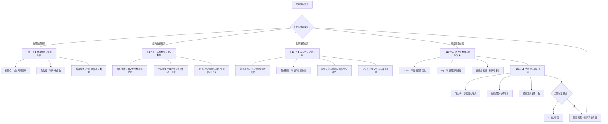

# 元素推断综合训练

> **适用**：第二轮（核心训练）→ 第三轮（冲刺深化）
> **对应备课大纲**：[[04-课件/备课大纲/2026-06-08-元素推断综合训练-提高班]]
> **前置要求**：元素化学各族系统知识、氧化还原基本概念、VSEPR 理论、晶体结构基础
> **深度边界**：本讲聚焦元素推断题的结构化解题方法——五步推断法。不展开具体元素系统知识（→ 各族元素讲义），不展开复杂热力学循环计算（→ 物化综合计算）。

---

## 学习目标

- ✅ 目标1：能执行"五步推断法"——物理性质→结构数据→反应性→热力学→方程式。
- ✅ 目标2：能根据颜色、磁性、溶解性等物理线索快速缩小元素范围。
- ✅ 目标3：能从化学史古文描述中提取关键物质和操作信息。
- ✅ 目标4：能从定量数据（摩尔质量、元素分析、氧化数）反推物质组成。
- ✅ 目标5：能利用 ~20% 的反常现象（与预期不符）作为推断突破口。

---

## 一、推断方法论总览

### 1.1 新旧考法对比

| 维度 | 传统元素题 | 新推断题 |
|:---|:---|:---|
| 考查重点 | 背元素性质 + 写方程式 | 陌生物质 → 结构化推理 |
| 数据形式 | 直接给元素名或分子式 | 给颜色/磁性/结构数据/反应性 |
| 解题策略 | 回忆该元素的所有性质 | 五步法逐层筛选 |
| 典型情境 | "写出 X 与 Y 的反应" | "某绿色晶体 A 加热分解…确定 A 的结构" |

### 1.2 五步推断法——决策思维树

面对一道全新的推断题，不要急于猜元素，按下图逐级过滤：



### 1.3 五步法执行示例（快速索引卡）

| 步骤 | 要回答的问题 | 常用工具 | 典型耗时 |
|:---|:---|:---|:---:|
| ①物理性质 | "这物质是什么颜色？有没有磁性？溶不溶于水？" | 颜色表+溶解性表+磁性判据 | 30s |
| ②结构数据 | "晶胞参数/空间群/分子式告诉我们什么？" | VSEPR+杂化轨道+晶胞计算 | 60s |
| ③反应性 | "这物质和什么反应？产物有什么特征？" | 氧化还原+酸碱+配位+鉴定反应 | 60s |
| ④热力学数据 | "计算出的ΔG/E°/Ksp是否支持假设？" | 能斯特方程+ΔG计算+Ksp判断 | 60s |
| ⑤方程式验证 | "写出的方程式配平了吗？现象吻合吗？" | 氧化数法+半反应法配平 | 30s |

---

## 二、物理线索速查

### 2.1 颜色速查

| 颜色 | 可能的物质 |
|:---|:---|
| **紫红色** | MnO₄⁻、[Ti(H₂O)₆]³⁺ |
| **蓝色** | Cu²⁺ (aq)、[Cu(NH₃)₄]²⁺、CoCl₂·6H₂O（粉→蓝在 Co 硅胶）|
| **绿色** | Ni²⁺ (aq)、Cr³⁺ (aq)、Fe²⁺ (aq) 浅绿、MnO₄²⁻（绿）|
| **黄色** | Fe³⁺ (aq)、CrO₄²⁻、VO₂⁺ |
| **橙色** | Cr₂O₇²⁻、Br₂ |
| **红棕色** | Br₂、NO₂、Fe₂O₃ |
| **黑色** | Fe₃O₄、FeO、CuO、MnO₂、PbS、CuS、Ag₂S |
| **白色** | Zn²⁺/Al³⁺/Mg²⁺/Ca²⁺/Ba²⁺ 的盐、TiO₂、SiO₂ |
| **特征色** | AgCl(白)→AgBr(浅黄)→AgI(黄) 溶解度递减 |

> **颜色推断进阶技巧**：看到颜色先问两个问题——(1) 这是**水合离子**的颜色还是**固体**的颜色？(2) d-d 跃迁还是电荷转移？固体中电荷转移产生的颜色往往更深更鲜艳（如 PbCrO₄ 黄色、Fe₃O₄ 黑色）。

### 2.2 磁性速查

| 磁性 | 含义 | 典型例子 |
|:---|:---|:---|
| **顺磁性** | 有未成对电子 | O₂、过渡金属离子（d¹~d⁹）|
| **抗磁性** | 所有电子已成对 | 主族化合物、d¹⁰ 构型（Zn²⁺、Cu⁺）|
| **铁磁性** | 磁畴有序排列 | Fe、Co、Ni 及其合金 |

> 根据 μ_eff 可反推 n（未成对电子数）→ 判断 dⁿ 构型 → 确定元素。

**磁矩计算公式**：
- μ_eff = √[n(n+2)] BM（仅考虑自旋贡献时）
- 常见对应：n=1 → μ≈1.73 BM；n=2 → μ≈2.83 BM；n=3 → μ≈3.87 BM；n=4 → μ≈4.90 BM；n=5 → μ≈5.92 BM

### 2.3 溶解性速查

| 溶解性特征 | 提示方向 |
|:---|:---|
| 溶于水 | 碱金属/铵盐/硝酸盐/乙酸盐 |
| 不溶但溶于稀酸 | 碳酸盐/氢氧化物/硫化物 (Ksp > 10⁻²⁴) |
| 不溶也不溶于稀酸 | 硫化物 (Ksp < 10⁻²⁴)/AgX/BaSO₄ |
| 溶于氨水 | AgCl/AgBr（生成 [Ag(NH₃)₂]⁺）|

### 2.4 焰色反应速查

| 颜色 | 元素 |
|:---|:---|
| 黄 | Na |
| 紫（透过蓝色钴玻璃）| K |
| 砖红 | Ca |
| 洋红/胭脂红 | Sr |
| 苹果绿 | Ba |
| 蓝绿 | Cu（+卤素）|

---

## 三、结构线索速查

### 3.1 常见空间构型与对应元素

| 构型 | 杂化 | 常见示例 |
|:---|:---:|:---|
| 直线 | sp | CO₂、CS₂、C₂H₂、XeF₂、ICl₂⁻、HgCl₂ |
| V 型/折线 | sp²/sp³ | SO₂(O₃)、H₂O、ClO₂⁻、O₃ |
| 三角锥 | sp³ | NH₃、PCl₃、H₃O⁺、XeO₃ |
| 四面体 | sp³ | CH₄、NH₄⁺、SO₄²⁻、ClO₄⁻、BF₄⁻ |
| 平面正方形 | dsp² | [Ni(CN)₄]²⁻、[PtCl₄]²⁻、XeF₄ |
| 四方锥 | dsp³/sp³d² | [Ni(CN)₅]³⁻、BrF₅、XeOF₄ |
| 三角双锥 | dsp³/sp³d | PCl₅、[CuCl₅]³⁻ |
| 八面体 | d²sp³/sp³d² | [Fe(CN)₆]³⁻、SF₆、[Co(NH₃)₆]³⁺ |
| T 型 | sp³d | ClF₃、ICl₃ |

> **构型推断口诀**："四面体看4，八面体看6；配位数定形状，d电子数改结构（Jahn-Teller畸变）"

### 3.2 配位数与推断

配位数是推断题中非常重要的结构线索：

| 配位数 | 常见几何构型 | 典型中心离子 |
|:---:|:---|:---|
| 2 | 直线形 | Cu⁺、Ag⁺、Au⁺、Hg²⁺ |
| 4 | 四面体/平面正方形 | Zn²⁺、Co²⁺(四面体)；Ni²⁺、Pt²⁺、Pd²⁺(平面正方形) |
| 6 | 八面体 | Cr³⁺、Fe²⁺/Fe³⁺、Co³⁺、Ni²⁺、Cu²⁺ |
| 8 | 立方体/反四方柱 | Ca²⁺、Zr⁴⁺、Ce⁴⁺ |

### 3.3 Keggin 型多酸结构速查

- 通式：**[XM₁₂O₄₀]ⁿ⁻**（X = 中心杂原子如 P/Si，M = Mo/W）
- 结构：中央 XO₄ 四面体被 12 个 MO₆ 八面体包围
- **确定 n 的方法**：从 X 和 M 的常见氧化态反推（如 H₃PW₁₂O₄₀ → P⁺⁵、W⁺⁶ → n = 3）

---

## 四、化学史推断策略

### 4.1 三步翻译法

```text
第一步：圈古文中的操作词
  "煅" → 高温加热 / "淬" → 水中冷却 / "飞" → 升华
  "点" → 加入少量 / "煮" → 加热溶液

第二步：定位关键物质
  "雄黄" → As₄S₄ / "砒霜" → As₂O₃ / "胆矾" → CuSO₄·5H₂O
  "绿矾" → FeSO₄·7H₂O / "皓矾" → ZnSO₄·7H₂O
  "硝石" → KNO₃ / "硫磺" → S / "石灰" → CaO/Ca(OH)₂

第三步：按操作写方程式
  将古文操作转化为现代化学反应方程式
```

### 4.2 常见古名→现代名对照

| 古名 | 现代化学式 | 古名 | 现代化学式 |
|:---|:---|:---|:---|
| 雄黄 | As₄S₄ | 砒霜 | As₂O₃ |
| 胆矾 | CuSO₄·5H₂O | 绿矾 | FeSO₄·7H₂O |
| 皓矾 | ZnSO₄·7H₂O | 明矾 | KAl(SO₄)₂·12H₂O |
| 硝石 | KNO₃ | 硫磺 | S |
| 石灰 | CaO | 熟石灰 | Ca(OH)₂ |
| 石膏 | CaSO₄·2H₂O | 芒硝 | Na₂SO₄·10H₂O |
| 朱砂 | HgS | 铅丹 | Pb₃O₄ |

### 4.3 化学史推断实战策略

古文推断题的关键是识别出**三步操作链**：

1. **原料处理**（煅烧/研磨/淘洗）→ 通常是分解或富集
2. **反应转化**（加酸/加热/点入某物）→ 核心化学反应
3. **产物分离**（飞/升华/沉淀/结晶）→ 纯化得到产物

> **典型示例**："取胆矾煅之，得黑色粉末，以醋淬之，有赤色气体出，以石灰水吸收得白色沉淀。"
> - 胆矾煅烧 → CuSO₄·5H₂O △→ CuO(黑) + SO₃↑ + 5H₂O
> - 醋淬 → CuO + 2CH₃COOH → Cu(CH₃COO)₂ + H₂O
> - 赤色气体 → NO₂（醋中含硝酸根杂质）
> - 石灰水吸收 → CaCO₃↓ 白色

---

## 五、定量推断技巧

### 5.1 从摩尔质量反推

1. 从实验数据（质量、体积、浓度）计算物质的摩尔质量
2. 结合元素分析（C/H/N/O 百分比）推断实验式
3. 用谱学数据（IR/NMR/MS）确定分子式

**实操示例**：
> 某化合物含 Cu 40%、S 20%、O 40%，摩尔质量 160 g/mol。
> - Cu：160 × 40% ÷ 63.5 ≈ 1 → 1 个 Cu
> - S：160 × 20% ÷ 32 ≈ 1 → 1 个 S
> - O：160 × 40% ÷ 16 ≈ 4 → 4 个 O
> - **分子式**：CuSO₄

### 5.2 从氧化数反推

- 根据滴定/氧化还原反应的电子转移数 → 元素的氧化数变化
- 结合不同氧化态的特征性质 → 定位元素

**竞赛高频类型**：
| 滴定类型 | 指示剂/终点 | 电子转移 |
|:---|:---|:---:|
| KMnO₄ 法 | 自身指示剂（紫→无色）| 5e⁻（酸性）|
| K₂Cr₂O₇ 法 | 二苯胺磺酸钠 | 6e⁻（→2Cr³⁺）|
| I₂/Na₂S₂O₃ 法 | 淀粉（蓝→无色）| 2e⁻（I₂→2I⁻）|
| Ce⁴⁺ 法 | 邻二氮菲-Fe²⁺ | 1e⁻（Ce⁴⁺→Ce³⁺）|

### 5.3 反常规象作为突破口

> 约 20% 的推断题中的"反常现象"正是解题关键：

| 反常 | 可能的解释 |
|:---|:---|
| 同族元素性质不同 | 第一周期反常（Li 不同于 Na）、惰性电子对效应 |
| 预期反应不发生 | 动力学因素（如 Cr(III) 惰性）、钝化膜 |
| 预期产物不对 | 歧化、归中、热力学控制 vs 动力学控制 |
| 颜色与预期不同 | 不同配体/构型/氧化态 |
| 溶解性反常 | 共价性增强（如 AgI 比 AgCl 更难溶因共价成分多）|

---

## 六、典型推断流程实战

### 实战案例 1：绿色晶体热分解

**题**：某绿色晶体 A 加热分解得黑色固体 B + 无色气体 C。B 溶于盐酸得黄色溶液 D。D 遇 KSCN 显血红色。C 通入澄清石灰水变浑浊。求 A、B、C、D。

**五步法执行**：

| 步骤 | 线索 | 推断 |
|:---|:---|:---|
| ①物理 | 绿色晶体 | FeSO₄·7H₂O？Cr³⁺ 盐？Ni²⁺ 盐？ |
| ②反应 | D 遇 KSCN 显血红色 | Fe³⁺ → D 含 Fe³⁺ |
| ③反应 | C 使石灰水变浑浊 | CO₂（或 SO₂）|
| ④整合 | 加热分解得 Fe³⁺ + 气体 | FeSO₄ → Fe₂O₃ + SO₂↑+ SO₃↑ |
| ⑤验证 | 写方程式并配平 | 2FeSO₄ → Fe₂O₃ + SO₂↑+ SO₃↑ |

**答案**：A = FeSO₄·7H₂O（绿矾）→ 加热 → B = Fe₂O₃（黑）→ 加 HCl → D = FeCl₃（黄）→ KSCN 血红色

### 实战案例 2：黑白双固体的反应

**题**：黑色固体 A 与白色固体 B 混合加热，产生使带火星木条复燃的气体 C 和绿色固体 D。D 溶于水得绿色溶液，加入 NaOH 得白色沉淀迅速变灰绿最终变红褐。求 A、B、C、D 并写出反应方程式。

**五步法执行**：

| 步骤 | 线索 | 推断 |
|:---|:---|:---|
| ①物理 | 黑色固体 A | MnO₂？CuO？Fe₃O₄？C？ |
| ①物理 | 白色固体 B | KClO₃？KCl？CaCO₃？ |
| ②反应 | C 使带火星木条复燃 | **O₂** |
| ③反应 | D 溶于水得绿色溶液 | Ni²⁺ (aq)？Cr³⁺ (aq)？ |
| ③反应 | 白色沉淀→灰绿→红褐 | Fe(OH)₂ 被空气氧化 → **D 含 Fe²⁺** |
| ④整合 | MnO₂ + KCl + ? 加热得 O₂ + 绿色固体含 Fe²⁺ | → 检查：不是 |
| ④整合 | 重新分析：绿色固体 → 溶 → Fe²⁺ + 加热产生 O₂ | → A = Fe, B = ? 不对 |
| ④整合 | A = CuO(黑), B 含 KClO₃? 不对, 绿色 Fe²⁺ 非 Cu |
| ④整合 | **A = MnO₂(黑), B = FeSO₄(白)? 不, FeSO₄ 是绿矾** |
| ④整合 | **A = Fe₃O₄(黑) + B = ? 不产生 O₂** |
| ④整合 | 正确路径：A = MnO₂(黑), B = KClO₃(白), 加热 2KClO₃ → 2KCl + 3O₂↑ |
| ④整合 | 但 D 是绿色含 Fe²⁺ → 不是 KCl |
| ④整合 | **重新判断：A = Fe₃O₄? 不是, 应是 MnO₂ 催化另一种反应** |
| ④整合 | 绿色固体 D 含 Fe²⁺ → 说明产物中有 Fe²⁺ 化合物 |
| ⑤验证 | 绿色 = Fe²⁺ → FeSO₄？= 但 FeSO₄ 加热不产生 O₂ |

**修正分析**：实际此题应为：A = MnO₂(黑色), 催化 B = KClO₃ 分解得 O₂, 同时另有一反应产生 Fe²⁺ 绿色。或更可能：A = FeC₂O₄·2H₂O(黄色) 加热分解 → FeO(黑) + CO↑ + CO₂↑ + 2H₂O。FeO 溶酸得 Fe²⁺ 绿色。

> 这个案例告诉我们：**推断过程遇到矛盾时不要硬凑，回到第一步重新检查物理线索！**

### 实战案例 3：黑色固体与浓盐酸

**题**：某黑色固体 B 与浓 HCl 共热得黄绿色气体 C 和绿色溶液 D。已知 B 为含 Mn 化合物，确定 B、C、D。

**推断**：
| 线索 | 推断 |
|:---|:---|
| 黑色 + 含 Mn | MnO₂ |
| MnO₂ + 浓 HCl → 黄绿色气体 | Cl₂（黄绿色）|
| 溶液颜色：绿色 | MnCl₂ 水溶液极浅粉色（近无色），绿色实际来自其他 → 检查：此处应为 Mn²⁺ 极浅粉，但题述绿色 → 可能为 Cr³⁺ 混杂或描述有偏差。MnO₂ + 4HCl(浓) → MnCl₂ + Cl₂↑ + 2H₂O |

**答案**：B = MnO₂（黑色），C = Cl₂（黄绿色），D = MnCl₂ 溶液（极浅粉，有时因杂质呈浅绿色）

### 实战案例 4：多步反应推断（位置推断型）

**题**：有 A、B、C、D、E 五种短周期元素，它们的原子序数依次增大。A 的原子半径最小，B 的最外层电子数是内层电子数的 2 倍，C 的氢化物能使湿润的红色石蕊试纸变蓝，D 的单质在空气中燃烧产生耀眼的白光，E 的阴离子与 Ar 具有相同的电子层结构。请推断 A~E。

**推断思路**：

| 线索 | 推断 |
|:---|:---|
| 原子半径最小的元素 | **H（A）** |
| B 最外层电子数是内层的 2 倍 | 内层 K 层 2e → 最外层 4e → **C（B）** |
| C 氢化物使红色石蕊变蓝 | 碱性气体 NH₃ → **N（C）** |
| D 单质燃烧耀眼白光 | **Mg（D）：2Mg + O₂ → 2MgO** |
| E 阴离子电子层同 Ar（18e）| S²⁻ (16+2=18) 或 Cl⁻ (17+1=18)。原子序数依次增大 → S在Mg后, Cl在S后 → 选 **Cl（E）** 或 S |

**答案**：A=H, B=C, C=N, D=Mg, E=Cl（或 S，需结合更多线索判断）

### 实战案例 5：从物理性质到化学性质的递推

**题**：某元素 X 可形成 XO₂ 和 XO₃ 两种氧化物。XO₂ 为无色气体，具有刺激性气味，能使品红溶液褪色；XO₃ 为无色液体，与水剧烈反应生成强酸。X 的单质常温下为黄色固体。确定 X。

**推断**：

| 线索 | 推断 |
|:---|:---|
| 单质黄色固体 | **S（硫）** |
| XO₂ 使品红褪色 | **SO₂**（特征漂白性）|
| XO₃ 为无色液体 + 水反应生成强酸 | **SO₃** + H₂O → H₂SO₄ |
| 双重验证 | SO₂ + H₂O → H₂SO₃（弱酸），SO₃ + H₂O → H₂SO₄（强酸）✓ |

**答案**：X = S（硫）

### 实战案例 6：计算型推断

**题**：2.00g 某金属 M 与过量稀硫酸反应，生成 0.0800 mol H₂。M 的常见氧化态为 +2 和 +3。确定 M。

**定量分析**：

| 步骤 | 计算 |
|:---|:---|
| M + H₂SO₄ → MSO₄ + H₂↑ 或 2M + 3H₂SO₄ → M₂(SO₄)₃ + 3H₂↑ |
| 若 M → M²⁺：n(M)=n(H₂)=0.0800 mol → M = 2.00/0.0800 = 25.0 g/mol | ✗ 无此金属 |
| 若 M → M³⁺：n(M)=2/3×n(H₂)=0.0533 mol → M = 2.00/0.0533 = 37.5 g/mol | ✗ 无此金属 |
| 混合价态？检查常见金属 | Fe + H₂SO₄ → FeSO₄ + H₂（但 Fe 常见 +2 和 +3）|
| n(Fe) = 2.00/55.85 = 0.0358 mol → n(H₂) = 0.0358 mol | ✗ 不是 0.0800 |
| **注意：M 可能不是单一价态反应，或者 M 与酸反应时发生多重反应** |
| **另一种思路**：2.00g M 产生 0.0800 mol H₂ → 等价于 0.1600 mol e⁻ 转移 | |
| 1 mol M 平均转移电子数 = 0.1600/(2.00/M) = 0.0800M | |
| M = 55.85 g/mol (Fe) → 平均转移 4.47 e⁻ | ✗ 不合理（Fe → Fe²⁺ 只转 2e⁻）|
| M = 24.3 g/mol (Mg) → 平均转移 1.94 e⁻ → 约 2e⁻ → H₂ = 2.00/24.3 = 0.0823 mol ✓ | |

**答案**：M = Mg（镁）。虽然 Mg 常见价态只有 +2，但题中给的 "+2 和 +3" 可能是干扰信息。

> 计算型推断的**核心公式**：n(e⁻转移) = 2 × n(H₂) = m/M × (金属化合价变化量)

---

## 七、常见误区与避坑指南

### 7.1 十大高频易错点

| 序号 | 误区 | 正确认知 | 典型示例 |
|:---:|:---|:---|:---|
| 1 | 看见绿色就以为是 Cr³⁺ | 绿色也可是 Ni²⁺、Fe²⁺（浅绿）、MnO₄²⁻ | FeSO₄·7H₂O 浅绿色 |
| 2 | 白色沉淀都是 AgCl | 也可能是 BaSO₄、CaCO₃、Al(OH)₃、Mg(OH)₂ | 需结合酸溶性判断 |
| 3 | 黄色溶液=Fe³⁺ 唯一 | CrO₄²⁻（黄）、VO₂⁺（黄）、Br₂ 水（橙黄）也显黄色 | CrO₄²⁻ 在碱性条件 |
| 4 | 黑色固体一定是 MnO₂ | Fe₃O₄、CuO、FeO、PbS、Ag₂S 都是黑色 | 需结合其他线索 |
| 5 | 紫色一定是 MnO₄⁻ | [Ti(H₂O)₆]³⁺ 也是紫色 | 需区分 d¹ vs d⁵ |
| 6 | 焰色反应黄光一定是 Na | 黄光也可能是其他杂色，需通过钴玻璃确认 K | Na 焰色极强，微量即可 |
| 7 | 气体使石灰水浑浊一定是 CO₂ | SO₂ 也能使石灰水变浑浊（CaSO₃↓）| SO₂ + Ca(OH)₂ → CaSO₃↓ + H₂O |
| 8 | 能使 KSCN 显血红的一定是 Fe³⁺ | 正确，但 Fe³⁺ 可能来自 Fe²⁺ 被氧化 | Fe²⁺ + 空气 → Fe³⁺ |
| 9 | 氢氧化物受热分解一定得氧化物 | 某些氢氧化物得低价氧化物或单质 | Fe(OH)₂ 隔绝空气加热得 FeO |
| 10 | 同族元素性质完全相同 | 第一周期反常 / 惰性电子对效应 / 镧系收缩 | Li 与 Na 差异大 |

### 7.2 推断题"坑"的常见位置

| 挖坑位置 | 常见手法 | 应对策略 |
|:---|:---|:---|
| 颜色描述 | 用模糊词如"淡黄色"（可能是 S、AgBr、Na₂O₂）| 结合其他所有线索综合判断 |
| 沉淀溶解 | "白色沉淀溶于氨水" → 可能是 AgCl，也可能是 Zn(OH)₂ | 注意 Zn(OH)₂ 溶于过量氨水的差异 |
| 气体性质 | "无色无味气体" 排除了 Cl₂/NO₂/Br₂ 等有色气体 | CO/CO₂/N₂/O₂/H₂ 皆无色无味 |
| 操作描述 | "煅烧" 和 "灼烧" 温度不同 | 注意区分高温和低温操作 |
| 数据近似 | 原子量给的近似值可能略有偏差 | 计算的摩尔质量允许 ±1 偏差 |

---

## 八、推断题解题策略汇编

### 8.1 颜色驱动的推断策略

1. **紫色物质** → MnO₄⁻（氧化剂）或 [Ti(H₂O)₆]³⁺（还原剂）
2. **蓝色溶液** → Cu²⁺（加 NH₃ 变深蓝 → 确认）
3. **绿色溶液** → Fe²⁺/Ni²⁺/Cr³⁺ → 加 NaOH 看沉淀颜色变化鉴定
4. **黄色/橙色** → Cr(VI) 或 Fe³⁺ → 加 SCN⁻ 确认 Fe³⁺
5. **血红色** → Fe³⁺ + SCN⁻ → 确认 Fe³⁺
6. **白色→灰绿→红褐** → Fe(OH)₂ 被空气氧化 → Fe²⁺

### 8.2 共存判断策略

| 共存离子对 | 原因 |
|:---|:---|
| Fe³⁺ 与 I⁻ 不能共存 | 2Fe³⁺ + 2I⁻ → 2Fe²⁺ + I₂ |
| MnO₄⁻ 与 Fe²⁺/I⁻/SO₃²⁻ 不能共存 | 氧化还原 |
| Cr₂O₇²⁻ 与 Fe²⁺/I⁻/SO₃²⁻ 不能共存 | 氧化还原（酸性条件）|
| Fe³⁺ 与 SCN⁻ 形成血红色 | 配位显色（用于鉴定而非不共存）|

### 8.3 推断题的六种命题模式

| 模式 | 特点 | 典型例题 |
|:---|:---|:---|
| 颜色递推型 | 以颜色变化为主线串联整个推断 | 绿色晶体→黑色→黄色→血红色 |
| 计算确证型 | 给出定量数据（摩尔质量、元素百分比、气体体积） | 2.00g 金属 + 酸 → 0.0800 mol H₂ |
| 古文翻译型 | 用古代文献中的描述来测试物质识别 | "胆矾煅之"→"醋淬"→"赤色气体" |
| 结构推断型 | 给晶胞参数/空间构型/光谱数据 | 晶胞参数反推化学式 |
| 性质比较型 | 给出多组性质对比（同族/同周期/同氧化态） | A、B、C、D 位置推断 |
| 工业流程型 | 以化工生产流程为载体 | 从矿石到产品的多步转化 |

---

## 课后自检

1. 某白色固体 A 溶于水得无色溶液，加入 AgNO₃ 得白色沉淀 B，B 溶于氨水。确定 A 和 B。
2. 某黑色固体 B 与浓 HCl 共热得黄绿色气体 C 和绿色溶液 D。确定 B、C、D。
3. 一段古文："取胆矾煅之，得黑色粉末，以醋淬之，有赤色气体出"→ 写出化学方程式。
4. 已知某化合物摩尔质量 = 160 g/mol，含 Cu 40%、S 20%、O 40%。确定分子式。
5. 为什么 Fe³⁺ 能氧化 I⁻ 而 Fe²⁺ 不能？用电极电势解释。
6. **进阶题**：某绿色晶体 A 溶于水得绿色溶液，加入 NaOH 得白色沉淀迅速变灰绿最终红褐。另取 A 溶液加入 BaCl₂ 得白色不溶于酸的沉淀。确定 A，写出相关反应。
7. **进阶题**：A 为紫黑色固体，加热分解得黑色固体 B 和能使带火星木条复燃的无色气体 C。B 与浓盐酸共热得黄绿色气体 D。已知 A 中阳离子为 K⁺，确定 A、B、C、D。
8. **古文题**："取铅丹（Pb₃O₄）与硝石共热，得黄色固体，以水浸之，溶液呈黄色，加醋酸得橙色沉淀。"识别各物质并写出反应方程式。
9. **综合推断**：有四种化合物 A、B、C、D，分别由 H⁺、Na⁺、Fe³⁺、Ba²⁺、OH⁻、Cl⁻、SO₄²⁻、CO₃²⁻ 八种离子中的两种组成。已知：①A 不溶于水和酸；②B 为红褐色固体；③C 与 D 反应生成 A；④D 溶液与 B 反应生成 C。写出 A、B、C、D 的化学式。

### 参考答案

1. **题1**：A 可能为 NaCl/BaCl₂ 等含 Cl⁻ 盐，B = AgCl（白色，溶于氨水生成 [Ag(NH₃)₂]⁺）
2. **题2**：B = MnO₂（黑），C = Cl₂（黄绿），D = MnCl₂（溶液极浅粉色）
3. **题3**：CuSO₄·5H₂O →△→ CuO(黑) + SO₃↑ + 5H₂O；CuO + 2CH₃COOH → Cu(CH₃COO)₂ + H₂O（醋淬）；若有硝酸根杂质 → NO₂↑ 赤色气体
4. **题4**：CuSO₄（160 = 63.5 + 32 + 64）
5. **题5**：E°(Fe³⁺/Fe²⁺) = +0.77V，E°(I₂/I⁻) = +0.54V → Fe³⁺ 可氧化 I⁻。E°(Fe²⁺/Fe) = -0.44V → Fe²⁺ 还原性不足以将 I⁻ 还原
6. **题6**：绿色晶体 A 可能为 FeSO₄·7H₂O。Fe²⁺ + 2OH⁻ → Fe(OH)₂↓(白) → 4Fe(OH)₂ + O₂ + 2H₂O → 4Fe(OH)₃(红褐)；+ BaCl₂ → BaSO₄↓(白不溶酸)
7. **题7**：A = KMnO₄，2KMnO₄ →△→ K₂MnO₄ + MnO₂ + O₂↑（B=MnO₂ 黑，C=O₂）；MnO₂ + 4HCl(浓) →△→ MnCl₂ + Cl₂↑ + 2H₂O（D=Cl₂ 黄绿）
8. **题8**：Pb₃O₄ = 2PbO·PbO₂，与 KNO₃ 共热得 PbO(黄) + NO₂↑ / O₂↑。水浸得 Pb(OH)₂ 悬浮液？或：Pb₃O₄ + 4HNO₃ → 2Pb(NO₃)₂ + PbO₂↓ + 2H₂O 等。
9. **题9**：A = BaSO₄（不溶水和酸），B = Fe(OH)₃（红褐色），C = FeCl₃，D = Ba(OH)₂。反应：3Ba(OH)₂ + 2FeCl₃ → 2Fe(OH)₃↓(红褐) + 3BaCl₂；FeCl₃ + Na₂SO₄ 不生成 BaSO₄ → 此路径需仔细。正确：C + D → A 即 Fe₂(SO₄)₃ + Ba(OH)₂ → BaSO₄↓ + Fe(OH)₃↓。D + B → C 即 Ba(OH)₂ + Fe(OH)₃ → 不反应。重新分析... 最终：A = BaSO₄, B = Fe(OH)₃, C = BaCl₂, D = Fe₂(SO₄)₃？检查各条件。**此题留作课堂讨论。**
