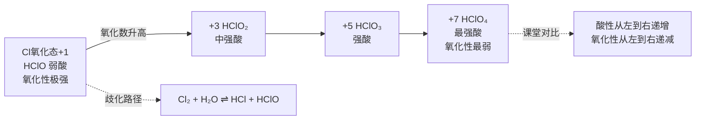
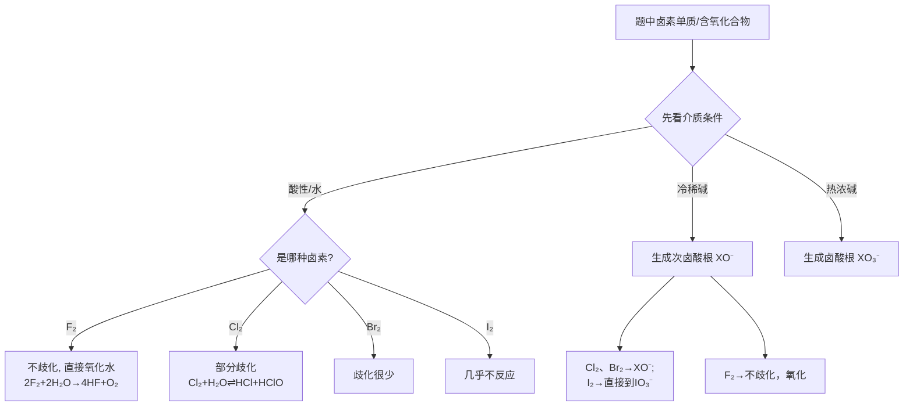

# 卤族元素

> **适用**：第二轮（提高班）
> **对应备课大纲**：[[04-课件/备课大纲/2026-06-03-氢与卤素-提高班]]
> **前置要求**：原子结构、周期律、VSEPR 理论、氧化还原基本概念
> **深度边界**：本讲聚焦卤素单质、卤化氢、卤素互化物、含氧酸四大板块的系统知识。不展开 E1/E2 消除竞争（→ SN/E 竞争专题），不深入歧化反应的热力学定量计算（→ 物化综合计算），不展开卤素化合物群论对称性分析。

---

## 学习目标

- ✅ 目标1：能解释卤素单质物理性质递变规律（颜色/熔沸点/氧化性）的结构原因。
- ✅ 目标2：能写出 Cl₂ 的实验室和工业制备方法，理解 F₂ 制备的特殊性（只能电解法）。
- ✅ 目标3：能解释 HF 的沸点异常和弱酸性，掌握 HX 酸性递变的本质（键能主导）。
- ✅ 目标4：能用 VSEPR 预测卤素互化物的分子构型（ClF₃ T 型、BrF₅ 四方锥、IF₇ 五角双锥）。
- ✅ 目标5：能系统描述氯的四种含氧酸（HClO/HClO₂/HClO₃/HClO₄）的酸性、氧化性递变规律。
- ✅ 目标6：能说出拟卤素的概念和典型代表（(CN)₂、(SCN)₂），写出其与卤素的类比反应。
- ✅ 目标7：能用氯的元素电势图判断 Cl₂ 在酸性和碱性条件下的歧化方向。

---

## 一、卤素通性与制备

### 1.1 卤素单质物理性质递变

| 性质 | F₂ | Cl₂ | Br₂ | I₂ |
|:---|:---:|:---:|:---:|:---:|
| 颜色 | 浅黄绿 | 黄绿 | 红棕 | 紫黑 |
| 常温状态 | 气体 | 气体 | 液体 | 固体 |
| 熔点 (K) | 53.5 | 172.2 | 265.9 | 386.8 |
| 沸点 (K) | 85.0 | 239.1 | 332.4 | 457.5 |
| 氧化性 | 极强 | 强 | 中 | 弱 |
| X⁻ 还原性 | 极弱 | 弱 | 中 | 强 |
| 键能 (kJ/mol) | 159（反常低）| 243 | 193 | 151 |
| 电负性 (Pauling) | 4.0 | 3.2 | 3.0 | 2.5 |

**递变规律**：F₂ → I₂ 颜色加深、熔沸点升高、**氧化性递减**、X⁻ 还原性递增。

![[media/solid-halogen-structure.jpg]]
*图 固体氯、溴、碘的层状结构 — 从 Cl₂ 到 I₂ 分子间距离依次压缩，碘已呈现半导体性质（Weller 图17.8）*

> 💡 **F₂ 键能反常低**：F 原子半径极小，2p 轨道重叠效率低（孤对电子-孤对电子排斥），使 F₂ 的键能（159 kJ/mol）反常地低于 Cl₂（243 kJ/mol）。这是竞赛高频考点。
>
> ![[media/halogen-bond-enthalpy.jpg]]
> *图 卤素分子键解离焓（Weller 图17.6）— F₂ 键能反常低（159 kJ/mol），低于 Br₂（193 kJ/mol）和 Cl₂（243 kJ/mol）*

### 1.2 制备方法

| 卤素 | 实验室制法 | 工业制法 | 特点 |
|:---|:---|:---|:---|
| F₂ | K₂MnF₆ + 2SbF₅ → 2KSbF₆ + MnF₃ + ½F₂（Christe 化学法）| 电解 KHF₂ 熔盐（Moisson 法）| 只能用特殊方法，F⁻ 极难氧化 |
| Cl₂ | MnO₂ + 4HCl(浓) → MnCl₂ + Cl₂↑ + 2H₂O | 电解饱和食盐水（氯碱工业）| 实验室可用氧化剂氧化 Cl⁻ |
| Br₂ | Cl₂ + 2Br⁻ → Br₂ + 2Cl⁻ | 海水提溴：Cl₂ 氧化 Br⁻ | 工业上从海水/卤水中提取 |
| I₂ | Cl₂ + 2I⁻ → I₂ + 2Cl⁻ | 海藻灰化→氧化 I⁻ | 从海带/卤水中提取 |

**F₂ 的特殊性**：
- F⁻ 极难氧化（φ° = +2.87 V，是最难氧化的阴离子之一）
- 无法通过化学氧化从 F⁻ 得到 F₂（没有任何氧化剂比 F₂ 更强）
- 电解时也不能在水溶液中电解（水会被氧化，电极反应先析 O₂ 而非 F₂）
- 只能用 **电解 KHF₂ 熔盐** 或 **Christe 化学法**（K₂MnF₆ + SbF₅）

> [!warning] 常见误区
> **误区**：认为 F₂ 键能应该最大（因为原子最小）。
> **正解**：虽然 F 原子半径最小，但孤对电子之间的斥力使 F₂ 的 F-F 键键能（159 kJ/mol）反常地低，甚至低于 Br₂（193 kJ/mol）。这个反常是竞赛常考点。

---

## 二、卤化氢

### 2.1 酸性递变

$$\text{HF} \ll \text{HCl} < \text{HBr} < \text{HI}$$

| 性质 | HF | HCl | HBr | HI |
|:---|:---:|:---:|:---:|:---:|
| 酸性 | **弱酸** | 强酸 | 强酸 | **最强酸** |
| Ka | 6.6×10⁻⁴ | ~10⁷ | ~10⁹ | ~10¹¹ |
| 沸点 (K) | **293**（异常高）| 188 | 206 | 237 |
| 键能 (kJ/mol) | 565（最大）| 431 | 366 | 299 |
| 还原性 | 极弱 | 弱 | 中 | **强** |
| 热稳定性 | **最高** | 高 | 中 | **低** |

**核心原因**：H—X 键能递减（HF 键能极大，不易解离），**键能是 HX 酸性的主导因素**。

> 💡 为什么 HF 是弱酸而 HCl 是强酸？
> 三因素综合作用：① H-F 键能最大（565 kJ/mol），解离需要更多能量；② F⁻ 水合能极大（-506 kJ/mol），部分补偿；③ HF 水溶液中存在氢键（F—H···F⁻ 形成 HF₂⁻），消耗部分 HF。最终净效应：HF 仅部分解离 → 弱酸。

### 2.2 氢键异常

HF 分子间形成 **强氢键**（H—F···H—F），导致沸点异常高（293 K，远高于 HCl 的 188 K）。其他 HX 无氢键，沸点仅受范德华力控制（随分子量增大而升高，HI > HBr > HCl > HF？注意无氢键时应是 HCl < HBr < HI，但 HF 因为氢键显著拉高）。

**HF 的特殊反应**：
- 刻蚀玻璃：$\mathrm{SiO_2 + 4HF \rightarrow SiF_4\uparrow + 2H_2O}$
- 必须用塑料瓶或铅皿盛装

**卤化银的溶解性**（鉴别卤离子的经典方法）：
$$\text{AgF} > \text{AgCl} > \text{AgBr} > \text{AgI}$$
白 → 白（光照变灰）→ 淡黄 → 黄，溶解度依次减小

### 2.3 无氧酸酸性比较的通用逻辑

> - **同周期**：H—X 键能越弱 → 越易解离 → 酸性越强（如 H₂S < HCl）
> - **同族**：X 原子半径越大 → H—X 键越长 → 越易断裂 → 酸性越强（HF < HCl < HBr < HI）
> - **同一元素不同氧化数**：中心原子氧化数越高 → 吸引电子越强 → O—H 键越易断裂 → 酸性越强

> [!warning] 卤化氢常见误区
> | 误区 | 正解 |
> |:---|:---|
> | "HF 是强酸" | HF 是 **弱酸**（Ka = 6.6×10⁻⁴），切不可认为所有 HX 都是强酸 |
> | "酸性强=热稳定性强" | 酸性 HI 最强，热稳定性 HF 最强——**两个顺序恰好相反** |
> | "F₂ 与水能发生歧化" | F₂ 无正氧化态，**不歧化**——直接氧化水：2F₂ + 2H₂O → 4HF + O₂ |

---

## 三、卤素歧化反应与元素电势图

### 3.1 氯的元素电势图（Latimer 图）

**酸性条件**（pH = 0）：

$$\mathrm{ClO_4^- \xrightarrow{1.19} ClO_3^- \xrightarrow{1.21} HClO_2 \xrightarrow{1.65} HClO \xrightarrow{1.61} Cl_2 \xrightarrow{1.36} Cl^-}$$

**碱性条件**（pH = 14）：

$$\mathrm{ClO_4^- \xrightarrow{0.36} ClO_3^- \xrightarrow{0.33} ClO_2^- \xrightarrow{0.66} ClO^- \xrightarrow{0.40} Cl_2 \xrightarrow{1.36} Cl^-}$$

**歧化反应判断规则**：对于相邻三种氧化态 A → B → C，若 $E^\ominus(\text{B→C}) > E^\ominus(\text{A→B})$，则 B 能歧化为 A 和 C。

![[media/halogen-frost-diagram.jpg]]
*图 卤素含氧酸的 Frost 图 — Weller《无机化学》第6版 图17.14。中间氧化态位于两相邻物种连线上方时易发生歧化*

### 3.2 Cl₂ 的歧化行为分析

| 条件 | 左半反应 E° | 右半反应 E° | E°_池 | 是否歧化 | 产物 |
|:---:|:---:|:---:|:---:|:---:|:---|
| 酸性 | Cl⁻/Cl₂: 1.36 V | Cl₂/HClO: 1.61 V | -0.25 V | 不歧化（逆向归中) | 逆向：HClO + HCl → Cl₂ |
| 碱性 | Cl⁻/Cl₂: 1.36 V | Cl₂/ClO⁻: 0.40 V | +0.96 V | **歧化** | Cl⁻ + ClO⁻ |

> 💡 **核心结论**：Cl₂ 在碱性条件下歧化，在酸性条件下不歧化（逆向归中反应自发）。这就是 84 消毒液（NaClO）不能与洁厕灵（HCl）混用的原因——归中反应产生有毒 Cl₂。

### 3.3 卤素与碱反应的温度效应

| 卤素 | 冷稀碱（<15°C） | 热浓碱（>70°C） |
|:---|:---|:---|
| Cl₂ | Cl₂ + 2OH⁻ → Cl⁻ + ClO⁻ + H₂O | 3Cl₂ + 6OH⁻ → 5Cl⁻ + ClO₃⁻ + 3H₂O |
| Br₂ | Br₂ + 2OH⁻ → Br⁻ + BrO⁻ + H₂O | 3Br₂ + 6OH⁻ → 5Br⁻ + BrO₃⁻ + 3H₂O |
| I₂ | 3I₂ + 6OH⁻ → 5I⁻ + IO₃⁻ + 3H₂O（**常温即到 IO₃⁻**）| 同左 |
| F₂ | 2F₂ + 4OH⁻ → 4F⁻ + O₂ + 2H₂O（**不歧化，氧化水**）| 同左 |

> 📝 **记忆口诀**："冷稀碱→次卤酸根，热浓碱→卤酸根；I₂ 特殊常温到碘酸；F₂ 特殊根本歧化不了。"

---

## 四、卤化物与卤素互化物

### 4.1 卤素互化物（XYₙ 型，n 为奇数）

**定义**：不同卤素原子之间形成的化合物。**电负性较小的卤素显正价，写在前面**。

| 分子 | 中心原子 | 价层电子对数 | 杂化方式 | 分子构型 | VSEPR 记号 |
|:---|:---:|:---:|:---:|:---:|:---:|
| ClF₃ | Cl | 5 | sp³d | T 型 | AX₃E₂ |
| BrF₅ | Br | 6 | sp³d² | 四方锥 | AX₅E |
| IF₇ | I | 7 | sp³d³ | 五角双锥 | AX₇ |
| ICl₃ | I | 5 | sp³d | T 型 | AX₃E₂ |
| ICl | I | 2 | sp | 直线 | AX₂ |

![[media/interhalogen-clf3.jpg]]　　![[media/interhalogen-brf5.jpg]]
*图 ClF₃（T 型）和 BrF₅（四方锥）的分子结构 — 来自 Weller《无机化学》第6版*

> ⚠️ **高频错误**：ICl₃ 中 I 的氧化数为 +3，不是 -3——Cl 电负性（3.2）大于 I（2.5），显负价。**命名**：三氯化碘（I 在前，Cl 在后——与常规命名相反，因为电负性小的在前）。

**ICl₃ 的二聚体**：气态 ICl₃ 实际以 **I₂Cl₆** 二聚体形式存在，8 个原子共平面，具有类似 Al₂Cl₆ 的桥键结构。

### 4.2 拟卤素

**定义**：某些由非金属原子组成的原子团，其性质与卤素单质相似。拟卤素也能形成"拟卤化氢"（如 HCN、HSCN）和"拟卤化银"等。

| 拟卤素 | 对应酸（酸性） | 银盐 | 特征 |
|:---|:---|:---:|:---|
| (CN)₂（氰）| HCN（弱酸）| AgCN↓（白色）| 剧毒 |
| (SCN)₂（硫氰）| HSCN（强酸）| AgSCN↓（白色）| 与 Fe³⁺ 显血红色 |
| (SeCN)₂（硒氰）| HSeCN | AgSeCN↓ | 类比 SCN |

**与卤素的类比反应**：

| 反应类 | 卤素反应 | 拟卤素类比 |
|:---|:---|:---|
| 与 H₂ | Cl₂ + H₂ → 2HCl | (CN)₂ + H₂ → 2HCN |
| 与金属 | Cl₂ + 2Na → 2NaCl | (CN)₂ + 2Na → 2NaCN |
| 歧化 | Cl₂ + 2OH⁻ → Cl⁻ + ClO⁻ + H₂O | (CN)₂ + 2OH⁻ → CN⁻ + CNO⁻ + H₂O |
| 与 Fe³⁺ 显色 | — | 3SCN⁻ + Fe³⁺ → Fe(SCN)₃（血红色）|

> 💡 **竞赛启示**：拟卤素的类比思维是元素推断题的常用思路——看到 CN⁻ 或 SCN⁻ 的反应，先思考 "如果换成 Cl⁻/Br⁻/I⁻ 会怎样？" 再反推。

---

## 五、卤素氧化物与含氧酸

### 5.1 氯的含氧酸体系

| 含氧酸 | 氧化态 | 非羟基氧数 | pKa | 酸性 | 氧化性 | 结构特点 |
|:---|:---:|:---:|:---:|:---|:---|:---|
| HClO（次氯酸）| +1 | 0 | 7.5 | 极弱酸 | **极强** | Cl—O—H |
| HClO₂（亚氯酸）| +3 | 1 | 2.0 | 中强酸 | 强 | — |
| HClO₃（氯酸）| +5 | 2 | -1.2 | 强酸 | 中强 | — |
| HClO₄（高氯酸）| +7 | 3 | -10 | **最强无机酸** | **极弱**（动力学惰性）| 正四面体 |

**核心递变规律**：

$$\text{氧化数升高} \rightarrow \text{酸性增强、氧化性减弱}$$

**解释**：
- **酸性递增**（Pauling 规则）：非羟基氧数 N 越多 → 中心 Cl 电负性越强 → O-H 键中电子被拉向 Cl → H⁺ 越易解离
- **氧化性递减**：Cl 氧化数越高 → Cl-O 键共价性越强 → 键越牢固 → 越难断裂释放氧化能力（热力学稳定性）；同时 ClO₄⁻ 对称性高 → 反应活化能大（动力学惰性）

> 💡 **热力学 vs 动力学**：HClO₄ 在溶液中氧化性很弱（热力学稳定，动力学惰性），但固体高氯酸盐是强氧化剂（高温分解）——"能不能反应"（热力学）≠ "反应快不快"（动力学）。

### 5.2 其他卤素的含氧酸

**溴的含氧酸**：
- 酸性递变规律同氯：HBrO < HBrO₂ < HBrO₃ < HBrO₄
- HBrO₄ 的氧化性反常地 **强于** HClO₄（原因是 Br 的 4d 轨道参与成键减弱了 Br-O 键的稳定性）

**碘的含氧酸**：
- 高碘酸的化学式为 **H₅IO₆**（不是 HIO₄！），为六配位八面体结构
- HIO₄ 形式存在但脱水为 H₅IO₆
- H₅IO₆ 为中强酸（pKa₁ = 1.6），氧化性强

**卤素含氧酸稳定性**：HClO > HBrO > HIO（同族从上到下稳定性递减）

### 5.3 歧化反应

**Cl₂ 的水中歧化**：
- Cl₂ + H₂O ⇌ HCl + HClO（K 很小，~4.2×10⁻⁴，方向依赖 pH）
- **碱性条件歧化更彻底**：Cl₂ + 2OH⁻ → Cl⁻ + ClO⁻ + H₂O
- **热碱中进一步歧化**：3Cl₂ + 6OH⁻ → 5Cl⁻ + ClO₃⁻ + 3H₂O

> 💡 **规律**：低温碱 → 次氯酸盐（漂白液）；高温碱 → 氯酸盐（氯酸钾原料）。这是因为 ClO⁻ 在高温下自身歧化：3ClO⁻ → 2Cl⁻ + ClO₃⁻。

### 5.4 含氧酸酸性-氧化性递变图

> [!warning] 含氧酸常见误区
> | 误区 | 正解 |
> |:---|:---|
> | "含氧酸中心原子氧化数越高，氧化性越强" | **反了！** 次氯酸（+1）氧化性最强，高氯酸（+7）氧化性最弱 |
> | "高氯酸是强酸，所以也是强氧化剂" | 酸性强 ≠ 氧化性强。HClO₄ 是最强无机酸，但溶液中氧化性极弱 |
> | "酸性越强 = 反应越快" | 热力学与动力学是两回事。ClO₄⁻ 对称性高→活化能大→反应慢 |

---

## 六、方法总结与思维框架

### 6.1 卤素介质判定决策树

### 6.2 卤素含氧酸规律口诀

> "氧化数升酸增强，非羟氧数是关键；
> 氧化性却反着走，次氯最强高氯弱；
> 热力稳来动力惰，对称越高越慢活。"

### 6.3 卤素推断题四步法

| 步骤 | 做什么 | 示例 |
|:---|:---|:---|
| **1. 颜色状态定位** | 看颜色 → 锁定哪种卤素 | 黄绿气体 → Cl₂；红棕液体 → Br₂ |
| **2. 介质条件判产物** | 酸/碱/冷/热 → 歧化产物 | 冷碱 → ClO⁻；热碱 → ClO₃⁻ |
| **3. 沉淀显色验证** | AgX 颜色、CCl₄ 萃取、KI-淀粉 | AgCl 白、AgBr 淡黄、AgI 黄 |
| **4. 反常点检查** | F₂ 不歧化、HF 弱酸、ICl 中 I 正价 | 确认没有机械套递变规律 |

---

## 七、典型例题

### 例题 1：卤素置换顺序 ⭐⭐

**题目**：将 Cl₂ 通入含有 Br⁻ 和 I⁻ 的混合溶液中，预测反应先后顺序并写出离子方程式。如何用实验验证产物？

**思路分析**：
看到"Cl₂ 通入混合卤离子" → 想到卤素氧化性顺序：F₂ > Cl₂ > Br₂ > I₂ → 对应卤离子还原性顺序：I⁻ > Br⁻ > Cl⁻ > F⁻。Cl₂ 优先氧化更强的还原剂 → 先氧化 I⁻。

**解答**：

(1) 反应先后顺序：
- **第一步**（优先）：$\mathrm{Cl_2 + 2I^- \rightarrow 2Cl^- + I_2}$（I⁻ 还原性更强）
- **第二步**（Cl₂ 足量时）：$\mathrm{Cl_2 + 2Br^- \rightarrow 2Cl^- + Br_2}$

(2) 实验验证：用 CCl₄ 萃取
- **先** 观察到 CCl₄ 层呈 **紫色**（I₂ 在 CCl₄ 中溶解呈紫色）
- **后**（继续通 Cl₂）CCl₄ 层变为 **红棕色**（Br₂ 在 CCl₄ 中呈红棕色）

(3) **本质解释**：电极电势比较
- $E^\ominus(\mathrm{Cl_2/Cl^-}) = 1.36\ \mathrm{V}$
- $E^\ominus(\mathrm{Br_2/Br^-}) = 1.07\ \mathrm{V}$
- $E^\ominus(\mathrm{I_2/I^-}) = 0.54\ \mathrm{V}$
- Cl₂ 氧化 I⁻ 的 ΔG 更负 → 优先氧化 I⁻

**反思**：这题考查的不是"谁反应"，而是"谁先反应"——同一氧化剂对混合还原剂的氧化顺序由电极电势差决定。

---

### 例题 2：卤素歧化反应与电势图 ⭐⭐⭐

**题目**：已知氯在碱性介质中的 Latimer 图：ClO⁻ →(0.40 V) Cl₂ →(1.36 V) Cl⁻。
(1) 判断 Cl₂ 在碱性条件下能否歧化，并写出相应离子方程式。
(2) 为什么 84 消毒液（NaClO 溶液）不能与洁厕灵（主要成分 HCl）混用？写出反应方程式。

**思路分析**：
第一步：歧化判断——中间氧化态 Cl₂ 左右两边的电势比较。若 E°(右) > E°(左) → 歧化自发。
第二步：逆向归中——酸性条件下 Cl₂ 不歧化，逆向反应自发。

**解答**：

(1) Cl₂ 歧化判断：
- $E^\ominus_{\text{池}} = E^\ominus(\mathrm{Cl_2/Cl^-}) - E^\ominus(\mathrm{ClO^-/Cl_2}) = 1.36 - 0.40 = +0.96\ \mathrm{V} > 0$
- → **歧化自发**
- 离子方程式：$\mathrm{Cl_2 + 2OH^- \rightarrow Cl^- + ClO^- + H_2O}$

(2) 酸性条件逆向归中：
- 酸性条件下 Cl₂ 不歧化（E°_池 = -0.25 V）
- **逆向反应自发**：$\mathrm{ClO^- + Cl^- + 2H^+ \rightarrow Cl_2\uparrow + H_2O}$
- 84 消毒液（含 ClO⁻）与洁厕灵（含 HCl / H⁺ 和 Cl⁻）混合 → 产生有毒 Cl₂ 气体 → 不能混用！

**反思**：同一体系在不同酸碱介质中反应方向可能完全相反。元素电势图是判断歧化方向的核心工具。

---

### 例题 3：HF 反常酸性解释 ⭐⭐

**题目**：HF 的 Ka = 6.6×10⁻⁴（弱酸），而 HCl 是强酸（Ka ~ 10⁷），两者相差 10¹⁰ 倍。从结构角度解释为什么 HF 的酸性显著弱于 HCl。

**思路分析**：
看到"HF 弱酸 vs HCl 强酸" → 想到 H-X 键能差异 + F⁻ 水合能 + 氢键三重因素。核心是 H-F 键能极大（565 kJ/mol），解离需要更多能量。

**解答**：

HF 酸性弱于 HCl 的三重原因：

| 因素 | HF | HCl | 比较结果 |
|:---|:---:|:---:|:---:|
| H-X 键能 (kJ/mol) | **565** | 431 | HF 键能最大 → 最难解离（主导因素）|
| X⁻ 水合能 (kJ/mol) | -506 | -351 | F⁻ 水合能极大 → 部分补偿，但不足以逆转 |
| 氢键影响 | 水溶液中存在 HF₂⁻ | 无 | 消耗部分 HF，降低表观酸性 |

**综合结论**：虽然 F⁻ 的水合能很大，但 H-F 键能过大这一"不利因素"占主导地位，导致 HF 仅为弱酸。

---

### 例题 4：卤素互化物结构判断 ⭐⭐⭐

**题目**：用 VSEPR 理论判断 ICl₃ 和 BrF₅ 的分子构型，给出中心原子的杂化方式和孤对电子数。

**思路分析**：
VSEPR 标准流程：计算中心原子价层电子对数 → 电子对几何 → 根据孤对电子位置确定实际构型。

**解答**：

(1) **ICl₃**：
- 中心 I 原子价电子数 = 7，3 个 Cl 各提供 1 个电子
- 价层电子对数 = (7+3)/2 = **5**
- 成键数 = 3，孤对电子数 = 5 - 3 = **2**
- 杂化：**sp³d**
- 构型：**T 型**（三角双锥中 3 个成键对 + 2 个孤对，孤对在平面位置）

(2) **BrF₅**：
- 中心 Br 原子价电子数 = 7，5 个 F 各提供 1 个电子
- 价层电子对数 = (7+5)/2 = **6**
- 成键数 = 5，孤对电子数 = 6 - 5 = **1**
- 杂化：**sp³d²**
- 构型：**四方锥**（八面体中 5 个 F + 1 个孤对，孤对在棱锥顶点）

**反思**：卤素互化物是 VSEPR 理论应用的理想体系。关键是准确计算孤对电子数——孤对越多，实际构型与电子对几何的偏离越大。

---

### 例题 5：含氧酸综合比较 ⭐⭐

**题目**：比较 HClO、HClO₃、HClO₄ 的酸性和氧化性，解释"酸性递增、氧化性递减"的反向规律。

**思路分析**：
看到"含氧酸酸性 vs 氧化性" → 使用 Pauling 规则解释酸性（非羟基氧数），使用 Cl-O 键强度解释氧化性。

**解答**：

| 含氧酸 | 非羟基氧数 N | pKa | 酸性 | Cl-O 键强度 | 氧化性 |
|:---|:---:|:---:|:---|:---|:---:|
| HClO | 0 | 7.5 | 极弱酸 | 弱 | 极强 |
| HClO₃ | 2 | -1.2 | 强酸 | 强 | 中 |
| HClO₄ | 3 | -10 | 极强酸 | 最强 | 极弱 |

**反向规律解释**：
1. **酸性递增**（Pauling 规则）：pKa = 7 - 5N（N 为非羟基氧数）。N 越大 → 中心 Cl 电负性越强 → O-H 键极性越强 → H⁺ 越易解离
2. **氧化性递减**：Cl 氧化数越高 → Cl-O 键共价性越强 → 键越牢固 → 越难断裂释放氧化能力。ClO₄⁻ 中 Cl-O 键极强且对称性高 → 反应活化能大 → 溶液中动力学惰性

---

### 例题 6：拟卤素类比推理 ⭐⭐⭐

**题目**：已知 Cl₂ + 2NaOH(冷) → NaCl + NaClO + H₂O。预测 (CN)₂ 与 NaOH 反应的产物，并写出配平的离子方程式。类似地，写出 (CN)₂ 与 H₂ 反应的方程式。

**思路分析**：
看到"拟卤素" → 类比 Cl₂ 的反应模式：Cl₂ 中 Cl(0) → Cl(-1) + Cl(+1)。同理，(CN)₂ 中 C 的氧化数可类比分配。

**解答**：

(1) (CN)₂ 与 NaOH 反应（类比 Cl₂ 歧化）：
$$\mathrm{(CN)_2 + 2OH^- \rightarrow CN^- + CNO^- + H_2O}$$
- CN⁻（氰根，对应 Cl⁻）
- CNO⁻（氰酸根，对应 ClO⁻）

(2) (CN)₂ 与 H₂ 反应：
$$\mathrm{(CN)_2 + H_2 \rightarrow 2HCN}$$
（类似 Cl₂ + H₂ → 2HCl）

**反思**：
- 拟卤素/卤素的类比如同一面双面镜——**主体结构**相同（歧化、与 H₂ 反应、与金属反应），但**细节数据**不同（HCN 是弱酸，HPF 对酸的强度、毒性等）
- 考试中如果遇到不熟悉的拟卤素化合物，先尝试类比卤素的对应反应，再根据具体条件调整

---

## 八、核心速查卡

### 8.1 卤素单质性质总结

| 递变方向（F₂ → I₂） | 变化趋势 | 原因 |
|:---|:---:|:---|
| 颜色 | 浅 → 深 | 电子吸收光谱向长波方向移动 |
| 熔沸点 | 升 → 高 | 色散力随分子量增大而增大 |
| 氧化性 | 减 → 弱 | E°值递减（F₂: +2.87, Cl₂: +1.36, Br₂: +1.07, I₂: +0.54 V）|
| X⁻ 还原性 | 增 → 强 | X⁻ 半径增大→失电子能力增强 |
| HX 酸性 | 增 → 强 | H-X 键长增大→键能减小→更易解离 |

### 8.2 常见卤素互化物 VSEPR 速查

| 分子 | 价电子对数 | 孤对电子 | 杂化 | 构型 | VSEPR 记号 |
|:---|:---:|:---:|:---:|:---:|:---:|
| ClF₃ | 5 | 2 | sp³d | T 型 | AX₃E₂ |
| BrF₅ | 6 | 1 | sp³d² | 四方锥 | AX₅E |
| IF₇ | 7 | 0 | sp³d³ | 五角双锥 | AX₇ |
| ICl₃ | 5 | 2 | sp³d | T 型 | AX₃E₂ |
| ICl | 2 | 0 | sp | 直线 | AX₂ |

### 8.3 拟卤素速查

| (CN)₂ | (SCN)₂ |
|:---|:---|
| HCN — 弱酸 | HSCN — 强酸 |
| AgCN↓ — 白色 | AgSCN↓ — 白色 |
| 剧毒 | Fe(SCN)₃ 血红色（Fe³⁺ 鉴定）|

### 8.4 元素电势图歧化判断流程

> 检查中间氧化态 → 比较 E°(右) vs E°(左) → E°(右) > E°(左) → 歧化自发

---

## 练习题

### 基础巩固

**1.** ⭐ 写出 F₂、Cl₂、Br₂、I₂ 在常温下的颜色和状态，并说明递变原因。

**2.** ⭐ 写出 HF、HCl、HBr、HI 的酸性顺序，并解释为什么 HF 是弱酸。

**3.** ⭐⭐ 写出 Cl₂ 分别与冷 NaOH 和热 NaOH 反应的化学方程式。为什么产物不同？

**4.** ⭐⭐ 用 VSEPR 理论判断 ClF₃ 的分子构型，写出中心原子的杂化方式和孤对电子数。

**5.** ⭐ 写出两种拟卤素及其对应酸的化学式。

### 提高训练

**6.** ⭐⭐⭐ 已知氯在酸性条件下的 Latimer 图：ClO₃⁻ →(1.21 V) HClO₂ →(1.65 V) HClO →(1.61 V) Cl₂ →(1.36 V) Cl⁻。判断 HClO₂（亚氯酸）能否歧化，并说明判断依据。

**7.** ⭐⭐⭐ 某红棕色液体 A 与 NaOH 溶液反应，生成无色溶液 B 和无色溶液 C。在 B 中加入 AgNO₃ 溶液产生淡黄色沉淀 D。在 C 中加入稀 H₂SO₄ 酸化后，再加入 KI 淀粉溶液，溶液变蓝。已知 A 的氧化性介于 Cl₂ 和 I₂ 之间。请推断 A、B、C、D，并写出相关反应方程式。

**8.** ⭐⭐⭐ 解释为什么 Cl₂ 可以用水溶液电解法（氯化钠溶液）制备，而 F₂ 必须用熔盐电解法？写出相关的电极反应方程式。

### 参考答案

**1.** F₂ 浅黄绿色气体 → Cl₂ 黄绿色气体 → Br₂ 红棕色液体 → I₂ 紫黑色固体。
- **原因**：分子量增大 → 色散力增强 → 熔沸点升高。F₂ 和 Cl₂ 在室温下为气体，Br₂ 为液体，I₂ 为固体。

**2.** 酸性：**HF < HCl < HBr < HI**
- HF 为弱酸的原因（三重因素）：① H-F 键能极大（565 kJ/mol），解离困难；② F⁻ 水合能大（-506 kJ/mol），部分补偿但仍不足；③ HF 水溶液存在氢键形成 HF₂⁻，消耗部分 HF。
- **核心：键能是 HX 酸性的主导因素**。

**3.**
- 冷 NaOH：Cl₂ + 2NaOH → NaCl + NaClO + H₂O（次氯酸钠，漂白液）
- 热 NaOH：3Cl₂ + 6NaOH → 5NaCl + NaClO₃ + 3H₂O（氯酸钠）
- 产物不同的原因：**温度效应**——ClO⁻ 在高温下不稳定，发生歧化：3ClO⁻ → 2Cl⁻ + ClO₃⁻
- **思路**：看到碱性 + 卤素 → 先判温度 → 再定产物。冷→XO⁻，热→XO₃⁻。

**4.** ClF₃：
- 价层电子对数 = (7+3)/2 = 5
- 成键 3，孤对 2
- 杂化：**sp³d**；构型：**T 型**（AX₃E₂）

**5.** (CN)₂（对应酸 HCN，弱酸）、(SCN)₂（对应酸 HSCN，强酸）

**6.** HClO₂ 能否歧化？判断 HClO₂ →(1.65 V) HClO 和 HClO₂ ←(1.21 V) ClO₃⁻（注意方向）：
- 实际判断需看：HClO₂ 歧化为 ClO₃⁻ 和 HClO？
- 检查三元组：ClO₃⁻ → HClO₂ → HClO
- E°(HClO₂/HClO) = 1.65 V，E°(ClO₃⁻/HClO₂) = 1.21 V
- 因为 E°(右) > E°(左)，**HClO₂ 能歧化**为 ClO₃⁻ 和 HClO
- **思路**：电势图从左到右读，中间氧化态右侧 E° > 左侧 E° → 歧化自发。

**7.**
- **推断**：红棕色液体 A，氧化性介于 Cl₂ 和 I₂ 之间 → A = **Br₂**
- B 含 AgBr 淡黄色沉淀 D 所对应的阴离子 → B 含 **Br⁻**
- C 酸化后使 KI 淀粉变蓝 → C 含 **BrO₃⁻**（在酸性条件下氧化 I⁻ 生成 I₂）
- **所以**：A = Br₂，B = NaBr，C = NaBrO₃，D = AgBr

**反应方程式**：
- Br₂ + 2NaOH(冷) → NaBr + NaBrO + H₂O（但 BrO⁻ 不稳定，继续歧化）
- 3Br₂ + 6NaOH(热) → 5NaBr + NaBrO₃ + 3H₂O（BrO₃⁻ 在酸性下与 I⁻ 反应）
- NaBr + AgNO₃ → AgBr↓（淡黄色）+ NaNO₃
- BrO₃⁻ + 6I⁻ + 6H⁺ → Br⁻ + 3I₂ + 3H₂O（I₂ 使淀粉变蓝）

**8.**
- Cl₂ 电解食盐水（阳极：2Cl⁻ → Cl₂ + 2e⁻，E° = +1.36 V），此时水溶液中 Cl⁻ 氧化电势低于 O₂ 析出电势 → Cl⁻ 优先被氧化
- F₂ 无法在水溶液中制备，因为：
  - 阳极反应：2F⁻ → F₂ + 2e⁻，E° = +2.87 V
  - 水的氧化：2H₂O → O₂ + 4H⁺ + 4e⁻，E° = +1.23 V
  - **水的氧化电势更低 → O₂ 优先析出**，永远得不到 F₂
- 所以 F₂ 必须用 **无水熔盐电解**（KHF₂ 熔盐，~300°C）
- **思维要点**：E°(F₂/F⁻) > E°(O₂/H₂O) → 水溶液中 F⁻ 不可能先被氧化
