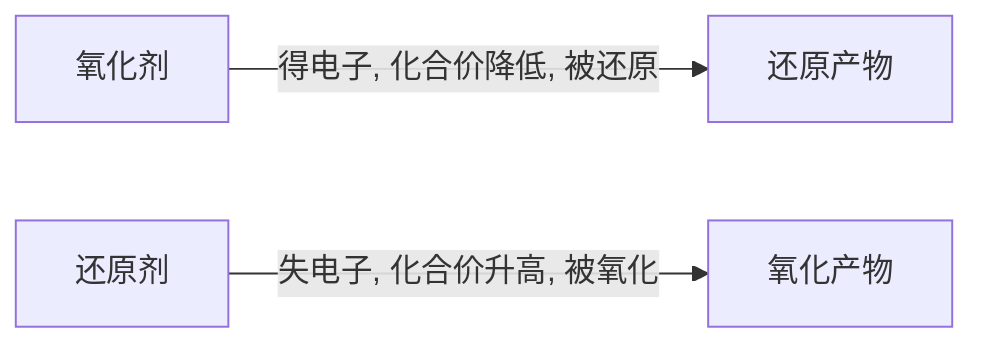

# 氧化还原反应

> **适用**：第一轮（初学）→ 第二轮（深化）
> **前置要求**：化学式与化合价的基本概念、化学方程式的初步配平、原子结构与电子排布的初步认识
> **深度边界**：第一轮聚焦（1）氧化数的概念与确定规则；（2）氧化剂/还原剂、氧化/还原的概念辨析与强弱比较；（3）化合价升降法配平（含各种复杂类型）；（4）离子-电子法配平（半反应法，含酸碱性介质处理）；（5）得失电子守恒在计算中的应用。不展开待定系数法的复杂推导、拆合法的高阶应用、完整电极电势理论（后者在电化学中展开）。

---

## 学习目标

- ✅ 目标1：能根据规则正确计算化合物中任意元素的氧化数，区分氧化数与化合价的差异。
- ✅ 目标2：能准确辨析氧化还原反应中的基本概念——氧化剂/还原剂、氧化反应/还原反应、氧化产物/还原产物，并能在电子转移表示法中正确标注。
- ✅ 目标3：能用三种定性方法比较氧化剂（或还原剂）的相对强弱，知道电极电势是定量比较的终极工具。
- ✅ 目标4：能用化合价升降法配平各类氧化还原反应方程式（含同种元素变价、多种元素同时变价、含字母系数等复杂情况）。
- ✅ 目标5：能用离子-电子法（半反应法）配平不同介质（酸性/碱性/中性）中的氧化还原离子方程式。
- ✅ 目标6：能运用得失电子守恒法解决氧化还原反应中的定量计算问题（含多步反应的全程电子守恒）。

---

## 一、氧化数

### 1.1 氧化数的定义

1970 年 IUPAC 将**氧化数（oxidation number）**定义为：在单质或化合物中，假设将每个化学键中的电子指定给所连接两原子中电负性较大的原子，这样所得的某元素一个原子的电荷数即为该元素的氧化数。

氧化数是一个**人为规定**的、经验性的概念，用来表征元素在化合状态时的形式电荷（或称表观电荷数）。这种形式电荷只有形式上的意义，并不代表原子所带的真实电荷。

> 💡 **直观理解**：氧化数可以看作"抢电子游戏"的结果——电负性大的原子"抢走"共用电子对，电负性小的原子"失去"电子对，最终各自身上留下的"形式电荷"就是氧化数。

### 1.2 氧化数的确定规则

**规则一：单质中元素的氧化数为零。**
例如：$\mathrm{H_2}$ 中 H 为 0，$\mathrm{O_2}$ 中 O 为 0，$\mathrm{Fe}$ 中 Fe 为 0。

**规则二：离子化合物中，元素原子的氧化数等于该元素单原子离子的电荷数。**
例如：$\mathrm{NaCl}$ 中 Na 为 +1，Cl 为 -1。

**规则三：共价化合物中，将共用电子对指定给电负性较大的原子，从而确定各原子的氧化数。**

| 化合物 | 电负性比较 | 结果 |
|:---|:---|:---|
| $\mathrm{HCl}$ | $\chi_{\mathrm{Cl}} > \chi_{\mathrm{H}}$ | Cl: -1, H: +1 |
| $\mathrm{H_2O}$ | $\chi_{\mathrm{O}} > \chi_{\mathrm{H}}$ | O: -2, H: +1 |
| $\mathrm{NH_3}$ | $\chi_{\mathrm{N}} > \chi_{\mathrm{H}}$ | N: -3, H: +1 |

**规则四：同种元素原子之间形成共价键时，该键对氧化数无贡献（因电负性相同）。**
例如在 $\mathrm{H_2O_2}$ 中，两个氧原子之间有一共用电子对，由于电负性一致，此键对两氧原子的氧化数贡献均为 0。每个氧原子另与一个氢原子成键（O 得电子 → -1），因此 $\mathrm{H_2O_2}$ 中 O 的氧化数为 -1。

**规则五：分子或复杂离子的总电荷数等于其中各元素氧化数的代数和。**
- 中性分子：氧化数代数和 = 0
- 离子：氧化数代数和 = 离子电荷

**规则六：常见元素的固定氧化数（需记忆）：**

| 元素 | 一般规则 | 例外 |
|:---|:---|:---|
| **H** | +1（非金属化合物中） | -1（金属氢化物如 $\mathrm{LiH}$、$\mathrm{CaH_2}$） |
| **O** | -2 | -1（过氧化物如 $\mathrm{H_2O_2}$、$\mathrm{Na_2O_2}$）；+2（$\mathrm{OF_2}$） |
| **F** | -1（永远） | 无例外 |
| **其他卤素** | -1（与金属或H化合时） | 正数（与电负性更大的卤素或氧结合时，如 $\mathrm{ClF}$、$\mathrm{ICl_3}$） |
| **碱金属** | +1 | — |
| **碱土金属** | +2 | — |

### 1.3 氧化数与化合价的区别

| 对比项 | 氧化数 | 化合价 |
|:---|:---|:---|
| **定义** | 形式电荷数，人为规定 | 原子间化合时数目比例关系 |
| **数值** | 可为分数（如 $\mathrm{Fe_3O_4}$ 中 Fe 的氧化数为 +8/3） | 必须是整数（$\mathrm{Fe_3O_4}$ 中 Fe 实际有 +2 和 +3 两种价态） |
| **本质** | 表观电荷，电子归属的约定 | 实际成键能力的反映 |

中学化学中使用的"化合价"实际指的是**氧化数**，与大学化学中的"化合价"概念不同。本章后续内容使用的"化合价"均指氧化数。

> ⚠️ **易错点**：氧化数可以为分数（如 $\mathrm{S_4O_6^{2-}}$ 中 S 的氧化数为 +2.5，$\mathrm{Fe_3O_4}$ 中 Fe 为 +8/3），化合价必须是整数。

---

## 二、氧化还原反应的基本概念

### 2.1 核心概念辨析

**氧化还原反应**的特征是反应前后元素化合价（氧化数）发生变化，其实质是电子转移（包括电子得失和共用电子对偏移）。



| 概念 | 定义 | 示例（$\mathrm{CuO + H_2 \xrightarrow{\Delta} Cu + H_2O}$） |
|:---|:---|:---|
| **氧化剂** | 得电子的反应物，化合价降低 | $\mathrm{CuO}$（Cu 从 +2 → 0） |
| **还原剂** | 失电子的反应物，化合价升高 | $\mathrm{H_2}$（H 从 0 → +1） |
| **氧化反应** | 还原剂被氧化的过程（化合价升高） | $\mathrm{H_2 \to H_2O}$ |
| **还原反应** | 氧化剂被还原的过程（化合价降低） | $\mathrm{CuO \to Cu}$ |
| **氧化产物** | 还原剂被氧化后生成的产物 | $\mathrm{H_2O}$ |
| **还原产物** | 氧化剂被还原后生成的产物 | $\mathrm{Cu}$ |

> ⚠️ **最常见的混淆**：氧化剂本身发生**还原**反应（被还原），生成**还原**产物；还原剂本身发生**氧化**反应（被氧化），生成**氧化**产物。"剂"与"产物"是相反关系——"氧化剂被还原"是最容易记反的地方。

### 2.2 电子转移的表示方法——单线桥法

**单线桥法**的要点：从化合价升高的元素出发，指向化合价降低的元素，桥上标注转移的电子总数（等于化合价升高或降低的总数）。

**示例**：$\mathrm{KClO_3 + 6HCl = KCl + 3Cl_2 + 3H_2O}$

```
① 标化合价：KClO₃中Cl为+5，HCl中Cl为-1，Cl₂中Cl为0
② 分析电子转移：
   KClO₃：Cl从+5→0，得5e⁻（被还原）
   HCl中部分Cl：Cl从-1→0，失1e⁻/个（被氧化）
③ 关键判断：KClO₃是被还原到0价还是-1价？
   若到-1价→转移6e⁻；若到0价→转移5e⁻
   根据"电子转移数少，反应易完成"→到0价
④ 标注：5e⁻从6个HCl中的Cl转移到KClO₃中的Cl
```

> 💡 **经验法则**：当某元素在产物中以中间价态出现时，先判断该元素从反应物到产物是升价还是降价，再确定电子转移方向。一个常见技巧是——氧化剂被还原到何种价态，取决于反应条件下哪种产物更稳定且电子转移路径更短。

### 2.3 氧化性/还原性强弱的比较

#### 方法一：根据金属/非金属活动性顺序

- 金属单质的还原性越强 → 其相应阳离子的氧化性越弱
- 非金属单质的氧化性越强 → 其相应阴离子的还原性越弱

例如：$\mathrm{Na}$ 还原性强于 $\mathrm{Cu}$，因此 $\mathrm{Na^+}$ 的氧化性弱于 $\mathrm{Cu^{2+}}$。

#### 方法二：根据氧化还原反应的方向

**规律**：氧化性：氧化剂 > 氧化产物；还原性：还原剂 > 还原产物。

即反应 $\ce{氧化剂 + 还原剂 -> 还原产物 + 氧化产物}$ 中，氧化剂的氧化性强于氧化产物，还原剂的还原性强于还原产物。

**示例**：已知某温度下发生三个反应：

$$
\begin{aligned}
&\text{① } \mathrm{C + CO_2 = 2CO} \\
&\text{② } \mathrm{C + H_2O = CO + H_2} \\
&\text{③ } \mathrm{CO + H_2O = CO_2 + H_2}
\end{aligned}
$$

判断 C、CO、H₂ 的还原性强弱顺序。

**推理**：由反应①，C 是还原剂、CO 是氧化产物 → 还原性 C > CO
由反应②，C 是还原剂、H₂ 是氧化产物 → 还原性 C > H₂
由反应③，CO 是还原剂、H₂ 是氧化产物 → 还原性 CO > H₂
综合得：**还原性 C > CO > H₂**。

#### 方法三：根据反应条件（难易程度）

反应条件越温和，氧化剂（或还原剂）的氧化性（或还原性）越强。

**示例**：$\mathrm{KMnO_4}$ 在室温下即可与盐酸反应产生 $\mathrm{Cl_2}$，而 $\mathrm{MnO_2}$ 必须在加热条件下与浓盐酸反应才能产生 $\mathrm{Cl_2}$，因此氧化性：**$\mathrm{KMnO_4 > MnO_2}$**。

#### 方法四：电极电势（定量比较）

> 📌 电极电势 $\varphi^\circ$ 是氧化性/还原性强弱的**定量**判据。$\varphi^\circ$ 越大，对应氧化型物质的氧化性越强；$\varphi^\circ$ 越小，对应还原型物质的还原性越强。详见 [[04-课件/学生讲义/2026-06-23-电化学基础]]。

![[media/10-1-zn-cu-galvanic-cell.jpg|锌-铜原电池示意图]]
*图 锌-铜原电池——Zn 片插入 ZnSO₄ 溶液、Cu 片插入 CuSO₄ 溶液，两烧杯用盐桥（KCl 饱和溶液胶冻的 U 形管）连接。Zn 被氧化（Zn → Zn²⁺ + 2e⁻），Cu²⁺ 被还原（Cu²⁺ + 2e⁻ → Cu），电子经导线从 Zn 极流向 Cu 极产生电流。该装置直观展示了氧化还原反应中电子转移与电能转化的关系（普化原理第4版 图10.1）*

---

## 三、氧化还原反应方程式的配平——化合价升降法

化合价升降法（也称电子守恒法）是配平氧化还原反应最核心、最通用的方法。其依据为：
1. **电子守恒**：化合价升高总数 = 化合价降低总数（得失电子数相等）
2. **质量守恒**：反应前后各元素原子总数相等
3. **电荷守恒**（离子反应）：反应前后离子电荷总数相等

### 3.1 标准配平步骤（五步法）

以 $\mathrm{K_2Cr_2O_7 + KI + H_2SO_4 \to K_2SO_4 + Cr_2(SO_4)_3 + I_2 + H_2O}$ 为例：

**Step 1：标化合价**
$$
\mathrm{K_2\overset{+6}{Cr}_2O_7 + \overset{-1}{K}I + H_2SO_4 \to K_2SO_4 + \overset{+3}{Cr_2}(SO_4)_3 + \overset{0}{I_2} + H_2O
$$

变价元素：$\mathrm{Cr:\ +6 \to +3}$（降低）；$\mathrm{I:\ -1 \to 0}$（升高）。

**Step 2：计算得失电子数，确定基本系数**

关键：确定变价元素的原子个数。从 $\mathrm{K_2Cr_2O_7}$ 着手 → 2 个 Cr 原子参与变价。
$$
\overset{+6}{\mathrm{Cr_2}} \xrightarrow{得\,2\times3e^-} \overset{+3}{\mathrm{Cr_2}} \quad \text{降低 } 6
$$
$$
\overset{-1}{2\mathrm{I}} \xrightarrow{失\,2\times1e^-} \overset{0}{\mathrm{I_2}} \quad \text{升高 } 2
$$

**Step 3：求最小公倍数**
$$
\underset{\downarrow\,6\,\times\,1}{\mathrm{K_2Cr_2O_7}} \;+\; \underset{\uparrow\,2\,\times\,3}{6\mathrm{KI}}
$$

即：$\mathrm{K_2Cr_2O_7}$ 系数为 1，KI 系数为 6。

**Step 4：用观察法配平其他物质系数**

根据原子守恒依次配平：
- K 原子：右边 4 个 $\mathrm{K_2SO_4}$（左边 1 个 $\mathrm{K_2Cr_2O_7}$ + 6 个 KI 提供 8 个 K）
- 等等。

**Step 5：完成配平并检查**
$$
\boxed{\mathrm{K_2Cr_2O_7 + 6KI + 7H_2SO_4 = 4K_2SO_4 + Cr_2(SO_4)_3 + 3I_2 + 7H_2O}}
$$

### 3.2 特殊类型一：生成物着手（部分变价）

当反应物中某元素只有部分原子化合价发生变化时，宜从生成物着手分析。

**示例**：配平 $\mathrm{Fe(NO_3)_3 \xrightarrow{\Delta} Fe_2O_3 + NO_2 + O_2}$

**分析**：
- $\mathrm{Fe(NO_3)_3}$ 中 N 为 +5 → $\mathrm{NO_2}$ 中 N 为 +4，得 1e⁻/N
- $\mathrm{Fe(NO_3)_3}$ 中 O 为 -2 → $\mathrm{O_2}$ 中 O 为 0，失 2e⁻/O，即 4e⁻/$\mathrm{O_2}$
- 从生成物 $\mathrm{O_2}$ 入手：每生成 1 分子 $\mathrm{O_2}$ 失 4e⁻
- 从 $\mathrm{Fe(NO_3)_3}$ 入手：每分子有 3 个 N 全部变价，得 3e⁻

以 $\mathrm{O_2}$ 为基准确定系数：
$$
\underset{\text{得 }3\times4}{\mathrm{Fe(NO_3)_3}} \quad \underset{\text{失 }4\times3}{\mathrm{O_2}}
$$

配平得：
$$
\boxed{4\mathrm{Fe(NO_3)_3} = 2\mathrm{Fe_2O_3} + 12\mathrm{NO_2\uparrow} + 3\mathrm{O_2\uparrow}}
$$

### 3.3 特殊类型二：一种物质中多种元素同时变价

**示例**：配平 $\mathrm{FeS_2 + O_2 \to Fe_2O_3 + SO_2}$

**分析**：$\mathrm{FeS_2}$ 中 Fe 从 +2→+3（升 1），S 从 -1→+4（升 5），且比例固定为 $\mathrm{Fe:S = 1:2}$。

每分子 $\mathrm{FeS_2}$ 整体升价：$1 + 2 \times 5 = 11$
$\mathrm{O_2}$ 中 O 从 0→-2，每分子 $\mathrm{O_2}$ 得 4e⁻（降 4）

最小公倍数 $[11, 4] = 44$：
$$
\underset{\uparrow\,11\,\times\,4}{4\mathrm{FeS_2}} \;+\; \underset{\downarrow\,4\,\times\,11}{11\mathrm{O_2}}
$$

配平得：
$$
\boxed{4\mathrm{FeS_2} + 11\mathrm{O_2} = 2\mathrm{Fe_2O_3} + 8\mathrm{SO_2}}
$$

> ⚠️ **易错点**：此题若从生成物 $\mathrm{Fe_2O_3}$ 和 $\mathrm{SO_2}$ 入手，误将变价原子个数比定为 $\mathrm{Fe:S = 2:1}$，则无法配平——因为生成物系数未定时，$\mathrm{Fe_2O_3}$ 和 $\mathrm{SO_2}$ 前的具体系数未知。

### 3.4 特殊类型三：离子反应（电荷守恒辅助）

**示例**：配平 $\mathrm{MnO_4^- + H_2S + H^+ \to Mn^{2+} + S\downarrow + H_2O}$

**Step 1-3：得失电子配平**
$$
\underset{\text{得 }5e^-}{2\mathrm{MnO_4^-}} \;+\; \underset{\text{失 }2e^-}{5\mathrm{H_2S}}
$$

得基本系数：$2\mathrm{MnO_4^-} + 5\mathrm{H_2S}$

**Step 4a：电荷守恒确定 H⁺ 系数**

左边已有电荷：$2 \times (-1) = -2$
右边电荷：$2 \times (+2) = +4$

需左边增加 $6\mathrm{H^+}$ 使电荷相等。

**Step 4b：H₂O 系数由 H/O 原子守恒确定**

检查氧：左边 $2 \times 4 = 8$ 个 O → 右边需 8 个 O → $\mathrm{H_2O}$ 系数为 8。

完成配平：
$$
\boxed{2\mathrm{MnO_4^-} + 5\mathrm{H_2S} + 6\mathrm{H^+} = 2\mathrm{Mn^{2+}} + 5\mathrm{S\downarrow} + 8\mathrm{H_2O}}
$$

### 3.5 特殊类型四：含字母系数的配平

**示例**：配平 $\mathrm{Na_2S_x + NaClO + NaOH \to Na_2SO_4 + NaCl + H_2O}$

**分析**：$\mathrm{Na_2S_x}$ 中 S 的平均氧化数为 $-2/x$，反应后 S 全部变为 $\mathrm{Na_2SO_4}$（S 为 +6）。

每 $\mathrm{Na_2S_x}$ 整体升价：$[6 - (-2/x)] \times x = 6x + 2$
$\mathrm{NaClO}$ 中 Cl 从 +1→-1，降价 2。

得基本关系：
$$
\underset{\uparrow\,(6x+2)\,\times\,1}{\mathrm{Na_2S_x}} \;+\; \underset{\downarrow\,2\,\times\,(3x+1)}{(3x+1)\mathrm{NaClO}}
$$

配平后：
$$
\boxed{\mathrm{Na_2S_x} + (3x+1)\mathrm{NaClO} + 2(x-1)\mathrm{NaOH} = x\mathrm{Na_2SO_4} + (3x+1)\mathrm{NaCl} + (x-1)\mathrm{H_2O}}
$$

### 3.6 特殊类型五：化合价全未知——零价法

当反应物中各元素化合价均难以确定时（如金属碳化物、氮化物等），可将该物质中各元素的化合价暂定为 0，再按一般步骤配平。

**示例**：配平 $\mathrm{Fe_3C + HNO_3 \to Fe(NO_3)_3 + CO_2 + NO_2 + H_2O}$

**分析**：$\mathrm{Fe_3C}$ 中 Fe 和 C 的化合价难以确定，设二者均为 0。

- Fe: 0→+3，升 3，3 个 Fe 共升 9
- C: 0→+4，升 4
- $\mathrm{Fe_3C}$ 整体升价：$9 + 4 = 13$
- $\mathrm{HNO_3}$ 中 N: +5→+4（$\mathrm{NO_2}$），降 1

$$
\underset{\uparrow\,13\,\times\,1}{\mathrm{Fe_3C}} \;+\; \underset{\downarrow\,1\,\times\,13}{13\mathrm{HNO_3}} \quad(\text{仅指参与氧化还原的 HNO_3})
$$

注意 $\mathrm{HNO_3}$ 还有一部分用于形成 $\mathrm{Fe(NO_3)_3}$（3 个 $\mathrm{Fe(NO_3)_3}$ 需 9 个 $\mathrm{NO_3^-}$），因此 $\mathrm{HNO_3}$ 总系数 = 13 + 9 = 22。

配平得：
$$
\boxed{\mathrm{Fe_3C} + 22\mathrm{HNO_3} = 3\mathrm{Fe(NO_3)_3} + \mathrm{CO_2\uparrow} + 13\mathrm{NO_2\uparrow} + 11\mathrm{H_2O}}
$$

> 💡 **零价法的原理**：无论 $\mathrm{Fe_3C}$ 中 Fe 和 C 的真实化合价为何，其代数和一定为 0（中性分子）。将二者均设为 0，计算得失电子总数时，升高的总价数恰好等于各元素从"相对 0 价"到实际价态的变化量之和。若设定其他数值（满足代数和为 0 即可），最终配平结果相同。

---

## 四、氧化还原反应方程式的配平——离子-电子法（半反应法）

离子-电子法通过将总反应拆分为**氧化半反应**和**还原半反应**分别配平，再合并得到总反应。它在处理涉及**介质（酸/碱）参与**的复杂氧化还原反应时，比化合价升降法更直观、更系统。

### 4.1 配平步骤

**Step 1：将总反应拆分为两个半反应**
- 氧化半反应：还原剂 → 氧化产物
- 还原半反应：氧化剂 → 还原产物

**Step 2：分别配平半反应**
- 先配平原子数（除 H、O 外）
- 再配平 O 原子：左边少 O 补 $\mathrm{H_2O}$，多 O 加 $\mathrm{H^+}$（酸性）或 $\mathrm{OH^-}$（碱性）
- 再配平 H 原子
- 最后配平电荷数（加 $e^-$）

**Step 3：根据电子守恒合并半反应**

**Step 4：消去两边相同项，得到总反应**

### 4.2 不同介质中的配平规则

| 介质条件 | 配平 O 原子的方法 | 配平 H 原子的方法 |
|:---|:---|:---|
| **酸性** | 左边多 O → 加 $\mathrm{H^+}$ 生成 $\mathrm{H_2O}$；左边少 O → 加 $\mathrm{H_2O}$ 生成 $\mathrm{H^+}$ | 检查 H 原子数，最后补 $\mathrm{H_2O}$ |
| **碱性** | 左边多 O → 加 $\mathrm{H_2O}$ 生成 $\mathrm{OH^-}$；左边少 O → 加 $\mathrm{OH^-}$ 生成 $\mathrm{H_2O}$ | 检查 H 原子数 |
| **中性** | 参照酸性处理，但产物中 $\mathrm{H^+}$ 与 $\mathrm{OH^-}$ 最终会结合为 $\mathrm{H_2O}$ | — |

> ⚠️ **缺项判断**：若反应方程式中有空白（缺项），在酸性溶液中缺项不可能是碱，在碱性溶液中缺项不可能是酸。

### 4.3 酸性介质示例

**示例**：配平 $\mathrm{As_2S_3 + ClO_3^- \to Cl^- + H_2AsO_4^- + SO_4^{2-}}$（酸性溶液，未配平）

**Step 1：拆分半反应**
- 氧化：$\mathrm{As_2S_3 \to H_2AsO_4^- + SO_4^{2-}}$（$\mathrm{As}$ 从 +3→+5，S 从 -2→+6）
- 还原：$\mathrm{ClO_3^- \to Cl^-}$（Cl 从 +5→-1）

**Step 2a：配平氧化半反应**

先配平原子数（除 H、O）：
$$
\mathrm{As_2S_3 \to 2H_2AsO_4^- + 3SO_4^{2-}}
$$

左边多 2 个 As 和 3 个 S，已配平。

配平 O：左边 0 个 O，右边 $2 \times 4 + 3 \times 4 = 20$ 个 O。左边少 O，在左边加 $\mathrm{H_2O}$：
$$
\mathrm{As_2S_3 + 20H_2O \to 2H_2AsO_4^- + 3SO_4^{2-} + ?}
$$

配平 H：左边 $20 \times 2 = 40$ 个 H，右边 $2 \times 2 = 4$ 个 H。右边应加 $36\mathrm{H^+}$：
$$
\mathrm{As_2S_3 + 20H_2O \to 2H_2AsO_4^- + 3SO_4^{2-} + 36H^+}
$$

配平电荷：左边 0，右边 $2 \times (-1) + 3 \times (-2) + 36 \times (+1) = +28$
应加 $28e^-$ 在右边：
$$
\boxed{\mathrm{As_2S_3 + 20H_2O - 28e^- = 2H_2AsO_4^- + 3SO_4^{2-} + 36H^+}} \quad (\text{氧化半反应})
$$

**Step 2b：配平还原半反应**

$$
\mathrm{ClO_3^- \to Cl^-}
$$

配平 O：左边 3 个 O，右边 0 个。左边多 O → 加 $\mathrm{H^+}$（酸性）在左边与 O 结合成 $\mathrm{H_2O}$：
$$
\mathrm{ClO_3^- + 6H^+ + 6e^- \to Cl^- + 3H_2O}
$$

检查电荷：左边 $(-1) + 6 \times (+1) + 6 \times (-1) = -1$，右边 $-1$，已配平。
$$
\boxed{\mathrm{ClO_3^- + 6H^+ + 6e^- = Cl^- + 3H_2O}} \quad (\text{还原半反应})
$$

**Step 3：合并半反应**

氧化半反应失 $28e^-$，还原半反应得 $6e^-$。最小公倍数 $[28, 6] = 84$。

氧化半反应 × 3：$3\mathrm{As_2S_3} + 60\mathrm{H_2O} - 84e^- = 6\mathrm{H_2AsO_4^-} + 9\mathrm{SO_4^{2-}} + 108\mathrm{H^+}$
还原半反应 × 14：$14\mathrm{ClO_3^-} + 84\mathrm{H^+} + 84e^- = 14\mathrm{Cl^-} + 42\mathrm{H_2O}$

相加，消去 $84e^-$ 和 $84\mathrm{H^+}$，合并同类项：

$$
3\mathrm{As_2S_3} + 14\mathrm{ClO_3^-} + (60-42)\mathrm{H_2O} = 14\mathrm{Cl^-} + 6\mathrm{H_2AsO_4^-} + 9\mathrm{SO_4^{2-}} + (108-84)\mathrm{H^+}
$$

$$
\boxed{3\mathrm{As_2S_3} + 14\mathrm{ClO_3^-} + 18\mathrm{H_2O} = 14\mathrm{Cl^-} + 6\mathrm{H_2AsO_4^-} + 9\mathrm{SO_4^{2-}} + 24\mathrm{H^+}}
$$

### 4.4 化合价升降法 vs 离子-电子法

| 对比项 | 化合价升降法 | 离子-电子法 |
|:---|:---|:---|
| **适用范围** | 所有氧化还原反应 | 特别适合溶液中的离子反应 |
| **核心依据** | 氧化数变化 + 原子守恒 | 半反应拆分 + 电子守恒 |
| **介质处理** | 靠经验判断 | 系统化规则（酸性/碱性区分明确） |
| **优点** | 通用性强，适合各种类型 | 介质处理规范，不易出错 |
| **缺点** | 复杂反应中确定变价原子个数容易出错 | 需要书写半反应式，步骤较多 |

> 建议：第一轮以**化合价升降法**为主（通用、快速），遇到复杂介质反应再用**离子-电子法**辅助。两种方法可以互相验证。

---

## 五、影响氧化还原反应的因素

一个氧化还原反应能否发生、发生到什么程度、产物是什么，受多种因素影响。

### 5.1 反应物自身的性质

这是决定因素。若氧化剂的电极电势（$\varphi_{\text{氧化剂/还原产物}}$）高于还原剂的电极电势（$\varphi_{\text{氧化产物/还原剂}}$），则反应在热力学上具备可能性。

> 例如：$\varphi^\circ(\mathrm{Cu^{2+}/Cu}) = +0.34\ \mathrm{V}$，$\varphi^\circ(\mathrm{H^+/H_2}) = 0\ \mathrm{V}$，因此 Cu 不能与稀硫酸反应。
> 而 $\varphi^\circ(\mathrm{NO_3^-/NO}) = +0.96\ \mathrm{V} > \varphi^\circ(\mathrm{Cu^{2+}/Cu})$，故 Cu 可与稀硝酸反应：
> $$3\mathrm{Cu} + 8\mathrm{HNO_3(稀)} = 3\mathrm{Cu(NO_3)_2} + 2\mathrm{NO\uparrow} + 4\mathrm{H_2O}$$

### 5.2 反应物浓度

浓度可以影响反应能否进行，也可以影响产物的种类。

**能否进行**：稀硫酸不能与 Cu 反应，但浓硫酸加热时能：
$$\mathrm{Cu + 2H_2SO_4(浓) \xrightarrow{\Delta} CuSO_4 + SO_2\uparrow + 2H_2O}$$

**产物不同**：Cu 与不同浓度硝酸反应：

| 硝酸浓度 | 主要还原产物 |
|:---|:---|
| 浓硝酸（~68%）| $\mathrm{NO_2}$（棕色气体） |
| 稀硝酸（~6 mol/L）| $\mathrm{NO}$（无色气体，遇空气变红棕色） |
| 极稀硝酸（~2 mol/L）| 可能产生 $\mathrm{N_2O}$、$\mathrm{NH_4^+}$ 等 |

### 5.3 反应温度

温度可以改变氧化还原反应的反应速率和平衡方向。

- **钝化与活化**：Al、Fe 在冷的浓硫酸或浓硝酸中**钝化**（表面形成致密氧化膜），加热时反应显著进行
- **分解产物差异**：$\mathrm{NH_4NO_3}$ 在 $190^\circ\mathrm{C} \sim 300^\circ\mathrm{C}$ 分解生成 $\mathrm{N_2O}$ 和 $\mathrm{H_2O}$；在 $300^\circ\mathrm{C}$ 以上进一步分解为 $\mathrm{N_2}$、$\mathrm{O_2}$ 和 $\mathrm{H_2O}$

### 5.4 反应介质（pH 值）

介质酸碱性对含氧酸根（如 $\mathrm{MnO_4^-}$、$\mathrm{Cr_2O_7^{2-}}$）的氧化能力影响显著。

**$\mathrm{KMnO_4}$ 在不同介质中的还原产物**：

| 介质 | 还原产物 | 颜色变化 | 半反应 |
|:---|:---|:---|:---|
| **酸性** | $\mathrm{Mn^{2+}}$ | 紫红色→肉色/无色 | $\mathrm{MnO_4^- + 8H^+ + 5e^- = Mn^{2+} + 4H_2O}$ |
| **近中性** | $\mathrm{MnO_2\downarrow}$ | 紫红色→棕黑色沉淀 | $\mathrm{MnO_4^- + 2H_2O + 3e^- = MnO_2\downarrow + 4OH^-}$ |
| **强碱性** | $\mathrm{MnO_4^{2-}}$ | 紫红色→绿色 | $\mathrm{MnO_4^- + e^- = MnO_4^{2-}}$ |

这是一道经典竞赛题——同样一种 $\mathrm{MnO_4^-}$，只因介质不同，还原产物就完全不同。在书写此类反应方程式时，务必先判断反应体系的酸碱性。

---

## 六、氧化还原反应的计算——得失电子守恒法

### 6.1 核心原理

氧化还原反应计算的核心是**得失电子守恒**：整个反应过程中，还原剂失去的电子总数等于氧化剂得到的电子总数。

### 6.2 多步反应的全程电子守恒

对于复杂反应体系（含连续反应或多个平行反应），不必逐步追踪每一步的电子转移细节，只需分析**始态**和**终态**中各元素的化合价变化，建立全程电子守恒方程即可——这种方法称为**整体法**或**始终态法**。

**示例**：羟胺（$\mathrm{NH_2OH}$）是一种还原剂，能将某些氧化剂还原。现用 $25.00\ \mathrm{mL}$ $0.049\ \mathrm{mol \cdot L^{-1}}$ 的羟胺酸性溶液跟足量的硫酸铁溶液反应，生成的 $\mathrm{Fe^{2+}}$ 恰好与 $24.65\ \mathrm{mL}$ $0.020\ \mathrm{mol \cdot L^{-1}}$ 的 $\mathrm{KMnO_4}$ 酸性溶液完全作用。已知 $\mathrm{FeSO_4 + KMnO_4 + H_2SO_4 \to Fe_2(SO_4)_3 + K_2SO_4 + MnSO_4 + H_2O}$（未配平），问羟胺的氧化产物是什么？

**分析**：整个过程涉及两个反应，但可以直接用始终态分析：
- 始态：$\mathrm{NH_2OH}$（N 为 -1 价）→ 终态：未知氧化产物
- 始态：$\mathrm{KMnO_4}$（Mn 为 +7 价）→ 终态：$\mathrm{MnSO_4}$（Mn 为 +2 价）
- $\mathrm{Fe^{3+} \to Fe^{2+}}$ 只是中间传递电子的桥梁，最终电子是从 $\mathrm{NH_2OH}$ 转移到 $\mathrm{KMnO_4}$

**解题**：设羟胺氧化产物中 N 的化合价为 $x$，则：
- 羟胺失去电子数：$[x - (-1)] \times (25.00 \times 0.049)$
- $\mathrm{KMnO_4}$ 得到电子数：$(7 - 2) \times (24.65 \times 0.020)$

由得失电子守恒：
$$
[x - (-1)] \times 25.00 \times 0.049 = (7 - 2) \times 24.65 \times 0.020
$$

$$
(x + 1) \times 1.225 = 5 \times 0.493 = 2.465
$$

$$
x + 1 = 2.01 \approx 2,\quad x = +1
$$

N 的化合价为 +1 的常见氧化物是 $\mathrm{N_2O}$（笑气）。

**答案**：羟胺的氧化产物为 $\mathrm{N_2O}$。

> 💡 **方法总结**：多步氧化还原反应中，只要能找出**电子转移的源头（初始还原剂）**和**最终受体（最终氧化剂）**，中间步骤可跳过不看，直接建立全程电子守恒方程——这比逐步计算效率高得多，也便于检查。

---

## 七、典型例题

### 例1 氧化数的计算与概念辨析 ⭐⭐

**题干**：计算下列化合物或离子中划线元素的氧化数。
(1) $\mathrm{\underline{Na}_2S_2O_3}$ (2) $\mathrm{H\underline{C}lO_3}$ (3) $\mathrm{\underline{Cr_2}O_7^{2-}}$ (4) $\mathrm{K\underline{Mn}O_4}$ (5) $\mathrm{\underline{S_4}O_6^{2-}}$ (6) $\mathrm{\underline{Fe_3}O_4}$

**思路**：利用"分子总电荷 = 各元素氧化数代数和"这一核心规则求解，注意常见元素的固定氧化数（O 通常 -2，H 通常 +1，碱金属 +1 等）。

**解析**：

(1) $\mathrm{Na_2S_2O_3}$：Na +1，O -2，设 S 氧化数为 $x$，
$2 \times (+1) + 2x + 3 \times (-2) = 0$ → $2 + 2x - 6 = 0$ → $x = +2$
即 $\mathrm{Na_2S_2O_3}$ 中 S 的氧化数为 **+2**。

(2) $\mathrm{HClO_3}$：H +1，O -2，设 Cl 氧化数为 $x$，
$+1 + x + 3 \times (-2) = 0$ → $1 + x - 6 = 0$ → $x = +5$
即 $\mathrm{HClO_3}$ 中 Cl 的氧化数为 **+5**。

(3) $\mathrm{Cr_2O_7^{2-}}$：O -2，离子电荷 -2，设 Cr 氧化数为 $x$，
$2x + 7 \times (-2) = -2$ → $2x - 14 = -2$ → $2x = 12$ → $x = +6$
即 $\mathrm{Cr_2O_7^{2-}}$ 中 Cr 的氧化数为 **+6**。

(4) $\mathrm{KMnO_4}$：K +1，O -2，设 Mn 氧化数为 $x$，
$+1 + x + 4 \times (-2) = 0$ → $1 + x - 8 = 0$ → $x = +7$
即 $\mathrm{KMnO_4}$ 中 Mn 的氧化数为 **+7**。

(5) $\mathrm{S_4O_6^{2-}}$：O -2，离子电荷 -2，设 S 氧化数为 $x$，
$4x + 6 \times (-2) = -2$ → $4x - 12 = -2$ → $4x = 10$ → $x = +2.5$
即 $\mathrm{S_4O_6^{2-}}$ 中 S 的氧化数为 **+2.5**（分数！连四硫酸根）。

(6) $\mathrm{Fe_3O_4}$：O -2，设 Fe 氧化数为 $x$，
$3x + 4 \times (-2) = 0$ → $3x - 8 = 0$ → $x = +8/3$
即 $\mathrm{Fe_3O_4}$ 中 Fe 的平均氧化数为 **+8/3**。实际上 $\mathrm{Fe_3O_4}$ 可写作 $\mathrm{FeO \cdot Fe_2O_3}$，含一个 $\mathrm{Fe(II)}$ 和两个 $\mathrm{Fe(III)}$。

**反思**：氧化数可以是分数（如 $\mathrm{S_4O_6^{2-}}$ 中 S 为 +2.5，$\mathrm{Fe_3O_4}$ 中 Fe 为 +8/3），这是它与化合价（必须为整数）的关键区别。

---

### 例2 氧化性/还原性强弱的比较 ⭐⭐

**题干**：已知下列三个反应在相同条件下均能发生：
$$
\begin{aligned}
&\text{(1) } \mathrm{2FeCl_3 + 2KI = 2FeCl_2 + 2KCl + I_2} \\
&\text{(2) } \mathrm{2FeCl_2 + Cl_2 = 2FeCl_3} \\
&\text{(3) } \mathrm{2KMnO_4 + 16HCl = 2KCl + 2MnCl_2 + 5Cl_2\uparrow + 8H_2O}
\end{aligned}
$$

比较 $\mathrm{Fe^{3+}}$、$\mathrm{I_2}$、$\mathrm{Cl_2}$、$\mathrm{KMnO_4}$ 的氧化性强弱顺序。

**思路**：利用"氧化剂的氧化性强于氧化产物"这一规律，从每个反应中提取氧化性强弱关系，再整合排序。

**解析**：

从反应(1)：$\mathrm{Fe^{3+}}$ 是氧化剂，$\mathrm{I_2}$ 是氧化产物 → 氧化性 $\mathrm{Fe^{3+} > I_2}$
从反应(2)：$\mathrm{Cl_2}$ 是氧化剂，$\mathrm{Fe^{3+}}$ 是氧化产物 → 氧化性 $\mathrm{Cl_2 > Fe^{3+}}$
从反应(3)：$\mathrm{KMnO_4}$ 是氧化剂，$\mathrm{Cl_2}$ 是氧化产物 → 氧化性 $\mathrm{KMnO_4 > Cl_2}$

综合排序：
$$
\boxed{\text{氧化性：}\mathrm{KMnO_4 > Cl_2 > Fe^{3+} > I_2}}
$$

**反思**：强弱比较的关键是正确识别每个反应中的氧化剂和氧化产物——氧化剂是化合价降低的反应物，氧化产物是还原剂被氧化后生成的产物。一个常见错误是将还原产物误认为氧化产物（如反应(1)中将 $\mathrm{Fe^{2+}}$ 误判为氧化产物，得到相反的结论）。

---

### 例3 化合价升降法配平综合 ⭐⭐⭐

**题干**：配平下列氧化还原反应方程式：
$$
\mathrm{Cu(IO_3)_2 + KI + H_2SO_4 \to CuI\downarrow + I_2 + K_2SO_4 + H_2O}
$$

**思路**：这是一个含多种变价元素的复杂反应。分析各元素的化合价变化：$\mathrm{Cu(IO_3)_2}$ 中 Cu 为 +2→+1（$\mathrm{CuI}$），I 为 +5→0（$\mathrm{I_2}$）和 +5→-1（$\mathrm{CuI}$）；KI 中 I 为 -1→0（$\mathrm{I_2}$）。关键是要正确识别氧化剂和还原剂。

**解析**：

(1) 标化合价，分析变价：
$$
\mathrm{\overset{+2}{Cu}(\overset{+5}{I}O_3)_2 + \overset{-1}{K}I + H_2SO_4 \to \overset{+1}{Cu}\overset{-1}{I}\downarrow + \overset{0}{I_2} + K_2SO_4 + H_2O}
$$

变价元素有三组：
- $\mathrm{Cu(IO_3)_2}$ 中的 Cu: +2→+1，降 1
- $\mathrm{Cu(IO_3)_2}$ 中的 I: +5→+0（$\mathrm{I_2}$）或 -1（$\mathrm{CuI}$），降 5 或 6
- KI 中的 I: -1→0，升 1

(2) 确定电子转移关系：

$\mathrm{Cu(IO_3)_2}$ 整体作为氧化剂：
- Cu: 得 1e⁻
- 2 个 I(V): 各得 5e⁻ → 到 0 价（一部分到 $\mathrm{I_2}$），或者各得 6e⁻ → 到 -1 价

分析产物：$\mathrm{CuI}$ 中 I 为 -1 价，$\mathrm{I_2}$ 中 I 为 0 价。因此 $\mathrm{Cu(IO_3)_2}$ 中的 I(V) 一部分到 $\mathrm{I_2}$（得 5e⁻/I），一部分到 $\mathrm{CuI}$（得 6e⁻/I），但比例不确定——需要代数求解。

此题竞赛中常用待定系数法结合电子守恒求解，设 $\mathrm{Cu(IO_3)_2}$ 系数为 $a$，KI 系数为 $b$，根据产物类型反推。完整的代数和电子守恒解法较繁，这里直接给出最终的配平结果：

$$
\boxed{2\mathrm{Cu(IO_3)_2} + 24\mathrm{KI} + 12\mathrm{H_2SO_4} = 2\mathrm{CuI}\downarrow + 13\mathrm{I_2} + 12\mathrm{K_2SO_4} + 12\mathrm{H_2O}}
$$

**验算**：左边 2 个 Cu(IO₃)₂ 提供 2× 2 = 4 个 I(V)，24 个 KI 提供 24 个 I(-I)，共 28 个 I。右边 2 个 CuI 含 2 个 I(-I)，13 个 I₂ 含 26 个 I(0)，共 28 个 I。电子守恒：Cu(IO₃)₂ 中 Cu 得 1×2 = 2e⁻，I(V) 共得 (5×2 + 6×2) = 22e⁻，总得 24e⁻；KI 中 24 个 I(-I) 到 0 价（13 个 I₂ 中有 24 个 I 来自 KI）失 24e⁻。守恒。

**反思**：本题是化合价升降法配平的"天花板"级别难度——涉及三种变价元素、同种元素还原到不同价态。竞赛中遇到这类题，可以：
1. 先尽可能配平已知部分
2. 对不确定的部分设未知数
3. 利用原子守恒和电子守恒列方程组求解

---

### 例4 离子-电子法配平（酸性介质）⭐⭐⭐

**题干**：配平下列离子方程式（酸性介质）：
$$
\mathrm{CrI_3 + Cl_2 \to CrO_4^{2-} + IO_4^- + Cl^-}
$$

**思路**：$\mathrm{CrI_3}$ 中 Cr 为 +3→+6（升 3），I 为 -1→+7（升 8，3 个 I 共升 24），$\mathrm{CrI_3}$ 整体升 27。$\mathrm{Cl_2}$ 中 Cl 为 0→-1（降 1，$\mathrm{Cl_2}$ 降 2）。用离子-电子法拆分。

**解析**：

**Step 1：拆分半反应**

氧化半反应：$\mathrm{CrI_3 \to CrO_4^{2-} + 3IO_4^-}$
还原半反应：$\mathrm{Cl_2 \to 2Cl^-}$

**Step 2a：配平氧化半反应**

原子配平（除 H、O）：
$\mathrm{CrI_3 \to CrO_4^{2-} + 3IO_4^-}$ ✓（Cr 1 个，I 3 个）

O 配平：左边 0 个 O，右边 $4 + 3 \times 4 = 16$ 个 O。左边加 $\mathrm{H_2O}$（酸性介质中左边少 O 加 $\mathrm{H_2O}$）：
$\mathrm{CrI_3 + 16H_2O \to CrO_4^{2-} + 3IO_4^- + ?}$

H 配平：左边 32 个 H，右边 0 个 H。右边加 $32\mathrm{H^+}$（酸性介质）：
$\mathrm{CrI_3 + 16H_2O \to CrO_4^{2-} + 3IO_4^- + 32H^+}$

电荷配平：左边 0，右边 $(-2) + 3 \times (-1) + 32 \times (+1) = +27$
左边应加 $27e^-$ → 在右边加 $27e^-$：
$$
\boxed{\mathrm{CrI_3 + 16H_2O - 27e^- = CrO_4^{2-} + 3IO_4^- + 32H^+}}
$$

**Step 2b：配平还原半反应**

$\mathrm{Cl_2 \to 2Cl^-}$ — 原子已配平。

电荷：左边 0，右边 $-2$。左边加 $2e^-$：
$$
\boxed{\mathrm{Cl_2 + 2e^- = 2Cl^-}}
$$

**Step 3：合并半反应**

氧化半反应失 $27e^-$，还原半反应得 $2e^-$。最小公倍数 $[27, 2] = 54$。

氧化半反应 × 2：$2\mathrm{CrI_3} + 32\mathrm{H_2O} - 54e^- = 2\mathrm{CrO_4^{2-}} + 6\mathrm{IO_4^-} + 64\mathrm{H^+}$
还原半反应 × 27：$27\mathrm{Cl_2} + 54e^- = 54\mathrm{Cl^-}$

相加：
$$
\boxed{2\mathrm{CrI_3} + 27\mathrm{Cl_2} + 32\mathrm{H_2O} = 2\mathrm{CrO_4^{2-}} + 6\mathrm{IO_4^-} + 54\mathrm{Cl^-} + 64\mathrm{H^+}}
$$

**反思**：本题是离子-电子法的典型应用——$\mathrm{CrI_3}$ 中 Cr 和 I 同时被氧化，需要计算整体失电子数。关键技巧是将 $\mathrm{CrI_3}$ 视为一个整体，计算其总失电子数，而不是分别计算 Cr 和 I。另外注意酸性介质中 H⁺ 和 H₂O 的补全规则。

---

### 例5 得失电子守恒法的综合应用 ⭐⭐⭐⭐

**题干**：将 $0.1\ \mathrm{mol}$ $\mathrm{XO(OH)_2^+}$ 与 $\mathrm{Na_2SO_3}$ 反应，$\mathrm{XO(OH)_2^+}$ 作氧化剂，$\mathrm{Na_2SO_3}$ 被氧化为 $\mathrm{Na_2SO_4}$。需要 $100\ \mathrm{mL}$ $2.5\ \mathrm{mol \cdot L^{-1}}$ 的 $\mathrm{Na_2SO_3}$ 溶液才能把该物质完全还原。试问 $\mathrm{XO(OH)_2^+}$ 还原后 X 的最终价态是多少？

**思路**：这是得失电子守恒的典型计算题。$\mathrm{Na_2SO_3}$ 中 S 为 +4，被氧化为 $\mathrm{Na_2SO_4}$ 中 S 为 +6，每摩尔 $\mathrm{SO_3^{2-}}$ 失 2e⁻。总失电子数 = 总得电子数，由此可求出 X 的价态变化。

**解析**：

(1) 求 $\mathrm{Na_2SO_3}$ 提供的电子数：
$$
n(\mathrm{SO_3^{2-}}) = 2.5 \times 0.100 = 0.25\ \mathrm{mol}
$$

每摩尔 $\mathrm{SO_3^{2-}}$ 被氧化为 $\mathrm{SO_4^{2-}}$ 失 $6 - 4 = 2e⁻$，总失电子数：
$$
n(e^-)_{\text{失}} = 0.25 \times 2 = 0.50\ \mathrm{mol}
$$

(2) 设 X 在 $\mathrm{XO(OH)_2^+}$ 中的氧化数为 $+n$，还原后价态为 $+m$。每摩尔 $\mathrm{XO(OH)_2^+}$ 得 $(n - m)\ \mathrm{mol}\ e^-$。
$$
0.1 \times (n - m) = 0.50
$$
$$
n - m = 5
$$

(3) 求 $\mathrm{XO(OH)_2^+}$ 中 X 的氧化数 $n$：
O 为 -2，H 为 +1，离子电荷为 +1：
$$
n + 2 \times (-2) + 2 \times (+1) = +1
$$
$$
n - 4 + 2 = 1,\quad n = +3
$$

(4) 还原后 X 的价态：
$$
m = n - 5 = 3 - 5 = -2
$$

**答案**：还原后 X 的价态为 **-2**。

**反思**：氧化还原计算的核心步骤是：
1. 确定已知氧化剂/还原剂的物质的量和每摩尔转移的电子数
2. 利用得失电子守恒建立方程
3. 求解待定元素的化合价

注意 $\mathrm{XO(OH)_2^+}$ 中 O 和 H 的氧化数确定——O 为 -2，H 为 +1，$\mathrm{OH}$ 基团不影响整体电荷计算，将 H 和 O 分别处理即可。

---

## 八、规律与方法

### 8.1 氧化还原核心思维导图

- **特征**：化合价（氧化数）发生变化
- **实质**：电子转移（得失或偏移）
- **基本概念体系**
  - 氧化剂 → 得电子 → 化合价降低 → 被还原 → 还原产物
  - 还原剂 → 失电子 → 化合价升高 → 被氧化 → 氧化产物
- **强弱比较**
  - 定性：活动性顺序 / 反应方向 / 反应条件
  - 定量：电极电势 φ°
- **配平方法**
  - 化合价升降法（通用，五步法）
  - 离子-电子法（溶液反应，分半反应配平）
- **计算原理**
  - 得失电子守恒（整体法/始终态法）

### 8.2 化合价升降法配平五步法速查

| 步骤 | 操作 | 检查要点 |
|:---:|:---|:---|
| ① | 标出所有变价元素的氧化数 | 注意过氧键、金属氢化物等特殊规则 |
| ② | 计算单位物质的量的得失电子数 | 注意变价原子个数（尤其 $\mathrm{K_2Cr_2O_7}$、$\mathrm{FeS_2}$ 等） |
| ③ | 求最小公倍数，确定基本系数 | 得失电子总数必须相等 |
| ④ | 观察法配平未变价元素的系数 | 优先配金属原子，再配酸根，最后配 H、O |
| ⑤ | 检查：得失电子守恒 + 原子守恒 | 验证总电荷（离子反应） |

### 8.3 常见误区

> ⚠️ **氧化数计算**：过氧化物（$\mathrm{H_2O_2}$）中 O 为 -1 而非 -2；金属氢化物（$\mathrm{NaH}$）中 H 为 -1 而非 +1；$\mathrm{OF_2}$ 中 O 为 +2（F 永远是 -1）。

> ⚠️ **概念记反**："氧化剂被还原"——氧化剂自身发生还原反应，化合价降低，得电子。最容易记错的是："氧化剂"⇌"氧化反应"——两者没有直接对应关系！氧化剂发生的是**还原反应**。

> ⚠️ **配平顺序**：先配变价元素（电子守恒），再配非变价元素（原子守恒）。不要一开始就试图把所有系数猜出来。

> ⚠️ **介质条件**：写离子方程式时必须先判断溶液的酸碱性。同一个氧化剂在不同介质中的产物可能完全不同（如 $\mathrm{MnO_4^-}$ 在酸性→$\mathrm{Mn^{2+}}$，中性→$\mathrm{MnO_2}$，碱性→$\mathrm{MnO_4^{2-}}$）。

> ⚠️ **多步反应计算**：不必逐反应计算，直接用"始态→终态"整体电子守恒，效率更高且不易出错。

### 8.4 关键技巧

**缺项配平的口诀"酸不补碱，碱不补酸"**：缺项氧化还原方程式中，若反应体系为酸性，缺项不能是 $\mathrm{OH^-}$；若体系为碱性，缺项不能是 $\mathrm{H^+}$。

**多套系数的取舍**：若配平结果有多套系数（歧化反应或归中反应较常见），取**转移电子数最少**的那一套为合理结果。

---

## 九、拓展与联系

- **电极电势（φ）**是氧化性/还原性强弱比较的**终极定量工具**——详见 [[04-课件/学生讲义/2026-06-23-电化学基础#三、标准电极电势]]。$φ^\circ$ 越大，氧化型物质的氧化性越强；$φ^\circ$ 越小，还原型物质的还原性越强。
- **Nernst 方程**连接了浓度与电极电势——详见 [[04-课件/学生讲义/2026-06-23-电化学基础#四、Nernst 方程]]。同一氧化剂在不同 pH 下的氧化能力差异可通过 Nernst 方程定量计算。
- **氧化还原滴定**是定量分析的重要方法——以 $\mathrm{KMnO_4}$ 法、碘量法为代表的氧化还原滴定，其核心就是氧化还原反应中物质的量关系（得失电子守恒），详见 [[04-课件/学生讲义/2026-06-23-滴定分析]]。
- **歧化反应**：同种元素的一部分原子被氧化、另一部分被还原。反应自发进行的条件是：中间价态在热力学上不如两端价态稳定。典型例子：$\mathrm{Cl_2 + 2OH^- = Cl^- + ClO^- + H_2O}$。
- **归中反应**：同种元素的不同价态之间发生电子转移，最终趋向于同一中间价态。规律："高价+低价→中间价"，价态变化"只靠拢、不交叉"。

---

## 十、本节总结·速查

| 核心概念 | 关键要点 | 注意点 |
|:---|:---|:---|
| 氧化数 | 形式电荷，IUPAC 定义 | 可为分数；$\mathrm{H_2O_2}$ 中 O 为 -1；$\mathrm{NaH}$ 中 H 为 -1 |
| 氧化剂 vs 还原剂 | 氧化剂得电子，化合价降低 | 氧化剂发生**还原**反应（易记反） |
| 强弱比较 | 反应方向法：氧化剂 > 氧化产物 | 电极电势是定量判据 |
| 化合价升降法 | 标价态→算得失→最小公倍数→配其他→验证 | 注意变价原子个数，$\mathrm{K_2Cr_2O_7}$ 含 2 个 Cr |
| 离子-电子法 | 拆半反应→分别配平（介质处理）→合并 | 酸性补 $\mathrm{H^+/H_2O}$，碱性补 $\mathrm{OH^-/H_2O}$ |
| 得失电子守恒 | 氧化剂得电子总数 = 还原剂失电子总数 | 多步反应用始终态法 |
| 介质影响 | $\mathrm{MnO_4^-}$ 在不同介质中产物不同 | 酸→$\mathrm{Mn^{2+}}$，中→$\mathrm{MnO_2}$，碱→$\mathrm{MnO_4^{2-}}$ |

---

## 十一、练习题

### 11.1 基础巩固（⭐）

1. 计算下列物质或离子中划线元素的氧化数：
   (a) $\mathrm{H\underline{N}O_3}$ (b) $\mathrm{\underline{S}O_2}$ (c) $\mathrm{\underline{Mn}O_2}$ (d) $\mathrm{\underline{N}H_4^+}$ (e) $\mathrm{H\underline{C}lO}$ (f) $\mathrm{K\underline{Cl}O_3}$

2. 在下列反应中，指出氧化剂、还原剂、氧化产物和还原产物：
   (a) $\mathrm{Zn + H_2SO_4 = ZnSO_4 + H_2\uparrow}$
   (b) $\mathrm{2H_2O_2 = 2H_2O + O_2\uparrow}$
   (c) $\mathrm{Cl_2 + H_2O = HCl + HClO}$

3. 判断下列说法正误并说明理由：
   (a) 氧化剂的氧化性一定比氧化产物强。
   (b) 得电子数越多的氧化剂，其氧化性越强。
   (c) 金属单质在反应中只能作还原剂。
   (d) 有单质参与的反应一定是氧化还原反应。

### 11.2 提高训练（⭐⭐⭐）

4. 配平下列氧化还原反应方程式：
   (a) $\mathrm{KMnO_4 + FeCl_2 + H_2SO_4 \to K_2SO_4 + MnSO_4 + Fe_2(SO_4)_3 + Cl_2 + H_2O}$
   (b) $\mathrm{Fe_3P + HNO_3 \to Fe(NO_3)_3 + NO\uparrow + H_3PO_4 + H_2O}$
   (c) $\mathrm{NH_4ClO_4 \to N_2\uparrow + HCl\uparrow + O_2\uparrow + H_2O}$

5. 用离子-电子法配平下列离子方程式（指出介质类型）：
   (a) $\mathrm{MnO_4^- + SO_3^{2-} \to Mn^{2+} + SO_4^{2-}}$（酸性）
   (b) $\mathrm{Cr_2O_7^{2-} + Fe^{2+} \to Cr^{3+} + Fe^{3+}}$（酸性）
   (c) $\mathrm{Cl_2 + OH^- \to Cl^- + ClO_3^- + H_2O}$（碱性）

6. 已知反应 $\mathrm{A^{n+} + B \to A + B^{m+}}$ 中，$0.050\ \mathrm{mol}$ $\mathrm{A^{n+}}$ 被还原时，有 $0.15\ \mathrm{mol}$ 电子转移。求 $n$ 的值。

### 11.3 挑战（⭐⭐⭐⭐）

7. $\mathrm{Na_2S_x}$ 与 $\mathrm{NaClO}$ 在碱性溶液中反应生成 $\mathrm{Na_2SO_4}$ 和 $\mathrm{NaCl}$。已知 $0.05\ \mathrm{mol}$ $\mathrm{Na_2S_x}$ 完全反应时消耗 $0.35\ \mathrm{mol}$ $\mathrm{NaClO}$。求 $x$ 的值，并配平该反应方程式。

8. 在 $2\ \mathrm{mol}$ $\mathrm{I_2}$ 和 $3\ \mathrm{mol}$ $\mathrm{I_2O_5}$ 的混合物中加入浓硫酸，反应生成 $(\mathrm{IO})_2\mathrm{SO}_4$；若在发烟硫酸（$\mathrm{H_2SO_4 \cdot SO_3}$）中反应则生成 $\mathrm{I_2(SO_4)_3}$，后者小心与水反应得到碘和四氧化二碘。写出相关的反应方程式，并标出电子转移方向和数目。

---

## 十二、参考答案与提示

**1**. (a) +5 (b) +4 (c) +4 (d) -3 (e) +1 (f) +5

**2**. (a) 氧化剂：$\mathrm{H_2SO_4}$（H⁺），还原剂：$\mathrm{Zn}$，氧化产物：$\mathrm{ZnSO_4}$，还原产物：$\mathrm{H_2}$
   (b) 氧化剂和还原剂均为 $\mathrm{H_2O_2}$（歧化反应），氧化产物：$\mathrm{O_2}$，还原产物：$\mathrm{H_2O}$
   (c) 氧化剂和还原剂均为 $\mathrm{Cl_2}$（歧化反应），氧化产物：$\mathrm{HClO}$，还原产物：$\mathrm{HCl}$

**3**. (a) 正确。氧化剂的氧化性在反应中体现为将还原剂氧化，故其氧化性必强于氧化产物。
   (b) 错误。氧化性强弱由电极电势决定，与得电子数无关——$\mathrm{MnO_4^-}$ 得 5e⁻ 氧化性强于得 6e⁻ 的 $\mathrm{Cr_2O_7^{2-}}$ 吗？不一定，需查 φ°。
   (c) 不一定。金属在反应中通常失电子作还原剂，但个别情况（如 $\mathrm{Na} + \mathrm{NH_3}$ 生成 $\mathrm{NaNH_2} + \mathrm{H_2}$）中，Na 作还原剂，NH₃ 也作还原剂（H 从 +1 到 0）。
   (d) 错误。同素异形体转化（如 $\mathrm{3O_2 = 2O_3}$）有单质参与但无化合价变化，不是氧化还原反应。

**4**. (a) $2\mathrm{KMnO_4} + 10\mathrm{FeCl_2} + 8\mathrm{H_2SO_4} = \mathrm{K_2SO_4} + 2\mathrm{MnSO_4} + 5\mathrm{Fe_2(SO_4)_3} + 5\mathrm{Cl_2} + 8\mathrm{H_2O}$
   提示：$\mathrm{FeCl_2}$ 中 Fe 从 +2→+3，Cl 从 -1→0，两者同时被氧化。
   
   (b) $3\mathrm{Fe_3P} + 41\mathrm{HNO_3} = 9\mathrm{Fe(NO_3)_3} + 14\mathrm{NO\uparrow} + 3\mathrm{H_3PO_4} + 16\mathrm{H_2O}$
   提示：$\mathrm{Fe_3P}$ 中 Fe 从 0→+3（3Fe 共 +9），P 从 -3→+5（升 8），合计升 17。
   
   (c) $4\mathrm{NH_4ClO_4} = 2\mathrm{N_2\uparrow} + 4\mathrm{HCl\uparrow} + 5\mathrm{O_2\uparrow} + 6\mathrm{H_2O}$
   提示：$\mathrm{NH_4ClO_4}$ 中 N 从 -3→0，Cl 从 +7→-1，O 从 -2→0。多种元素同时变价。

**5**. (a) $2\mathrm{MnO_4^-} + 5\mathrm{SO_3^{2-}} + 6\mathrm{H^+} = 2\mathrm{Mn^{2+}} + 5\mathrm{SO_4^{2-}} + 3\mathrm{H_2O}$
   (b) $\mathrm{Cr_2O_7^{2-}} + 6\mathrm{Fe^{2+}} + 14\mathrm{H^+} = 2\mathrm{Cr^{3+}} + 6\mathrm{Fe^{3+}} + 7\mathrm{H_2O}$
   (c) $3\mathrm{Cl_2} + 6\mathrm{OH^-} = 5\mathrm{Cl^-} + \mathrm{ClO_3^-} + 3\mathrm{H_2O}$（歧化反应，注意加热条件）

**6**. $n = 3$。$0.05 n = 0.15$，得 $n = 3$。（$\mathrm{A^{3+}}$ 被还原为 $\mathrm{A}$）

**7**. 由得失电子守恒：$\mathrm{Na_2S_x}$ 中 S 平均氧化数为 $-2/x$，全部变为 $\mathrm{Na_2SO_4}$（S +6），每 $\mathrm{Na_2S_x}$ 失 $[6-(-2/x)] \times x = 6x+2$ 电子。
$\mathrm{NaClO}$ 中 Cl 从 +1→-1，得 2 电子。
$0.05(6x+2) = 0.35 \times 2$ → $0.3x + 0.1 = 0.7$ → $x = 2$。
配平：$\mathrm{Na_2S_2 + 4NaClO + 2NaOH = 2Na_2SO_4 + 4NaCl + H_2O}$

**8**. 
(1) 生成 $(\mathrm{IO})_2\mathrm{SO}_4$：$2\mathrm{I_2} + 3\mathrm{I_2O_5} + 5\mathrm{H_2SO_4} = 5(\mathrm{IO})_2\mathrm{SO_4} + 5\mathrm{H_2O}$
(2) 生成 $\mathrm{I_2(SO_4)_3}$：$\mathrm{I_2} + \mathrm{I_2O_5} + 6\mathrm{H_2SO_4 \cdot SO_3} = 2\mathrm{I_2(SO_4)_3} + 6\mathrm{H_2SO_4}$（或用 $\mathrm{H_2S_2O_7}$ 表示）
(3) 水解：$2\mathrm{I_2(SO_4)_3} + 6\mathrm{H_2O} = \mathrm{I_2} + \mathrm{I_2O_4} + 6\mathrm{H_2SO_4}$

---

## 十三、延伸阅读

- **教材标准**：[[07-资料提炼/书籍提炼/提炼-普化原理-第10章-氧化还原电化学]]（电极电势与 Nernst 方程系统推导）
- **教材标准**：[[07-资料提炼/书籍提炼/提炼-无机化学第6版-第5章-氧化还原反应180-212]]（基本概念与配平详解）
- **习题提炼**：[[07-资料提炼/习题提炼/习题-普化原理-第10章-氧化还原电化学]]（配套练习题）
- **关联讲义**：[[04-课件/学生讲义/2026-06-23-电化学基础]]（电极电势方向判断、Nernst 方程、$\Delta G = -nFE$）
- **备课大纲**：[[04-课件/备课大纲/2026-06-03-氧化还原滴定与沉淀滴定-提高班]]（第二轮应用——氧化还原滴定）
- **后续衔接**：第二轮将展开（1）电极电势表与 Nernst 方程在氧化还原中的系统应用；（2）歧化反应和归中反应的热力学判断（$\Delta G = -nFE$）；（3）氧化还原滴定中的指示剂选择与终点误差；（4）元素电势图（Latimer 图）及其应用——判断歧化反应的自发性和计算未知电对的电势。
