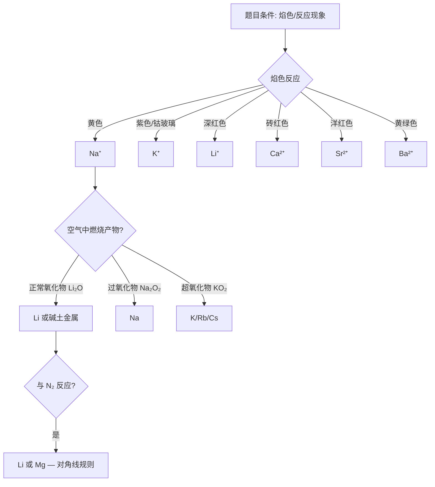

# 碱金属、碱土金属与稀有气体

> **适用**：第一轮（基础）→ 第二轮（深化）
> **对应备课大纲**：[[04-课件/备课大纲/2026-06-03-碱金属碱土金属与稀有气体-提高班]]
> **前置要求**：原子结构、周期律、离子键与晶格能、VSEPR 理论
> **深度边界**：本讲聚焦 s 区元素的系统知识 + 氢的三种成键形式 + 稀有气体化合物。不深入储氢材料的热力学循环（→ 物化综合计算），不展开碱金属液氨溶液的导电机理，不展开超氧化物的磁性量子解释。

---

## 学习目标

- ✅ 目标1：能系统总结锂的特殊性（与同族元素的差异）并解释原因。
- ✅ 目标2：能写出碱金属在空气中燃烧的产物规律（Li₂O → Na₂O₂ → KO₂）并用阳离子极化解释。
- ✅ 目标3：能从热力学角度解释碱金属盐溶解性规律（水化焓 vs 晶格能）。
- ✅ 目标4：能对比碱金属（IA）与碱土金属（IIA）的四大区别。
- ✅ 目标5：能说出氢的三种成键形式及代表化合物，能区分离子型/共价型/金属型氢化物。
- ✅ 目标6：能用 VSEPR 预测氙的化合物（XeF₂/XeF₄/XeF₆/XeO₃）的分子构型。
- ✅ 目标7：能掌握对角线规则三对相似性（Li-Mg、Be-Al、B-Si），并用离子势解释。

---

## 一、碱金属

### 1.1 锂的特殊性

锂虽属碱金属，但许多性质显著不同于同族元素。这是因为 **Li⁺ 半径极小**（76 pm，远小于 Na⁺ 的 102 pm），电荷密度极大，极化能力强。

| 性质 | Li | Na/K/Rb/Cs | 原因 |
|:---|:---|:---|:---|
| 熔点/沸点 | 远高于同族（熔点 180.5°C） | 依次降低（Cs 28.4°C） | Li 金属键更强（半径小）|
| 标准电极电势 | -3.045 V（最负） | 高于 Li（Na -2.71 V） | Li⁺ 水合热极大补偿了高升华能+高电离能 |
| 含结晶水盐类 | 较多（如 LiCl·H₂O）| 较少 | Li⁺ 半径小→水合作用强 |
| 空气中燃烧产物 | Li₂O（正常氧化物）| Na→Na₂O₂, K→KO₂ | Li⁺ 极化能力强 → 不能稳定 O₂²⁻/O₂⁻ |
| LiOH 碱性 | 中强碱 | 强碱 | Li⁺ 极化 OH⁻ → O-H 键不易断裂 |
| 与 N₂ 反应 | 6Li + N₂ → 2Li₃N | 不反应 | Li 与 Mg 相似（对角线规则）|

> 💡 **对角线规则**：Li 与 Mg 性质相似（Li⁺ 半径≈ Mg²⁺，离子势相近 → 极化能力相近），均为"第二周期反常"的典型案例。详见 §2.3。

**电极电势的 Born-Haber 分解（理解层面）**：

Li 的电极电势（-3.045 V）比 Na（-2.71 V）更负，似乎与 Li 的第一电离能（520 kJ/mol）大于 Na（496 kJ/mol）矛盾。原因是电极电势反映的是 **M(s) → M⁺(aq) + e⁻** 全过程的 Gibbs 自由能变化，涉及三步：

$$\Delta G(\text{电极}) = \Delta G_{\text{升华}} + \Delta G_{\text{电离}} + \Delta G_{\text{水合}}$$

- Li：升华 161 + 电离 520 + 水合 -511 = **+170 kJ/mol**
- Na：升华 109 + 电离 496 + 水合 -406 = **+199 kJ/mol**

Li 的升华能和电离能虽大，但 Li⁺ 半径极小，水合能（-511 kJ/mol）远大于 Na⁺（-406 kJ/mol），补偿后总 ΔG 反而更小，故电势更负。

![[media/weller-alkali-metal-thermodynamic-cycle-electrode-potential.jpg|碱金属电极电势的 Born-Haber 循环]]
*图 半反应 M(s) → M⁺(aq) + e⁻ 的热力学循环 — 升华焓 + 电离能 + 水合焓三者之和决定标准电极电势（Weller 图11.3）*

> [!warning] 常见误区
> **误区**：认为碱金属与水反应剧烈程度 = 金属性强弱顺序（电极电势顺序）。
> **事实**：反应剧烈程度主要由 **密度** 决定——Li（0.53 g/cm³）浮于水面仅部分接触，Cs（1.90 g/cm³）沉入水中全面接触。Li 电极电势最负但反应温和，Cs 电势接近 Li 但反应爆炸性——**物理因素（密度）常被忽略**。

### 1.2 碱金属与空气反应产物

| 金属 | 充足空气中燃烧产物 | 类型 | 阴离子 | O 氧化态 |
|:---|:---|:---|:---:|:---:|
| Li | Li₂O | 正常氧化物（O²⁻）| O²⁻ | -2 |
| Na | Na₂O₂ | 过氧化物（O₂²⁻）| [O-O]²⁻ | -1 |
| K | KO₂ | 超氧化物（O₂⁻）| O₂⁻ | -1/2 |
| Rb | RbO₂ | 超氧化物（O₂⁻）| O₂⁻ | -1/2 |
| Cs | CsO₂ | 超氧化物（O₂⁻）| O₂⁻ | -1/2 |

**规律**：金属半径增大 → 阳离子半径增大 → 对阴离子的极化作用减弱 → 允许更复杂的氧负离子存在。**阳离子越大，越能稳定大阴离子**。

> 💡 **记忆口诀**："锂正、钠过、钾超"——Li 得普通氧化物，Na 得过氧化物，K/Rb/Cs 得超氧化物。

![[media/weller-group1-superoxide-mo2-structure.jpg|超氧化物 MO₂ 的晶体结构]]
*图 第 1 族超氧化物 MO₂ 的结构 — 阳离子半径增大 → 阴离子从 O²⁻→O₂²⁻→O₂⁻ 逐级复杂化*

**过氧化物 Na₂O₂ 的核心反应**：

| 反应物 | 方程式 | 用途/说明 |
|:---|:---|:---|
| H₂O | Na₂O₂ + 2H₂O → H₂O₂ + 2NaOH | 生成 H₂O₂（不是直接放 O₂！）|
| CO₂ | 2Na₂O₂ + 2CO₂ → 2Na₂CO₃ + O₂ | 呼吸面具供氧 |
| 稀酸 | Na₂O₂ + H₂SO₄ → H₂O₂ + Na₂SO₄ | 过氧键保留，生成 H₂O₂ |

> ⚠️ **高频易错**：Na₂O₂ 与酸反应生成的是 **H₂O₂**，不是直接放 O₂！H₂O₂ 在酸性条件下较稳定，碱性条件下才快速分解放 O₂。

**超氧化物 KO₂ 的核心反应**：

$$4\mathrm{KO_2} + 2\mathrm{CO_2} \rightarrow 2\mathrm{K_2CO_3} + 3\mathrm{O_2}$$
$$2\mathrm{KO_2} + 2\mathrm{H_2O} \rightarrow \mathrm{H_2O_2} + 2\mathrm{KOH} + \mathrm{O_2}$$

> 💡 KO₂ 的释氧效率是 Na₂O₂ 的 **3 倍**（每吸收 1 mol CO₂ 释放 1.5 mol O₂ vs 0.5 mol O₂）。

**臭氧化物 KO₃**：橘红色固体，由 KOH + O₃ 反应制得，极不稳定，缓慢分解释放 KO₂ + O₂。

> [!warning] 常见误区
> **误区**：认为所有碱金属在空气中燃烧都得 M₂O。
> **正解**：产物类型取决于阳离子尺寸——Li⁺ 半径最小，得 Li₂O（氧化物）；Na⁺ 半径较大，得 Na₂O₂（过氧化物）；K/Rb/Cs⁺ 半径更大，得 MO₂（超氧化物）。

### 1.3 碱金属盐溶解性规律

**经验规律**：
- 强酸组成的钾盐溶解度 < 钠盐（如 K₂SO₄ < Na₂SO₄）
- 弱酸组成的钾盐溶解度 > 钠盐（如 K₂CO₃ > Na₂CO₃）

**热力学解释（竞赛考点）**：

溶解过程：$\mathrm{MX(s)} \xrightarrow{\Delta H_{\text{溶解}}} \mathrm{M^+(aq)} + \mathrm{X^-(aq)}$

$$\Delta H_{\text{溶解}} = -\text{晶格能} + \text{水化焓}$$

| 盐 | 总水化焓 (kJ/mol) | 晶格能 (kJ/mol) | 溶解焓 (kJ/mol) | 结果 |
|:---|:---:|:---:|:---:|:---:|
| NaI | -711 | -703 | **-8** | 溶解（放热）→ 更易溶 |
| KI | -627 | -647 | **+20** | 吸热 → 溶解度小于 NaI |
| NaF | -921 | -916 | **-5** | 溶解 |
| KF | -837 | -817 | **-20** | 溶解焓更负 → 溶解度大于 NaF |

**核心原理**：
- **正负离子半径差小** → 晶格能大（离子紧密堆积）→ 溶解焓正 → 难溶
- **正负离子半径差大** → 水化焓占主导 → 溶解焓负 → 易溶

**碱金属盐的特殊难溶物**：

| 离子 | 难溶盐 |
|:---|:---|
| Li⁺ | LiF、Li₂CO₃、Li₃PO₄（与 Mg²⁺ 相似——对角线规则）|
| Na⁺ | Na[Sb(OH)₆]、NaZn(UO₂)₃(Ac)₉·9H₂O（鉴定 Na⁺ 用）|
| K⁺ | KClO₄、K₂[PtCl₆]、K₂Na[Co(NO₂)₆]（鉴定 K⁺ 用）|

### 1.4 氢氧化物碱性递变

$$\text{碱性：LiOH} < \text{NaOH} < \text{KOH} < \text{RbOH} < \text{CsOH}$$

- LiOH 是中强碱（溶解度较小），其余均为强碱
- **递变原因**：金属性增强 + 阳离子半径增大 → 极化能力减弱 → 对 OH⁻ 的 O-H 键削弱作用减小 → OH⁻ 更容易释放

> 💡 极化能力与碱性的关系：阳离子极化 OH⁻ 的电子云，削弱 O-H 键，使得 OH⁻ 不易释放。Li⁺ 极化最强 → LiOH 碱性最弱；Cs⁺ 极化最弱 → CsOH 碱性最强。

---

## 二、碱土金属

### 2.1 碱土金属 vs 碱金属对比

| 性质 | 碱金属 (IA) | 碱土金属 (IIA) | 原因 |
|:---|:---:|:---:|:---|
| 价电子 | ns¹ | ns² | — |
| 原子半径 | 更大 | 更小 | 核电荷增加 → 电子被吸引更强 |
| 金属活泼性 | 更活泼（除 Be） | 较不活泼 | 电离能之和 IA < IIA |
| 与水反应 | 所有均与冷水反应（Li 温和）| Be 不反应（氧化膜），Mg 需热水，Ca 与冷水反应 | 氧化膜 + 金属键强度 |
| 氢化物稳定性 | 较低 | 较高（CaH₂ 最稳定，~1000°C 分解）| M²⁺ 极化更强 |
| 空气燃烧产物 | Li₂O/Na₂O₂/KO₂ | 正常氧化物（除 BaO₂）| M²⁺ 半径更小 |
| 盐类溶解度 | 大多易溶 | 大多难溶 | M²⁺ 晶格能更大 |
| 碳酸盐热稳定性 | 高（Li₂CO₃ 例外） | 较低 | M²⁺ 极化 > M⁺ → 更易分解 |
| 氯化物键型 | 离子性为主 | BeCl₂ 共价，其余离子性 | Be²⁺ 极化极强 |

### 2.2 碱土金属氢氧化物与碳酸盐溶解度递变

**氢氧化物**：

$$\text{Be(OH)}_2 \ll \text{Mg(OH)}_2 < \text{Ca(OH)}_2 < \text{Sr(OH)}_2 < \text{Ba(OH)}_2$$

- Be(OH)₂ **难溶且两性**（与 Al(OH)₃ 相似）
- Mg(OH)₂ 难溶（中强碱）
- Ca(OH)₂ 微溶（石灰水）
- Ba(OH)₂ 可溶（强碱）

**碳酸盐热稳定性**：

$$\text{稳定性：BeCO}_3 < \text{MgCO}_3 < \text{CaCO}_3 < \text{SrCO}_3 < \text{BaCO}_3$$

| 碳酸盐 | 分解温度 (°C) | 原因 |
|:---|:---:|:---|
| BeCO₃ | ~100 | Be²⁺ 极化能力最强 → CO₃²⁻ 最不稳定 |
| MgCO₃ | 540 | Mg²⁺ 半径较小 |
| CaCO₃ | 900 | — |
| SrCO₃ | 1290 | — |
| BaCO₃ | 1360 | Ba²⁺ 极化最弱 → CO₃²⁻ 最稳定 |

**规律**：**阳离子极化能力越强 → 碳酸盐越易分解**（从 Be 到 Ba 半径增大 → 极化减弱 → 稳定性升高）。

![[media/weller-group2-carbonate-decomposition-trend.jpg|碳酸盐分解温度随离子半径变化]]
*图 第 2 族碳酸盐分解温度随 M²⁺ 半径增大而升高 — MgCO₃ ~350°C → BaCO₃ ~1360°C*

**硫酸盐溶解度**（同族↓溶解度↓）：

$$\text{BeSO}_4 > \text{MgSO}_4 > \text{CaSO}_4 > \text{SrSO}_4 > \text{BaSO}_4$$

BaSO₄ 极难溶（Ksp = 1.1×10⁻¹⁰），是"钡餐"造影剂的化学基础。

> ⚠️ **注意趋势方向**：氢氧化物溶解度与硫酸盐溶解度 **方向相反**！氢氧化物从上到下溶解度增大，硫酸盐从上到下溶解度减小。

### 2.3 对角线规则 —— 竞赛核心考点

**定义**：周期表中，左上-右下对角相邻的两元素，由于离子势（φ = z/r）相近 → 极化能力相近 → 化学性质相似。

| 相似对 | 离子势 φ | 具体相似表现 |
|:---|:---:|:---|
| **Li ≈ Mg** | Li⁺: 0.034 / Mg²⁺: 0.046 | ①燃烧均得普通氧化物（Li₂O、MgO）；②碳酸盐均难溶且加热分解；③均与 N₂ 反应生成氮化物；④氢氧化物均微溶且加热分解；⑤硝酸盐分解产物均为氧化物 + NO₂ + O₂ |
| **Be ≈ Al** | Be²⁺: 0.044 / Al³⁺: 0.056 | ①氧化物/氢氧化物均 **两性**；②氯化物均显 **共价性**（聚合结构）；③均溶于强碱放 H₂；④浓 HNO₃ 使其钝化 |
| **B ≈ Si** | B³⁺: 0.12 / Si⁴⁺: 0.10 | ①含氧酸均为弱酸（H₃BO₃、H₂SiO₃）；②氧化物为玻璃态网络结构；③与 NaOH 反应生成含氧酸盐 |

> 💡 **一句话收束**："离子势相近 → 极化能力相近 → 化学性质相似"。

**Be-Al 的对角线规则是最常考点**——因为 Be(OH)₂ 的两性在 IIA 族中是唯一的，而 Al(OH)₃ 的两性在 IIIA 族中是典型的。

> [!warning] Be 的常见误区
> - **误区**：认为 Be 的化合物和其他碱土金属一样是离子性。
> - **正解**：Be²⁺ 半径极小（45 pm），极化能力最强 → BeCl₂ 气态为直线型（sp 杂化），固态为链状聚合物。Be(OH)₂ 具有两性（溶于强酸和强碱），而 Mg(OH)₂ 仅有碱性。

![[media/weller-becl2-polymer-chain-structure.jpg|BeCl₂ 固态链状聚合物结构]]
*图 BeCl₂ 固态的聚合链结构 — Be 通过 sp³ 杂化与 4 个 Cl 形成四面体配位（2 个端基 Cl + 2 个桥 Cl），因此 BeCl₂ 显共价性而非离子性*

---

## 三、氢的三种成键形式

| 成键形式 | 代表化合物 | 特征 | 典型反应 |
|:---|:---|:---|:---|
| **共价键** | H₂O、NH₃、HCl、CH₄ | 与 p 区非金属共用电子对 | 酸性/碱性/中性，取决于中心原子 |
| **离子键（H⁻）** | NaH、CaH₂、LiH | 与 s 区（除 Be/Mg）形成，H⁻ 是强还原剂 | NaH + H₂O → NaOH + H₂↑（遇水放 H₂！）|
| **过渡型（金属型）** | LaH₂.₈₇、PdHₓ | H 填充在金属晶格间隙，非整比 | 可逆吸放氢 → **储氢材料** |

**离子型氢化物（盐型氢化物）的特征**：
- 由活泼金属（IA、IIA 的 Ca/Sr/Ba）与 H₂ 直接化合
- H⁻ 是极强的还原剂和强碱
- **遇水剧烈反应放 H₂**：$\mathrm{CaH_2 + 2H_2O \rightarrow Ca(OH)_2 + 2H_2\uparrow}$
- 在有机合成中用作强还原剂（如 LiAlH₄、NaBH₄）

**储氢材料**：
- **PdHₓ**：2Pd + H₂ ⇌ 2PdH（可逆，但钯贵）
- **LaNi₅H₆**：LaNi₅ + 3H₂ ⇌ LaNi₅H₆（稀土资源丰富，较便宜）

**氢化物分类对比**：

| 性质 | 离子型 | 共价型 | 金属型 |
|:---|:---|:---|:---|
| 导电性 | 熔融态导电 | 不导电 | 导电（保持金属性）|
| 熔点/沸点 | 较高 | 较低（分子晶体）| 高（金属晶格）|
| 典型用途 | 还原剂、干燥剂 | 溶剂、反应物 | 储氢材料 |

---

## 四、稀有气体化合物

### 4.1 稀有气体化学的突破

1962 年，Bartlett 观察到 PtF₆ 的氧化能力极强（可将 O₂ 氧化为 O₂⁺，电离势 12.2 eV），而 Xe 的电离势（12.13 eV）与 O₂ 几乎相同 → 推测 Xe 也能被 PtF₆ 氧化 → 成功合成 **Xe⁺[PtF₆]⁻**（橙黄色固体），打破了"惰性气体"的认知。

### 4.2 氙的氟化物——制备与 VSEPR

**制备条件**：

| 产物 | 反应条件（Xe:F₂） | Xe 氧化态 | 产率/特征 |
|:---|:---:|:---:|:---|
| XeF₂ | 1:2（光照或加热）| +2 | 直线形，无色晶体 |
| XeF₄ | 1:5（加热 400°C）| +4 | 平面正方形，无色 |
| XeF₆ | 1:20（加热 300°C，高压）| +6 | 变形八面体，无色 |

**VSEPR 构型汇总**：

| 氧化态 | 化合物 | 价层电子对数 | 孤对电子数 | 杂化方式 | 分子构型 |
|:---:|:---:|:---:|:---:|:---:|:---|
| II | XeF₂ | 5 | 3 | sp³d | 直线形 |
| IV | XeF₄ | 6 | 2 | sp³d² | 平面正方形 |
| VI | XeF₆ | 7 | 1 | sp³d³ | 变形八面体 |
| VI | XeO₃ | 4 | 1 | sp³ | 三角锥 |
| VI | XeOF₄ | 6 | 1 | sp³d² | 四方锥 |
| VIII | XeO₄ | 4 | 0 | sp³ | 正四面体 |

> 💡 **VSEPR 判断口诀**："先算总价电子，除以 2 得电子对数；减去配位数得孤对；孤对占位推实际构型。"

![[media/weller-xef4-square-planar-vsepr-diagram.jpg|XeF₂ 直线形 (sp³d)]]
![[media/weller-xef4-square-planar-structure.jpg|XeF₄ 平面正方形 (sp³d²)]]
![[media/weller-xenon-fluorides-structure-xef2-xef4-xef6.jpg|XeF₆ 变形八面体 (sp³d³)]]
*图 氙的氟化物分子结构（XeF₂ 直线形、XeF₄ 平面正方形、XeF₆ 变形八面体）— 中心 Xe 原子上孤对电子的数目决定实际构型*

**氙氟化物水解反应**：

| 化合物 | 水解产物 | 特点 |
|:---|:---|:---|
| XeF₂ | Xe + O₂ + HF | Xe 被还原（+2 → 0），不是歧化 |
| XeF₄ | Xe + XeO₃ + HF | **歧化反应**（+4 → 0 / +6）|
| XeF₆ | XeO₃ + HF | Xe 氧化数保持 +6 |

### 4.3 氙的氧化物

| 化合物 | 制备方法 | 构型 | 性质 |
|:---|:---|:---:|:---|
| XeO₃ | XeF₆ + 3H₂O → XeO₃ + 6HF | 三角锥 | 白色固体，**爆炸性**（强氧化剂）|
| XeO₄ | XeF₆ + H₂O（控制条件）| 正四面体 | 更不稳定，易爆 |
| XeOF₄ | XeF₆ + SiO₂（部分水解）| 四方锥 | — |

![[media/weller-xeo4-tetrahedral-structure.jpg|XeO₃ 三角锥 (sp³)]]
![[media/weller-xenon-oxide-structure-xeo3-xeo4.jpg|XeO₄ 正四面体 (sp³)]]
*图 氙的氧化物分子结构（XeO₃ 三角锥，类似 NH₃；XeO₄ 正四面体）*

> ⚠️ **重要提醒**：XeF₆ 可与 SiO₂ 反应 → **不能用玻璃容器盛装**！
> $$2\mathrm{XeF_6} + \mathrm{SiO_2} \rightarrow 2\mathrm{XeOF_4} + \mathrm{SiF_4}$$
> $$\mathrm{XeOF_4} + \mathrm{SiO_2} \rightarrow \mathrm{XeO_3} + \mathrm{SiF_4} \uparrow$$

---

## 五、方法总结与思维框架

### 5.1 s 区元素推断题思维流程图

### 5.2 对角线规则应用口诀

> "Li-Mg、Be-Al、B-Si，三对相似要牢记；离子势相近是关键，极化能力定性质。"

### 5.3 关键递变规律速记

| 递变方向 | 规律 | 例外/注意 |
|:---|:---|:---|
| IA 燃烧产物 | Li₂O → Na₂O₂ → KO₂ | 阳离子半径增大 → 阴离子从 O²⁻→O₂²⁻→O₂⁻ |
| IIA 碳酸盐稳定性 | Be→Ba 稳定性增大 | 极化减弱 → 碳酸根更稳定 |
| IIA 硫酸盐溶解度 | Be→Ba 溶解度减小 | 注意与氢氧化物趋势相反 |
| 氢氧化物碱性 | IA：从上到下增强 IIA：从上到下增强 | LiOH 中强碱，Be(OH)₂ 两性 |

---

## 六、典型例题

### 例题 1：锂的特殊性 ⭐⭐

**题目**：金属 Li 与水反应比 Na 温和，但 Li 的电极电势（-3.045 V）却比 Na（-2.71 V）更负。试从 Born-Haber 循环角度解释这一矛盾现象。

**思路分析**：
看到"电极电势 vs 反应剧烈程度矛盾" → 想到电极电势是全过程的 ΔG（升华+电离+水合），而反应剧烈程度还受物理因素（密度、熔点、产物溶解度）影响。看到"Li vs Na" → 想到 Li⁺ 半径极小 → 水合能极大。

**解答**：
1. 电极电势反映的是 M(s) → M⁺(aq) + e⁻ 的完整过程：
   - Li：ΔG = 161（升华）+ 520（电离）+ (-511)（水合）= **+170 kJ/mol**
   - Na：ΔG = 109（升华）+ 496（电离）+ (-406)（水合）= **+199 kJ/mol**
2. Li 的升华能和电离能虽大，但 Li⁺ 水合能（-511 kJ/mol）远大于 Na⁺（-406 kJ/mol），补偿后总 ΔG 反而更小 → 电势更负。
3. 反应剧烈程度主要由密度决定：Li（0.53 g/cm³）浮于水面，与水接触面积小；且生成 LiOH 溶解度小，覆盖表面减缓反应。Na（0.97 g/cm³）熔化后与水全面接触。

**答案**：电极电势与水反应剧烈程度是 **两个不同维度** 的问题——前者是热力学量（ΔG），后者受反应动力学和物理因素（密度、产物溶解度）控制。

---

### 例题 2：过氧化钠与酸反应 ⭐⭐

**题目**：写出 Na₂O₂ 分别与 H₂O、稀 H₂SO₄、CO₂ 反应的化学方程式。某同学认为 Na₂O₂ 与酸反应直接放出 O₂，他的理解是否正确？说明原因。

**思路分析**：
看到"Na₂O₂ 与酸反应" → 回忆过氧键 O-O²⁻ 在酸性条件下稳定 → 生成 H₂O₂ 而不是 O₂。注意区分 Na₂O₂ 与 H₂O 反应也先得 H₂O₂，H₂O₂ 在碱性条件下才快速分解。

**解答**：

(1) 反应方程式：
- 与 H₂O：$\mathrm{Na_2O_2 + 2H_2O \rightarrow H_2O_2 + 2NaOH}$
- 与稀 H₂SO₄：$\mathrm{Na_2O_2 + H_2SO_4 \rightarrow H_2O_2 + Na_2SO_4}$
- 与 CO₂：$2\mathrm{Na_2O_2 + 2CO_2 \rightarrow 2Na_2CO_3 + O_2}$

(2) 同学的理解 **不正确**。Na₂O₂ 与酸反应生成的是 **H₂O₂**，不是直接放 O₂。过氧键（-O-O-）在酸性条件下稳定存在，只有在碱性条件下 H₂O₂ 才快速催化分解：
$$2\mathrm{H_2O_2} \xrightarrow{\text{OH⁻}} 2\mathrm{H_2O} + \mathrm{O_2}\uparrow$$

**反思**：Na₂O₂ 与酸反应与与 CO₂ 反应的产物不同，核心区别在于是否生成过氧键保留的中间产物。

---

### 例题 3：对角线规则应用 ⭐⭐⭐

**题目**：已知 Be(OH)₂ 为两性氢氧化物，写出 Be(OH)₂ 分别溶于 HCl 和 NaOH 的离子方程式。并解释为什么 Mg(OH)₂ 不具有两性。

**思路分析**：
看到"Be(OH)₂ 两性" → 想到 Be-Al 对角线规则 → Be²⁺ 的离子势（z/r ≈ 0.044）与 Al³⁺（0.056）相近 → 极化能力相近 → 性质相似。对比 Mg(OH)₂（仅碱性）→ 说明 Mg²⁺ 离子势较小（0.046），极化能力介于 Li⁺ 和 Be²⁺ 之间。

**解答**：

(1) Be(OH)₂ 与 HCl：$$\mathrm{Be(OH)_2 + 2H^+ \rightarrow Be^{2+} + 2H_2O}$$
(2) Be(OH)₂ 与 NaOH：$$\mathrm{Be(OH)_2 + 2OH^- \rightarrow [Be(OH)_4]^{2-}}$$（四羟基合铍配离子，与 Al(OH)₃ 溶于碱生成 [Al(OH)₄]⁻ 类似）

(3) Mg(OH)₂ 不具有两性的原因：Mg²⁺ 的离子势（z/r = 2/72 ≈ 0.028）显著小于 Be²⁺（2/45 ≈ 0.044），极化能力不足以使 O-H 键在碱性条件下断裂。只有 Be²⁺ 的强极化能力使其氢氧化物既能在酸性（中和 OH⁻）又能在碱性（极化 O-H 键使其断裂）条件下溶解。

---

### 例题 4：氙化合物 VSEPR 综合 ⭐⭐⭐

**题目**：用 VSEPR 理论判断 XeF₄ 和 XeO₃ 的分子构型，分别说明中心原子的杂化方式和孤对电子数。

**思路分析**：
VSEPR 标准流程：计算中心原子的 **价层电子对数** = (中心原子价电子数 + 配体提供的电子数 ± 离子电荷) / 2 → 确定电子对几何 → 根据孤对电子数确定实际分子构型。

**解答**：

(1) **XeF₄**：
- 价层电子对数 = (8 + 4×1) / 2 = **6** → 八面体电子对几何
- 成键数 = 4，孤对电子数 = 6 - 4 = **2**
- 孤对电子处于对角位置 → **平面正方形**（sp³d² 杂化）

(2) **XeO₃**：
- 价层电子对数 = (8 + 3×0) / 2 = **4**（O 提供 0 个电子，用 Xe=O 双键处理）
- 成键数 = 3，孤对电子数 = 4 - 3 = **1**
- → **三角锥**（sp³ 杂化，类似 NH₃）

**对比表**：

| 分子 | 价层电子对数 | 孤对电子 | 杂化 | 实际构型 |
|:---|:---:|:---:|:---:|:---:|
| XeF₂ | 5 | 3 | sp³d | 直线 |
| XeF₄ | 6 | 2 | sp³d² | 平面正方形 |
| XeF₆ | 7 | 1 | sp³d³ | 变形八面体 |
| XeO₃ | 4 | 1 | sp³ | 三角锥 |
| XeO₄ | 4 | 0 | sp³ | 正四面体 |

---

### 例题 5：碱金属碳酸盐热稳定性比较 ⭐⭐

**题目**：比较 Na₂CO₃、Li₂CO₃、MgCO₃、CaCO₃ 的热稳定性，并从离子极化角度解释原因。

**思路分析**：
看到"碳酸盐热稳定性" → 想到阳离子极化能力是关键 → M²⁺ 极化 > M⁺（电荷高→极化强）→ 碱土金属碳酸盐比碱金属碳酸盐更易分解。再考虑同一族内：半径越小极化越强 → 碳酸盐越不稳定。

**解答**：

稳定性顺序：**Na₂CO₃ > Li₂CO₃ > CaCO₃ > MgCO₃**

| 碳酸盐 | 分解温度 | 阳离子 | 极化能力分析 |
|:---|:---:|:---|:---|
| Na₂CO₃ | >1000°C 不分解 | Na⁺ | r 较大，电荷 +1 → 极化弱 |
| Li₂CO₃ | ~700°C 分解 | Li⁺ | r 很小，虽然电荷 +1 但极化接近 Mg²⁺ |
| CaCO₃ | ~900°C 分解 | Ca²⁺ | r 较大，但电荷 +2 极化强于 Na⁺ |
| MgCO₃ | ~540°C 分解 | Mg²⁺ | r 较小，电荷 +2 → 极化最强（在此比较中）|

**原因**：阳离子极化能力越强 → 对 CO₃²⁻ 的 O 原子电子云吸引越强 → C-O 键削弱 → CO₂ 更易逸出。Li₂CO₃ 是唯一加热分解的碱金属碳酸盐，因为 Li⁺ 的离子势接近 Mg²⁺（对角线规则），极化能力较强。

---

## 七、核心速查卡

### 7.1 碱金属燃烧产物速查

| Li | Na | K | Rb | Cs |
|:---:|:---:|:---:|:---:|:---:|
| Li₂O | Na₂O₂ | KO₂ | RbO₂ | CsO₂ |
| 正常氧化物 | 过氧化物 | 超氧化物 | 超氧化物 | 超氧化物 |

### 7.2 IA vs IIA 对比速查

| IA 特点 | IIA 特点 |
|:---|:---|
| 更活泼、半径更大 | 价电子多→金属键更强→熔点更高 |
| 盐类大多易溶 | 盐类大多难溶（BaSO₄ 极难溶）|
| 燃烧产物多样（氧化物/过氧化物/超氧化物）| 燃烧产物多为正常氧化物（Ba 可过氧化物）|
| 碳酸盐高稳定（Li 例外）| 碳酸盐更易分解（M²⁺ 极化强）|

### 7.3 氙化合物 VSEPR 速查

| 类型 | 构型 | VSEPR 记号 |
|:---|:---:|:---:|
| XeF₂ | 直线 | AX₂E₃ |
| XeF₄ | 平面正方形 | AX₄E₂ |
| XeF₆ | 变形八面体 | AX₆E |
| XeO₃ | 三角锥 | AX₃E |
| XeO₄ | 正四面体 | AX₄ |
| XeOF₄ | 四方锥 | AX₅E |

---

## 练习题

### 基础巩固

**1.** ⭐ 写出 Li、Na、K 在充足空气中燃烧的产物，并分别指出阴离子类型（O²⁻/O₂²⁻/O₂⁻）。

**2.** ⭐⭐ 写出 Na₂O₂ 与 H₂O 和 CO₂ 反应的化学方程式。潜艇中若用 Na₂O₂ 作为氧源和 CO₂ 吸收剂，每吸收 1 mol CO₂ 可产生多少 mol O₂？

**3.** ⭐⭐ 用"离子势"（φ = z/r）解释为什么 LiOH 是中强碱，而 NaOH、KOH 是强碱。

**4.** ⭐ 列出对角线规则的三对元素（Li-Mg、Be-Al、B-Si），各举一个性质相似的具体例子。

**5.** ⭐⭐ 用 VSEPR 预测 XeF₆ 的分子构型，写出中心原子的杂化方式和孤对电子数。

### 提高训练

**6.** ⭐⭐⭐ 金属钾的制备采用 Na(l) + KCl(l) → NaCl(l) + K(g)↑ 的反应。已知 K 的沸点为 759°C，Na 的沸点为 883°C，反应温度为 850°C。请从热力学角度分析该方法可行的原因。该反应属于什么类型？

**7.** ⭐⭐⭐ 某化合物 A 为白色固体，与水反应放出无色无味气体 B，B 可使带火星木条复燃，同时得到溶液 C。C 的焰色反应为黄色。A 在空气中与 CO₂ 反应也能产生 B。请推断 A、B、C，并写出相关反应方程式。若将 A 改为含钾的类似物，写出其与 CO₂ 反应的方程式。

**8.** ⭐⭐⭐ 已知 BeCl₂ 在气态时为直线型分子，固态时为链状聚合物。请用离子极化理论解释这一现象。BeCl₂ 在固态时的杂化方式是什么？

### 参考答案

**1.**
- Li → Li₂O（O²⁻，正常氧化物）
- Na → Na₂O₂（O₂²⁻，过氧化物）
- K → KO₂（O₂⁻，超氧化物）
- **提示**：记住"锂正、钠过、钾超"口诀。阳离子半径增大 → 极化减弱 → 允许大阴离子存在。

**2.**
- Na₂O₂ + 2H₂O → H₂O₂ + 2NaOH
- 2Na₂O₂ + 2CO₂ → 2Na₂CO₃ + O₂
- 每吸收 2 mol CO₂ 产生 1 mol O₂ → 每吸收 1 mol CO₂ 产生 **0.5 mol O₂**
- **对比**：KO₂ 的释氧效率是 Na₂O₂ 的 3 倍（每吸收 1 mol CO₂ 产生 1.5 mol O₂）

**3.** 离子势 φ = z/r。Li⁺ 半径小（76 pm），φ 大 → 极化 OH⁻ 强 → 削弱 O-H 键 → LiOH 中强碱。Na⁺/K⁺ 半径增大 → φ 减小 → 极化减弱 → OH⁻ 更易释放 OH⁻ → 强碱。

**4.** 见 §2.3 对角线规则表。例如：
- Li-Mg：Li₂CO₃ 难溶加热分解，MgCO₃ 也难溶加热分解
- Be-Al：Be(OH)₂ 和 Al(OH)₃ 都是两性氢氧化物
- B-Si：H₃BO₃ 和 H₂SiO₃ 都是弱酸

**5.** XeF₆：价层电子对数 = (8+6)/2 = 7，成键 6，孤对 = 1 → **变形八面体**（sp³d³ 杂化）。孤对电子的排斥导致八面体变形。

**6.**
- 基本原理：利用 K 的沸点（759°C）低于反应温度（850°C），K 以蒸气形式逸出反应体系，根据勒夏特列原理，生成物浓度降低 → 平衡右移。
- 属于 **热还原法**（用更活泼的 Na 还原 KCl，但实际利用的是沸点差异而不是金属活泼性差异）。
- 类似思路也用于 Rb、Cs 的制备。

**7.**
- A = Na₂O₂，B = O₂，C = NaOH
- Na₂O₂ + 2H₂O → H₂O₂ + 2NaOH，H₂O₂ 分解：2H₂O₂ → 2H₂O + O₂↑
- 2Na₂O₂ + 2CO₂ → 2Na₂CO₃ + O₂
- 钾类似物：KO₂（超氧化钾），4KO₂ + 2CO₂ → 2K₂CO₃ + 3O₂
- **提示**：Na 的焰色为黄色，Li 为深红色，K 为紫色。看到焰色反应 + 供氧剂 → 先锁定 Na₂O₂。

**8.**
- 气态 BeCl₂ 为直线型（sp 杂化），价层电子对数 2，无孤对。
- 固态时 Be²⁺（45 pm）极化能力极强，将 Cl⁻ 的电子云拉向 Be → 形成 Cl 桥键 → 链状聚合物。Be 采用 **sp³ 杂化**，每个 Be 与 4 个 Cl 形成四面体配位，两个 Cl 为端基、两个 Cl 为桥基。
- **思路**：看到 Be 的化合物 → 立刻想到离子势最大 → 极化最强 → 倾向共价性。这是 Be-Al 对角线规则的典型表现。
