# 题-2ChO-02-10-101一种不带电反应中间体可

## 题目

### 第 10 题 永远无名(28 分)

10-1 一种不带电反应中间体可由下图所示的过程得到，画出其结构。

$R_{1}$ $\ce{CH2C(O)Cl}$ + CN- $R_{2}$ $\longrightarrow$ X

10-2-1 从 X 类中间体出发，可以发生进一步反应。写出下面各反应的产物，已知 B 中含有五元芳环。

10-2-2 在上一问所画的结构中标记出 A 中所有手性碳原子的绝对构型。

10-2-3 画出生成 B 过程中经历的除了 X 类中间体之外的另一个电中性关键中间体 Y 的结构。

10-2-4 若向生成 B 的反应体系中加入适量的 $CH_{2}=CHCO_{2}Me$ ，则 Y 会被捕获形成两种产物 $C_{1}$ 和 $C_{2}$ ，画出它们的结构。

10-3-1 当有其它试剂加入时，反应方式会有所变化，写出下图反应生成的小分子副产物，并画出反应过程中经历的除了 X 类中间体之外的另一个电中性关键中间体的结构。

10-3-2 在 $Et_{3}N$ 的存在下， $EtO_{2}CCOCl$ 、CyNC、 $P(Oi-Pr)_{3}$ 、 $NCCH_{2}CN$ 和 $CS_{2}$ 在 MeCN 中发生多组分反应，画出其产物的 D 的结构。

10-4 一定条件下， $\alpha$ -羰基重氮盐可以代替酰氯与异腈发生相似的反应，画出下图中所有中间体和产物的结构。已知 W 和三个产物中均有五元环，但是只有 E 中的五元环有芳香性；F 中还有一个六元环。

## 参考答案

📎 **答案出处**：源卷答案（含结构式图）已随卡；OCR 原文转录，数值未逐条复核。

> 源：第2届2ChO化学奥林匹克联考试题、答案、说明与评分细则.md（第 10 题）

10-1

 $R_2-N=Cl$  $\overset{O}{\underset{|}{C}}$  $(2分)$

10-2-1&10-2-2共4分

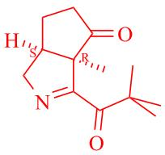

(3分,结构1分,2个手性碳原子的绝对构型各1分)若A的结构画错,则绝对构型一概不得分。

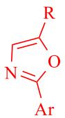

(1分)

10-2-3

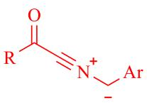

(2分)

10-2-4共4分

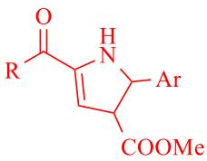

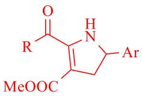

(各2分)环内双键位置不做要求,若画出芳构化之后的吡咯产物亦可得分。

10-3-1共3分

 $P(O)(OH)(OR_3)_2$ 或 $P(O)(OR_3)_3$ 或 $P(O)(OH)(OR_3)_2$ 和 $R_3Cl$ (1分)

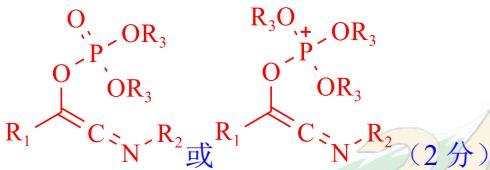

10-3-2

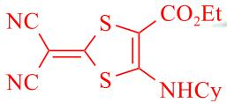

(3分)

10-4共十分

ZW

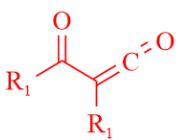

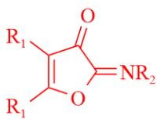

E[F]

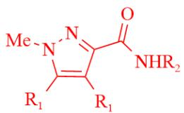

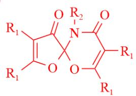

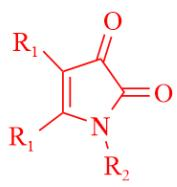

(各2分)

## 知识点映射

- （待人工校准）

> ⚠️ **自动拆卡标记**：`subject_module`/`difficulty` 为关键词粗判，答案数值与单位**尚未经人工复核**（OCR 原文逐字转录，可能保留原卷笔误）。