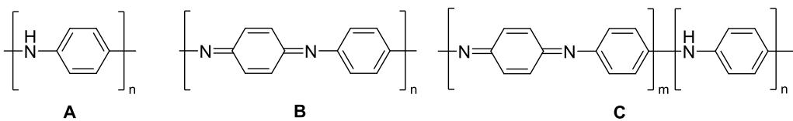

# 题-2ChO-05-01-历史上人类对于矿物的开采和应

## 题目

### 第 1 题 M 元素化学 (24 分, 10%)

历史上，人类对于矿物的开采和应用很大程度决定了元素研究的进程。元素M和另一种元素的命名来源于同一个国家。M在地壳中的丰度大约与氮相同，但其分布极其分散。M的单独矿物较少，但M与元素N形成的二元化合物A在地壳中经常与闪锌矿伴生。A中M的质量占比为 $48.20\%$ ，在光电领域有着广泛的应用。

1.1 元素 M 的一种氯化物 B 可以与 N 单质发生反应来制备 A。B 在高温下稳定，但是温度降低时会发生歧化反应生成 M 的氯化物 C。除此之外，M 的另一种常见白色易吸湿的氯化物 D 可以通过在封闭管中加热 M 单质与 $HgCl_{2}$ 的混合物得到。D 中元素 M 的质量分数介于 B 与 C 之间。

1.1.1 写出元素 M 的元素名称和 C 的化学式。

1.1.2 写出 B 与 N 反应的化学方程式。

1.1.3 制备 D 时，该反应也可以在苯中发生，此时无需加热即可进行。试通过画出相关结构说明 D 在苯中容易制备的原因。

1.2 氯化物 C 在 250 K 下可以与 $Me_{3}SiH$ 发生反应生成 E。E 常以二聚体的形式存在，且其二聚体中所有氯的化学环境相同。

1.2.1 画出 E 的实际结构。

1.2.2 低温下，E 与氨和三甲胺反应的差异引起了关注。经过红外光谱等数据测定，确认两反应产物虽然组成类似，但是实际结构中 M 的配位数不同，且 E 与氨反应产物中 M 的配位数与 E 的二聚体中相同。已知产物中都不存在二聚或多聚结构。分别画出 E 与氨和三甲胺反应产物的结构，并解释两个产物不同的原因。

1.3 元素 M 的物理性质也同样颇具特色。已知标准大气压下，M 及相关化合物的热力学数据如下，且假设所有 $\Delta H$ 、 $\Delta S$ 均不随温度变化。在题目温度区间内，M 的最稳定氧化物始终以固态形式存在。

<table><tr><td></td><td> $\Delta_fH_m^\theta (kJ·mol^{-1})$ </td><td> $S_m^\theta (J·mol^{-1}·K^{-1})$ </td></tr><tr><td>M(s)</td><td>0</td><td>40.9</td></tr><tr><td>M(l)</td><td>5.6</td><td>56.0</td></tr><tr><td>M(g)</td><td>277.0</td><td>169.0</td></tr><tr><td>O2(g)</td><td>0</td><td>205.2</td></tr><tr><td>M的最稳定氧化物(s)</td><td>-1089.0</td><td>88.0</td></tr></table>

1.3.1 计算 M 在 1500 K 时的饱和蒸气压。

1.3.2 判断标准大气压下 M 与氧气自发反应的温度区间。

1.3.3 计算当 M 的沸点为 2200 K 时环境的气压。

## 参考答案

<table><tr><td></td><td> $\Delta_{\text{f}}H_{\text{m}}^{\theta}$  (kJ·mol $^{-1}$ )</td><td> $S_{\text{m}}^{\theta}$  (J·mol $^{-1}$ ·K $^{-1}$ )</td></tr><tr><td>M(s)</td><td>0</td><td>40.9</td></tr><tr><td>M(l)</td><td>5.6</td><td>56.0</td></tr><tr><td>M(g)</td><td>277.0</td><td>169.0</td></tr><tr><td>O $_2$ (g)</td><td>0</td><td>205.2</td></tr><tr><td>M的最稳定氧化物(s)</td><td>-1089.0</td><td>88.0</td></tr></table>

<table><tr><td>1.1.1共4分</td><td>M:镓(2分,写Ga得1分)C: $GaCl_{3}$ (2分)</td></tr><tr><td>1.1.2共2分</td><td> $6GaCl + As_{4} = 4GaAs + 2GaCl_{3}$ (2分,写 $3GaCl + 2As = 2GaAs + GaCl_{3}$ 也得分)</td></tr><tr><td>1.1.3共3分</td><td>苯可以作为6电子给体配位稳定缺电子的Ga,形成稳定的加合物,结构如下:(3分,若未画出结构但体现出苯的配位作用,得1分)</td></tr></table>

## 2ChO 化学团队交流群：963598333

<table><tr><td>1.2.1共2分</td><td colspan="2"> (2分)</td></tr><tr><td>1.2.2共4分</td><td colspan="2"> (两个结构都正确得3分,写对一个得2分,第二个结构不写氯离子也得分)因为三甲胺的空间位阻大(1分),无法处于邻位进行配位。</td></tr><tr><td>1.3.1共2分</td><td colspan="2"> $\Delta G = \Delta H - T \Delta S = 1.02 \times 10^{5} \text{ J} \cdot \text{mol}^{-1}$ (1分) $K = e^{\frac{\Delta G}{-RT}} = 2.83 \times 10^{-4}$ ,故 $p = 28.3 \text{ Pa}$ (1分,不要求有效数字)</td></tr><tr><td>1.3.2共4分</td><td colspan="2">方程式为 $4 \text{M} + 3 \text{O}_{2}(\text{g}) = 2 \text{M}_{2} \text{O}_{3}(\text{s})$  (1分)当 $M$ 为气态( $T > 2402 \text{ K}$ 时): $T_{\text{临}} = \frac{\Delta H}{\Delta S} = \frac{-3286 \text{ kJ}}{-1115.6 \text{ J} \cdot \text{mol}^{-1} \cdot \text{K}^{-1}} = 2946 \text{ K}$ (1分)当 $M$ 为液态: $T_{\text{临}} = \frac{\Delta H}{\Delta S} = \frac{-2200 \text{ kJ}}{-663.6 \text{ J} \cdot \text{mol}^{-1} \cdot \text{K}^{-1}} = 3315 \text{ K} > 2402 \text{ K}$ 当 $M$ 为固态: $T_{\text{临}} = \frac{\Delta H}{\Delta S} = \frac{-2178 \text{ kJ}}{-603.2 \text{ J} \cdot \text{mol}^{-1} \cdot \text{K}^{-1}} = 3610 \text{ K} > 2402 \text{ K}$ (1分,只需要能说明液态和固态时都能自发反应即可)故温度区间为 $T < 2946 \text{ K}$ (1分)</td></tr><tr><td>1.3.3共3分</td><td colspan="2">标准大气压 $p = 100 \text{ kPa}$ 下沸点为: $T = \frac{\Delta H_{vap}}{\Delta S_{vap}} = 2402 \text{ K}$ (1分)根据克劳修斯-克拉伯龙方程: $\ln(\frac{p_1}{p_2}) = -\frac{\Delta H_{vap}}{R}(\frac{1}{T_1} - \frac{1}{T_2})$  (1分)代入数据解得 $T = 2200 \text{ K}$ 时,气压为 $28.7 \text{ kPa}$ (1分,不要求有效数字)</td></tr></table>

> ✅ 答案由源《第5届2ChO化学奥林匹克联考试题、答案、说明与评分细则_20251124版初稿.md》第 1 题回收补录（回源核对 2026-09-27）。

## 知识点映射

- （待人工校准）

> ⚠️ **自动拆卡标记**：`subject_module`/`difficulty` 为关键词粗判，答案数值与单位**尚未经人工复核**（OCR 原文逐字转录，可能保留原卷笔误）。