# 题-2ChO-06-10-与传统离子型环化反应相比自由

## 题目

### 第 10 题 自由基环化与光化学反应 (29 分, 12%)

与传统离子型环化反应相比，自由基过程通常具有反应条件温和、官能团兼容性好，以及在部分高张力成环过程中可降低过渡态能垒等特点，因此在天然产物合成和复杂分子骨架构建中受到广泛关注。

10.1 自由基串联环化与扩环反应是现代有机合成中构建 8\~11 元中环化合物的重要策略之一。其中，Dowd-Beckwith 反应能够将环酮骨架有效转化为中环烯酮体系，是自由基扩环反应中的代表性反应。

10.1.1 结合上述信息和下图反应，画出该反应的关键自由基中间体及最终产物，注意立体化学。

10.1.2 若改变底物中某一手性中心的构型，产物结构也会相应发生变化。请画出下图底物在相同反应条件下得到的最终产物，并画出能够解释该产物立体化学的关键中间体构象。

10.1.3 当进一步改变反应底物时，除目标中环烯酮产物外，反应体系中还观察到了未扩环产物。结合下图反应，画出该未扩环产物及经历的关键中间体。

10.1.4 反应涉及扩环历程与未扩环副反应历程的竞争。若将反应底物更换为下图所示结构，相较于 10.1.3 中的底物，扩环产物的生成比例是提高还是降低？请作出判断。

10.2 自由基也可以通过光化学方式产生。例如， $\mathrm{FeCl}_3$ 在光照条件下可发生配体到金属电荷转移，即 LMCT 过程，从而生成具有抽氢能力的氯自由基。

10.2.1 在标准条件下反应时，体系得到两种产物 A 和 B，产物比例为 1:1.4；当温度升高至 $60^{\circ}$ C 时，产物比例变为 1:4。结合上述信息，分别画出生成 A 和 B 的关键中间体；若两条路径具有共同中间体，该共同中间体只需画一次。提示：A 和 B 是同分异构体。

10.2.2 保持标准反应条件不变，仅将其中的酮底物替换为下图所示结构。请判断 B 相对于 A 的生成比例是提高还是降低，并说明原因。

10.2.3 保持标准反应条件不变，仅将其中一种烯烃底物替换为下图所示化合物。实验发现，反应并未生成预期的开链产物，而是得到两种环化产物（不考虑立体化学）。请画出这两种产物的结构式。

## 参考答案

📎 **答案出处**：源卷答案（含结构式图）已随卡；OCR 原文转录，数值未逐条复核。

> 源：第6届2ChO化学奥林匹克联考试题、答案、说明与评分细则_20260524版.md（第 10 题）

10.1.1共5分

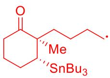

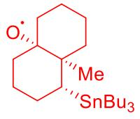

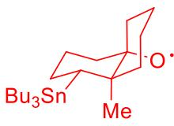

关键中间体: (1分) 或 (2分)立体化学/构象错误不得分。

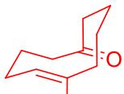

最终产物: Me (2分)双键顺反错误不得分。

10.1.2共4分

关键中间体构象:

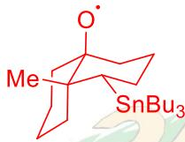

 或

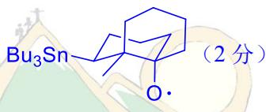

立体化学/构象错误不得分。最终产物:

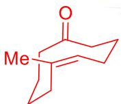

 (2分)双键顺反错误不得分。

10.1.3共3分

关键中间体:

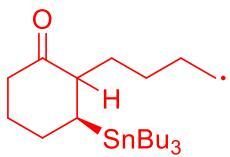

 (1分)

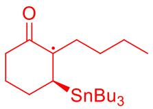

 (1分)最终产物:

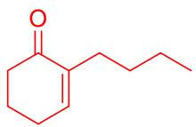

 (1分)

10.1.4共2分

提高(2分)

10.2.1共7分

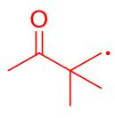

(1分)生成A的关键中间体:

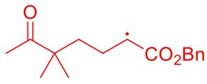

 (1分)

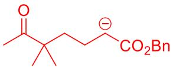

 (1分)生成B的关键中间体:

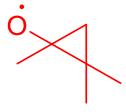

 (1分)

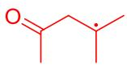

 (1分) [CO2Bn] (1分)

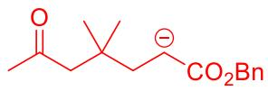

(1分)生成A和B的关键中间体必须标明,不然视作公共中间体。

10.2.2共4分

降低(2分)原底物中偕二甲基效应较强,可使分子内自由基端与羰基更易接近,促进形成三元环氧自由基中间体(2分)答出偕二甲基使三元环中间体张力较大,从而有利于C-C键断裂,也可得分。

10.2.3共4分

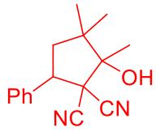

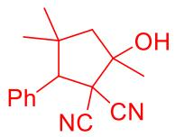

(2分) (2分)

## 知识点映射

- （待人工校准）

> ⚠️ **自动拆卡标记**：`subject_module`/`difficulty` 为关键词粗判，答案数值与单位**尚未经人工复核**（OCR 原文逐字转录，可能保留原卷笔误）。