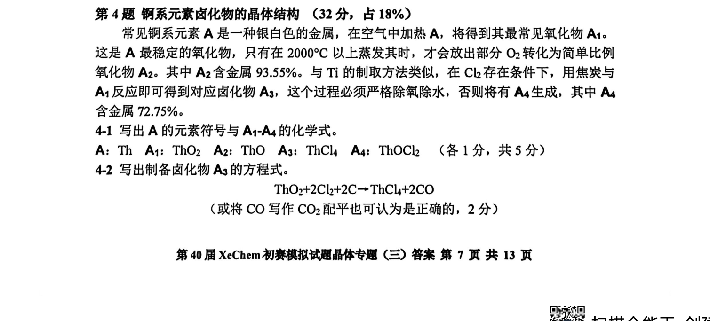
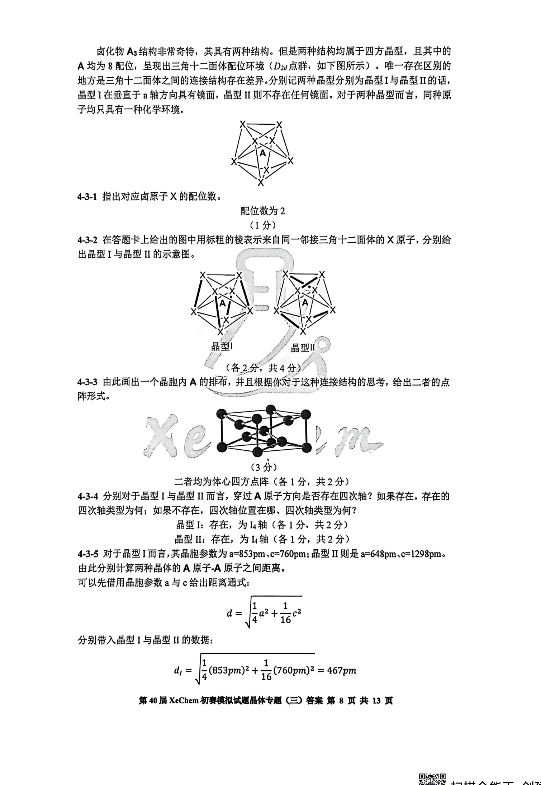
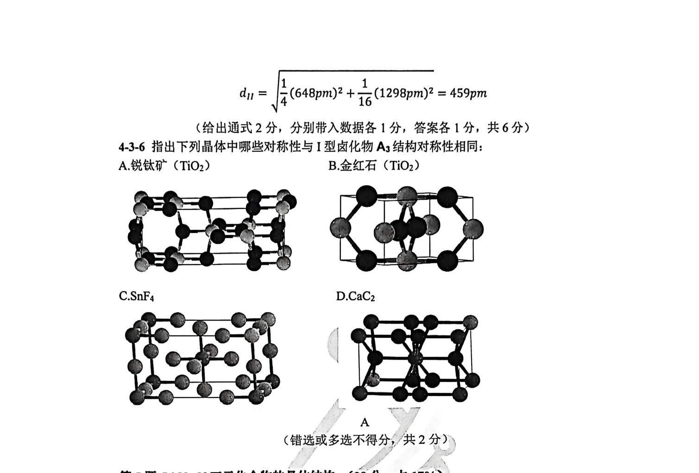

# 题-XeC-03-04-锕系元素卤化物的晶体结构

> 第 4 题 钢系元素卤化物的晶体结构 （32 分，占 18%） 常见锕系元素 A 是一种银白色的金属，在空气中加热 A，将得到其最常见氧化物 。这是 A 最稳定的氧化物，只有在

## 题目

第 4 题 钢系元素卤化物的晶体结构 （32 分，占 18%）

常见锕系元素 A 是一种银白色的金属，在空气中加热 A，将得到其最常见氧化物 $A_{1}$ 。这是 A 最稳定的氧化物，只有在 $2000^{\circ}C$ 以上蒸发其时，才会放出部分 $O_{2}$ 转化为简单比例氧化物 $A_{2}$ 。其中 $A_{2}$ 含金属 93.55%。与 Ti 的制取方法类似，在 $Cl_{2}$ 存在条件下，用焦炭与 $A_{1}$ 反应即可得到对应卤化物 $A_{3}$ ，这个过程必须严格除氧除水，否则将有 $A_{4}$ 生成，其中 $A_{4}$ 含金属 72.75%。

4-1 写出 A 的元素符号与 $A_{1}-A_{4}$ 的化学式。

A: Th $A_{1}$ : ThO $_{2}$ $A_{2}$ : ThO $A_{3}$ : ThCl $_{4}$ $A_{4}$ : ThOCl $_{2}$ （各1分，共5分）

4-2 写出制备卤化物 $\mathbf{A}_{3}$ 的方程式。

$$
\mathrm{ThO} _ {2} + 2 \mathrm{Cl} _ {2} + 2 \mathrm{C} \rightarrow \mathrm{ThCl} _ {4} + 2 \mathrm{CO}
$$

(或将 CO 写作 $CO_{2}$ 配平也可认为是正确的，2 分)

卤化物 $\mathbf{A}_{3}$ 结构非常奇特，其具有两种结构。但是两种结构均属于四方晶型，且其中的 A 均为 8 配位，呈现出三角十二面体配位环境（ $D_{2d}$ 点群，如下图所示）。唯一存在区别的地方是三角十二面体之间的连接结构存在差异。分别记两种晶型分别为晶型 I 与晶型 II 的话，晶型 I 在垂直于 a 轴方向具有镜面，晶型 II 则不存在任何镜面。对于两种晶型而言，同种原子均只具有一种化学环境。

4-3-1 指出对应卤原子 X 的配位数。

配位数为 2

## 参考答案

(1 分)

4-3-2 在答题卡上给出的图中用标粗的棱表示来自同一邻接三角十二面体的 X 原子，分别给出晶型 I 与晶型 II 的示意图。

  
晶型

  
晶型II  
(各2分，共4分)

4-3-3 由此画出一个晶胞内 A 的排布，并且根据你对于这种连接结构的思考，给出二者的点阵形式。

  
(3 分)  
二者均为体心四方点阵（各1分，共2分）

4-3-4 分别对于晶型 I 与晶型 II 而言，穿过 A 原子方向是否存在四次轴？如果存在，存在的四次轴类型为何；如果不存在，四次轴位置在哪、四次轴类型为何？

晶型 I：存在，为 $I_{4}$ 轴（各 1 分，共 2 分）

晶型 II：存在，为 $I_{4}$ 轴（各 1 分，共 2 分）

4-3-5 对于晶型 I 而言, 其晶胞参数为 $a = 853 \mathrm{pm}, c = 760 \mathrm{pm}$ ; 晶型 II 则是 $a = 648 \mathrm{pm}, c = 1298 \mathrm{pm}$ 。由此分别计算两种晶体的 A 原子-A 原子之间距离。

可以先借用晶胞参数 a 与 c 给出距离通式:

$$
d = \sqrt {\frac {1}{4} a ^ {2} + \frac {1}{1 6} c ^ {2}}
$$

分别带入晶型 I 与晶型 II 的数据:

$$
d _ {I} = \sqrt {\frac {1}{4} (8 5 3 p m) ^ {2} + \frac {1}{1 6} (7 6 0 p m) ^ {2}} = 4 6 7 p m
$$

$$
d _ {I I} = \sqrt {\frac {1}{4} (6 4 8 p m) ^ {2} + \frac {1}{1 6} (1 2 9 8 p m) ^ {2}} = 4 5 9 p m
$$

(给出通式2分, 分别带入数据各1分, 答案各1分, 共6分)

4-3-6 指出下列晶体中哪些对称性与 I 型卤化物 $A_{3}$ 结构对称性相同：
A.锐钛矿（ $TiO_{2}$ ）
B.金红石（ $TiO_{2}$ ）

  
C. ${\mathrm{{SnF}}}_{4}$

  
D. ${\mathrm{{CaC}}}_{2}$

  
A  
(错选或多选不得分，共2分)

第5题 Li-Na-N 三元化合物的晶体结构（28分，占 $17\%$ ） $\mathrm{Na}_{3} \mathrm{~N}$ 和 $\mathrm{Li}_{3} \mathrm{~N}$ 属于不同晶型，二者的晶胞结构如下所示：

> ⛔ 校勘（2026-10-07）：源卡**题面区混入解答**（原题面 2798 字），已按「答案起点」截断，混入部分**移入本答案区**；截断判据＝首个评分标注/「解：」。

（源：XeChem模拟三（晶体）官方答案 · 第 4 题；按原册裁区，保留结构图与公式）

> 📌 据源答案册裁区回填（OCR 定位题界）。

## 知识点映射

- （待人工校准）

> ⚠️ **自动建卡标记**：题面/解答为云端 MinerU vlm OCR 整卷产物逐字转录；`difficulty`/`knowledge_points` 为关键词粗判，**未经人工复核**。
