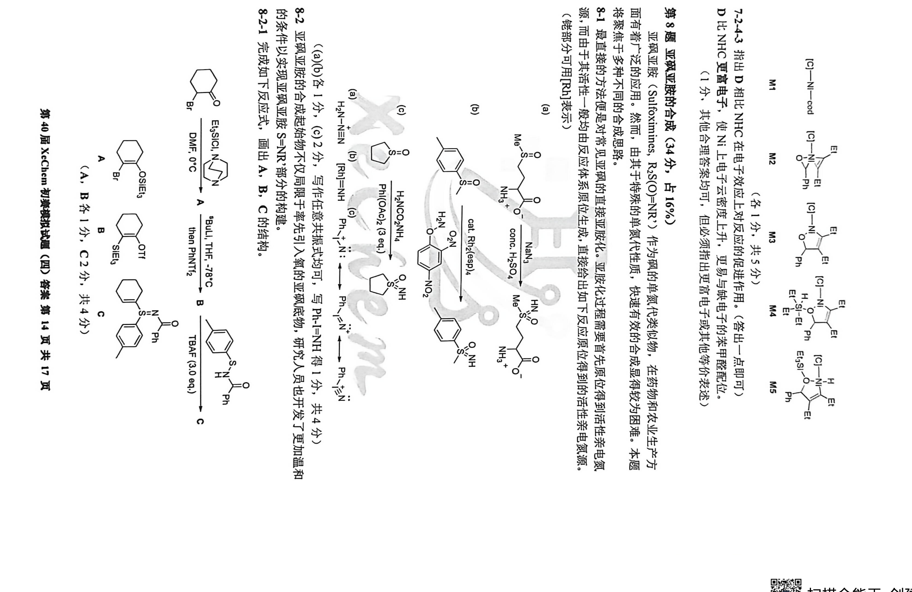
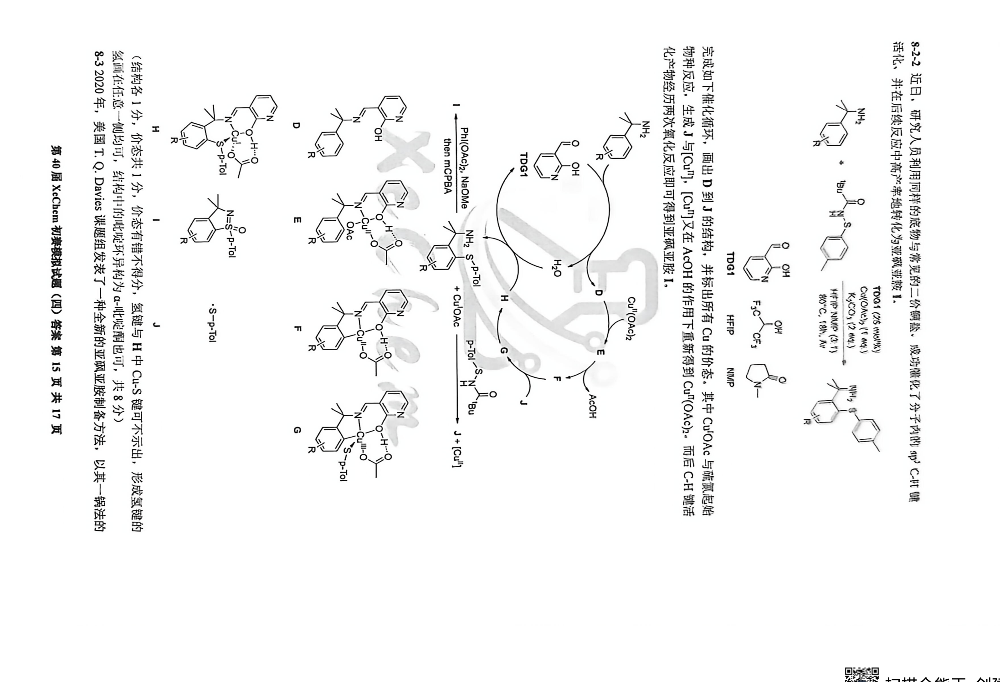
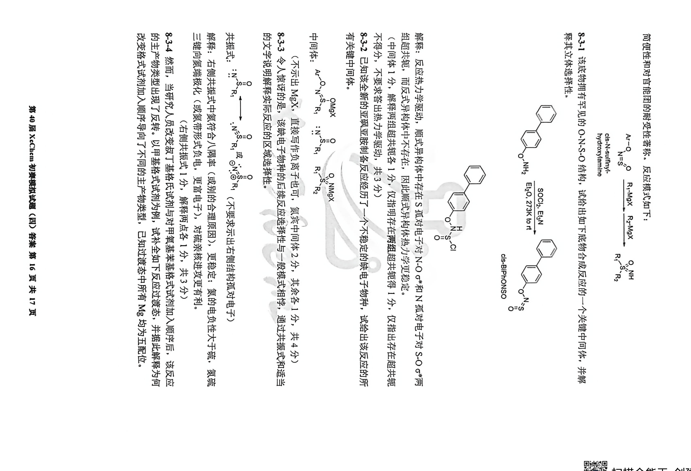
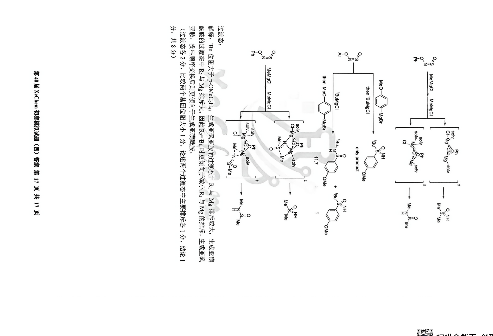

# 题-XeC-04-08-亚砜亚胺的合成

> 8-1 最直接的方法便是对常见亚砜的直接亚胺化。亚胺化过程需要首先原位得到活性亲电氮源，而由于其活性一般均由反应体系原位生成，直接给出如下反应原位得到的活性亲电氮源。（该部分可

## 题目

8-1 最直接的方法便是对常见亚砜的直接亚胺化。亚胺化过程需要首先原位得到活性亲电氮源，而由于其活性一般均由反应体系原位生成，直接给出如下反应原位得到的活性亲电氮源。（该部分可用P51单三）

((a)(b)各1分，(c)2分，写作任意共振式均可，写Ph-I=NH得1分，共4分)
8-2 亚砜亚胺的合成起始物不仅局限于率先引入氧的亚砜底物，研究人员也开发了更加温和

$$
\mathrm{S} = \mathrm{Z} \quad \mathrm{Ph}
$$

第40届XeChem初集接试题（四）答案第15页共17页

8-2-2 近日，研究人员利用同样的底物与常见的二价硼盐，成功催化了分子内的 np-C-Ht 螺活化，并在后续反应中高产率地转化为亚碱亚胺 I.

完成如下催化循环，画出D到J的结构，并标出所有Cu的价态，其中 $\mathrm{Cu^{II}OAc}$ 与硫氰苊始物种反应，生成J与 $[\mathrm{Cu}^{\mathrm{III}}]$ ， $[\mathrm{Cu}^{\mathrm{III}}]$ 又在AcOH的作用下重新得到 $\mathrm{Cu^{II}(OAc)_2}$ ，而后C-H键活产物经历两次氧化反应即可得到亚砜亚胺I。

（结构各1分，价态共1分，价态有错不得分，氢键与H中Cu-S键可不示出，形成氢键的氢画在任意一侧均可，结构中的吡啶环异构为α-吡啶酮也可，共8分）8-32020年，美国T.Q.Davies课题组发表了一种全新的亚砜亚胶制备方法，以其一锅法的简便性和对官能团的耐受性蓄称，反应模式如下：

cis-N-sulfinyl-hydroxylamine

不得分，不要求答出热力学驱动，共3分）
8-3-2 已知该全新的亚砜亚胺制备反应经历了一个不稳定的缺电子物种，试给出该反应的所有关键中间体。

解释：反应热力学驱动，顺式异构体中存在S孤对电子对 $N-O\sigma^{*}$ 和N孤对电子对 $S-O\sigma^{*}$ 两组超共轭，而反式异构体中不存在，因此顺式异构体热力学更稳定。（中间体1分，解释两组超共轭各1分，仅指明存在两组超共轭得1分，仅指出存在超共轭

（不示出 MgX，直接写作负离子也可，氮宾中间体 2 分，其余各 1 分，共 4 分）
8-3-3 令人惊讶的是，该缺电子物种的后续反应选择性与一般模式相悖，通过共振式和适当的文字说明解释实际反应的区域选择性。

解释：右侧共振式中氮符合八隅率（或别的合理原因），更稳定；氮的电负性大于硫，氮硫三键向氦端极化（或氮带形式负电，更富电子），对硫亲核进攻更有利。

8-3-4 然而，当研究人员改变叔丁基格氏试剂与对甲氧基苯基格式试剂加入顺序后，该反应的主产物类型出现了反转。以甲基格式试剂为例，试补全如下反应过渡态，并据此解释为何改变格式试剂加入顺序导向了不同的主产物类型，已知过渡态中所有 $\mathrm{Mg}$ 均为五配位。

第40届XeChcm初案模拟试题（四）答案第17页共17页

分，共8分）

过渡态:
解释: 'Bu 位阻大于 p-OMeC₆H₄; 生成亚砜亚胺的过渡态中 R₁ 与 Mg 排斥较大, 生成亚磺酰胺的过渡态中 R₂ 与 Mg 排斥大。因此 R₂='Bu 时更倾向于减小 R₂ 与 Mg 的排斥, 生成亚砜亚胺, 投料顺序交换后则更倾向于生成亚磺酰胺。(过渡态各 2 分, 比较两个基团位阻大小 1 分, 论述两个过渡态中主要排斥各 1 分, 结论 1

## 参考答案

（源：XeChem模拟四官方答案 · 第 8 题；按原册裁区，保留结构图与公式）

> 📌 据源答案册裁区回填（OCR 定位题界）。

## 知识点映射

- （待人工校准）

> ⚠️ **自动建卡标记**：题面/解答为云端 MinerU vlm OCR 整卷产物逐字转录；`difficulty`/`knowledge_points` 为关键词粗判，**未经人工复核**。
