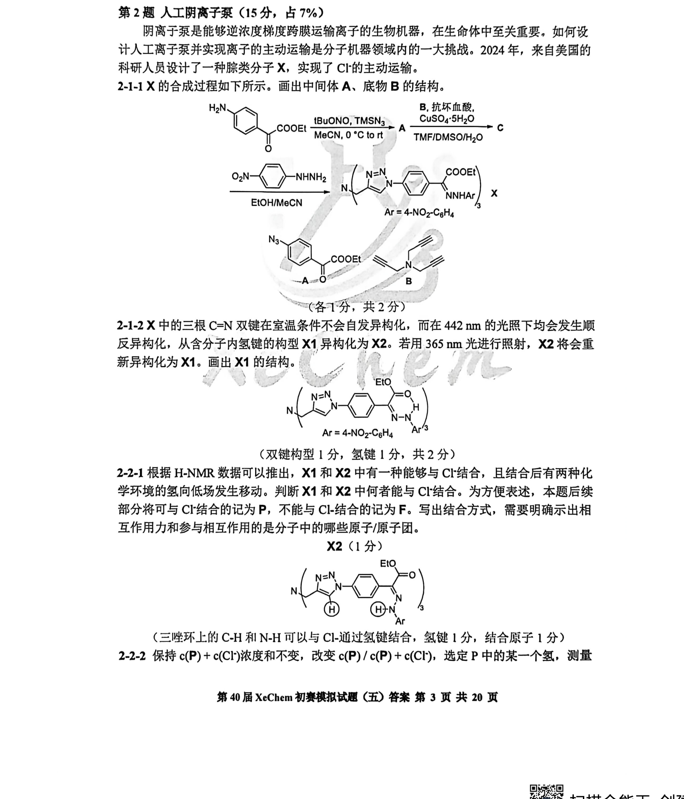
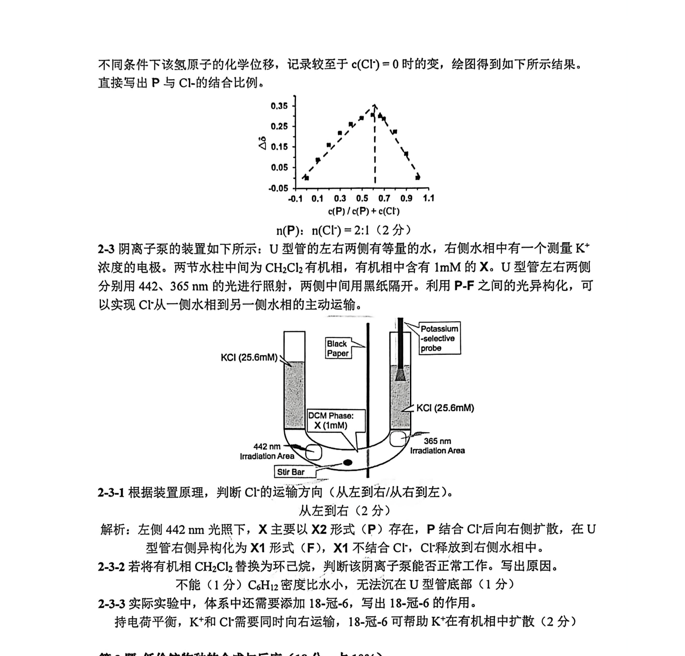

# 题-XeC-05-02-人工阴离子泵

> 第2题 人工阴离子泵（15分，占7%） 阴离子泵是能够逆浓度梯度跨膜运输离子的生物机器，在生命体中至关重要。如何设计人工离子泵并实现离子的主动运输是分子机器领域内的一大挑战。2

## 题目

第2题 人工阴离子泵（15分，占7%）

阴离子泵是能够逆浓度梯度跨膜运输离子的生物机器，在生命体中至关重要。如何设计人工离子泵并实现离子的主动运输是分子机器领域内的一大挑战。2024年，来自美国的科研人员设计了一种腙类分子X，实现了Cl⁻的主动运输。

2-1-1 X 的合成过程如下所示。画出中间体 A、底物 B 的结构。

  
(各1分，共2分)

2-1-2 X 中的三根 C=N 双键在室温条件不会自发异构化，而在 442 nm 的光照下均会发生顺反异构化，从含分子内氢键的构型 X1 异构化为 X2。若用 365 nm 光进行照射，X2 将会重新异构化为 X1。画出 X1 的结构。

  
(双键构型 1 分, 氢键 1 分, 共 2 分)

2-2-1 根据 H-NMR 数据可以推出，X1 和 X2 中有一种能够与 Cl-结合，且结合后有两种化学环境的氢向低场发生移动。判断 X1 和 X2 中何者能与 Cl-结合。为方便表述，本题后续部分将可与 Cl-结合的记为 P，不能与 Cl-结合的记为 F。写出结合方式，需要明确示出相互作用力和参与相互作用的是分子中的哪些原子/原子团。

X2 (1 分)

(三唑环上的 C-H 和 N-H 可以与 Cl-通过氢键结合, 氢键 1 分, 结合原子 1 分) 2-2-2 保持 $c(\mathbf{P}) + c(\mathrm{Cl}^{-})$ 浓度和不变, 改变 $c(\mathbf{P}) / c(\mathbf{P}) + c(\mathrm{Cl}^{-})$ , 选定 P 中的某一个氢, 测量不同条件下该氢原子的化学位移，记录较至于 $c(\mathrm{Cl}^{-}) = 0$ 时的变，绘图得到如下所示结果。直接写出 $P$ 与 $Cl^-$ 的结合比例。

  
$n(P)$ : $n(Cl^{-}) = 2:1$ (2分)

2-3 阴离子泵的装置如下所示: U 型管的左右两侧有等量的水, 右侧水相中有一个测量 $\mathrm{K}^{+}$ 浓度的电极。两节水柱中间为 $\mathrm{CH}_{2} \mathrm{Cl}_{2}$ 有机相, 有机相中含有 $1 \mathrm{mM}$ 的 $\mathbf{X}$ 。U 型管左右两侧分别用 442、 $365 \mathrm{~nm}$ 的光进行照射, 两侧中间用黑纸隔开。利用 P-F 之间的光异构化, 可以实现 Cl⁻从一侧水相到另一侧水相的主动运输。

2-3-1 根据装置原理，判断 Cl⁻ 的运输方向（从左到右/从右到左）。

从左到右（2分）

解析：左侧 442 nm 光照下，X 主要以 X2 形式（P）存在，P 结合 Cl⁻ 后向右侧扩散，在 U 型管右侧异构化为 X1 形式（F），X1 不结合 Cl⁻，Cl⁻ 释放到右侧水相中。

2-3-2 若将有机相 $\mathrm{CH}_2\mathrm{Cl}_2$ 替换为环己烷, 判断该阴离子泵能否正常工作。写出原因。

不能（1分） $C_{6}H_{12}$ 密度比水小，无法沉在U型管底部（1分）

2-3-3 实际实验中，体系中还需要添加 18-冠-6，写出 18-冠-6 的作用。

持电荷平衡， $\mathrm{K}^{+}$ 和 $\mathrm{Cl}^{-}$ 需要同时向右运输，18-冠-6可帮助 $\mathrm{K}^{+}$ 在有机相中扩散（2分）

## 参考答案

（源：XeChem模拟五官方答案 · 第 2 题；按原册裁区，保留结构图与公式）

> 📌 据源答案册裁区回填（OCR 定位题界）。

## 知识点映射

- （待人工校准）

> ⚠️ **自动建卡标记**：题面/解答为云端 MinerU vlm OCR 整卷产物逐字转录；`difficulty`/`knowledge_points` 为关键词粗判，**未经人工复核**。
