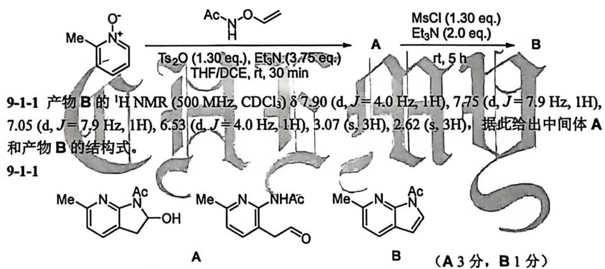
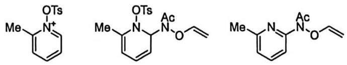
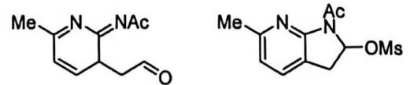
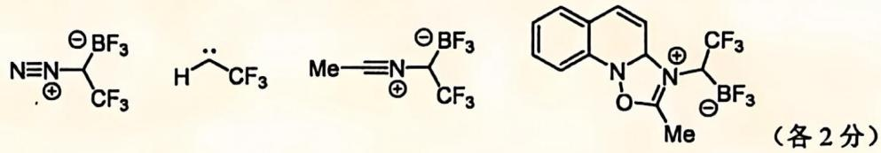
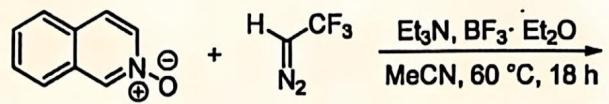
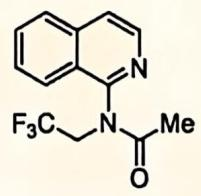
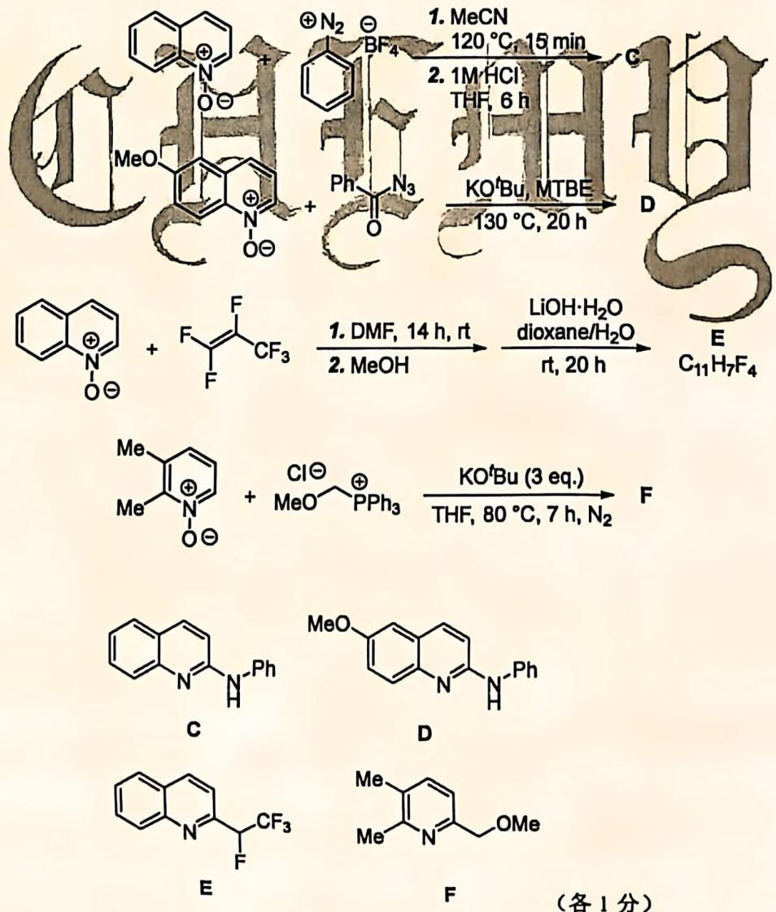

# 题-CM-02-09-吡啶N氧化物具有特殊的化学性

## 题目

### 第 9 题 吡啶 N-氧化物 （27 分，占 11%）

吡啶 N-氧化物具有特殊的化学性质，被广泛地用于有机合成、催化、药物中的关键中间体。相较于吡啶，吡啶 N-氧化物更加富电子，且其中由氧原子额外引进的氧化态使得对吡啶环本身的氧化修饰更加高效便捷。

9-1 科研人员开发了如下反应:

9-1-1 产物 B 的 ${}^{1}$ H NMR (500 MHz, CDCl $_{3}$ ) δ 7.90 (d, J = 4.0 Hz, 1H), 7.75 (d, J = 7.9 Hz, 1H), 7.05 (d, J = 7.9 Hz, 1H), 6.53 (d, J = 4.0 Hz, 1H), 3.07 (s, 3H), 2.62 (s, 3H), 据此给出中间体 A 和产物 B 的结构式。

9-1-2 给出该反应的关键中间体。

9-2 类似地, 如下反应实现了吡啶 $N$ -氧化物向 2-取代吡啶的转化:

9-2-1 给出该反应的关键中间体。

9-2-2 给出该反应的产物:

9- 2- 3 根据你的观察，给出下列反应的产物：

## 参考答案

📎 **答案出处**：源卷答案结构图已随卡；评分说明为 OCR 原文，数值未逐条复核。

> 源：第40届Chemy化学奥林匹克初赛模拟试题2+答案.md（第 9 题）

A 写出其中一个中间体即可

9-1-2

(各2分)

9-2-1 共 6 分，第 1 个中间体可用第 2 个中间体替换。

9-2-39-2-2

(3 分)

(各1分)

## 知识点映射

- （待人工校准）

> ⚠️ **自动拆卡标记**：本卡由 2026-09-28 覆盖核查补提炼（源为**题面＋答案合并文件**）；题面/答案边界为自动切分，`subject_module`/`difficulty` 为关键词粗判，答案数值未人工复核。
