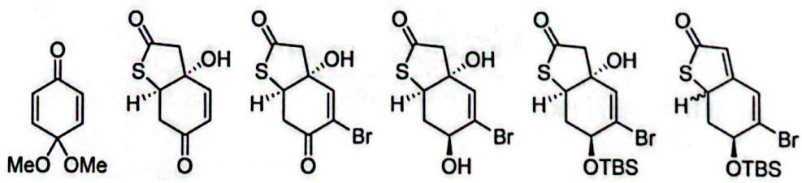
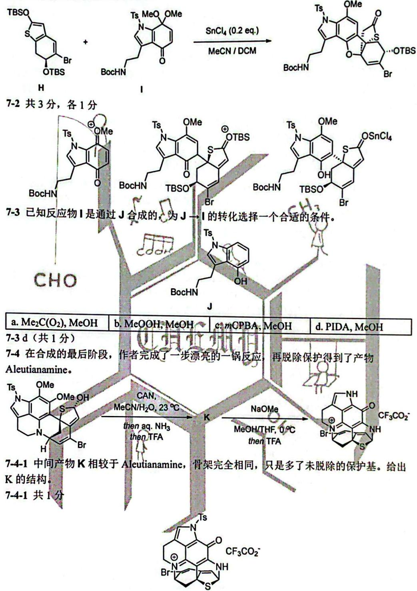
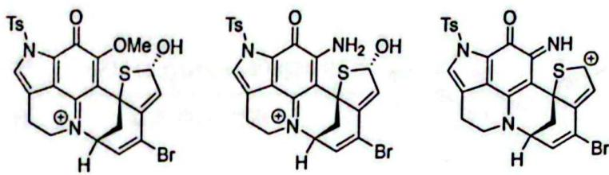

# 题-CM-03-07-71通过如下得几步反应制备了

## 题目

### 第7题（14 分，占 9%）

7-1 通过如下得几步反应，制备了合成 Aleutianamine 的一个关键中间产物 H，给出 B\~G 的结构。(注：B 到 C 第一步反应的加料顺序为：先将 AcSH、LDA 在 THF 中充分混合，再加入 B 充分反应(反应完成后用 HCl 水溶液后处理)

<table><tr><td>a. Me2C(O2), MeOH</td><td>b. MeOOH, MeOH</td><td>c. mCPBA, MeOH</td><td>d. PIDA, MeOH</td></tr></table>

7-4 在合成的最后阶段，作者完成了一步漂亮的一锅反应，再脱除保护得到了产物 Aleutianamine。

7-4-1 中间产物 K 相较于 Aleutianamine，骨架完全相同，只是多了未脱除的保护基。给出 K 的结构。

7-4-2 给出得到 K 的关键中间体。

## 参考答案

📎 **答案出处**：源卷答案结构图已随卡；评分说明为 OCR 原文，数值未逐条复核。

> 源：cm化学试卷-初赛模拟试题3+答案3.md（第 7 题）

7-1 共6分，各1分

7-2 产物 H 紧接着发生如下的转化。该关键步骤通过 Lewis 酸 SnCl₄ 的催化，合成了并环产物。给出该反应的关键中间体。

7-4-2 共 3 分，各 1 分

## 知识点映射

- （待人工校准）

> ⚠️ **自动拆卡标记**：本卡由 2026-09-28 覆盖核查补提炼（源为**题面＋答案合并文件**）；题面/答案边界为自动切分，`subject_module`/`difficulty` 为关键词粗判，答案数值未人工复核。
