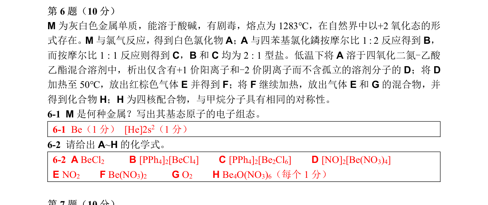

# 题-CM-63-06-M为灰白色金属单质能溶于酸碱

## 题目

### 第 6 题（10 分）

M 为灰白色金属单质， 能溶于酸碱， 有剧毒，熔点为 $1283^{ \circ } \mathrm { C }$ ， 在自然界中以 $+ 2$ 氧化态的形式存在。 $M$ 与氯气反应，得到白色氯化物A；A 与四苯基氯化鏻按摩尔比1 : 2 反应得到B，而按摩尔比 $1 : 1$ 反应则得到C，B 和C 均为 $2 : 1$ 型盐。低温下将A 溶于四氧化二氮-乙酸乙酯混合溶剂中，析出仅含有 $+ 1$ 价阳离子和-2 价阴离子而不含孤立的溶剂分子的 D；将D加热至 $50^{ \circ } \mathrm { C }$ ， 放出红棕色气体E 并得到F；将 F 继续加热，放出气体E 和 G 的混合物，并得到化合物H；H 为四核配合物， 与甲烷分子具有相同的对称性。
点为1283℃，在自然界中以+2 氧化态的形式存在。M 与氯

6-1 M 是何种金属？ 写出其基态原子的电子组态。
6-2 请给出 $\pmb { A } { \sim } \pmb { \mathsf { H } }$ 的化学式。

## 参考答案

（源：chemy 第33届题目合集答案 · 模拟试卷3 答案 · 第 6 题；按原册裁区，保留公式与图）

> 📌 据源答案合集逐题裁区回填。

## 知识点映射

- （待人工校准）
