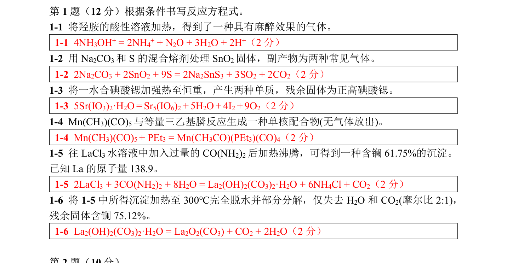

# 题-CM-64-01-1-1将羟胺的酸性溶液加热得

## 题目

### 第 1 题（12 分）

1-1 将羟胺的酸性溶液加热， 得到了一种具有麻醉效果的气体。

1-2 用 $\mathrm { Na } _{ 2 } \mathrm { CO } _{ 3 }$ 和S 的混合熔剂处理 $\mathrm { SnO } _{ 2 }$ 固体，副产物为两种常见气体。
1-3 将一水合碘酸锶加强热至恒重，产生两种单质，残余固体为正高碘酸锶。
$\mathbf { 1 - 4 } \ \mathrm { Mn } ( \mathrm { CH } _{ 3 } ) ( \mathrm { CO } ) _{ 5 }$ 与等量三乙基膦反应生成一种单核配合物(无气体放出)。
1-5 往 $\mathrm { LaCl } _{ 3 }$ 水溶液中加入过量的 $\mathrm { CO ( NH } _{ 2 } ) _{ 2 }$ 后加热沸腾，可得到一种含镧 $61.75 \%$ 的沉淀。

已知 La 的原子量 138.9。
1-6 将 1-5 中所得沉淀加热至 $300^{ \circ } \mathrm { C }$ 完全脱水并部分分解， 仅失去 $\mathrm { H } _{ 2 } \mathrm { O }$ 和 $\mathrm { CO } _{ 2 }$ (摩尔比 2:1)，残余固体含镧 $75.12 \%$ 。

## 参考答案

（源：chemy 第33届题目合集答案 · 模拟试卷4 答案 · 第 1 题；按原册裁区，保留公式与图）

> 📌 据源答案合集逐题裁区回填。

## 知识点映射

- （待人工校准）
