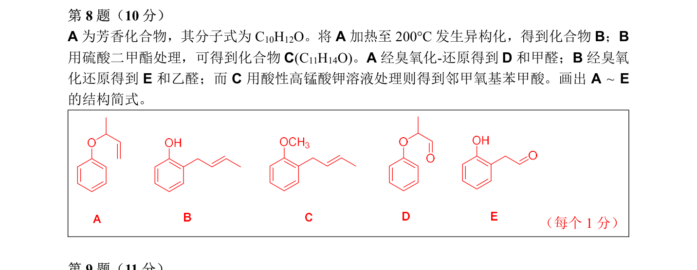

# 题-CM-64-08-A为芳香化合物其分子式为将加

## 题目

### 第 8 题（10 分）

A 为芳香化合物， 其分子式为 $\mathrm { C _{ 10 } H _{ 12 } O }$ 。 将 $\pmb { \mathsf { A } }$ 加热至 $200^{ \circ } \mathrm { C }$ 发生异构化， 得到化合物B；B用硫酸二甲酯处理， 可得到化合物 ${ \pmb { \mathsf { C } } } ( { \bf C } _{ 11 } \mathrm { H } _{ 14 } { \bf O } )$ 。 $\pmb { \mathsf { A } }$ 经臭氧化-还原得到 $D$ 和甲醛；B 经臭氧化还原得到 E 和乙醛； 而 C 用酸性高锰酸钾溶液处理则得到邻甲氧基苯甲酸。 画出 $\mathsf { A } \sim \mathsf { E }$ 的结构简式。

## 参考答案

（源：chemy 第33届题目合集答案 · 模拟试卷4 答案 · 第 8 题；按原册裁区，保留公式与图）

> 📌 据源答案合集逐题裁区回填。

## 知识点映射

- （待人工校准）
