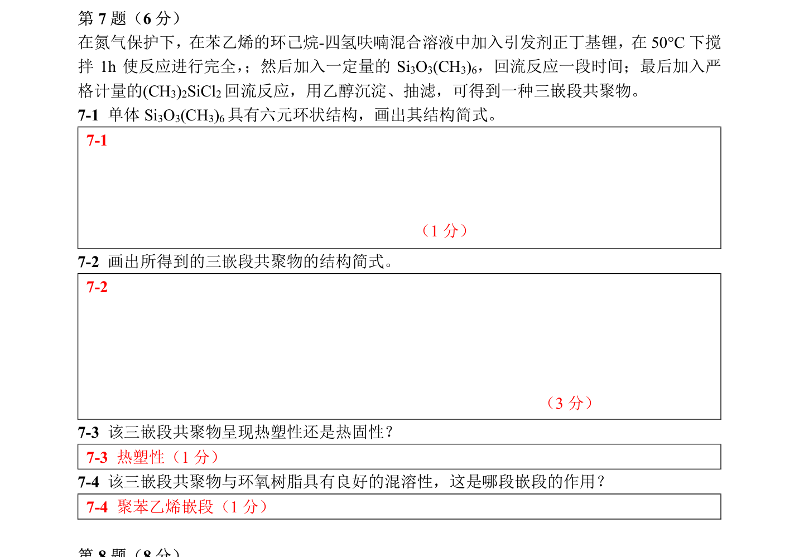

# 题-CM-65-07-在氮气保护下在苯乙烯的环己烷

## 题目

### 第 7 题（6 分）

在氮气保护下，在苯乙烯的环己烷-四氢呋喃混合溶液中加入引发剂正丁基锂，在 $50^{ \circ } \mathrm { C }$ 下搅拌 1h 使反应进行完全，；然后加入一定量的 $\mathrm { Si } _{ 3 } \mathrm { O } _{ 3 } ( \mathrm { CH } _{ 3 } ) _{ 6 }$ ， 回流反应一段时间； 最后加入严格计量的 $( \mathrm { CH } _{ 3 } ) _{ 2 } \mathrm { SiCl } _{ 2 }$ 回流反应， 用乙醇沉淀、抽滤， 可得到一种三嵌段共聚物。

7-1 单体 $\mathrm { Si } _{ 3 } \mathrm { O } _{ 3 } ( \mathrm { CH } _{ 3 } ) _{ 6 }$ 具有六元环状结构， 画出其结构简式。

7-2 画出所得到的三嵌段共聚物的结构简式。

7-3 该三嵌段共聚物呈现热塑性还是热固性？

7-4 该三嵌段共聚物与环氧树脂具有良好的混溶性， 这是哪段嵌段的作用？

## 参考答案

（源：chemy 第33届题目合集答案 · 模拟试卷5 答案 · 第 7 题；按原册裁区，保留公式与图）

> 📌 据源答案合集逐题裁区回填。

## 知识点映射

- （待人工校准）
