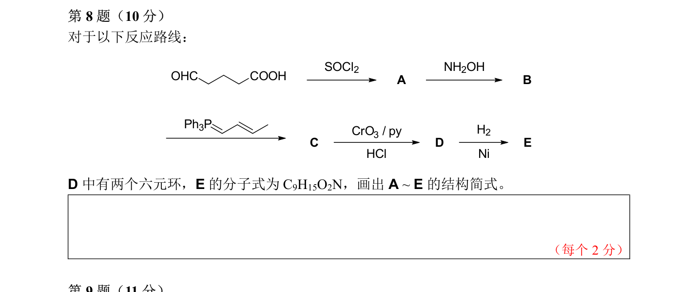

# 题-CM-68-08-对于以下反应路线

## 题目

### 第 8 题（10 分）

对于以下反应路线：

D 中有两个六元环， E 的分子式为 $\mathrm { C } _{ 9 } \mathrm { H } _{ 15 } \mathrm { O } _{ 2 } \mathrm { N }$ ， 画出 $\mathsf { A } \sim \mathsf { E }$ 的结构简式。

## 参考答案

（源：chemy 第33届题目合集答案 · 模拟试卷8 答案 · 第 8 题；按原册裁区，保留公式与图）

> 📌 据源答案合集逐题裁区回填。

## 知识点映射

- （待人工校准）
