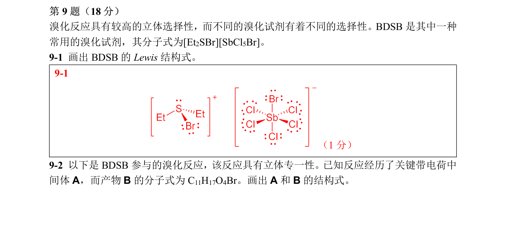

# 题-CM-70-09-溴化反应具有较高的立体选择性

## 题目

### 第 9 题（18 分）

溴化反应具有较高的立体选择性， 而不同的溴化试剂有着不同的选择性。 BDSB 是其中一种常用的溴化试剂， 其分子式为 $[ \mathrm { Et _{ 2 } SBr } ] [ \mathrm { SbCl _{ 5 } Br } ]$ 。

9-1 画出 BDSB 的 Lewis 结构式。

9-2 以下是 BDSB 参与的溴化反应， 该反应具有立体专一性。已知反应经历了关键带电荷中间体A， 而产物B 的分子式为 $\mathrm { C _{ 11 } H _{ 17 } O _{ 4 } Br }$ 。 画出A 和 B 的结构式。

9-3 由于 BDSB 作为 $\mathrm { Br ^{ + } }$ 供体， 故有时 BDSB 可以诱导发生碳正离子的 Cascade Reaction。

9-3-1 已知产物C 中含有三个环， 画出C 的最稳定构象。
9-3-2 若将溶剂 $\mathrm { MeNO } _{ 2 }$ 换为 toluene， 则反应产率将大大降低， 解释溶剂对反应的影响。9-4 除了 BDSB 外，在有机合成中也会用到其他的溴化策略，以下反应涉及到两个常用的溴化策略。

其中Oct 是一种烃基， 可将 $\mathrm { POct } _{ 3 }$ 看作 $\mathrm { PPh } _{ 3 }$ 。

9-4-1 写出最终产物中所有手性碳的构型。

9-4-2 已知D 和F 是带电荷的关键中间体， 而E 是中间产物。 画出D \~ F 的结构式。

## 参考答案

（源：chemy 第33届题目合集答案 · 有机化学专题1 答案 · 第 9 题；按原册裁区，保留公式与图）

> 📌 据源答案合集逐题裁区回填。

## 知识点映射

- （待人工校准）
