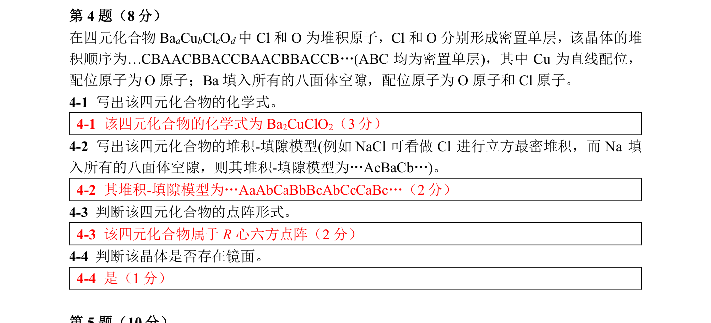

# 题-CM-76-04-在四元化合物中Cl和O为堆积

## 题目

### 第 4 题（8 分）

在四元化合物 $Ba_{a}Cu_{b}Cl_{c}O_{d}$ 中 Cl 和 O 为堆积原子，Cl 和 O 分别形成密置单层，该晶体的堆积顺序为…CBAACBBACCBAACBBACCB…(ABC 均为密置单层)，其中 Cu 为直线配位，配位原子为 O 原子；Ba 填入所有的八面体空隙，配位原子为 O 原子和 Cl 原子。

4-1 写出该四元化合物的化学式。

4-2 写出该四元化合物的堆积-填隙模型(例如 NaCl 可看做 Cl⁻ 进行立方最密堆积，而 Na⁺ 填入所有的八面体空隙，则其堆积-填隙模型为…AcBaCb…)。

4-3 判断该四元化合物的点阵形式。

4-4 判断该晶体是否存在镜面。

## 参考答案

（源：chemy 第34届题目合集答案 · 模拟试卷3 答案 · 第 4 题；按原册裁区，保留公式与图）

> 📌 据源答案合集逐题裁区回填。

## 知识点映射

- （待人工校准）
