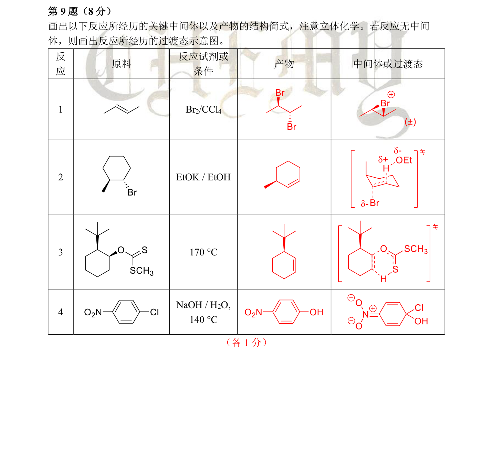

# 题-CM-80-09-画出以下反应所经历的关键中间

## 题目

### 第 9 题（8 分）

画出以下反应所经历的关键中间体以及产物的结构简式，注意立体化学。若反应无中间体，则画出反应所经历的过渡态示意图。
示意图。反应原料反应试剂或条件产物中间体或过渡态Br2/CCl4

<table><tr><td>反应</td><td>原料</td><td>反应试剂或条件</td><td>产物</td><td>中间体或过渡态</td></tr><tr><td>1</td><td></td><td> $Br_2/CCl_4$ </td><td></td><td></td></tr><tr><td>2</td><td></td><td>EtOK / EtOH</td><td></td><td></td></tr><tr><td>3</td><td></td><td>170 °C</td><td></td><td></td></tr><tr><td>4</td><td></td><td>NaOH /  $H_2O$ , 140 °C</td><td></td><td></td></tr></table>

## 参考答案

（源：chemy 第34届题目合集答案 · 模拟试卷7 答案 · 第 9 题；按原册裁区，保留公式与图）

> 📌 据源答案合集逐题裁区回填。

## 知识点映射

- （待人工校准）
