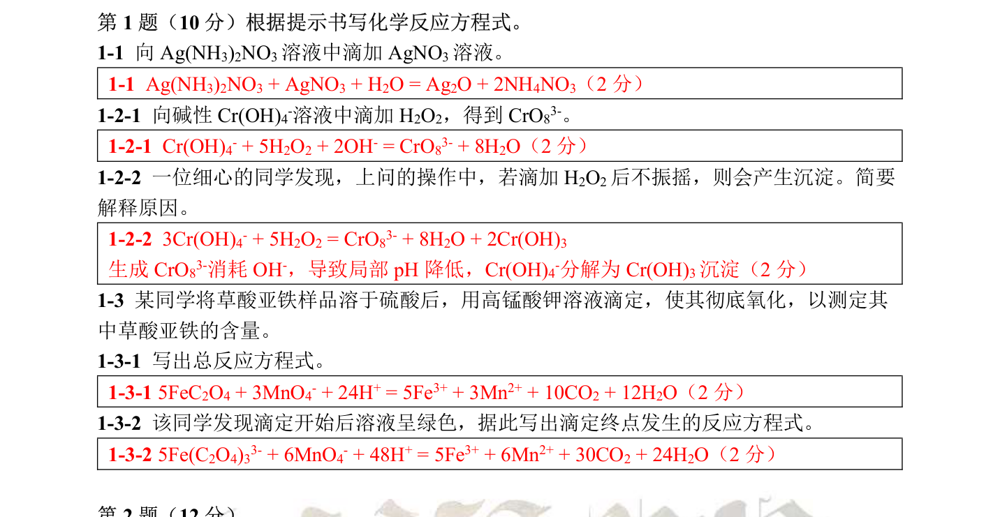

# 题-CM-91-01-1-1向溶液中滴加溶液

## 题目

### 第 1 题（10 分）

1-1 向 $\mathrm{Ag(NH_{3})_{2}NO_{3}}$ 溶液中滴加 $AgNO_{3}$ 溶液。

1-2-1 向碱性 $\mathrm{Cr(OH)_{4}^{-}}$ 溶液中滴加 $H_{2}O_{2}$ ，得到 $CrO_{8}^{3-}$ 。

1-2-2 一位细心的同学发现，上问的操作中，若滴加 $H_{2}O_{2}$ 后不振摇，则会产生沉淀。简要解释原因。

1-3 某同学将草酸亚铁样品溶于硫酸后，用高锰酸钾溶液滴定，使其彻底氧化，以测定其中草酸亚铁的含量。

1-3-1 写出总反应方程式。

1-3-2 该同学发现滴定开始后溶液呈绿色，据此写出滴定终点发生的反应方程式。

## 参考答案

（源：chemy 第35届题目合集答案 · 模拟试题1 参考答案 · 第 1 题；按原册裁区，保留公式与图）

> 📌 据源答案合集逐题裁区回填。

## 知识点映射

- （待人工校准）
