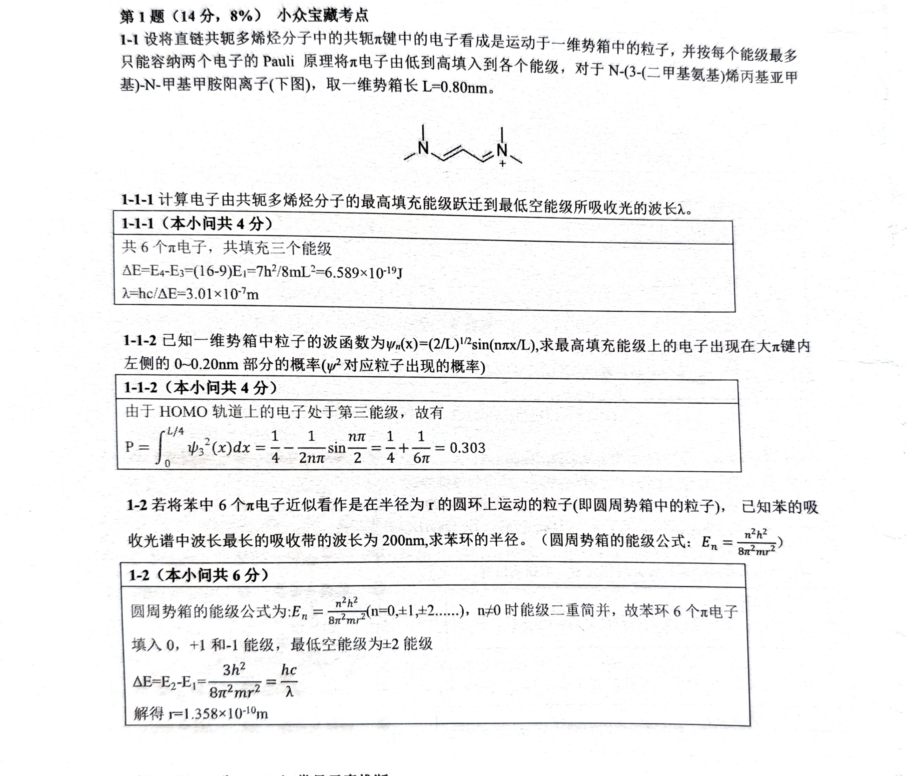

# 题-GM-01-01-11设将直链共轭多烯烃分子中

## 题目

### 第 1 题（14分，8%） 小众宝藏出生考点

1-1 设将直链共轭多烯烃分子中的共轭 $\pi$ 键中的电子看成是运动于一维势箱中的粒子, 并按每个能级最多只能容纳两个电子的 Pauli 原理将 $\pi$ 电子由低到高填入到各个能级, 对于 N-(3-(二甲基氨基)烯丙基亚甲基)-N-甲基甲胺阳离子(下图), 取一维势箱长 $L = 0.80 \mathrm{~nm}$ 。

$$
\Delta E = \frac {h ^ {2}}{8 m l ^ {2}} (16 - 9) \quad \Delta E = \frac {h c}{\lambda}
$$

1-1-1 计算电子由共轭多烯烃分子的最高填充能级跃迁到最低空能级所吸收光的波长 $\lambda$ 。

这类题目只要找准跃迁能级然后套公式算就行。

一红势箱$\underline{w}$ 2 $\underline{w}$ n=1

$$
E _ {n} = \frac {w h}{8 m l ^ {2}}
$$

1-1-2 已知一维势箱中粒子的波函数为 $\psi_{n}(x)=(2/L)^{1/2}\sin(n\pi x/L)$ ，求最高填充能级上的电子出现在大 $\pi$ 键内左侧的 0\~0.20nm 部分的概率 $(\psi^{2}$ 对应粒子出现的概率

拓展：波函数的“正交性”和“归一性”如何在一维势箱中体现？多个波函数的叠加系数

需要满足？

$$
\begin{array}{r l} {\int_ {0} ^ {\frac {L}{4}} \psi_ {3} ^ {2} (x) d x} & {= \frac {2}{L} \int_ {0} ^ {\frac {L}{4}} \sin^ {2} (n \pi x / L) d x} \\ & {= \frac {1}{L} \int_ {0} ^ {\frac {L}{4}} (1 - \cos (2 n \pi x / L) d x = \frac {1}{4} + \frac {1}{6 \pi}.} \end{array}
$$

1-2 若将苯中 6 个 $\pi$ 电子近似看作是在半径为 r 的圆环上运动的粒子(即圆周势箱中的粒子), 已知苯的吸收光谱中波长最长的吸收带的波长为 $200 \mathrm{~nm}$ , 求苯环的半径。(圆周势箱的能级公

$$
E _ {n} = \frac {n ^ {2} h ^ {2}}{8 \pi^ {2} m r ^ {2}})
$$

套公式啊套公式。

$$
\int_ {m} \psi_ {n} ^ {\pm} \psi_ {n} (x) d x = 1 = \frac {2}{L} \int_ {0} ^ {L} \sin^ {2} (\frac {n x}{L}) d x = 1
$$

$$
P _ {\psi_ {n} ^ {*} (x)} \psi_ {m} (x) d x = 0 = \frac {2}{L} \int_ {0} ^ {L} \sin (\frac {n x}{L}) \sin (\frac {m x}{L}) d x
$$

## 参考答案

（源：伽马2026五一·模拟5答案 · 第 1 题；按原册裁区，保留结构图与公式）

> 📌 据源答案册裁区回填（OCR 定位题界）。

## 知识点映射

- （待人工校准）

> ⚠️ **自动拆卡标记**：`subject_module`/`difficulty` 为关键词粗判，答案数值与单位**尚未经人工复核**（OCR 原文逐字转录，可能保留原卷笔误）。