# 题-GM-01-03-Pummerer重排是用乙酸~2

## 题目

### 第 3 题Pummerer重排的应用(28分)

Pummerer 重排是用乙酸酐将亚砜重排为 $\alpha$ -酰氧基硫醚的化学反应(反应模式如下图所示)，其变体可用于诸多化学反应，在全合成等领域有重要的应用。

3-1 根据对该反应机理的了解，完成以下题目。

3-1-1 以下因素中可能促进 Pummerer 重排反应中酰氧基硫盐的形成的有：（）

(a) 使用 $(t\mathrm{BuOOC})_{2}\mathrm{O}$ 以替代 $Ac_{2}O$ ;

(b) $\alpha$ -碳上的取代基为强吸电子基；

(c) 反应溶剂的极性减小;

(d) 使用弱酸作为助催化剂；

(e) 以上选项均不为合理备选项。

3-1-2 以下关于 Pummerer 重排反应中产物立体化学的描述不准确的有：（）

(a) 产物的立体化学通常取决于底物的立体构型和重排过程中的立体效应;

(b) 在某些情况下，产物的立体化学可能受到电子效应的影响；

(c) 产物的立体化学总是与底物的立体构型保持一致;

(d) 产物的立体化学可能受到反应条件(如温度和溶剂)的影响;

(e) 以上选项均不为合理备选项。

3-1-3 以下关于 Pummerer 重排的说法中正确的有：（）

(a) 亚砜底物必须在 $\alpha$ 位有至少一个氢原子才能发生重排；

(b) 在 Pummerer 重排发生后，用碱处理可通过 $\beta$ -消除形成乙烯基硫化物；

(c) $\alpha$ -乙酰氧基硫化物发生 Pummerer 重排后可水解得到硫醇和羰基化合物；

(d) 当亚砜在 $\alpha$ -和 $\alpha'$ 位置都具有氢时，通常酸性更强的位置被优先取代；

(e) 以上选项均不为合理备选项。

3-2 在以下反应中，在加入 HCl 脱保护时，会发生重排具有吲哚环的产物：

3-2-1 画出中间产物 A 的结构，并解释该过程中的区域选择性。

3-2-2 给出由中间产物 A 生成最终产物的关键中间体。

3-3 通过 Pummerer 重排，可以一步构建多取代呋喃产物：

3-3-1 给出该反应的关键中间体。

3-3-2 该反应中，若将 S 上的甲基更换为 $-\mathrm{CH}_2\mathrm{CO}_2\mathrm{Et}$ ，反应将无法得到类似产物，请解释原因，并给出实际得到的产物。

3-4 当 S 上存在手性中心时，该反应可能存在立体选择性：

3-4-1 标出硫手性中心的绝对构型(用 R/S 表示)。

3-4-2 给出主产物中，手性碳的绝对构型(用 R/S 表示)。

3-4-3 以下关于得到该主产物的手性构型的因素，最主要的是：（）

(a) 溶液中存在紧密离子对效应;

(b) 该反应需经历椅式六元环过渡态，将大位阻基团放于平伏键有利于反应；

(c) 该体系中存在异头碳效应，体系通过超共轭效应获得额外稳定的能力；

(d) 进攻时的电子排斥导致了主产物手性构型的形成;

(e) 以上选项均不为合理备选项。

3-4-4 示出不同反应路径的中间体结构，并加以必要的文字描述，通过对比解释你的判断。

## 参考答案

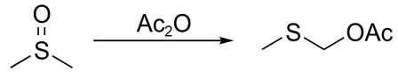
(a) 使用 $(tBuOOC)_{2}O$ 以替代 $Ac_{2}O$ ;
(b) $\alpha$ -碳上的取代基为强吸电子基;
(c) 反应溶剂的极性减小;
(d) 使用弱酸作为助催化剂；
(e) 以上选项均不为合理备选项。
   3-1-1(本小问共1分)      (e)(1分)或(d)   
(e) 以上选项均不为合理备选项。
## 8-1-2（本小问共1分）
(e) 以上选项均不为合理备选项。
   3-1-3(本小问共2分)      (a)(b)(c)(d) (2分)   
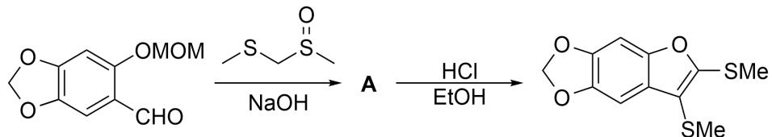
   3-2-1(本小问共3分)    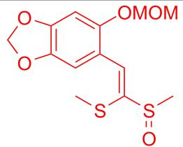 (2分)区域选择性:S可稳定碳负离子,中部的碳负离子更稳定。(1分)    3-2-2给出由中间产物A生成最终产物的关键中间体。    3-2-(本小问共4分)    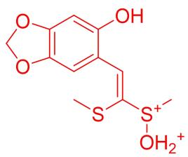 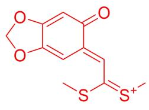 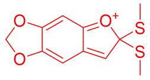    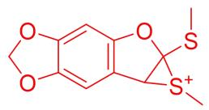 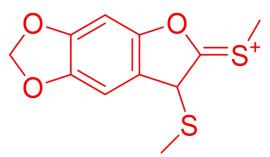    (写出4个得满分4分)    3-3通过Pummerer重排,可以一步构建多取代呋喃产物:    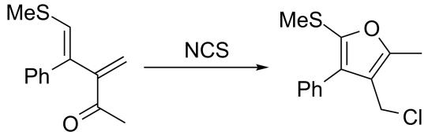    8-3-1给出该反应的关键中间体。    3-3-(本小问共3分)    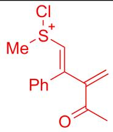 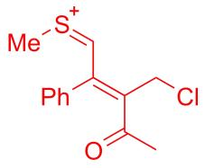 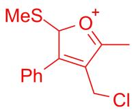    (每个1分)    3-3-2该反应中,若将S上的甲基更换为-CH2CO2Et,反应将无法得到类似产物,请解释原因,并给出实际得到的产物。    3-3-(本小问共3分)    更换后的位点上连接的氢酸性增强,易发生消除(1分),随后得到如下产物:    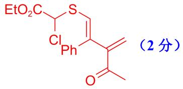    8-4-3(本小问共2分)    (a)    3-4-4示出不同反应路径的中间体结构,并加以必要的文字描述,通过对比解释你的判断。    3-4-4(本小问共6分)    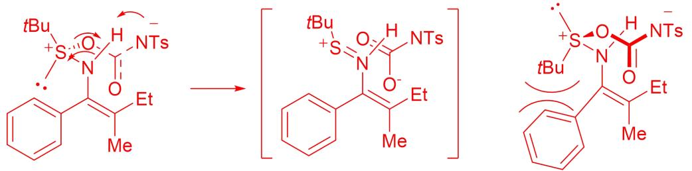紧密离子对每个中间体结构各占2分为避免叔丁基和苯基的排斥,形成紧密离子对时进攻基团位于下方(2分)   

   3-4-1(本小问共1分)    R   
   3-4-2(本小问共2分)    S   
(a) 溶液中存在紧密离子对效应;

## 知识点映射

- （待人工校准）

> ⚠️ **自动拆卡标记**：`subject_module`/`difficulty` 为关键词粗判，答案数值与单位**尚未经人工复核**（OCR 原文逐字转录，可能保留原卷笔误）。