# 题-GM-01-04-长期以来有机硫化合物在合成中~2

## 题目

### 第 4 题 有机化学中的亚砜 (38 分, 15%)

长期以来，有机硫化合物在合成中扮演重要的角色，而亚砜因其独特的极化结构，往往在发生重排反应的同时引发分子内的氧化还原反应。

4-1 Pummerer 重排是一类经典的人名反应，常被用于硫原子 $\alpha$ 位的修饰，以下是一个例子。

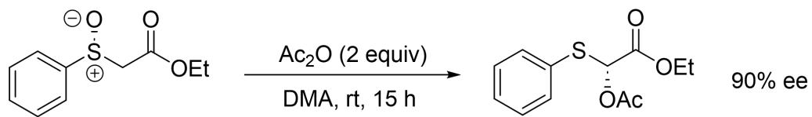

给出关键中间体，并解释该反应具有较高立体选择性的原因。

4-2 Yorimitsu 运用 Pummerer 碎裂化反应实现了吲哚环的合成。

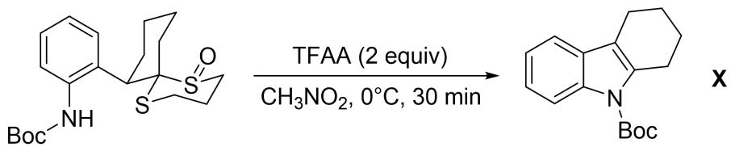

4-2-1 写出反应产生的 2 种副产物，其中一种含有二硫键。

4-2-2 给出该反应的所有关键中间体。

4-2-3 除此之外，利用亚砜作为亲电试剂和氧化剂，可以实现 C-H 键活化氧化。

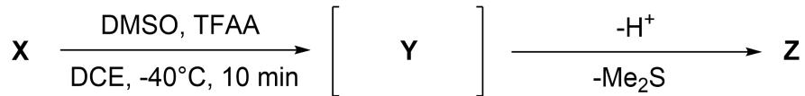

结合以上反应，画出 Y 和 Z 的结构简式。

4-3 由于 S-O 键易于断裂，该过程也可能发生在一些周环反应中。观察如下反应。

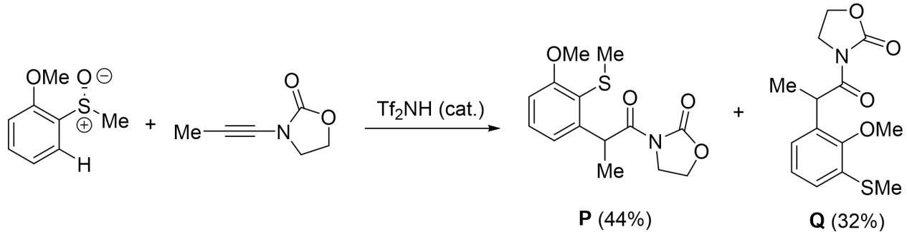

实验1:

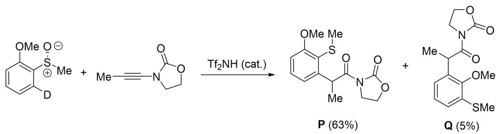

实验 2:

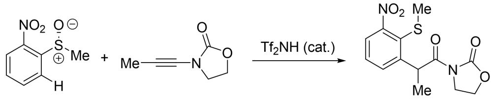

4-3-1 根据上述实验，分别给出生成 P 和 Q 的关键中间体。

4-3-2 解释为何实验 2 仅得到单一产物。

4-4 类似地，下面这个反应常常伴随着非对映选择性，取决于亚砜和双键的构型。

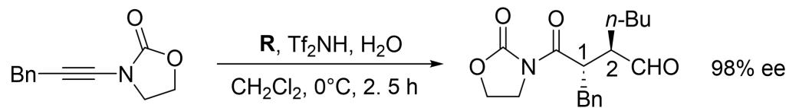

4-4-1 标出产物中 2 个手性碳的绝对构型。

4-4-2 下列选项中可以作为反应物 R 的是:

(a)

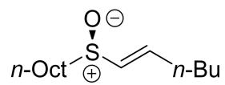

(b)

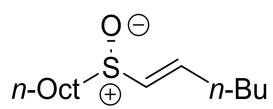

(c)

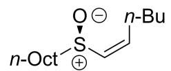

4-4-3 画出形成 $C_{1}-C_{2}$ 碳碳键一步的过渡态结构。

(d)

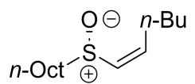

### 第 4 题（14分）基于芳环的重排反应

基于三价碘的重排反应已经得到广泛应用，以下是其中一例：

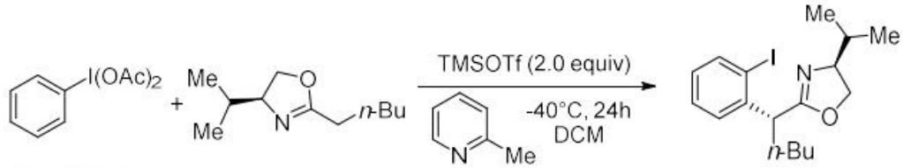

4-1 指出其发生的周环反应的反应类型。

4-2 画出上述反应所有关键中间体的结构简式。

4-3 亚砜在 $\mathrm{Tf}_2\mathrm{O}$ 处理下可以发生类似的反应，近日浙江师范大学某课题组联合中国科学院大学探索了基于以上的类似反应，该方法具有很好的适应性，可在低温下发生。如下反应得到了离子化合物A，生成A的过程经历了一步[5,5]- $\sigma$ 重排反应。

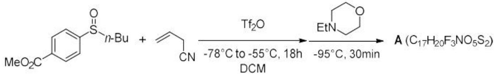

4-3-1 说明该反应为何能够在低温下进行。

4-3-2 给出产物 A 的结构并画出生成 A 的一步 $[5,5]-\sigma$ 重排反应的过渡态的结构。

4-3-3 用不同的试剂进一步处理该底物可以不同的产物，给出以下反应产物 B 和 C 的结构简式，不要求立体化学。

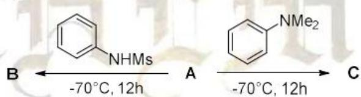

4-4 基于上述反应的反应机理，给出以下反应的产物。

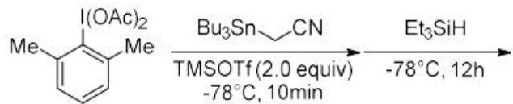

注意，思考 TMSOTf 的作用，它不一定是作为反应物出现的，也有可能是帮助后处理或者帮助离去作用的。同时，注意最后一题三乙基氢化硅的还原位点？这是一个动力学产物还是个热力学产物呢？

## 参考答案

机硫化合物在合成中扮演重要的角色,而亚砜因其独特的极化结构,往往在发生重排反应的同时引发分子内的氧化还原反应。9-1Pummerer重排是一类经典的人名反应,常被用于硫原子α位的修饰,以下是一个例子。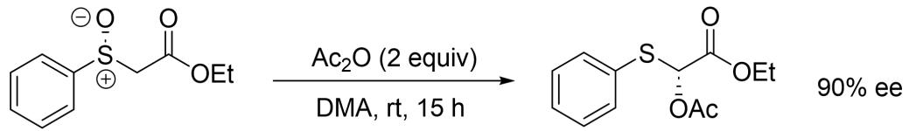给出关键中间体,并解释该反应具有较高立体选择性的原因。</td></tr><tr><td>9-1(本小问共5分)</td></tr><tr><td>中间体: ⛔【配图缺失（源未导出）】 (4分,每个中间体2分)原因:第二个产物直接经过[2,3]-σ迁移得到产物(1分)第二个中间体写成碳硫双键,也得分;解释写五元环过渡态锁定构象,也得分</td></tr><tr><td>9-2Yorimitsu运用Pummerer碎裂化反应实现了吲哚环的合成。</td></tr><tr><td>9-2-1写出反应产生的2种副产物,其中一种含有二硫键。</td></tr><tr><td>9-2-1(本小问共2分)</td></tr><tr><td>(2分,每个副产物1分)</td></tr><tr><td>9-2-2给出该反应的所有关键中间体。</td></tr></table>
##

> ⛔ **配图缺失（源未导出）**：图 `images/79dd94da7e2f694c576332d4379c77cd1a66d4f0daae13d402e6378ce0926576.jpg` 在源 `_images/` 与 OCR 原始产物 `mineru_raw/` 中均未找到，需对照源 PDF 补图。
## 知识点映射

- （待人工校准）

> ⚠️ **自动拆卡标记**：`subject_module`/`difficulty` 为关键词粗判，答案数值与单位**尚未经人工复核**（OCR 原文逐字转录，可能保留原卷笔误）。