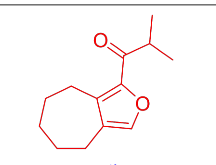

# 题-GM-01-09-MeyerSchuster重

## 题目

### 第 9 题 （24分） Meyer-Schuster 反应

Meyer-Schuster 重排指的是酸催化下炔丙醇转化至不饱和(醛)酮的反应：

9-1画出如下反应的产物。

9-2 具有更有复杂官能团的亲核试剂从而可以得到更复杂的产物。一种方法是采用催化量的Lewis酸催化该反应，考虑如下的转化画出其产物结构。

OH Ph -N BF3 OEt2(3O, m01%) X Me Ph = C24H21NO Ph

9-3由于产生的不饱和(醛)酮仍具有一定的活性， 在如下这个例子中可以发生串联反应从而得到较为复杂的重排产物：

画出该反应的关键中间体。

9-4早期研究该反应时， 研究人员研究了如下底物的反应：

而当使用碱的时候， 得到的骨架又发生了较大变化：

考虑酸性条件下得到的产物机理， 画出用碱得到的产物的结构， 已知其结构含有八元环。

先思考：这个本体反应的步骤是什么？生成炔丙基碳正离子之后发生是什么反应？中间体有什么性质？所以在9-2里面是苯基叠氮烯的哪端发生反应？善于运用标号来思考问题。

## 参考答案

第9题（24分）Meyer-Schuster反应

9-1 画出如下反应的产物。

9-1（本小问共4分）

(4 分)

9-2（本小问共4分）

(4 分)

画出该反应的关键中间体。
9-3（本小问共12分）
                   (共12分,各2分)    9-4早期研究该反应时,研究人员研究了如下底物的反应:        而当使用碱的时候,得到的骨架又发生了较大变化:        考虑酸性条件下得到的产物机理,画出用碱得到的产物的结构,已知其结构含有八元环。    9-4(本小问共4分)        (4分)   

> ✅ 配图已回补（2026-09-28 图片完整性核查）：5 张由 OCR 原始产物 `mineru_raw/.../ocr/images/` 按 hash 找回，已补入卡片 `images/`。
## 知识点映射

- （待人工校准）

> ⚠️ **自动拆卡标记**：`subject_module`/`difficulty` 为关键词粗判，答案数值与单位**尚未经人工复核**（OCR 原文逐字转录，可能保留原卷笔误）。