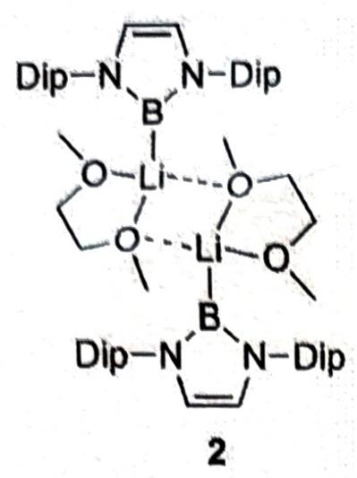
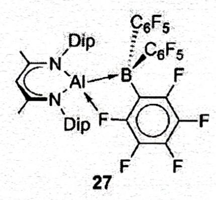
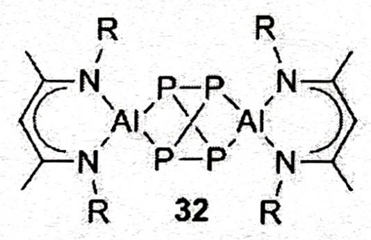
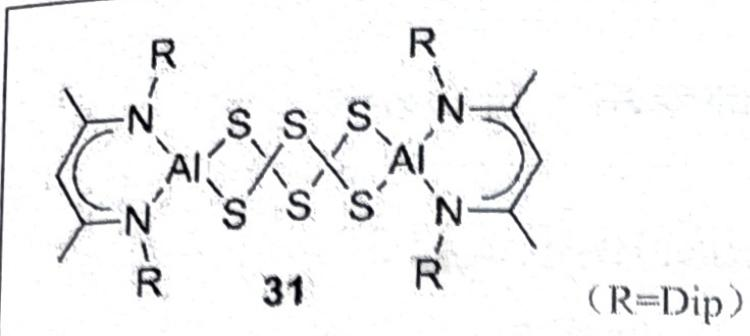
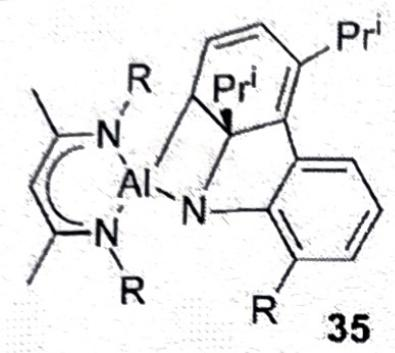
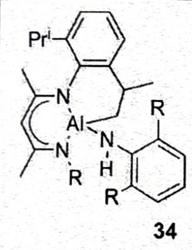

# 题-GM-05-03-高反应性物质的稳定化和分离长

## 题目

### 第 3 题（18分， $11\%$ ）主族元素的类卡宾杂环

高反应性物质的稳定化和分离长期以来一直是化学研究的主题。第13族和第14族元素的卡宾杂环。这些物种的统一特征是中心元素的双重性质，它有一个孤对电子和一个形式上空的 $\pi$ 轨道。因此，这些物质不仅可以表现出其他低价物质的预期亲电反应性，还可以在元素中

学至关重要，而它们的反应性也导致其在合成和材料化学、催化研究等方面的应用。

3-1 将 1 用 Li/C $_{10}$ H $_{8}$ 溶液处理，得到了一个化合物，其为二聚体，且 Li 为四配位（提示：注意溶剂化）。画出产物的结构，指出其中 B 元素的价态。（DME：二甲醚乙二醇）

3-2 下图所示的化合物可以与 $\mathrm{B}(\mathrm{C}_6\mathrm{F}_5)_3$ 发生反应，产物中的 Al 满足八隅律，画出产物结构。

3-3 事实上, 化合物可以发生多样的反应 (以下 $\mathrm{R} = \mathrm{Me}$ ), 画出以下反应产物结构:

3-3-122 与 $\mathrm{P_4}$ 2:1 反应，打开了部分 P-P 键，产物具有 $\mathrm{D}_{2\mathrm{d}}$ 对称性。

3-3-222 与 $\mathrm{S}_{8}$ 反应类似，不同的是产物中仅含6个S原子。

3-3-322 与 $\mathrm{Ar}^{\prime}\mathrm{N}_{3}$ ( $\mathrm{Ar}^{\prime} = 2,6-$ (Dip) $_{2}\mathrm{C}_{6}\mathrm{H}_{3}$ ) 反应, 首先生成 $\mathrm{Al} = \mathrm{N}$ 中间体, 随后发生了一步分子内[2+2]反应得到最终产物, 给出最终产物的结构。

3-3-4 上一问中还经历相同的中间体生成了一个不存在小环的产物，请给出其结构（不含五元环）。

## 参考答案

高反应性物质的稳定化和分离长期以来一直是化学研究的主题。第13族和第14族元素的卡宾杂环。这些物种的统一特征是中心元素的双重性质，它有一个孤对电子和一个形式上空的π轨道。因此，这些物质不仅可以表现出其他低价物质的预期亲电反应性，还可以在元素中心表现出亲核反应性。事实上，这些物质对于更广泛地理解主族化学至关重要，而它们的反应性也导致其在合成和材料化学、催化研究等方面的作用。

致其在合成和材料化学、催化研究等方面的应用。

3-1 将 1 用 Li/C $_{10}$ H $_{8}$ 溶液处理, 得到了一个化合物, 其为二聚体,且 Li 为四配位 (提示: 注意溶剂化)。画出产物的结构, 指出其中 B 元素的价态。(DME: 二甲醚乙二醇)

$$
\mathrm{Dip} - \mathrm{N} \xrightarrow [ \mathrm{Br} ]{\text {   }} \mathrm{N} - \mathrm{Dip} \quad \xrightarrow [ \mathrm{DME} , - \mathrm{LiBr} ]{\mathrm{Li} , \mathrm{C} _ {10} \mathrm{H} _ {8}}
$$

## 3-1（本小问共3分）

(2 分) B 为 +1 价 (1 分)

3-2 下图所示的化合物可以与 $\mathrm{B}(\mathrm{C}_{6}\mathrm{F}_{5})_{3}$ 发生反应, 产物中的 Al 满足八隅律, 画出产物结构。

## 3-2（本小问共3分）

3-3 事实上, 化合物可以发生多样的反应 (以下 $\mathrm{R} = \mathrm{Me}$ ), 画出以下反应产物结构: 3-3-122 与 $\mathrm{P}_{4} 2:1$ 反应, 打开了部分 P-P 键, 产物具有 $\mathrm{D}_{2 \mathrm{~d}}$ 对称性。

## 3-3-1（本小问共3分）

3-3-222 与 $\mathrm{S}_{8}$ 反应类似, 不同的是产物中仅含 6 个 S 原子。 3-3-2 (本小问共 3 分)

3-3-322 与 Ar'N₃（Ar'=2,6-(Dip)₂C₆H₃）反应，首先生成 Al=N 中间体，随后发生了一步分子内 [2+2] 反应得到最终产物，给出最终产物的结构。

## 3-3-3（本小问共3分）

3-3-4 上一问中还经历相同的中间体生成了一个不存在小环的产物, 请给出其结构 (不含五元环)。<nl>
3-3-4 (本小问共 3 分)

## 知识点映射

- （待人工校准）

> ⚠️ **自动拆卡标记**：`subject_module`/`difficulty` 为关键词粗判，答案数值与单位**尚未经人工复核**（OCR 原文逐字转录，可能保留原卷笔误）。