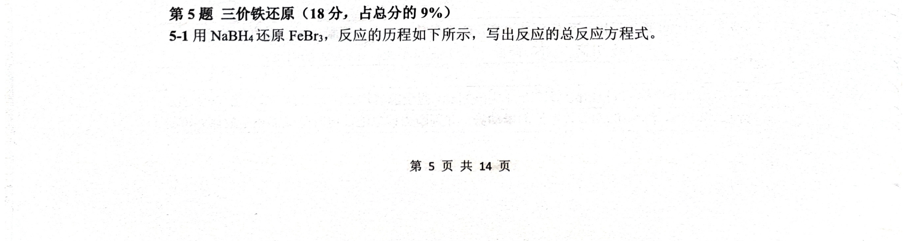
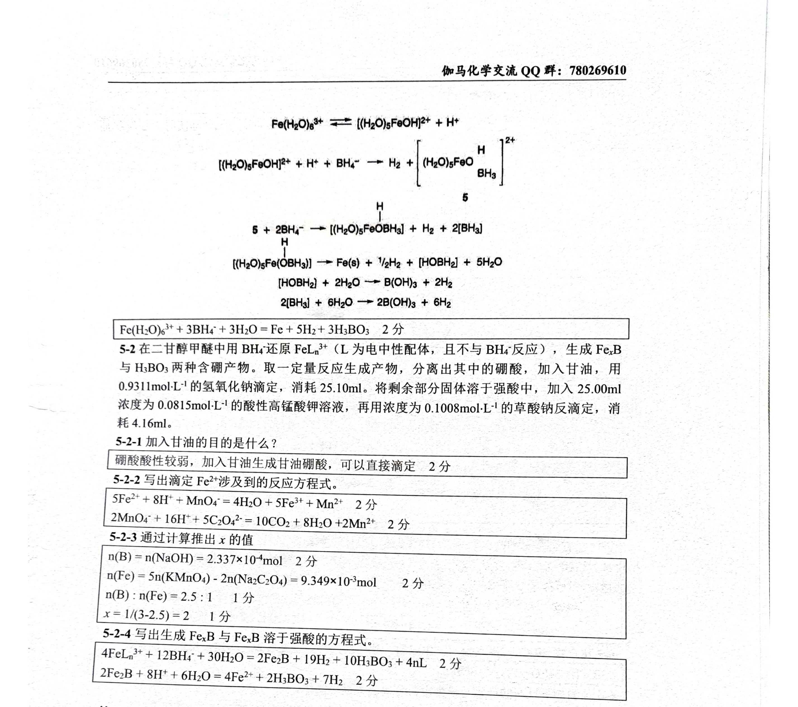

# 题-GM-2026-05-51用还原反应的历程如下所示

## 题目

### 第 5 题 三价铁还原（18 分，占总分的 9%）

5-1 用 $NaBH_{4}$ 还原 $FeBr_{3}$ ，反应的历程如下所示，写出反应的总反应方程式。

5-2 在二甘醇甲醚中用 $BH_{4}^{-}$ 还原 $FeL_{n}^{3+}$ （L 为电中性配体，且不与 $BH_{4}^{-}$ 反应），生成 $Fe_{x}B$ 与 $H_{3}BO_{3}$ 两种含硼产物。取一定量反应生成产物，分离出其中的硼酸，加入甘油，用 $0.9311\,mol\cdot L^{-1}$ 的氢氧化钠滴定，消耗 25.10ml。将剩余部分固体溶于强酸中，加入 25.00ml 浓度为 $0.0815\,mol\cdot L^{-1}$ 的酸性高锰酸钾溶液，再用浓度为 $0.1008\,mol\cdot L^{-1}$ 的草酸钠反滴定，消耗 4.16ml。

5-2-1 加入甘油的目的是什么？

老生常谈。另外还可以加什么？

5-2-2 写出滴定 $Fe^{2+}$ 涉及到的反应方程式。

$$
\begin{array}{r l}{F e ^ {2 +} + M n O _ {4} ^ {-}}&{\rightarrow M n ^ {2 +} + F e ^ {3 +}}\\{C _ {2} O _ {4} ^ {2 -} + M n V _ {4} ^ {-}}&{\rightarrow C O _ {2} + M n ^ {2 +}}\end{array}
$$

5-2-3 通过计算推出 $x$ 的值

5-2-4 写出生成 $Fe_{x}B$ 与 $Fe_{x}B$ 溶于强酸的方程式。

合金的情况难以考虑，那就先分开考虑单质的情况。这里的酸最可能是什么酸？

$$
F e _ {x} B \rightarrow F e ^ {2 +} + B \downarrow / B (O H) _ {3}
$$

## 参考答案

（源：伽马2026五一·模拟2答案 · 第 5 题；按原册裁区，保留结构图与公式）

> 📌 据源答案册裁区回填（OCR 定位题界）。

## 知识点映射

- （待人工校准）

> ⚠️ **自动拆卡标记**：`subject_module`/`difficulty` 为关键词粗判，答案数值与单位**尚未经人工复核**（OCR 原文逐字转录，可能保留原卷笔误）。