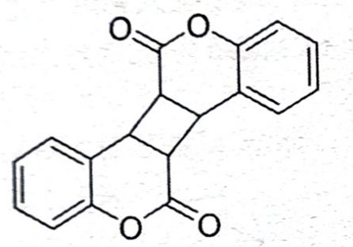
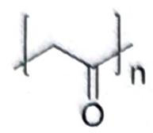
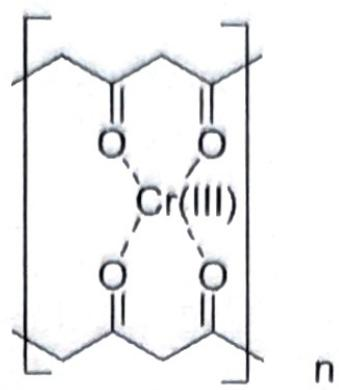
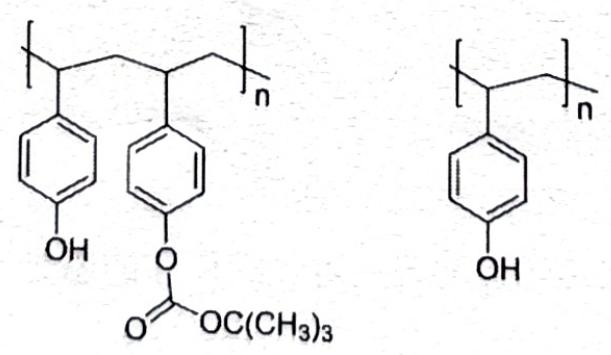

# 题-GM-2026-06-61光敏分子611反式二苯乙

## 题目

### 第 6 题 (26 分, 13%) 光反应与光刻胶

## 6.1 光敏分子

6.1.1 反式二苯乙烯的光异构化非常经典：

通过不同孔结构沸石, 可以调节吸附分子的运动。以下两种沸石中, 只有一种能顺利发生光异构化, 为 ( a )。

a）X型分子筛

b）ZSM-5 沸石

6.1.2 香豆素（Coumarin）也是一种光敏化合物，能在不同波长的光照下发生可逆的二聚：

画出二聚产物的结构，并比较 1 号与 2 号光的波长大小。

Fig. 7 Complete photocycle of CPD repair by photolyase. $^{32}$ All resolved elementary steps of CPD (thymine dimer) repair on the ultrafast time scales and the elucidated molecular mechanism.

## 6.2 光固化反应

“重铬酸盐+亲水性聚合物”有感光效果,源于铬的酸根离子中,仅 $\mathrm{HCrO}_{4}^{-}$ 是光致活化的,能吸收 250、350 和 $440 \mathrm{~nm}$ 附近的光而激发。聚乙烯醇光固化的反应机理如下:

实际操作时，以氨水、铬酸盐与聚乙烯醇配置成可长期保存的感光液；使用时压制成膜，见光自动固化。

6.2.1 给出固化过程中间产物 X。画出最终产物 Y 的结构片段，体现其中 Cr 为四配位的双链单元。

X 的推断应该不难，但请思考其中金属离子的作用？

6.2.3 分别判断以下高分子能否与铬酸盐发生类似的光固化反应:

a）聚丙烯    b）聚甲氧基二甲醚    c）聚乙二酸乙二醇酯

6.3 光刻胶 又称光致抗蚀剂，由感光树脂、增感剂和溶剂 3 种主要成分组成；通过紫外光、电子束、离子束、X 射线等的照射或辐射，其溶解度发生变化，形成耐蚀薄膜。

KrF 248 nm 光刻胶由 IBM 和日本科学家 Ito 发展，其中加入了光致产酸剂，在光辐射下分解产生质子。在后烘过程中，酸可以催化分解树脂主链、脱除保护基团，之后质子会被重新释放，继续起催化作用。

6.3.1 该光刻胶典型的成像原理如下：聚（4-乙烯基苯酚）与二碳酸二叔丁酯反应，生成聚合物 1；光照诱发产酸剂 PAG 产生质子，催化 1 转化成聚合物 2；最后加入稀碱液完成处理。已知聚合物 1 重复单元的分子量大于 2 的两倍，分别写出 1 和 2 的结构(无需考虑端基)。

【注：示意图中反应物也为聚（4-乙烯基苯酚）】

拓展: 产酸剂光致生酸的机理? (化学式为 $\left(\mathrm{Ph}_{3} \mathrm{~S}\right) (\mathrm{OTf})$

6.3.2 在以上过程中，属于“显影”的是（）。a）步骤1 b）步骤2 c）步骤3 产酸剂的存在会（）光照所需的能量，（）光刻胶的光敏性。a）提高 b）降低

6.3.3 由于 KrF 248 nm 光刻胶的一些缺陷，IBM 公司进一步设计出 ArF 光刻胶，其使用聚丙烯酸酯的共聚物。上文提到的缺陷，最主要的因素为（）。

a）聚合物分子量过大
b）苯环结构的强吸收
c）需要外部提供能量
d）需要另加入产酸剂

$pn-S_{ph}^{7+} \rightarrow pn-S_{ph}^{+} \rightarrow pn-S_{ph}^{+}$

$pn^{-S} \text{ } \ce{C6H5 -> C6H5 + H+}$

## 参考答案

📎 **答案出处**：源卷答案（含结构式图）已随卡；OCR 原文转录，数值未逐条复核。

> 源：五一伽马杭州答案4.md（第 6 题）

a) 2分

a) 2分
可供分子翻转的空间，b更小

波长 $1 > 2$

作用:使体系保持碱性，抑制 $HCrO_{4}^{-}$ 离子的产生 2 分

不能 不能 不能

答对 2 个 1 分，答对 3 个全分 必须能提供 H $^{+}$ 才可能发生光固化

各3分

c) 1 分 b) 1 分 a) 1 分

b) 2 分

## 知识点映射

- （待人工校准）

> ⚠️ **自动拆卡标记**：`subject_module`/`difficulty` 为关键词粗判，答案数值与单位**尚未经人工复核**（OCR 原文逐字转录，可能保留原卷笔误）。