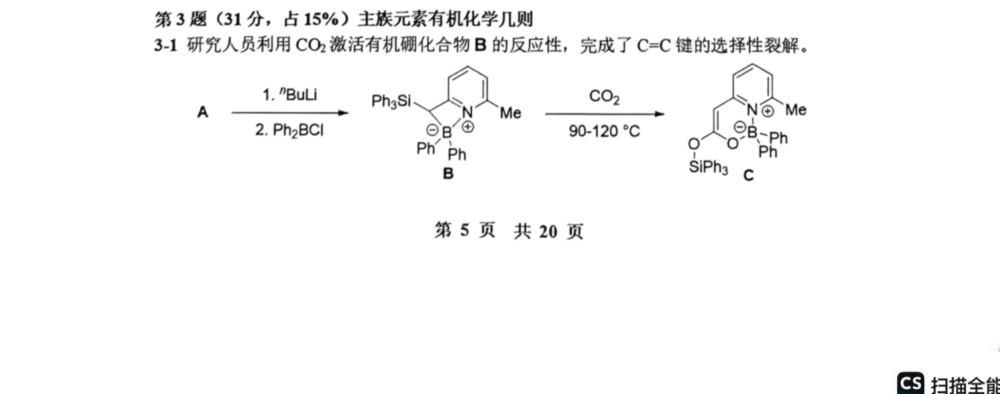
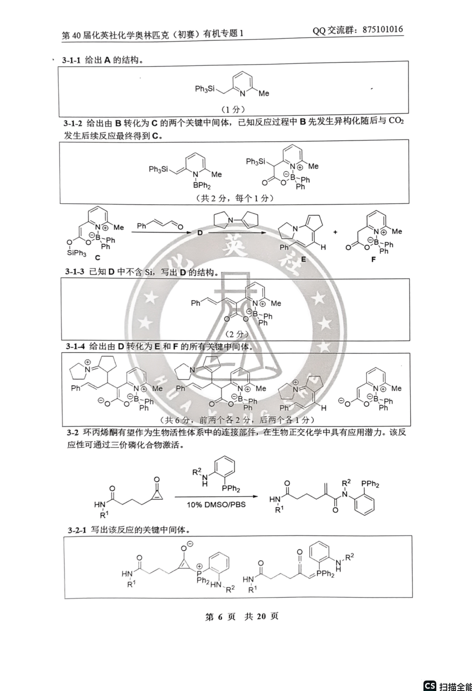
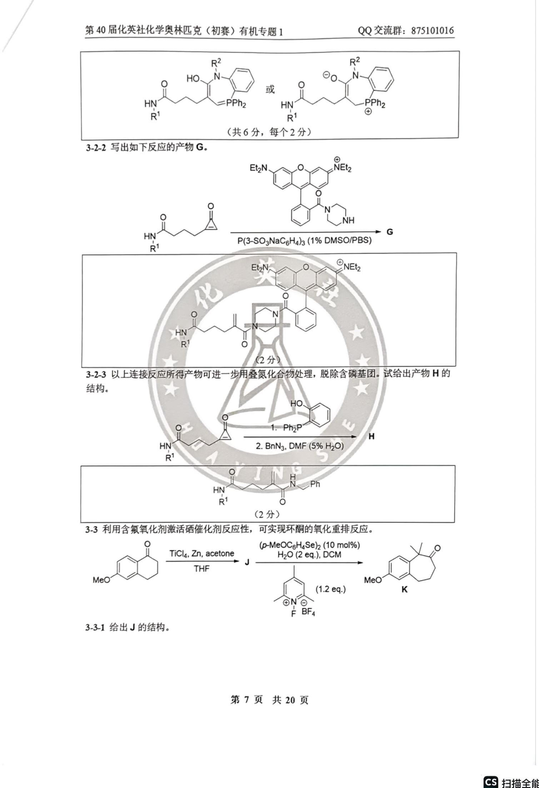
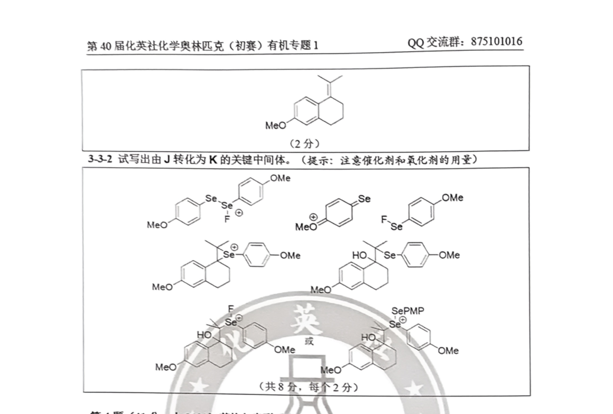

# 题-HYS-01-03-31研究人员利用激活有机硼化

## 题目

### 第 3 题（31分，占 $15\%$ ）主族元素有机化学几则

3-1 研究人员利用 $CO_{2}$ 激活有机硼化合物 B 的反应性，完成了 C=C 键的选择性裂解。

3-1-1 给出 $\mathbf{A}$ 的结构。

3-1-2 给出由 B 转化为 C 的两个关键中间体，已知反应过程中 B 先发生异构化随后与 $CO_{2}$ 发生后续反应最终得到 C。

3-1-3 已知 D 中不含 Si，写出 D 的结构。

3-1-4 给出由 D 转化为 E 和 F 的所有关键中间体。

3-2 环丙烯酮有望作为生物活性体系中的连接部件，在生物正交化学中具有应用潜力。该反应性可通过三价磷化合物激活。

3-2-1 写出该反应的关键中间体。

3-2-2 写出如下反应的产物 G。

3-2-3 以上连接反应所得产物可进一步用叠氮化合物处理，脱除含磷基团。试给出产物 H 的结构。

3-3 利用含氟氧化剂激活硒催化剂反应性，可实现环酮的氧化重排反应。

3-3-1 给出 J 的结构。

3-3-2 试写出由 J 转化为 K 的关键中间体。（提示：注意催化剂和氧化剂的用量）

## 参考答案

（源：化英社《第40届初赛·有机专题1》答案 · 第 3 题；按原册裁区，保留结构图与公式）

> 📌 据源答案册逐题裁区回填（OCR 定位「第N题」边界）。

## 知识点映射

- （待人工校准）

> ⚠️ **自动拆卡标记**：`subject_module`/`difficulty` 为关键词粗判，答案数值与单位**尚未经人工复核**（OCR 原文逐字转录，可能保留原卷笔误）。