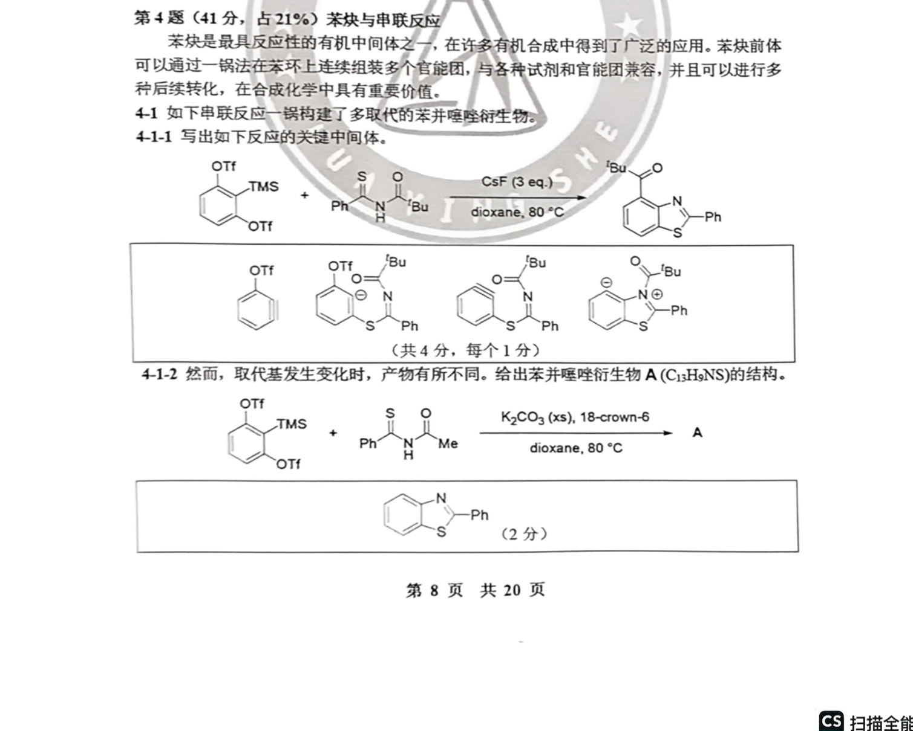
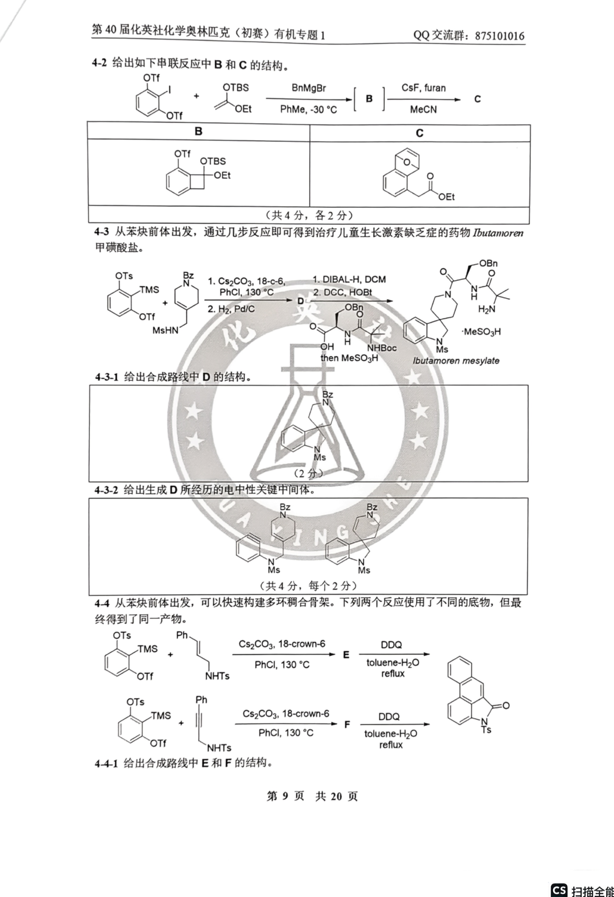
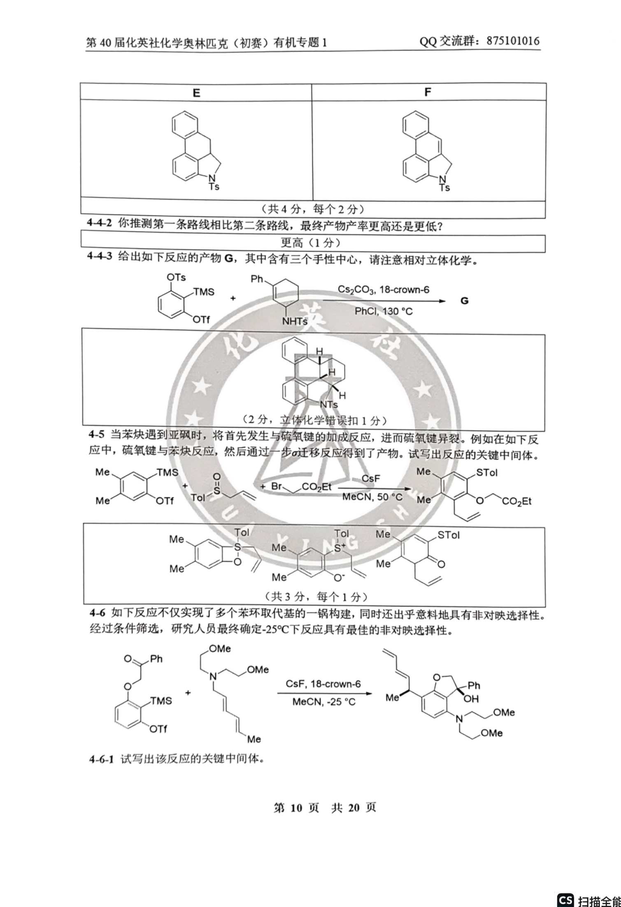
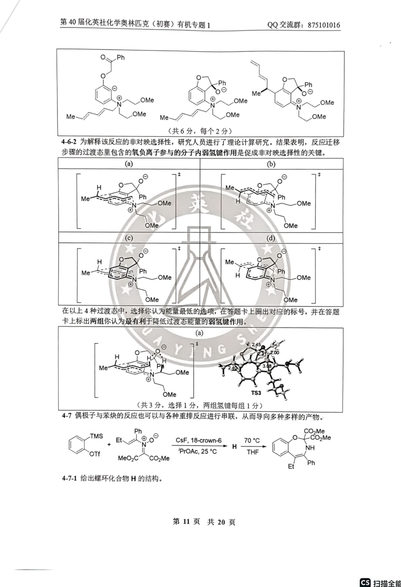
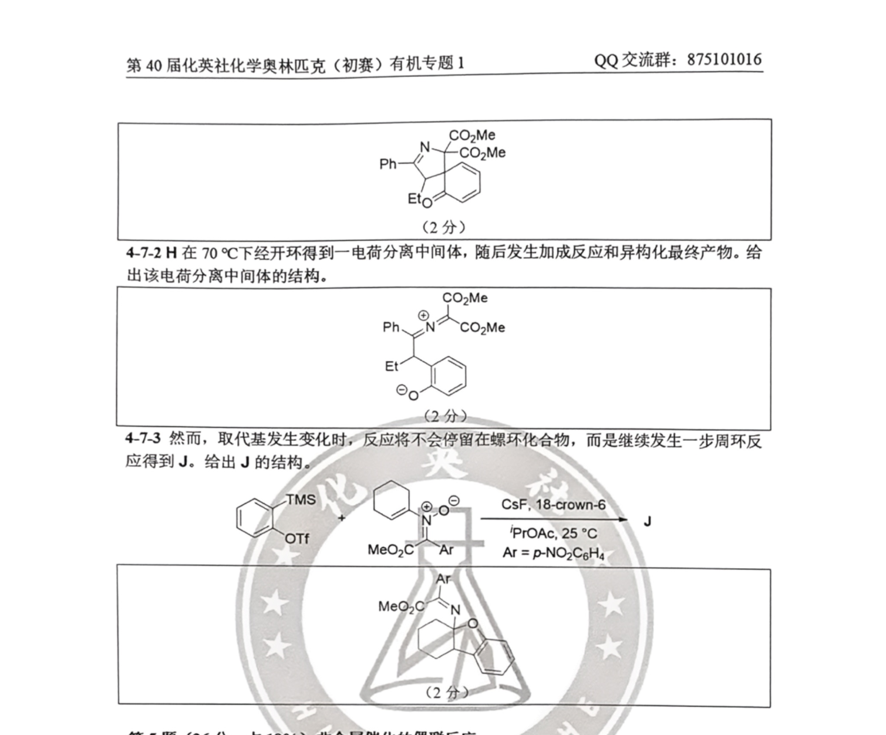

# 题-HYS-01-04-苯炔是最具反应性的有机中间体~2

## 题目

### 第 4 题（41分，占 $21\%$ ）苯炔与串联反应

苯炔是最具反应性的有机中间体之一，在许多有机合成中得到了广泛的应用。苯炔前体可以通过一锅法在苯环上连续组装多个官能团，与各种试剂和官能团兼容，并且可以进行多种后续转化，在合成化学中具有重要价值。

4-1 如下串联反应一锅构建了多取代的苯并噻唑衍生物。

4-1-1 写出如下反应的关键中间体。

4-1-2 然而，取代基发生变化时，产物有所不同。给出苯并噻唑衍生物 A(C₁₃H₉NS)的结构。

4-2 给出如下串联反应中 B 和 C 的结构。

4-3 从苯炔前体出发，通过几步反应即可得到治疗儿童生长激素缺乏症的药物 Ibutamoren 甲磺酸盐。

4-3-1 给出合成路线中 D 的结构。

4-3-2 给出生成 D 所经历的电中性关键中间体。

4-4 从苯炔前体出发，可以快速构建多环稠合骨架。下列两个反应使用了不同的底物，但最终得到了同一产物。

4-4-1 给出合成路线中 E 和 F 的结构。

4-4-2 你推测第一条路线相比第二条路线，最终产物产率更高还是更低？

4-4-3 给出如下反应的产物 G，其中含有三个手性中心，请注意相对立体化学。

4-5 当苯炔遇到亚砜时，将首先发生与硫氧键的加成反应，进而硫氧键异裂。例如在如下反应中，硫氧键与苯炔反应，然后通过一步 $\sigma$ 迁移反应得到了产物。试写出反应的关键中间体。

4-6 如下反应不仅实现了多个苯环取代基的一锅构建，同时还出乎意料地具有非对映选择性。经过条件筛选，研究人员最终确定-25℃下反应具有最佳的非对映选择性。

4-6-1 试写出该反应的关键中间体。

4-6-2 为解释该反应的非对映选择性，研究人员进行了理论计算研究。结果表明，反应迁移步骤的过渡态里包含的氧负离子参与的分子内弱氢键作用是促成非对映选择性的关键。在以上4种过渡态中，选择你认为能量最低的选项，在答题卡上圈出对应的标号，并在答题卡上标出两组你认为最有利于降低过渡态能量的弱氢键作用。

4-7 偶极子与苯炔的反应也可以与各种重排反应进行串联，从而导向多种多样的产物。

4-7-1 给出螺环化合物 H 的结构。

4-7-2 H 在 $70^{\circ}$ C 下经开环得到一电荷分离中间体，随后发生加成反应和异构化最终产物。给出该电荷分离中间体的结构。

4-7-3 然而，取代基发生变化时，反应将不会停留在螺环化合物，而是继续发生一步周环反应得到 J。给出 J 的结构。

## 参考答案

（源：化英社《第40届初赛·有机专题1》答案 · 第 4 题；按原册裁区，保留结构图与公式）

> 📌 据源答案册逐题裁区回填（OCR 定位「第N题」边界）。

## 知识点映射

- （待人工校准）

> ⚠️ **自动拆卡标记**：`subject_module`/`difficulty` 为关键词粗判，答案数值与单位**尚未经人工复核**（OCR 原文逐字转录，可能保留原卷笔误）。