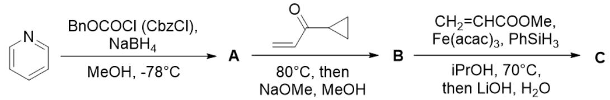
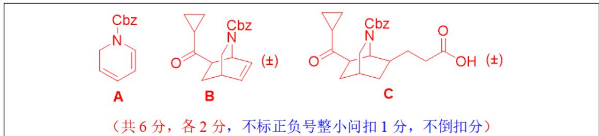
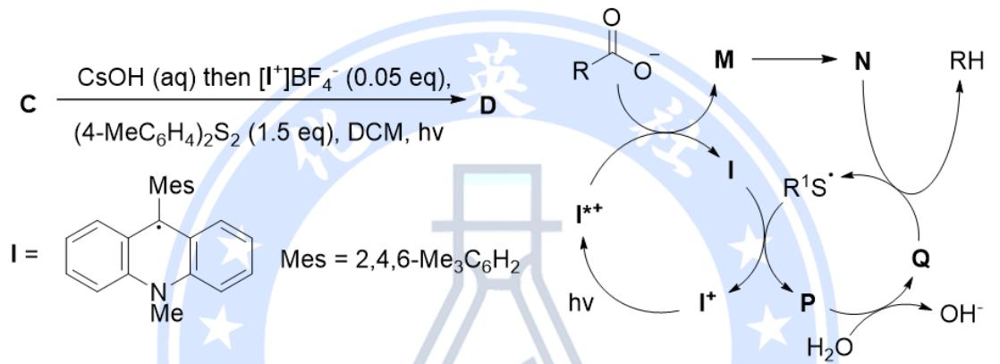
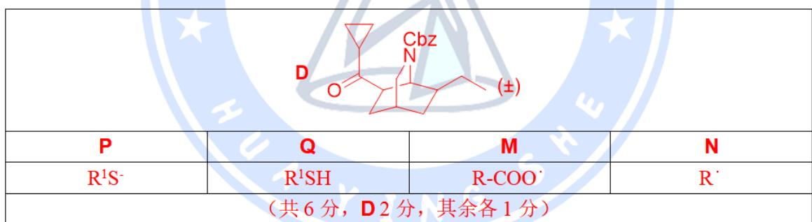
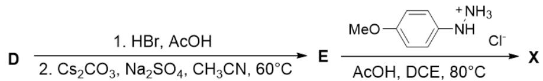
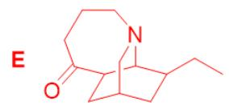
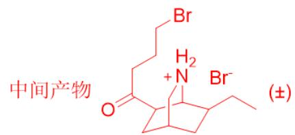

# 题-HYS-01-09-伊博加生物碱是一类主要来自热

## 题目

### 第 9 题 生物碱的合成（18分，占 $10\%$ ）

伊博加生物碱是一类主要来自热带雨林植物的单萜吲哚生物碱，包含数百种成员。其中，伊博加因（X）由于具有显著的抗成瘾活性，备受药物化学研究者关注。近日，来自美国的科研人员报道了以吡啶为起始原料七步合成X的方法。

9-1 科学家首先通过周环反应在 B 中构筑了 X 所含有的[2.2.2]桥环环系，随后在由 B 到 C 的反应中借助 Cbz 保护基中的羰基控制了桥环与丙烯酸甲酯加成的区域选择性。画出 A、B、C 的结构。

9-2 从 C 到 D 经历了一步光氧化还原脱羧反应，引入了 X 中所含有的 Et 基团。画出 D 的结构。写出光氧化还原循环中间体 M、N、P、Q 的化学式。

9-3 以 D 为底物，经历两次环系调整即可得到目标产物 X 的结构。画出 E 的结构和生成 E 经历的关键盐类中间产物。写出由 E 到 X 的关键一步反应的种类。

## 参考答案

📎 **答案出处**：源卷答案（含结构式图）已随卡；解答以源卷图给出，文字未逐条复核。

> 源：第40届化英社化学奥林匹克（初赛）春季联考1答案1.md

**9-1 解答**

**9-2 解答**

**9-3 解答**

E 到 X：3,3-σ迁移

## 知识点映射

- （待人工校准）

> ⚠️ **自动拆卡标记**：`subject_module`/`difficulty` 为关键词粗判，答案数值与单位**尚未经人工复核**（OCR 原文逐字转录，可能保留原卷笔误）。