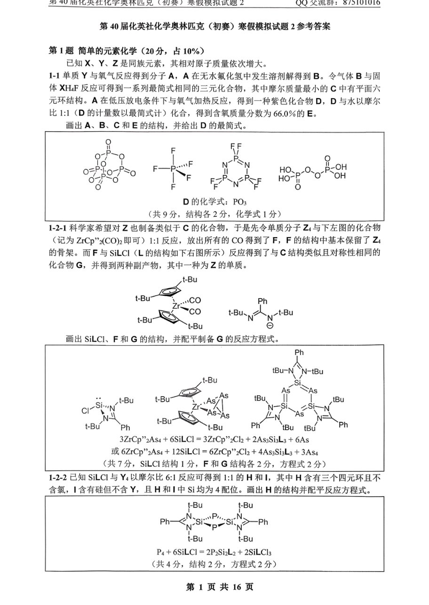

# 题-HYS-02-01-已知XYZ是同族元素其相对原

## 题目

### 第 1 题 简单的元素化学 (20分， 占 10%)

已知X、Y、Z是同族元素， 其相对原子质量依次增大。

1-1单质Y与氧气反应得到分子A，A在无水氟化氢中发生溶剂解得到B。令气体B与固体XH₄F 反应可得到一系列最简式相同的三元化合物，其中摩尔质量最小的C 中有平面六元环结构。A在低压放电条件下与氧气加热反应，得到一种紫色化合物D，D与水以摩尔比1:1（D的计量数以最简式计） 化合， 得到含氧质量分数为66.0%的E。

画出A、 B、 C和E的结构， 并给出D的最简式。

1-2-1科学家希望对Z也制备类似于C的化合物， 于是先令单质分子Z4与下左图的化合物（记为ZrCp²(CO)2即可）1:1反应，放出所有的CO得到了F，F的结构中基本保留了Z4的骨架。而F与SiLCI（L的结构如下右图所示）反应得到了与C结构类似且对称性相同的化合物G，并得到两种副产物， 其中一种为Z的单质。

t-Bu   
t-Bu C Ph 1co t-Bu t-Bu   
t-Bu t-Bu

画出 SiLCI、F和G的结构， 并配平制备G的反应方程式。1-2-2已知SiLCI与Y4以摩尔比 6:1反应可得到1:1的H和I，其中H含有三个四元环且不含氯， I含有硅但不含Y，且H和I中Si均为4配位。 画出H的结构并配平反应方程式。

## 参考答案

📎 **答案出处**：源卷**参考答案**页（第 8 页，**印刷体**）已随卡；1-1／1-2 的结构式与反应方程式见图。

## 知识点映射

- （待人工校准）

> ⚠️ **自动拆卡标记**：`subject_module`/`difficulty` 为关键词粗判，答案数值与单位**尚未经人工复核**（OCR 原文逐字转录，可能保留原卷笔误）。